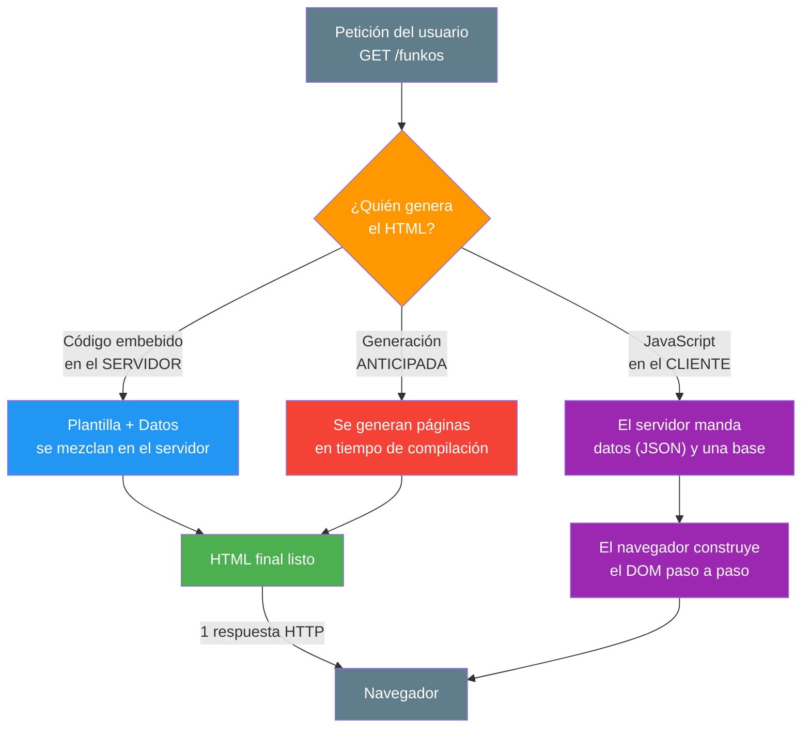
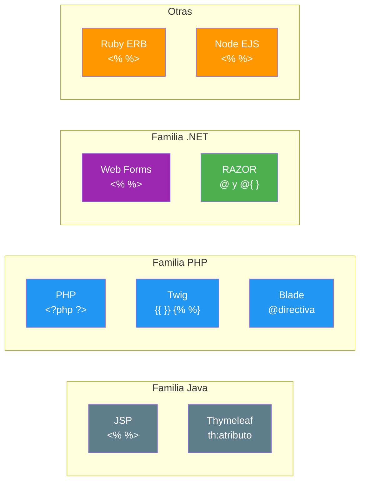
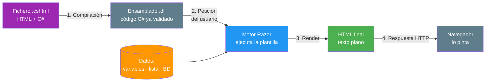
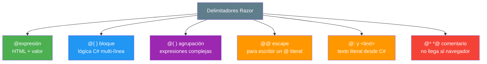
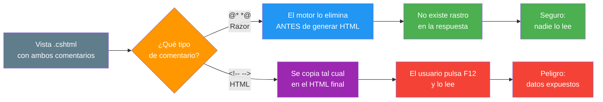
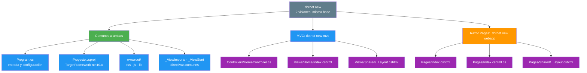
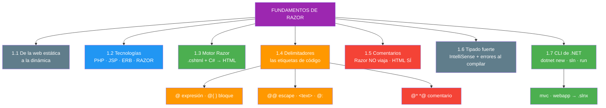

- [1. Fundamentos de Razor: Páginas Dinámicas con Código Embebido](#1-fundamentos-de-razor-páginas-dinámicas-con-código-embebido)
  - [1.1. De la Web Estática a la Web Dinámica](#11-de-la-web-estática-a-la-web-dinámica)
    - [1.1.1. La Web Estática](#111-la-web-estática)
    - [1.1.2. La Web Dinámica](#112-la-web-dinámica)
    - [1.1.3. Mecanismos de Generación de Páginas](#113-mecanismos-de-generación-de-páginas)
  - [1.2. Tecnologías Asociadas a las Páginas Dinámicas](#12-tecnologías-asociadas-a-las-páginas-dinámicas)
    - [1.2.1. El Patrón Común: Código Embebido en el Servidor](#121-el-patrón-común-código-embebido-en-el-servidor)
    - [1.2.2. Comparativa de Tecnologías](#122-comparativa-de-tecnologías)
  - [1.3. El Motor Razor: Del Archivo .cshtml al HTML](#13-el-motor-razor-del-archivo-cshtml-al-html)
    - [1.3.1. ¿Qué es Razor?](#131-qué-es-razor)
    - [1.3.2. El Proceso de Renderizado](#132-el-proceso-de-renderizado)
  - [1.4. Delimitadores: Etiquetas para Incluir Código](#14-delimitadores-etiquetas-para-incluir-código)
    - [1.4.1. Expresiones con @](#141-expresiones-con-)
    - [1.4.2. Bloques de Código con @{ }](#142-bloques-de-código-con--)
    - [1.4.3. Texto Literal, Escape y Transiciones](#143-texto-literal-escape-y-transiciones)
    - [1.4.4. Todos los Delimitadores en un Solo Archivo](#144-todos-los-delimitadores-en-un-solo-archivo)
  - [1.5. Comentarios en las Vistas](#15-comentarios-en-las-vistas)
  - [1.6. Tipado Fuerte e IntelliSense](#16-tipado-forte-e-intellisense)
  - [1.7. Crear el Proyecto con la CLI de .NET](#17-crear-el-proyecto-con-la-cli-de-net)
    - [1.7.1. Descubrir los Templates Disponibles](#171-descubrir-los-templates-disponibles)
    - [1.7.2. Crear el Proyecto: Dos Visiones, un Comando](#172-crear-el-proyecto-dos-visiones-un-comando)
    - [1.7.3. Qué Estructura Genera la Plantilla](#173-qué-estructura-genera-la-plantilla)
    - [1.7.4. Solución y Ejecución](#174-solución-y-ejecución)
  - [1.8. Buenas Prácticas](#18-buenas-prácticas)
  - [1.9. Reto](#19-reto)


# 1. Fundamentos de Razor: Páginas Dinámicas con Código Embebido

> 💡 **Punto de partida:** Si abres el código fuente de una web como Netflix, ¿por qué cada usuario ve una portada distinta si todos llaman a la misma URL? ¿Quién escribe ese HTML diferente cada vez? ¿Y si te dijera que ese HTML ni siquiera está guardado en el servidor?

En este tema aprenderás a reconocer los **mecanismos de generación de páginas** con código embebido, a situar **Razor** entre las tecnologías existentes, a dominar sus **etiquetas de inclusión de código** y a **montar tu primer proyecto** con la CLI de .NET.

**Objetivos de aprendizaje:**

- Comprender los mecanismos de generación de páginas web con código embebido
- Conocer las tecnologías asociadas a la generación de páginas dinámicas y situar Razor entre ellas
- Dominar las etiquetas de inclusión de código de Razor: `@`, `@{ }`, `@@`, `<text>` y `@:`
- Saber comentar el código de una vista sin que el comentario llegue al navegador

## 1.1. De la Web Estática a la Web Dinámica

Antes de escribir una sola línea de Razor, hay que entender **qué problema resuelve**. Si no, estás aprendiendo una sintaxis sin saber para qué existe.

> 📝 **Nota de la unidad:** en **FunkoApp** vamos a construir un **gestor de Funkos**: mostrarlos, recorrerlos, buscarlos, editarlos, darlos de baja y subir sus fotos. Todo eso empieza aquí, con una **página que se genera sola**. Nada de base de datos todavía: al principio, los datos van escritos en la propia vista.

### 1.1.1. La Web Estática

Una web estática es un conjunto de ficheros `.html`, `.css` y `.js` que **ya están escritos y guardados** en el disco del servidor. Cuando alguien pide una página, el servidor simplemente **copia y envía** ese fichero tal cual está.

- El servidor **no piensa**: solo sirve ficheros
- Todos los visitantes ven **exactamente lo mismo**
- Cambiar algo significa **editar el fichero a mano**

📌 Ejemplo real: una web corporativa de un barrio con "Inicio", "Quiénes somos" y "Contacto". Su contenido cambia una vez al año y lo escribe una persona a mano. Para eso, una web estática es perfecta — y **baratísima**.

### 1.1.2. La Web Dinámica

Una web dinámica **no guarda el HTML**: guarda la **plantilla** y los **datos**. En cada petición, el servidor **construye el HTML en ese momento**, mezclando las dos cosas, y envía el resultado.

| Aspecto | Web estática | Web dinámica |
|---------|--------------|--------------|
| **Qué hay en el servidor** | Ficheros HTML ya escritos | Plantillas + datos |
| **Cuándo se genera el HTML** | Nunca (ya existe) | En **cada petición** |
| **¿Quién lo ve?** | Todos lo mismo | Cada usuario lo suyo |
| **Fuente de datos** | Ninguna | Variables, ficheros, listas, BD |
| **Coste por petición** | Nulo (lectura) | Cálculo (CPU + datos) |
| **Ejemplo** | Folleto digital | Netflix, Instagram, FunkoApp |

> 💡 **Analogía:** Una web estática es un **menú impreso** en una hamburguesería: vale para todos. Una web dinámica es el **cartel LED** que cambia según la hora y lo que queda en la cocina: el marcador (plantilla) es el mismo, pero el mensaje (HTML) cambia todo el rato.

📌 Ejemplo real: **Instagram**. La URL `instagram.com` es la misma para ti y para mí, pero el HTML que llega a tu navegador y al mío es radicalmente distinto: tus followings, tus historias, tu algoritmo. Nadie "guardó" esa página: **se construyó en los 200 ms que tardó tu petición**.

### 1.1.3. Mecanismos de Generación de Páginas

El CCEE **RA2 a)** pide conocer *los mecanismos de generación de páginas con código embebido*. Existen tres familias, y conviene distinguirlas porque Razor pertenece solo a una:



| Mecanismo | Dónde se ejecuta | Ventaja | Riesgo |
|-----------|------------------|---------|--------|
| **Código embebido en el servidor** | Servidor | SEO inmediato, lógica oculta, datos cerca del origen | Carga de CPU en el servidor |
| **Generado en el cliente (SPA)** | Navegador | Interfaz muy reactiva, menos recargas | SEO más complejo, lógica expuesta |
| **Generación anticipada (SSG)** | Compilación | Velocidad máxima, coste mínimo | Contenido menos personalizado |

> 📝 **Nota:** Esta unidad se centra en el **primer mecanismo**, que es el de ASP.NET Core: el HTML se construye en el servidor con **código C# embebido dentro de HTML**. Eso es exactamente lo que hace Razor.

> ⚠️ **Advertencia:** No confundas "dinámico" con "JavaScript". Una página puede ser dinámica **sin una sola línea de JavaScript en el cliente** — la genera entera el servidor. Razor es el ejemplo perfecto.

## 1.2. Tecnologías Asociadas a las Páginas Dinámicas

El CCEE **RA2 b)** pide las *tecnologías asociadas a la generación de páginas web dinámicas*. Razor no es una invención aislada: es la **evolución de .NET** dentro de una familia muy amplia.

### 1.2.1. El Patrón Común: Código Embebido en el Servidor

Todas estas tecnologías comparten la misma idea:

1. Escribes un **fichero de plantilla** que mezcla marcado (HTML) con código
2. El servidor **detecta dónde empieza el código**
3. Lo **ejecuta**, obteniendo valores
4. **Sustituye** esos valores dentro del HTML
5. Envía al navegador **HTML puro**, sin rastro del código

📌 Ejemplo real: **Netflix** usa plantillas del lado del servidor para construir sus páginas antes de enviarlas. **Amazon** hace lo mismo con las fichas de producto: el nombre, el precio y las valoraciones son datos vivos, y el motor de plantillas los inyecta en el HTML en cada visita.

### 1.2.2. Comparativa de Tecnologías



| Tecnología | Lenguaje | Delimitador típico | Fichero |
|------------|----------|--------------------|---------|
| **PHP** | PHP | `<?php ... ?>` y `<?= ... ?>` | `.php` |
| **JSP** | Java | `<% ... %>` y `<%= ... %>` | `.jsp` |
| **ASP clásico** | VBScript | `<% ... %>` | `.asp` |
| **ASP.NET Web Forms** | C# / VB | `<% ... %>` + controles de servidor | `.aspx` |
| **ASP.NET MVC / Razor Pages** | C# | `@` y `@{ }` | `.cshtml` |
| **Ruby on Rails (ERB)** | Ruby | `<% %>` y `<%= %>` | `.erb` |
| **Blade (Laravel)** | PHP | `@directiva` | `.blade.php` |
| **Twig (Symfony)** | PHP | `{{ valor }}` y `` | `.twig` |
| **Thymeleaf (Spring)** | Java | `th:text="..."` | `.html` |
| **EJS (Node.js)** | JavaScript | `<% %>` y `<%= %>` | `.ejs` |

> 💡 **Truco:** Fíjate en quién usa **`@`**: **Blade** (PHP) y **Razor** (.NET). Quien usa **`{{ }}`**: **Twig** y **Mustache/Handlebars**. Quien usa **`<% %>`: JSP, ERB, EJS y ASP clásico**. Si vienes de otro lenguaje, esa es tu traducción instantánea.

> 📝 **Nota:** Razor **heredó la filosofía de Web Forms** (todo en el ecosistema .NET) pero **cambió la sintaxis por completo**: de los ruidosos `<% %>` a un `@` limpio y mínimo. Ese `@` es literalmente todo lo que necesitas para empezar.

## 1.3. El Motor Razor: Del Archivo .cshtml al HTML

### 1.3.1. ¿Qué es Razor?

**Razor** es el **motor de plantillas** de ASP.NET Core. Convierte ficheros `.cshtml` (mezcla de HTML + C#) en **HTML puro** que el navegador sabe interpretar.

- **Extensión:** `.cshtml` (las vistas) — en Razor Pages conviven con su `PageModel` en `.cshtml.cs`
- **Lenguaje embebido:** C# 14
- **Resultado:** HTML + CSS + JS estáticos enviados al cliente

> 💡 **Analogía:** Razor es un **cocinero con receta**. La receta es el `.cshtml` (la estructura del plato). Los ingredientes variables son los **datos**. El cocinero recorre la receta, cambia cada ingrediente por lo que haya en la despensa ese día y sirve un plato distinto cada vez — aunque la receta no haya cambiado nunca.

### 1.3.2. El Proceso de Renderizado



Dos ideas clave que te van a ahorrar horas de frustración:

| Paso | Qué ocurre | Consecuencia práctica |
|------|------------|-----------------------|
| **Compilación** | El `.cshtml` se compila a **C# real** dentro de un ensamblado | Un error de sintaxis **no aparece al cargar la página**, aparece al **compilar** |
| **Render** | La plantilla se ejecuta con datos concretos | Lo que ves en pantalla **no está guardado** en ningún sitio |

> ⚠️ **Advertencia:** Por eso a veces verás errores **en tiempo de compilación** y no en tiempo de ejecución. Razor **no es un intérprete que va leyendo el texto**: primero traduce todo a C# y lo compila. Si el C# no compila, la vista no llega a existir.

📌 Ejemplo real: cuando Netflix te muestra "Hola, Ana" en su portada, no tiene guardada una portada-para-Ana. Tiene una plantilla con `@usuario.Nombre` y, en el instante en que entras, el motor la ejecuta con tus datos y te devuelve **tu** HTML.

## 1.4. Delimitadores: Etiquetas para Incluir Código

El CCEE **RA2 c)** es muy concreto: *las etiquetas para la inclusión de código*. En Razor hay **seis**, y dominarlas es el 80 % de la sintaxis.



### 1.4.1. Expresiones con @

El `@` dice *«lo que viene a continuación es C#, y su resultado se escribe aquí»*. Para probarlo **no necesitas base de datos ni modelo**: escribe los datos **a mano** en la propia vista.

```cshtml
@* Vista: Pages/Funkos/Detalle.cshtml — datos escritos a mano *@
@{
    var nombre = "Spider-Man";
    var categoria = "Marvel";
    var anio = 2019;
    var precioReferencia = 14.99m;
}

<h1>@nombre</h1>
<p>Categoría: @categoria</p>
<p>Lanzamiento: @anio</p>
<p>Precio de referencia: @precioReferencia.ToString("C")</p>

@* ✅ BUENO: paréntesis cuando hay operadores o espacios *@
<p>Años en el circuito: @(DateTime.Now.Year - anio)</p>

@* ❌ MALO: sin paréntesis, Razor solo coge la variable *@
<p>Años: @DateTime.Now.Year - anio</p>
```

> 💡 **Regla de oro:** si tu expresión contiene **espacios, operadores o comas**, ponla entre paréntesis `@( ... )`. Si es una simple variable (`@nombre`), no hace falta.

### 1.4.2. Bloques de Código @{ }

Cuando necesitas **más de una instrucción** (variables, cálculos, condiciones previas), usas un bloque:

```cshtml
@{
    // Variables locales: solo existen mientras se renderiza la vista
    var aniosEnCircuito = DateTime.Now.Year - anio;
    var esNovedad = true;
    var claseBadge = esNovedad ? "bg-success" : "bg-secondary";
}
```

> 📝 **Nota:** Dentro de `@{ }` estás **plenamente en C#**: necesitas punto y coma, los comentarios son `//` o `/* */`, y **no se escribe HTML directamente**. Para salir a HTML necesitas `@if`, `@foreach`, `<text>` o `@:`.

### 1.4.3. Texto Literal, Escape y Transiciones

| Situación | Cómo se hace | Ejemplo |
|-----------|--------------|---------|
| Escribir un `@` literal | `@@` | `coleccion@@funkoapp.es` → `coleccion@funkoapp.es` |
| Texto plano desde C# con etiquetas | `<text>` | `<text>Hola @nombre</text>` |
| Texto plano desde C# sin etiquetas | `@:` | `@:Hola @nombre` |

```cshtml
@{
    var usuario = "ana";
    var mostrar = true;

    if (mostrar)
    {
        <text>¡Bienvenida, @usuario!</text>
        @:Esto también es texto literal, sin envolver en etiquetas
    }
}
@* Resultado en el navegador:  ¡Bienvenida, ana!Esto también es texto literal... *@
```

### 1.4.4. Todos los Delimitadores en un Solo Archivo

```cshtml
@* Vista: Pages/Funkos/Detalle.cshtml *@
@* TODO: cuando haya repositorio, estos datos vendrán de la lista *@
@{
    // 1. Bloque de código: aquí manda C#
    var nombre = "Spider-Man";
    var categoria = "Marvel";
    var anio = 2019;
    var precioReferencia = 14.99m;
    var esNovedad = false;
    var contacto = "coleccion";
}

<h1>@nombre</h1>

@* 2. Expresión inline: el valor se escribe en el HTML *@
<p>Categoría: <strong>@categoria</strong></p>

@* 3. Expresión agrupada: obligatoria con operadores *@
<p>En el circuito desde hace <strong>@(DateTime.Now.Year - anio)</strong> años</p>
<p>Precio de referencia: <strong>@(precioReferencia.ToString("C"))</strong></p>

@* 4. Transición a HTML desde dentro de C# *@
@if (esNovedad)
{
    <span class="badge bg-success">Novedad</span>
    @:¡Acaba de llegar a la colección!
}
else
{
    <span class="badge bg-secondary">Clásico</span>
}

@* 5. Escape de la arroba *@
<p>Contacto: @contacto@@funkoapp.es</p>

@* 6. Comentario Razor: NUNCA aparece en el HTML enviado *@
@* TODO: añadir la foto cuando se suba el fichero *@
```

📌 Ejemplo real: **Glovo** genera cada tarjeta de restaurante con un patrón así: una plantilla única con `@restaurante.Nombre`, `@restaurante.TiempoEntrega` y `@restaurante.Calificacion`. Un solo `.cshtml`, mil platos distintos en pantalla. Nosotros haremos **exactamente lo mismo** en el punto 03, con un `@foreach` sobre una lista de Funkos.

## 1.5. Comentarios en las Vistas

El CCEE **RA3 g)** exige *comentar el código*. En una vista hay **dos tipos** y confundirlos tiene consecuencias reales de seguridad:

```cshtml
@* 1. COMENTARIO RAZOR  →  se elimina ANTES de generar el HTML *@
@* Este comentario NO llega jamás al navegador *@
@*
    Multi-línea también.
    Invisible para el usuario y para quien inspeccione el código.
*@

<!-- 2. COMENTARIO HTML  →  SÍ viaja hasta el navegador -->
<!-- El usuario puede leerlo con F12, aunque no se vea en pantalla -->
```

| Tipo | Sintaxis | ¿Llega al navegador? | Uso recomendado |
|------|----------|----------------------|-----------------|
| **Razor** | `@* ... *@` | **No** — se elimina del todo | Notas internas, TODOs, contexto |
| **HTML** | `<!-- ... -->` | **Sí** — está en el HTML final | Solo si **debe** verlo quien inspeccione |



```cshtml
<!-- ❌ MALO: el comentario viaja hasta el usuario -->
<!-- Precio de referencia pendiente de revisión -->

@* ✅ BUENO: solo existe en el servidor, el navegador nunca lo ve *@
@* Precio de referencia pendiente de revisión *@
```

> ⚠️ **Advertencia — el comentario que delata:** si dejas claves, URLs internas o pensamientos sobre un cliente dentro de un `<!-- -->`, **están publicadas**. Cualquiera pulsa F12 y las lee. En el código de presentación, **las notas internas van con `@* *@`, siempre**.

> 💡 **Consejo:** Si quieres comprobarlo, guarda una vista con ambos comentarios y mira el HTML resultante con F12. Verás que el `<!-- -->` está ahí, y del `@* *@` **no queda ni rastro**.

## 1.6. Tipado Fuerte e IntelliSense

Razor no es un simple sustitutor de texto: **compila**. Eso trae una ventaja enorme frente a motores como Pebble, Twig o EJS:

| Característica | Razor (.NET) | Motor débilmente tipado |
|----------------|--------------|-------------------------|
| **Declarar el tipo** | `var` o tipo explícito, **validado** | Inferido o nulo |
| **Error de variable mal escrita** | **Error de compilación** | Falla en tiempo de ejecución, o silencio |
| **IntelliSense en la vista** | ✅ Autocompleta | ❌ Texto plano |
| **Refactorizaciones** | Rename global seguro | Búsqueda manual |
| **Lenguaje embebido** | C# 14 completo | Lenguaje propio limitado |

```cshtml
@* Motor débilmente tipado: el fallo está escondido *@
<p>Precio: {{ funko.presio }}</p>   @* ❌ "presio" → error o vacío al ejecutar *@

@* Razor: el compilador te lo dice antes de que ejecutes nada *@
@{ var precio = 14.99m; }
<p>Precio: @precio</p>              @* ✅ IntelliSense completa "precio" *@

<p>@preciio</p>                     @* ❌ CS0103: no existe el nombre 'preciio' *@
```

> 💡 **Analogía:** Es la diferencia entre **montar un mueble con manual** y **montarlo a ciegas**. Con Razor, si metes el tornillo equivocado, el manual te lo grita antes de que fuerces. En un motor débil, te enteras cuando el mueble se cae.

📌 Ejemplo real: en **Microsoft Teams**, donde hay cientos de vistas y plantillas, el tipado fuerte de Razor es lo que permite refactorizar un modelo sin romper media aplicación: si una vista referencia una variable que ya no existe, **la compilación falla en local**, no en producción.

## 1.7. Crear el Proyecto con la CLI de .NET

Toda la teoría anterior se comprueba en un **proyecto real**. Y se crea con la **CLI de .NET** (el comando `dotnet`), sin abrir ningún IDE: así sabes exactamente qué hay en el disco, puedes repetirlo en cualquier máquina y no dependes de un botón perdido en un menú.

> 💡 **Consejo:** La CLI crea el proyecto, pero para trabajar cómodo ábrelo en **JetBrains Rider** (IDE principal de este curso) o en **Visual Studio Code**. Aprende igualmente los comandos: la CLI funciona en cualquier sistema operativo y es lo que usarás en el examen y en el despliegue.

### 1.7.1. Descubrir los Templates Disponibles

Antes de crear nada, mira **qué hay instalado**:

```bash
# Todas las plantillas disponibles
dotnet new list

# Solo las de la familia web
dotnet new list web

# Ayuda detallada de una plantilla concreta
dotnet new mvc --help
```

Estas son las plantillas que usaremos en este curso (nombres cortos verificados con la CLI de .NET 10):

| Plantilla | Nombre corto | Qué crea | Dónde se usa |
|-----------|--------------|----------|--------------|
| Aplicación web de ASP.NET Core (Modelo-Vista-Controlador) | `mvc` | Proyecto **MVC** | Bloques III y V |
| ASP.NET Core Web App (Razor Pages) | `webapp` (alias `razor`) | Proyecto **Razor Pages** | Bloques IV y V |
| ASP.NET Core vacío | `web` | Web mínima, sin plantillas | Pruebas rápidas |
| ASP.NET Core Web API | `webapi` | API REST **sin vistas** | UD02 |
| Aplicación web Blazor | `blazor` | Blazor (WebAssembly) | UD04 (material en `back/`) |
| Archivo de la solución | `sln` | Fichero **`.slnx`** | Agrupar los proyectos |

> 📝 **Nota:** El *nombre corto* es lo que escribes después de `dotnet new`. Si tienes dudas con el nombre, `dotnet new search razor` busca plantillas por texto.

### 1.7.2. Crear el Proyecto: Dos Visiones, un Comando

Esta unidad se estudia con **dos visiones** sobre el mismo problema, y cada una es una plantilla distinta:

```bash
# Opción A — visión MVC: Controlador y Vista separados
dotnet new mvc -n FunkoAppMvc -f net10.0

# Opción B — visión Razor Pages: Página y PageModel juntos
dotnet new webapp -n FunkoApp -f net10.0
```

- **`-n`** → nombre del proyecto (y de la carpeta que se crea)
- **`-f`** → *framework* destino; en este curso siempre **`net10.0`**

📌 Ejemplo real: cuando en una práctica diga *"crea el proyecto de FunkoApp"*, ese es literalmente el comando. La CLI genera la estructura, restaura los paquetes NuGet y deja el proyecto listo para `dotnet run` — lo mismo que harías a mano en cualquier equipo.

> 📝 **Nota:** La plantilla **restaura los paquetes automáticamente** al terminar (lo ves en la salida: `Restauración realizada correctamente`). No hace falta ejecutar `dotnet restore` a mano la primera vez.

### 1.7.3. Qué Estructura Genera la Plantilla



Las diferencias que de verdad importan:

| Situación | MVC (`mvc`) | Razor Pages (`webapp`) |
|-----------|-------------|------------------------|
| **Dónde vive la página** | `Views/Home/Index.cshtml` | `Pages/Index.cshtml` |
| **Dónde vive la lógica** | `Controllers/HomeController.cs` | `Pages/Index.cshtml.cs` (**code-behind**) |
| **Plantilla global** | `Views/Shared/_Layout.cshtml` | `Pages/Shared/_Layout.cshtml` |
| **Unidad de navegación** | **Acción** (`/Home/Index`) | **Página** (`/Index`) |

> ⚠️ **Advertencia:** En esta unidad trabajamos **una visión por proyecto**. Técnicamente pueden convivir en la misma aplicación, pero en un proyecto de aprendizaje las dos estructuras a la vez solo añaden ruido: no sabrías si buscar en `Views/` o en `Pages/`.

### 1.7.4. Solución y Ejecución

Con los proyectos creados, agrúpalos en una **solución**:

```bash
# 1. Crear la solución → genera FunkoApp.slnx (formato por defecto en .NET 10)
dotnet new sln -n FunkoApp

# 2. Añadir cada proyecto a la solución
dotnet sln FunkoApp.slnx add FunkoAppMvc\FunkoAppMvc.csproj
dotnet sln FunkoApp.slnx add FunkoApp\FunkoApp.csproj

# 3. Comprobar qué contiene
dotnet sln FunkoApp.slnx list

# 4. Compilar y arrancar
dotnet build
dotnet run --project FunkoApp
```

El `.slnx` es XML y **se lee sin ser informático**. Esto es exactamente lo que genera la CLI:

```xml
<Solution>
  <Project Path="FunkoAppMvc/FunkoAppMvc.csproj" />
  <Project Path="FunkoApp/FunkoApp.csproj" />
</Solution>
```

| Comando | Qué hace |
|---------|----------|
| `dotnet new list` | Muestra todas las plantillas instaladas |
| `dotnet new mvc -n X -f net10.0` | Crea un proyecto MVC |
| `dotnet new webapp -n X -f net10.0` | Crea un proyecto Razor Pages |
| `dotnet new sln -n X` | Crea la solución `X.slnx` |
| `dotnet sln X.slnx add ruta\p.csproj` | Añade un proyecto a la solución |
| `dotnet sln X.slnx list` | Lista los proyectos de la solución |
| `dotnet build` | Compila la solución entera |
| `dotnet run --project X` | Compila y arranca un proyecto concreto |
| `dotnet restore` | Restaura los paquetes NuGet |
| `dotnet clean` | Borra `bin/` y `obj/` |

> 🔧 **Truco:** Indica siempre `--project` al ejecutar: en cuanto la solución tenga **más de un** proyecto, hay que decirle a `dotnet run` cuál quieres arrancar.

> 💡 **Consejo:** Antes de un `git commit`, borra las carpetas de compilación `bin/` y `obj/`. El `.gitignore` de esta unidad ya las excluye, pero conviene saber hacerlo a mano.

## 1.8. Buenas Prácticas

- ✅ **Usa `@{ }` para la lógica preparatoria** (variables y cálculos) y `@` para el resultado en el HTML
- ✅ **Envuelve entre paréntesis** cualquier expresión con operadores: `@(a + b)`
- ✅ **Comenta con `@* *@`** todo lo que sea nota interna; reserva `<!-- -->` solo para lo que deba viajar al cliente
- ✅ **Empieza con datos escritos a mano** en la vista: entiende el mecanismo antes de traer datos de un repositorio
- ✅ **Mantén la vista delgada**: si superas 10 líneas de `@{ }`, esa lógica probablemente pertenece al `PageModel` o al controlador
- ❌ **No pegues claves, URLs internas ni comentarios sobre clientes en `<!-- -->`**: se publican
- ❌ **No escribas HTML dentro de `@{ }`**: usa `@if`, `@foreach`, `<text>` o `@:`
- ❌ **No llames a una base de datos desde la vista**: la vista **presenta**, no decide — y en esta unidad todavía **no hay base de datos**

## 1.9. Reto

> Muestra tu primer Funko en una **página web dinámica** — **FunkoApp**.

**Paso 0 — monta el proyecto** con los comandos del apartado anterior (`dotnet new webapp -n FunkoApp -f net10.0` o `dotnet new mvc -n FunkoApp -f net10.0`), agrúpalo en una solución y arráncalo con `dotnet run`.

Crea la vista `Pages/Funkos/Detalle.cshtml` (o `Views/Funkos/Detalle.cshtml`) y escribe **a mano** los datos de un Funko. En este punto **no hay repositorio ni base de datos**: los datos van dentro de la propia vista.

1. Un bloque `@{ }` con **cinco variables**: nombre (`string`), categoría (`string`), año (`int`), precio de referencia (`decimal`) y si es novedad (`bool`)
2. Una expresión `@` que pinte **el nombre como título** dentro de un `<h1>`
3. Una expresión agrupada `@( ... )` que calcule **los años que lleva en el circuito**: `DateTime.Now.Year - anio`
4. El precio de referencia formateado con `.ToString("C")`
5. Un `@if` con `<text>` o `@:` que muestre el sello **«Novedad»** solo si `esNovedad` es `true`, y otro sello distinto si no lo es
6. Un `@@` para pintar un correo de contacto
7. Al menos **dos comentarios Razor** (`@* *@`) explicando decisiones, y **cero** comentarios HTML

**Puntos extra:**

- Comprueba con **F12** que los comentarios Razor **no aparecen** en el HTML, y que el comentario HTML **sí** está
- Cambia `esNovedad` a `false`, recarga y verifica que **el sello cambia** — esa es la prueba de que la página es dinámica
- Escribe una variable mal escrita (`@nombrr`) y lee el error de compilación

---

**Resumen del punto:**

| Concepto | Descripción |
|----------|-------------|
| **Web dinámica** | No guarda el HTML: genera plantilla + datos en cada petición |
| **Código embebido** | Código de servidor escrito dentro del marcado; el resultado se inyecta en el HTML |
| **Razor** | Motor de plantillas de ASP.NET Core: `.cshtml` (HTML + C#) → HTML puro |
| **`@expresión`** | Escribe el valor de una expresión C# dentro del HTML |
| **`@{ }`** | Bloque de código C# multi-línea para variables y lógica |
| **`@( )`** | Obligatorio cuando la expresión tiene operadores o espacios |
| **`@@`** | Escape para escribir un `@` literal |
| **`<text>` / `@:`** | Salen a HTML desde dentro de un bloque de C# |
| **`@* *@`** | Comentario Razor: **no** llega al navegador |
| **`<!-- -->`** | Comentario HTML: **sí** llega al navegador (visible con F12) |
| **Tipado fuerte** | C# compilado = IntelliSense y errores antes de ejecutar |
| **CLI de .NET** | `dotnet new`, `dotnet sln`, `dotnet run` — el proyecto sin abrir un IDE |
| **`.slnx`** | Formato de solución por defecto en .NET 10 (XML legible) |



**¿Qué viene después?**

En el siguiente punto veremos **Directivas y Sintaxis de Razor**: cómo las directivas (`@page`, `@model`, `@using`, `@inject`, `@section`) cambian el comportamiento por defecto de una vista, qué tipos de variables y operadores admite C# dentro de Razor y en qué ámbito vive cada variable.
