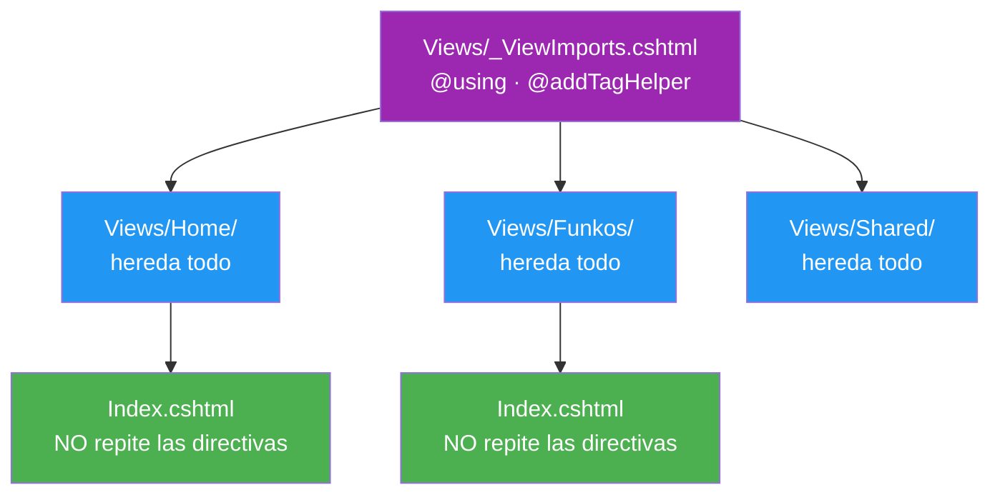
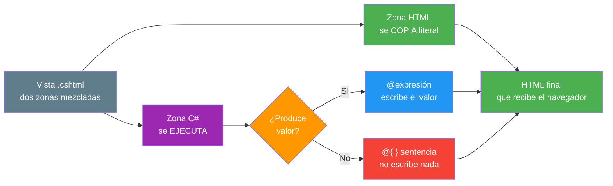
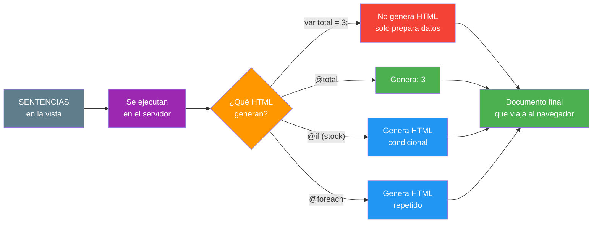
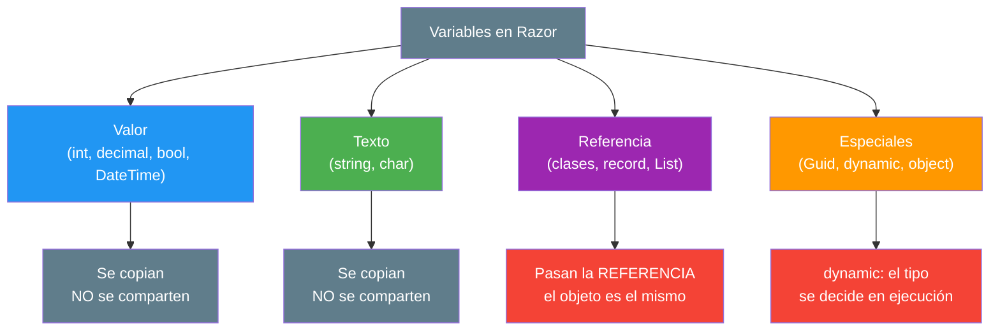
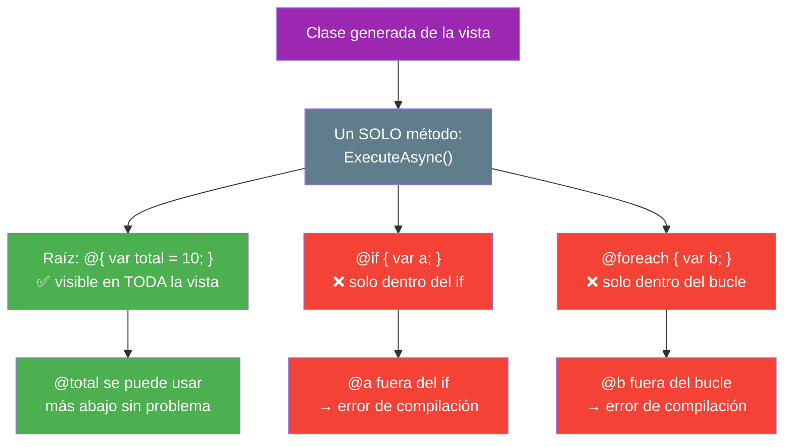
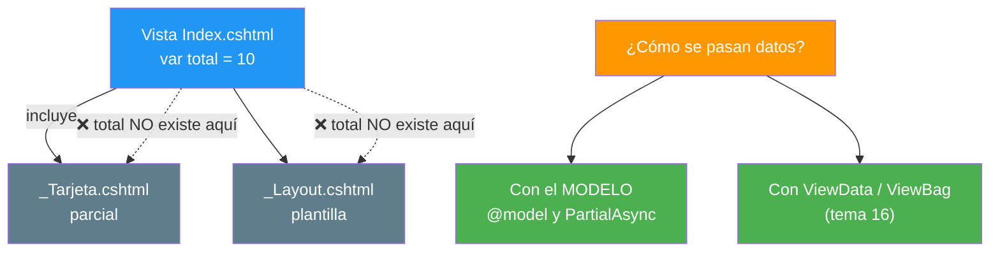
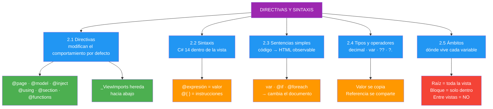

- [2. Directivas y Sintaxis de Razor](#2-directivas-y-sintaxis-de-razor)
  - [2.1. Directivas Razor](#21-directivas-razor)
    - [2.1.1. Qué es una Directiva](#211-qué-es-una-directiva)
    - [2.1.2. Directivas de Declaración](#212-directivas-de-declaración)
    - [2.1.3. Directivas de Composición](#213-directivas-de-composición)
    - [2.1.4. Directivas de Inyección y de Código](#214-directivas-de-inyección-y-de-código)
    - [2.1.5. Directivas de Tag Helpers](#215-directivas-de-tag-helpers)
    - [2.1.6. Herencia de Directivas con _ViewImports](#216-herencia-de-directivas-con-_viewimports)
  - [2.2. Sintaxis del Lenguaje en Razor](#22-sintaxis-del-lenguaje-en-razor)
    - [2.2.1. Reglas Generales](#221-reglas-generales)
    - [2.2.2. Expresiones](#222-expresiones)
    - [2.2.3. Bloques de Código](#223-bloques-de-código)
  - [2.3. Sentencias Simples y su Efecto en el Documento](#23-sentencias-simples-y-su-efecto-en-el-documento)
    - [2.3.1. Qué es una Sentencia](#231-qué-es-una-sentencia)
    - [2.3.2. Declaración y Expresión: del Código al HTML](#232-declaración-y-expresión-del-código-al-html)
    - [2.3.3. Condicional Simple con @if](#233-condicional-simple-con-if)
    - [2.3.4. Iteración Simple con @foreach](#234-iteración-simple-con-foreach)
  - [2.4. Tipos de Variables y Operadores](#24-tipos-de-variables-y-operadores)
    - [2.4.1. Tipos de Variables](#241-tipos-de-variables)
    - [2.4.2. Operadores](#242-operadores)
    - [2.4.3. Cadenas, Interpolación y Formato](#243-cadenas-interpolación-y-formato)
  - [2.5. Ámbitos de las Variables](#25-ámbitos-de-las-variables)
    - [2.5.1. Ámbito del Bloque](#251-ámbito-del-bloque)
    - [2.5.2. Ámbito de la Vista Completa](#252-ámbito-de-la-vista-completa)
    - [2.5.3. Ámbito entre Vistas Parciales](#253-ámbito-entre-vistas-parciales)
  - [2.6. Buenas Prácticas](#26-buenas-prácticas)
  - [2.7. Reto](#27-reto)


# 2. Directivas y Sintaxis de Razor

> 💡 **Punto de partida:** Imagina que llegas a una casa que no es tuya. Sin que te lo expliquen, no sabes qué habitación es el salón, dónde está la cocina ni qué reglas rigen la casa. En una vista Razor pasa exactamente lo mismo: sin directivas, el motor no sabe **qué modelo espera**, **qué servicios tiene disponibles** ni **dónde debe encajar la página**. Las directivas son el plano de la casa.

En este tema aprenderás a dar órdenes al motor Razor con **directivas**, a escribir **sentencias simples** comprobando qué HTML producen, a usar los **tipos de variables y operadores** de C# dentro de una vista y a saber **en qué ámbito vive cada variable**.

**Objetivos de aprendizaje:**

- Utilizar directivas para modificar el comportamiento predeterminado de una vista
- Reconocer la sintaxis del lenguaje de programación que se ha de utilizar dentro de Razor
- Escribir sentencias simples y comprobar sus efectos en el documento resultante
- Aplicar los distintos tipos de variables y operadores disponibles en el lenguaje
- Identificar los ámbitos de utilización de las variables

## 2.1. Directivas Razor

### 2.1.1. Qué es una Directiva

Una **directiva** es una instrucción que le dice al motor Razor **cómo debe compilar la vista**. No pinta nada en pantalla: cambia **por defecto** cómo se comporta el documento.

> 💡 **Analogía:** Una directiva es como la pegatina *"Esta es la puerta de emergencia"* en un cine. Nadie la ve cuando mira la película, pero **cambia el comportamiento** del edificio entero.

La diferencia con una expresión es radical:

| | **Directiva** | **Expresión** |
|---|---|---|
| **Ejemplo** | `@model List<Funko>` | `@Model.Nombre` |
| **¿Genera HTML?** | **No** — trabaja en el compilador | **Sí** — escribe texto en la página |
| **¿Cuándo actúa?** | Al **compilar** la vista | Al **renderizar** la página |
| **¿Dónde se pone?** | Normalmente, **arriba** del fichero | Donde quieras que aparezca |
| **Si la borras** | La vista deja de compilar o cambia de sentido | Simplemente desaparece el texto |

📌 Ejemplo real: si borras `@model`, la vista **ni siquiera compila** porque no sabe qué tipo recibe `Model`. Si borras `@Model.Nombre`, sigue funcionando pero se queda la página en blanco. Una directiva **estructura**, una expresión **rellena**.

### 2.1.2. Directivas de Declaración

Responden a la pregunta **¿qué es esta vista?**

| Directiva | Qué modifica por defecto | Ejemplo |
|-----------|--------------------------|---------|
| `@page` | Convierte el `.cshtml` en **página navegable** y le asigna ruta | `@page "/funkos"` |
| `@model` | Declara el **tipo** del modelo que recibirá la vista | `@model List<Funko>` |
| `@namespace` | Define el *namespace* de la clase generada | `@namespace Tienda.Views.Funkos` |
| `@inherits` | Cambia la **clase base** de la vista | `@inherits CustomViewBase` |
| `@implements` | Hace que la vista **implemente una interfaz** | `@implements IDisposable` |
| `@attribute` | Añade un **atributo C#** a la clase generada | `@attribute [Authorize]` |

> 📝 **Nota:** `@page` **solo existe en Razor Pages**. En MVC la ruta la pone el controlador. Es la directiva que más se olvida: sin ella, la página **no es accesible por URL**.

### 2.1.3. Directivas de Composición

Responden a la pregunta **¿cómo se monta y qué se ve?**

| Directiva | Qué modifica por defecto | Ejemplo |
|-----------|--------------------------|---------|
| `@using` | Añade un `using` al código generado | `@using Tienda.Models` |
| `@section` | Crea una **sección** que el layout puede recoger | `@section Scripts { ... }` |
| `@layout` | Fija el layout a usar (Blazor) | `@layout MasterLayout` |

```cshtml
@using Tienda.Models
@model List<Funko>

<h1>Catálogo</h1>

@section Scripts {
    <script src="~/js/filtros.js"></script>
}
```

> ⚠️ **Advertencia — `@layout` vs `_ViewStart`:** `@layout` es la directiva de **Blazor**. En MVC y Razor Pages el layout **no se fija aquí**: se hereda desde `_ViewStart.cshtml`. Si copias `@layout` en un `.cshtml` de Razor Pages, **no hace lo que esperas**.

### 2.1.4. Directivas de Inyección y de Código

| Directiva | Qué modifica por defecto | Ejemplo |
|-----------|--------------------------|---------|
| `@inject` | Pone un **servicio** en una propiedad de la vista | `@inject IFunkoService Funkos` |
| `@functions` | Declara **métodos y propiedades** dentro de la vista | `@functions { int Dobro(int x) => x * 2; }` |

```cshtml
@page "/funkos"
@model List<Funko>
@inject IFunkoService Funkos
@inject IViewLocalizer Localizer

<h1>@Localizer["Titulo"]</h1>
<p>Hay @Funkos.Contar() figuras disponibles.</p>
```

📌 Ejemplo real: en la **Tienda** de referencia, `@inject IProductService ProductService` aparece justo debajo de `@model` para poder consultar el catálogo **sin tocar el PageModel**. Es la forma más directa de llevar datos a la vista.

> 📝 **Nota:** En componentes **Blazor** (UD04) el bloque de código se llama `@code { }`; en las vistas `.cshtml` de esta unidad se llama `@functions { }`. Misma idea, distinta directiva.

### 2.1.5. Directivas de Tag Helpers

| Directiva | Qué modifica por defecto | Ejemplo |
|-----------|--------------------------|---------|
| `@addTagHelper` | **Registra** un ensamblado con Tag Helpers | `@addTagHelper *, Microsoft.AspNetCore.Mvc.TagHelpers` |
| `@removeTagHelper` | **Elimina** un Tag Helper registrado | `@removeTagHelper *, Microsoft.AspNetCore.Mvc.TagHelpers` |
| `@tagHelperPrefix` | Cambia el **prefijo** que los activa | `@tagHelperPrefix th:` |

```cshtml
@addTagHelper *, Microsoft.AspNetCore.Mvc.TagHelpers
@addTagHelper *, MiTienda
```

El asterisco `*` significa *«todos los Tag Helpers de ese ensamblado»*. El detalle completo está en el tema **06 · Tag Helpers**.

### 2.1.6. Herencia de Directivas con _ViewImports

Las directivas **no hay que repetirlas en cada vista**: se declaran una vez en `_ViewImports.cshtml` y **se heredan hacia abajo**, por toda la carpeta.



| Fichero | Qué acumula | Alcance |
|---------|-------------|---------|
| `Views/_ViewImports.cshtml` | `@using` y `@addTagHelper` | Toda la carpeta `Views/` y subcarpetas |
| `Pages/_ViewImports.cshtml` | `@using` y `@addTagHelper` | Toda la carpeta `Pages/` y subcarpetas |
| `Views/_ViewStart.cshtml` | `Layout = "..."` | Toda la carpeta (herencia de layout) |

> 💡 **Consejo:** Pon en `_ViewImports` **solo lo que usan muchas vistas**. Si metes un `@using` que usa una única vista, ahí no estáis ahorrando nada: estáis **ensuciando el ámbito de todas**.

## 2.2. Sintaxis del Lenguaje en Razor

### 2.2.1. Reglas Generales

Razor **no inventa un lenguaje**: dentro va **C# 14 puro**. La sintaxis es exactamente la del resto de tu proyecto, con cinco reglas de convivencia:

| Regla | Correcto | Incorrecto |
|-------|----------|------------|
| **Punto y coma** dentro de `@{ }` | `var x = 1;` | `var x = 1` |
| **Llaves** para abrir y cerrar bloques | `@if (x) { ... }` | `@if (x) ...` sin llaves |
| **C# distingue mayúsculas** | `@Model.Nombre` | `@model.nombre` |
| **HTML no distingue** | `<BR>` = `<br>` | — |
| **El HTML se escribe literal** | `<p>Hola</p>` | `<p>@Hola</p>` si no hay variable `Hola` |



> ⚠️ **Advertencia:** El error número uno al empezar es mezclar reglas. `@model` (minúscula) es la **directiva**; `@Model` (mayúscula) es la **propiedad** con el objeto. **No son lo mismo** y el compilador las distingue.

### 2.2.2. Expresiones

Una **expresión** es cualquier cosa que **produce un valor** y que Razor escribe en el documento:

```cshtml
@model FunkoDetalle

@* Expresión de propiedad *@
<h1>@Model.Nombre</h1>

@* Expresión con método *@
<p>Actualizado: @DateTime.Now.ToString("dd/MM/yyyy")</p>

@* Expresión con operador ternario *@
<p>Estado: @(Model.Stock > 0 ? "En stock" : "Agotado")</p>

@* Nul-condicional: no revienta si el objeto es null *@
<p>Marca: @Model.Marca?.Nombre</p>

@* Nul-coalescing: valor por defecto si es null *@
<p>Alias: @Model.Alias ?? "sin alias"</p>
```

> 💡 **Regla de oro:** si la expresión lleva **espacios, operadores o comas**, enciérrala entre paréntesis `@( ... )`. Con `@Model.Stock > 0` solo se imprimiría `@Model.Stock`.

### 2.2.3. Bloques de Código

Un bloque `@{ }` **no produce valor**: contiene las **instrucciones** que preparan lo que luego se muestra.

```cshtml
@{
    // Declaraciones
    var titulo = "Figuras de colección";
    var hoy = DateTime.Now;

    // Funciones locales
    string FormatearPrecio(decimal p) => p.ToString("C");

    // Cálculos
    var dto = 0.15m;
    var final = Model.Precio * (1 - dto);
}

<h1>@titulo</h1>
<p>Publicado el @hoy.ToString("dddd, d 'de' MMMM")</p>
<p>Precio final: @FormatearPrecio(final)</p>
```

Dentro de `@{ }` estás **plenamente en C#**: necesitas punto y coma, y los comentarios son `//` o `/* */`. Para volver al HTML hay que salir con `@if`, `@foreach`, `<text>` o `@:`.

📌 Ejemplo real: **Netflix** calcula el descuento, el idioma y la calidad de reproducción de tu portada en bloques como este **antes** de escribir una sola etiqueta HTML. La vista solo *pinta* el resultado ya calculado.

## 2.3. Sentencias Simples y su Efecto en el Documento

### 2.3.1. Qué es una Sentencia

Una **sentencia** es una instrucción que **se ejecuta**. A diferencia de la expresión, no se *muestra*: se *hace*.

| Tipo | Ejemplo | ¿Qué produce? |
|------|---------|----------------|
| **Declaración** | `var total = 3;` | Una variable en memoria |
| **Expresión** | `@total` | **Texto en el HTML** |
| **Llamada** | `@Funkos.Contar()` | El valor que devuelve |
| **Condicional** | `@if (...) { }` | HTML **distinto** según la condición |
| **Iteración** | `@foreach (...) { }` | HTML **repetido** una vez por elemento |



### 2.3.2. Declaración y Expresión: del Código al HTML

**Sentencia en la vista:**

```cshtml
@{
    var stock = 12;
    var nombre = "Funko Spider-Man";
}

<p>@nombre tiene @stock unidades.</p>
```

**Documento resultante (lo que recibe el navegador):**

```html
<p>Funko Spider-Man tiene 12 unidades.</p>
```

Fíjate en lo que **no** aparece: ni `var`, ni los corchetes, ni los punto y coma. Del código solo queda **el valor**.

### 2.3.3. Condicional Simple con @if

**Sentencia en la vista:**

```cshtml
@{
    var stock = 0;
}

@if (stock > 0)
{
    <span class="badge bg-success">Disponible</span>
}
else
{
    <span class="badge bg-danger">Agotado</span>
}
```

**Documento resultante:**

```html
<span class="badge bg-danger">Agotado</span>
```

La rama que **no** se cumple **no genera ni un byte**. Ese es el efecto observable: dos visitas distintas a la misma URL producen **HTML distinto**.

> 📝 **Nota:** El HTML que está dentro de las llaves **sí se escribe tal cual**, pero solo si la condición se cumple. Escribe un `@if` con el stock a 1 y vuelve a cargar la página: verás cambiar el documento con tus propios ojos.

### 2.3.4. Iteración Simple con @foreach

**Sentencia en la vista:**

```cshtml
@{
    var funkos = new List<string> { "Spider-Man", "Batman", "Joker" };
}

<ul>
@foreach (var f in funkos)
{
    <li>@f</li>
}
</ul>
```

**Documento resultante:**

```html
<ul>
    <li>Spider-Man</li>
    <li>Batman</li>
    <li>Joker</li>
</ul>
```

El bucle **se ejecuta tres veces** y el `<li>` se escribe **tres veces**. Cambia la lista y cambia el documento — sin tocar el HTML.

📌 Ejemplo real: cuando **Instagram** te muestra tu lista de seguidores, no hay un archivo por cada lista. Hay **una plantilla** con un `@foreach` y los datos que devolvió la base de datos en ese instante.

> ⚠️ **Advertencia:** Si la lista llega **vacía**, el `@foreach` **no genera nada** y te queda un `<ul></ul>` vacío en pantalla. Comprueba siempre el estado vacío: es el error más habitual de las prácticas.

## 2.4. Tipos de Variables y Operadores

### 2.4.1. Tipos de Variables

Dentro de una vista se usan **los mismos tipos que en cualquier parte de C#**. Con `var` dejas que el compilador **averigüe** el tipo por ti — siempre que asignes un valor en la misma línea.

| Categoría | Tipos | Ejemplo de declaración |
|-----------|-------|------------------------|
| **Enteros** | `int`, `long`, `short`, `byte` | `var unidades = 12;` |
| **Decimales** | `decimal`, `double`, `float` | `var precio = 19.99m;` |
| **Texto** | `string`, `char` | `var nombre = "Funko";` |
| **Lógicos** | `bool` | `var activo = true;` |
| **Fecha y hora** | `DateTime`, `DateOnly`, `TimeSpan` | `var alta = DateTime.Now;` |
| **Identificadores** | `Guid` | `var id = Guid.NewGuid();` |
| **Colecciones** | `T[]`, `List<T>`, `Dictionary<K,V>` | `var carrito = new List<Funko>();` |
| **Objetos** | clases y `record` | `var funko = new Funko();` |



> ⚠️ **Advertencia — dos errores típicos:**
>
> - `var x;` → **no compila**. `var` exige asignación **en la misma línea**.
> - `var precio = 19.99;` → es `double`, **no** `decimal`. Para dinero escribe `19.99m` o `decimal.Parse(...)`.
> - En **dinero usa `decimal`**, nunca `double`: el redondeo binario de `double` hace que 0,1 + 0,2 no sea exactamente 0,3.

### 2.4.2. Operadores

| Tipo | Operadores | Ejemplo en Razor |
|------|------------|------------------|
| **Aritméticos** | `+  -  *  /  %` | `@(precio * 1.21m)` |
| **Comparación** | `==  !=  <  >  <=  >=` | `@(stock > 0)` |
| **Lógicos** | `&&  \|\|  !` | `@(activo && stock > 0)` |
| **Ternario** | `? :` | `@(stock > 0 ? "Sí" : "No")` |
| **Nul-coalescing** | `??`  y  `??=` | `@alias ?? "sin alias"` |
| **Nul-condicional** | `?.`  y  `?[]` | `@marca?.Nombre` |
| **Incremento** | `++`  `--` | `indice++` |
| **Asignación compuesta** | `+=`  `-=`  `*=` | `total += precio` |
| **Concatenación** | `+` | `@nombre + " " + apellido` |
| **Tipo** | `is`  `as` | `@funko is FunkoRaro` |

```cshtml
@{
    var precio = 19.99m;
    var stock = 0;
    var alias = (string?)null;
}

<p>Con IVA: @(precio * 1.21m)</p>                          @* aritmético *@
<p>¿Hay?: @(stock > 0)</p>                                 @* comparación *@
<p>@(stock > 0 && precio > 0)</p>                          @* lógico *@
<p>Estado: @(stock > 0 ? "Disponible" : "Agotado")</p>      @* ternario *@
<p>Alias: @(alias ?? "sin alias")</p>                       @* nul-coalescing *@
```

> 💡 **Truco — `??` y `?.` son tus amigos:** `@Model.Marca?.Nombre` **no revienta** si `Marca` es `null`, mientras que `@Model.Marca.Nombre` lanza `NullReferenceException` y te deja la página en blanco.

> 📝 **Nota:** El operador `??=` asigna **solo si la variable es `null`**: `nombre ??= "Anónimo";`. Es muy cómodo para valores por defecto.

### 2.4.3. Cadenas, Interpolación y Formato

```cshtml
@{
    var nombre = "Spider-Man";
    var precio = 19.99m;
    var fecha = DateTime.Now;
}

@* Concatenación clásica *@
<p>@nombre + " (stock bajo)"</p>

@* Interpolación: más legible *@
<p>@($"{nombre} cuesta {precio:N2} €")</p>

@* ToString con formato *@
<p>Precio: @precio.ToString("C")</p>
<p>Fecha:  @fecha.ToString("dd/MM/yyyy")</p>
<p>Porcentaje: @0.21m.ToString("P0")</p>
```

| Formato | Significado | Ejemplo con `19.99` |
|---------|-------------|---------------------|
| `C` | Moneda de la cultura actual | `19,99 €` |
| `N2` | Número con separador de miles | `19,99` |
| `F2` | Decimales fijos | `19.99` |
| `P0` | Porcentaje | `20 %` |
| `dd/MM/yyyy` | Fecha | `03/10/2026` |

> ⚠️ **Advertencia:** El formato `C` depende de la **cultura del servidor**. Si el servidor está en `en-US` verás `$19.99` en lugar de `19,99 €`. Para que salga siempre igual, fija la cultura (lo veremos en el tema **21 · Internacionalización**).

## 2.5. Ámbitos de las Variables

### 2.5.1. Ámbito del Bloque

Un `@if`, un `@foreach` o un `@{ }` **anidado** crean una **jaula**: lo que declares dentro, **solo vive ahí dentro**.

```cshtml
@if (stock > 0)
{
    var aviso = "Últimas unidades";   @* ← vive solo dentro del if *@
    <p>@aviso</p>
}

<p>@aviso</p>   @* ❌ CS0103: no existe el nombre 'aviso' *@
```

```cshtml
@foreach (var f in funkos)
{
    var contador = 0;                 @* ← se reinicia en CADA vuelta *@
    contador++;
}
```

**Regla:** *el ámbito de una variable es el bloque `{ }` donde se declara y todos los bloques anidados dentro de él*.

### 2.5.2. Ámbito de la Vista Completa

Una variable declarada en un `@{ }` **en el nivel raíz** de la vista **sí es visible en el resto de la vista**, porque todo se compila dentro de un único método.



| Dónde se declara | ¿Dónde se ve? |
|------------------|---------------|
| `@{ }` en el **nivel raíz** | En **toda la vista** |
| Dentro de `@if { }` | **Solo** dentro de ese `@if` |
| Dentro de `@foreach { }` | **Solo** dentro de ese bucle (y se recrea en cada vuelta) |
| En una **función local** | **Solo** dentro de esa función |
| En `_ViewImports.cshtml` | Solo se heredan **directivas** (`@using`, `@addTagHelper`), **no variables** |

### 2.5.3. Ámbito entre Vistas Parciales

Cada vista, parcial o layout se compila como **una clase aparte**, con su propio método. **No comparten variables locales.**



```cshtml
@* ❌ MALO: la parcial no puede ver 'funkos' *@
@{ var funkos = Model.Funkos; }
<partial name="_Lista" />           @* la parcial se queda sin datos *@

@* ✅ BUENO: pásale el dato a la parcial *@
<partial name="_Lista" model="Model.Funkos" />
```

> 💡 **Analogía:** Es la diferencia entre **pasar una nota escrita en un papel** (el modelo) y **gritarla desde tu habitación a la del lado** (la variable local). La casa no te oye: cada habitación es un mundo aparte.

> ⚠️ **Advertencia:** El error más buscado en clase es `La variable 'x' no existe en el contexto actual`. **Casi siempre** significa que la declaraste en una vista y la usas en otra. La solución **nunca** es repetir la variable: es **pasar el dato**.

## 2.6. Buenas Prácticas

- ✅ **Agrupa las directivas arriba**, en este orden: `@page` → `@namespace` → `@inherits` → `@model` → `@using` → `@inject`
- ✅ **Deja que `_ViewImports` herede** `@using` y `@addTagHelper`; no los repitas en cada vista
- ✅ **Usa `var`** solo cuando el tipo sea obvio (`var fecha = DateTime.Now;`); escribe el tipo si no lo es (`decimal total = 0;`)
- ✅ **Dinero con `decimal`**, fechas con `DateTime`, y formatea al mostrarlos (`ToString("C")`)
- ✅ **Protege los enlaces de objetos** con `?.` y `??` (`@marca?.Nombre ?? "genérica"`)
- ✅ **Pasa datos entre vistas con el modelo**, nunca con variables locales
- ❌ **No uses `@layout` en `.cshtml`**: en MVC y Razor Pages el layout se hereda de `_ViewStart.cshtml`
- ❌ **No declares `var x;`** sin valor: `var` exige asignación en la misma línea
- ❌ **No declares dentro de un bloque** una variable que vayas a usar fuera

## 2.7. Reto

> Aplica las directivas y la sintaxis de Razor a **FunkoApp**.

**Paso 0** — crea el proyecto si aún no lo tienes (`dotnet new webapp -n FunkoApp -f net10.0`).

En la vista `Pages/Funkos/Index.cshtml`:

1. Escribe **seis directivas** en la cabecera: `@page`, `@model`, `@using`, `@inject`, `@functions` y una `@attribute`
2. Declara en `_ViewImports.cshtml` un `@using` y comprueba que **las demás vistas de la carpeta lo heredan**
3. Crea un bloque `@{ }` en la raíz con **cuatro variables de tipos distintos**: `string`, `int`, `decimal` y `bool`
4. Calcula el **valor total del catálogo** con el operador `*` y muéstralo formateado con `ToString("C")`
5. Escribe una **sentencia `@if`** que muestre un aviso distinto si el stock es 0, y comprueba con F12 que **el HTML cambia**
6. Escribe un **`@foreach`** que repita un `<li>` por cada funko y verifica que la lista **crece al añadir elementos**
7. Declara una variable **dentro** del `@if` y prueba a usarla **fuera**: lee el error de compilación `CS0103` y anótalo

**Puntos extra:**

- Crea una vista parcial `_Tarjeta.cshtml` y **comprueba que NO ve** las variables de la vista padre; luego pásale el dato con `model="..."`
- Usa `?.` y `??` sobre una propiedad que **puede ser null** y comprueba que la página no se rompe
- Pon `@model` con un tipo **incorrecto** y lee el error: entiende por qué una directiva **estructura** la vista

---

**Resumen del punto:**

| Concepto | Descripción |
|----------|-------------|
| **Directiva** | Instrucción que modifica el comportamiento **predeterminado**; no genera HTML |
| **`@page` / `@model`** | Declara la ruta (Razor Pages) y el tipo del modelo |
| **`@using` / `@inject`** | Importa espacios de nombres y servicios en la vista |
| **`@section`** | Crea una sección que el layout puede recoger |
| **`@functions`** | Declara métodos y propiedades dentro de la vista |
| **`_ViewImports.cshtml`** | Acumula directivas y **las hereda** toda la carpeta |
| **Sintaxis** | C# 14 puro dentro de `@{ }`, con punto y coma y mayúsculas sensibles |
| **Expresión** | Produce un valor y **se escribe** en el HTML |
| **Sentencia** | Se **ejecuta**: declara, decide o repite |
| **`var`** | Inferencia de tipo; exige asignación en la misma línea |
| **`decimal`** | El tipo del dinero; `double` produce errores de redondeo |
| **`?.` y `??`** | Evitan `NullReferenceException` y ponen valores por defecto |
| **Ámbito raíz** | Visible en toda la vista |
| **Ámbito de bloque** | Visible solo dentro de `{ }` |
| **Ámbito entre vistas** | **No** se comparten variables: se pasa el **modelo** |



**¿Qué viene después?**

En el siguiente punto veremos **Estructuras de Control en la Interfaz**: mecanismos de decisión completos (`@if` anidados, `@switch`, ternarios encadenados), bucles de todo tipo (`@for`, `@while`, `@foreach` con estados vacíos) y **arrays y colecciones** para almacenar y recuperar conjuntos de datos.
