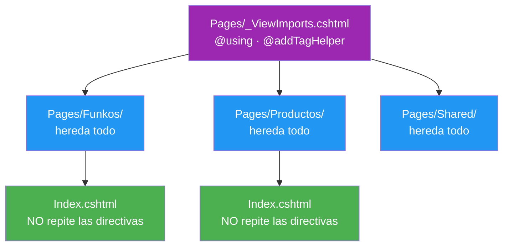
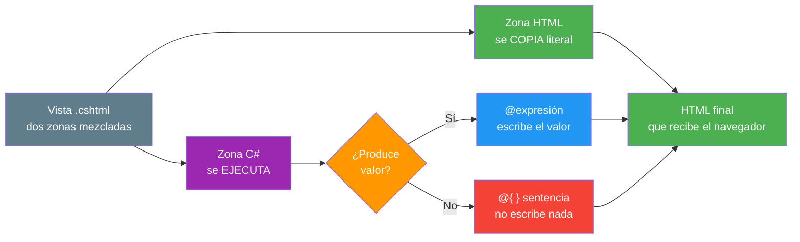
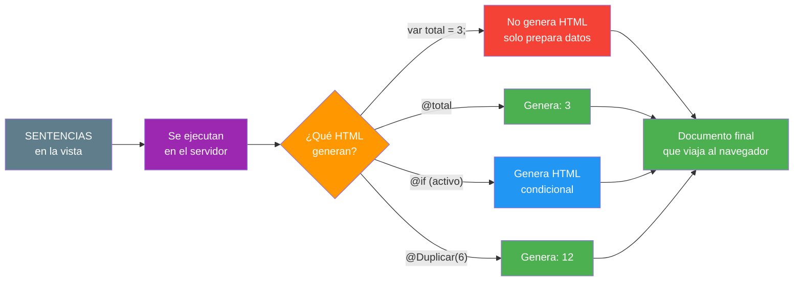
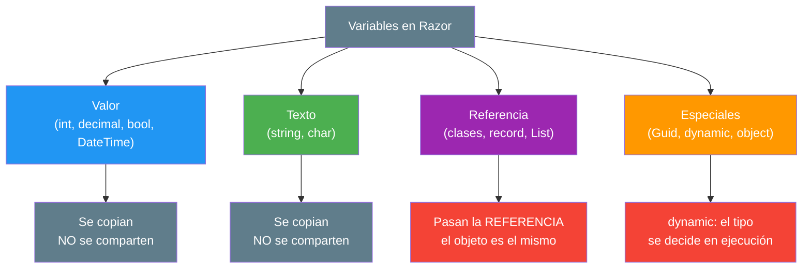
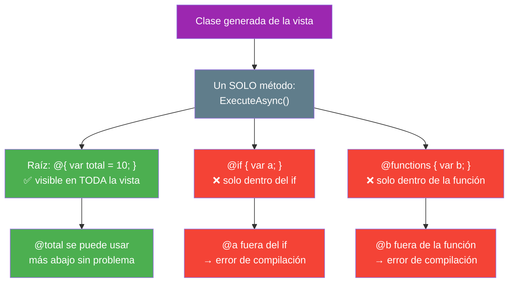
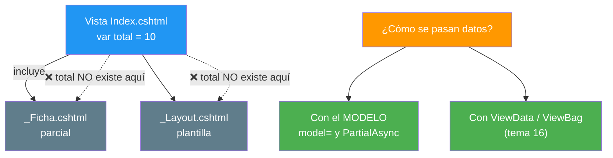
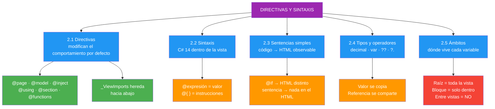

- [2. Directivas y Sintaxis de Razor](#2-directivas-y-sintaxis-de-razor)
  - [2.1. Directivas Razor](#21-directivas-razor)
    - [2.1.1. Qué es una Directiva](#211-qué-es-una-directiva)
    - [2.1.2. Directivas de Declaración](#212-directivas-de-declaración)
    - [2.1.3. Directivas de Composición](#213-directivas-de-composición)
    - [2.1.4. Directivas de Inyección y de Código](#214-directivas-de-inyección-y-de-código)
    - [2.1.5. Directivas de Tag Helpers](#215-directivas-de-tag-helpers)
    - [2.1.6. Herencia de Directivas con _ViewImports](#216-herencia-de-directivas-con-_viewimports)
  - [2.2. Sintaxis del Lenguaje en Razor](#22-sintaxis-del-lenguaje-en-razor)
    - [2.2.1. Reglas Generales](#221-reglas-generales)
    - [2.2.2. Expresiones](#222-expresiones)
    - [2.2.3. Bloques de Código](#223-bloques-de-código)
  - [2.3. Sentencias Simples y su Efecto en el Documento](#23-sentencias-simples-y-su-efecto-en-el-documento)
    - [2.3.1. Qué es una Sentencia](#231-qué-es-una-sentencia)
    - [2.3.2. Declaración y Expresión: del Código al HTML](#232-declaración-y-expresión-del-código-al-html)
    - [2.3.3. Condicional Simple con @if](#233-condicional-simple-con-if)
    - [2.3.4. Asignación y Llamada a Método](#234-asignación-y-llamada-a-método)
  - [2.4. Tipos de Variables y Operadores](#24-tipos-de-variables-y-operadores)
    - [2.4.1. Tipos de Variables](#241-tipos-de-variables)
    - [2.4.2. Operadores](#242-operadores)
    - [2.4.3. Cadenas, Interpolación y Formato](#243-cadenas-interpolación-y-formato)
  - [2.5. Ámbitos de las Variables](#25-ámbitos-de-las-variables)
    - [2.5.1. Ámbito del Bloque](#251-ámbito-del-bloque)
    - [2.5.2. Ámbito de la Vista Completa](#252-ámbito-de-la-vista-completa)
    - [2.5.3. Ámbito entre Vistas Parciales](#253-ámbito-entre-vistas-parciales)
  - [2.6. Buenas Prácticas](#26-buenas-prácticas)
  - [2.7. Reto](#27-reto)


# 2. Directivas y Sintaxis de Razor

> 💡 **Punto de partida:** Imagina que llegas a una casa que no es tuya. Sin que te lo expliquen, no sabes qué habitación es el salón, dónde está la cocina ni qué reglas rigen la casa. En una vista Razor pasa exactamente lo mismo: sin directivas, el motor no sabe **qué modelo espera**, **qué servicios tiene disponibles** ni **dónde debe encajar la página**. Las directivas son el plano de la casa.

En este tema aprenderás a dar órdenes al motor Razor con **directivas**, a escribir **sentencias simples** comprobando qué HTML producen, a usar los **tipos de variables y operadores** de C# dentro de una vista y a saber **en qué ámbito vive cada variable**.

**Objetivos de aprendizaje:**

- Utilizar directivas para modificar el comportamiento predeterminado de una vista
- Reconocer la sintaxis del lenguaje de programación que se ha de utilizar dentro de Razor
- Escribir sentencias simples y comprobar sus efectos en el documento resultante
- Aplicar los distintos tipos de variables y operadores disponibles en el lenguaje
- Identificar los ámbitos de utilización de las variables

> 📝 **Nota de la unidad:** seguimos sin repositorio y sin base de datos. Los datos se siguen **escribiendo a mano** en la vista. La lista de Funkos y el repositorio en memoria entran en el **punto 03**.

## 2.1. Directivas Razor

### 2.1.1. Qué es una Directiva

Una **directiva** es una instrucción que le dice al motor Razor **cómo debe compilar la vista**. No pinta nada en pantalla: cambia **por defecto** cómo se comporta el documento.

> 💡 **Analogía:** Una directiva es como la pegatina *"Esta es la puerta de emergencia"* en un cine. Nadie la ve cuando mira la película, pero **cambia el comportamiento** del edificio entero.

La diferencia con una expresión es radical:

| | **Directiva** | **Expresión** |
|---|---|---|
| **Ejemplo** | `@page "/funkos"` | `@nombre` |
| **¿Genera HTML?** | **No** — trabaja en el compilador | **Sí** — escribe texto en la página |
| **¿Cuándo actúa?** | Al **compilar** la vista | Al **renderizar** la página |
| **¿Dónde se pone?** | Normalmente, **arriba** del fichero | Donde quieras que aparezca |
| **Si la borras** | La vista deja de compilar o cambia de sentido | Simplemente desaparece el texto |

📌 Ejemplo real: si borras `@model`, la vista **ni siquiera compila** porque no sabe de qué tipo es `Model`. Si borras `@nombre`, la página sigue saliendo pero se queda sin ese dato. Una directiva **estructura**, una expresión **rellena**.

### 2.1.2. Directivas de Declaración

Responden a la pregunta **¿qué es esta vista?**

| Directiva | Qué modifica por defecto | Ejemplo |
|-----------|--------------------------|---------|
| `@page` | Convierte el `.cshtml` en **página navegable** y le asigna ruta | `@page "/funkos"` |
| `@model` | Declara de qué tipo es **`Model`** (ver nota abajo) | `@model IndexModel` |
| `@namespace` | Define el *namespace* de la clase generada | `@namespace FunkoApp.Pages.Funkos` |
| `@inherits` | Cambia la **clase base** de la vista | `@inherits CustomViewBase` |
| `@implements` | Hace que la vista **implemente una interfaz** | `@implements IDisposable` |
| `@attribute` | Añade un **atributo C#** a la clase generada | `@attribute [Authorize]` |

> 📝 **Nota — `@model` NO significa lo mismo en las dos visiones.** Esto es lo que has de tener claro antes de tocar un solo fichero:
>
> | Visión | `@model` declara | `Model` es | Ejemplo real del proyecto Tienda |
> |--------|------------------|------------|--------------------------------|
> | **Razor Pages** | el **PageModel** (el `.cshtml.cs`) | `Model.Products`, `Model.Titulo` | `@model Pages.Product.IndexModel` |
> | **MVC** | los **datos** que manda el controlador | `Model.Any()`, `Model.First()` | `@model IEnumerable<Product>` |
>
> ¿Por qué la diferencia? En Razor Pages la **lógica vive pegada a la página**, así que el modelo *es* la página. En MVC la lógica está en el controlador, que **manda los datos** a la vista. Por eso mismo, **`@model` no va todavía en este tema**: lo conectamos de verdad en el **punto 03**, cuando entre el repositorio en memoria.

> ⚠️ **Advertencia:** `@page` **solo existe en Razor Pages**. En MVC la ruta la pone el controlador. Es la directiva que más se olvida: sin ella, la página **no es accesible por URL**.

### 2.1.3. Directivas de Composición

Responden a la pregunta **¿cómo se monta y qué se ve?**

| Directiva | Qué modifica por defecto | Ejemplo |
|-----------|--------------------------|---------|
| `@using` | Añade un `using` al código generado | `@using System.Globalization` |
| `@section` | Crea una **sección** que el layout puede recoger | `@section Scripts { ... }` |
| `@layout` | Fija el layout a usar (Blazor) | `@layout MasterLayout` |

```cshtml
@using System.Globalization
@using FunkoApp.Models

<h1>Listado de Funkos</h1>

@section Scripts {
    <script src="~/js/filtros.js"></script>
}
```

> ⚠️ **Advertencia — `@layout` vs `_ViewStart`:** `@layout` es la directiva de **Blazor**. En MVC y Razor Pages el layout **no se fija aquí**: se hereda desde `_ViewStart.cshtml`. Si copias `@layout` en un `.cshtml` de Razor Pages, **no hace lo que esperas**.

### 2.1.4. Directivas de Inyección y de Código

| Directiva | Qué modifica por defecto | Ejemplo |
|-----------|--------------------------|---------|
| `@inject` | Pone un **servicio** en una propiedad de la vista | `@inject IFunkoService Funkos` |
| `@functions` | Declara **métodos y propiedades** dentro de la vista | `@functions { int Dobro(int x) => x * 2; }` |

Esto funciona **tal cual** en un proyecto recién creado, sin registrar nada:

```cshtml
@page "/funkos"
@inject IWebHostEnvironment Env

<h1>Gestión de Funkos</h1>
<p>Entorno: @Env.EnvironmentName</p>
```

> 💡 **Consejo:** `IWebHostEnvironment` ya está registrado por ASP.NET Core, así que puedes **probar `@inject` en 30 segundos**: pega esas cuatro líneas en `Pages/Index.cshtml`, arranca y mira el resultado. Cuando veas `Development` o `Production`, lo has entendido.

📌 Ejemplo real: en cualquier **panel de gestión** (el de un centro educativo, el de una tienda de barrio, el de FunkoApp), la cabecera de la página necesita saber **quién ha entrado**. En Razor eso se resuelve con `@inject` sobre el servicio de identidad y se pinta directamente en la plantilla, **sin escribir una línea de controlador**.

> 📝 **Nota:** En componentes **Blazor** (UD04) el bloque de código se llama `@code { }`; en las vistas `.cshtml` de esta unidad se llama `@functions { }`. Misma idea, distinta directiva.

### 2.1.5. Directivas de Tag Helpers

| Directiva | Qué modifica por defecto | Ejemplo |
|-----------|--------------------------|---------|
| `@addTagHelper` | **Registra** un ensamblado con Tag Helpers | `@addTagHelper *, Microsoft.AspNetCore.Mvc.TagHelpers` |
| `@removeTagHelper` | **Elimina** un Tag Helper registrado | `@removeTagHelper *, Microsoft.AspNetCore.Mvc.TagHelpers` |
| `@tagHelperPrefix` | Cambia el **prefijo** que los activa | `@tagHelperPrefix th:` |

```cshtml
@addTagHelper *, Microsoft.AspNetCore.Mvc.TagHelpers
@addTagHelper *, FunkoApp
```

El asterisco `*` significa *«todos los Tag Helpers de ese ensamblado»*. El detalle completo está en el tema **06 · Tag Helpers**.

### 2.1.6. Herencia de Directivas con _ViewImports

Las directivas **no hay que repetirlas en cada vista**: se declaran una vez en `_ViewImports.cshtml` y **se heredan hacia abajo**, por toda la carpeta.



| Fichero | Qué acumula | Alcance |
|---------|-------------|---------|
| `Views/_ViewImports.cshtml` | `@using` y `@addTagHelper` | Toda la carpeta `Views/` y subcarpetas |
| `Pages/_ViewImports.cshtml` | `@using` y `@addTagHelper` | Toda la carpeta `Pages/` y subcarpetas |
| `Views/_ViewStart.cshtml` | `Layout = "..."` | Toda la carpeta (herencia de layout) |

> 💡 **Consejo:** Pon en `_ViewImports` **solo lo que usan muchas vistas**. Si metes un `@using` que usa una única vista, ahí no estáis ahorrando nada: estáis **ensuciando el ámbito de todas**.

## 2.2. Sintaxis del Lenguaje en Razor

### 2.2.1. Reglas Generales

Razor **no inventa un lenguaje**: dentro va **C# 14 puro**. La sintaxis es exactamente la del resto de tu proyecto, con cinco reglas de convivencia:

| Regla | Correcto | Incorrecto |
|-------|----------|------------|
| **Punto y coma** dentro de `@{ }` | `var x = 1;` | `var x = 1` |
| **Llaves** para abrir y cerrar bloques | `@if (x) { ... }` | `@if (x) ...` sin llaves |
| **C# distingue mayúsculas** | `@ViewData["Title"]` | `@viewdata["Title"]` |
| **HTML no distingue** | `<BR>` = `<br>` | — |
| **El HTML se escribe literal** | `<p>Hola</p>` | `<p>@Hola</p>` si no hay variable `Hola` |



> ⚠️ **Advertencia:** El error número uno al empezar es mezclar reglas. `@page` (directiva, minúscula) y una expresión de variable **no son lo mismo**, y el compilador las distingue. Del mismo modo, `@viewdata` no funciona porque C# **sí distingue mayúsculas**.

### 2.2.2. Expresiones

Una **expresión** es cualquier cosa que **produce un valor** y que Razor escribe en el documento. Todas estas líneas funcionan **en una vista con los datos escritos a mano**:

```cshtml
@{
    var nombre = "Spider-Man";
    var anio = 2019;
    var activo = true;
    var imagen = (string?)null;
    var etiquetas = (List<string>?)null;
}

@* Expresión de variable *@
<h1>@nombre</h1>

@* Expresión con método *@
<p>Actualizado: @DateTime.Now.ToString("dd/MM/yyyy")</p>

@* Expresión con operador ternario (¡ponla entre paréntesis!) *@
<p>Estado: @(activo ? "En la colección" : "Dado de baja")</p>

@* Nul-condicional: no revienta si la propiedad es null *@
<p>Etiquetas: @(etiquetas?.Count ?? 0)</p>

@* Nul-coalescing: valor por defecto si es null *@
<p>Imagen: @(imagen ?? "/img/sin-foto.png")</p>
```

> 💡 **Regla de oro:** si la expresión lleva **espacios, operadores o comas**, enciérrala entre paréntesis `@( ... )`. Sin ellos, `@activo ? "a" : "b"` imprime `True ? a : b` en lugar del resultado.

### 2.2.3. Bloques de Código

Un bloque `@{ }` **no produce valor**: contiene las **instrucciones** que preparan lo que luego se muestra.

```cshtml
@{
    // Declaraciones
    var titulo = "Funkos de colección";
    var hoy = DateTime.Now;

    // Funciones locales
    string FormatearImporte(decimal p) => p.ToString("C");

    // Cálculos
    var precioReferencia = 14.99m;
}

<h1>@titulo</h1>
<p>Actualizado el @hoy.ToString("dddd, d 'de' MMMM")</p>
<p>Precio de referencia: @FormatearImporte(precioReferencia)</p>
```

Dentro de `@{ }` estás **plenamente en C#**: necesitas punto y coma, y los comentarios son `//` o `/* */`. Para volver al HTML hay que salir con `@if`, `<text>` o `@:`.

📌 Ejemplo real: **Netflix** decide el idioma, la calidad de reproducción y el orden de tu portada en bloques como este **antes** de escribir una sola etiqueta HTML. La vista solo *pinta* el resultado ya calculado.

## 2.3. Sentencias Simples y su Efecto en el Documento

### 2.3.1. Qué es una Sentencia

Una **sentencia** es una instrucción que **se ejecuta**. A diferencia de la expresión, no se *muestra*: se *hace*.

| Tipo | Ejemplo | ¿Qué produce? |
|------|---------|----------------|
| **Declaración** | `var total = 3;` | Una variable en memoria |
| **Asignación** | `total = total + 1;` | Un valor guardado |
| **Expresión** | `@total` | **Texto en el HTML** |
| **Condicional** | `@if (...) { }` | HTML **distinto** según la condición |
| **Iteración** | `@foreach (...) { }` | HTML **repetido** — *lo vemos en el punto 03* |



### 2.3.2. Declaración y Expresión: del Código al HTML

**Sentencia en la vista:**

```cshtml
@{
    var nombre = "Spider-Man";
    var anio = 2019;
}

<p>@nombre se lanzó en @anio.</p>
```

**Documento resultante (lo que recibe el navegador):**

```html
<p>Spider-Man se lanzó en 2019.</p>
```

Fíjate en lo que **no** aparece: ni `var`, ni los corchetes, ni los punto y coma. Del código solo queda **el valor**.

### 2.3.3. Condicional Simple con @if

**Sentencia en la vista:**

```cshtml
@{
    var activo = false;
}

@if (activo)
{
    <span class="badge bg-success">En la colección</span>
}
else
{
    <span class="badge bg-secondary">Dado de baja</span>
}
```

**Documento resultante:**

```html
<span class="badge bg-secondary">Dado de baja</span>
```

La rama que **no** se cumple **no genera ni un byte**. Ese es el efecto observable: dos visitas distintas a la misma URL producen **HTML distinto**.

> 📝 **Nota:** El HTML que está dentro de las llaves **sí se escribe tal cual**, pero solo si la condición se cumple. Cambia `var activo = true;`, vuelve a cargar la página y mira el resultado con F12: verás cambiar el documento con tus propios ojos. Ese es precisamente el mecanismo de toda página dinámica.

> ⚠️ **Advertencia:** Si olvidas las llaves `{ }` en una rama con HTML, **el resto de la página se come dentro del `if`**. Es el fallo más confuso del principio: la mitad de tu vista desaparece y no entiendes por qué.

### 2.3.4. Asignación y Llamada a Método

**Sentencia en la vista:**

```cshtml
@functions {
    // Un método local: vive en la vista, no en el PageModel
    int Duplicar(int x) => x * 2;
}

@{
    var numero = Duplicar(6);      // ← sentencia de asignación con llamada
    var etiqueta = $"x{numero}";   // ← otra asignación
}

<p>Etiqueta: @etiqueta</p>
```

**Documento resultante:**

```html
<p>Etiqueta: x12</p>
```

Fíjate en lo que **no** aparece: ni `@functions`, ni la llamada `Duplicar(6)`, ni el `var`. Las sentencias **se ejecutan**; solo las expresiones **se escriben**.

| Sentencia | ¿Escribe algo en el HTML? | Cómo comprobarlo con F12 |
|-----------|---------------------------|--------------------------|
| `var numero = Duplicar(6);` | **No** | No está en el HTML |
| `@functions { ... }` | **No** | No está en el HTML |
| `@if (activo) { ... }` | **Sí**, una rama u otra | Cambia al invertir la condición |
| `@etiqueta` | **Sí**, el valor | Aparece el texto `x12` |

📌 Ejemplo real: en un **panel de administración**, el cálculo de «cuántos registros caben por página» se hace con sentencias dentro de `@{ }`; en pantalla solo aparece el resultado ya calculado. Nadie ve la fórmula, solo el número.

> 💡 **Consejo:** Abre **F12 → pestaña Elementos** y busca el texto que esperabas. Si no está, esa sentencia no produjo HTML: no es un fallo, es **el comportamiento esperado**. Hacerlo una vez te ahorra media hora de dudas en el futuro.

## 2.4. Tipos de Variables y Operadores

### 2.4.1. Tipos de Variables

Dentro de una vista se usan **los mismos tipos que en cualquier parte de C#**. Con `var` dejas que el compilador **averigüe** el tipo por ti — siempre que asignes un valor en la misma línea.

| Categoría | Tipos | Ejemplo de declaración |
|-----------|-------|------------------------|
| **Enteros** | `int`, `long`, `short`, `byte` | `var anio = 2019;` |
| **Decimales** | `decimal`, `double`, `float` | `var precioReferencia = 14.99m;` |
| **Texto** | `string`, `char` | `var nombre = "Funko";` |
| **Lógicos** | `bool` | `var activo = true;` |
| **Fecha y hora** | `DateTime`, `DateOnly`, `TimeSpan` | `var alta = DateTime.Now;` |
| **Identificadores** | `Guid` | `var id = Guid.NewGuid();` |
| **Colecciones** | `T[]`, `List<T>`, `Dictionary<K,V>` | `var funkos = new List<Funko>();` |
| **Objetos** | clases y `record` | `var funko = new Funko(...);` |

Esta es la forma en que modelaremos un Funko. Fíjate cómo **los `?` y el `decimal` de la tabla aparecen de verdad**:

```csharp
// Models/Funko.cs — todavía NO hay repositorio ni base de datos
record Funko(
    int Id,
    string Nombre,
    string Categoria,          // Marvel, DC, Star Wars...
    int Anio,
    decimal PrecioReferencia,
    string? Imagen,            // puede no estar subida aún
    List<string>? Etiquetas,   // puede ser null
    bool Activo,
    bool EsNovedad
);
```



> ⚠️ **Advertencia — tres errores típicos:**
>
> - `var x;` → **no compila**. `var` exige asignación **en la misma línea**.
> - `var precioReferencia = 14.99;` → es `double`, **no** `decimal`. Para cantidades exactas escribe `14.99m` o `decimal.Parse(...)`.
> - En **importes usa `decimal`**, nunca `double`: el redondeo binario de `double` hace que 0,1 + 0,2 no sea exactamente 0,3.

### 2.4.2. Operadores

| Tipo | Operadores | Ejemplo en Razor |
|------|------------|------------------|
| **Aritméticos** | `+  -  *  /  %` | `@(DateTime.Now.Year - anio)` |
| **Comparación** | `==  !=  <  >  <=  >=` | `@(anio >= 2020)` |
| **Lógicos** | `&&  \|\|  !` | `@(activo && anio >= 2020)` |
| **Ternario** | `? :` | `@(activo ? "Sí" : "No")` |
| **Nul-coalescing** | `??`  y  `??=` | `@(imagen ?? "sin foto")` |
| **Nul-condicional** | `?.`  y  `?[]` | `@etiquetas?.Count` |
| **Incremento** | `++`  `--` | `indice++` |
| **Asignación compuesta** | `+=`  `-=`  `*=` | `total += 1` |
| **Concatenación** | `+` | `@nombre + " " + categoria` |
| **Tipo** | `is`  `as` | `@funko is { Activo: true }` |

```cshtml
@{
    var precioReferencia = 14.99m;
    var anio = 2019;
    var activo = true;
    var imagen = (string?)null;
}

<p>Años en el circuito: @(DateTime.Now.Year - anio)</p>        @* aritmético *@
<p>Tres réplicas: @(precioReferencia * 3)</p>                  @* aritmético *@
<p>¿Es de esta década?: @(anio >= 2020)</p>                    @* comparación *@
<p>¿Activo y reciente?: @(activo && anio >= 2020)</p>          @* lógico *@
<p>Estado: @(activo ? "En la colección" : "Dado de baja")</p>  @* ternario *@
<p>Imagen: @(imagen ?? "/img/sin-foto.png")</p>                @* nul-coalescing *@
```

> 💡 **Truco — `??` y `?.` son tus amigos:** `@etiquetas?.Count` **no revienta** si `Etiquetas` es `null`, mientras que `@etiquetas.Count` lanza `NullReferenceException` y te deja la página en blanco. Recuerda: el campo `Imagen` de nuestro `Funko` es `string?`, o sea que **puede no existir**.

> 📝 **Nota:** El operador `??=` asigna **solo si la variable es `null`**: `imagen ??= "/img/sin-foto.png";`. Es muy cómodo para valores por defecto.

### 2.4.3. Cadenas, Interpolación y Formato

```cshtml
@{
    var nombre = "Spider-Man";
    var anio = 2019;
    var fecha = DateTime.Now;
}

@* Concatenación clásica *@
<p>@(nombre + " · " + anio)</p>

@* Interpolación: más legible *@
<p>@($"{nombre} llegó en {anio}")</p>

@* ToString con formato *@
<p>Año:   @anio.ToString("D4")</p>
<p>Fecha: @fecha.ToString("dd/MM/yyyy")</p>
<p>Nota:  @0.85m.ToString("P0")</p>
```

| Formato | Significado | Ejemplo |
|---------|-------------|---------|
| `C` | Moneda de la cultura actual | `14,99 €` |
| `N2` | Número con separador de miles y 2 decimales | `14,99` |
| `F2` | Decimales fijos | `14.99` |
| `P0` | Porcentaje entero | `85 %` |
| `D4` | Entero con relleno de ceros | `2019` |
| `dd/MM/yyyy` | Fecha | `03/10/2026` |

> ⚠️ **Advertencia:** El formato `C` depende de la **cultura del servidor**. Si el servidor está en `en-US` verás `$14.99` en lugar de `14,99 €`. Para que salga siempre igual, fija la cultura (lo veremos en el tema **21 · Internacionalización**).

## 2.5. Ámbitos de las Variables

### 2.5.1. Ámbito del Bloque

Un `@if` o un `@{ }` **anidado** crean una **jaula**: lo que declares dentro, **solo vive ahí dentro**.

```cshtml
@{
    var raiz = "visible en toda la vista";   @* ← declarada en la raíz *@
}

<p>@raiz</p>   @* ✅ visible *@
```

```cshtml
@if (activo)
{
    var aviso = "En la colección";   @* ← vive solo dentro del if *@
    <p>@aviso</p>
}

<p>@aviso</p>   @* ❌ CS0103: no existe el nombre 'aviso' *@
```

**Regla:** *el ámbito de una variable es el bloque `{ }` donde se declara y todos los bloques anidados dentro de él*.

### 2.5.2. Ámbito de la Vista Completa

Una variable declarada en un `@{ }` **en el nivel raíz** de la vista **sí es visible en el resto de la vista**, porque todo se compila dentro de un único método.



| Dónde se declara | ¿Dónde se ve? |
|------------------|---------------|
| `@{ }` en el **nivel raíz** | En **toda la vista** |
| Dentro de `@if { }` | **Solo** dentro de ese `@if` |
| Dentro de una **función local** (`@functions`) | **Solo** dentro de esa función |
| En `_ViewImports.cshtml` | Solo se heredan **directivas** (`@using`, `@addTagHelper`), **no variables** |

### 2.5.3. Ámbito entre Vistas Parciales

Cada vista, parcial o layout se compila como **una clase aparte**, con su propio método. **No comparten variables locales.**



```cshtml
@* ❌ MALO: la parcial no puede ver 'miFunko' *@
@{ var miFunko = new Funko(1, "Spider-Man", "Marvel", 2019, 14.99m, null, null, true, true); }
<partial name="_Ficha" />           @* la parcial se queda sin datos *@

@* ✅ BUENO: pásale el dato a la parcial *@
<partial name="_Ficha" model="miFunko" />
```

> 💡 **Analogía:** Es la diferencia entre **pasar una nota escrita en un papel** (el modelo) y **gritarla desde tu habitación a la del lado** (la variable local). La casa no te oye: cada habitación es un mundo aparte.

> ⚠️ **Advertencia:** El error más buscado en clase es `La variable 'x' no existe en el contexto actual`. **Casi siempre** significa que la declaraste en una vista y la usas en otra. La solución **nunca** es repetir la variable: es **pasar el dato**. Las vistas parciales como tales las veremos en el tema **05**.

## 2.6. Buenas Prácticas

- ✅ **Agrupa las directivas arriba**, en este orden: `@page` → `@namespace` → `@inherits` → `@model` → `@using` → `@inject`
- ✅ **Deja que `_ViewImports` herede** `@using` y `@addTagHelper`; no los repitas en cada vista
- ✅ **Usa `var`** solo cuando el tipo sea obvio (`var fecha = DateTime.Now;`); escribe el tipo si no lo es (`decimal total = 0;`)
- ✅ **Importes con `decimal`**, fechas con `DateTime`, y formatea al mostrarlos (`ToString("C")`)
- ✅ **Protege los enlaces de objetos** con `?.` y `??` (`@imagen ?? "/img/sin-foto.png"`)
- ✅ **Pasa datos entre vistas con el modelo**, nunca con variables locales
- ✅ **Comprueba con F12** qué HTML produjo cada sentencia: es la única forma de creértelo
- ❌ **No uses `@layout` en `.cshtml`**: en MVC y Razor Pages el layout se hereda de `_ViewStart.cshtml`
- ❌ **No declares `var x;`** sin valor: `var` exige asignación en la misma línea
- ❌ **No declares dentro de un bloque** una variable que vayas a usar fuera
- ❌ **No llames a una base de datos desde la vista**: en esta unidad **todavía no hay ninguna**

## 2.7. Reto

> Aplica las directivas y la sintaxis de Razor a **FunkoApp**.

**Paso 0** — crea el proyecto si aún no lo tienes (`dotnet new webapp -n FunkoApp -f net10.0`).

Crea la vista `Pages/Funkos/Gestion.cshtml` con los datos **escritos a mano** (sigue sin repositorio):

1. Escribe **seis directivas** en la cabecera, **en este orden**: `@page`, `@namespace`, `@using`, `@inject IWebHostEnvironment Env`, `@functions` y `@section`
   - `@inject` con `IWebHostEnvironment` **no necesita registrar nada**: pinta `@Env.EnvironmentName` y verás `Development` al ejecutar con `dotnet run`
2. Declara en `_ViewImports.cshtml` un `@using` y comprueba que **las demás vistas de la carpeta lo heredan**
3. Crea un bloque `@{ }` en la raíz con **cuatro variables de tipos distintos**: `string`, `int`, `decimal` y `bool`
4. Escribe una expresión con **operador aritmético** —los años que lleva en el circuito: `@(DateTime.Now.Year - anio)`— y otra que formatee el **precio de referencia** con `.ToString("C")`
5. Escribe una **sentencia `@if`** que pinte un sello distinto según la variable `bool`, y comprueba con **F12** que el HTML **cambia** al invertirla
6. Escribe una **sentencia que NO produzca HTML** (una asignación con `@functions`) y comprueba con **F12** que **no aparece ni un byte** en el documento
7. Declara una variable **dentro** del `@if` y prueba a usarla **fuera**: lee el error de compilación `CS0103` y anótalo

> 📝 **Nota:** `@model` **no va todavía en este reto**. En Razor Pages declara el **PageModel** y en MVC los **datos**; ambos casos los conectamos en el **punto 03**, cuando entre el repositorio en memoria.

**Puntos extra:**

- Crea la vista parcial `_Ficha.cshtml` y **comprueba que NO ve** las variables de la vista padre; luego pásale el dato con `model="..."`
- Usa `?.` y `??` sobre el campo `Imagen` (que es `string?`, o sea que puede ser `null`) y comprueba que la página **no se rompe**
- Pon `@namespace` con un valor **incorrecto** y lee el error: entiende por qué una directiva **estructura** la vista
- Escribe `@model` a propósito con un tipo inexistente y lee el mensaje de compilación

---

**Resumen del punto:**

| Concepto | Descripción |
|----------|-------------|
| **Directiva** | Instrucción que modifica el comportamiento **predeterminado**; no genera HTML |
| **`@page`** | Convierte el `.cshtml` en página navegable con ruta (solo Razor Pages) |
| **`@model`** | En **Razor Pages** declara el **PageModel**; en **MVC**, los **datos** del controlador |
| **`@using` / `@inject`** | Importa espacios de nombres y servicios en la vista |
| **`@section`** | Crea una sección que el layout puede recoger |
| **`@functions`** | Declara métodos y propiedades dentro de la vista |
| **`_ViewImports.cshtml`** | Acumula directivas y **las hereda** toda la carpeta |
| **Sintaxis** | C# 14 puro dentro de `@{ }`, con punto y coma y mayúsculas sensibles |
| **Expresión** | Produce un valor y **se escribe** en el HTML |
| **Sentencia** | Se **ejecuta**: declara, asigna, decide o repite |
| **`var`** | Inferencia de tipo; exige asignación en la misma línea |
| **`decimal`** | El tipo de los importes exactos; `double` produce errores de redondeo |
| **`?.` y `??`** | Evitan `NullReferenceException` y ponen valores por defecto |
| **Ámbito raíz** | Visible en toda la vista |
| **Ámbito de bloque** | Visible solo dentro de `{ }` |
| **Ámbito entre vistas** | **No** se comparten variables: se pasa el **modelo** |



**¿Qué viene después?**

En el siguiente punto veremos **Estructuras de Control en la Interfaz**: mecanismos de decisión completos (`@if` anidados, `@switch`, ternarios encadenados), bucles de todo tipo (`@for`, `@while`, `@foreach` con estados vacíos) y **arrays y colecciones** para almacenar y recuperar conjuntos de datos — y ahí sí, contra un **repositorio en memoria**.
