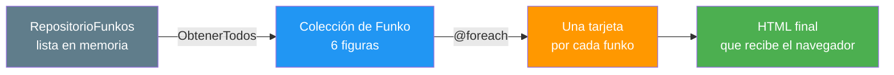
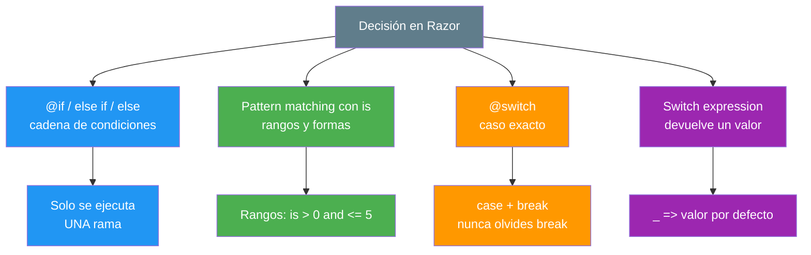
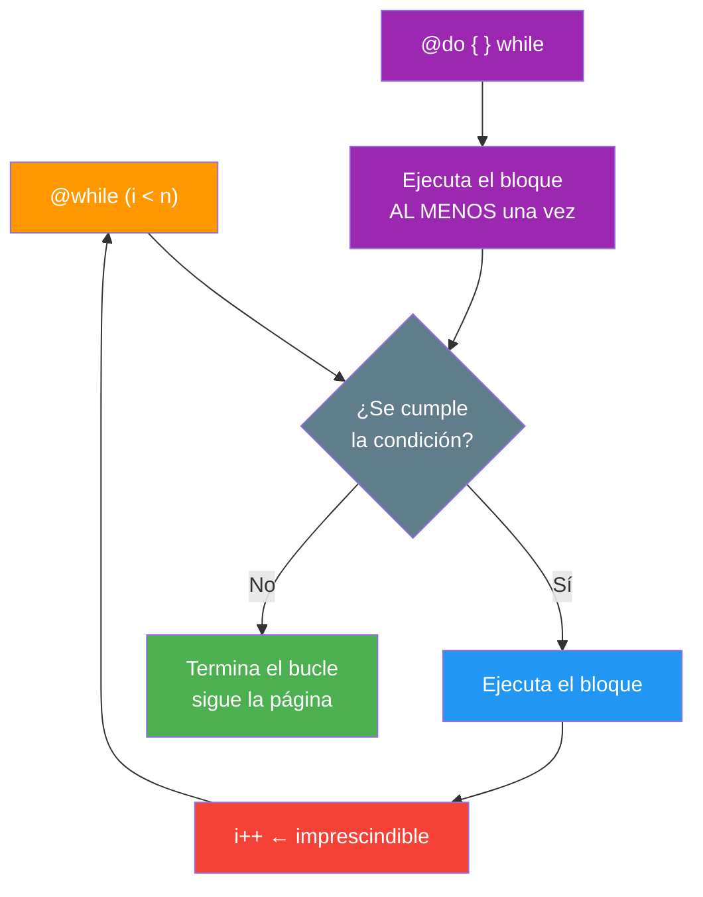
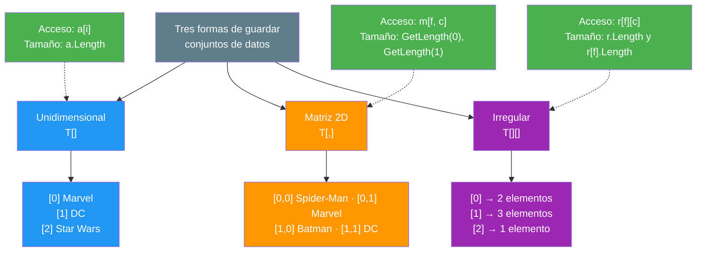
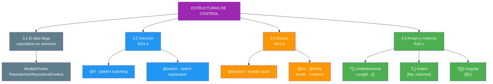

- [3. Estructuras de Control en la Interfaz](#3-estructuras-de-control-en-la-interfaz)
  - [3.1. El Dato Llega a la Vista](#31-el-dato-llega-a-la-vista)
    - [3.1.1. El Modelo Funko](#311-el-modelo-funko)
    - [3.1.2. El Repositorio en Memoria](#312-el-repositorio-en-memoria)
    - [3.1.3. Cómo se Llama desde la Vista](#313-cómo-se-llama-desde-la-vista)
  - [3.2. Mecanismos de Decisión](#32-mecanismos-de-decisión)
    - [3.2.1. if, else if y else](#321-if-else-if-y-else)
    - [3.2.2. Pattern Matching con is](#322-pattern-matching-con-is)
    - [3.2.3. switch y Switch Expression](#323-switch-y-switch-expression)
  - [3.3. Bucles](#33-bucles)
    - [3.3.1. foreach y el Estado Vacío](#331-foreach-y-el-estado-vacío)
    - [3.3.2. for](#332-for)
    - [3.3.3. while y do-while](#333-while-y-do-while)
    - [3.3.4. Bucles Anidados, break y continue](#334-bucles-anidados-break-y-continue)
  - [3.4. Arrays y Matrices](#34-arrays-y-matrices)
    - [3.4.1. Array Unidimensional](#341-array-unidimensional)
    - [3.4.2. Matriz Bidimensional](#342-matriz-bidimensional)
    - [3.4.3. Arrays Irregulares](#343-arrays-irregulares)
    - [3.4.4. Recuperar Datos con Índices](#344-recuperar-datos-con-índices)
  - [3.5. Buenas Prácticas](#35-buenas-prácticas)
  - [3.6. Reto](#36-reto)


# 3. Estructuras de Control en la Interfaz

> 💡 **Punto de partida:** Has pintado datos escritos a mano. Ahora pregúntate: ¿qué pasa si son **200**? ¿Y si hay **ninguno**? ¿Y si hay que mostrar un sello distinto según la categoría? Pega 200 `<div>` a mano y morirás en el intento. La respuesta son las **estructuras de control**: decisión, bucles y arrays. Y para tener algo que recorrer, aquí entra por fin el **repositorio en memoria**.

En este tema aprenderás a meter **datos de verdad** en tus vistas con un repositorio en memoria, a **decidir** qué HTML se genera (`@if`, `@switch`, patrones), a **repetir** bloques con bucles (`@foreach`, `@for`, `@while`) y a **almacenar y recuperar** conjuntos de datos con arrays y matrices.

**Objetivos de aprendizaje:**

- Almacenar y recuperar conjuntos de datos con arrays y matrices
- Utilizar mecanismos de decisión en la creación de bloques de sentencias
- Utilizar bucles y verificar su funcionamiento en el documento resultante
- Comprobar el estado vacío de una colección antes de recorrerla

> 📝 **Nota de la unidad:** seguimos **sin base de datos**. El repositorio guarda los datos **en memoria del proceso**: si reinicias la aplicación, vuelven a los valores iniciales. Es suficiente para aprender a recorrer y mostrar; la base de datos llegará mucho más adelante, cuando ya sepas usarla.

## 3.1. El Dato Llega a la Vista

### 3.1.1. El Modelo Funko

Ya lo esbozamos en el punto anterior. Este es el `record` completo que usaremos de aquí en adelante:

```csharp
// Models/Funko.cs
namespace FunkoApp.Models;

/// <summary>
/// Figura de colección. Los datos llegan desde el repositorio en memoria.
/// </summary>
/// <param name="Id">Identificador único.</param>
/// <param name="Nombre">Nombre de la figura.</param>
/// <param name="Categoria">Marvel, DC, Star Wars...</param>
/// <param name="Anio">Año de lanzamiento.</param>
/// <param name="PrecioReferencia">Precio de referencia, no es una tienda.</param>
/// <param name="Imagen">Ruta de la foto; puede no estar subida aún.</param>
/// <param name="Etiquetas">Etiquetas libres; puede ser null.</param>
/// <param name="Activo">Si está en la colección o dado de baja.</param>
/// <param name="EsNovedad">Si acaba de llegar.</param>
public record Funko(
    int Id,
    string Nombre,
    string Categoria,
    int Anio,
    decimal PrecioReferencia,
    string? Imagen,
    List<string>? Etiquetas,
    bool Activo,
    bool EsNovedad
);
```

> 💡 **Consejo:** Fíjate en los `?`: `string?` y `List<string>?` pueden ser `null`. Por eso en el punto anterior practicaste `?.` y `??`. **Ese ejercicio no era por capricho**: era para que esta línea no te reviente.
>
> ```cshtml
> 
> ```

### 3.1.2. El Repositorio en Memoria

Un **repositorio** es la fuente de datos de la aplicación. El nuestro vive en memoria: una lista con datos de ejemplo, sin ficheros ni base de datos.

```csharp
// Repositories/RepositorioFunkos.cs
using FunkoApp.Models;

namespace FunkoApp.Repositories;

/// <summary>
/// Repositorio en memoria de Funkos. Sin base de datos: los datos viven en el proceso.
/// </summary>
public static class RepositorioFunkos
{
    private static readonly List<Funko> Funkos =
    [
        new(1, "Spider-Man",  "Marvel",     2019, 14.99m, null, ["heroes"],           true,  true),
        new(2, "Batman",      "DC",         2018, 12.99m, null, ["heroes"],           true,  false),
        new(3, "Grogu",       "Star Wars",  2021, 16.99m, null, ["serie"],            true,  true),
        new(4, "Joker",       "DC",         2017, 11.99m, null, ["villanos"],         false, false),
        new(5, "Iron Man",    "Marvel",     2020, 19.99m, null, ["heroes"],           true,  false),
        new(6, "Darth Vader", "Star Wars",  2016, 18.99m, null, ["villanos", "clasico"], false, false)
    ];

    /// <summary>Devuelve todos los Funkos del repositorio.</summary>
    public static IReadOnlyList<Funko> ObtenerTodos() => Funkos;
}
```



📌 Ejemplo real: **Netflix** no consulta la base de datos 40 veces mientras bajas por la portada. Pide el catálogo **una vez** y lo recorre en memoria. Nosotros hacemos una versión mini: pedimos la lista **una vez** y el `@foreach` la pinta.

> 📝 **Nota:** Hemos usado una **clase estática** a propósito. Todavía no sabes qué es la inyección de dependencias ni hay controlador ni `PageModel` — eso llega en los puntos **07** y **11**. De momento la vista llama directamente al repositorio: es el paso intermedio entre *«datos escritos a mano»* y *«datos que llegan de una base de datos»*.

### 3.1.3. Cómo se Llama desde la Vista

```cshtml
@using FunkoApp.Repositories
@{
    // Una sola petición al repositorio para toda la página
    var funkos = RepositorioFunkos.ObtenerTodos();
}

<h1>Funkos (@funkos.Count)</h1>
```

La ubicación del fichero depende de la visión:

| Visión | Dónde va la vista | Dónde van el modelo y el repositorio |
|--------|-------------------|--------------------------------------|
| **Razor Pages** | `Pages/Funkos/Index.cshtml` (+ `@page` arriba) | `Models/` y `Repositories/` |
| **MVC** | `Views/Funkos/Index.cshtml` | `Models/` y `Repositories/` |

> 💡 **Truco:** Añade `@using FunkoApp.Repositories` a `_ViewImports.cshtml` si lo vas a usar en varias vistas: así no lo repites. Exactamente lo que viste en el **punto 02**.

> ⚠️ **Advertencia:** Esta llamada se hace **una sola vez**, en un `@{ }` de la raíz. Si la escribes dentro de un bucle, estarás creando la lista **en cada vuelta** y, cuando esto llegue a la base de datos, tendrás un problema serio de rendimiento.

## 3.2. Mecanismos de Decisión

El CCEE **RA3 a)** pide *utilizar mecanismos de decisión en la creación de bloques de sentencias*. Hay cuatro maneras, y conviene saber cuándo usar cada una.



### 3.2.1. if, else if y else

La cadena clásica. **Solo se ejecuta una rama**, y las demás no generan ni un byte.

```cshtml
@foreach (var funko in funkos)
{
    @if (funko.EsNovedad)
    {
        <span class="badge bg-success">✨ Novedad</span>
    }
    else if (funko.Activo)
    {
        <span class="badge bg-primary">En colección</span>
    }
    else
    {
        <span class="badge bg-secondary">Dado de baja</span>
    }
}
```

> ⚠️ **Advertencia:** El orden importa. Si pones `else if (funko.Activo)` **antes** del de novedad, un funko que es novedad y está activo caerá en la segunda rama y la novedad **nunca se verá**. Prueba a invertirlo y mira el resultado con F12.

### 3.2.2. Pattern Matching con is

C# permite comparar contra **rangos y formas**, no solo contra un valor. Es la forma más legible de expresar condiciones sobre números.

```cshtml
@* ¿Está el año dentro de la última década? *@
@if (funko.Anio is >= 2016 and <= 2026)
{
    <span class="badge bg-info">Década actual</span>
}

@* Operadores de rango: is between 0 and 5 inclusive *@
@if (funko.Etiquetas?.Count is > 0 and <= 5)
{
    <p>Etiquetas: @string.Join(", ", funko.Etiquetas)</p>
}

@* Forma del objeto: ¿tiene Id mayor que cero? *@
@if (funko is { Id: > 0, Activo: true })
{
    <p>Ficha válida</p>
}
```

| Patrón | Significado | Ejemplo de condición |
|--------|-------------|----------------------|
| `is > 0 and <= 5` | Rango inclusive | `Anio is >= 2016 and <= 2026` |
| `is not null` | No es `null` | `Etiquetas is not null` |
| `is "Marvel"` | Igualdad exacta | `Categoria is "Marvel"` |
| `{ Prop: valor }` | Forma del objeto | `{ Activo: true }` |
| `or` / `and` | Combinación | `is "DC" or "Marvel"` |

> 💡 **Truco:** `is not null` es más limpio que `!= null` y **no lanza** `NullReferenceException` si se combina bien con los patrones de forma.

### 3.2.3. switch y Switch Expression

Cuando hay **muchas ramas posibles** sobre el mismo valor, `@switch` se lee mejor que una escalera de `else if`.

```cshtml
@switch (funko.Categoria)
{
    case "Marvel":
        <span class="badge bg-danger">🦸 Marvel</span>
        break;
    case "DC":
        <span class="badge bg-primary">🦇 DC</span>
        break;
    case "Star Wars":
        <span class="badge bg-warning text-dark">⚔️ Star Wars</span>
        break;
    default:
        <span class="badge bg-secondary">📦 Otra</span>
        break;
}
```

📌 Ejemplo real: un panel de gestión muestra el **icono de estado** de cada registro con un `switch`: pendiente, en curso, cerrado. Un solo bloque resuelve diez posibles pantallas.

La **switch expression** no genera HTML: **devuelve un valor** que luego se pinta.

```cshtml
@{
    // Solo se puede usar dentro de un bloque: produce un valor, no marca
    var clase = funko.Categoria switch
    {
        "Marvel"     => "text-danger",
        "DC"         => "text-primary",
        "Star Wars"  => "text-warning",
        _            => "text-muted"   // ← obligatorio: el caso por defecto
    };
}

<h3 class="@clase">@funko.Nombre</h3>
```

| ¿Qué necesitas? | Usa |
|-----------------|-----|
| **Pintar HTML distinto** por cada caso | `@switch` con `case` y `break` |
| **Calcular un valor** (clase CSS, color, texto) | **switch expression** `=>` |

> ⚠️ **Advertencia:** Olvidar el `break` en un `@switch` **no compila** (C# detecta el *fall-through*). Olvidar el `_ =>` en una switch expression **tampoco**: el compilador exige que todos los caminos devuelvan algo.

## 3.3. Bucles

El CCEE **RA3 b)** pide *utilizar bucles y verificar su funcionamiento*. La verificación es tan importante como el bucle: **cambia los datos y comprueba que el HTML cambia**.

### 3.3.1. foreach y el Estado Vacío

El `@foreach` recorre una colección **elemento a elemento**. Es el bucle del 90 % de los listados.

```cshtml
@if (!funkos.Any())
{
    @* ⚠️ El estado vacío: lo que separa una aplicación cuidada de una chapuza *@
    <div class="text-center py-5">
        <h3>No hay figuras en la colección</h3>
        <p>Amplía el repositorio para ver algo aquí.</p>
    </div>
}
else
{
    <div class="row">
        @foreach (var funko in funkos)
        {
            <div class="col-md-4 mb-3">
                <div class="card h-100">
                    <div class="card-body">
                        <h5 class="card-title">@funko.Nombre</h5>
                        <p class="card-text">@funko.Categoria · @funko.Anio</p>
                        <p>@funko.PrecioReferencia.ToString("C")</p>
                    </div>
                </div>
            </div>
        }
    </div>
}
```

📌 Ejemplo real: cuando **Instagram** te muestra tu lista de seguidores no hay un archivo por cada lista. Hay **una plantilla** con un `@foreach` y los datos que devolvió la base de datos en ese instante. Si no sigue a nadie, verás el **estado vacío**: `@if (!lista.Any())`.

> ⚠️ **Advertencia:** Si la lista llega **vacía**, el `@foreach` **no genera nada** y te queda un `<div class="row"></div>` hueco en pantalla. Comprueba **siempre** el estado vacío antes de recorrer: es el fallo más habitual de las prácticas.

> 📝 **Nota:** `Any()` y `Count` vienen de **LINQ**. `Any()` es más barato porque **se para en cuanto encuentra el primero**; usa `Count == 0` solo si ya tienes el número contado.

### 3.3.2. for

Cuando necesitas el **número de vuelta** —una posición, un número de página, un contador—, usa `@for`.

```cshtml
<ul class="list-group">
    @for (int i = 0; i < funkos.Count; i++)
    {
        <li class="list-group-item">
            <strong>#@(i + 1)</strong> — @funkos[i].Nombre
        </li>
    }
</ul>
```

**Documento resultante (extracto):**

```html
<li class="list-group-item"><strong>#1</strong> — Spider-Man</li>
<li class="list-group-item"><strong>#2</strong> — Batman</li>
```

Fíjate en `@(i + 1)`: los índices empiezan en **0**, pero a las personas les gusta empezar a contar en **1**. Ese paréntesis es obligatorio por el operador.

| Búcle | Cuándo lo usas |
|-------|----------------|
| `@foreach` | **No necesitas** el índice, solo el elemento |
| `@for` | **Necesitas** la posición, el contador o un paso concreto |

### 3.3.3. while y do-while

`@while` se repite **mientras** la condición sea cierta. Es el bucle más peligroso: si la condición nunca se cumple, **no termina nunca**.

```cshtml
@{
    var indice = 0;
    var categoriasLocales = new List<string> { "Marvel", "DC", "Star Wars" };
}

@while (indice < categoriasLocales.Count)
{
    <span class="badge bg-dark">@categoriasLocales[indice]</span>
    indice++;   @* ← SIN ESTA LÍNEA, BUCLE INFINITO *@
}
```



- **`@while`**: evalúa **primero**, puede no ejecutarse nunca
- **`@do { } while`**: ejecuta **primero**, garantiza al menos una vuelta

> 🔧 **Truco:** Si en clase la página se queda cargando eternamente y el servidor va al 100 %, casi siempre es un `@while` sin incremento. Busca la variable que debería cambiar.

### 3.3.4. Bucles Anidados, break y continue

Los bucles se anidan: un bucle **dentro** de otro. Es la forma de pintar, por ejemplo, las categorías y luego los Funkos de cada una.

```cshtml
@{
    var porCategoria = funkos.GroupBy(f => f.Categoria);
}

@foreach (var grupo in porCategoria)
{
    <h4 class="mt-4">@grupo.Key (@grupo.Count())</h4>
    <div class="row">
        @foreach (var funko in grupo)
        {
            @if (!funko.Activo)
            {
                continue;   @* saltamos este, seguimos con el siguiente *@
            }
            <div class="col-md-4 mb-3">@funko.Nombre</div>
        }
    </div>
}
```

| Sentencia | Qué hace |
|-----------|----------|
| `break` | **Abandona** el bucle en el que está y sigue después de él |
| `continue` | **Salta esta vuelta** y pasa a la siguiente |
| `return` | Sale **de la vista entera** (usado dentro de `@functions`) |

> ⚠️ **Advertencia:** En bucles anidados, `break` solo sale **del bucle interno**. Si queréis salir de los dos, necesitas una bandera (`bool encontrado = false;`) o moverlo a una función.

## 3.4. Arrays y Matrices

El CCEE **RA3 c)** pide *utilizar matrices (arrays) para almacenar y recuperar conjuntos de datos*. Un **array** es una colección de tamaño fijo; una **matriz** es un array con varias dimensiones.



### 3.4.1. Array Unidimensional

```cshtml
@{
    // Array de strings: una dimensión, índice desde 0
    string[] categorias = ["Marvel", "DC", "Star Wars"];
}

<nav>
    @foreach (var c in categorias)
    {
        <span class="badge bg-outline-secondary">@c</span>
    }
</nav>
```

| Operación | C# | Ejemplo |
|-----------|----|---------|
| **Declarar** | `T[] x = [a, b, c]` o `new T[n]` | `string[] cats = ["Marvel", "DC"]` |
| **Recuperar** | `x[i]` | `cats[0]` → `Marvel` |
| **Número de elementos** | `x.Length` | `cats.Length` → `2` |
| **Recorrer** | `@foreach` o `@for` | `@for (int i = 0; i < cats.Length; i++)` |
| **Buscar** | LINQ | `cats.Contains("DC")` |

> 📝 **Nota:** `Length` (array) y `Count` (lista) no son lo mismo, aunque devuelvan el mismo número. `Length` es una propiedad del array — **inmutable**; `Count` puede implicar recorrer la colección.

### 3.4.2. Matriz Bidimensional

Una **matriz** guarda datos en **filas y columnas**. Es ideal para pintar tablas.

```cshtml
@{
    // Matriz 2D: 3 filas × 2 columnas  →  [fila, columna]
    string[,] datos =
    {
        { "Spider-Man", "Marvel" },
        { "Batman",     "DC" },
        { "Grogu",      "Star Wars" }
    };

    int filas = datos.GetLength(0);   // 3
    int columnas = datos.GetLength(1); // 2
}

<table class="table table-striped">
    <thead>
        <tr><th>Nombre</th><th>Categoría</th></tr>
    </thead>
    <tbody>
        @for (int f = 0; f < filas; f++)
        {
            <tr>
                @for (int c = 0; c < columnas; c++)
                {
                    <td>@datos[f, c]</td>
                }
            </tr>
        }
    </tbody>
</table>
```

**Documento resultante:**

```html
<tr><td>Spider-Man</td><td>Marvel</td></tr>
<tr><td>Batman</td><td>DC</td></tr>
<tr><td>Grogu</td><td>Star Wars</td></tr>
```

📌 Ejemplo real: una **hoja de cálculo** es, en el fondo, una matriz gigante: `A1`, `B3`, `C7` son exactamente `datos[0,0]`, `datos[2,1]` y `datos[6,2]`. Lo que haces con las celdas de Excel son bucles anidados.

| Operación | Matriz 2D |
|-----------|-----------|
| **Declarar** | `string[,] m = { {a, b}, {c, d} };` |
| **Recuperar** | `m[fila, columna]` |
| **Filas** | `m.GetLength(0)` |
| **Columnas** | `m.GetLength(1)` |
| **Tamaño total** | `m.Length` (= filas × columnas) |

> ⚠️ **Advertencia:** `m[3, 1]` con solo 2 filas lanza **`IndexOutOfRangeException`** y deja la página en blanco. Comprueba siempre `GetLength(0)` antes de entrar en el bucle.

### 3.4.3. Arrays Irregulares

Un **array de arrays** (o *ragged*) tiene filas de longitudes distintas. Es lo que usas cuando cada grupo tiene un tamaño diferente.

```cshtml
@{
    // Array de arrays: 3 "grupos" de longitudes 2, 3 y 1
    string[][] porCategoria =
    [
        ["Spider-Man", "Iron Man"],
        ["Batman", "Joker", "Robin"],
        ["Grogu"]
    ];
}

@for (int g = 0; g < porCategoria.Length; g++)
{
    <p>
        <strong>Grupo @(g + 1)</strong>
        <span class="badge bg-secondary">@porCategoria[g].Length</span>
        @string.Join(" · ", porCategoria[g])
    </p>
}
```

**Documento resultante:**

```html
<p><strong>Grupo 1</strong> <span class="badge bg-secondary">2</span> Spider-Man · Iron Man</p>
<p><strong>Grupo 2</strong> <span class="badge bg-secondary">3</span> Batman · Joker · Robin</p>
<p><strong>Grupo 3</strong> <span class="badge bg-secondary">1</span> Grogu</p>
```

| Tipo | Declaración | Acceso | Tamaño |
|------|-------------|--------|--------|
| **Unidimensional** | `string[] a` | `a[i]` | `a.Length` |
| **Matriz 2D** | `string[,] m` | `m[f, c]` | `m.GetLength(0)`, `GetLength(1)` |
| **Irregular** | `string[][] r` | `r[f][c]` | `r.Length`, `r[f].Length` |

### 3.4.4. Recuperar Datos con Índices

Recuperar un dato es tan importante como guardarlo. Tres errores típicos, todos ellos por **índices**:

```cshtml
@{
    string[] categorias = ["Marvel", "DC", "Star Wars"];
}

@* ✅ Correcto: Length, y el índice va de 0 a Length - 1 *@
@for (int i = 0; i < categorias.Length; i++)
{
    <p>@i → @categorias[i]</p>
}

@* ❌ MALO: <= Length se sale una posición y revienta *@
@* for (int i = 0; i <= categorias.Length; i++) { ... } *@

@* ❌ MALO:.Length a veces significa null, no 0 *@
@* categorias.Length  →  NullReferenceException si es null *@
```

| Situación | Correcto | Incorrecto |
|-----------|----------|------------|
| **Rango de índices** | `i < Length` | `i <= Length` |
| **Primer elemento** | `x[0]` | `x[1]` |
| **Último elemento** | `x[^1]` o `x[Length - 1]` | `x[Length]` |
| **Dentro de un `@if`** | `x is { Length: > 0 }` | `x.Length` sin comprobar |

> 💡 **Truco:** C# 8+ permite el índice desde el final con `^`: `categorias[^1]` es el último (`Star Wars`). Muy cómodo para *«mostrar el último añadido»*.

## 3.5. Buenas Prácticas

- ✅ **Comprueba siempre el estado vacío** con `@if (!lista.Any())` **antes** de un `@foreach`
- ✅ **Pide la lista una sola vez**, en un `@{ }` de la raíz de la vista — nunca dentro de un bucle
- ✅ Usa **`@foreach`** cuando no necesites el índice y **`@for`** cuando lo necesites
- ✅ Prefiere **`switch expression`** para calcular valores y **`@switch`** para pintar HTML distinto
- ✅ **Comprueba `Length`/`Count`** antes de acceder por índice: evita el `IndexOutOfRangeException`
- ✅ **Verifica el bucle**: cambia un dato del repositorio, recarga y comprueba con F12 que el HTML cambió
- ❌ **No olvides `break`** en un `@switch` ni `i++` en un `@while`
- ❌ **No uses `<=` con `Length`**: los índices llegan hasta `Length - 1`
- ❌ **No llames al repositorio dentro de un bucle**: es una petición de datos por vuelta
- ❌ **No te saltes el estado vacío**: una lista sin datos **no debe** dejar un hueco en la página

## 3.6. Reto

> Monta el **listado de Funkos** de **FunkoApp** con decisión, bucles y arrays — contra el repositorio en memoria.

**Paso 0 — prepara los ficheros:**

1. Crea `Models/Funko.cs` con el `record` del apartado 3.1.1
2. Crea `Repositories/RepositorioFunkos.cs` con la lista del 3.1.2 — **6 figuras**, de modo que haya **activas y dadas de baja**, **novedades y no novedades** y **las tres categorías**
3. Añade `@using FunkoApp.Repositories` a `_ViewImports.cshtml`
4. Crea la vista `Pages/Funkos/Index.cshtml` (o `Views/Funkos/Index.cshtml`)

Ahora, dentro de la vista:

1. **Array (RA3 c):** declara `string[] categorias` con las tres categorías y recórrela con `@foreach` para pintar una fila de badges
2. **Estado vacío (RA3 b):** un `@if (!funkos.Any())` con un mensaje propio y su `else` con el listado. Comprueba los dos casos poniendo el repositorio vacío
3. **Recorrido (RA3 b):** un `@foreach` que pinte una tarjeta por Funko con nombre, categoría, año y precio de referencia
4. **Decisión simple (RA3 a):** dentro de cada tarjeta, un `@if / else if / else` que muestre *Novedad* / *En colección* / *Dado de baja*
5. **Decisión por caso (RA3 a):** un `@switch` sobre `Categoria` que cambie el **icono** de la tarjeta, con su `default`
6. **Pattern matching (RA3 a):** un `@if` con `is >= 2016 and <= 2026` que añada un sello *«Década actual»*
7. **Búcle con índice (RA3 b):** un `@for` que pinte la **posición** de cada Funko (`#1`, `#2`…)
8. **Matriz (RA3 c):** monta un `string[,]` con nombre, categoría y año de **tres** Funkos y pinta una `<table>` con **dos bucles anidados** (`filas` y `columnas`)
9. **Verificación (RA3 b):** cambia un dato del repositorio, recarga y comprueba con **F12** que el HTML ha cambiado. Añade un comentario Razor explicando cada bloque

**Puntos extra:**

- Añade un **bucle anidado** que agrupe por categoría con `GroupBy` y pinte un título por grupo
- Usa **`@while`** para recorrer el array de categorías con un contador manual y comprueba que **termina**
- Prueba a dejar fuera el `break` de un `@switch` y lee el error de compilación
- Accede a `categorias[3]` a propósito y lee el `IndexOutOfRangeException`
- Reemplaza el último elemento con `categorias[^1]` y comprueba que es el correcto

---

**Resumen del punto:**

| Concepto | Descripción |
|----------|-------------|
| **Repositorio en memoria** | Fuente de datos sin base de datos; los datos viven en el proceso |
| **`@if / else if / else`** | Cadena de decisión; solo se ejecuta **una** rama |
| **Pattern matching** | Condiciones por rango o forma con `is`, `and`, `or`, `not` |
| **`@switch`** | Muchos casos sobre el mismo valor; exige `break` |
| **Switch expression** | Devuelve un **valor** (`=>`); exige el caso `_` por defecto |
| **`@foreach`** | Recorre una colección sin necesitar el índice |
| **`@for`** | Recorre con contador: posiciones, páginas, pasos |
| **`@while` / `@do-while`** | Mientras se cumpla / al menos una vez; cuidado con el infinito |
| **Estado vacío** | `@if (!lista.Any())` **antes** de cualquier `@foreach` |
| **`break` / `continue`** | Sale del bucle / salta la vuelta actual |
| **Array** | Colección de tamaño fijo: `T[]`, índice desde `0`, `Length` |
| **Matriz** | Array 2D: `m[fila, columna]`, `GetLength(0)` y `GetLength(1)` |
| **Array irregular** | Array de arrays: `r[fila][columna]`, filas de distinto tamaño |
| **Índice `^1`** | Acceso desde el final del array |



**¿Qué viene después?**

En el siguiente punto veremos **Funciones y Métodos en las Vistas**: cómo extraer la lógica repetida de tus `@if` y `@foreach` a funciones reutilizables con `@functions`, para que la vista deje de ser un guion interminable y pase a ser **legible y comprobable**.
