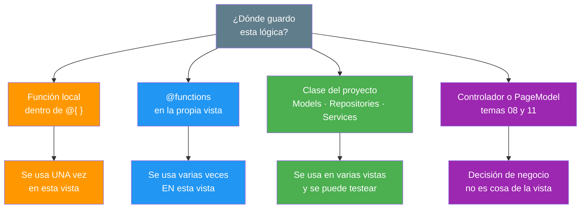
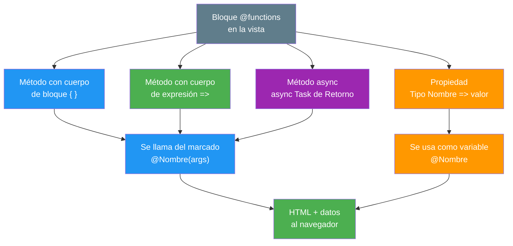
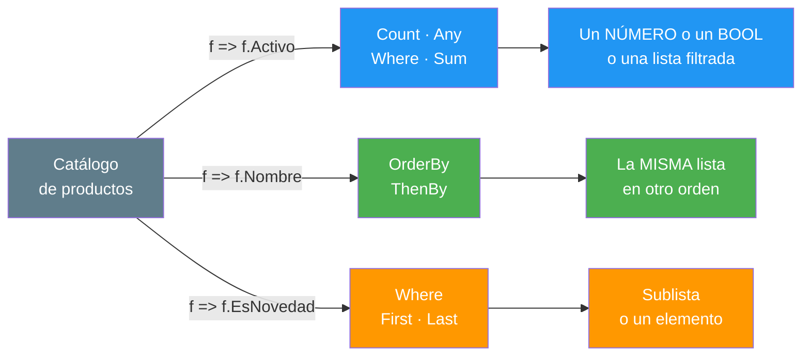
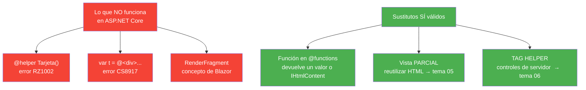

- [4. Funciones y Métodos en las Vistas](#4-funciones-y-métodos-en-las-vistas)
  - [4.1. Por qué Sacar la Lógica de la Vista](#41-por-qué-sacar-la-lógica-de-la-vista)
    - [4.1.1. El Código Repetido](#411-el-código-repetido)
    - [4.1.2. Tres Lugares donde Vive la Lógica](#412-tres-lugares-donde-vive-la-lógica)
  - [4.2. Funciones con @functions](#42-funciones-con-functions)
    - [4.2.1. Métodos y Propiedades](#421-métodos-y-propiedades)
    - [4.2.2. Funciones Asíncronas](#422-funciones-asíncronas)
    - [4.2.3. Funciones que Devuelven HTML](#423-funciones-que-devuelven-html)
    - [4.2.4. Funciones Locales en un Bloque de Código](#424-funciones-locales-en-un-bloque-de-código)
  - [4.3. Funciones Anónimas y Lambdas](#43-funciones-anónimas-y-lambdas)
    - [4.3.1. Lambdas como Argumento](#431-lambdas-como-argumento)
    - [4.3.2. Variables de Tipo Func](#432-variables-de-tipo-func)
    - [4.3.3. Pasar Funciones como Valores](#433-pasar-funciones-como-valores)
  - [4.4. Lo que NO Existe en Razor](#44-lo-que-no-existe-en-razor)
    - [4.4.1. El helper no está Soportado](#441-el-helper-no-está-soportado)
    - [4.4.2. Plantillas Razor no se Deducen](#442-plantillas-razor-no-se-deducen)
  - [4.5. Buenas Prácticas](#45-buenas-prácticas)
  - [4.6. Reto: Saca la lógica del listado de Funkos a funciones](#46-reto-saca-la-lógica-del-listado-de-funkos-a-funciones)
    - [4.6.1. Contexto](#461-contexto)
    - [4.6.2. Retos](#462-retos)


# 4. Funciones y Métodos en las Vistas

> 💡 **Punto de partida:** Cuando Spotify pinta tu lista de reproducción, el sello de *descargado* no está escrito a mano en cada canción: una función decide, una sola vez, qué sello le toca a cada una. Si mañana la regla cambia, se toca la función y cambian todas las canciones a la vez. En este punto aprendes a sacar esa lógica repetida de la vista a funciones con `@functions` y lambdas, y a distinguir lo que una función devuelve: un valor o HTML.

En este tema aprenderás a crear y utilizar funciones dentro de la vista con `@functions`, a escribir funciones locales y **funciones anónimas (lambdas)**, a saber qué devuelve una función (valor o HTML) y a reconocer lo que Razor no soporta, para que no pierdas media hora con un tutorial antiguo.

**Objetivos de aprendizaje:**

- Crear funciones con `@functions` y llamarlas desde el marcado
- Escribir funciones locales dentro de un bloque de código
- Utilizar funciones anónimas (lambdas) y variables de tipo `Func`
- Distinguir una función que devuelve un valor de una que devuelve HTML
- Reconocer las construcciones que ASP.NET Core no soporta

> 📝 **Nota:** seguimos con el repositorio en memoria del punto anterior. Todavía sin base de datos y sin controlador: todo vive en la vista.

## 4.1. Por qué Sacar la Lógica de la Vista

### 4.1.1. El Código Repetido

Compara. Es el mismo listado, antes y después de aplicar una función.

**❌ Antes:** la regla escrita dentro de cada tarjeta:

```cshtml
@foreach (var producto in productos)
{
    <div class="col-md-4 mb-3">
        <h5>@producto.Nombre</h5>

        @if (producto.EsNovedad)
        {
            <span class="badge bg-success">✨ Novedad</span>
        }
        else if (producto.Activo)
        {
            <span class="badge bg-primary">En catálogo</span>
        }
        else
        {
            <span class="badge bg-secondary">Descatalogado</span>
        }

        @if (producto.PrecioReferencia >= 18)
        {
            <span class="badge bg-danger">Premium</span>
        }
        else
        {
            <span class="badge bg-light text-dark">Estándar</span>
        }
    </div>
}
```

**✅ Después:** la regla guardada en una función:

```cshtml
@foreach (var producto in productos)
{
    <div class="col-md-4 mb-3">
        <h5>@producto.Nombre</h5>
        <span class="@ClaseEstado(producto)">@EtiquetaEstado(producto)</span>
        <span class="@ClasePrecio(producto)">@EtiquetaPrecio(producto)</span>
    </div>
}
```

| | Antes | Después |
|---|---|---|
| **Líneas dentro del bucle** | 25 | 3 |
| **Dónde vive la regla** | Mezclada con el HTML | En una función |
| **Si cambia la regla** | Abrir la plantilla y buscar | Tocar una función |
| **¿Se puede probar sola?** | No | Sí |

📌 **Ejemplo real:** En Netflix, la regla que decide si un título lleva el sello *"Nuevo"* no está escrita dentro del HTML de cada tarjeta. Está calculada una vez, en una función, y la plantilla solo pinta lo que esa función devuelve. Si un día la regla cambia, tocan un archivo.

> 💡 **Analogía:** Es la diferencia entre recitar el menú de memoria en cada mesa y tenerlo escrito en una cartilla. Si el precio del plato cambia, en el primer caso tienes que corregir cien mesas; en el segundo, una sola cartilla.

### 4.1.2. Tres Lugares donde Vive la Lógica

No toda la lógica pertenece al mismo sitio. Esta es la escala, de más cercana a más alejada de la vista:



| Situación | Dónde va | Ejemplo |
|-----------|----------|---------|
| Se usa una sola vez, aquí mismo | Función local en `@{ }` | Calcular el total de la página |
| Se usa varias veces, solo en esta vista | `@functions` | La etiqueta de estado |
| Se usa en varias vistas | Clase del proyecto | `RepositorioProductos` |
| Es una decisión de negocio | Controlador / `PageModel` | ¿Se puede dar de baja este Producto? |

> ⚠️ **Advertencia:** `@functions` es cómodo, pero pega la lógica a esa vista: nadie más puede reutilizarla ni testearla. La regla es: si lo usas en dos o más vistas, sácalo a una clase. Ese es precisamente el camino que recorre esta unidad hacia los puntos 07-09.

## 4.2. Funciones con @functions

La directiva `@functions` abre un bloque donde puedes escribir **C# completo**: métodos, propiedades, campos y hasta clases.



### 4.2.1. Métodos y Propiedades

```cshtml
@using ProductosApp.Models
@using ProductosApp.Repositories
@{
    var productos = RepositorioProductos.ObtenerTodos();
}

<h2>Productos (@productos.Count)</h2>
<p>Media de lanzamiento: @MediaAnio(productos).ToString("0")</p>

<ul>
    @foreach (var producto in productos)
    {
        <li>@EtiquetaEstado(producto) — @producto.Nombre</li>
    }
</ul>

@functions {
    // Método con cuerpo de bloque: varias sentencias
    string EtiquetaEstado(Producto f)
    {
        if (f.EsNovedad) return "Novedad";
        if (f.Activo) return "En catálogo";
        return "Descatalogado";
    }

    // Método con cuerpo de expresión: una sola línea
    string EtiquetaPrecio(Producto f) =>
        f.PrecioReferencia >= 18 ? "Premium" : "Estándar";

    // Otros dos, mismas reglas pero devuelven CSS
    string ClaseEstado(Producto f) =>
        f.EsNovedad ? "bg-success" : f.Activo ? "bg-primary" : "bg-secondary";

    string ClasePrecio(Producto f) =>
        f.PrecioReferencia >= 18 ? "bg-danger" : "bg-light text-dark";

    // Propiedad: se usa como si fuera una variable
    public static string Titulo => "Productos del catálogo";

    // Función que recibe el listado entero
    decimal MediaAnio(IEnumerable<Producto> fs) =>
        (decimal)fs.Average(f => f.Anio);
}
```

> 📝 **Nota:** Mira los dos `@using` de la cabecera. `Producto` vive en `ProductosApp.Models` y `RepositorioProductos` en `ProductosApp.Repositories`. Sin importarlos, el compilador responde **`CS0246: El nombre del tipo o del espacio de nombres 'Producto' no se encontró`**. Si una vista usa siempre los mismos `@using`, se declaran una sola vez en `_ViewImports.cshtml`.

| Forma | Cuándo se usa |
|-------|---------------|
| `Retorno Nombre(params) { ... }` | Varias sentencias, `if`, bucles |
| `Retorno Nombre(params) => expresión;` | Una sola expresión |
| `public static Tipo Prop => valor;` | Un valor calculado, sin parámetros |

> 💡 **Consejo:** El cuerpo de expresión `=>` es ideal para la mayoría de funciones de una vista: caben en una línea y se leen como una frase — *"la etiqueta de precio es premium si el precio es mayor o igual que 18"*.

📌 **Ejemplo real:** Glovo calcula el tiempo estimado de entrega con funciones de este tipo: recibe un restaurante y devuelve un número. El HTML solo pinta el número. La lógica está en una función, no en la plantilla.

### 4.2.2. Funciones Asíncronas

Si una función tiene que esperar a algo (una consulta, una llamada HTTP) se declara `async` y se devuelve `Task<T>`. Luego se llama con `await`.

```cshtml
@{
    // await funciona dentro de @{ } porque ExecuteAsync() es async
    var usuario = await CargarUsuarioAsync();
}

<p>Hola, @usuario</p>

@functions {
    async Task<string> CargarUsuarioAsync()
    {
        await Task.Delay(100);   // aquí iría la consulta real
        return "Ana";
    }
}
```

📌 **Ejemplo real:** Las redes sociales pintan *"Hola, Ana"* en la barra superior con este mismo mecanismo: la plantilla consulta quién ha entrado, con una llamada asíncrona al servicio de identidad, y pinta el saludo o el botón de acceso según lo que devuelva.

> ⚠️ **Advertencia:** Si llamas a una función `async` **sin `await`**, el compilador te avisa (CS4014) y la tarea se queda huérfana: la página continúa sin esperar y el dato sale vacío. **`await` siempre.**

### 4.2.3. Funciones que Devuelven HTML

Aquí está la pregunta de oro: *¿y si quiero que la función devuelva etiquetas y no texto?*

Razor **escapa todo lo que es `string`**. Esto es protección contra *cross-site scripting* (XSS), y es lo correcto:

```cshtml
@{
    var texto = "hola <b>mundo</b>";
}
<p>@texto</p>
```

```html
<p>hola &lt;b&gt;mundo&lt;/b&gt;</p>
```

Para que el HTML se pinte de verdad hay dos formas, y las dos desactivan la protección:

```cshtml
@using Microsoft.AspNetCore.Html

<p>@Html.Raw("<strong>negrita</strong>")</p>   @* 1. Html.Raw *@
<p>@Seguro("<em>cursiva</em>")</p>             @* 2. Función que devuelve IHtmlContent *@

@functions {
    IHtmlContent Seguro(string html) => new HtmlString(html);
}
```

El HTML resultante es:

```html
<p id="escapado">hola &lt;b&gt;mundo&lt;/b&gt;</p>
<p id="raw">hola <b>mundo</b></p>
<p id="ihtml">hola <b>mundo</b></p>
```

> ⚠️ **Advertencia:** seguridad (XSS): `Html.Raw` y `HtmlString` dicen al servidor **"esto ya es HTML, no lo toques"**. Si ese texto lo ha escrito un usuario, estás inyectando su HTML y su JavaScript en tu página: eso es un agujero de seguridad de nivel medio/alto. Nunca pases por aquí datos que vengan de un formulario, de la URL o de una base de datos.
>
> ✅ **Regla:** HTML de tu plantilla → puede. HTML del usuario → jamás.

> 💡 **Consejo:** Si lo que quieres es reutilizar HTML (una tarjeta, un pie, un listado), la respuesta correcta no es una función que devuelva `IHtmlContent`: es una vista parcial. Esa es exactamente la razón de ser del punto **05** · Layouts, Partials y Componentes de Vista.

### 4.2.4. Funciones Locales en un Bloque de Código

Dentro de un `@{ }` puedes declarar funciones como si fueran variables. Se llaman funciones locales.

```cshtml
@using ProductosApp.Repositories
@{
    var productos = RepositorioProductos.ObtenerTodos();

    // Función local
    string Mayusculas(string s) => s.ToUpperInvariant();
    int Doble(int x) => x * 2;
    static string Limpio(string s) => s.Trim();   // static: SÍ · public: NO
}

<p>@Mayusculas("productos") → @(Doble(21))</p>
```

Funciona, y ojo: se ve en toda la vista, no solo dentro del bloque. ¿Por qué? Mira lo que genera Razor dentro de `ExecuteAsync()`:

```csharp
public async override Task ExecuteAsync()
{
    string Mayusculas(string s) => s.ToUpperInvariant();   // Razor NO abre llaves extra
    int Doble(int x) => x * 2;

    WriteLiteral("<p>");
    Write(Mayusculas("productos"));      // la sigue viendo: misma función
    WriteLiteral("</p>");
}
```

El `@{ }` de nivel superior no crea ámbito nuevo: sus sentencias se pegan tal cual dentro de la función. La cosa cambia si declaras la función dentro de otro bloque:

```cshtml
@if (true)
{
    string Anidada(string s) => s.ToUpperInvariant();
}

<p>@Anidada("hola")</p>   @* ❌ CS0103: El nombre 'Anidada' no existe en el contexto actual *@
```

Ahí sí hay llaves, y la función se queda dentro sin salir.

| | **Función local** en `@{ }` | Función local dentro de `@if` | **`@functions`** |
|---|---|---|---|
| **Dónde la escribe Razor** | Dentro de `ExecuteAsync()` | Dentro de ese `if` | Como miembro de la clase |
| **Alcance** | Toda la vista | Solo ese bloque | Toda la vista |
| **¿Puede ser `public static`?** | `static` sí · `public` no | No | Sí |
| **Ideal para** | Auxiliar rápida de esta vista | Lógica privada de un bucle | Reglas que se repiten |

> 📝 **Nota:** Puedes verlo tú mismo: compila con `/p:EmitCompilerGeneratedFiles=true` y abre el `.g.cs` que se genera en `obj/`. Es la mejor forma de entender Razor: **compila a C# y ese C# se puede leer**.

> 💡 **Analogía:** Una función local es una herramienta que sacas del cajón, la usas y la guardas. `@functions` es una herramienta atornillada a la vista: se queda montada mientras dure la página.

## 4.3. Funciones Anónimas y Lambdas

Una lambda (o función anónima) es una función sin nombre, escrita al vuelo: `x => expresión`. Es la base de LINQ y de casi todo lo que hace falta en una vista.

### 4.3.1. Lambdas como Argumento

```cshtml
@using ProductosApp.Repositories
@{
    var productos = RepositorioProductos.ObtenerTodos();

    var activos   = productos.Count(f => f.Activo);
    var novedades  = productos.Where(f => f.EsNovedad).ToList();
    var ordenados  = productos.OrderBy(f => f.Nombre).ToList();
    var hayElectronica  = productos.Any(f => f.Categoria == "Electrónica");
    var totalAnios = productos.Sum(f => f.Anio);
}

<p>Activos: @activos de @productos.Count</p>
<p>¿Hay algún producto de Electrónica? @hayElectronica</p>
<p>Suma de años (solo por probar): @totalAnios</p>

<ul>
    @foreach (var producto in ordenados)
    {
        <li>@producto.Nombre</li>
    }
</ul>
```



| Lambda | Método | Devuelve |
|--------|--------|----------|
| `f => f.Activo` | `Count`, `Any`, `All` | `int` o `bool` |
| `f => f.Activo` | `Where` | Sublista |
| `f => f.Nombre` | `OrderBy` | Lista ordenada |
| `f => f.Anio` | `Sum`, `Average`, `Min`, `Max` | Número |
| `f => f.Nombre` | `First`, `FirstOrDefault` | Un elemento |

> 📝 **Nota:** El parámetro `f` no tiene nombre fijo: podrías escribir `x => x.Activo` y significaría lo mismo. Convención: nombres cortos y en singular porque representan un elemento de la lista.

### 4.3.2. Variables de Tipo Func

Una lambda también se puede guardar en una variable. El tipo es `Func<..., Retorno>`:

```cshtml
@using ProductosApp.Models
@using ProductosApp.Repositories
@{
    var productos = RepositorioProductos.ObtenerTodos();

    // Func<parámetro, retorno>
    Func<Producto, string> etiqueta = f => f.EsNovedad ? "Nuevo" : "Clásico";

    // Func<parámetro, bool>  → se llama "predicado"
    Func<Producto, bool> esBarato = f => f.PrecioReferencia < 15;

    var baratos = productos.Count(esBarato);
}

<ul>
    @foreach (var producto in productos)
    {
        <li>@etiqueta(producto) — @producto.Nombre</li>
    }
</ul>

<p>Menos de 15 € de referencia: @baratos</p>
```

| Tipo | Significado | Ejemplo |
|------|-------------|---------|
| `Func<TResult>` | Sin parámetros, devuelve `TResult` | `Func<int> → () => 42` |
| `Func<T, TResult>` | Un parámetro `T` | `Func<Producto, string>` |
| `Func<T1, T2, TResult>` | Dos parámetros | `Func<string, int, bool>` |
| `Func<T, bool>` | Un parámetro, `bool` | Lo que acepta `Any` y `Count` |

> 💡 **Truco:** Cuenta de derecha a izquierda: lo que está al final es lo que devuelve; lo que está antes son los parámetros. `Func<Producto, string>` = *"recibo un Producto y devuelvo un string"*.

### 4.3.3. Pasar Funciones como Valores

Lo verdaderamente potente: una función que recibe otra función. Así decides en el sitio de la llamada qué regla aplicar, sin reescribir la función.

```cshtml
@using ProductosApp.Models
@using ProductosApp.Repositories

@functions {
    // Recibe la REGLA como parámetro
    IEnumerable<Producto> Filtrar(IEnumerable<Producto> fs, Func<Producto, bool> criterio)
        => fs.Where(criterio);

    // Recibe la FUNCIÓN QUE PINTA
    string Resumir(IEnumerable<Producto> fs, Func<Producto, string> formato)
        => string.Join(" · ", fs.Select(formato));
}

@{
    var productos = RepositorioProductos.ObtenerTodos();

    var activos = Filtrar(productos, f => f.Activo);                  @* regla 1 *@
    var electronicas  = Filtrar(productos, f => f.Categoria == "Electrónica");   @* regla 2 *@

    var linea = Resumir(productos, f => $"{f.Nombre} ({f.Anio})");
}

<p>Activos: @string.Join(", ", activos.Select(f => f.Nombre))</p>
<p>Electrónica:  @string.Join(", ", electronicas.Select(f => f.Nombre))</p>
<p>@linea</p>
```

📌 **Ejemplo real:** Un motor de búsqueda no tiene una función distinta para *"buscar por precio"*, *"buscar por nombre"* y *"buscar por fecha"*. Tiene una función de búsqueda que recibe el criterio. Tú estás construyendo la misma idea a menor escala.

> 💡 **Consejo:** Cuando veas `Func<...>` en un parámetro, léelo así: *"esta función no decide qué buscar, solo cómo recorrer lo que le den"*.

## 4.4. Lo que NO Existe en Razor

Nada de esto funciona en Razor, por mucho que te lo parezca. Saberlo ahorra media hora de vida.



### 4.4.1. El helper no está Soportado

Si buscas *"helpers en Razor"* encontrarás cientos de tutoriales con esta sintaxis, de la época de **ASP.NET MVC 3 y WebMatrix**:

```cshtml
@* ❌ NO COMPILA en ASP.NET Core *@
@helper Tarjeta(string nombre)
{
    <div class="card">@nombre</div>
}
```

El compilador lo dice clarito:

```
error RZ1002: The helper directive is not supported.
```

📌 **Ejemplo real:** Es el error **RZ1002**, de la familia de códigos `RZxxxx`. Cuando veas un error que empieza por `RZ`, el problema está en la sintaxis de la plantilla, no en tu lógica de C#. Esa distinción te ahorra buscar el fallo en el sitio equivocado.

> 💡 **Consejo:** Los códigos de error tienen dos familias: **`RZ`** = sintaxis de la plantilla Razor · **`CS`** = C#. Antes de culpar a Razor, mira si el error es `CS`: entonces es C# de siempre.

### 4.4.2. Plantillas Razor no se Deducen

Razor sí permite escribir marcado como valor (se llaman plantillas Razor), pero **no se puede guardar en un `var`**: el compilador no deduce el tipo de delegado.

```cshtml
@* ❌ NO COMPILA *@
@{ var plantilla = @<div class="card">Hola</div>; }

@* ❌ TAMPOCO: el tipo de retorno no encaja *@
@{ Func<string, object> t = s => @<div>@s</div>; }
```

```
error CS8917: El tipo de delegado no se puede deducir.
error CS1662: No se puede convertir expresión lambda en el tipo delegado indicado...
```

**¿Y entonces cómo se reutiliza HTML?** Con lo que ya sabes y lo que viene:

| Quiero reutilizar... | Herramienta | Punto |
|----------------------|-------------|-------|
| **Lógica** (calcular, formatear, decidir) | `@functions` y lambdas | Éste |
| **HTML** (una tarjeta, un pie, un listado) | Vista parcial | 05 |
| **Etiquetas con comportamiento** (un formulario, un enlace) | Tag Helper | 06 |
| **Una sección completa de la página** | Layout | 05 |

> ⚠️ **Advertencia:** Si vienes de Blazor (UD04), `RenderFragment`, `@code { }` y `CascadingValue` no existen aquí. Son conceptos de componentes de cliente. En `.cshtml` el bloque se llama `@functions`.

## 4.5. Buenas Prácticas

- **Saca a `@functions`** toda regla que se repita más de una vez dentro de la vista
- Si la lógica se usa en dos o más vistas, sácala a una clase: `@functions` es temporal
- Usa el **cuerpo de expresión `=>`** cuando la función cabe en una línea
- Reserva **`Func<..., bool>`** para criterios que luego pasas a `Where`, `Any`, `Count`
- **Separa responsabilidades**: las funciones devuelven valores; el HTML lo pone la plantilla
- Comprueba con **F12** que una función nueva cambia todas las tarjetas, no una sola
- **No uses `Html.Raw` ni `HtmlString`** con datos de usuario, de la URL o de la base de datos
- **No uses `@helper`**: no existe en ASP.NET Core (error `RZ1002`)
- **No guardes marcado en un `var`**: la plantilla Razor no deduce el delegado (`CS8917`)
- **No olvides `await`** en una función `async`: la tarea queda huérfana (CS4014)

## 4.6. Reto: Saca la lógica del listado de Funkos a funciones

> Saca la lógica del listado de FunkoApp a funciones. Mismo HTML, mucho menos código.

### 4.6.1. Contexto

**Paso 0**: parte del listado que montaste en el reto del punto 03 (`Models/Funko.cs`, `Repositories/RepositorioFunkos.cs` y la vista `Pages/Funkos/Index.cshtml` con su `@foreach`). Si todavía no lo tienes, crea esos tres ficheros siguiendo ese mismo reto.

### 4.6.2. Retos

Sigue estos pasos dentro de la vista del listado:

1. Copia en `@functions` las cuatro funciones del ejemplo (`EtiquetaEstado`, `EtiquetaPrecio`, `ClaseEstado` y `ClasePrecio`) y sustituye los dos `@if / else if / else` de tu tarjeta por `@EtiquetaEstado(funko)`, `@ClaseEstado(funko)`, `@EtiquetaPrecio(funko)` y `@ClasePrecio(funko)`
2. **Reescribe** `EtiquetaEstado` y `ClaseEstado` con una **expresión `switch`** en vez del `if` encadenado y comprueba con F12 que el HTML no ha cambiado ni un carácter
3. Crea una función con **cuerpo de expresión `=>`** que formatee el precio de referencia con `.ToString("C")`
4. Declara una función local dentro del `@{ }` de la raíz y comprueba que sí se ve en toda la vista (Razor no le abre llaves extra). Luego declara otra dentro de un `@if` y comprueba el error **`CS0103`** al llamarla fuera
5. Guarda en una variable **`Func<Funko, string>`** el texto que quieres pintar por cada Funko y úsala dentro del bucle con `@etiqueta(funko)`
6. Usa LINQ con lambda: `Count(f => f.Activo)`, `Any(f => f.EsNovedad)` y `OrderBy(f => f.Nombre)`, y pinta los tres resultados
7. Escribe una función que reciba otra función (`Func<Funko, bool>`) y llama dos veces a la misma función con criterios distintos
8. **Comprueba con F12** que el HTML final es **idéntico al del reto del punto 03** y que, al cambiar una sola función, cambian todas las tarjetas a la vez

**Puntos extra:**

- Escribe `@helper Tarjeta(...)` a propósito y lee el error **`RZ1002`**: deja constancia con un comentario
- Prueba a guardar marcado en un `var` y lee el **`CS8917`**
- Crea una función `async Task<string>` y llámala con `await` desde `@{ }`
- Usa `@Html.Raw` con un texto tuyo y compáralo con `@texto` en la pestaña Elementos: observa el escapado
- Mete una función en una clase aparte de `Models/` y observa que la vista se encoge

---

**Resumen del punto:**

| Concepto | Descripción |
|----------|-------------|
| **DRY** | *Don't Repeat Yourself*: una regla, un sitio |
| **`@functions`** | Bloque C# completo en la vista: métodos, propiedades, campos |
| **Cuerpo de expresión** | `=> expresión;` para funciones de una sola línea |
| **Propiedad en `@functions`** | Un valor calculado que se usa como variable |
| **Función local** | En un `@{ }` de nivel superior la ve toda la vista; dentro de un `@if`, no (`CS0103`) |
| **Función `async`** | Devuelve `Task<T>` y se llama con `await` |
| **Escapado** | Todo `string` se convierte en `&lt;` y `&gt;`: protección XSS |
| **`Html.Raw` / `HtmlString`** | Pintan HTML sin escapar; jamás con datos de usuario |
| **Lambda** | Función sin nombre: `x => expresión` |
| **`Func<T, TResult>`** | Variable que guarda una función; el último tipo es el retorno |
| **Función que recibe funciones** | El sitio de la llamada decide la regla |
| **`@helper`** | No existe: error `RZ1002` |
| **Plantilla Razor en `var`** | No deduce el delegado: error `CS8917` |
| **Familias de error** | `RZ` = plantilla · `C` = C# |

**¿Qué viene después?**

En el siguiente punto veremos Layouts, Partials y Componentes de Vista: cómo reutilizar HTML (que es lo que las funciones no deben hacer) con `_Layout`, `_ViewStart` y las vistas parciales, para que tu aplicación deje de repetir la misma estructura en cada página.
