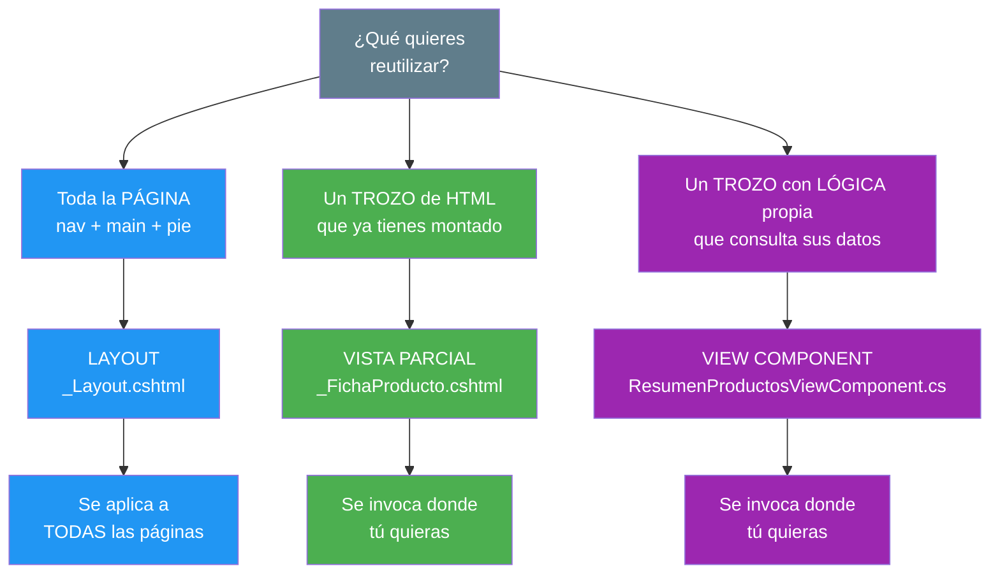
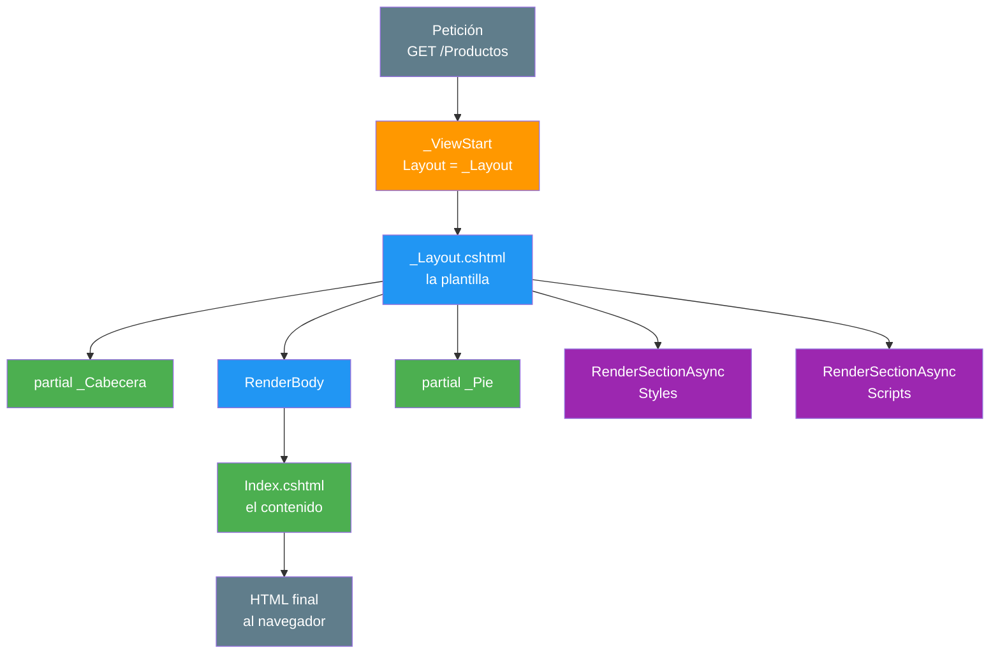
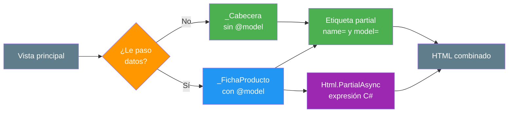
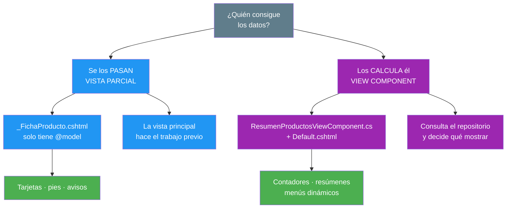
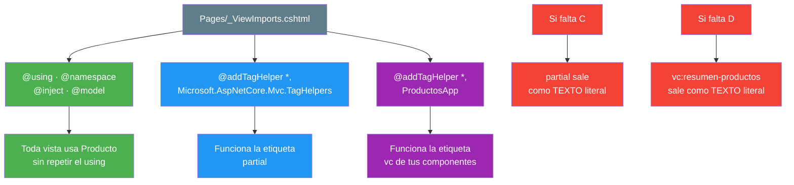

- [5. Layouts, Partials y Componentes de Vista](#5-layouts-partials-y-componentes-de-vista)
  - [5.1. El Problema: Repetir la Misma Estructura](#51-el-problema-repetir-la-misma-estructura)
    - [5.1.1. Copiar y Pegar en Cada Página](#511-copiar-y-pegar-en-cada-página)
    - [5.1.2. Tres Niveles de Reutilización](#512-tres-niveles-de-reutilización)
  - [5.2. El Layout: la Plantilla Maestra](#52-el-layout-la-plantilla-maestra)
    - [5.2.1. El Gancho que Fija el Layout](#521-el-gancho-que-fija-el-layout)
    - [5.2.2. La Plantilla y RenderBody](#522-la-plantilla-y-renderbody)
    - [5.2.3. Secciones con RenderSectionAsync](#523-secciones-con-rendersectionasync)
    - [5.2.4. Layouts Anidados y el Layout Nulo](#524-layouts-anidados-y-el-layout-nulo)
  - [5.3. Vistas Parciales](#53-vistas-parciales)
    - [5.3.1. Parciales sin Modelo](#531-parciales-sin-modelo)
    - [5.3.2. Parciales con Modelo](#532-parciales-con-modelo)
    - [5.3.3. Partial y PartialAsync](#533-partial-y-partialasync)
  - [5.4. Componentes de Vista](#54-componentes-de-vista)
    - [5.4.1. Por Qué no Basta una Parcial](#541-por-qué-no-basta-una-parcial)
    - [5.4.2. Crear un Componente](#542-crear-un-componente)
    - [5.4.3. Invocarlo: InvokeAsync y la Etiqueta vc](#543-invocarlo-invokeasync-y-la-etiqueta-vc)
  - [5.5. _ViewImports: las Directivas Compartidas](#55-_viewimports-las-directivas-compartidas)
    - [5.5.1. Las Directivas que Comparte](#551-las-directivas-que-comparte)
    - [5.5.2. Registrar los Tag Helpers del Proyecto](#552-registrar-los-tag-helpers-del-proyecto)
  - [5.6. Buenas Prácticas](#56-buenas-prácticas)
  - [5.7. Reto: Da estructura a FunkoApp con layout, parciales y componentes](#57-reto-da-estructura-a-funkoapp-con-layout-parciales-y-componentes)
    - [5.7.1. Contexto](#571-contexto)
    - [5.7.2. Retos](#572-retos)


# 5. Layouts, Partials y Componentes de Vista

> 💡 **Punto de partida:** Tienes ya seis páginas en ProductosApp y todas empiezan igual: el `<!DOCTYPE>`, el `<head>`, el título, el menú, el pie... Mañana el profesor te pide cambiar el color del menú. ¿Cuántos ficheros tienes que abrir? Si la respuesta es *"seis"*, tu proyecto tiene un problema estructural, no de código.

En este tema aprenderás a trocear la interfaz en tres piezas reutilizables (layout, vistas parciales y componentes de vista), a conectarlas entre sí con `_ViewStart`, `_Layout` y `_ViewImports`, y a saber cuándo conviene cada una.

**Objetivos de aprendizaje:**

- Crear un layout maestra con `_ViewStart.cshtml`, `_Layout.cshtml` y `@RenderBody()`
- Insertar contenido puntual con `@section` y `@RenderSectionAsync`
- Extraer trozos de HTML a vistas parciales, con y sin modelo
- Crear e invocar un View Component que calcule sus propios datos
- Centralizar directivas y registrar Tag Helpers en `_ViewImports.cshtml`

> 📝 **Nota:** seguimos con ProductosApp y el repositorio en memoria. Sin base de datos y sin controladores: todo sigue viviendo en las vistas. Ahora lo que hacemos es *organizarlo*.

## 5.1. El Problema: Repetir la Misma Estructura

### 5.1.1. Copiar y Pegar en Cada Página

**❌ Así se ve una página antes del tema:**

```cshtml
@* Pages/Productos/Index.cshtml — la PRIMERA línea ya es un incumplimiento *@
<!DOCTYPE html>
<html lang="es">
<head>
    <meta charset="utf-8" />
    <title>Productos - ProductosApp</title>
    <link rel="stylesheet" href="https://cdn.jsdelivr.net/npm/bootstrap@5.3.3/dist/css/bootstrap.min.css" />
</head>
<body>
    <nav class="navbar navbar-dark bg-primary">
        <span class="navbar-brand">ProductosApp</span>
    </nav>

    <main class="container mt-4">
        <h1>Productos</h1>
        @* ... el contenido de verdad, perdido en medio del ruido ... *@
    </main>

    <footer><p class="text-muted">&copy; 2026 - DAW</p></footer>
</body>
</html>
```

El contenido real ocupa **4 líneas**; el armazón, **20**. Multiplicado por diez páginas:

| | Sin estructura | Con estructura |
|---|---|---|
| **Líneas de armazón** | 20 × 10 = 200 | 20 (una sola vez) |
| **Líneas de contenido** | 4 × 10 = 40 | 4 × 10 = 40 |
| **Cambio en el menú** | 10 ficheros | **1 fichero** |
| **Ficheros que puedes olvidar** | Ninguno... hasta que sí | **0** |

📌 **Ejemplo real:** Wikipedia no tiene *"plantilla de artículo"* escrita dentro de cada artículo de la enciclopedia. Tiene una estructura global (barra de navegación, pie, caja de herramientas) y cada artículo solo aporta su texto. Cuando cambian el diseño de la barra, se cambia en un sitio y se actualizan los miles de artículos a la vez.

> 💡 **Analogía:** Es la diferencia entre coser el cuello a cada camiseta por separado y tener una plantilla de corte. Misma camiseta, un minuto en vez de una hora.

### 5.1.2. Tres Niveles de Reutilización

No todo lo que se repite es lo mismo. Por eso hay tres herramientas, y cada una resuelve un tamaño distinto:



| Herramienta | ¿Qué reutiliza? | ¿Tiene lógica propia? | Ejemplo en ProductosApp |
|---|---|---|---|
| **Layout** | La estructura completa | No | `<head>`, menú y pie |
| **Vista parcial** | Un trozo de HTML | No: recibe los datos | Una ficha de Producto |
| **View Component** | Un trozo de HTML | Sí: busca sus datos | El resumen del catálogo |

> ⚠️ **Advertencia:** Elegir mal cuesta. Si creas un View Component para pintar un pie de página que no necesita datos, estás metiendo C# donde bastaba HTML. Y si creas una parcial para un contador que debe consultar el repositorio, te quedará un lío de "la vista le pasa los datos a la parcial, que a su vez...". Usa la tabla de arriba.

## 5.2. El Layout: la Plantilla Maestra

### 5.2.1. El Gancho que Fija el Layout

Si cada página tuviera que escribir `Layout = "_Layout";`, estaríamos en lo mismo de antes: repetición. Para evitarlo existe **`_ViewStart.cshtml`**, un fichero que ASP.NET Core ejecuta antes que cualquier vista de esa carpeta y de sus subcarpetas.

**Razor Pages:** `Pages/_ViewStart.cshtml` · **MVC:** `Views/_ViewStart.cshtml`

```cshtml
@{
    Layout = "_Layout";
}
```

Tres líneas. A partir de ahí, todas las páginas heredan el layout sin decir nada.

📌 **Ejemplo real:** Es el mismo truco que usan los procesadores de texto con el **estilo "Normal"**. No escribes la fuente en cada párrafo: defines una vez qué fuente lleva *Normal* y todos los párrafos que usen ese estilo la heredan.

### 5.2.2. La Plantilla y RenderBody

El layout vive en `Pages/Shared/_Layout.cshtml` y es una página HTML normal... con un hueco: `@RenderBody()`.

```cshtml
<!DOCTYPE html>
<html lang="es">
<head>
    <meta charset="utf-8" />
    <title>@ViewData["Title"] - ProductosApp</title>
    <link rel="stylesheet" href="https://cdn.jsdelivr.net/npm/bootstrap@5.3.3/dist/css/bootstrap.min.css" />
    @await RenderSectionAsync("Styles", required: false)
</head>
<body>
    <header><partial name="_Cabecera" /></header>

    <main class="container mt-4">
        @RenderBody()
    </main>

    <footer><partial name="_Pie" /></footer>

    @await RenderSectionAsync("Scripts", required: false)
</body>
</html>
```

Y la página queda reducida a solo su contenido:

```cshtml
@page
@{
    ViewData["Title"] = "Productos del catálogo";
}

<h1>Productos del catálogo</h1>
<p>Aquí vive únicamente lo propio de esta página.</p>
```



| Pieza del layout | Para qué sirve |
|---|---|
| `@ViewData["Title"]` | Cada página pone su título sin tocar el `<head>` |
| `@RenderBody()` | Hueco único: aquí entra el contenido de la página |
| `<partial name="_Cabecera" />` | El menú, sacado a su propio fichero |
| `@await RenderSectionAsync(...)` | Huecos opcionales que la página puede o no rellenar |

> 💡 **Consejo:** `@RenderBody()` puede aparecer solo una vez por layout. Si lo pones dos veces, ASP.NET Core lanza una excepción: el contenido no se puede renderizar dos veces.

> 📝 **Nota:** Como ves, el CSS va por CDN (`cdn.jsdelivr.net`). En esta unidad no nos complicamos con `wwwroot` ni con *bundling*; el objetivo es ver el layout funcionando.

### 5.2.3. Secciones con RenderSectionAsync

`@RenderBody()` es el hueco obligatorio. Las secciones son huecos opcionales para cosas que solo alguna página necesita —una hoja de estilos extra, un script concreto.

**En el layout** (el hueco):

```cshtml
@await RenderSectionAsync("Styles", required: false)
...
@await RenderSectionAsync("Scripts", required: false)
```

**En la página** (el contenido de la sección):

```cshtml
@page
@{
    ViewData["Title"] = "Productos";
}

<h1>Productos</h1>

@section Styles {
    <style id="estilo-seccion">body { background: #fafafa; }</style>
}

@section Scripts {
    <script id="script-seccion">console.log("hola desde la sección");</script>
}
```


| Situación | `required: false` | `required: true` |
|---|---|---|
| La página define la sección | ✅ HTTP 200 | ✅ HTTP 200 |
| La página no la define | ✅ HTTP 200 | ❌ **HTTP 500** |

Y en el HTML final, cada sección aparece en su hueco: `Styles` **dentro del `<head>`** y `Scripts` **antes de cerrar el `<body>`**.

> ⚠️ **Advertencia:** `required: true` es un arma de doble filo. Si mañana añades una página nueva y olvidas la sección, la aplicación se rompe en tiempo de ejecución con un 500. Para scripts y estilos opcionales, **`required: false` siempre**.

### 5.2.4. Layouts Anidados y el Layout Nulo

El layout no tiene por qué ser único. Puedes encadenar: una plantilla secundaria que a su vez hereda de la principal.

**`Pages/Shared/_AdminLayout.cshtml`:**

```cshtml
@{
    Layout = "_Layout";     @* <- aquí está la cadena *@
}
<div class="row">
    <aside class="col-3">Menú de gestión</aside>
    <section class="col-9">@RenderBody()</section>
</div>
```

**La página que lo usa:**

```cshtml
@page
@{
    ViewData["Title"] = "Panel de gestión";
    Layout = "_AdminLayout";
}

<h1 id="contenido">Contenido del panel</h1>
```

El orden de renderizado es exactamente este: la cabecera del `_Layout` principal → el `<aside>` del `_AdminLayout` → el contenido de la página → el pie del principal.

| Situación | Qué obtienes |
|---|---|
| `Layout = "_AdminLayout"` | Página con barra lateral, dentro de la plantilla principal |
| Sin escribir nada | Hereda `_Layout` desde `_ViewStart` |
| `Layout = null` | Página suelta, sin cabecera ni pie |

```cshtml
@page
@{ Layout = null; }
<!DOCTYPE html>
<html><head><title>Solo yo</title></head><body><p>sin layout</p></body></html>
```

📌 **Ejemplo real:** Gmail funciona así. La pantalla de lectura de un correo es una plantilla; el panel de *"Ajustes"* usa una plantilla secundaria con su propio menú lateral; y la pantalla de inicio de sesión es una página suelta (`Layout = null`): no tiene ni cabecera ni pie de la bandeja, porque no tiene sentido.

> 💡 **Analogía:** Un layout anidado es una caja dentro de otra caja. El contenido va en la caja pequeña, la caja pequeña va en la grande, y la grande es la que viaja.

## 5.3. Vistas Parciales

Una vista parcial es un fragmento `.cshtml` con extensión `.cshtml` que se inserta dentro de otra vista. Vive en `Pages/Shared/` (o `Views/Shared/` en MVC) y **empieza por `_`** por convención: así se ve de un vistazo que es una pieza, no una página.

### 5.3.1. Parciales sin Modelo

Para trozos que no necesitan datos: cabecera, pie, aviso fijo...

**`Pages/Shared/_Cabecera.cshtml`:**

```cshtml
<nav class="navbar navbar-dark bg-primary">
    <span class="navbar-brand">ProductosApp</span>
</nav>
```

**`Pages/Shared/_Pie.cshtml`:**

```cshtml
<p class="text-muted">&copy; 2026 - DAW</p>
```

**Uso, dentro del layout:**

```cshtml
<header><partial name="_Cabecera" /></header>
...
<footer><partial name="_Pie" /></footer>
```

Sin modelo, sin parámetros, sin ceremonia. HTML puro que se pega donde lo pidas.

### 5.3.2. Parciales con Modelo

Cuando el trozo sí depende de datos, la parcial declara su modelo con `@model`.

**`Pages/Shared/_FichaProducto.cshtml`:**

```cshtml
@model ProductosApp.Models.Producto
<div class="card mb-3 ficha">
    <div class="card-body">
        <h5 class="card-title">@Model.Nombre</h5>
        <p class="card-text">@Model.Categoria · @Model.Anio</p>
    </div>
</div>
```

**Y quien la invoca le pasa el dato:**

```cshtml
@using ProductosApp.Models
@using ProductosApp.Repositories
@{
    var productos = RepositorioProductos.ObtenerTodos();
}

<partial name="_FichaProducto" model="productos[0]" />

@await Html.PartialAsync("_FichaProducto", productos[1])
```

> 📝 **Nota:** Ojo con el `model` (minúscula). En la etiqueta `model` es un atributo con el objeto; en la parcial, `@model` es la directiva que declara el tipo. Dos cosas distintas con el mismo nombre: es una de las confusiones más habituales.

### 5.3.3. Partial y PartialAsync

Hay dos formas de invocar una parcial. Las dos funcionan.



| Sintaxis | Cuándo usarla |
|---|---|
| `<partial name="_X" model="obj" />` | **El 90% de los casos.** Se lee como HTML y no rompe la línea de lectura |
| `@await Html.PartialAsync("_X", obj)` | Cuando necesitas **C# dentro de una expresión**: un `if`, un bucle, una condición |

En la misma página, una invocación con `<partial>` y otra con `PartialAsync` producen dos fichas idénticas en el HTML final.

> ⚠️ **Advertencia:** La etiqueta `<partial>` es un Tag Helper, y los Tag Helpers solo funcionan si están registrados en `_ViewImports.cshtml`. Si quitas esa línea, **`<partial>` sale como texto literal** en el navegador en vez de insertar la pieza. Lo ves en la sección 5.5.

> 💡 **Consejo:** Si necesitas pasarle a la parcial un modelo tipado desde la propia página, usa `<partial for="MiObjeto" />` con `@model MiTipo` en la vista principal. El `for` le dice a la parcial: *"este es tu modelo"*.

## 5.4. Componentes de Vista

### 5.4.1. Por Qué no Basta una Parcial

Una parcial es un trozo de HTML al que le pasan los datos. Pero hay trozos que necesitan buscar sus propios datos: un contador, un menú de categorías, un resumen.



📌 **Ejemplo real:** En Instagram, el número de seguidores de un perfil no se lo pasa la página al componente: el componente lo consulta él mismo cada vez que se pinta. Si se lo tuviera que pasar la vista, cada pantalla que quiera mostrar seguidores tendría que repetir la misma consulta. Un View Component evita exactamente eso.

### 5.4.2. Crear un Componente

Un componente son dos ficheros: la clase C# y su vista.

**1. La clase**: `Components/ResumenProductosViewComponent.cs`:

```csharp
using ProductosApp.Models;
using ProductosApp.Repositories;
using Microsoft.AspNetCore.Mvc;

namespace ProductosApp.Components;

/// <summary>
/// Componente que calcula sus propios datos antes de pintarse.
/// </summary>
public class ResumenProductosViewComponent : ViewComponent
{
    public IViewComponentResult Invoke(int limite)
    {
        var productos = RepositorioProductos.ObtenerTodos()
            .OrderBy(f => f.Nombre)
            .Take(limite)
            .ToList();

        return View(productos);
    }
}
```

> ⚠️ **Advertencia:** Necesitas el `using Microsoft.AspNetCore.Mvc;`. Sin él, el compilador devuelve **`CS0246: El nombre del tipo o del espacio de nombres 'ViewComponent' no se encontró`**. Es el error número uno de este tema.

**2. La vista**: `Pages/Shared/Components/ResumenProductos/Default.cshtml`:

```cshtml
@model IEnumerable<ProductosApp.Models.Producto>
<div class="alert alert-info resumen">
    <strong>Resumen (@Model.Count())</strong>
    <ul class="mb-0">
        @foreach (var f in Model)
        {
            <li>@f.Nombre</li>
        }
    </ul>
</div>
```

**Las reglas de nombres** no se negocian: por convención, ASP.NET Core descubre el componente así.

| Elemento | Regla | Nuestro caso |
|---|---|---|
| **Clase** | Termina en `ViewComponent` | `ResumenProductosViewComponent` |
| **Nombre del componente** | Sin ese sufijo | `ResumenProductos` |
| **Carpeta de la vista** | `Components/` + nombre + `/` | `Components/ResumenProductos/` |
| **Archivo de la vista** | `Default.cshtml` por defecto | `Default.cshtml` |
| **Sin registro en DI** | No hay que añadirlo en `Program.cs` | Se descubre solo |

### 5.4.3. Invocarlo: InvokeAsync y la Etiqueta vc

Hay dos formas, y ambas respetan el parámetro `limite`.

```cshtml
@* 1. Forma clásica: C# dentro del marcado *@
@await Component.InvokeAsync("ResumenProductos", new { limite = 3 })

@* 2. Forma moderna: como si fuera una etiqueta HTML *@
<vc:resumen-productos limite="2" />
```

| Forma | Resultado | Estilo |
|---|---|---|
| `Component.InvokeAsync("ResumenProductos", new { limite = 3 })` | `Resumen (3)` | Funciona, pero mezcla C# con HTML |
| `<vc:resumen-productos limite="2" />` | `Resumen (2)` | Se lee como HTML |

La conversión del nombre es automática pero hay que conocerla: `ResumenProductos` → **`resumen-productos`** (*PascalCase* → *kebab-case*).

> 💡 **Truco:** Si te aparece `<vc:resumen-productos limite="2" />` literalmente en el navegador, no has roto el componente: falta registrar los Tag Helpers del proyecto en `_ViewImports.cshtml`. Es la sección siguiente, y es el error más común del tema.

## 5.5. _ViewImports: las Directivas Compartidas

`_ViewImports.cshtml` no produce HTML: es el fichero que ASP.NET Core aplica a todas las vistas de su carpeta y subcarpetas antes que nada. Es donde vive lo que se repite.

### 5.5.1. Las Directivas que Comparte

```cshtml
@using ProductosApp
@namespace ProductosApp.Pages
@addTagHelper *, Microsoft.AspNetCore.Mvc.TagHelpers
@addTagHelper *, ProductosApp
```



📌 **Ejemplo real:** En el tema anterior nos quejamos de que cada vista necesitaba `@using ProductosApp.Models` y `@using ProductosApp.Repositories`. Este es el sitio donde se escriben una vez y desaparecen de todas las demás.

### 5.5.2. Registrar los Tag Helpers del Proyecto

La directiva `@addTagHelper` dice: *"busca en esta asamblea las etiquetas que sabes interpretar"*. Y el asterisco significa *"toda la asamblea"*.

| Línea | Qué activa | Efecto |
|---|---|---|
| `@addTagHelper *, Microsoft.AspNetCore.Mvc.TagHelpers` | Los Tag Helpers de ASP.NET Core, entre ellos **`<partial>`** | ✅ Sin ella, **`<partial>` sale literal** |
| `@addTagHelper *, ProductosApp` | Los de tu proyecto, entre ellos **`<vc:...>`** | ✅ Sin ella, **`<vc:...>` sale literal** |

Probamos además `@addTagHelper *, Microsoft.AspNetCore.Mvc.ViewComponents` por separado: **no activa `<vc:...>`**. La línea que necesitas es la de tu asamblea.

> ⚠️ **Advertencia:** Los dos fallos se ven igual en el navegador (una etiqueta que aparece como texto) pero la causa es distinta. Antes de culpar al componente, mira qué etiqueta ha salido literal: ¿`<partial>`? → falta la de MVC. ¿`<vc:...>`? → falta la de tu proyecto.

> 💡 **Consejo:** El orden de las líneas no importa. Lo que importa es no borrarlas sin saber qué hacen.

## 5.6. Buenas Prácticas

- **Usa `_ViewStart.cshtml`** para fijar el layout: escríbelo una vez y no lo toques nunca más
- **Trocea el layout**: cabecera, pie y contenido como parciales — un layout de 200 líneas es una señal de que algo debería estar fuera
- **`required: false`** en todas las secciones salvo que la página vaya a fallar si falta
- **Parcial** para lo que ya está montado; View Component para lo que necesita consultar datos
- Los `@using` y los `@addTagHelper` van en **`_ViewImports.cshtml`**, no en cada vista
- Empieza los nombres de parcial por **`_`**: se distingue de un vistazo que es una pieza
- Comprueba con **F12** que la cabecera aparece una sola vez y que las secciones caen en su hueco
- **No pongas `@RenderBody()` dos veces** en un layout: lanza excepción
- **No uses `@layout`** en un `.cshtml`: esa directiva es de Blazor, aquí se usa `_ViewStart`
- **No pases datos a una parcial desde cinco sitios**: si necesita buscarlos, es un View Component
- **No borres una línea de `_ViewImports.cshtml`** sin comprobar qué etiquetas dependen de ella

## 5.7. Reto: Da estructura a FunkoApp con layout, parciales y componentes

> Dale estructura a FunkoApp: de una página con 200 líneas de armazón a un layout, tres parciales y un componente.

### 5.7.1. Contexto

**Paso 0**: parte del listado de Funkos que montaste en los retos de los puntos 03 y 04 (`Models/Funko.cs`, `Repositories/RepositorioFunkos.cs` y `Pages/Funkos/Index.cshtml` con sus funciones). Si todavía no lo tienes, créalos siguiendo esos mismos retos.

### 5.7.2. Retos

Sigue estos pasos en esa misma carpeta:

1. Crea **`Pages/_ViewStart.cshtml`** con `Layout = "_Layout"` y comprueba que todas las páginas pasan a heredar el layout sin que ninguna lo pida
2. Crea **`Pages/Shared/_Layout.cshtml`** con el `<head>`, el `<title>@ViewData["Title"] - FunkoApp</title>`, Bootstrap por CDN, `@RenderBody()` y las dos `RenderSectionAsync(..., required: false)`
3. Saca el menú a **`_Cabecera.cshtml`** y el pie a **`_Pie.cshtml`** (sin modelo) e invócalos con `<partial name=... />`
4. Saca la tarjeta de un Funko a **`_FichaFunko.cshtml`** con `@model Funko` y llámala dos veces: una con `<partial name model>` y otra con `@await Html.PartialAsync(...)`
5. Reduce la página a solo su contenido: quítale el `<!DOCTYPE>`, el `<head>`, el menú y el pie
6. Añade `@section Styles` y `@section Scripts` y comprueba con **F12** que `Styles` cae **dentro del `<head>`** y `Scripts` **antes de `</body>`**
7. Comprueba que otra página sin secciones sigue dando **HTTP 200**: eso es `required: false`
8. Crea el componente **`ResumenFunkosViewComponent`** con su `Default.cshtml` en `Pages/Shared/Components/ResumenFunkos/` e invócalo con `Component.InvokeAsync` y con `<vc:resumen-funkos limite="2" />`
9. Registra en **`_ViewImports.cshtml`** `@addTagHelper *, Microsoft.AspNetCore.Mvc.TagHelpers` y `@addTagHelper *, FunkoApp`, y comprueba que ninguna etiqueta sale como texto literal
10. **F12 final**: la cabecera aparece una sola vez en el documento, el pie una sola vez, y el contenido de la página está dentro de `<main>`

**Puntos extra:**

- Cambia el texto de `_Cabecera.cshtml` y comprueba que cambian todas las páginas a la vez
- Crea un `_AdminLayout.cshtml` con `Layout = "_Layout"` y una página que lo use: verás la cadena completa
- Pon `Layout = null` en una página y comprueba que sale sin cabecera ni pie
- Cambia a `required: true` una `RenderSectionAsync` y pide una página que no defina esa sección: observa el **HTTP 500**
- Quita una de las dos líneas de `@addTagHelper` y comprueba con F12 qué etiqueta se vuelve literal
- Pasa `limite = 6` al componente y comprueba que el resumen crece sin tocar la vista

---

**Resumen del punto:**

| Concepto | Descripción |
|----------|-------------|
| **DRY aplicado a la interfaz** | La estructura se escribe una vez |
| **`_ViewStart.cshtml`** | Fija `Layout` para toda la carpeta y subcarpetas |
| **`_Layout.cshtml`** | Plantilla maestra con el hueco `@RenderBody()` |
| **`@RenderBody()`** | Único hueco obligatorio; solo puede aparecer una vez |
| **`@section` / `RenderSectionAsync`** | Huecos opcionales (`required: false` → HTTP 200 si faltan) |
| **`required: true`** | Si la sección falta: **HTTP 500** |
| **Layout anidado** | Una plantilla secundaria con `Layout = "_Layout"` |
| **`Layout = null`** | Página suelta, sin plantilla |
| **Vista parcial** | Trozo de HTML sin lógica; empieza por `_` |
| **`<partial>`** | Invoca una parcial; necesita el `@addTagHelper` de MVC |
| **`Html.PartialAsync`** | Misma función, cuando necesitas C# en la expresión |
| **`@model` vs `model=`** | Directiva en la parcial · atributo en la etiqueta |
| **View Component** | Trozo de HTML con su propia lógica y sus datos |
| **Convención de nombres** | `XViewComponent` → `X` → `Components/X/Default.cshtml` |
| **`Component.InvokeAsync`** | Invocación clásica, con objeto anónimo |
| **`<vc:...>`** | Invocación tipo etiqueta; `PascalCase` → `kebab-case` |
| **`_ViewImports.cshtml`** | `@using`, `@namespace` y `@addTagHelper` compartidos |
| **Etiqueta literal en el navegador** | Falta un `@addTagHelper`: `partial` → MVC · `vc:` → tu proyecto |

**¿Qué viene después?**

En el siguiente punto veremos **Tag Helpers: Controles en el Servidor**: esas etiquetas especiales que ASP.NET Core convierte en HTML del servidor. Ya has conocido una, `<partial>`; ahora veremos la familia completa: formularios, enlaces, etiquetas de entrada y cómo escribir las tuyas propias.
