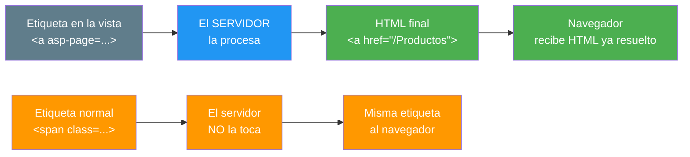
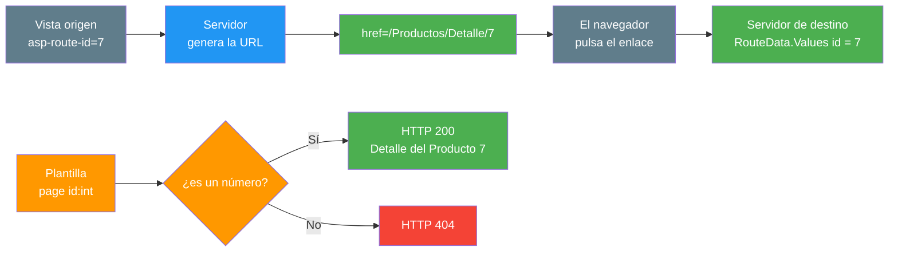
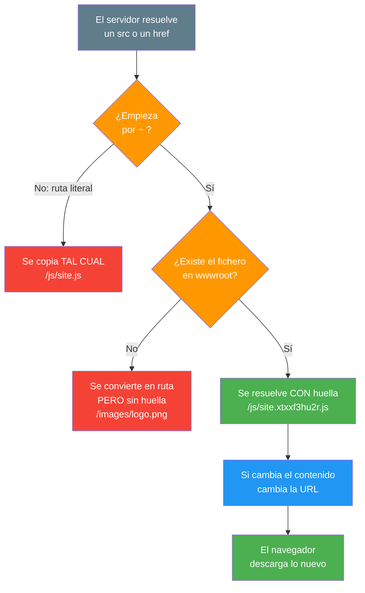
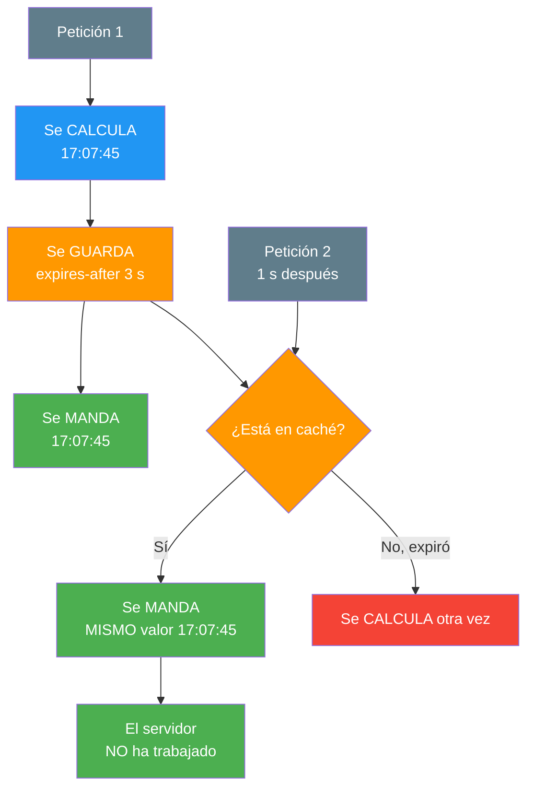
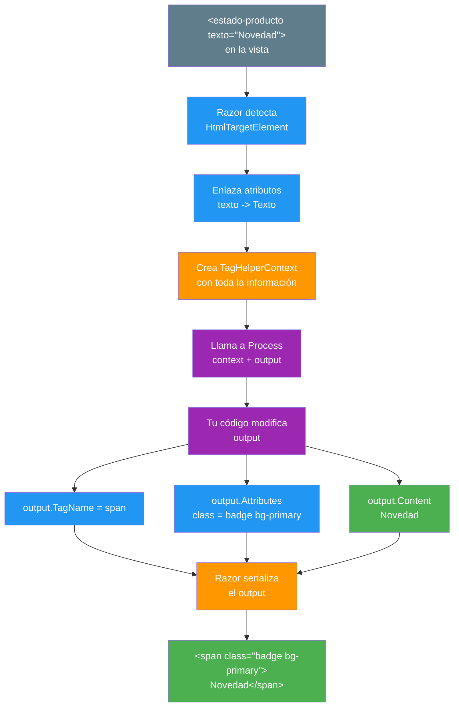

- [6. Tag Helpers: Controles en el Servidor](#6-tag-helpers-controles-en-el-servidor)
  - [6.1. Qué es un Tag Helper](#61-qué-es-un-tag-helper)
    - [6.1.1. HTML que Decide el Servidor](#611-html-que-decide-el-servidor)
    - [6.1.2. Del Origen al Navegador](#612-del-origen-al-navegador)
  - [6.2. Enlaces Dinámicos con asp-page](#62-enlaces-dinámicos-con-asp-page)
    - [6.2.1. Enlaces a Otras Páginas](#621-enlaces-a-otras-páginas)
    - [6.2.2. Parámetros de Ruta](#622-parámetros-de-ruta)
  - [6.3. Recursos Estáticos y la Huella](#63-recursos-estáticos-y-la-huella)
    - [6.3.1. La Ruta del Proyecto](#631-la-ruta-del-proyecto)
    - [6.3.2. Huella en el Nombre del Fichero](#632-huella-en-el-nombre-del-fichero)
    - [6.3.3. asp-append-version](#633-asp-append-version)
  - [6.4. Etiquetas Condicionales](#64-etiquetas-condicionales)
    - [6.4.1. La Etiqueta cache](#641-la-etiqueta-cache)
    - [6.4.2. La Etiqueta environment](#642-la-etiqueta-environment)
  - [6.5. Crear tu Propio Tag Helper](#65-crear-tu-propio-tag-helper)
    - [6.5.1. La Clase y el Atributo](#651-la-clase-y-el-atributo)
    - [6.5.2. El Proceso de Transformación](#652-el-proceso-de-transformación)
    - [6.5.3. La Trampa del TagMode](#653-la-trampa-del-tagmode)
    - [6.5.4. Dos Formas de Engancharse](#654-dos-formas-de-engancharse)
  - [6.6. Buenas Prácticas](#66-buenas-prácticas)
  - [6.7. Reto: Controles de servidor en FunkoApp con Tag Helpers](#67-reto-controles-de-servidor-en-funkoapp-con-tag-helpers)
    - [6.7.1. Contexto](#671-contexto)
    - [6.7.2. Retos](#672-retos)


# 6. Tag Helpers: Controles en el Servidor

> 💡 **Punto de partida:** Cuando navegas por Booking y pasas el ratón por un enlace de hotel, la URL que ves no la escribió nadie a mano: el servidor la calculó en el momento de pintar la página, y si mañana cambia el patrón de direcciones, el enlace se arregla solo. Los Tag Helpers son ese servidor dentro de la etiqueta: las escribes como HTML y el servidor las transforma antes de mandarlas al navegador.

En este tema conoces los Tag Helpers: etiquetas que escribes como HTML pero que el servidor transforma antes de mandarlas al navegador. Verás los que trae ASP.NET Core (enlaces, recursos, caché, entornos) y aprenderás a escribir los tuyos.

**Objetivos de aprendizaje:**

- Entender qué es un Tag Helper y cómo se transforma en HTML
- Generar enlaces con `asp-page` y `asp-route-`
- Resolver rutas con `~` y entender la huella de los recursos
- Usar las etiquetas condicionales `cache` y `environment`
- **Crear un Tag Helper propio** que se registre y se use en cualquier vista

> 📝 **Nota:** seguimos en ProductosApp, sin base de datos y sin controladores. Los Tag Helpers que usamos no necesitan modelo: por eso pueden ir en este punto y no más adelante.

## 6.1. Qué es un Tag Helper

### 6.1.1. HTML que Decide el Servidor

Un Tag Helper es una **clase C#** que se asocia a una etiqueta HTML. Cuando el servidor pinta la página, esa etiqueta se reescribe: cambia, desaparece, gana atributos o cambia de contenido.



📌 **Ejemplo real:** Instagram no escribe en su HTML *"esta foto tiene 1.204 likes"*. Alguien decide eso en el servidor antes de mandar la página. Un Tag Helper hace lo mismo, pero a nivel de etiqueta: el servidor decide qué etiqueta sale y con qué.

La diferencia con lo que ya sabes:

| Mecanismo | Cómo se escribe | Quién lo resuelve | ¿Lo has visto? |
|---|---|---|---|
| **HTML normal** | `<span class="badge">` | Nadie: va tal cual | Siempre |
| **Código Razor** | `@EtiquetaEstado(producto)` | El servidor, al pintar | Temas 01-04 |
| **Tag Helper** | `<estado-producto texto="...">` | El servidor, la etiqueta entera | Este tema |

> 💡 **Analogía:** Un Tag Helper es una etiqueta con instrucciones al reverso. Por delante se lee como HTML; por detrás dice *"cuando me imprimas, conviérteme en esto otro"*. Quien lo convierte es la imprenta (el servidor), no el lector (el navegador).

### 6.1.2. Del Origen al Navegador

Es fundamental entender que el navegador nunca ve el Tag Helper: solo ve el resultado.

| En la vista `.cshtml` | En el navegador (F12) |
|---|---|
| `<a asp-page="/Productos/Index">Índice</a>` | `<a href="/Productos">Índice</a>` |
| `<estado-producto texto="Novedad" />` | `<span class="badge bg-primary">Novedad</span>` |
| `<script src="~/js/site.js"></script>` | `<script src="/js/site.xtxxf3hu2r.js"></script>` |
| `<span class="badge">Novedad</span>` | `<span class="badge">Novedad</span>` — sin cambios |

📌 **Ejemplo real:** Es lo mismo que ocurre con el motor de plantillas de cualquier CMS. En el *back-office* escribes una plantilla con marcadores; el visitante ve la página ya montada. Nadie ve los marcadores.

> ⚠️ **Advertencia:** Si una etiqueta especial sale literalmente en el navegador, no la ha reconocido el servidor. Casi siempre es porque **falta `@addTagHelper`** en `_ViewImports.cshtml`. Ese error lo viste en el apartado 5.5 y se repite aquí.

## 6.2. Enlaces Dinámicos con asp-page

### 6.2.1. Enlaces a Otras Páginas

El Tag Helper **`AnchorTagHelper`** se activa con el atributo `asp-page`. Escribe la ruta de la vista de destino (no la URL final) y deja que el servidor la resuelva.

```cshtml
<p>
    <a asp-page="/Productos/Index" id="ri">Índice</a> ·
    <a asp-page="/Productos/Detalle" asp-route-id="7" id="r7">Ficha 7</a> ·
    <a asp-page="/Productos/Detalle" asp-route-id="12" id="r12">Ficha 12</a>
</p>
```


| Etiqueta de origen | HTML final |
|---|---|
| `<a asp-page="/Productos/Index">` | `<a href="/Productos">` |
| `<a asp-page="/Productos/Detalle" asp-route-id="7">` | `<a href="/Productos/Detalle/7">` |
| `<a asp-page="/Productos/Detalle" asp-route-id="12">` | `<a href="/Productos/Detalle/12">` |

Fíjate en el detalle: la página se llama `Index.cshtml`, pero la URL generada es `/Productos` — el servidor conoce el patrón de ruta, tú solo dices *"a esta página"*.

> 💡 **Consejo:** Escribe siempre la ruta de la vista (`/Productos/Detalle`) y no la URL (`/Productos/Detalle/7`). Si mañana cambia el patrón de URL, el enlace se arregla solo.

### 6.2.2. Parámetros de Ruta

El atributo `asp-route-nombre` rellena un hueco de la ruta. El nombre tiene que coincidir con el que declares en `@page`.

**La página de destino**: `Pages/Productos/Detalle.cshtml`:

```cshtml
@page "{id:int}"
@using Microsoft.AspNetCore.Routing
@{
    ViewData["Title"] = "Detalle";
    var id = RouteData.Values["id"];
}

<h1 id="h">Detalle del Producto @id</h1>
```




| URL pedida | Resultado |
|---|---|
| `/Productos/Detalle/7` | **HTTP 200**: `Detalle del Producto 7` |
| `/Productos/Detalle/12` | **HTTP 200**: `Detalle del Producto 12` |
| `/Productos/Detalle/abc` | **HTTP 404** |

📌 **Ejemplo real:** Glovo enlaza a cada restaurante con su identificador. Si alguien teclea a mano `/tienda/abc` en la barra de direcciones, no obtiene un error de programa ni una vista rota: obtiene un **404**. Eso es exactamente lo que hace la restricción `{id:int}`: rechaza en la puerta lo que no puede procesar.

> ⚠️ **Advertencia:** El nombre de `asp-route-id` tiene que coincidir con el de la plantilla. Si escribes `asp-route-id="7"` pero la página declara `@page "{identificador}"`, el hueco se queda vacío y recibirás un **404** sin saber por qué.

> 📝 **Nota:** `RouteData.Values["id"]` devuelve un `object`. Para convertirlo a número, cuando llegue el momento usarás *model binding* (el tema **14**). Aquí nos basta para mostrarlo en la vista.

## 6.3. Recursos Estáticos y la Huella

### 6.3.1. La Ruta del Proyecto

Las rutas que empiezan por **`~`** significan *"desde la raíz del sitio"*. El servidor las convierte en rutas absolutas reales.

```cshtml
<script src="~/js/site.js"></script>
<link rel="stylesheet" href="~/css/site.css" />

```

El HTML final es:

```html
<script src="/js/site.xtxxf3hu2r.js"></script>
<link rel="stylesheet" href="/css/site.b9sayid5wm.css" />

```

El `~` ha desaparecido... pero además ha cambiado el nombre del fichero.

### 6.3.2. Huella en el Nombre del Fichero

A esa cadena de letras y números del medio la llamamos huella (*fingerprint*). Sirve para la caché: si el contenido del fichero cambia, cambia la huella, y el navegador se ve obligado a descargar la versión nueva.

| Situación | HTML resultado | Huella |
|---|---|---|
| `~/js/site.js` y el fichero existe | `/js/site.xtxxf3hu2r.js` | Sí |
| `~/favicon.ico` y el fichero existe | `/favicon.61n19gt1b8.ico` | Sí |
| `~/images/logo.png` y el fichero NO existe | `/images/logo.png` | No |
| `/js/site.js` (ruta literal, sin `~`) | `/js/site.js` | No |

Dos reglas:

1. **La huella solo aparece si el fichero existe** como recurso estático del proyecto
2. **La huella solo aparece con `~`**: una ruta literal se copia tal cual



📌 **Ejemplo real:** Netflix cambia su código varias veces al día. Si el navegador guardara `app.js` en caché para siempre, los usuarios verían una versión vieja. Con huella, la dirección cambia en cada despliegue y todo el mundo recibe lo nuevo sin limpiar caché.

> 🔧 **Truco:** Si un recurso no sale con huella, lo primero que miras es **si el fichero está realmente en `wwwroot`**. El error más frecuente es una carpeta mal escrita: `wwwroot/js` en vez de `wwwroot/Js`.

### 6.3.3. asp-append-version

Existe el atributo `asp-append-version="true"`, que es la forma clásica de forzar una versión del fichero. En este proyecto .NET 10 no aporta nada observable: la huella ya llega con `~/`.

| Etiqueta | HTML resultado |
|---|---|
| `<script src="~/js/site.js" asp-append-version="true">` | `/js/site.xtxxf3hu2r.js` |
| `<script src="~/js/site.js" asp-append-version="false">` | `/js/site.xtxxf3hu2r.js` |
| `<script src="~/js/site.js">` — sin atributo | `/js/site.xtxxf3hu2r.js` |

**Las tres dan exactamente lo mismo.** Escribe las tres etiquetas en la misma página y compara el HTML final.

> 📝 **Nota:** Si en tu equipo el resultado fuera distinto (por ejemplo, `/js/site.js?v=abc123`), significa que la huella automática no está activa y entonces `asp-append-version` sí haría falta. El F12 manda.

## 6.4. Etiquetas Condicionales

Además de generar HTML, hay Tag Helpers que deciden si el HTML entra o no.

### 6.4.1. La Etiqueta cache

`<cache>` guarda el resultado en el servidor durante un tiempo. Si dos personas piden la página seguidas, la segunda no vuelve a calcular nada.

```cshtml
<cache expires-after="@TimeSpan.FromSeconds(3)">
    <span id="cacheado">@DateTime.Now.ToString("HH:mm:ss")</span>
</cache>
```

Dos peticiones seguidas devuelven el mismo valor (`17:07:45` en las dos), porque el contenido está cacheado.



📌 **Ejemplo real:** El panel de estadísticas de cualquier red social. No se recalculan los seguidores globales en cada visita: se guardan un rato y se sirven tal cual. Si no, con millones de peticiones el servidor no daría abasto.

> ⚠️ **Advertencia:** No cachees nada que sea personal. Si guardas dentro de `<cache>` el nombre del usuario, la primera persona en entrar lo verá solo ella y las demás recibirán sus datos. Caché para lo igual para todos; datos personales, jamás.

### 6.4.2. La Etiqueta environment

`<environment>` muestra su contenido solo en los entornos que tú indiques.

```cshtml
<environment names="Development">
    <p id="dev">Estás en desarrollo</p>
</environment>

<environment names="Production">
    <p id="prod">Estás en producción</p>
</environment>
```

En entorno de producción, el párrafo `prod` sí aparece y el `dev` no.

| Entorno | `names="Development"` | `names="Production"` |
|---|---|---|
| Desarrollo | visible | oculto |
| Producción | oculto | visible |

> 💡 **Consejo:** Es el lugar natural para el script de depuración, los errores detallados o el mensaje *"entorno de pruebas"*. Lo que no debe salir a producción, no debe estar en producción.

## 6.5. Crear tu Propio Tag Helper

Hasta aquí hemos usado los de ASP.NET Core. Lo interesante es que puedes escribir los tuyos: son clases C# como cualquier otra.

### 6.5.1. La Clase y el Atributo

**`TagHelpers/EstadoProductoTagHelper.cs`:**

```csharp
using Microsoft.AspNetCore.Razor.TagHelpers;

namespace ProductosApp.TagHelpers;

/// <summary>
/// Pinta una etiqueta de estado con su color.
/// </summary>
[HtmlTargetElement("estado-producto")]
public class EstadoProductoTagHelper : TagHelper
{
    public string Texto { get; set; } = string.Empty;

    public override void Process(TagHelperContext context, TagHelperOutput output)
    {
        output.TagName = "span";
        output.TagMode = TagMode.StartTagAndEndTag;
        output.Attributes.SetAttribute("class", "badge bg-primary");
        output.Content.SetHtmlContent(Texto);
    }
}
```

**Uso en cualquier vista:**

```cshtml
<estado-producto texto="Novedad" id="b1"></estado-producto>
```

HTML resultante:

```html
<span id="b1" class="badge bg-primary">Novedad</span>
```

Las piezas:

| Pieza | Para qué sirve |
|---|---|
| `: TagHelper` | La clase base; está en `Microsoft.AspNetCore.Razor.TagHelpers` |
| `[HtmlTargetElement("estado-producto")]` | Qué etiqueta controla esta clase |
| `public string Texto` | El atributo `texto` de la etiqueta, enlazado  automáticamente |
| `output.TagName` | La etiqueta final (`span`) |
| `output.Attributes` | Los atributos del HTML resultante |
| `output.Content` | El contenido entre la etiqueta de apertura y la de cierre |

> ⚠️ **Advertencia:** dos errores de manual: sin `using Microsoft.AspNetCore.Razor.TagHelpers;` llega el **`CS0246: 'TagHelper' no se encontró`**, y sin `@addTagHelper *, ProductosApp` en `_ViewImports.cshtml` la etiqueta sale literal.

> 🔧 **Truco:** El enlace entre atributo y propiedad es automático y no distingue mayúsculas: `texto="Novedad"` rellena `Texto`. Si el atributo tiene guiones (`mi-texto`), la propiedad se llama `MiTexto`.

### 6.5.2. El Proceso de Transformación

Cuando Razor encuentra tu etiqueta, ocurre esto:



No toques `context`: sirve para saber de dónde vienes (qué atributos originales había). Lo que tú editas es siempre **`output`**: adónde vas.

### 6.5.3. La Trampa del TagMode

Este es el error que más vueltas da. Si escribes la etiqueta sin etiqueta de cierre:

```cshtml
<estado-producto texto="Novedad" id="badge" />
```

el resultado es:

```html
<span id="badge" class="badge bg-primary" />
```

**¡El texto no está!** La etiqueta se pinta sola y vacía. La culpa la tiene `TagMode`: al escribir `/>`, Razor pone el modo en **`SelfClosing`** y descarta el contenido.

La solución es una línea:

```csharp
output.TagMode = TagMode.StartTagAndEndTag;   // <- añádela SIEMPRE
```

| `TagMode` | Resultado |
|---|---|
| `SelfClosing` (por defecto con `/>`) | `<span class="badge bg-primary" />` — contenido perdido |
| `StartTagAndEndTag` | `<span class="badge bg-primary">Novedad</span>` |

> ⚠️ **Advertencia:** Si tu Tag Helper pinta texto y sale siempre vacío, nunca empieces a buscar en los atributos. El 99% de las veces es el `TagMode`. Con la línea aparece `Novedad`; sin ella, no.

### 6.5.4. Dos Formas de Engancharse

Hasta ahora la etiqueta es nuestra (`estado-producto`). Pero también puedes engancharte a etiquetas que ya existen declarando un atributo.

```csharp
[HtmlTargetElement(Attributes = "precio")]
public class PrecioTagHelper : TagHelper
{
    private static readonly CultureInfo Es = CultureInfo.GetCultureInfo("es-ES");

    public string Precio { get; set; } = string.Empty;

    public override async Task ProcessAsync(TagHelperContext context, TagHelperOutput output)
    {
        await Task.Yield();
        output.Content.SetHtmlContent(
            decimal.Parse(Precio, Es).ToString("C", Es));
    }
}
```

Funciona con cualquier etiqueta:

| En la vista | HTML final |
|---|---|
| `<span precio="18,50">x</span>` | `<span>18,50 €</span>` |
| `<strong precio="3,20">y</strong>` | `<strong>3,20 €</strong>` |

| Forma | Cuándo usarla |
|---|---|
| `[HtmlTargetElement("mi-etiqueta")]` | Creas tu propia etiqueta: semántica y clara |
| `[HtmlTargetElement(Attributes = "precio")]` | Potencias una etiqueta que ya existe en HTML |

Y fíjate en el resultado: el contenido original (`x`, `y`) desaparece. `output.Content` sustituye lo que hubiera.

> 📝 **Nota:** En este ejemplo se usa `ProcessAsync` (el equivalente asíncrono de `Process`) porque consultar una base de datos o llamar a un servicio es una operación que hay que esperar. Es el mismo motivo por el que en el punto 04 usabas `await` en las funciones de la vista.

> ⚠️ **Advertencia:** `TagHelperContent` no tiene `SetHtmlContentAsync`: te daría **`CS1061`**. Se pone el contenido con `output.Content.SetHtmlContent(...)` (síncrono) dentro del método asíncrono.

## 6.6. Buenas Prácticas

- Escribe la ruta de la vista en `asp-page`, no la URL final: si cambia el patrón, se arregla solo
- Añade **`output.TagMode = TagMode.StartTagAndEndTag;`** siempre que tu etiqueta pinte contenido
- Usa **`~`** para los recursos del proyecto; es la única forma de que reciban huella
- Coloca `<environment>` en **dev-only**: errores detallados, avisos, *scripts* de depuración
- Cachea con `<cache>` solo contenido igual para todos
- Comprueba **siempre con F12** el HTML final: ahí está la verdad de lo que hace el servidor
- Cuando escribas un Tag Helper, deja el XMLDoc: es una API que usarán otras personas de tu equipo
- **No guardes datos personales en `<cache>`**
- **No escribas la URL a mano** cuando existe `asp-page`: pierdes la ventaja principal
- **No olvides `@addTagHelper *, TuProyecto`**: sin él, tu etiqueta sale como texto
- **No uses `SetHtmlContentAsync`** en `TagHelperContent`: no existe (`CS1061`)

## 6.7. Reto: Controles de servidor en FunkoApp con Tag Helpers

> Pónle controles de servidor a FunkoApp: enlaces que se generan solos y dos Tag Helpers propios.

### 6.7.1. Contexto

**Paso 0**: parte del listado de Funkos que montaste en los retos de los puntos 03 a 05 (`Models/Funko.cs`, `Repositories/RepositorioFunkos.cs` y `Pages/Funkos/Index.cshtml`). Si todavía no lo tienes, créalos siguiendo esos mismos retos.

### 6.7.2. Retos

1. Crea **`Pages/Funkos/Detalle.cshtml`** con `@page "{id:int}"`, lee el identificador con `RouteData.Values["id"]` y muestra *"Detalle del Funko 7"*
2. Dentro del `@foreach` del listado, convierte el nombre de cada Funko en un enlace con `<a asp-page="/Funkos/Detalle" asp-route-id="@funko.Id">`
3. Comprueba con **F12** que cada `href` lleva su identificador y que has escrito la ruta de la vista, no la URL
4. Pide a mano `/Funkos/Detalle/abc` y confirma que devuelve **404**: la restricción `{id:int}` está funcionando
5. Crea **`TagHelpers/EstadoFunkoTagHelper.cs`** con `[HtmlTargetElement("estado-funko")]` y úsalo en el listado para pintar la etiqueta de estado, sin la función `EtiquetaEstado`
6. Añade **`output.TagMode = TagMode.StartTagAndEndTag;`** y comprueba con F12 que no sale vacía (sin la línea, saldrá `<span ... />`)
7. Crea un segundo Tag Helper que se enganche con `[HtmlTargetElement(Attributes = "precio")]` y úsalo en dos etiquetas distintas (`span` y `strong`) para formatear el precio de referencia con `ToString("C")`
8. Envuelve el listado en `<cache expires-after="@TimeSpan.FromSeconds(10)">` y recarga dos veces: comprueba que no cambia
9. Añade un `<environment names="Development">` con un aviso y comprueba que no aparece en producción
10. Revisa con **F12** que ninguna etiqueta especial sale como texto literal

**Puntos extra:**

- Quita `output.TagMode` y documenta en un comentario el HTML `/>` que sale
- Pon `@addTagHelper *, FunkoApp` en una línea aparte y comprueba que tu etiqueta pasa a salir literal
- Compara `asp-append-version="true"` y `"false"` en la misma página: comprueba que dan lo mismo
- Añade un recurso en `wwwroot` que no exista y comprueba que no recibe huella
- Crea un tercer Tag Helper con `ProcessAsync` que "calcule" algo con retardo y comprueba que la página espera

---

**Resumen del punto:**

| Concepto | Descripción |
|----------|-------------|
| **Tag Helper** | Clase C# que transforma una etiqueta antes de mandarla al navegador |
| **El navegador** | Nunca ve el Tag Helper, solo el HTML final |
| **`asp-page`** | Genera el `href` a partir de la ruta de la vista |
| **`asp-route-nombre`** | Rellena un hueco de la ruta de destino |
| **`RouteData.Values`** | Lee el parámetro que llegó por la URL |
| **Restricción `{id:int}`** | Si no es un número → **404** |
| **`~`** | Raíz del sitio; solo así los recursos reciben huella |
| **Huella** | Cadena en el nombre que rompe la caché cuando cambia el fichero |
| **`asp-append-version`** | Clásico; en .NET 10 no aporta nada observable |
| **`<cache>`** | Guarda el HTML en el servidor un tiempo |
| **`<environment>`** | Muestra contenido solo en ciertos entornos |
| **`HtmlTargetElement`** | Elige la etiqueta: propia o por atributo |
| **`Process` / `ProcessAsync`** | El método donde reescribes el `output` |
| **`output.TagName / Attributes / Content`** | Etiqueta, atributos y contenido del resultado |
| **`TagMode.StartTagAndEndTag`** | Imprescindible si la etiqueta pinta contenido |
| **`@addTagHelper *, Proyecto`** | Sin él, tu etiqueta **sale literal** |
| **`TagHelperContent.SetHtmlContentAsync`** | No existe: `CS1061` |

**¿Qué viene después?**

En el siguiente punto veremos **Arquitectura MVC: Separación de Presentación y Negocio**. Hasta aquí todo ha vivido dentro de las vistas; ahora vamos a entender por qué eso no puede durar, y cómo partir la aplicación en modelos, vistas y controladores.
