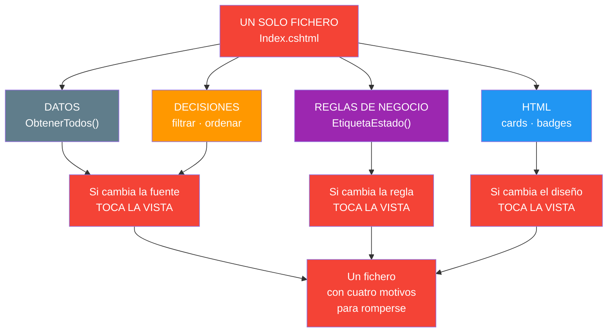
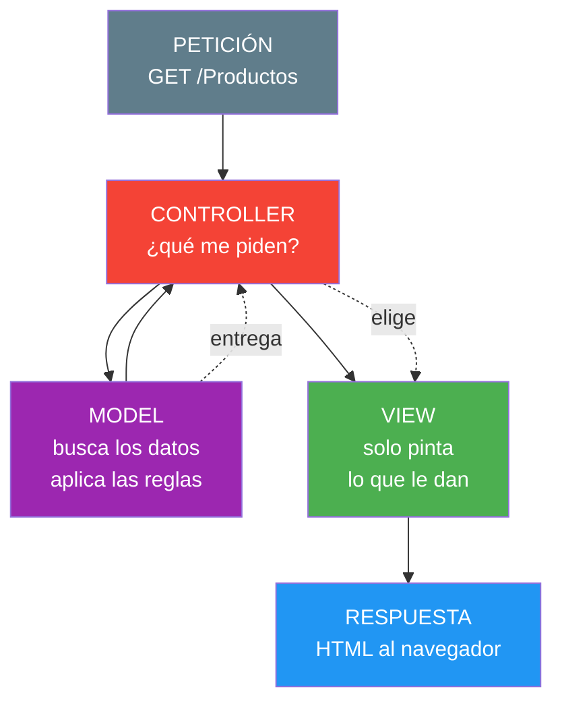
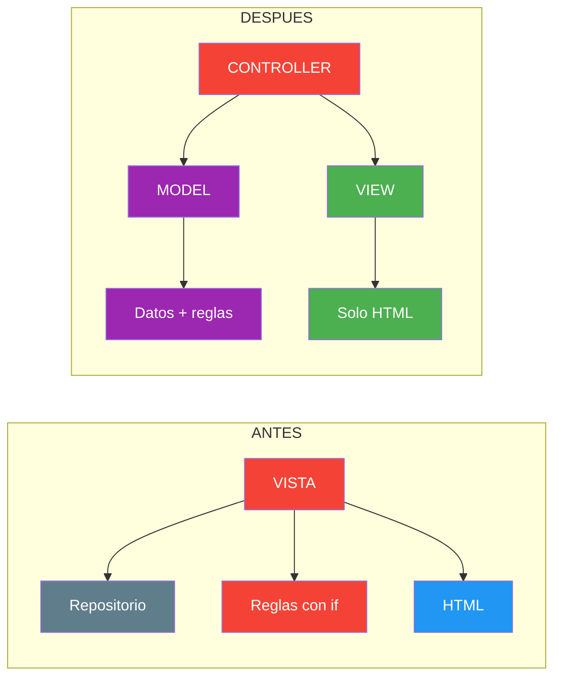
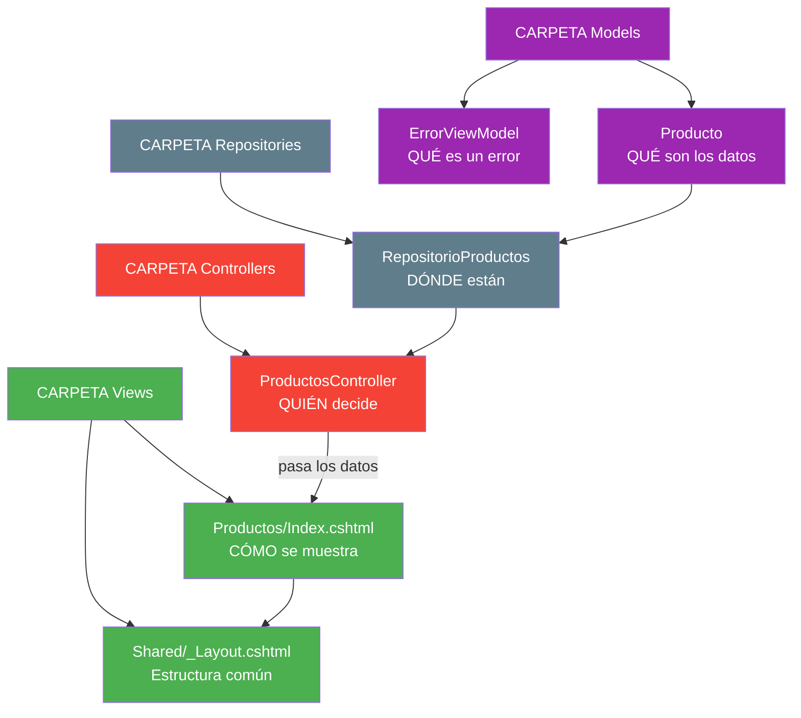
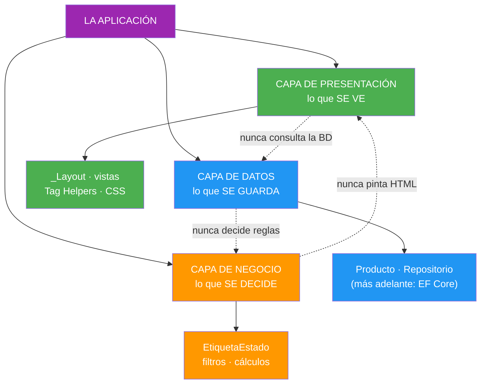

- [7. Arquitectura MVC: Separación de Presentación y Negocio](#7-arquitectura-mvc-separación-de-presentación-y-negocio)
  - [7.1. El Problema: Todo Junto en la Vista](#71-el-problema-todo-junto-en-la-vista)
    - [7.1.1. El Fichero que Hace de Todo](#711-el-fichero-que-hace-de-todo)
    - [7.1.2. El Coste de Hablar Con Todo el Mundo](#712-el-coste-de-hablar-con-todo-el-mundo)
  - [7.2. Qué es el Patrón MVC](#72-qué-es-el-patrón-mvc)
    - [7.2.1. Los Tres Papeles](#721-los-tres-papeles)
    - [7.2.2. Quién Habla con Quién](#722-quién-habla-con-quién)
  - [7.3. Cómo Fluye una Petición](#73-cómo-fluye-una-petición)
    - [7.3.1. El Recorrido Completo](#731-el-recorrido-completo)
    - [7.3.2. La Convención que Decide la Vista](#732-la-convención-que-decide-la-vista)
  - [7.4. Los Tres Componentes en un Proyecto Real](#74-los-tres-componentes-en-un-proyecto-real)
    - [7.4.1. El Controlador](#741-el-controlador)
    - [7.4.2. La Vista](#742-la-vista)
    - [7.4.3. El Modelo](#743-el-modelo)
  - [7.5. Presentación, Negocio y Datos](#75-presentación-negocio-y-datos)
    - [7.5.1. Las Tres Capas](#751-las-tres-capas)
    - [7.5.2. Dónde Estaba Cada Cosa Hasta Ahora](#752-dónde-estaba-cada-cosa-hasta-ahora)
  - [7.6. Buenas Prácticas](#76-buenas-prácticas)
  - [7.7. Reto: Pasa FunkoApp de solo vistas a MVC](#77-reto-pasa-funkoapp-de-solo-vistas-a-mvc)
    - [7.7.1. Análisis y diseño en papel](#771-análisis-y-diseño-en-papel)
    - [7.7.2. Modelo de datos](#772-modelo-de-datos)
    - [7.7.3. Código](#773-código)


# 7. Arquitectura MVC: Separación de Presentación y Negocio

> 💡 **Punto de partida:** Cuando el equipo de Spotify cambia su portada, los que programan la interfaz no tocan a los que calculan las recomendaciones: están en partes distintas del código, y cada equipo puede trabajar sin romper el trabajo del otro. Ese es el patrón MVC: separar datos, presentación y coordinación para que todo sea más claro y mantenible. En este punto aprendes las tres piezas y la regla de oro que las gobierna.

En este punto aprenderás el patrón MVC: tres piezas (Model, View, Controller) y una regla de oro: cada pieza solo habla con las que le tocan. Verás cómo se traduce en un proyecto .NET real, qué cambia en la carpeta `Controllers/` y cómo fluye una petición de principio a fin.

**Objetivos de aprendizaje:**

- Explicar qué es el patrón MVC y por qué separa presentación de negocio
- Seguir el recorrido completo de una petición: petición → controlador → modelo → vista → respuesta
- Reconocer la convención que hace que `Index()` muestre `Views/Home/Index.cshtml`
- Escribir un controlador, una vista y un modelo mínimos que funcionen
- Clasificar el código de los puntos anteriores en las tres capas

> 📝 **Nota:** seguimos con ProductosApp. A partir de aquí ya entra el controlador: es el punto donde el proyecto deja de ser "solo vistas".

## 7.1. El Problema: Todo Junto en la Vista

### 7.1.1. El Fichero que Hace de Todo

Esto es lo que hemos ido construyendo en los puntos 03, 04 y 05:

```cshtml
@page
@using ProductosApp.Models
@using ProductosApp.Repositories
@{
    // 1. DATOS: busca la lista
    var productos = RepositorioProductos.ObtenerTodos();

    // 2. DECISIONES: filtra y ordena
    var activos = productos.Count(f => f.Activo);
    var ordenados = productos.OrderBy(f => f.Nombre).ToList();
}

<h1>Productos del catálogo (@productos.Count)</h1>

@* 3. PRESENTACIÓN: pinta *@
@foreach (var producto in ordenados)
{
    <div class="card mb-3">
        <h5>@producto.Nombre</h5>
        <span class="badge">@EtiquetaEstado(producto)</span>
    </div>
}

@functions {
    // 4. REGLAS DE NEGOCIO dentro de la vista
    string EtiquetaEstado(Producto f)
    {
        if (f.EsNovedad) return "Novedad";
        if (f.Activo) return "En catálogo";
        return "Descatalogado";
    }
}
```

**Cuatro responsabilidades en un mismo fichero.** Y el que más molesta es el número 4: *"si es novedad, ponle Novedad"* no es presentación, es una regla de negocio. Si mañana la empresa decide que *"Novedad"* pasa a llamarse *"Recién llegado"*, no estás tocando el diseño: estás cambiando una decisión.



📌 **Ejemplo real:** Netflix tiene una sola página de resultados, pero detrás hay quien decide qué te recomienda (reglas de negocio), quien busca los datos (acceso a datos) y quien dibuja las carátulas (presentación). Si los tres equipos trabajaran en el mismo fichero, cada despliegue rompería el trabajo de los otros dos.

> 💡 **Analogía:** Es como un restaurante donde el camarero también cocina y también va al mercado. Un día funciona; al segundo, nadie sabe quién tiene que hacer qué — y si el camarero se va, el restaurante cierra.

### 7.1.2. El Coste de Hablar Con Todo el Mundo

Veamos el precio concreto de dejarlo todo junto:

| Situación | Todo en la vista | Con las piezas separadas |
|---|---|---|
| **Cambiar la regla** de estado | Abrir la vista, buscar la función, esperar no romper el HTML | Tocar una clase |
| **Probar** la regla con 5 casos | Solo sirviendo la página y mirando el navegador | Llamando al método en un test |
| **Reusar** los datos en una API | Copiar la vista entera | Llamar al mismo modelo |
| **Cambiar** la fuente de datos | Tocar todas las vistas que la usen | Tocar una clase |
| **Trabajar en equipo** | Dos personas en el mismo fichero → conflicto | Cada uno en su pieza |

> ⚠️ **Advertencia:** Este problema no aparece en el primer día, aparece en el tercer mes. Por eso se enseña el patrón antes de que duela: cuando la aplicación ya tiene veinte vistas, separar cuesta el triple.

> 📝 **Nota:** ¿Significa esto que lo hecho en los puntos 01-06 estaba mal? No. Era el camino correcto para aprender: primero ves *cómo se pinta una página dinámica*, luego aprendes a *organizarlo*. Es el mismo orden en el que aprendes a cocinar: primero un plato, después la cocina profesional.

## 7.2. Qué es el Patrón MVC

### 7.2.1. Los Tres Papeles

**MVC** son las iniciales de ***Model-View-Controller***. Es un patrón de diseño: una solución probada a un problema repetido, cómo mantener separadas la lógica de negocio, la presentación y la entrada de datos.

| Pieza | Pregunta que responde | Qué lleva dentro | En .NET |
|---|---|---|---|
| **Model** | *¿Qué son los datos y qué reglas tienen?* | Entidades, reglas, acceso a datos | `Models/`, `Repositories/` |
| **View** | *¿Cómo se muestra?* | Solo HTML y presentación | `Views/` |
| **Controller** | *¿Qué se ha pedido y quién lo resuelve?* | Recibe la petición, llama al modelo, elige la vista | `Controllers/` |



📌 **Ejemplo real:** Glovo. Cuando pides un restaurante, el controlador recibe la petición, el modelo calcula qué restaurantes hay abiertos y a qué distancia están, y la vista dibuja la lista. Si el diseñador cambia las tarjetas, el cálculo de distancias no se entera.

> 💡 **Analogía:** Un médico es el *controlador*: te pregunta, decide qué pruebas mandar, lee los resultados y te da el diagnóstico. El laboratorio es el *modelo*: solo produce datos, no habla contigo. El informe es la *vista*: solo presenta, no decide nada.

### 7.2.2. Quién Habla con Quién

La regla del patrón es corta y es lo único que hay que memorizar:

> ✅ **La vista NO decide, la vista NO busca: la vista PINTA.**

Y un detalle importante, con honestidad sobre lo que hemos hecho hasta ahora:

| Qué hacíamos antes | Qué hace MVC |
|---|---|
| La vista llamaba a `RepositorioProductos.ObtenerTodos()` | El controlador llama al modelo y le pasa los datos a la vista |
| La vista decidía qué filtrar | El **modelo/controlador** decide; la vista solo recibe |
| La vista tenía `@functions` con reglas | Las reglas van al modelo |



> ⚠️ **Advertencia:** MVC no prohíbe que una vista acceda a datos (es técnicamente posible), pero deja de estar separado en cuanto lo haces. Es como comprar una cocina nueva y seguir comiendo en el suelo.

## 7.3. Cómo Fluye una Petición

### 7.3.1. El Recorrido Completo

Creamos un proyecto MVC real con `dotnet new mvc` y vamos paso a paso:

| URL pedida | Qué ocurre | HTTP |
|---|---|---|
| `/` | Ruta por defecto → `Home` + `Index` → `Views/Home/Index.cshtml` | **200** |
| `/Home/Acerca` | `HomeController.Acerca()` → `Views/Home/Acerca.cshtml` | **200** |
| `/Home/NoExiste` | El controlador existe, la acción no | **404** |
| `/NoExiste/Index` | Ni el controlador existe | **404** |
| `/Views/Home/Index` | La vista no es una URL | **404** |
| `/Home/SinVista` | La acción pide `View()` y no existe el `.cshtml` | **500** |
| `/Home/Volver` | `RedirectToAction("Privacy")` | **302** con `Location` |

La ruta que lo gobierna todo está en `Program.cs` y es una sola línea:

```csharp
builder.Services.AddControllersWithViews();
...
app.MapControllerRoute(
    name: "default",
    pattern: "{controller=Home}/{action=Index}/{id?}");
```

El patrón dice: el primer trozo de la URL es el controlador, el segundo es la acción. Si no hay nada, manda `Home` + `Index`.

> 🔧 **Truco:** Memoriza `{controller=Home}/{action=Index}/{id?}`. Es la frase que explica por qué `/` te lleva a la página de inicio sin que tú hayas escrito eso en ninguna parte.

### 7.3.2. La Convención que Decide la Vista

Aquí está la magia de MVC: nadie escribe a mano qué vista abrir. Lo decide una convención (una regla que se cumple sin que la declares):

| Controlador | Acción | La vista que se busca |
|---|---|---|
| `HomeController` | `Index()` | `Views/Home/Index.cshtml` |
| `HomeController` | `Acerca()` | `Views/Home/Acerca.cshtml` |
| `ProductosController` | `Index()` | `Views/Productos/Index.cshtml` |


- `ProductosController.Index()` con `return View();` → se sirvió `Views/Productos/Index.cshtml` → **HTTP 200**
- `HomeController.SinVista()` sin su `.cshtml` → **HTTP 500**

> 💡 **Consejo:** Si tu aplicación devuelve **500** en una acción que "no hace nada raro", lo primero que miras es **si existe el `.cshtml` en la carpeta correcta**. Es el error más frecuente de MVC: la vista se busca sola y, si no la encuentra, revienta.

> 📝 **Nota:** Para salir de la convención tienes `return View("OtroNombre")`, `return PartialView(...)` o `return RedirectToAction("Accion")`; veremos el detalle en el punto **08**. La convención es el camino normal; lo demás, excepciones.

## 7.4. Los Tres Componentes en un Proyecto Real

Todo lo de esta sección es código real de un proyecto creado con `dotnet new mvc`.

### 7.4.1. El Controlador

Un controlador es una clase que hereda de `Controller`. Cada acción (cada método público) es una dirección a la que se puede llamar por URL.

```csharp
using Microsoft.AspNetCore.Mvc;
using ProductosApp.Repositories;

namespace ProductosApp.Controllers;

/// <summary>
/// Gestiona los Productos: decide qué vista se muestra.
/// </summary>
public class ProductosController : Controller
{
    public IActionResult Index()
    {
        ViewData["Titulo"] = "Productos del catálogo";
        return View(RepositorioProductos.ObtenerTodos());
    }
}
```

| Pieza | Significado |
|---|---|
| `: Controller` | Hereda las respuestas, las vistas y el `ViewData` |
| `ProductosController` | El nombre sin `Controller` es lo que aparece en la URL: `/Productos` |
| `IActionResult` | *"devuelvo una acción de resultado"*: una vista, una redirección, un 404... |
| `return View(datos)` | Busca la vista por convención y le pasa los datos |
| `ViewData["Titulo"]` | Mensaje del controlador a la vista, sin ser el modelo |

📌 **Ejemplo real:** En Instagram, cuando pulsas un perfil, el *controlador* es quien recibe *"quiero el perfil de fulano"*, pregunta al *modelo* por sus datos y decide qué vista mostrar. Si el perfil no existe, decide otro resultado: una página 404.

### 7.4.2. La Vista

La vista en MVC **no lleva `@page`** (no es una página, es una plantilla que alguien le pide) y vive en `Views/<Controlador>/<Accion>.cshtml`.

```cshtml
@using ProductosApp.Repositories
@model IEnumerable<ProductosApp.Models.Producto>
@{
    ViewData["Title"] = "Productos";
}

<h1>@ViewData["Titulo"] (@Model.Count())</h1>

<div class="row">
@foreach (var producto in Model)
{
    <div class="col-md-4">
        <div class="card mb-3">
            <div class="card-body">
                <h5 class="card-title">@producto.Nombre</h5>
                <p class="card-text">@producto.Categoria · @producto.Anio</p>
                <span class="badge bg-primary">@producto.PrecioReferencia.ToString("C")</span>
            </div>
        </div>
    </div>
}
</div>
```

`GET /Productos` devuelve **HTTP 200** con `<h1>Productos del catálogo (6)</h1>`, **6 tarjetas** y **6 precios**.

Dos vías para que el controlador le hable a la vista:

| Vía | Cómo | Para qué |
|---|---|---|
| **`View(datos)`** + `@model` | `return View(lista)` / `@model IEnumerable<Producto>` | Los datos de verdad |
| **`ViewData["x"]`** | `ViewData["Titulo"] = ...` / `@ViewData["Titulo"]` | Cosas sueltas: títulos, avisos, contadores |

`ViewData["Mensaje"] = "Hola desde el controlador"` llega a la vista como *"Hola desde el controlador"*, y `ViewData["Numero"] = 42` como *"42"*.

> ⚠️ **Advertencia:** En MVC la vista **no tiene `@page`**. Si se lo pones, no hará nada útil: en MVC el acceso es por URL de controlador, no por fichero. La diferencia es exactamente la que veremos en el punto **12** (MVC vs Razor Pages).

### 7.4.3. El Modelo

El Modelo es la pieza más amplia: los datos y las reglas. En un proyecto MVC mínimo, `Models/` trae el de la plantilla:

```csharp
namespace ProductosApp.Models;

public class ErrorViewModel
{
    public string? RequestId { get; set; }
    public bool ShowRequestId => !string.IsNullOrEmpty(RequestId);
}
```

Y el nuestro, con el repositorio en memoria:

```csharp
namespace ProductosApp.Models;

public record Producto(
    int Id,
    string Nombre,
    string Categoria,
    int Anio,
    decimal PrecioReferencia,
    string? Imagen,
    List<string>? Etiquetas,
    bool Activo,
    bool EsNovedad
);
```



| Carpeta | Rol MVC | Ejemplos |
|---|---|---|
| `Models/` | Model — los datos y sus reglas | `Producto.cs`, `ErrorViewModel.cs` |
| `Repositories/` | Model — de dónde salen | `RepositorioProductos.cs` |
| `Controllers/` | Controller — recibe y decide | `ProductosController.cs`, `HomeController.cs` |
| `Views/` | View — solo presenta | `Productos/Index.cshtml`, `Shared/_Layout.cshtml` |

> 📝 **Nota:** La plantilla de MVC **no trae carpeta `Pages/`**: al crear el proyecto con `dotnet new mvc`, solo aparecen `Controllers/`, `Views/`, `Models/` y `wwwroot/`.

## 7.5. Presentación, Negocio y Datos

### 7.5.1. Las Tres Capas

MVC habla de quién hace qué. Las capas hablan de dónde vive cada cosa. Son dos vistas del mismo problema:

| Capa | Pregunta | Contenido | Ejemplo en ProductosApp |
|---|---|---|---|
| **Presentación** | *¿Cómo se ve?* | HTML, CSS, plantillas | `_Layout.cshtml`, `Index.cshtml` |
| **Negocio** | *¿Qué está permitido?* | Reglas, decisiones, cálculos | *"Novedad" si `EsNovedad`* |
| **Datos** | *¿Dónde viven y de dónde salen?* | Entidades, repositorios, BD | `Producto.cs`, `RepositorioProductos.cs` |



> 💡 **Analogía:** En una empresa, comercial (presentación) habla con el cliente, dirección (negocio) decide la estrategia y almacén (datos) guarda la mercancía. Si el almacén empieza a negociar precios con el cliente directamente, la empresa tiene un problema de organización, no de ventas.

### 7.5.2. Dónde Estaba Cada Cosa Hasta Ahora

La tabla que cierra el capítulo: **todo lo que hemos hecho en los puntos 01-06, clasificado**.

| Qué escribimos | Capa | Dónde debe vivir a partir de ahora |
|---|---|---|
| `_Layout.cshtml`, `<partial>`, CSS por CDN | Presentación | `Views/Shared/` |
| HTML de las tarjetas, `@foreach` | Presentación | `Views/...` |
| `<estado-producto>`, Tag Helpers propios | Presentación | `TagHelpers/` |
| `EtiquetaEstado`, filtros, ordenaciones | Negocio | `Models/` o `Services/` |
| `Producto`, `RepositorioProductos` | Datos | `Models/`, `Repositories/` |
| `@functions` con reglas dentro de la vista | ⚠️ Mezclado | Sacar de la vista |
| `RepositorioProductos.ObtenerTodos()` llamado dentro de la vista | ⚠️ Mezclado | Llamarlo desde el controlador |

📌 **Ejemplo real:** Es el problema clásico de las aplicaciones que crecen: la regla de *"mostrar un elemento"* y la de *"decidir si es favorito"* acaban en el mismo fichero, y cuando alguien quiere reutilizar una de las dos en otra app, hay que desentrañar la interfaz entera. Separar a tiempo ahorra reescribir después.

> 💡 **Punto de partida para el diseño:** Antes de escribir una sola línea, dibuja en papel tres columnas (Presentación, Negocio, Datos) y coloca cada fichero en la suya. Si un fichero no cabe en ninguna o cabe en dos, ahí hay un problema de diseño.

## 7.6. Buenas Prácticas

- **Analiza y diseña en papel antes de programar**: Análisis → Diseño (el algoritmo, el esquema, las capas) → Codificación. Saltarse el orden es la causa número uno de código desordenado
- **El controlador decide, el modelo calcula, la vista pinta**: esa frase resume el punto entero
- Deja que la convención trabaje: `ProductosController.Index()` → `Views/Productos/Index.cshtml`, sin escribirlo
- Usa **`return View(datos)` + `@model`** para los datos de verdad y **`ViewData`** solo para títulos y avisos sueltos
- Pon los nombres tal como irán en la URL al crear el controlador: `ProductosController` → `/Productos`
- Si una acción da **500**, revisa primero si existe el `.cshtml` en la carpeta correcta
- Mantén las reglas de negocio fuera de la vista: si hay `if` decidiendo un texto, eso es negocio
- **No escribas la vista como URL**: `/Views/Home/Index` siempre **404**; la URL es `/Home/Index`
- **No metas HTML** en el controlador: si ves `<div>` dentro de un `.cs`, estás mezclando capas
- **No llames al repositorio desde la vista** una vez tengas controlador
- **No te saltes el papel**: un esquema de capas en una servilleta vale más que media hora de código a ciegas

## 7.7. Reto: Pasa FunkoApp de solo vistas a MVC

> Pasa FunkoApp de "solo vistas" a MVC — pero empieza por el papel, no por el teclado.

### 7.7.1. Análisis y diseño en papel

1. Escribe el algoritmo de una petición a `/Funkos`: qué recibe, qué consulta, qué decide y qué devuelve
2. Dibuja tres columnas (Presentación, Negocio, Datos) y clasifica cada fichero que ya tienes (`Funko.cs`, `RepositorioFunkos.cs`, `_Layout.cshtml`, `Index.cshtml`, `EtiquetaEstado`)
3. Señala en rojo lo que ahora está en la columna equivocada

> ⚠️ **Sin esta fase no empieces a programar.** El flujo correcto es **Análisis → Diseño → Codificación**.

### 7.7.2. Modelo de datos

| Propiedad | Tipo | Obligatorio |
|-----------|------|:-----------:|
| `id` | int | Sí (autogenerado) |
| `nombre` | string | Sí |
| `categoria` | string | Sí |
| `anio` | int | Sí |
| `precioReferencia` | decimal | Sí |
| `imagen` | string? | No |
| `etiquetas` | List\<string\>? | No |
| `activo` | bool | Sí |
| `esNovedad` | bool | Sí |

Los Funkos se guardan en `Repositories/RepositorioFunkos.cs`, con una lista en memoria y un método `ObtenerTodos()`.

### 7.7.3. Código

1. Crea un proyecto MVC con **`dotnet new mvc`** y comprueba que no existe carpeta `Pages/`
2. Crea `Models/Funko.cs` con el `record` de la tabla anterior y `Repositories/RepositorioFunkos.cs` con seis figuras (ajusta los `namespace` al proyecto)
3. Crea **`Controllers/FunkosController.cs`** con `Index()` que haga `return View(RepositorioFunkos.ObtenerTodos())`
4. Crea **`Views/Funkos/Index.cshtml`** (sin `@page`) con `@model IEnumerable<Funko>` y el listado en tarjetas
5. Comprueba con **F12** que `/Funkos` da **200** y pinta **6 tarjetas**
6. Comprueba que `/Views/Funkos/Index` devuelve **404**: la vista no es una URL
7. Añade una acción `Acerca()` que ponga algo en `ViewData` y comprueba que llega a la vista
8. Añade una acción `Volver()` con `RedirectToAction("Index")` y comprueba que responde **302**
9. Añade una acción sin vista y comprueba que devuelve **500**: así entiendes qué busca la convención

**Puntos extra:**

- Escribe en un comentario de tu controlador qué capa es cada cosa que has tocado
- Busca en la plantilla `HomeController.cs` el `Error()` y explica con tus palabras por qué devuelve `View(...)` y no `RedirectToAction(...)`
- Cambia el nombre de la carpeta `Views/Funkos` y observa el **500**: es la prueba de que la convención es la que enlaza acción y vista
- Mueve `EtiquetaEstado` a una clase nueva en `Models/` y deja la vista **sin un solo `if`**
- Compara el mismo listado en el proyecto Razor Pages (puntos 03-06) y en este MVC: escribe cinco diferencias

---

**Resumen del punto:**

| Concepto | Descripción |
|----------|-------------|
| **Patrón MVC** | *Model-View-Controller*: separa datos, presentación y entrada |
| **Model** | Qué son los datos y qué reglas tienen (`Models/`, `Repositories/`) |
| **View** | Cómo se muestra; solo pinta (`Views/`) |
| **Controller** | Recibe la petición, llama al modelo, elige la vista (`Controllers/`) |
| **La vista no decide** | Regla de oro: *la vista pinta* |
| **Ruta por defecto** | `{controller=Home}/{action=Index}/{id?}` |
| **Convención de vistas** | `ProductosController.Index()` → `Views/Productos/Index.cshtml` |
| **Acción sin vista** | **HTTP 500** |
| **Acción / controlador inexistente** | **HTTP 404** |
| **Vista como URL** | `/Views/...` → **siempre 404** |
| **`IActionResult`** | Resultado variable: vista, redirección, error |
| **`return View(datos)`** | Busca la vista y le pasa el modelo |
| **`ViewData`** | Mensajes sueltos controlador → vista |
| **`RedirectToAction`** | **HTTP 302** a otra acción |
| **Capas** | Presentación · Negocio · Datos |
| **Flujo obligatorio** | **Análisis → Diseño (en papel) → Codificación** |

**¿Qué viene después?**

En el siguiente punto veremos Controladores y Vistas en MVC: cómo escribir acciones de verdad (consultas por identificador, errores 404 controlados, `PartialView`, `Json`) y cómo enchufar el repositorio de ProductosApp en el flujo que acabamos de diseñar.
