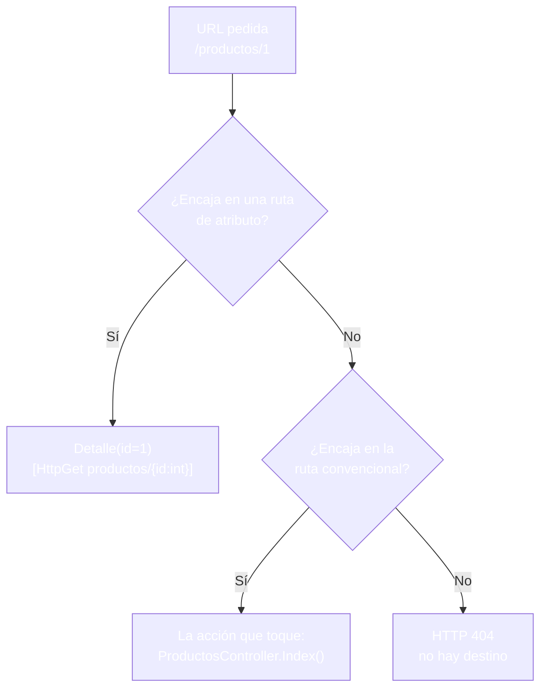
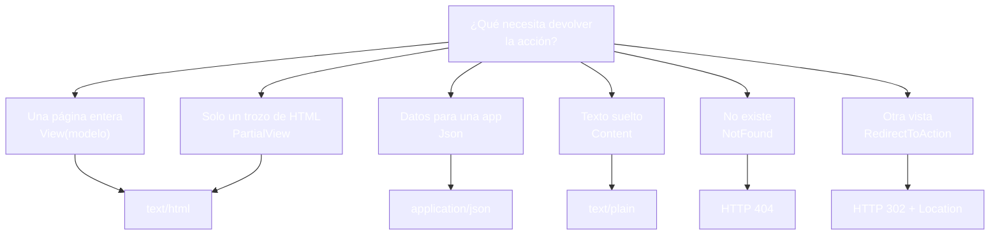
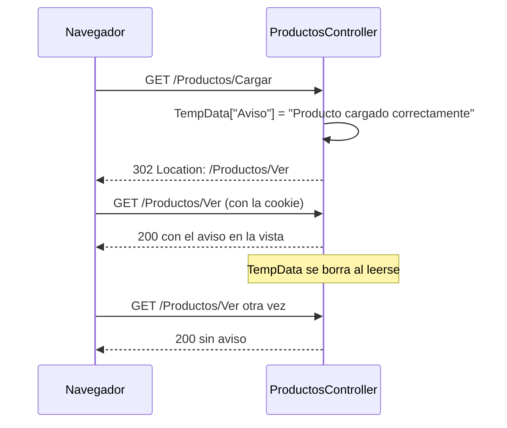

- [8. Controladores y vistas en MVC](#8-controladores-y-vistas-en-mvc)
  - [8.1. Rutas de acción: convención y atributos](#81-rutas-de-acción-convención-y-atributos)
    - [8.1.1. La ruta por atributo](#811-la-ruta-por-atributo)
    - [8.1.2. Restricciones de ruta](#812-restricciones-de-ruta)
    - [8.1.3. El verbo también cuenta](#813-el-verbo-también-cuenta)
  - [8.2. Los parámetros de una acción](#82-los-parámetros-de-una-acción)
    - [8.2.1. Por ruta o por query string](#821-por-ruta-o-por-query-string)
    - [8.2.2. Cuando el parámetro no encaja](#822-cuando-el-parámetro-no-encaja)
  - [8.3. Qué devuelve una acción](#83-qué-devuelve-una-acción)
    - [8.3.1. El catálogo de resultados](#831-el-catálogo-de-resultados)
    - [8.3.2. En ejecución](#832-en-ejecución)
    - [8.3.3. Los 404 bajo control](#833-los-404-bajo-control)
    - [8.3.4. Redirigir con RedirectToAction](#834-redirigir-con-redirecttoaction)
  - [8.4. ViewData, ViewBag y TempData](#84-viewdata-viewbag-y-tempdata)
    - [8.4.1. Dos nombres para la misma caja](#841-dos-nombres-para-la-misma-caja)
    - [8.4.2. TempData: el aviso que cruza un redirect](#842-tempdata-el-aviso-que-cruza-un-redirect)
  - [8.5. La vista que elige el controlador](#85-la-vista-que-elige-el-controlador)
    - [8.5.1. View con otro nombre](#851-view-con-otro-nombre)
    - [8.5.2. PartialView: devolver solo la pieza](#852-partialview-devolver-solo-la-pieza)
    - [8.5.3. Cuando falta la vista](#853-cuando-falta-la-vista)
  - [8.6. El flujo completo con el repositorio](#86-el-flujo-completo-con-el-repositorio)
  - [8.7. Buenas prácticas](#87-buenas-prácticas)
  - [8.8. Reto: monta el catálogo de FunkoApp tras un controlador](#88-reto-monta-el-catálogo-de-funkoapp-tras-un-controlador)
    - [8.8.1. Contexto](#881-contexto)
    - [8.8.2. Modelo de datos](#882-modelo-de-datos)
    - [8.8.3. Almacenamiento](#883-almacenamiento)
    - [8.8.4. Retos](#884-retos)


# 8. Controladores y vistas en MVC

> 💡 **Punto de partida:** Cuando tecleas `youtube.com/watch?v=abc123`, no existe ningún fichero llamado así: alguien recibe ese texto, lo parte en trozos, encuentra la acción que sabe tratar el vídeo y decide qué responder. Si en vez de `abc123` pones letras imposibles, ese mismo alguien decide otra cosa: un error. Ese alguien es el controlador de MVC; en este punto lo programas de verdad, con rutas, parámetros y resultados.

En el punto 07 diseñaste el flujo MVC en el papel. En este punto aprenderás a programarlo: rutas de verdad, parámetros que llegan desde la URL, acciones que devuelven vistas, JSON, trozos de HTML o redirecciones, y avisos que cruzan un redirect. Todo visto de cerca con **F12**.

**Objetivos de aprendizaje:**

- Interpretar cómo llega una URL a una acción: ruta convencional, ruta por atributo y restricciones
- Distinguir parámetros de ruta y de query string, y saber qué ocurre cuando no encajan
- Elegir el resultado adecuado en cada acción: `View`, `PartialView`, `Json`, `Content`, `NotFound` y `RedirectToAction`
- Hacer llegar datos a la vista con `ViewData`, `ViewBag` y `TempData`
- Comprobar cada respuesta en ejecución: código HTTP, `Content-Type` y cuerpo

> 📝 **Nota:** seguimos con el proyecto MVC del punto 07 (creado con `dotnet new mvc`, con namespaces `ProductosApp`). Lo ampliamos con más acciones.

## 8.1. Rutas de acción: convención y atributos

En el punto 07 vimos la ruta que gobierna el proyecto entero:

```csharp
app.MapControllerRoute(
    name: "default",
    pattern: "{controller=Home}/{action=Index}/{id?}");
```

Esa convención lee la URL de izquierda a derecha: primer trozo, controlador; segundo, acción; tercero, identificador opcional. Con ella funcionan `/Productos` o `/Home/Acerca`, pero sus direcciones son hijas del patrón: para llegar a un detalle hay que escribir `/Productos/Detalle/7`, con el controlador y la acción delante. Cuando quieres una dirección corta, fija y legible, la convención no manda — manda el atributo.

### 8.1.1. La ruta por atributo

Una acción puede declarar su propia dirección directamente en el método:

```csharp
[HttpGet("productos/{id:int}")]
public IActionResult Detalle(int id)
{
    var producto = RepositorioProductos.ObtenerTodos()
        .FirstOrDefault(p => p.Id == id);

    if (producto is null) return NotFound();
    return View(producto);
}
```

La plantilla `productos/{id:int}` se lee así: `productos` es texto literal que debe aparecer tal cual, `{id}` es un hueco que se rellena con el resto de la URL y `:int` es una restricción sobre ese hueco. El valor del hueco acaba convertido en el argumento `id` de la acción.

| Pieza | Qué es | Ejemplo |
|-------|--------|---------|
| `productos` | Texto literal | Debe coincidir carácter a carácter con la URL |
| `{id}` | Hueco de parámetro | Se rellena y se pasa a la acción |
| `{id:int}` | Hueco con restricción | Solo deja pasar enteros |
| `[HttpGet]` | Verbo permitido | La acción responde a GET |


- `GET /productos/1` → **HTTP 200** con `Auriculares` y precio `14,99 €`
- `GET /productos/5` → **HTTP 200** con `Mochila`
- `GET /Productos/Detalle/7` → **HTTP 404**: una acción con atributo deja de escuchar por la ruta convencional; solo responde en su dirección

Dos detalles que importan. El primero: las rutas de atributo se comprueban antes que la convencional, por eso `productos/1` llega a `Detalle` y no se interpreta como "controlador `productos`, acción `1`". El segundo: el atributo añade una dirección, no reemplaza la acción; `Index()` sigue atendiendo por convención (`GET /Productos/Index` → **HTTP 200**).



📌 **Ejemplo real:** En GitHub, cada repositorio tiene su propia dirección (`github.com/usuario/proyecto`) y esa misma plantilla encaja con millones de combinaciones. Eso es una ruta con huecos: el patrón es único, los datos cambian en cada visita.

### 8.1.2. Restricciones de ruta

La restricción es un filtro que decide qué valores admiten los huecos de la URL. Las más usadas:

| Restricción | Ejemplo | Para qué sirve |
|-------------|---------|----------------|
| `int` | `{id:int}` | Identificadores numéricos: el texto no pasa |
| `guid` | `{id:guid}` | Identificadores únicos de base de datos |
| `minlength(3)` | `{q:minlength(3)}` | La búsqueda debe traer al menos 3 caracteres |
| `range(0,10)` | `{pagina:range(0,10)}` | Reglas de negocio escritas en la propia URL |

`GET /productos/abc` → **HTTP 404** con el cuerpo vacío. La plantilla no encaja con `abc`, así que la petición ni siquiera llega a `Detalle`.

¿Y si quitamos `:int`? Se cambia la ruta a `productos/{id}` y se añade una sonda en la primera línea de la acción para ver si la petición llega:

```csharp
[HttpGet("productos/{id}")]
public IActionResult Detalle(int id)
{
    // Sonda: llega aquí la petición
    if (id == 0) return Content("accion invocada con id=0", "text/plain");
    // ... resto de la acción sin cambios
```

Sin la restricción:

| URL | Resultado sin `:int` |
|-----|----------------------|
| `GET /productos/abc` | **200** `text/plain`: `accion invocada con id=0` |
| `GET /Productos/Buscar` | **200** `text/plain`: la ruta se come el segundo trozo y `Buscar` deja de responder |
| `GET /productos/99` | **404**: la acción sí se invocó y su código encontró `null` |

Sin la restricción, `{id}` acepta cualquier texto: o la acción se invoca con un `id` convertido a cero, o la ruta captura direcciones que deberían ir a otra acción. Con `:int`, solo los enteros encajan y el resto se descarta antes de tocar tu código.

> ⚠️ **Advertencia:** sin restricción, el error no aparece donde esperas: la página sigue funcionando para los casos buenos y falla de forma extraña para los malos. Es uno de los fallos más difíciles de encontrar en producción porque nadie prueba `abc` hasta que lo hace un usuario.

> 💡 **Consejo:** pon restricción a todos los huecos numéricos. Es una línea que evita conversiones imposibles y te devuelve un 404 limpio en vez de una decisión ambigua.

📌 **Ejemplo real:** Un banco no acepta cualquier cosa en la URL de una transferencia: la referencia tiene un formato y una longitud concretos. Si no encaja, ni siquiera se procesa la petición. La restricción de ruta es la misma idea: el formato se decide antes de ejecutar tu código.

### 8.1.3. El verbo también cuenta

Una petición HTTP no es solo una dirección: también lleva un verbo (`GET`, `POST`, `PUT`, `DELETE`). El atributo `[HttpGet]` restringe la acción a ese verbo.


- `GET /productos/1` → **HTTP 200** (el verbo es el que pide la ruta)
- `POST /productos/1` → **HTTP 405** Method Not Allowed: la dirección existe, pero no por ese verbo
- `POST /Productos/Datos` → **HTTP 200** con JSON: `Datos()` no lleva atributo y acepta cualquier verbo

El **405** y el **404** dicen cosas distintas: 404 es "aquí no hay nada", 405 es "aquí sí hay algo, pero no así".

📌 **Ejemplo real:** En Gmail, el enlace de un correo no puede borrar tu cuenta aunque alguien lo mande en un mensaje. Por eso las operaciones que cambian cosas no se hacen con `GET`: si borrar fuera un enlace, cualquier rastreador de correos podría ejecutarlo sin que tú lo sepas.

> 📝 **Nota:** las acciones con `POST` y sus formularios llegan pronto: los puntos 13 y 14 les dedican el bloque completo. Aquí solo nos importa que el verbo también decide qué acción responde.

## 8.2. Los parámetros de una acción

Una acción no solo recibe la URL: recibe valores. Hay dos puertas por las que pueden entrar.

### 8.2.1. Por ruta o por query string

La primera puerta es la ruta, que ya vimos: el hueco `{id}` se convierte en el argumento `id`. La segunda es el query string, esa parte que va después de `?` en la dirección:

```csharp
// Parámetro por query string: /Productos/Buscar?q=o
public IActionResult Buscar(string? q)
{
    var res = RepositorioProductos.ObtenerTodos()
        .Where(p => string.IsNullOrWhiteSpace(q)
            || p.Nombre.Contains(q, StringComparison.OrdinalIgnoreCase))
        .ToList();

    ViewBag.Consulta = q ?? "(vacia)";
    ViewData["Encontrados"] = res.Count;
    return View(res);
}
```

El nombre del argumento es la clave: solo el parámetro llamado `q` se llena con `?q=...`.

| Petición | `q` recibe | Resultado |
|----------|-----------|------------------|
| `GET /Productos/Buscar?q=o` | `"o"` | **200**, `Resultados de "o"`, **3** resultados (Teclado, Botella, Mochila) |
| `GET /Productos/Buscar?q=man` | `"man"` | **200**, `Resultados de "man"`, **0** resultados |
| `GET /Productos/Buscar` | `null` | **200**, `Resultados de "(vacia)"`, **6** resultados |
| `GET /Productos/Buscar?texto=o` | `null` | **200**, **6** resultados: `texto` no existe, nadie lo recoge |

Las dos puertas conviven: `Detalle` recibe por ruta y `Buscar` por query string, y en ambos casos es el enlazado de modelos (*model binding*) quien convierte el texto en el tipo del argumento.

📌 **Ejemplo real:** La búsqueda de Google es un query string: `?q=aspnet+core`. El término cambia en cada visita, la dirección de la acción es siempre la misma, y puedes compartir el enlace con alguien para que vea exactamente lo mismo que tú.

> 💡 **Truco:** para saber qué puerta usa una acción, mira su firma: argumentos que salen de la ruta aparecen en la plantilla `{id}`; los de query string aparecen en la URL tras `?` y no están en ninguna plantilla.

### 8.2.2. Cuando el parámetro no encaja

No todos los caminos llegan a una acción, y cada uno falla a su manera:

| Petición | Qué ocurre | HTTP |
|----------|------------|------|
| `GET /productos/99` | La ruta encaja, el producto no existe; el código decide | **404** |
| `GET /productos/abc` | La restricción `:int` no deja pasar el texto | **404** |
| `GET /Productos/QueEs` | La acción no existe en el controlador | **404** |
| `GET /Views/Productos/Index` | La vista no es una URL; las vistas no se piden por dirección | **404** |
| `POST /productos/1` | La dirección existe, pero `[HttpGet]` rechaza el verbo | **405** |
| `POST /Productos/Datos` | La acción no restringe verbo y acepta el POST | **200** |

La regla para leer la consola del navegador: `404` cuando no hay destino (ruta, acción o dato), `405` cuando el destino existe y el verbo no encaja, y `500` cuando el destino existe pero algo se rompe (en el punto 07 ya vimos el caso típico: la acción pide una vista que no está).

> 💡 **Consejo:** cuando una URL falle, pregúntate siempre en este orden: ¿la ruta encaja? ¿la acción existe? ¿el parámetro tiene sentido? ¿la vista está? Son cuatro fallos distintos con cuatro soluciones distintas.

## 8.3. Qué devuelve una acción

Todas las acciones firman con `IActionResult`: *"devuelvo un resultado de acción"*. Ese resultado puede ser de muchas formas, y elegirlo es la decisión de diseño de este punto.

### 8.3.1. El catálogo de resultados

| Resultado | Método | Qué entrega al cliente |
|-----------|--------|------------------------|
| **Vista completa** | `View(modelo)` | Página entera con el layout: `text/html` |
| **Parcial** | `PartialView("pieza", modelo)` | Trozo de HTML sin página ni layout |
| **JSON** | `Json(datos)` | Datos para otra aplicación: `application/json` |
| **Texto** | `Content("hola", "text/plain")` | Texto plano sin plantilla |
| **No existe** | `NotFound()` | HTTP 404 |
| **Redirección** | `RedirectToAction("Ver")` | HTTP 302 con `Location` a otra acción |



📌 **Ejemplo real:** Netflix es una web y a la vez una app. La web recibe `text/html` porque alguien tiene que pintarla en un navegador; la tele y el móvil piden `application/json` a las mismas acciones del servidor. El dato es el mismo; cambia el resultado que se le devuelve a cada cliente.

### 8.3.2. En ejecución

Esta es la hoja de resultados de las acciones del `ProductosController` que llevamos en este punto:

| URL | Qué hace la acción | HTTP | Respuesta |
|-----|--------------------|------|------------------|
| `GET /Productos` | `View(lista)` con `ViewData` | **200** | `text/html`: `Productos del catálogo (6)`, 6 tarjetas |
| `GET /Productos/Novedades` | `View("Index", novos)` | **200** | `text/html`: `Novedades del catálogo (2)`, 2 tarjetas |
| `GET /productos/1` | `Detalle(1)` → `View(producto)` | **200** | `text/html`: `Auriculares`, `14,99 €` |
| `GET /productos/99` | `Detalle` → `NotFound()` | **404** | Cuerpo vacío |
| `GET /productos/abc` | La restricción `:int` no encaja | **404** | Cuerpo vacío |
| `POST /productos/1` | `[HttpGet]` rechaza el verbo | **405** | Cuerpo vacío |
| `GET /Productos/Buscar?q=o` | `Buscar("o")` → 3 coincidencias | **200** | `Resultados de "o"` y `3` |
| `GET /Productos/Datos` | `Json(lista)` | **200** | `application/json`: 6 objetos, de `id` a `esNovedad` |
| `GET /Productos/Tarjeta/1` | `PartialView("_FichaProducto")` | **200** | Solo `<div class="card...">`, sin `<html>` |
| `GET /Productos/Saludo` | `Content("hola...", "text/plain")` | **200** | `text/plain`: `hola desde el controlador` |
| `GET /Productos/NoExiste` | `NotFound()` explícito | **404** | Cuerpo vacío |
| `GET /Productos/QueEs` | La acción no existe | **404** | Cuerpo vacío |
| `GET /Productos/Cargar` | `TempData` + `RedirectToAction` | **302** | `Location: /Productos/Ver` |
| `GET /Productos/Ver` | `View()` con el aviso leído | **200** | `Producto cargado correctamente` |

> 🔧 **Truco:** en **F12**, la pestaña *Network* te da dos claves de cada petición: el código de estado (la decisión) y el `Content-Type` (el formato). Si pedías JSON y te llega `text/html`, el error está en el resultado de la acción, no en el front-end.

### 8.3.3. Los 404 bajo control

Hay dos maneras de que salga un 404: porque la ruta no encuentra destino (ya lo vimos) o porque tú lo decides:

```csharp
var producto = RepositorioProductos.ObtenerTodos()
    .FirstOrDefault(p => p.Id == id);

if (producto is null) return NotFound();
return View(producto);
```

La comprobación es obligatoria: sin ella, `View(producto)` recibiría `null` y la vista revienta al intentar leer `Model.Nombre`. El `404` es una respuesta limpia, decidida en el punto exacto donde los datos se acaban. `GET /productos/99` → **HTTP 404** con el cuerpo vacío (en producción, el middleware de errores puede servir ahí tu propia página de "no encontrado").

📌 **Ejemplo real:** Steam guarda enlaces antiguos a juegos retirados de la tienda. Cuando sigues uno, no ves un error técnico: ves una página cuidada que te invita a volver a la tienda. El 404 está decidido y diseñado, no improvisado.

> ⚠️ **Advertencia:** el 404 y el 500 no se confunden nunca: `404` es "eso que pides no existe" y `500` es "existe pero me he roto". Si una acción sin cambios raros devuelve 500, revisa primero si está la vista (punto 07).

### 8.3.4. Redirigir con RedirectToAction

Una redirección no entrega contenido: entrega una orden de cambio de destino.

```csharp
public IActionResult Cargar()
{
    TempData["Aviso"] = "Producto cargado correctamente";
    return RedirectToAction("Ver");
}
```


- `GET /Productos/Cargar` → **HTTP 302** con la cabecera `Location: /Productos/Ver`
- El navegador lee el 302, no pinta nada y hace una segunda petición a `/Productos/Ver` → **HTTP 200**

Es el mismo truco del 07 (`/Home/Volver`), pero ahora con un motivo real: la acción `Cargar` termina su trabajo y quiere que la vista siguiente sea `Ver`, no ella.

📌 **Ejemplo real:** Cuando terminas un pedido en Glovo, la web no se queda en la vista de pago: te redirige al seguimiento del repartidor. El servidor responde "ve a esta otra dirección" y el navegador la pide por ti.

## 8.4. ViewData, ViewBag y TempData

Elegir el resultado no basta: a veces la acción necesita dejar un mensaje suelto para la vista. En el punto 07 aparecieron `ViewData` y `ViewData["Titulo"]`; ahora les damos sitio junto a `TempData`.

### 8.4.1. Dos nombres para la misma caja

`ViewData` y `ViewBag` son dos puertas al mismo almacén: `ViewData` es un diccionario de objetos y `ViewBag` un envoltorio dinámico sobre él. Lo que metes por una puerta lo ves por la otra.

```csharp
ViewBag.Consulta = q ?? "(vacia)";   // controlador escribe
ViewData["Encontrados"] = res.Count;  // controlador escribe
```

```cshtml
<h1 id="h">Resultados de "@ViewBag.Consulta"</h1>  @* vista lee *@
<p id="n">@ViewData["Encontrados"]</p>
```

`GET /Productos/Buscar?q=o`, la vista muestra `Resultados de "o"` (por `ViewBag`) y `3` (por `ViewData`), los dos en la misma página. Y en `GET /Productos` aparece `Productos del catálogo (6)`, que sale del `ViewData["Titulo"]` que puso la acción.

| Vía | Tipo | Para qué se usa |
|-----|------|-----------------|
| `ViewData` | Diccionario de `object?` | Datos sueltos con nombre, títulos, contadores |
| `ViewBag` | `dynamic` | Lo mismo, escribiendo menos: `ViewBag.Consulta` |
| `View(datos)` + `@model` | Tipado | Los datos de verdad de la vista |

> ⚠️ **Advertencia:** `ViewData` guarda `object?`. Si metes un `int` y en la vista lo lees como `string`, no falla al escribir: falla al leer, en tiempo de ejecución. El modelo tipado existe precisamente para eso; el `ViewData` es para mensajes sueltos, no para el catálogo.

### 8.4.2. TempData: el aviso que cruza un redirect

`ViewData` vive una sola petición, pero un redirect son dos peticiones: `Cargar` escribe, `Ver` es quien pinta. `TempData` es la solución: un almacén que sobrevive exactamente una petición y se borra al leerse.



La vista `Ver` no hace más que leerlo: `<p id="aviso">@TempData["Aviso"]</p>`.

| Cadena de peticiones | Aviso en la vista |
|----------------------|-------------------|
| `Cargar` → `Ver` con la misma cookie | `Producto cargado correctamente` |
| `Ver` otra vez (misma cookie) | Vacío: ya se leyó |
| `Cargar` → `Ver` **sin cookie** | Vacío: el aviso viaja en la cookie |

📌 **Ejemplo real:** Es el mensaje que ves tras enviar un formulario: "Cambios guardados". Si recargas la página, desaparece. No está en la base de datos ni en la página: viajó una sola vez, del servidor al navegador y de vuelta.

> 💡 **Consejo:** `TempData` es para el aviso del redirect, nada más. La persistencia de verdad entre peticiones (cookies, sesión) tiene su sitio: el punto 18. El patrón que lo lleva a los formularios, PRG, llega en los puntos 13 y 14.

## 8.5. La vista que elige el controlador

El punto 07 dejó anotado que `return View()` busca la vista por convención: primero `Views/<Controlador>/<Acción>.cshtml` y después `Views/Shared/`. Aquí vemos lo que pasa cuando te sales del camino normal.

### 8.5.1. View con otro nombre

Una acción no tiene por qué tener vista propia: puede pedir otra por nombre.

```csharp
public IActionResult Novedades()
{
    ViewData["Titulo"] = "Novedades del catálogo";
    var novos = RepositorioProductos.ObtenerTodos()
        .Where(p => p.EsNovedad)
        .ToList();
    return View("Index", novos);
}
```

`View("Index", novos)` busca `Views/Productos/Index.cshtml` (del controlador actual) y le pasa otros datos. `GET /Productos/Novedades` → **HTTP 200** con `Novedades del catálogo (2)` y **2 tarjetas**, mientras que `GET /Productos` muestra 6: misma vista, dos acciones, listados distintos.

> 📝 **Nota:** si el nombre no corresponde a ninguna vista, el resultado es el del punto 07: **HTTP 500**. Nombrar mal una vista es un error de programación, no un "no encontrado".

### 8.5.2. PartialView: devolver solo la pieza

En el punto 05 invocaste una parcial desde otra vista con `<partial name="_FichaProducto" />`. El controlador puede devolverla directamente como resultado:

```csharp
public IActionResult Tarjeta(int id)
{
    var producto = RepositorioProductos.ObtenerTodos()
        .FirstOrDefault(p => p.Id == id);

    if (producto is null) return NotFound();
    return PartialView("_FichaProducto", producto);
}
```

La pieza vive en `Views/Shared/_FichaProducto.cshtml`, igual que las demás. `GET /Productos/Tarjeta/1` → **HTTP 200** con `text/html`, pero el cuerpo empieza en `<div class="card mb-3 ficha">` y no contiene ni `<html>` ni `</html>`: es HTML suelto, sin layout y sin página.

📌 **Ejemplo real:** Cuando bajas en el muro de X y entra contenido nuevo, la web no recarga la página: pide un trozo de HTML por una dirección como esta y lo pega al final. Un `PartialView` servido por una acción es exactamente ese trozo.

> 💡 **Consejo:** si la respuesta es un `Json`, un `Content` o un `PartialView`, no crees la vista: esos resultados no buscan `.cshtml`. Una carpeta de vistas con ficheros que nadie pide es deuda muerta.

### 8.5.3. Cuando falta la vista

Resumen de la búsqueda de la vista para una acción que hace `return View(...)`:

| Situación | Qué encuentra | HTTP |
|-----------|---------------|------|
| `Views/Productos/Index.cshtml` | Vista del controlador | **200** |
| No está la anterior, pero sí `Views/Shared/Index.cshtml` | Vista compartida | **200** |
| No está ninguna | Error de vista no encontrada | **500** |
| El resultado es `Json`, `Content` o `PartialView` | No busca nada | El código que devuelvas |

> 💡 **Consejo:** el orden de búsqueda es el mismo que describió el punto 07; lo que cambia aquí es quién lo provoca: la acción decide qué nombre se busca y, si se sale de la convención, tú firmas el nombre.

## 8.6. El flujo completo con el repositorio

Ya están todas las piezas: este es el recorrido entero de `GET /productos/1`, desde la barra de direcciones hasta el HTML, con el repositorio enchufado en el medio:

```mermaid
graph LR
    A["GET /productos/1"] --> B["Enrutador"]
    B --> C["ProductosController<br/>Detalle(id=1)"]
    C --> D["RepositorioProductos<br/>ObtenerTodos()"]
    D --> E{"¿Existe el<br/>producto?"}
    E -->|"Sí"| F["View(producto)"]
    E -->|"No"| G["NotFound()"]
    F --> H["Razor pinta<br/>Views/Productos/Detalle.cshtml"]
    H --> I["_Layout.cshtml"]
    I --> J["HTML con HTTP 200"]
    G --> K["HTTP 404"]
    style A fill:#2196F,color:#fff3,color:#fff
    style B fill:#607D8,color:#fffB,color:#fff
    style C fill:#f4433,color:#fff6,color:#fff
    style D fill:#607D8,color:#fffB,color:#fff
    style E fill:#FF980,color:#fff0,color:#fff
    style F fill:#4CAF5,color:#fff0,color:#fff
    style G fill:#f4433,color:#fff6,color:#fff
    style H fill:#4CAF5,color:#fff0,color:#fff
    style I fill:#4CAF5,color:#fff0,color:#fff
    style J fill:#4CAF5,color:#fff0,color:#fff
    style K fill:#f4433,color:#fff6,color:#fff
```



| Paso | Quién | Qué hace |
|------|-------|----------|
| 1 | Enrutador | Encaja la URL y encuentra `Detalle` con `id=1` |
| 2 | Acción | Pregunta al repositorio y comprueba si hay dato |
| 3 | Repositorio | Devuelve los Productos de memoria, sin base de datos |
| 4 | Resultado | `View(producto)` o `NotFound()`, según el paso 2 |
| 5 | Razor | Pinta la vista y la envuelve en el layout |
| 6 | Navegador | Recibe HTML y el **200** correspondiente |

Fíjate en la dirección de la flecha: el controlador habla con el repositorio y con la vista, y la vista solo pinta lo que le llega. Es la regla del 07, ahora operativa con código real.

📌 **Ejemplo real:** Es el mismo flujo que un repartidor de comida: el pedido entra por una dirección (la URL), alguien lo interpreta (el enrutador), la cocina consulta sus armarios (el repositorio), decide qué llevar o qué decir si no hay (el resultado) y el empaque final es lo que llega a tu puerta.

## 8.7. Buenas prácticas

- **Rutas especiales con atributo**: usa la ruta convencional para el sitio y los atributos solo donde la convención no llega
- **Restricción en todos los huecos**: `{id:int}` donde esperas números; es una línea que evita decisiones ambiguas
- **El 404 lo eliges tú**: comprueba `null` antes de llamar a `View`, y devuelve `NotFound()` con criterio
- **404 y 405 con su significado**: "no hay nada" y "no así" son mensajes distintos para quien depura
- **Modelo para datos, `ViewData` para mensajes**: si la vista necesita una lista, va por `View(datos)` con `@model`, no por el `ViewData`
- **`TempData` solo para el aviso del redirect**: lo que deba durar más pertenece a otro mecanismo
- **Resultado coherente con el cliente**: JSON para datos, `View` para vistas, `PartialView` para trozos
- **Comprueba con F12**: código de estado y `Content-Type` dicen en una línea si la acción hizo lo que querías

## 8.8. Reto: monta el catálogo de FunkoApp tras un controlador

> Monta el catálogo de FunkoApp tras un controlador — con rutas, parámetros y resultados, hasta el último detalle.

### 8.8.1. Contexto

**Paso 0:** prepara el escenario. Crea un proyecto MVC con `dotnet new mvc` y deja en él el modelo y el repositorio de los apartados siguientes. Si vienes de los puntos anteriores, ya tienes esas piezas; muévelas al proyecto MVC y ajusta los `namespace`.

### 8.8.2. Modelo de datos

| Propiedad | Tipo | Obligatorio |
|-----------|------|:-----------:|
| `id` | int | Sí (autogenerado) |
| `nombre` | string | Sí |
| `categoria` | string | Sí |
| `anio` | int | Sí |
| `precioReferencia` | decimal | Sí |
| `imagen` | string? | No |
| `etiquetas` | List\<string\>? | No |
| `activo` | bool | Sí |
| `esNovedad` | bool | Sí |

Crea `Models/Funko.cs` con un `record` público de esos nueve campos (el mismo formato que la tabla, con el nombre `Funko`).

### 8.8.3. Almacenamiento

Los Funkos se guardan en una lista en memoria dentro de `Repositories/RepositorioFunkos.cs`:

```csharp
public static class RepositorioFunkos
{
    private static readonly List<Funko> Funkos = [ /* seis figuras */ ];

    public static IReadOnlyList<Funko> ObtenerTodos() => Funkos;
}
```

Rellena la lista con seis figuras de modo que haya activas y dadas de baja, novedades y no novedades, y las tres categorías.

### 8.8.4. Retos

1. **En papel primero:** dibuja la tabla de rutas: URL de ejemplo → acción que responde → resultado esperado (código HTTP y formato). Incluye al menos una ruta de atributo, un query string, un 404, un 405 y un 302
2. Crea **`Controllers/FunkosController.cs`** con `Index()` que haga `return View(RepositorioFunkos.ObtenerTodos())` y comprueba con **F12** que `GET /Funkos` da **200** con seis tarjetas
3. Añade `[HttpGet("funkos/{id:int}")] Detalle(int id)` con el `if (producto is null) return NotFound()`: abre `GET /funkos/1` y comprueba **200** con el nombre; repite con `/funkos/99` y `/funkos/abc` y comprueba **404** en los dos
4. Comprueba que `POST /funkos/1` devuelve **405** y que `GET /Funkos/Detalle/1` devuelve **404**: la acción con atributo solo escucha en su dirección
5. Añade `Buscar(string? q)` y tres peticiones: `?q=` con resultados, `?q=` sin resultados y sin parámetro. Comprueba los tres casos
6. Añade `Datos()` con `return Json(...)` y verifica en **F12** que el `Content-Type` es `application/json`
7. Añade `Tarjeta(int id)` con `return PartialView("_FichaFunko", funko)`: comprueba que la respuesta **no contiene `<html>`**
8. Añade `Saludo()` con `return Content("...", "text/plain")` y verifica el `text/plain`
9. Añade `Cargar()` con `TempData` y `RedirectToAction("Ver")`, y `Ver()` que pinta `@TempData["Aviso"]`: comprueba el **302** con su `Location` y el aviso en la segunda petición. Repite sin cookie y comprueba que el aviso no viaja
10. Añade `Novedades()` con `return View("Index", lista)` y comprueba que pinta la vista de `Index` con menos tarjetas y otro título
11. Añade una acción sin vista y comprueba el **500**: así dejas documentado el caso de error en tu proyecto

**Puntos extra:**

- Quita `:int` de la ruta, añade una sonda al principio de `Detalle` y observa que `/funkos/abc` llega a la acción con `id=0`; devuélvelo todo como estaba
- Añade `[HttpGet]` a `Index` y comprueba que `POST /Funkos` pasa a dar **405**
- Escribe en un comentario de tu controlador qué resultado (`View`, `Json`, `Content`, `PartialView`, `NotFound`, `RedirectToAction`) devuelve cada acción y por qué
- Cambia un `View("Index")` por un nombre inexistente y lee el **500**
- Compara en la pestaña **Network** el tamaño de `GET /Funkos` y el de `GET /Funkos/Datos`: mismo dato, dos formatos, dos pesos

---

**Resumen del punto:**

| Concepto | Descripción |
|----------|-------------|
| **Ruta convencional** | `{controller=Home}/{action=Index}/{id?}`; lee la URL en trozos |
| **Ruta por atributo** | La acción declara su dirección: `[HttpGet("productos/{id:int}")]` |
| **Prioridad** | Las rutas de atributo se comprueban antes que la convencional |
| **Acción con atributo** | Solo responde en su dirección; la convencional ya no la alcanza |
| **Restricción de ruta** | Filtro sobre un hueco (`:int`, `:guid`, `range`); sin ella, el texto llega a la acción |
| **Verbo permitido** | `[HttpGet]` restringe el método; sin atributo, acepta cualquiera |
| **Query string** | `?q=...`; el nombre del argumento es el que enlaza |
| **`View(modelo)`** | Página completa con layout: `text/html` |
| **`View("Otro")`** | Pide otra vista por nombre, del mismo controlador |
| **`PartialView`** | Trozo de HTML sin `<html>` ni layout |
| **`Json(datos)`** | `application/json` para clientes que no son un navegador |
| **`Content`** | Texto plano con el `Content-Type` que fijes |
| **`NotFound()`** | **HTTP 404** decidido por tu código cuando el dato no existe |
| **`RedirectToAction`** | **HTTP 302** con `Location` a otra acción |
| **`ViewData` / `ViewBag`** | Misma caja de mensajes sueltos, dos formas de escribirla |
| **`TempData`** | Aviso que sobrevive una petición, por cookie; se borra al leerse |
| **404 vs 405 vs 500** | No existe / no por ese verbo / existe y algo se rompió |
| **Falta la vista** | **HTTP 500**; la convención no encuentra el `.cshtml` |
| **Flujo** | URL → enrutador → acción → repositorio → resultado → vista → HTML |

**¿Qué viene después?**

En el siguiente punto veremos ViewModels y Programación Orientada a Objetos en las vistas: cómo pasarle a una vista un objeto con la forma exacta que necesita, con propiedades calculadas y sin meter lógica de negocio en el `.cshtml`.
