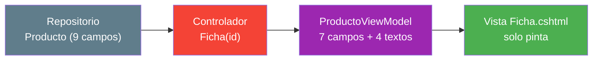
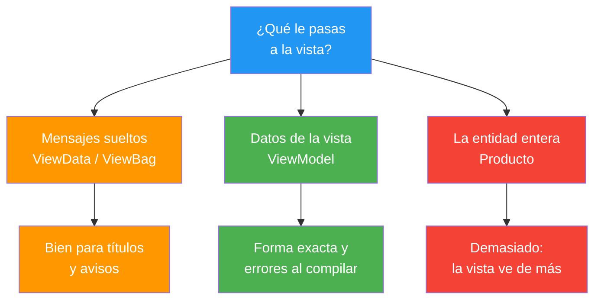
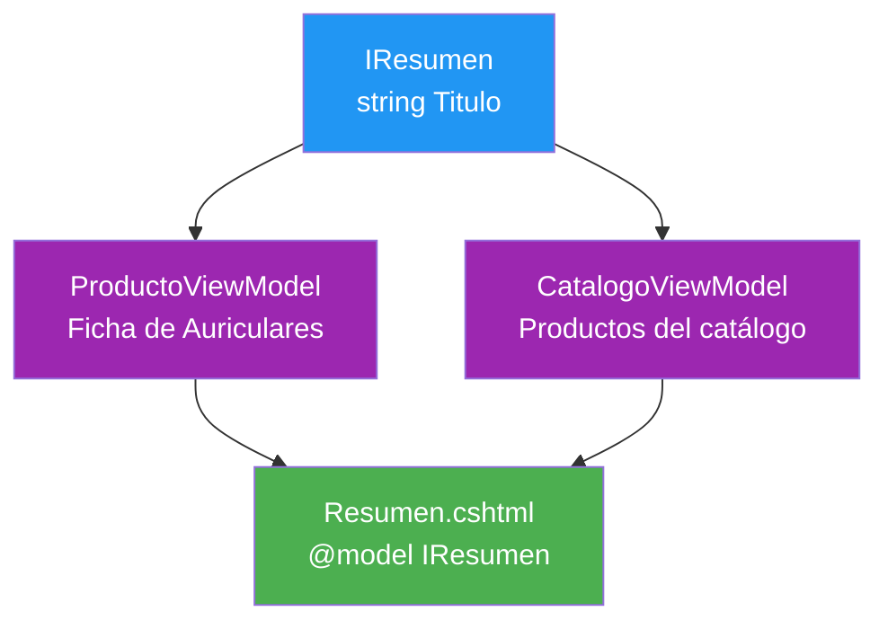
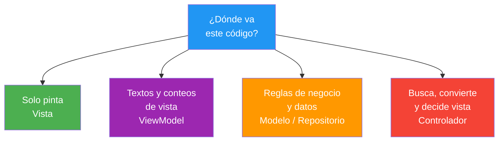

- [9. ViewModels y Programación Orientada a Objetos](#9-viewmodels-y-programación-orientada-a-objetos)
  - [9.1. La Forma que Pide la Vista](#91-la-forma-que-pide-la-vista)
    - [9.1.1. La Entidad No Es la Vista](#911-la-entidad-no-es-la-vista)
    - [9.1.2. Qué Pide la Vista que la Entidad No Da](#912-qué-pide-la-vista-que-la-entidad-no-da)
  - [9.2. Qué es un ViewModel](#92-qué-es-un-viewmodel)
    - [9.2.1. Tres Tipos de Modelo](#921-tres-tipos-de-modelo)
    - [9.2.2. El ViewModel del Detalle](#922-el-viewmodel-del-detalle)
    - [9.2.3. El Controlador Construye el ViewModel](#923-el-controlador-construye-el-viewmodel)
  - [9.3. Un ViewModel con Varios Datos](#93-un-viewmodel-con-varios-datos)
    - [9.3.1. El Panel del Catálogo](#931-el-panel-del-catálogo)
    - [9.3.2. ViewData o ViewModel](#932-viewdata-o-viewmodel)
  - [9.4. Programación Orientada a Objetos en la Vista](#94-programación-orientada-a-objetos-en-la-vista)
    - [9.4.1. Encapsulación: Solo lo que la Vista Necesita](#941-encapsulación-solo-lo-que-la-vista-necesita)
    - [9.4.2. Propiedades Calculadas](#942-propiedades-calculadas)
    - [9.4.3. Inmutabilidad: Records y Solo Lectura](#943-inmutabilidad-records-y-solo-lectura)
    - [9.4.4. Herencia y Polimorfismo](#944-herencia-y-polimorfismo)
  - [9.5. Dónde Acaba la Lógica](#95-dónde-acaba-la-lógica)
  - [9.6. Buenas Prácticas](#96-buenas-prácticas)
  - [9.7. Reto: Escudos de datos para FunkoApp](#97-reto-escudos-de-datos-para-funkoapp)
    - [9.7.1. Contexto](#971-contexto)
    - [9.7.2. Modelo de datos](#972-modelo-de-datos)
    - [9.7.3. Almacenamiento](#973-almacenamiento)
    - [9.7.4. Retos](#974-retos)


# 9. ViewModels y Programación Orientada a Objetos

> 💡 **Punto de partida:** Cuando abres la ficha de un vuelo en Kiwi, ves *Equipaje incluido* y *Cancelación gratis*; detrás hay decenas de campos internos de reservas que esa vista nunca mostrará. La vista pide una cosa y el modelo interno guarda otra: entre los dos hay un objeto pensado justo para la pantalla, el ViewModel. En este punto lo construyes para tu ficha de productos, con propiedades calculadas y POO aplicada a las vistas.

En este punto construimos los **ViewModels**: objetos con la forma exacta que pide cada vista, montados por el controlador y leídos por la vista. Y veremos que detrás de ese objeto hay programación orientada a objetos de verdad: encapsulación, propiedades calculadas, inmutabilidad y polimorfismo, todo aplicado a las vistas.

**Objetivos de aprendizaje:**

- Distinguir entidad, ViewModel e InputModel y saber cuál toca en cada situación
- Construir un ViewModel con propiedades calculadas y entregárselo desde el controlador
- Aplicar encapsulación, inmutabilidad y polimorfismo a los modelos de vista
- Decidir dónde acaba la lógica de presentación y empieza la de negocio
- Comprobar en compilación y en ejecución que el escudo funciona: CS1061, CS0200 y 500

> 📝 **Nota:** seguimos en el proyecto MVC de los puntos 07 y 08. Aparecen dos carpetas nuevas: `ViewModels/` para los escudos de datos y `Mappers/` para la conversión de entidades.

## 9.1. La Forma que Pide la Vista

### 9.1.1. La Entidad No Es la Vista

Volvemos a la entidad con la que trabajamos desde el punto 03:

```csharp
public record Producto(
    int Id,
    string Nombre,
    string Categoria,
    int Anio,
    decimal PrecioReferencia,
    string? Imagen,
    List<string>? Etiquetas,
    bool Activo,
    bool EsNovedad
);
```

Nueve campos, un reflejo fiel de lo que guarda la aplicación. Eso está bien para el repositorio y para la base de datos, pero la vista de ficha no es la base de datos: es una opinión sobre esos datos. En el punto 08, la vista `Detalle.cshtml` recibía la entidad y pintaba `Nombre`, `Categoria`, `Anio` y `PrecioReferencia`; los otros cinco campos viajaban de gratis.

📌 **Ejemplo real:** En la ficha de un producto de Amazon ves el nombre, el precio y la valoración. Detrás hay stock por almacén, coste de adquisición, margen del proveedor y decenas de campos más que jamás aparecen en tu vista, porque esa vista no es el almacén: es una opinión sobre él.

> 💡 **Analogía:** Un camarero lleva a la mesa una bandeja con los platos que tocan. La mesa no consulta la cocina ni sabe de dónde sale cada plato: recibe la bandeja ya preparada. El controlador es el camarero, el ViewModel es la bandeja y la vista es la mesa.

### 9.1.2. Qué Pide la Vista que la Entidad No Da

Comparemos lo que pinta la ficha con lo que la entidad sabe dar:

| Lo que pinta la ficha | La entidad | Qué falta |
|-----------------------|-----------|-----------|
| Nombre | `Nombre` | Nada, se copia |
| Categoría y año juntos | `Categoria` + `Anio` | El texto combinado: `Electrónica · 2019` |
| Estado en palabras | `Activo` (bool) | Convertir a `En catálogo` o `Descatalogado` |
| Sello de novedad | `EsNovedad` (bool) | Texto `Novedad` o vacío |
| Título de la pestaña | No existe | `Ficha de Auriculares` |
| Imagen y etiquetas | `Imagen`, `Etiquetas` | Sobran: la ficha no las pinta |

Dos problemas enfrentados. Por un lado, faltan textos derivados de los datos. Por otro, sobran campos que la vista no necesita ver. Falta quien convierta los bool en textos y junte categoría con año — y ese alguien no puede ser la vista.

⚠️ **Advertencia:** si le dices a la vista que resuelva esto con `@if (Model.Activo) { <span>En catálogo</span> }`, estás metiendo una regla de presentación en el `.cshtml`. Funciona hoy; cuando el texto cambie, tendrás que abrir todas las vistas donde aparece. La regla del 07 sigue en pie: la vista solo pinta.

## 9.2. Qué es un ViewModel

Un **ViewModel** es un objeto con las propiedades exactas que necesita una vista concreta, construido por el controlador y consumido por la vista. No guarda nada nuevo: presenta lo que ya existe con otra forma. La respuesta al hueco del apartado anterior es un objeto a medida — el ViewModel, escudo entre la entidad y la vista.

### 9.2.1. Tres Tipos de Modelo

En un proyecto MVC conviven tres clases de modelo, y confundirlas es la fuente de la mayoría de dudas:

| Tipo | Carpeta | Para qué lo usas | Ejemplo |
|------|---------|------------------|---------|
| **Entidad** | `Models/` | Reflejo de lo que almacenas | `Producto` con sus 9 campos |
| **ViewModel** | `ViewModels/` | Forma exacta de una vista | `ProductoViewModel` para la ficha |
| **InputModel** | `ViewModels/` | Lo que un formulario envía y hay que validar | Lo veremos con los formularios |

El nombre `ViewModels/` como carpeta de "escudos de datos" viene de esa idea: el ViewModel decide qué ve y qué no ve la vista.

📌 **Ejemplo real:** Instagram tiene un muro, un perfil y una vista de búsqueda; los tres pintan "publicaciones", pero cada vista necesita campos distintos (seguidores, ubicación, número de hashtags) y por eso cada una recibe un objeto distinto, no el registro crudo.

> 📝 **Nota:** la cláusula `: IResumen` que verás en la firma del ViewModel del apartado siguiente se explica en el 9.4.4: es el contrato que permite pintar el mismo objeto en otra vista. Por ahora, léela como una etiqueta más.

### 9.2.2. El ViewModel del Detalle

Así se ve el ViewModel de la ficha, en su carpeta `ViewModels/ProductoViewModel.cs`:

```csharp
public record ProductoViewModel(
    int Id,
    string Nombre,
    string Categoria,
    int Anio,
    decimal PrecioReferencia,
    bool Activo,
    bool EsNovedad
) : IResumen
{
    public string Titulo => $"Ficha de {Nombre}";
    public string Subtitulo => $"{Categoria} · {Anio}";
    public string Estado => Activo ? "En catálogo" : "Descatalogado";
    public string Sello => EsNovedad ? "Novedad" : string.Empty;
}
```

Dos cambios respecto a la entidad. Se quedan fuera `Imagen` y `Etiquetas` (la ficha no las pinta). Y aparecen cuatro propiedades con cuerpo, que calculan los textos que faltaban. La vista, con su `@model`, recibe ya el resultado:

```cshtml
@model ProductoViewModel
@{
    ViewData["Title"] = Model.Titulo;
}
<h1 id="nombre">@Model.Nombre</h1>
<p id="sub">@Model.Subtitulo</p>
<span id="precio">@Model.PrecioReferencia.ToString("C")</span>
<span id="estado">@Model.Estado</span>
<span id="sello">@Model.Sello</span>
```

Para que `@model ProductoViewModel` funcione sin escribir el namespace completo, `Views/_ViewImports.cshtml` suma una directiva que ya conoces del punto 05: `@using ProductosApp.ViewModels`.

### 9.2.3. El Controlador Construye el ViewModel

La conversión de entidad a ViewModel se centraliza en `Mappers/ProductoMapper.cs`, con un método de extensión:

```csharp
public static class ProductoMapper
{
    public static ProductoViewModel ToViewModel(this Producto producto) =>
        new(
            producto.Id,
            producto.Nombre,
            producto.Categoria,
            producto.Anio,
            producto.PrecioReferencia,
            producto.Activo,
            producto.EsNovedad
        );
}
```

Y la acción se reduce a buscar, convertir y pintar:

```csharp
// El controlador construye el ViewModel: /Productos/Ficha/1
public IActionResult Ficha(int id)
{
    var producto = RepositorioProductos.ObtenerTodos()
        .FirstOrDefault(p => p.Id == id);

    if (producto is null) return NotFound();
    return View(producto.ToViewModel());
}
```


- `GET /Productos/Ficha/1` → **HTTP 200** con `Auriculares`, `Electrónica · 2019`, `14,99 €`, estado `En catálogo`, sello `Novedad` y pestaña `Ficha de Auriculares - ProductosApp`
- `GET /Productos/Ficha/4` → **HTTP 200** con `Lámpara`, estado `Descatalogado` y el sello vacío
- `GET /Productos/Ficha/99` → **HTTP 404** con el cuerpo vacío: el escudo no tapa el `NotFound`



> 💡 **Consejo:** si en la vista escribes `@Model.` y el autocompletado solo ofrece siete campos y cuatro textos, tienes el escudo funcionando. El ViewModel es la lista de lo que la vista tiene permitido conocer.

## 9.3. Un ViewModel con Varios Datos

### 9.3.1. El Panel del Catálogo

La segunda vista no es una ficha: es un resumen con título, dos contadores y una lista de nombres. Ahí el ViewModel no mapea campos de uno a uno, sino que guarda los datos de origen en privado y abre solo sus conclusiones:

```csharp
public record CatalogoViewModel : IResumen
{
    private readonly IReadOnlyList<Producto> _productos;

    public CatalogoViewModel(IReadOnlyList<Producto> productos) =>
        _productos = productos;

    public string Titulo => "Productos del catálogo";
    public int Total => _productos.Count;
    public int Novedades => _productos.Count(p => p.EsNovedad);
    public int Descatalogados => _productos.Count(p => !p.Activo);
    public IReadOnlyList<string> NombresNovedad =>
        _productos.Where(p => p.EsNovedad).Select(p => p.Nombre).ToList();
}
```

La acción es de una línea y la vista ni se entera de la consulta:

```csharp
public IActionResult Panel() =>
    View(new CatalogoViewModel(RepositorioProductos.ObtenerTodos()));
```

```cshtml
@model CatalogoViewModel
@{
    ViewData["Title"] = Model.Titulo;
}
<h1 id="titulo">@Model.Titulo (@Model.Total)</h1>
<p id="resumen">@Model.Novedades novedades · @Model.Descatalogados descatalogados</p>
<ul id="lista-novedades">
@foreach (var nombre in Model.NombresNovedad)
{
    <li>@nombre</li>
}
</ul>
```

`GET /Productos/Panel` → **HTTP 200** con `Productos del catálogo (6)`, `2 novedades · 2 descatalogados` y la lista `Auriculares`, `Botella`.

La lista `_productos` no se pinta nunca — la vista solo lee contadores y nombres que ya vienen calculados.

📌 **Ejemplo real:** El panel de YouTube Studio te resume el canal en un vistazo: suscriptores, vistas totales y últimos vídeos. Nadie consulta la base de datos en la vista; alguien ha preparado el resumen antes de que la página se pinte.

### 9.3.2. ViewData o ViewModel

En el punto 08 usaste `ViewData["Titulo"]` y `ViewBag.Consulta`; aquí llegan los ViewModels. No son alternativas rivales: son herramientas de tamaño distinto.

| | `ViewData` / `ViewBag` | ViewModel |
|---|---|---|
| **Tipo** | `object?` y `dynamic` | Tipado en tiempo de compilación |
| **Errores** | Aparecen en ejecución | Aparecen en `dotnet build` |
| **Autocompletado** | No | Sí, mientras escribes la vista |
| **Tamaño** | Uno o dos mensajes sueltos | Los datos completos de la vista |
| **Ejemplo del 08** | `ViewData["Titulo"]`, `ViewBag.Consulta` | `ProductoViewModel`, `CatalogoViewModel` |



> 💡 **Truco:** el criterio es el tamaño. Un título o un aviso de una petición: `ViewData` o `TempData`. Una vista con lista, contadores y textos derivados: ViewModel. Si vas a escribir tres o más claves seguidas, ya es ViewModel.

## 9.4. Programación Orientada a Objetos en la Vista

Un ViewModel no es una bolsa de datos: es una clase de C# donde la POO se aplica a la presentación, con encapsulación, propiedades calculadas, inmutabilidad y polimorfismo.

### 9.4.1. Encapsulación: Solo lo que la Vista Necesita

`CatalogoViewModel` guarda la lista en un campo privado y publica cinco miembros: `Titulo`, `Total`, `Novedades`, `Descatalogados` y `NombresNovedad`. Ese reparto es la encapsulación: lo que se guarda no es lo que se muestra.

El escudo se puede romper a propósito para ver cómo defiende al proyecto. Prueba a añadir a la vista de ficha una línea que pida un campo que el ViewModel no tiene:

```cshtml
<p>@Model.Imagen</p>
```

`dotnet build` se niega a compilar:

```text
Ficha.cshtml(10,11): error CS1061: "ProductoViewModel" no contiene una definición
para "Imagen" ni un método de extensión accesible "Imagen" que acepte un primer
argumento del tipo "ProductoViewModel"
```

📌 **Ejemplo real:** En la app de tu banco, la vista de tu cuenta no puede leer campos internos de riesgo o scoring del cliente, aunque existan en la entidad. El contrato de tipos hace ese trabajo: si no está en la superficie que recibes, no existe para ti.

### 9.4.2. Propiedades Calculadas

Las propiedades con cuerpo (`=>`) no guardan nada: se recalculan cada vez que alguien las lee. Eso significa que nunca pueden quedar desfasadas respecto a los datos de las que salen.

| Propiedad | De qué sale | Valor en `/Ficha/1` | Valor en `/Ficha/4` |
|-----------|-------------|----------------------------|----------------------------|
| `Subtitulo` | `Categoria` + `Anio` | `Electrónica · 2019` | `Hogar · 2017` |
| `Estado` | `Activo` | `En catálogo` | `Descatalogado` |
| `Sello` | `EsNovedad` | `Novedad` | Vacío |
| `Titulo` | `Nombre` | `Ficha de Auriculares` | `Ficha de Lámpara` |

En `CatalogoViewModel` la misma técnica escala a agregados: `Total`, `Novedades` y `Descatalogados` recorren la lista privada en el momento de la lectura, y la vista solo pinta números ya hechos.

> 📝 **Nota:** el coste de recalcular se paga en la vista de servidor, sobre listas pequeñas, y solo si alguien lee la propiedad. Si un cálculo se vuelve pesado, deja de ser presentación y toca moverlo a un servicio: eso ya es optimización, no arquitectura.

### 9.4.3. Inmutabilidad: Records y Solo Lectura

`ProductoViewModel` es un `record`: sus campos posicionales solo admiten asignación al construirse. La vista recibe el objeto y no tiene manera de reescribirlo. Vamos a comprobarlo intentándolo:

```cshtml
@{ Model.Estado = "cambiado en la vista"; }
```

`dotnet build` se niega de nuevo:

```text
Ficha.cshtml(10,4): error CS0200: No se puede asignar a la propiedad o el indizador
'ProductoViewModel.Estado' porque es de solo lectura
```

Son dos errores de compilación distintos con el mismo mensaje implícito: *lo que la vista no puede hacer, no lo hace ni de casualidad*. Los errores de tipos en una vista se pagan en local, con el compilador, y no en producción, con un usuario.

> ⚠️ **Advertencia:** si una vista necesita "modificar" algo (marcar como leído, incrementar un contador), eso no es pintar: es una acción. Se manda con un `POST` a una acción del controlador, como vimos en el punto 08, no escribiendo sobre el modelo de la vista.

### 9.4.4. Herencia y Polimorfismo

Las vistas también admiten polimorfismo, y se resuelve con un contrato mínimo: la vista declara la interfaz y el controlador decide el tipo concreto.

```csharp
public interface IResumen
{
    string Titulo { get; }
}
```

`ProductoViewModel` y `CatalogoViewModel` lo implementan en sus firmas, y la vista de resumen no elige:

```cshtml
@model IResumen
@{
    ViewData["Title"] = Model.Titulo;
}
<h1 id="titulo">@Model.Titulo</h1>
```

La acción entrega un tipo u otro según lo que se pida:

```csharp
// Una misma vista para dos modelos: /Productos/Resumen y /Productos/Resumen?id=1
public IActionResult Resumen(int? id)
{
    var productos = RepositorioProductos.ObtenerTodos();

    if (id is null) return View(new CatalogoViewModel(productos));

    var producto = productos.FirstOrDefault(p => p.Id == id);
    if (producto is null) return NotFound();
    return View(producto.ToViewModel());
}
```


| Petición | Tipo concreto que llega | Respuesta |
|----------|-------------------------|------------------|
| `GET /Productos/Resumen` | `CatalogoViewModel` | **200**, `Productos del catálogo` |
| `GET /Productos/Resumen?id=1` | `ProductoViewModel` | **200**, `Ficha de Auriculares` |
| `GET /Productos/Resumen?id=99` | Nada que pintar | **404**, cuerpo vacío |

El contrato también falla si el tipo no lo cumple. Quita `: IResumen` de `CatalogoViewModel` y vuelve a abrir la primera petición:

`GET /Productos/Resumen` pasa a **HTTP 500** con la excepción:

```text
System.InvalidOperationException: The model item passed into the ViewDataDictionary
is of type 'ProductosApp.ViewModels.CatalogoViewModel', but this ViewDataDictionary
instance requires a model item of type 'ProductosApp.ViewModels.IResumen'.
```



> 📝 **Nota:** en vistas, la herencia profunda casi nunca compensa: una jerarquía plana de ViewModels con uno o dos contratos como este cubre casi todos los casos reales. Lo importante es que la vista pida *qué* necesita, no *qué clase* es.

## 9.5. Dónde Acaba la Lógica

Con las piezas de los puntos 07, 08 y este, la pregunta de siempre tiene respuesta fija:

| Pieza | Qué decide | Ejemplo real de este tema |
|-------|-----------|---------------------------|
| **Vista** | Cómo se pinta: bucles, formato, un `if` de pintado | `@Model.PrecioReferencia.ToString("C")` |
| **ViewModel** | Textos y conteos de presentación | `Estado => Activo ? "En catálogo" : ...` |
| **Modelo y repositorio** | Los datos y su verdad | Los 6 Productos en memoria |
| **Controlador** | Buscar, convertir y elegir resultado | `Ficha(int id)` → `ToViewModel()` |



El criterio es simple — si la respuesta cambia cuando cambian los datos de negocio, no va en la vista.

📌 **Ejemplo real:** En Glovo, el precio final con descuentos y gastos de envío lo calcula el servidor antes de pintar la página. La vista solo muestra la cifra ya cerrada: si el cálculo se equivoca, se arregla en un sitio, no en cuarenta vistas.

## 9.6. Buenas Prácticas

- **Un ViewModel por vista**: el detalle y el panel tienen formas distintas y cada una tiene su objeto
- **Carpetas con su propósito**: entidades en `Models/`, escudos en `ViewModels/`, conversión en `Mappers/`
- **Propiedades calculadas, no guardadas**: estado, subtítulo y conteos se derivan al leerse
- **La fuente, en privado**: el ViewModel abre solo lo que la vista pinta, nunca la lista cruda
- **Errores en compilación**: si un dato no existe o no se puede escribir, que lo diga `dotnet build`
- **ViewData para mensajes, ViewModel para datos**: no mezcles las dos herramientas
- **Toda conversión, en el mapper**: el controlador llama a `ToViewModel()`, no monta objetos a mano
- **La vista no consulta**: ningún `Where`, ningún `Count` en el `.cshtml`; esos los hizo el ViewModel

## 9.7. Reto: Escudos de datos para FunkoApp

> Escuda los datos de FunkoApp con ViewModels — y dibuja antes en papel la forma que pide cada vista.

### 9.7.1. Contexto

**Paso 0:** prepara el escenario. Necesitas un proyecto MVC con `Models/Funko.cs` y `Repositories/RepositorioFunkos.cs`. Si vienes de los retos anteriores ya los tienes; si no, créalos con las tablas de los apartados siguientes.

### 9.7.2. Modelo de datos

| Propiedad | Tipo | Obligatorio |
|-----------|------|:-----------:|
| `id` | int | Sí (autogenerado) |
| `nombre` | string | Sí |
| `categoria` | string | Sí |
| `anio` | int | Sí |
| `precioReferencia` | decimal | Sí |
| `imagen` | string? | No |
| `etiquetas` | List\<string\>? | No |
| `activo` | bool | Sí |
| `esNovedad` | bool | Sí |

### 9.7.3. Almacenamiento

```csharp
public static class RepositorioFunkos
{
    private static readonly List<Funko> Funkos = [ /* seis figuras */ ];

    public static IReadOnlyList<Funko> ObtenerTodos() => Funkos;
}
```

Rellena la lista con seis figuras para que haya activas y dadas de baja, novedades y no novedades, y las tres categorías.

### 9.7.4. Retos

1. **En papel primero:** dibuja las dos formas que pide la vista: la del detalle (qué campos pinta la ficha, qué textos se calculan y qué se queda fuera) y la del panel (título, contadores y lista). Separa *se copia* de *se calcula*
2. Crea `ViewModels/FunkoViewModel.cs` con un `record` para el detalle y las propiedades calculadas `Titulo`, `Subtitulo`, `Estado` y `Sello`; `dotnet build` debe quedar en **0 errores**
3. Crea `Mappers/FunkoMapper.cs` con el método de extensión `ToViewModel` y la acción `Ficha(int id)`; abre `/Funkos/Ficha/1` y comprueba **200** con estado y sello, y `/Funkos/Ficha/99` y comprueba **404** con el cuerpo vacío
4. **Rompé el escudo:** añade `@Model.Imagen` a la vista, ejecuta `dotnet build` y lee el error **CS1061**; quítalo y vuelve a dejarlo en **0 errores**
5. **Rompé la inmutabilidad:** añade `@{ Model.Estado = "cambiado"; }`, lee el error **CS0200** y quítalo
6. Crea `ViewModels/CatalogoViewModel.cs` con la lista en un campo privado y los conteos `Total`, `Novedades`, `Descatalogados` y `NombresNovedad`; abre `/Funkos/Panel` y comprueba **200** con título, resumen y lista
7. Crea la interfaz `IResumen` con `Titulo`, impléntala en los dos ViewModels y la vista `Resumen.cshtml` con `@model IResumen`; abre `/Funkos/Resumen`, `/Funkos/Resumen?id=1` (**200** con títulos distintos) y `/Funkos/Resumen?id=99` (**404**) y comprueba los tres códigos
8. **La trampa del contrato:** quita `: IResumen` de un ViewModel, vuelve a abrir `/Funkos/Resumen` y comprueba el **500**, léelo: el mensaje dice qué tipo espera la vista; devuélvelo y comprueba que vuelve el **200**
9. Revisa tus vistas: si alguna hace un `Where` o un `Count`, muévelo al ViewModel y comprueba el resultado

**Puntos extra:**

- Quita `@using ProductosApp.ViewModels` de `_ViewImports.cshtml` y lee el error que te devuelve `dotnet build`: así ves por qué existía esa directiva
- Compara en **F12** el HTML de `Funkos/Ficha/1` con el JSON de una acción `Datos()` que devuelva `Json(RepositorioFunkos.ObtenerTodos())`: el mismo dato, dos formas y dos pesos
- Añade un tercer implementador de `IResumen` (por ejemplo `BusquedaViewModel`) y comprueba que `Resumen.cshtml` no se toca
- Sustituye en tu `Index` los `ViewData` por un ViewModel de listado y decide en un comentario si ha valido la pena
- Cambia un `bool` del modelo por un `enum` de estados y observa cómo cambia la propiedad `Estado`

---

**Resumen del punto:**

| Concepto | Descripción |
|----------|-------------|
| **Entidad** | Reflejo de lo que almacenas; vive en `Models/` |
| **ViewModel** | Forma exacta de una vista; escudo en `ViewModels/` |
| **InputModel** | Lo que un formulario envía; llega con los formularios |
| **Mapper** | `Mappers/` convierte entidad en ViewModel con `ToViewModel()` |
| **Propiedad calculada** | `=>` sin backing field: se recalcula al leerse |
| **Encapsulación** | La fuente va en privado; se publica solo lo pintable |
| **Inmutabilidad** | El `record` no se reescribe: asignar da **CS0200** |
| **Escudo compilado** | Un campo inexistente para la vista da **CS1061** |
| **ViewData vs ViewModel** | Mensajes sueltos sin tipo vs datos tipados de vista |
| **Interfaz en la vista** | `@model IResumen` pinta cualquier implementación |
| **Contrato roto** | Si el modelo no cumple la interfaz, la vista da **500** |
| **Vista pinta, VM calcula** | La vista no consulta: `Where` y `Count` van en el ViewModel |
| **Controlador orquesta** | Busca, convierte con el mapper y elige resultado |
| **En el navegador** | `/Ficha/1` **200**, `/Panel` **200**, `/Resumen` **200** y **404** |

**¿Qué viene después?**

En el siguiente punto veremos Razor Pages: la misma página dinámica sin controlador ni ruta por atributo, con su `PageModel` y sus handlers, y compararemos cuándo conviene MVC y cuándo Razor Pages.
