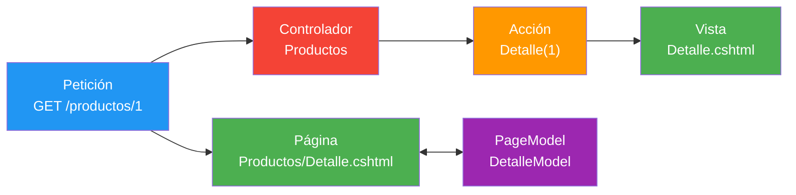
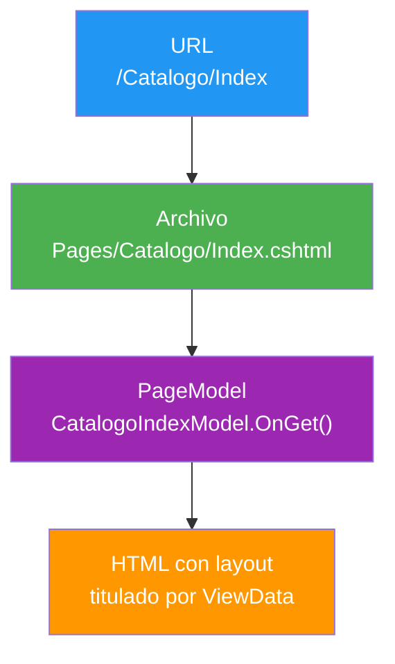
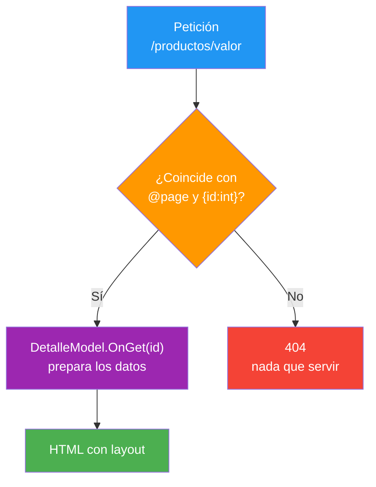
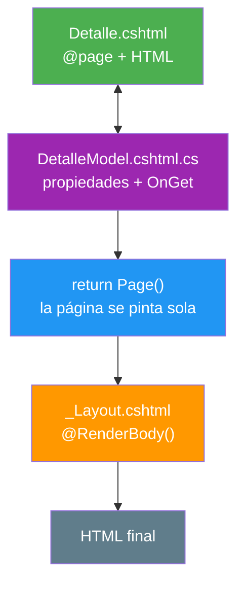

- [10. Razor Pages: Fundamentos](#10-razor-pages-fundamentos)
  - [10.1. La Web Página a Página](#101-la-web-página-a-página)
    - [10.1.1. De Acciones a Páginas](#1011-de-acciones-a-páginas)
    - [10.1.2. El Mismo Motor Razor](#1012-el-mismo-motor-razor)
  - [10.2. La Carpeta Pages: La URL Está en el Disco](#102-la-carpeta-pages-la-url-está-en-el-disco)
    - [10.2.1. El Mapa de Carpetas](#1021-el-mapa-de-carpetas)
    - [10.2.2. El Mapa en el Navegador](#1022-el-mapa-en-el-navegador)
  - [10.3. Program.cs: Dos Líneas para Arrancar](#103-programcs-dos-líneas-para-arrancar)
  - [10.4. La Directiva @page](#104-la-directiva-page)
    - [10.4.1. Primera Línea, Obligatoria](#1041-primera-línea-obligatoria)
    - [10.4.2. Ruta Personalizada y Restricciones](#1042-ruta-personalizada-y-restricciones)
  - [10.5. El Binomio: Página y PageModel](#105-el-binomio-página-y-pagemodel)
    - [10.5.1. La Vista de la Página](#1051-la-vista-de-la-página)
    - [10.5.2. El PageModel](#1052-el-pagemodel)
    - [10.5.3. El Namespace de las Páginas](#1053-el-namespace-de-las-páginas)
  - [10.6. Enlazar Páginas con asp-page](#106-enlazar-páginas-con-asp-page)
  - [10.7. Buenas Prácticas](#107-buenas-prácticas)
  - [10.8. Reto: La Tienda de Funkos Página a Página](#108-reto-la-tienda-de-funkos-página-a-página)
    - [10.8.1. Contexto](#1081-contexto)
    - [10.8.2. Modelo de datos](#1082-modelo-de-datos)
    - [10.8.3. Almacenamiento](#1083-almacenamiento)
    - [10.8.4. Retos](#1084-retos)


# 10. Razor Pages: Fundamentos

> 💡 **Punto de partida:** Cuando abres el portal de trámites de cualquier administración, cada dirección es una página completa: su formulario, su lógica y sus resultados, sin intermediarios ni mapa de controladores. Razor Pages monta tus proyectos exactamente así: cada URL con su propio archivo y su PageModel pegado al lado. En este punto aprendes esa visión: la directiva `@page`, la geografía de carpetas y el binomio vista y PageModel.

En este punto aprendemos el otro gran enfoque de ASP.NET Core: la **orientación a páginas**. Veremos dónde viven las páginas, cómo la carpeta se convierte en URL, qué hace que un `.cshtml` sea una página de verdad y qué papel juega su `PageModel`.

**Objetivos de aprendizaje:**

- Diferenciar el enfoque por páginas del enfoque por acciones de MVC
- Mapear carpetas y URLs: crear una página que responda a una ruta concreta
- Usar la directiva `@page`: obligatoria, ruta personalizada y restricciones de tipo
- Montar el binomio `.cshtml` + `.cshtml.cs` y entender el papel del `PageModel`
- Completar las dos líneas de `Program.cs` y enlazar páginas con `asp-page`
- Reconocer los tres tropiezos típicos: sin `@page` da 404, el namespace mal escrito da CS0234 y la ruta sin restricción pinta datos inventados

> 📝 **Nota:** el proyecto de este punto es `ProductosApp`, creado con `dotnet new webapp`. Todas las páginas que verás están en su carpeta `Pages/Productos/`.

## 10.1. La Web Página a Página

### 10.1.1. De Acciones a Páginas

En MVC, que es lo que hemos montado en los puntos 07, 08 y 09, la petición mira a una acción: hay ruta, hay controlador, hay método y al final alguien decide qué vista se entrega. En Razor Pages la petición mira a un archivo: el que coincida con la URL, ni más ni menos.

`@page` convierte el archivo en un endpoint: atiende peticiones directamente, sin pasar por ningún controlador, y debe ser la primera directiva Razor del archivo.

| | MVC (puntos 07 a 09) | Razor Pages |
|---|---|---|
| **Quién atiende** | Controlador + acción | La propia página |
| **Dónde vive la lógica** | Acciones del controlador | `PageModel` pegado a la vista |
| **Quién elige el HTML** | El controlador con `return View(...)` | La página: `return Page()` devuelve la suya |
| **Cómo se enlaza** | `asp-action` | `asp-page` |



> 💡 **Analogía:** MVC es un restaurante con camarero: pides, el camarero (controlador) va a cocina, decide qué te trae y vuelve. Razor Pages es showcooking: te sientas delante de la barra y el cocinero (el `PageModel`) te prepara el plato en la misma mesa donde lo consumes.

La propia Microsoft recomienda Razor Pages para el desarrollo nuevo por encima de MVC con controladores y vistas. MVC no se queda obsoleto (lo veremos en el punto 12): sigue siendo el rey cuando necesitas que un mismo controlador sirva vistas y JSON a la vez.

📌 **Ejemplo real:** ASP.NET Core Identity, el sistema de login y registro de .NET, está construido con Razor Pages: sus páginas de registro y acceso viven en `Areas/Identity/Pages/Account/Register` y `.../Login` y atienden sus URLs sin un solo controlador. En el 18 lo montarás.

### 10.1.2. El Mismo Motor Razor

Buena noticia: el lenguaje de las páginas es exactamente el mismo que estudiaste en los puntos 01 al 06. Los delimitadores `@`, los bloques `@{ }`, las estructuras `@if` y `@foreach`, las directivas `@model` y `@using`, los layouts y los Tag Helpers funcionan idéntico. Lo que cambia es la organización.

| Lo que ya sabes | Situación en Razor Pages |
|-----------------|--------------------------|
| Sintaxis `@` y bloques `@{ }` | Igual, sin cambios |
| `@model` | Apunta al tipo del `PageModel` |
| `_ViewStart.cshtml` | Vive en `Pages/` |
| `_Layout.cshtml` | Vive en `Pages/Shared/` |
| Tag Helpers del 06 | `asp-action` se sustituye por `asp-page` |

> 📝 **Nota:** la plantilla mantiene el mismo contrato que en MVC: `Pages/_ViewStart.cshtml` solo contiene `Layout = "_Layout";` y `_Layout.cshtml` sigue con `@RenderBody()` y `@ViewData["Title"]`. El punto 05 se aplica tal cual, en otra casa.

## 10.2. La Carpeta Pages: La URL Está en el Disco

### 10.2.1. El Mapa de Carpetas

La regla que sostiene todo el enfoque es geográfica: **la URL es la ruta del archivo dentro de `Pages/`**. Un archivo en `Pages/Servicios/Listado.cshtml` responde en `/Servicios/Listado`: la carpeta dicta la URL.

📌 **Ejemplo real:** La plantilla oficial *ASP.NET Core Web App (Razor Pages)*, la que crea `dotnet new webapp`, monta exactamente el árbol de abajo.

Esto es lo que creó la plantilla en nuestro proyecto de verificación, con la URL que responde cada archivo:

```text
ProductosApp/
├── Program.cs                      ← AddRazorPages + MapRazorPages
└── Pages/
    ├── _ViewImports.cshtml
    ├── _ViewStart.cshtml           ← Layout = "_Layout"
    ├── Index.cshtml                → /
    ├── Index.cshtml.cs
    ├── Privacy.cshtml              → /Privacy
    ├── Error.cshtml                → /Error
    ├── Shared/
    │   ├── _Layout.cshtml
    │   └── _ValidationScriptsPartial.cshtml
    ├── Catalogo/
    │   └── Index.cshtml            → /Catalogo y /Catalogo/Index
    └── Productos/
        ├── Detalle.cshtml          → /productos/1  (ruta en @page)
        └── Oferta.cshtml           → /ofertas/7    (ruta en @page)
```

> 💡 **Analogía:** piensa en el servidor como un callejero. La carpeta es la calle, el archivo es la casa y la URL es la dirección completa. Si un vecino busca `/Catalogo/Index`, el cartero recorre `Pages/Catalogo/Index.cshtml` y toca esa puerta.



### 10.2.2. El Mapa en el Navegador

El mapa anterior no es una teoría: son los códigos reales que devolvió la app:

| Petición | Código | Qué se sirvió |
|----------|:------:|---------------|
| `GET /` | **200** | `Pages/Index.cshtml`, pestaña `Home page - ProductosApp` |
| `GET /Privacy` | **200** | `Pages/Privacy.cshtml`, pestaña `Privacy Policy - ProductosApp` |
| `GET /NoExiste` | **404** | No hay archivo en esa dirección |
| `GET /Error` | **200** | `Pages/Error.cshtml`, la página de errores |
| `GET /Catalogo` | **200** | `Pages/Catalogo/Index.cshtml`, h1 `Productos en Pages` |
| `GET /Catalogo/Index` | **200** | El mismo h1: la carpeta con `Index` responde por las dos rutas |

La carpeta no es decorativa: es el mapa — si mueves el archivo, mueve la URL. Renombramos `Pages/Privacy.cshtml` y `/Privacy` pasó a devolver **404** mientras `/` seguía en **200**; la aplicación no avisa, simplemente deja de encontrar la casa.

## 10.3. Program.cs: Dos Líneas para Arrancar

Razor Pages no funciona por arte de magia: hay que registrar sus servicios y publicar su mapa de rutas. La plantilla ya lo trae hecho:

```csharp
var builder = WebApplication.CreateBuilder(args);

// Servicios de Razor Pages
builder.Services.AddRazorPages();

var app = builder.Build();

// ... middlewares ...

// Publica el mapa de rutas de las páginas
app.MapRazorPages()
   .WithStaticAssets();

app.Run();
```

`AddRazorPages()` registra en la inyección de dependencias todo lo que las páginas necesitan (el motor de páginas, las convenciones, los filtros) y `MapRazorPages()` publica los endpoints que convierten cada `Pages/**/*.cshtml` con `@page` en una dirección atendible. La primera da a las páginas sus servicios; la segunda, sus direcciones.

Para no quedarnos en la teoría, las quitamos por separado y anotamos qué pasa:

| Cambio en `Program.cs` | Qué pasa |
|-------------------------|------------------|
| Sin `AddRazorPages()` | La app no arranca: `System.InvalidOperationException: Unable to find the required services... AddAuthorization` |
| Sin `MapRazorPages()` | La app arranca, pero `/`, `/Privacy` y `/productos/1` devuelven **404**; `/css/site.css` sigue en **200** |

> 📝 **Nota:** el proyecto MVC del punto 08 no lleva ninguna de las dos: su `Program.cs` tiene `AddControllersWithViews()` y `MapControllerRoute(...)`. Dos mundos, dos configuraciones; en el punto 12 los conviviremos en la misma app.

> ⚠️ **Advertencia:** los dos síntomas no se parecen: si quitas `AddRazorPages()`, la app se cae al arrancar porque `app.UseAuthorization()` exige servicios que no registró nadie (`InvalidOperationException`); si quitas `MapRazorPages()`, la app levanta y responde, pero sin ninguna página.

## 10.4. La Directiva @page

### 10.4.1. Primera Línea, Obligatoria

Un `.cshtml` dentro de `Pages/` sigue siendo una vista normal hasta que aparece `@page`. La directiva convierte el archivo en un endpoint que atiende peticiones directamente, y debe ir siempre en la primera línea.

```cshtml
@page "/productos/{id:int}"
@model DetalleModel
@{
    ViewData["Title"] = Model.Titulo;
}
<h1 id="titulo">@Model.Titulo</h1>
<p id="ruta">Página servida desde /Pages/Productos/Detalle.cshtml</p>
```

> 💡 **Analogía:** `@page` es el número de puerta de la casa. Sin número, la casa existe, hay gente dentro y la puerta cierra bien, pero el cartero no puede llevarle nada a nadie: no está en el callejero.

Quita la primera línea y observa lo que cambia:

| Estado del archivo | Petición | Código |
|--------------------|----------|:------:|
| Con `@page` | `GET /productos/1` | **200** |
| Con `@page` | `GET /Productos/Detalle` | **404** |
| Sin `@page` | `GET /productos/1` | **404** |
| Sin `@page` | `GET /Productos/Detalle` | **404** |
| Sin `@page` | `GET /` y `GET /Privacy` | **200** |

El archivo compila perfecto y aun así la página no existe — la directiva es lo que la convierte en página. Fíjate en la segunda fila: con `@page` y ruta personalizada, `/Productos/Detalle` ya no responde; la ruta que escribiste en la directiva sustituye a la que dictaría la carpeta.

> ⚠️ **Advertencia:** este fallo no lo verás en `dotnet build`. El compilador está contento con el archivo; el 404 aparece en ejecución. Si una página nueva no responde, mira la primera línea antes que nada.

### 10.4.2. Ruta Personalizada y Restricciones

Con `@page` a secas, la URL sale de la carpeta. Con `@page` y un modelo de ruta, la página se da su propia dirección y puede pedir parámetros con restricciones, igual que en el punto 08 con `[HttpGet("productos/{id:int}")]`:

```cshtml
@page "/productos/{id:int}"
```

El resultado en el navegador:

| Petición | Código | Por qué |
|----------|:------:|---------|
| `GET /productos/1` | **200** | Cumple plantilla y restricción: `OnGet(1)` pinta `Producto 1` |
| `GET /productos/abc` | **404** | `:int` rechaza en el enrutado, antes de tocar el `PageModel` |
| `GET /productos` | **404** | Falta el segmento obligatorio `{id}` |
| `GET /Productos/Detalle` | **404** | La ruta personalizada sustituye a la convencional |



¿Y si quitamos la restricción? Lo probamos con `@page "/productos/{id}"`:

- `GET /productos/abc` → **200** con el h1 `Producto 0` y la pestaña `Producto 0 - ProductosApp`
- `GET /productos/1` → **200** con `Producto 1`
- `GET /productos` → **404** (el segmento sigue siendo obligatorio)

Sin restricción la página no falla: inventa — la conversión de `abc` a `int` falla en silencio, el id llega a 0 y se pinta un producto que nadie creó. Un `404` educado siempre es mejor que un `200` que miente.

> 💡 **Consejo:** restringe siempre los parámetros de ruta (`{id:int}`, `{slug:regex(...)}`). La restricción se resuelve en el enrutado, que es el sitio más barato para descartar peticiones imposibles.

Para parámetros opcionales se usa el signo de interrogación (`@page "{searchString?}"`). En nuestra página de ofertas, `@page "/ofertas/{id:int?}"`:

- `GET /ofertas` → **200** con `Oferta sin id`
- `GET /ofertas/7` → **200** con `Oferta del producto 7`

## 10.5. El Binomio: Página y PageModel

Cada página vive en dos archivos que son dos caras de lo mismo: el `.cshtml` con el HTML y el Razor, y el `.cshtml.cs` con la clase que prepara los datos. Viven juntos en la misma carpeta y se buscan por nombre: `Detalle.cshtml` cuelga de `DetalleModel`.

### 10.5.1. La Vista de la Página

La vista es el archivo completo que viste en el apartado 10.4.1. Línea a línea:

```cshtml
@page "/productos/{id:int}"
@model DetalleModel
@{
    ViewData["Title"] = Model.Titulo;
}
<h1 id="titulo">@Model.Titulo</h1>
<p id="ruta">Página servida desde /Pages/Productos/Detalle.cshtml</p>
```

- La primera línea la convierte en endpoint con su ruta
- `@model DetalleModel` apunta al tipo de su `.cshtml.cs`, sin namespace completo gracias a `@namespace` (en el apartado 10.5.3)
- `ViewData["Title"]` sigue siendo la forma de titular la pestaña en el `_Layout` del 05
- El HTML no lleva `<html>` ni `<body>`: ya se los pone el layout

### 10.5.2. El PageModel

El `.cshtml.cs` es una clase que hereda de `PageModel`:

```csharp
using Microsoft.AspNetCore.Mvc;
using Microsoft.AspNetCore.Mvc.RazorPages;

namespace ProductosApp.Pages.Productos;

/// <summary>
/// Página con ruta personalizada y restricción de tipo.
/// </summary>
public class DetalleModel : PageModel
{
    /// <summary>Identificador recibido de la ruta.</summary>
    public int Id { get; set; }

    /// <summary>Título calculado en el handler.</summary>
    public string Titulo { get; set; } = string.Empty;

    /// <summary>Handler de lectura: se ejecuta en cada GET.</summary>
    public void OnGet(int id)
    {
        Id = id;
        Titulo = $"Producto {id}";
    }
}
```

Tres piezas: las propiedades, que son lo que la vista lee; el handler `OnGet`, que se ejecuta en cada petición GET y prepara esos valores; y `Page()`, el resultado que la página devuelve cuando ya está listo. El `PageModel` es en la práctica el controlador y el ViewModel del 09 fundidos en uno, pero solo de esta página.

Si abres `GET /productos/1`, verás **200**, el h1 `Producto 1` y la pestaña `Producto 1 - ProductosApp`: el handler recibió `1`, calculó el título y la vista lo pintó dentro del layout.



> 📝 **Nota:** en MVC el controlador hacía `return View(viewmodel)` y la vista podía ser cualquiera; aquí el binomio es fijo y `Page()` devuelve siempre la propia página. El resto de handlers (`OnPost`), las propiedades con `[BindProperty]` y los handlers con nombre los abrimos en el punto 11.

### 10.5.3. El Namespace de las Páginas

En el punto 09 el nombre corto lo resolvía un `@using` en `Views/_ViewImports.cshtml` (`@using ProductosApp.ViewModels`); en Razor Pages la plantilla añade una directiva que el de MVC no trae y que va en `Pages/_ViewImports.cshtml`:

```cshtml
@using ProductosApp
@namespace ProductosApp.Pages
@addTagHelper *, Microsoft.AspNetCore.Mvc.TagHelpers
```

`@namespace ProductosApp.Pages` fija el espacio de nombres con el que el generador de Razor construye las clases de esta carpeta, y por eso `@model DetalleModel` resuelve sin escribir el namespace entero. Si quitas la línea, la compilación se cancela con **CS0246** en las páginas, con mensajes como `'OfertaModel' no se encontró`: el nombre corto de `@model` deja de resolver.

El otro nombre fácil de escribir mal es el `using` del propio `PageModel`. El namespace correcto es `Microsoft.AspNetCore.Mvc.RazorPages` (una sola palabra). Si escribes `Microsoft.AspNetCore.Mvc.Razor.Pages`, `dotnet build` se queja con dos errores:

```text
error CS0234: El tipo o el nombre del espacio de nombres 'Pages' no existe en el
espacio de nombres 'Microsoft.AspNetCore.Mvc.Razor'
error CS0246: El nombre del tipo o del espacio de nombres 'PageModel' no se
encontró (¿falta alguna directiva using o una referencia de ensamblado?)
```

> 🔧 **Truco:** si tu editor subraya `PageModel`, casi siempre es una de dos: el `using` mal escrito (CS0234) o que la clase no hereda de `PageModel`. El primer error apunta al namespace; el segundo, a la firma. Y si quien se queja es el `@model` de una vista (también CS0246), revisa el `@namespace` del `_ViewImports`.

## 10.6. Enlazar Páginas con asp-page

Ningún enlace de la app escribe URLs a mano: los Tag Helpers del 06 traducen la intención en dirección. En Razor Pages, el traductor es `asp-page`:

```cshtml
<a id="enlace-ficha" asp-page="/Productos/Detalle" asp-route-id="1">Ver ficha de producto</a>
```

El HTML que recibe el navegador es `<a id="enlace-ficha" href="/productos/1">Ver ficha de producto</a>`, y en toda la página renderizada no queda ni un atributo `asp-page` sin resolver: el Tag Helper trabajó en el servidor. El pie del layout hace lo propio con `asp-page="/Privacy"`, que sale como `href="/Privacy"`.

| Necesitas | MVC | Razor Pages |
|-----------|-----|-------------|
| Ir a una acción o página | `asp-action` + `asp-controller` | `asp-page` |
| Pasar un parámetro | `asp-route-id="@item.Id"` | `asp-route-id="@item.Id"` |
| Ir a un handler con nombre | No existe | `asp-page-handler` (en el punto 11) |

> 💡 **Consejo:** la ruta de `asp-page` es relativa a `Pages/` y empieza siempre por barra: `asp-page="/Productos/Detalle"` busca el archivo `Pages/Productos/Detalle.cshtml`. Si te comes la barra inicial, la ruta se interpreta desde la página donde estás y el enlace no apunta a donde crees.

📌 **Ejemplo real:** el pie de cualquier web corporativa con enlaces limpios a `/Contacto` o `/Aviso-legal` es la misma idea: la barra de enlaces apunta a páginas, no a acciones, y quien la mantiene mueve archivos sin reescribir el HTML.

## 10.7. Buenas Prácticas

- **Una funcionalidad, una carpeta**: agrupa en `Pages/Productos/`, `Pages/Cuentas/`, no repartas por capas como en MVC
- **`@page` siempre primera**: es la primera directiva del archivo, sin excepciones
- **Restringe todos los parámetros**: `{id:int}` y compañía; sin restricción, la página inventa datos con **200**
- **El `PageModel` prepara, no decide**: la lógica de negocio se va a servicios, como en el punto 07; la página solo orquesta su vista
- **Un handler por verbo**: `OnGet` para lectura, `OnPost` para envío; no conviertas la página en un controlador multificha
- **`_ViewImports` completo**: `@using`, `@namespace` y `@addTagHelper` para escribir corto en todas las páginas
- **Enlaces con `asp-page`**: nunca URLs escritas a mano en el HTML
- **Cuida la geografía al renombrar**: mover un `.cshtml` cambia su URL; si la vieja la usan enlaces, se rompen en silencio

## 10.8. Reto: La Tienda de Funkos Página a Página

> Monta la tienda página a página — y dibuja antes en papel el mapa de carpetas.

### 10.8.1. Contexto

**Paso 0:** crea el proyecto Razor Pages de la tienda:

```bash
dotnet new webapp -n FunkosWeb
```

La plantilla ya trae `Pages/Index.cshtml`, `Pages/Privacy.cshtml`, `_ViewStart`, `_Layout` y las dos líneas de `Program.cs`. Si vienes de los retos anteriores, reutiliza `Models/Funko.cs` y `Repositories/RepositorioFunkos.cs`; si no, créalos con las tablas de los apartados siguientes.

### 10.8.2. Modelo de datos

| Propiedad | Tipo | Obligatorio |
|-----------|------|:-----------:|
| `id` | int | Sí (autogenerado) |
| `nombre` | string | Sí |
| `categoria` | string | Sí |
| `anio` | int | Sí |
| `precioReferencia` | decimal | Sí |
| `imagen` | string? | No |
| `etiquetas` | List\<string\>? | No |
| `activo` | bool | Sí |
| `esNovedad` | bool | Sí |

### 10.8.3. Almacenamiento

```csharp
public static class RepositorioFunkos
{
    private static readonly List<Funko> Funkos = [ /* seis figuras */ ];

    public static IReadOnlyList<Funko> ObtenerTodos() => Funkos;
}
```

Rellena la lista con seis figuras para que haya activas y dadas de baja, novedades y no novedades, y las tres categorías.

### 10.8.4. Retos

1. **En papel primero:** dibuja el árbol `Pages/` que va a tener tu tienda (inicio, listado, detalle, ofertas) y anota al lado de cada archivo su URL; separa los que llevarán `@page` simple de los que llevarán ruta personalizada
2. Crea `Pages/Productos/Index.cshtml` con `@page` a secas y su `PageModel`; abre `/Productos/Index` y comprueba **200**; abre también `/Productos` y anota qué responde
3. Crea `Pages/Productos/Detalle.cshtml` con `@page "/productos/{id:int}"` y un `OnGet(int id)` que muestre el nombre del funko; abre `/productos/1` y comprueba **200** con el nombre; repite con `/productos/abc`, `/productos` y `/Productos/Detalle` y comprueba **404** en los tres
4. **Experimento de invisibilidad:** borra la línea `@page`, comprueba que `dotnet build` sigue en **0 errores** y abre `/productos/1`: ahora da **404**; devuélvela y confirma el **200**
5. **Experimento de invención:** cambia a `@page "/productos/{id}"`, abre `/productos/abc` y lee lo que pinta la página; devuelve `:int` y comprueba que vuelve el **404**
6. Crea `Pages/Productos/Oferta.cshtml` con `@page "/ofertas/{id:int?}"`; abre `/ofertas` y `/ofertas/7` y comprueba que los dos dan **200** con títulos distintos
7. Enlaza desde tu inicio con `<a asp-page="/Productos/Detalle" asp-route-id="1">` y verifica con **F12** que el `href` renderizado es `/productos/1`
8. **Geografía:** comprueba que existen `Pages/_ViewStart.cshtml` y `Pages/Shared/_Layout.cshtml`, y que tu página nueva hereda el layout mirando el `<title>` del resultado
9. **Namespace roto:** cambia en el `PageModel` el `using Microsoft.AspNetCore.Mvc.RazorPages` por `Microsoft.AspNetCore.Mvc.Razor.Pages`, lee los errores **CS0234** y **CS0246**, y devuélvelo

**Puntos extra:**

- Añade `:min(1)` a la restricción (`{id:int:min(1)}`) y abre `/productos/0` para ver qué responde
- Renombra `Detalle.cshtml` a `Ficha.cshtml` (deja copia), anota qué URLs dan 404 y cuál empieza a responder
- Compara en **F12** el HTML de `/productos/1` con el de la acción `Detalle` del proyecto MVC del 08: título, encabezado y estructura, con dos arquitecturas distintas por detrás
- Crea `Pages/Sobre.cshtml` con `@page "/sobre"` y comprueba que la ruta literal no sigue el mapa de carpetas
- Comenta en `Program.cs` la línea `app.MapRazorPages()`, arranca de nuevo y comprueba: la app responde, pero todas las páginas dan **404** (`/css/site.css` en **200**); devuélvela y, después, comenta `builder.Services.AddRazorPages()` y observa que ya no arranca, con `System.InvalidOperationException`
- Quita la línea `@namespace` de `Pages/_ViewImports.cshtml`, lee el **CS0246** que devuelve `dotnet build` y devuélvela

---

**Resumen del punto:**

| Concepto | Descripción |
|----------|-------------|
| **Razor Pages** | Enfoque por páginas: cada URL su archivo con su `PageModel` |
| **Carpeta `Pages/`** | Geografía: la URL es la ruta del archivo dentro de `Pages/` |
| **`@page`** | Primera directiva; sin ella el archivo compila pero da **404** |
| **Ruta personalizada** | `@page "/productos/{id:int}"` sustituye a la ruta convencional |
| **Restricciones** | `{id:int}` descarta en el enrutado; sin ella, **200** con datos inventados |
| **Parámetro opcional** | `{id:int?}` admite la URL sin ese segmento |
| **`PageModel`** | Clase `.cshtml.cs` que hereda de `PageModel` y prepara los datos |
| **Handler `OnGet`** | Se ejecuta en cada GET; `OnPost` y los handlers con nombre, en el punto 11 |
| **`@namespace`** | En `_ViewImports`; permite `@model` corto en todas las páginas |
| **Dos líneas en `Program.cs`** | `AddRazorPages()` registra servicios (sin ella, no arranca) y `MapRazorPages()` publica rutas (sin ella, **404**) |
| **`asp-page`** | Tag Helper de enlaces; el equivalente a `asp-action` |
| **Mismo motor** | Razor, layouts y Tag Helpers de los puntos 01-06 siguen igual |
| **Error de namespace** | `Razor.Pages` en vez de `RazorPages` da **CS0234** y **CS0246** |
| **En el navegador** | `/productos/1` **200**, sin `@page` **404**, `/ofertas` **200** |

**¿Qué viene después?**

En el siguiente punto abrimos el `PageModel` por dentro: handlers `OnGet` y `OnPost`, propiedades con `[BindProperty]`, el ciclo de vida completo de un envío de formulario y cómo decide la página qué responder.
