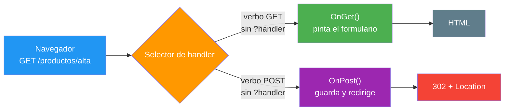
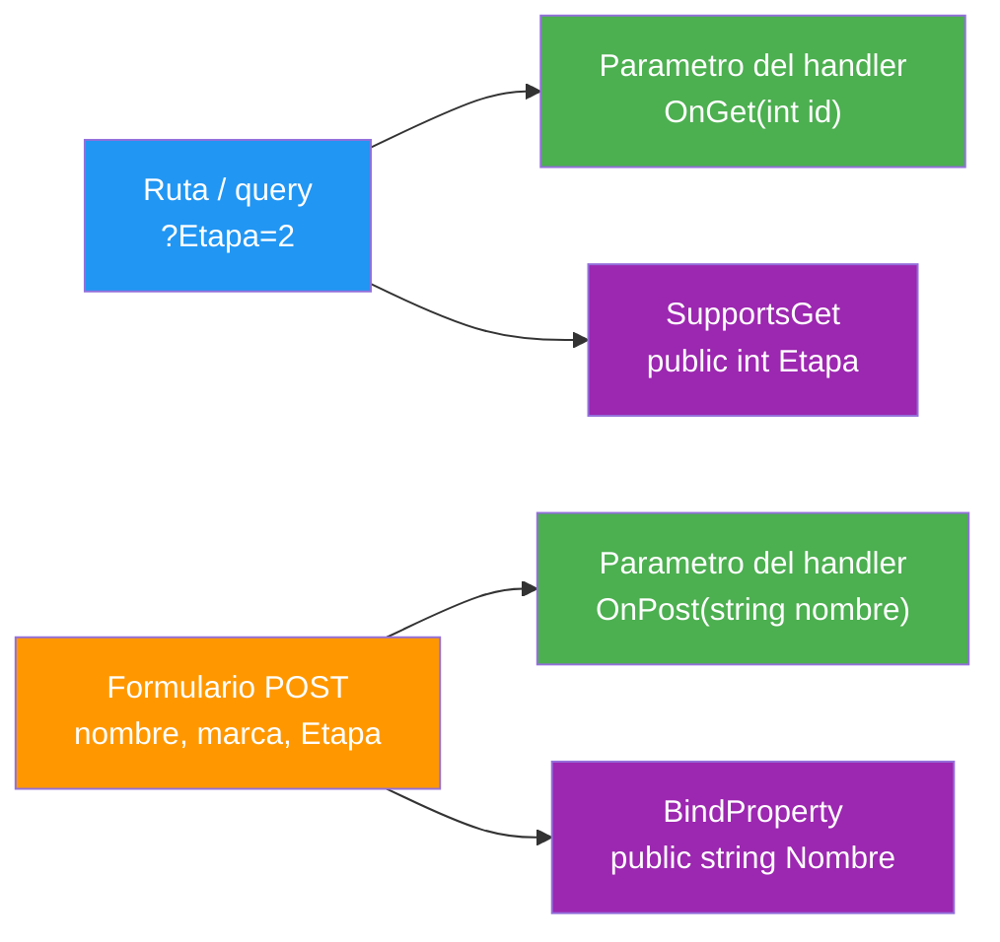
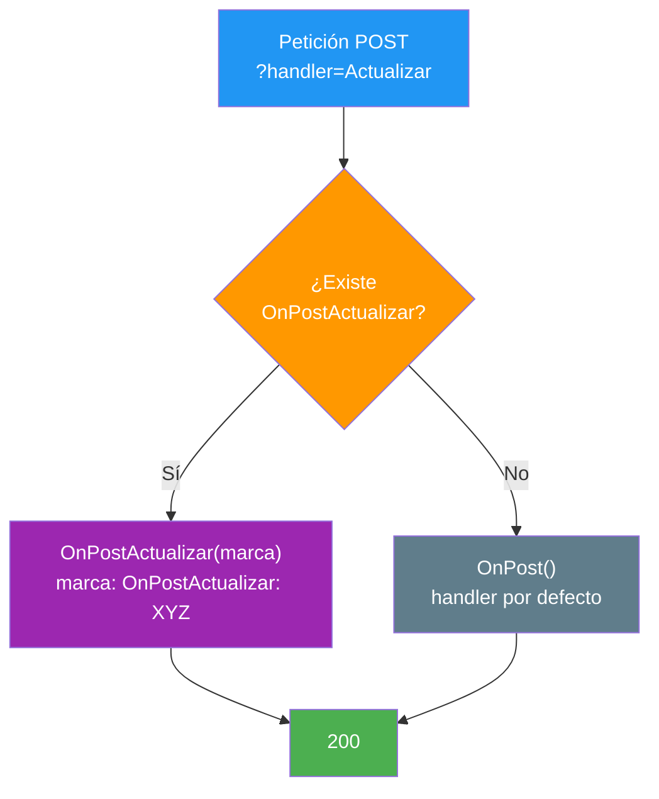

- [11. Razor Pages: PageModel y Handlers](#11-razor-pages-pagemodel-y-handlers)
  - [11.1. Qué es un Handler](#111-qué-es-un-handler)
    - [11.1.1. La Convención de Nombres](#1111-la-convención-de-nombres)
    - [11.1.2. El Ciclo de una Petición](#1112-el-ciclo-de-una-petición)
  - [11.2. Recibir Datos en el PageModel](#112-recibir-datos-en-el-pagemodel)
    - [11.2.1. Parámetros del Handler](#1121-parámetros-del-handler)
    - [11.2.2. Propiedades con BindProperty](#1122-propiedades-con-bindproperty)
  - [11.3. Responder: los Resultados de Página](#113-responder-los-resultados-de-página)
  - [11.4. Varios Handlers en la Misma Página](#114-varios-handlers-en-la-misma-página)
  - [11.5. Async y el Antiforgery de los POST](#115-async-y-el-antiforgery-de-los-post)
  - [11.6. Buenas Prácticas](#116-buenas-prácticas)
  - [11.7. Reto: Alta de Funkos con Handlers](#117-reto-alta-de-funkos-con-handlers)
    - [11.7.1. Contexto](#1171-contexto)
    - [11.7.2. Modelo de datos](#1172-modelo-de-datos)
    - [11.7.3. Almacenamiento](#1173-almacenamiento)
    - [11.7.4. Retos](#1174-retos)


# 11. Razor Pages: PageModel y Handlers

> 💡 **Punto de partida:** Tu primera página ya sabe atender un GET con `OnGet` y pintar los datos que trae la ruta. Pero una web de verdad no solo lee: recibe lo que escribe el usuario, guarda, redirige, ordena y a veces ni siquiera sabe qué le están pidiendo. Abre el PageModel por dentro: esto son los handlers.

En este punto aprendemos la mitad que faltaba del binomio: cómo el motor elige qué método se ejecuta, de dónde salen los datos que ese método recibe y con qué resultados puede responder la página.

**Objetivos de aprendizaje:**

- Explicar qué es un handler y cómo lo invoca el motor según la convención de nombres
- Recibir datos como parámetros del handler y como propiedades con `[BindProperty]`
- Devolver los resultados de página: `Page()`, `RedirectToPage()`, `NotFound()` y `BadRequest()`
- Organizar varios handlers con nombre en una misma página y enlazarlos con `asp-page-handler`
- Explicar el patrón PRG y por qué un POST sin token antiforgery responde **400**
- Reconocer los dos tropiezos típicos: `RedirectToPage("/")` da **500** y un handler con nombre inexistente cae en el por defecto

> 📝 **Nota:** seguimos en el proyecto Razor Pages del punto anterior; las páginas nuevas de este punto están en `Pages/Productos/`.

## 11.1. Qué es un Handler

Un handler es un método del `PageModel` que el motor invoca solo — tú nunca llamas a `OnGet`, el motor lo decide por el verbo de la petición. Los handlers más comunes son `OnGet`, que inicializa lo que la página necesita, y `OnPost`, que procesa los envíos; puedes añadir handlers para cualquier verbo HTTP, y el sufijo `Async` es opcional, por convención.

Nuestro alta de ejemplo tiene los dos:

```cshtml
@* Pages/Productos/Alta.cshtml *@
<form method="post">
    <label for="nombre">Nombre</label>
    <input id="nombre" name="nombre" type="text" />
    <button type="submit">Guardar</button>
</form>
```

```csharp
// Pages/Productos/Alta.cshtml.cs
public class AltaModel : PageModel
{
    private static readonly List<string> Nombres = [];

    public int Guardados => Nombres.Count;
    public string Mensaje { get; set; } = string.Empty;

    // GET: pinta el formulario
    public void OnGet()
    {
    }

    // POST: guarda y redirige
    public IActionResult OnPost(string nombre)
    {
        if (string.IsNullOrWhiteSpace(nombre))
        {
            Mensaje = "El nombre es obligatorio";
            return Page();
        }

        Nombres.Add(nombre);
        return RedirectToPage();
    }
}
```

📌 **Ejemplo real:** Los formularios de contacto de cualquier web corporativa siguen este mismo esquema: el GET pinta el formulario, el POST procesa los campos y redirige a una página de agradecimiento para que nadie reenvíe el envío.

### 11.1.1. La Convención de Nombres

El nombre del método no es decorativo: es la dirección por la que el motor lo encuentra.

| Método | Cuándo lo invoca el motor |
|--------|---------------------------|
| `OnGet()` | Cada GET a la página |
| `OnPost()` | Cada POST sin handler con nombre |
| `OnPostAsync()` | Igual que `OnPost`; el sufijo solo marca asíncrono |
| `OnGetOrdenar()` | GET con `?handler=Ordenar` |
| `OnPostActualizar()` | POST con `?handler=Actualizar` |

> 📝 **Nota:** los handlers con nombre son el texto que queda tras el `On<Verbo>` y antes del `Async`. Si llamas al método `OnPostActualizar`, el nombre del handler es `Actualizar` y la URL que lo invoca es `?handler=Actualizar`. El Tag Helper `asp-page-handler` pide ese nombre sin prefijo ni sufijo: `asp-page-handler="Actualizar"`.

### 11.1.2. El Ciclo de una Petición



El selector mira dos cosas: el verbo HTTP de la petición y el valor de `handler`, si la query lo trae. Con eso decide cuál de los métodos de tu PageModel se ejecuta y qué resultado devuelve la página.

## 11.2. Recibir Datos en el PageModel

Hay dos caminos para que un dato llegue al handler, y conviene saber cuál usa cada cosa.

### 11.2.1. Parámetros del Handler

Si el método declara parámetros, el motor rellena cada uno con un valor coincidente de la ruta, la query o el formulario. Ya lo viste en el punto 10 con `OnGet(int id)`; en escritura funciona igual: `OnPost(string nombre)` recibió el campo `nombre` del formulario y `OnPostActualizar(string marca)` recibió el campo `marca`.

Prueba el alta en el navegador: envía dos POST, uno con `nombre=Teclado` y otro con `nombre=Raton`. Cada uno redirige con **302** y la página siguiente muestra el contador en 2. Si en el listado envías `marca=XYZ` con `?handler=Actualizar`, verás pintar `OnPostActualizar: XYZ`.

> 💡 **Nota:** es la misma mecánica que las acciones de un controlador del 08: el model binding, la validación y los action results funcionan igual en controladores y en Razor Pages; lo que cambia es dónde vive el método.

### 11.2.2. Propiedades con BindProperty

Los parámetros van bien para datos sueltos; cuando el formulario trae varios campos que van juntos, se declaran como propiedades con `[BindProperty]`. Y aquí aparece la primera trampa del punto: sin el atributo, la propiedad no se rellena, aunque el formulario envíe un campo con su nombre.

```csharp
// Pages/Productos/Eco.cshtml.cs (extracto)
public class EcoModel : PageModel
{
    // Llega del formulario en POST
    [BindProperty]
    public string Nombre { get; set; } = "(vacio)";

    // Sin atributo: nunca se rellena sola
    public string SinBind { get; set; } = "(no llega)";

    // Llega como parámetro del handler
    public string Comentario { get; set; } = "(sin comentario)";

    // Llega de la query en GET y del formulario en POST
    [BindProperty(SupportsGet = true)]
    public string Etapa { get; set; } = "sin etapa";

    public async Task OnPostAsync(string comentario)
    {
        await Task.Yield();
        Comentario = comentario;
    }
}
```

La página pinta las cuatro propiedades en un `<dl>` y trae un formulario con un campo por cada una. Esto es lo que pasa en cada caso:

| Dato | Cómo se declara | GET `?Nombre=Ana&Etapa=2` | POST con los cuatro campos |
|------|-----------------|:-------------------------:|:--------------------------:|
| `Nombre` | `[BindProperty]` | `(vacio)` | `Ana` |
| `SinBind` | sin atributo | `(no llega)` | `(no llega)` |
| `comentario` | parámetro de `OnPostAsync` | (no se pinta) | `hola` |
| `Etapa` | `[BindProperty(SupportsGet = true)]` | `2` | `3` |

Dos reglas que salen de la tabla: `[BindProperty]` rellena del formulario en POST; `SupportsGet = true` añade la query de GET, y sin él la query no llega. El campo `SinBind=deberia-llegar` viajó en el formulario y la propiedad siguió en su valor por defecto: si no declaras el enlace, no hay enlace.



📌 **Ejemplo real:** Cuando subes la foto de perfil en cualquier red social, el formulario viaja con `enctype="multipart/form-data"` y el servidor recibe un `IFormFile`: ese enlace de formulario a propiedad es el que veremos a fondo en el 13 y el 14.

## 11.3. Responder: los Resultados de Página

Un handler no pinta HTML: decide qué resultado devuelve, y el motor hace el resto. Los resultados son los mismos de los action results de MVC. En una sola página montamos los cuatro principales:

```csharp
// Pages/Productos/Visita.cshtml.cs (extracto)
public async Task<IActionResult> OnGetAsync(string accion)
{
    await Task.Yield();

    return accion switch
    {
        "ok" => Page(),
        "fuera" => NotFound(),
        "malo" => BadRequest(),
        "casa" => RedirectToPage("/Index"),
        _ => Page()
    };
}
```

| Petición | Resultado devuelto | Código |
|----------|--------------------|:-------------:|
| `?accion=ok` | `Page()` | **200** |
| `?accion=fuera` | `NotFound()` | **404** |
| `?accion=malo` | `BadRequest()` | **400** |
| `?accion=casa` | `RedirectToPage("/Index")` | **302** con `Location: /` |

`Page()` devuelve la propia página y es lo que usa el formulario del alta cuando el nombre llega vacío. `RedirectToPage()` redirige a otra página; `NotFound()` y `BadRequest()` devuelven los códigos de error sin pasar por ninguna vista.

El redirigir tras un POST válido no es una opción de estilo: es el patrón PRG (Post/Redirect/Get). El alta lo usa; sigue su recorrido:


Envía dos POST con el token: cada uno devuelve **302** con `Location: /productos/alta` y el GET siguiente muestra el contador en 2, sin ningún mensaje. El dato sobrevivió a la redirección porque vive en el servidor, y el navegador no reenvía el formulario al refrescar.

> ⚠️ **Advertencia:** `RedirectToPage()` usa el nombre de página, no la URL. `RedirectToPage("/Index")` funciona porque `Pages/Index.cshtml` se llama `/Index`; `RedirectToPage("/")` da **500** con `System.InvalidOperationException: No page named '/' matches the supplied values.` La URL de esa página es `/`, pero su nombre es `/Index`: no confundas las dos cosas.

## 11.4. Varios Handlers en la Misma Página

Una página puede montar varias acciones con handlers con nombre, y el enrutado de 11.1.1 se encarga de elegir. El listado de nuestras mediciones tiene cuatro:

```csharp
// Pages/Productos/Listado.cshtml.cs (extracto)
public class ListadoModel : PageModel
{
    public string Marca { get; set; } = "OnGet (sin handler con nombre)";

    public void OnGet()
    {
    }

    public void OnGetOrdenar()
    {
        Marca = "OnGetOrdenar";
        Nombres = [.. Nombres.OrderBy(n => n)];
    }

    public void OnPost()
    {
        Marca = "OnPost (sin handler con nombre)";
    }

    public void OnPostActualizar(string marca)
    {
        Marca = $"OnPostActualizar: {marca}";
    }
}
```

La vista los enlaza con `asp-page-handler`, y el Tag Helper los convierte en URLs:

```cshtml
<a id="enlace-ordenar" asp-page-handler="Ordenar">Ordenar</a>

<form method="post" asp-page-handler="Actualizar">
    <input name="marca" type="text" />
    <button type="submit">Actualizar</button>
</form>
```

En el HTML renderizado, el enlace sale como `href="/productos/listado?handler=Ordenar"` y el formulario como `action="/productos/listado?handler=Actualizar"`, sin ningún atributo `asp-page` sin resolver. En comportamiento, `GET ?handler=Ordenar` pinta `OnGetOrdenar` con la lista ordenada (`Auriculares, Botella, Lampara, Teclado`), y `POST ?handler=Actualizar` con `marca=XYZ` pinta `OnPostActualizar: XYZ`, no el `OnPost` por defecto.

Y el dato que más sorprende: un handler con nombre inexistente no falla. Prueba un POST con `?handler=NoExiste`: la app responde **200** y ejecuta `OnPost (sin handler con nombre)`. El motor cae en el handler por defecto del verbo — y si no llevas marca, ni te enteras de qué pasó. En MVC, en cambio, una acción inexistente responde 404.



> 💡 **Consejo:** durante el desarrollo, pon en cada handler un mensaje identificativo, como hicimos con `Marca`. Cuando pruebes una vista con varios handlers, ver en el HTML cuál se ejecutó te ahorra media hora de depuración.

## 11.5. Async y el Antiforgery de los POST

Dos detalles que completan el cuadro de los handlers.

**El sufijo `Async`.** `OnPostAsync` y `OnGetAsync` se invocan igual que sus versiones síncronas: el sufijo es una convención de nombrado, no una señal para el motor. Prueba a renombrar `OnPost` por `OnPostAsync` (con un `await Task.Yield()` dentro): todo sigue funcionando igual.

**El token antiforgery.** Todo POST de Razor Pages necesita el token antiforgery, y el FormTagHelper lo inyecta solo — aunque el `<form>` no lleve un solo atributo `asp-*`. Lo vimos en el HTML del alta: el formulario sale con un campo oculto `__RequestVerificationToken` cuyo valor empieza por `CfDJ`. Con ese token y su cookie, el POST funciona; sin ellos, no.

| Petición POST al alta | Código |
|-----------------------|:-------------:|
| Sin token (solo `nombre=Teclado`) | **400** |
| Con token del formulario | **302** |

> ⚠️ **Advertencia:** si pruebas los POST con `curl -X POST -d "nombre=X"` sin más, recibirás **400** y pensarás que tu handler está roto. No lo está: le falta el token. Copia el token del campo oculto del formulario y su cookie, o haz la prueba desde el navegador. La validación completa de formularios y seguridad la abrimos en el 15.

## 11.6. Buenas Prácticas

- **Un verbo, un handler**: `OnGet` pinta y `OnPost` procesa; no metas lectura y escritura en el mismo método
- **PRG siempre**: tras un POST válido, guarda y `RedirectToPage()`; devuelve `Page()` solo cuando hay que reenseñar el formulario con errores
- **`[BindProperty]` con cabeza**: propiedades de formulario van con el atributo; sin él, no llega nada, ni siquiera si el campo se llama igual
- **`SupportsGet` solo donde haga falta**: las query strings son volátiles; úsalas para filtros y paginación, no para datos que cambian
- **Nombres de handler estables**: los enlaces de la vista referencian esos literales; renombrarlos rompe los enlaces en silencio
- **Marca tus handlers en desarrollo**: un mensaje por handler te dice cuál se ejecutó sin abrir el depurador
- **`RedirectToPage` con nombre de página**: `/Index`, no `/`; el primero da **302** y el segundo, **500**
- **Cuenta con el 400 antiforgery**: todo POST necesita el token; los tests con `curl` tienen que llevarlo

## 11.7. Reto: Alta de Funkos con Handlers

> Monta el alta de la tienda con sus handlers — y deja escrito en papel qué handler hace qué.

### 11.7.1. Contexto

Reutiliza el proyecto `FunkosWeb` del reto del 10, con sus páginas de listado y detalle. Si todavía no lo tienes, créalo con `dotnet new webapp -n FunkosWeb` y añade `Models/Funko.cs` y `Repositories/RepositorioFunkos.cs` con las tablas siguientes.

### 11.7.2. Modelo de datos

| Propiedad | Tipo | Obligatorio |
|-----------|------|:-----------:|
| `id` | int | Sí (autogenerado) |
| `nombre` | string | Sí |
| `categoria` | string | Sí |
| `anio` | int | Sí |
| `precioReferencia` | decimal | Sí |
| `imagen` | string? | No |
| `etiquetas` | List\<string\>? | No |
| `activo` | bool | Sí |
| `esNovedad` | bool | Sí |

### 11.7.3. Almacenamiento

```csharp
public static class RepositorioFunkos
{
    private static readonly List<Funko> Funkos = [ /* seis figuras */ ];

    public static IReadOnlyList<Funko> ObtenerTodos() => Funkos;
}
```

Para el alta, añade una lista estática de nombres dados de alta en la sesión, como la de nuestro ejemplo.

### 11.7.4. Retos

1. **En papel primero:** dibuja el ciclo de tu vista de alta: qué pinta cada GET, qué procesa cada POST, dónde guarda y a dónde redirige; anota el nombre de cada handler
2. Crea `Pages/Funkos/Alta.cshtml` con `<form method="post">` y un `OnPost(string nombre)` que guarde en la lista y devuelva `RedirectToPage()`; comprueba en el navegador: el contador empieza en 0, el POST sin token → **400**, el POST con el token del formulario → **302** con `Location` y el GET siguiente muestra el contador en 1
3. Comprueba con **F12** que el `<form>` sale con el campo oculto `__RequestVerificationToken` aunque no lleve atributos `asp-*`
4. Añade una propiedad `Comentario` sin `[BindProperty]` y un campo con su nombre en el formulario; tras el POST comprueba que no llega; dale después el atributo y comprueba que sí
5. En el detalle del 10, añade validación de id: `if (id < 1 || id > 6) return NotFound();`; abre `/funkos/1` y comprueba **200**, y `/funkos/99` y comprueba **404**
6. En el listado, crea `OnGetOrdenar()` con un enlace `<a asp-page-handler="Ordenar">`; verifica en **F12** el `href` renderizado (`?handler=Ordenar`) y que la lista sale ordenada
7. Añade `OnPostActualizar(string marca)` con un formulario `asp-page-handler="Actualizar"`; comprueba que el POST lo ejecuta a él y no a `OnPost`
8. Cambia el valor de `asp-page-handler` a `NoExiste` (con **F12**, en el atributo del `<form>`), recarga y envía: la app responde **200** y se ejecuta `OnPost`, el de por defecto
9. Renombra `OnPost` a `OnPostAsync` (con `await Task.Yield()` dentro) y comprueba que todo sigue igual: **200** en lectura y **302** en el alta

**Puntos extra:**

- Cambia `RedirectToPage()` por `RedirectToPage("/")` y lee el `InvalidOperationException: No page named '/'...`; devuélvelo y comprueba el **302** con `/Index`
- Añade `OnGetImprimir()` accesible por `?handler=Imprimir` que pinte el listado en texto plano con `Content(...)`
- Si el nombre del alta llega vacío, devuelve `Page()` con un mensaje, como en el ejemplo del alta; en el 15 lo haremos con validación de verdad

---

**Resumen del punto:**

| Concepto | Descripción |
|----------|-------------|
| **Handler** | Método del `PageModel` que el motor invoca por el verbo de la petición |
| **Convención de nombres** | `OnGet`, `OnPost`, `OnPostAsync`; el nombre concreto va tras el verbo |
| **Parámetros del handler** | Se rellenan de ruta, query o formulario según coincidan por nombre |
| **`[BindProperty]`** | Rellena la propiedad del formulario en POST; sin el atributo, no llega |
| **`SupportsGet = true`** | Permite que la propiedad también se rellene de la query en GET |
| **`Page()`** | Devuelve la propia página; el resultado de los formularios con errores |
| **`RedirectToPage()`** | Redirige usando el nombre de página (`/Index`), no la URL (`/`) |
| **`NotFound()` y `BadRequest()`** | **404** y **400** sin pasar por ninguna vista |
| **PRG** | Post/Redirect/Get: guarda, redirige y evita el reenvío del formulario |
| **`asp-page-handler`** | Convierte el nombre del handler en `?handler=Nombre` en la URL |
| **Fallback del handler** | Un `?handler` inexistente cae en el por defecto del verbo, con **200** |
| **Sufijo `Async`** | Convención de nombrado; el motor invoca igual `OnPostAsync` que `OnPost` |
| **Token antiforgery** | El FormTagHelper lo inyecta solo; sin él, el POST da **400** |
| **En el navegador** | `?handler=Actualizar` ejecuta su handler, `?accion=fuera` da **404** |

**¿Qué viene después?**

En el siguiente punto miramos las dos arquitecturas juntas: cuándo conviene cada una, cómo conviven en la misma aplicación y cómo se migra una vista de MVC a Razor Pages sin romper nada por el camino.
