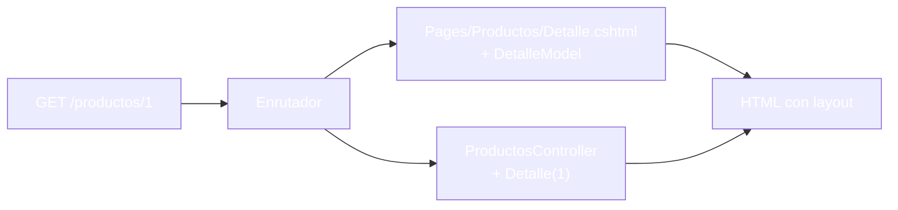
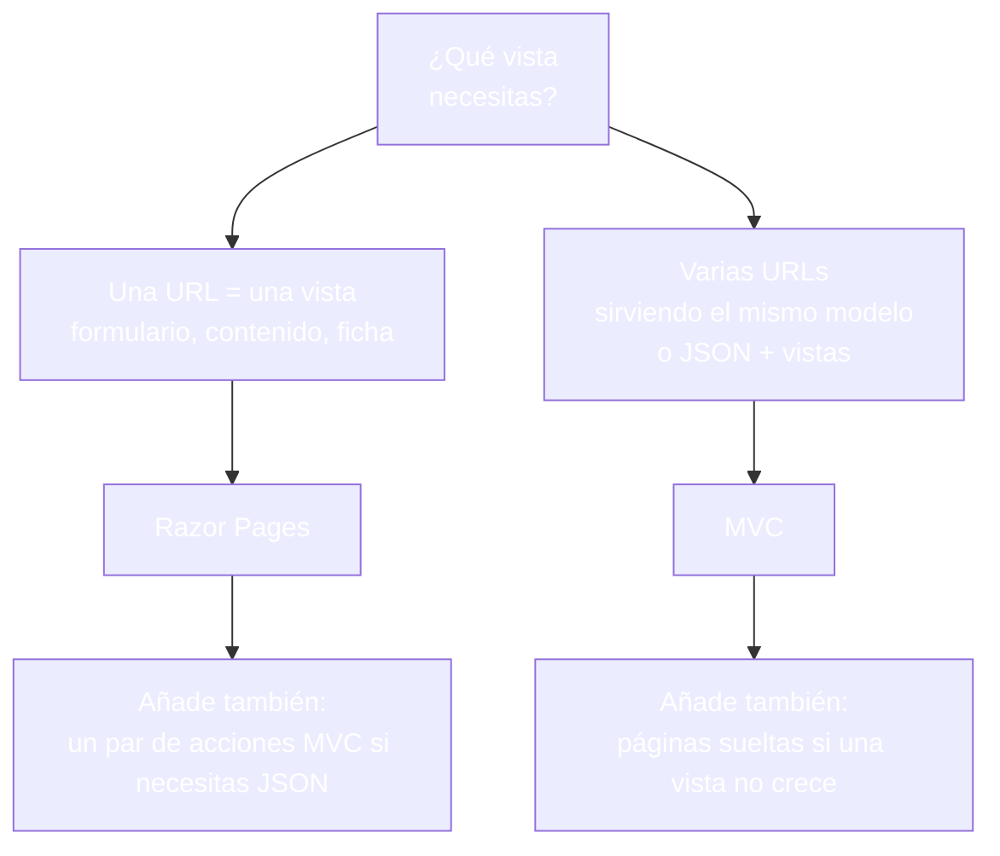
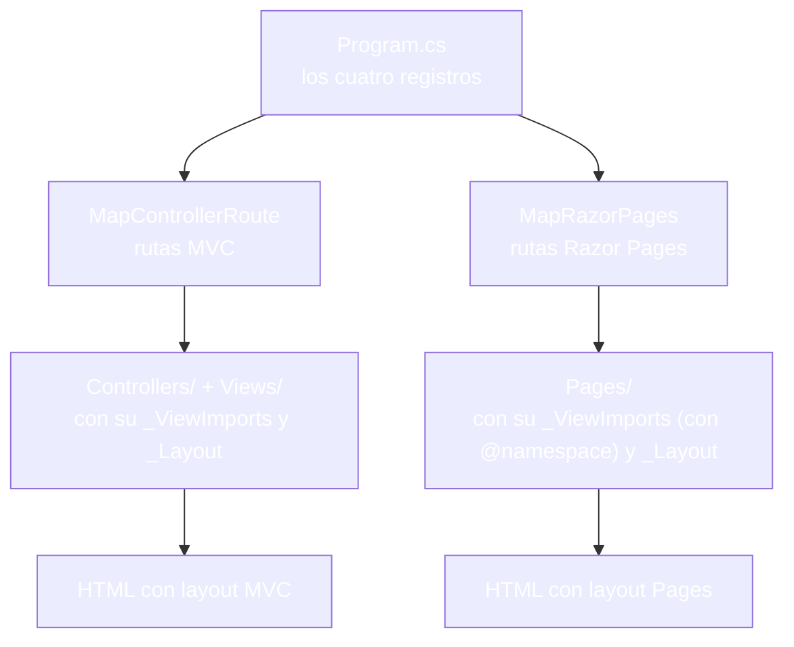
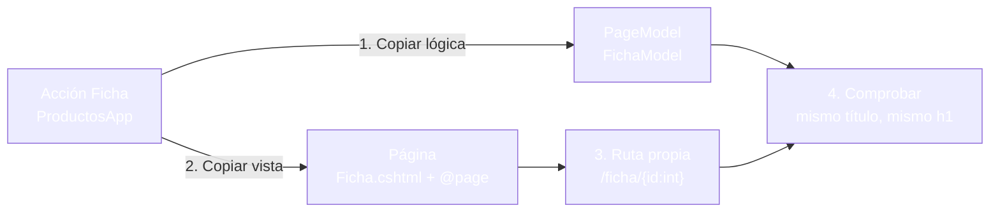

- [12. MVC vs Razor Pages: comparativa y migración](#12-mvc-vs-razor-pages-comparativa-y-migración)
  - [12.1. Las dos arquitecturas en paralelo](#121-las-dos-arquitecturas-en-paralelo)
  - [12.2. Qué elige cada una](#122-qué-elige-cada-una)
  - [12.3. Convivir en la misma aplicación](#123-convivir-en-la-misma-aplicación)
  - [12.4. Migrar una vista de MVC a Razor Pages](#124-migrar-una-vista-de-mvc-a-razor-pages)
    - [12.4.1. El punto de partida: la acción ficha](#1241-el-punto-de-partida-la-acción-ficha)
    - [12.4.2. La página equivalente](#1242-la-página-equivalente)
    - [12.4.3. La colisión de rutas](#1243-la-colisión-de-rutas)
    - [12.4.4. Completar la migración](#1244-completar-la-migración)
  - [12.5. Tabla de decisión](#125-tabla-de-decision)
  - [12.6. Buenas prácticas](#126-buenas-prácticas)
  - [12.7. Reto: migra la tienda de Funkos](#127-reto-migra-la-tienda-de-funkos)
    - [12.7.1. Contexto](#1271-contexto)
    - [12.7.2. Modelo de datos](#1272-modelo-de-datos)
    - [12.7.3. Almacenamiento](#1273-almacenamiento)
    - [12.7.4. Retos](#1274-retos)


# 12. MVC vs Razor Pages: comparativa y migración

> 💡 **Punto de partida:** Cuando Netflix decide modernizar su web, no la reescribe entera: migra vista a vista mientras el resto sigue sirviendo millones de peticiones sin caerse. Migrar de una arquitectura a otra sin romper la aplicación es un oficio, y en este punto lo practicas: comparar MVC y Razor Pages por dentro, convivirlas en el mismo proyecto y mover una vista de una a la otra sin caídas.

En este punto aprenderás a comparar las dos visiones por dentro, a convivirlas en un mismo `Program.cs` y a hacer una migración real de una acción de MVC a una página, vista a vista y sin caídas.

**Objetivos de aprendizaje:**

- Comparar las dos arquitecturas: quién atiende, dónde vive la lógica y cómo se resuelven los archivos
- Convivir controladores y páginas en la misma aplicación con los cuatro registros de `Program.cs`
- Migrar una vista de MVC a Razor Pages: página con ruta propia, equivalencia comprobada, acción borrada y enlaces actualizados
- Reconocer la colisión de rutas y saber quién gana
- Elegir arquitectura con criterios claros para cada vista

> 📝 **Nota:** los fragmentos de este punto salen del proyecto MVC que llevas montando desde el punto 07 y de una copia suya donde conviven las dos visiones y donde se hace la migración.

## 12.1. Las dos arquitecturas en paralelo

Las dos comparten motor, lenguaje y resultados — lo que cambia es quién manda.

| | Razor Pages | MVC |
|---|---|---|
| **Quién atiende la URL** | La página (`Pages/**`) | El controlador (`Controllers/**`) |
| **Dónde vive la lógica** | `PageModel` pegado a la página (`.cshtml.cs`) | Acciones del controlador |
| **Cómo se resuelven los archivos** | Geografía: la URL es la ruta dentro de `Pages/` | GPS: `Views/<Controlador>/<Accion>.cshtml` |
| **Cómo se enlaza** | `asp-page` | `asp-action` |
| **Qué hay que registrar** | `AddRazorPages()` + `MapRazorPages()` | `AddControllersWithViews()` + `MapControllerRoute(...)` |
| **Qué devuelve al final** | HTML con layout | HTML con layout |



📌 **Ejemplo real:** Los dos enfoques conviven en la industria. Los paneles de gestión y las páginas de trámite suelen ir en Razor Pages, una vista por archivo; las aplicaciones que mezclan vistas con servicios de datos van en MVC, donde un mismo controlador puede devolver una vista a un navegador y JSON a una app móvil.

## 12.2. Qué elige cada una

La propia Microsoft recomienda Razor Pages para desarrollo nuevo por encima de MVC con controladores y vistas. Eso no entierra a MVC: son vistas distintas.

| Elige Razor Pages cuando... | Elige MVC cuando... |
|---|---|
| Cada URL es una vista y ya está | Un controlador debe servir vistas y JSON a la vez |
| El formulario y su lógica viven juntos | Vieneis de un proyecto MVC y el equipo ya piensa en capas |
| Quieres el menor número de archivos posible | Necesitas varias acciones compartiendo el mismo modelo de vista |
| La app es de tamaño medio o pequeño | La app es grande y separas por capas de forma estricta |



## 12.3. Convivir en la misma aplicación

Las dos no son rivales: son vecinas. La prueba es un `Program.cs` con los cuatro registros, dos por mundo:

```csharp
var builder = WebApplication.CreateBuilder(args);

// Mundo MVC
builder.Services.AddControllersWithViews();

// Mundo Razor Pages
builder.Services.AddRazorPages();

var app = builder.Build();

// ... middlewares ...

app.MapStaticAssets();

// Rutas MVC
app.MapControllerRoute(
    name: "default",
    pattern: "{controller=Home}/{action=Index}/{id?}")
    .WithStaticAssets();

// Rutas Razor Pages
app.MapRazorPages()
   .WithStaticAssets();

app.Run();
```

En esta aplicación conviven, cada uno en su carpeta:

| Petición | Quién responde | Código |
|----------|----------------|:------:|
| `GET /` | `HomeController.Index()` (MVC) | **200** |
| `GET /Productos/Ficha/1` | `ProductosController.Ficha(1)` (MVC) | **200** |
| `GET /Bienvenida` | `Pages/Bienvenida.cshtml` (Razor Pages) | **200** |

Cada mundo conserva su estructura y sus directivas. Dos detalles que duelen si no los sabes:

- **El `_ViewImports` de `Pages/` necesita `@namespace`**: sin él, la compilación falla con `CS0246` (el modelo no se encuentra). El de `Views/` no lo trae, y no le hace falta.
- **Cada mundo tiene su carpeta de layouts**: `Views/Shared/_Layout.cshtml` y `Pages/Shared/_Layout.cshtml`. Si desde `Pages/_ViewStart.cshtml` apuntas al de MVC con `Layout = "/Views/Shared/_Layout"`, la página revienta en ejecución con `InvalidOperationException: The layout view '/Views/Shared/_Layout' could not be located`. La solución es la que ya sabes: un `_ViewStart` por mundo y el layout en `Pages/Shared/`.



> 💡 **Consejo:** si vas a convivir, convive de verdad: no mezcles carpetas. Las páginas van en `Pages/`, las vistas en `Views/`, y cada una con sus propios `_ViewImports` y `_Layout`.

## 12.4. Migrar una vista de MVC a Razor Pages

Migrar no es reescribir el proyecto: es mover vista a vista, dejando cada cambio funcionando antes de pasar al siguiente.

### 12.4.1. El punto de partida: la acción ficha

Esto es lo que hay que mover, tal como está en `ProductosApp`:

```csharp
// Controllers/ProductosController.cs
public IActionResult Ficha(int id)
{
    var producto = RepositorioProductos.ObtenerTodos()
        .FirstOrDefault(p => p.Id == id);

    if (producto is null) return NotFound();
    return View(producto.ToViewModel());
}
```

```cshtml
@* Views/Productos/Ficha.cshtml *@
@model ProductoViewModel
@{
    ViewData["Title"] = Model.Titulo;
}
<h1 id="nombre">@Model.Nombre</h1>
<p id="sub">@Model.Subtitulo</p>
<span id="precio">@Model.PrecioReferencia.ToString("C")</span>
<span id="estado">@Model.Estado</span>
<span id="sello">@Model.Sello</span>
```

### 12.4.2. La página equivalente

La migración tiene cuatro pasos, y el orden importa:

1. Crea la carpeta `Pages/Productos/` y su `_ViewImports.cshtml` con `@using ProductosApp`, `@using ProductosApp.ViewModels` y `@namespace ProductosApp.Pages`.
2. Crea `Pages/_ViewStart.cshtml` con `Layout = "_Layout";` y copia el `_Layout` a `Pages/Shared/_Layout.cshtml`.
3. Escribe la página con su ruta propia, que no pise la de la acción:

```cshtml
@page "/ficha/{id:int}"
@model FichaModel
@{
    ViewData["Title"] = Model.Producto.Titulo;
}
<h1 id="nombre">@Model.Producto.Nombre</h1>
<p id="sub">@Model.Producto.Subtitulo</p>
<span id="precio">@Model.Producto.PrecioReferencia.ToString("C")</span>
<span id="estado">@Model.Producto.Estado</span>
<span id="sello">@Model.Producto.Sello</span>
```

4. Escribe el `PageModel` con la misma lógica que la acción:

```csharp
// Pages/Productos/Ficha.cshtml.cs
public class FichaModel : PageModel
{
    public ProductoViewModel Producto { get; set; } = default!;

    public IActionResult OnGet(int id)
    {
        var producto = RepositorioProductos.ObtenerTodos()
            .FirstOrDefault(p => p.Id == id);

        if (producto is null) return NotFound();
        Producto = producto.ToViewModel();
        return Page();
    }
}
```

Mientras las dos existen, la equivalencia se ve a simple vista:

| Petición | Quién responde | Resultado |
|----------|----------------|-----------|
| `GET /Productos/Ficha/1` | La acción (MVC) | **200**, título `Ficha de Auriculares - ProductosApp`, h1 `Auriculares` |
| `GET /ficha/1` | La página (Razor Pages) | **200**, el mismo título y el mismo h1 |
| `GET /ficha/99` | La página | **404**, porque el `PageModel` devuelve `NotFound()` igual que la acción |



### 12.4.3. La colisión de rutas

El error clásico de la migración es darle a la página la misma URL que la acción. Esto es lo que pasa si lo haces: deja la página en `@page "/Productos/Ficha/{id:int}"` mientras la acción sigue escuchando por `{controller}/{action}/{id?}`:

- `GET /Productos/Ficha/1` → **200**, sin ninguna excepción: la aplicación no se queja, elige un ganador.
- El ganador es la página: con un marcador temporal en el `PageModel` se vio que la respuesta salía de ella. Las rutas con literales (`Productos`, `Ficha`) tienen prioridad sobre las de parámetros (`{controller}`, `{action}`).

Por eso el paso 3 lleva ruta propia: mientras la acción exista, la página no debe pisar su dirección.

### 12.4.4. Completar la migración

Cuando la página responde como la acción, toca quitar lo viejo. En la copia se borraron la acción `Ficha` y su vista `Views/Productos/Ficha.cshtml`:

| Antes de borrar | Después de borrar |
|---|---|
| `GET /Productos/Ficha/1` → **200** (acción) | `GET /Productos/Ficha/1` → **404** (ya no hay acción) |
| `GET /ficha/1` → **200** (página) | `GET /ficha/1` → **200** (la página sigue) |

Y los enlaces, el punto donde la migración se rompe en silencio. En la portada conviven los dos mundos:

```cshtml
<a id="enlace-mvc" asp-controller="Productos" asp-action="Ficha" asp-route-id="1">Ficha por MVC</a>
<a id="enlace-pagina" asp-page="/Productos/Ficha" asp-route-id="1">Ficha por pagina</a>
```

**Lo que se ve en el HTML:** el enlace `asp-action` sigue generando `href="/Productos/Ficha/1"` aunque la acción ya no exista, porque el Tag Helper no comprueba nada; ese enlace está muerto. El enlace `asp-page="/Productos/Ficha"` genera `href="/ficha/1"`, que responde **200**. Fíjate en el detalle: el nombre de página es `/Productos/Ficha` (la ruta del archivo) y la URL es `/ficha/1` (la ruta de `@page`); con ruta personalizada no son lo mismo.

> ⚠️ **Advertencia:** la migración no está terminada hasta que los enlaces apuntan a la página. Borra la acción un día y los navegadores te avisarán de inmediato: el enlace antiguo ya no lleva a ninguna parte.

> 💡 **Consejo:** migra una vista, déjala cerrada (equivalencia, acción borrada, enlaces actualizados) y solo entonces pasa a la siguiente. Una migración a medias entre dos arquitecturas es el peor lugar para estar.

## 12.5. Tabla de decisión

Checklist para decidir hoy y para revisar mañana:

- [ ] ¿La URL es una vista con su formulario? → Razor Pages
- [ ] ¿Un controlador debe servir vistas y JSON? → MVC
- [ ] ¿El equipo ya piensa en capas estrictas? → MVC
- [ ] ¿Quieres el menor número de archivos posible? → Razor Pages
- [ ] ¿Hay que migrar? → vista a vista, con ruta propia y sin colisiones
- [ ] ¿Las dos conviven? → cuatro registros en `Program.cs`, dos `_ViewImports`, dos layouts

## 12.6. Buenas prácticas

- **Elige por vista, no por proyecto**: una app puede empezar en Pages y crecer con un par de controladores
- **Cuatro registros, cero medias tintas**: si conviven, `Program.cs` lleva las dos parejas completas
- **Un `_ViewImports` y un layout por mundo**: `Pages/` con `@namespace`, `Views/` sin él
- **Ruta propia siempre que migres**: la página nueva no pisa la URL de la acción que aún vive
- **Equivalencia antes que borrado**: mismo título, mismo contenido, mismos errores antes de quitar nada
- **Actualiza los enlaces al final**: `asp-action` por `asp-page` apuntando al nombre de página
- **No dupliques URLs**: si dos endpoints responden lo mismo, la prioridad de rutas decide por ti, y no siempre hacia donde crees
- **Migra de una en una**: vista, equivalencia, borrado, enlaces; después la siguiente

## 12.7. Reto: migra la tienda de Funkos

> Migra vista a página sobre una copia del proyecto — y sin romper lo que ya funciona.

### 12.7.1. Contexto

**Paso 0:** parte del proyecto MVC de FunkoApp que montaste en los retos de los puntos 07-09 (`FunkosController`, `Views/Funkos/` y el repositorio en memoria). Haz una **copia** del proyecto (por ejemplo, con `robocopy` excluyendo `bin` y `obj`) y trabaja sobre la copia: el original se queda intacto como referencia.

### 12.7.2. Modelo de datos

| Propiedad | Tipo | Obligatorio |
|-----------|------|:-----------:|
| `id` | int | Sí (autogenerado) |
| `nombre` | string | Sí |
| `categoria` | string | Sí |
| `anio` | int | Sí |
| `precioReferencia` | decimal | Sí |
| `imagen` | string? | No |
| `etiquetas` | List\<string\>? | No |
| `activo` | bool | Sí |
| `esNovedad` | bool | Sí |

### 12.7.3. Almacenamiento

```csharp
public static class RepositorioFunkos
{
    private static readonly List<Funko> Funkos = [ /* seis figuras */ ];

    public static IReadOnlyList<Funko> ObtenerTodos() => Funkos;
}
```

Rellena la lista con seis figuras de modo que haya activas y dadas de baja, novedades y no novedades, y las tres categorías.

### 12.7.4. Retos

1. **En papel primero:** dibuja la vista de ficha en las dos arquitecturas: qué archivo atiende la URL, dónde vive la lógica, qué URL responde y qué enlace la invoca
2. En la copia, añade `AddRazorPages()` y `MapRazorPages()` a `Program.cs`, crea `Pages/Bienvenida.cshtml` y comprueba que `/` sigue dando **200** (MVC) y `/Bienvenida` da **200** (Razor Pages)
3. Crea `Pages/_ViewImports.cshtml` con `@namespace`, `Pages/_ViewStart.cshtml` y el `_Layout` en `Pages/Shared/`; comprueba con **F12** que la página nueva sale con la barra de navegación
4. Crea `Pages/Funkos/Ficha.cshtml` con `@page "/ficha/{id:int}"` y su `FichaModel` con la misma lógica que la acción; comprueba que `/ficha/1` pinta el mismo título y el mismo h1 que `/Funkos/Ficha/1`, y que `/ficha/99` da **404**
5. Con las dos respondiendo, cambia la ruta de la página a `@page "/Funkos/Ficha/{id:int}"`, añade un marcador visible en el `PageModel` y comprueba que `/Funkos/Ficha/1` responde **200** y que el marcador es el de la página; devuelve la ruta propia
6. **Migra de verdad:** borra la acción `Ficha` y su vista `Views/Funkos/Ficha.cshtml`; comprueba que `/Funkos/Ficha/1` pasa a **404** y que `/ficha/1` sigue en **200**
7. Actualiza el enlace de la portada de `asp-action` a `asp-page="/Funkos/Ficha"` y comprueba con **F12** que el `href` renderizado es `/ficha/1` y que el enlace viejo, si lo dejas, sigue generando `/Funkos/Ficha/1` muerto
8. Repite el ciclo completo con otra vista (por ejemplo, `Panel`): página nueva, equivalencia, borrado de la acción y enlaces

**Puntos extra:**

- Quita el `@namespace` de `Pages/_ViewImports.cshtml` y lee el `CS0246`; devuélvelo
- Pon `Layout = "/Views/Shared/_Layout"` en `Pages/_ViewStart.cshtml` y lee el `InvalidOperationException` de layout no encontrado; devuelve la copia en `Pages/Shared/`
- Compara en la pestaña **Network** el peso de `/Funkos/Ficha/1` (acción) y `/ficha/1` (página): mismo dato, dos arquitecturas
- Escribe un `README.md` en la solución listando qué vistas quedan en MVC, cuáles pasan a Razor Pages y el motivo de cada decisión

---

**Resumen del punto:**

| Concepto | Descripción |
|----------|-------------|
| **Razor Pages** | Orientado a páginas: `Pages/**` con su `PageModel`, registrado con `AddRazorPages` y `MapRazorPages` |
| **MVC** | Orientado a acciones: `Controllers/**` y `Views/**`, registrado con `AddControllersWithViews` y `MapControllerRoute` |
| **Convivencia** | Los cuatro registros en un `Program.cs`; dos `_ViewImports` y dos layouts |
| **`@namespace` en Pages** | Sin él, `CS0246`: el modelo de la página no se encuentra |
| **Layout por mundo** | `Views/Shared` y `Pages/Shared`; apuntar al otro da **500** |
| **Migración** | Vista a vista: página con ruta propia, equivalencia, borrado, enlaces |
| **Colisión de rutas** | Dos endpoints en la misma URL: responde **200** y gana la ruta con literales |
| **Nombre de página ≠ URL** | Con ruta personalizada: `asp-page="/Productos/Ficha"` → `href=/ficha/1` |
| **Enlace muerto** | `asp-action` sigue renderizando tras borrar la acción; el destino da **404** |
| **Equivalencia** | Mismo título, mismo contenido y mismos errores antes de borrar nada |
| **Criterio de elección** | Vista por URL → Pages; vistas y JSON desde un controlador → MVC |
| **Comprobado** | Convivencia **200/200/200**, migración con URL vieja **404** y nueva **200** |

**¿Qué viene después?**

En el siguiente punto empezamos el bloque de formularios con la forma dual: la misma vista de alta montada como página Razor Pages y como acción de MVC, con los mismos campos y dos hogares distintos.
