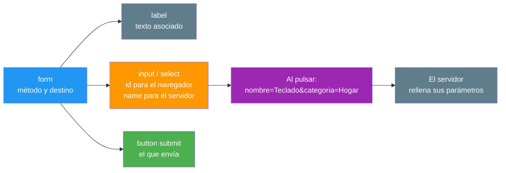
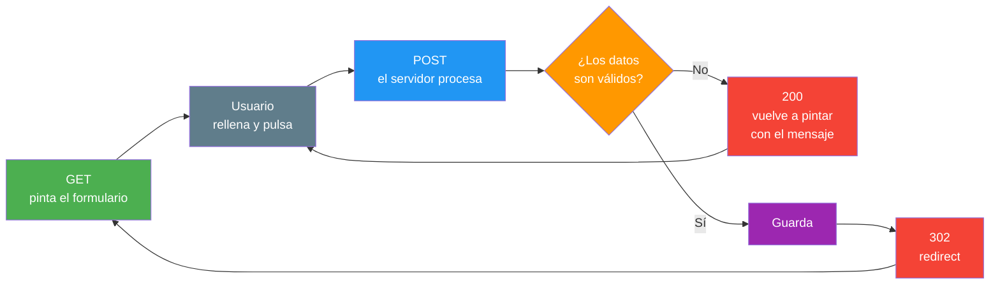
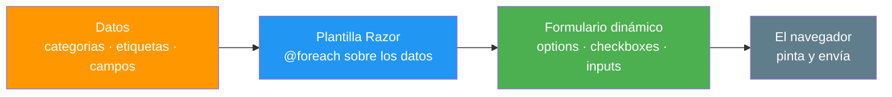

- [13. Formularios Web y Generación Dinámica](#13-formularios-web-y-generación-dinámica)
  - [13.1. La Anatomía de un Formulario](#131-la-anatomía-de-un-formulario)
  - [13.2. El Ciclo de un Formulario](#132-el-ciclo-de-un-formulario)
  - [13.3. La Vista de Alta: Las Dos Visiones](#133-la-vista-de-alta-las-dos-visiones)
    - [13.3.1. Visión Razor Pages: La Página de Alta](#1331-visión-razor-pages-la-página-de-alta)
    - [13.3.2. Visión MVC: La Acción de Alta](#1332-visión-mvc-la-acción-de-alta)
    - [13.3.3. La Misma Vista, Comparada](#1333-la-misma-vista-comparada)
  - [13.4. Generación Dinámica del Formulario](#134-generación-dinámica-del-formulario)
  - [13.5. Tag Helpers de Formulario](#135-tag-helpers-de-formulario)
  - [13.6. Buenas Prácticas](#136-buenas-prácticas)
  - [13.7. Reto: El Alta de Funkos en las Dos Visiones](#137-reto-el-alta-de-funkos-en-las-dos-visiones)
    - [13.7.1. Contexto](#1371-contexto)
    - [13.7.2. Modelo de datos](#1372-modelo-de-datos)
    - [13.7.3. Almacenamiento](#1373-almacenamiento)
    - [13.7.4. Retos](#1374-retos)


# 13. Formularios Web y Generación Dinámica

> 💡 **Punto de partida:** Cuando reservas un vuelo en Ryanair, eliges fechas, pasajeros y equipaje, aceptas los términos y pulsas *Continuar*. Entre ese pulsado y el servidor hay una pieza que lleva décadas funcionando igual: un formulario. En este punto montamos el mismo alta dos veces, una como página Razor Pages y otra como acción de MVC, para que veas que el formulario no cambia: cambia quién lo recibe.

En este punto aprenderás la anatomía de un formulario, su ciclo completo con el patrón PRG que ya conociste, cómo generar los campos del propio formulario a partir de datos y los Tag Helpers que escriben el HTML por ti. Todo con la forma dual: la misma vista en las dos visiones.

**Objetivos de aprendizaje:**

- Reconocer las piezas de un formulario: `form`, `label`, `input`, `select`, `name` y `button`
- Seguir el ciclo completo de un formulario: pintar, enviar, procesar y confirmar con PRG
- Montar la misma vista de alta como página Razor Pages y como acción de MVC
- Generar el formulario dinámicamente con `@foreach`: selects y casillas que salen de los datos
- Usar los Tag Helpers de formulario (`form`, `input`, `label`) en las dos visiones

> 📝 **Nota:** seguimos con el repositorio en memoria del punto 03 y con `ProductosApp` en sus dos visiones: la página vive en `Pages/Productos/` y la acción en `Controllers/` con su vista en `Views/Productos/`.

## 13.1. La Anatomía de un Formulario

Un formulario es una etiqueta `form` con campos dentro. Cada campo tiene dos nombres que no son lo mismo: el `id`, que ve el navegador (lo usa la etiqueta `label` y el CSS), y el `name`, que ve el servidor (es el nombre con el que llega el dato). Olvidar el `name` es el error número uno: el campo se ve en la vista y el servidor no recibe nada.

```html
<form method="post">
    <label for="nombre">Nombre</label>
    <input id="nombre" name="nombre" type="text" />

    <label for="categoria">Categoría</label>
    <select id="categoria" name="categoria">
        <option value="Electrónica">Electrónica</option>
        <option value="Hogar">Hogar</option>
    </select>

    <label for="esNovedad">
        <input id="esNovedad" name="esNovedad" type="checkbox" value="true" /> Es novedad
    </label>

    <button type="submit">Guardar</button>
</form>
```

| Pieza | Para qué sirve |
|-------|----------------|
| `form` | Contenedor y destino: declara el método y la acción |
| `label` | Texto asociado al campo; con `for` apunta al `id` |
| `input`, `select` | Los campos: cada uno con su `id` y su `name` |
| `option` | Un valor del `select`; el servidor recibe el `value` |
| `checkbox` | Casilla; sin `value` enviaría la palabra `on` |
| `button type="submit"` | El disparador: el único que envía el formulario |



📌 **Ejemplo real:** El formulario de cualquier web de reserva de vuelos es esta misma estructura repetida: origen, destino, fechas y pasajeros, cada campo con su `name` para que el servidor sepa qué es cada cosa cuando llega el paquete.

El atributo `method` decide por dónde viajan los datos:

- `method="get"`: los datos salen en la propia URL (`/Productos/Buscar?q=o`, como ya viste en el punto 08). Es el método de las búsquedas y los filtros: la URL se puede copiar y compartir.
- `method="post"`: los datos viajan en el cuerpo de la petición, fuera de la URL. Es el método de las altas y las ediciones: lo que envías no queda a la vista de nadie.

## 13.2. El Ciclo de un Formulario

El ciclo siempre es el mismo, y ya lo conoces del punto 11: el GET pinta el formulario, el usuario lo rellena, el POST lo procesa, y lo correcto es terminar con un redirect (patrón PRG) para que el refresco del navegador no reenvíe nada.



Hay una pieza de seguridad que el navegador no ve y trabaja sola: el **token antiforgery**. El Form Tag Helper inyecta un campo oculto `__RequestVerificationToken` en cada formulario, y el servidor lo exige en cada POST. Lo que sí cambia entre visiones es quién lo exige:

| Qué ocurre | Página Razor Pages | Acción MVC |
|------------|:------------------:|:----------:|
| El formulario trae el token | Sí, automáticamente | Sí, automáticamente |
| POST sin token | **400** (lo valida solo) | **302**: lo acepta y procesa |
| POST sin token con `[ValidateAntiForgeryToken]` | — | **400** |

La diferencia es importante y se aprende a la primera: **Razor Pages valida el token en todos sus POST sin que hagas nada; en MVC tienes que pedirlo con `[ValidateAntiForgeryToken]`**. Sin ese atributo, cualquiera puede montar un formulario en otro sitio y enviar datos a tu acción. La protección completa (validaciones, límites, firmas de archivo) la abrimos en el punto 15.

> ⚠️ **Advertencia:** si tu acción MVC de escritura no lleva `[ValidateAntiForgeryToken]`, no está protegida aunque el formulario traiga el token. El token se inyecta siempre; quien decide exigirlo eres tú.

## 13.3. La Vista de Alta: Las Dos Visiones

Este es el corazón del punto: la misma vista de alta, montada dos veces. Los campos son idénticos (nombre, categoría y casilla de novedad); cambia dónde vive cada pieza. A partir de aquí, los temas duales separan cada vista en dos apartados con el nombre de su visión, para que el índice diga de un vistazo qué es página y qué es controlador.

### 13.3.1. Visión Razor Pages: La Página de Alta

La página vive en `Pages/Productos/Alta.cshtml` con su `PageModel` al lado. El formulario no lleva `action`: envía a la propia página, que es quien procesa.

```cshtml
@* Pages/Productos/Alta.cshtml *@
@page "/productos/alta"
@model AltaModel
@{
    ViewData["Title"] = "Alta de producto";
    var categorias = new[] { "Electrónica", "Hogar", "Deportes" };
}
<h1 id="titulo">@ViewData["Title"]</h1>

<form method="post">
    <label for="nombre">Nombre</label>
    <input id="nombre" name="nombre" type="text" />

    <label for="categoria">Categoria</label>
    <select id="categoria" name="categoria">
        @foreach (var c in categorias)
        {
            <option value="@c">@c</option>
        }
    </select>

    <label for="esNovedad">
        <input id="esNovedad" name="esNovedad" type="checkbox" value="true" /> Es novedad
    </label>

    <button type="submit">Guardar</button>
</form>
```

```csharp
// Pages/Productos/Alta.cshtml.cs
public class AltaModel : PageModel
{
    private static readonly List<string> LineasGuardadas = [];

    public int Guardados => LineasGuardadas.Count;

    public void OnGet()
    {
    }

    public IActionResult OnPost(string nombre, string categoria, bool esNovedad)
    {
        if (string.IsNullOrWhiteSpace(nombre))
        {
            Mensaje = "El nombre es obligatorio";
            return Page();
        }

        LineasGuardadas.Add($"{nombre} · {categoria} · {esNovedad}");
        return RedirectToPage();   // PRG: la URL vuelve a ser la del alta
    }
}
```

### 13.3.2. Visión MVC: La Acción de Alta

La misma vista como controlador y vista: el formulario lleva `asp-controller` y `asp-action`, y quien procesa son dos acciones con el mismo nombre.

```cshtml
@* Views/Productos/Alta.cshtml *@
@{
    ViewData["Title"] = "Alta de producto";
    var categorias = new[] { "Electrónica", "Hogar", "Deportes" };
}
<h1 id="titulo">@ViewData["Title"]</h1>

<form asp-controller="Productos" asp-action="Alta" method="post">
    @* los mismos campos de la página, con las mismas names *@
    <label for="nombre">Nombre</label>
    <input id="nombre" name="nombre" type="text" />
    @* ... select y casilla iguales ... *@
    <button type="submit">Guardar</button>
</form>
```

```csharp
// Controllers/ProductosController.cs
[HttpGet("productos/alta")]
public IActionResult Alta() => View();

[HttpPost("productos/alta")]
[ValidateAntiForgeryToken]
public IActionResult Alta(string nombre, string categoria, bool esNovedad)
{
    if (string.IsNullOrWhiteSpace(nombre))
    {
        ViewBag.Mensaje = "El nombre es obligatorio";
        return View();
    }

    LineasGuardadas.Add($"{nombre} · {categoria} · {esNovedad}");
    return RedirectToAction("Index");   // PRG: vuelve al listado
}
```

### 13.3.3. La Misma Vista, Comparada

La comparación, pieza a pieza:

| | Página Razor Pages | Acción MVC |
|---|---|---|
| **Quien recibe el GET y el POST** | `OnGet` y `OnPost` del mismo `PageModel` | Dos acciones con los mismos nombres |
| **Cómo se declaran los campos en el formulario** | `form method="post"` (la página es el destino) | `form asp-controller asp-action` |
| **Cómo llegan los datos** | Parámetros de `OnPost` | Parámetros de la acción |
| **Mensaje de campo vacío** | `return Page()` con el mensaje | `return View()` con el mensaje |
| **Confirmación (PRG)** | `RedirectToPage()` → **302** a `/productos/alta` | `RedirectToAction("Index")` → **302** a `/Productos` |
| **Token antiforgery** | Exigido sin más | Hay que añadir `[ValidateAntiForgeryToken]` |

En las dos visiones, el campo vacío devuelve **200** con `El nombre es obligatorio`, y el envío válido termina en **302** con su `Location`. El navegador no distingue: para él, las dos son un formulario que funciona.

## 13.4. Generación Dinámica del Formulario

Hasta ahora los campos estaban escritos a mano. Pero el `select` de categorías no tiene por qué estarlo — los valores salen de los datos, y la plantilla los convierte en opciones. Es el mismo `@foreach` del punto 03 aplicado a un formulario.

```cshtml
@{
    var categorias = new[] { "Electrónica", "Hogar", "Deportes" };
}

<label for="categoria">Categoria</label>
<select id="categoria" name="categoria">
    @foreach (var c in categorias)
    {
        <option value="@c">@c</option>
    }
</select>
```

El navegador recibe tres `<option>`, uno por cada elemento del array; si mañana añades una cuarta categoría a la fuente de datos, el formulario crece sin tocar el HTML. Lo mismo vale para las casillas de una lista de etiquetas o para los campos de un modelo: la plantilla se itera, los datos rellenan.



📌 **Ejemplo real:** Los formularios de preferencias de cualquier servicio (notificaciones, privacidad, idioma) se generan así: hay una lista de opciones en el servidor y la plantilla pinta un control por cada una. Si el producto añade una opción nueva, la vista cambia sin que nadie edite HTML.

En las dos visiones de `ProductosApp` ocurre exactamente lo mismo: el `select` de la página y el de la vista MVC salen del mismo `@foreach` y el navegador recibe en ambos casos tres `<option>`.

## 13.5. Tag Helpers de Formulario

Escribir `action="/productos/alta"` a mano es escribir una URL a mano, con los mismos problemas de siempre. Los Tag Helpers del punto 06 resuelven el formulario entero:

| Tag Helper | Qué genera |
|------------|------------|
| `<form asp-controller="Productos" asp-action="Alta">` | El `action` con la URL de la acción (visión MVC) |
| `<form asp-page="/Productos/Alta">` | El `action` con la URL de la página (visión Pages) |
| `<input asp-for="Nombre">` | El `id` y el `name` a partir de la propiedad del modelo |
| `<label asp-for="Nombre">` | El `for` asociado a ese mismo `id` |

**Lo que ve el navegador** en la acción MVC: el formulario sale con `action="/productos/alta"`, generado a partir de los nombres de controlador y acción; si mañana cambias la ruta por atributo, el enlace se arregla solo. En la página, el formulario sin `action` envía a la propia URL, que es exactamente lo que queremos: la página procesa lo que pinta.

> 💡 **Consejo:** con modelo, usa `asp-for` en inputs y etiquetas y no escribas `id` ni `name` a mano; sin modelo (como en este alta con parámetros sueltos), los campos con `name` a mano están bien mientras el nombre coincida con el parámetro que espera el servidor. En el punto 14 verás el enlazado completo con modelos, y en el 15 los Tag Helpers de validación (`asp-validation-for`).

📌 **Ejemplo real:** El generador de formularios de cualquier panel de administración (WordPress, por ejemplo) es la versión industrial de esta idea: quien define los campos es una lista de datos, y el HTML del formulario se genera en cada visita.

## 13.6. Buenas Prácticas

- **`name` siempre**: un campo sin `name` no existe para el servidor, aunque se vea en la vista
- **`label` con `for`**: asocia el texto al campo y mejora la accesibilidad y los clics
- **`method="post"` para escribir, `get` para leer**: altas y ediciones con POST; búsquedas y filtros con GET
- **Termina siempre con PRG**: guarda y redirige; el `Page()` o `View()` con mensaje es solo para el error
- **Protege tus acciones de escritura**: `[ValidateAntiForgeryToken]` en MVC; en Pages se exige solo
- **Genera lo que viene de datos**: selects, casillas y campos de modelo salen de `@foreach`, no del HTML a mano
- **Tag Helpers en vez de URLs**: `asp-controller`/`asp-action` o `asp-page`; las `action` escritas a mano se rompen al cambiar las rutas
- **Los campos vacíos se avisan**: devuelve el formulario con un mensaje claro, nunca un silencio

## 13.7. Reto: El Alta de Funkos en las Dos Visiones

> Monta el alta de Funkos dos veces, como página y como acción, y comprueba que el navegador no nota la diferencia.

### 13.7.1. Contexto

**Paso 0:** necesitas las dos visiones en marcha: el proyecto Razor Pages del punto 10 (`dotnet new webapp -n FunkoApp`) y el proyecto MVC del punto 07 (`dotnet new mvc -n FunkoAppMvc`), cada uno con `Models/Funko.cs` y `Repositories/RepositorioFunkos.cs` de los apartados siguientes.

### 13.7.2. Modelo de datos

| Propiedad | Tipo | Obligatorio |
|-----------|------|:-----------:|
| `id` | int | Sí (autogenerado) |
| `nombre` | string | Sí |
| `categoria` | string | Sí |
| `anio` | int | Sí |
| `precioReferencia` | decimal | Sí |
| `imagen` | string? | No |
| `etiquetas` | List\<string\>? | No |
| `activo` | bool | Sí |
| `esNovedad` | bool | Sí |

### 13.7.3. Almacenamiento

```csharp
public static class RepositorioFunkos
{
    private static readonly List<Funko> Funkos = [ /* seis figuras */ ];

    public static IReadOnlyList<Funko> ObtenerTodos() => Funkos;
}
```

Rellena la lista con seis figuras de modo que haya activas y dadas de baja, novedades y no novedades, y las tres categorías. Para el alta, añade una lista estática donde ir guardando las altas de la sesión.

### 13.7.4. Retos

**Pasos compartidos (las dos visiones):**

1. **En papel primero:** dibuja la vista de alta y su ciclo: qué pinta el GET, qué campos envía el formulario, qué decide el POST y a dónde redirige
2. El formulario lleva tres campos: nombre (`text`), categoría (`select` generado con `@foreach` desde un array de las tres categorías) y novedad (`checkbox` con `value="true"`); comprueba con **F12** que cada campo tiene su `name`
3. El campo vacío devuelve **200** con el mensaje `El nombre es obligatorio`; el envío válido termina en **302** con su cabecera `Location`
4. Comprueba que el formulario sale con el campo oculto `__RequestVerificationToken`

**Visión Razor Pages:**

5. Crea `Pages/Productos/Alta.cshtml` con `@page "/productos/alta"` y su `AltaModel` con `OnGet` y `OnPost(string nombre, string categoria, bool esNovedad)`; el POST guarda en la lista estática y devuelve `RedirectToPage()`
6. Comprueba con **F12** que el formulario no lleva `action` (envía a la propia página) y que el POST sin token responde **400**
7. Tras el alta, el GET muestra el contador y la línea guardada con el formato `nombre · categoría · sello`

**Visión MVC:**

8. Crea `Views/Productos/Alta.cshtml` con `<form asp-controller="Productos" asp-action="Alta" method="post">` y las dos acciones `Alta()`: `[HttpGet("productos/alta")]` que pinta y `[HttpPost("productos/alta")]` que procesa con `[ValidateAntiForgeryToken]` y `RedirectToAction("Index")`
9. Comprueba con **F12** que el `action` del formulario es `/productos/alta`, generado por el Tag Helper
10. Comprueba que el POST sin token responde **400** gracias al atributo; quítalo un momento y comprueba que pasa a **302**, y devuélvelo

**Puntos extra:**

- Añade al alta un segundo `select` de etiquetas (`oferta`, `nuevo`, `temporada`) generado con `@foreach` y múltiple (`multiple`), y comprueba que el servidor recibe varias
- Cambia el `select` de categoría por tres casillas (`checkbox`) y ajusta el `OnPost` para recibirlas como colección
- Compara en la pestaña **Network** el primer POST de cada visión: misma estructura de campos, distinto destino
- Escribe en un comentario de cada vista por qué su formulario no necesita `action` escrito a mano (página) o por qué el Tag Helper lo genera (MVC)

---

**Resumen del punto:**

| Concepto | Descripción |
|----------|-------------|
| **Formulario** | `form` con campos; el `name` es lo que ve el servidor, el `id` lo que ve el navegador |
| **`method="get"`** | Los datos salen en la URL: búsquedas y filtros |
| **`method="post"`** | Los datos viajan en el cuerpo: altas y ediciones |
| **Ciclo PRG** | GET pinta, POST procesa, redirect confirma; el refresco no reenvía nada |
| **Token antiforgery** | Campo oculto inyectado por el Form Tag Helper; exigido en Pages, opcional en MVC |
| **`[ValidateAntiForgeryToken]`** | En MVC exige el token en el POST; sin él, la acción queda abierta |
| **Mensaje de error** | `Page()` o `View()` con el mensaje; el redirect es solo para el éxito |
| **Generación dinámica** | `@foreach` sobre los datos → `select`, casillas y campos del formulario |
| **Tag Helpers de formulario** | `asp-controller`/`asp-action` o `asp-page` generan la `action`; `asp-for` genera `id` y `name` |
| **Doble visión** | La misma vista como página (`OnPost` + `RedirectToPage`) y como acción (HttpPost + `RedirectToAction`) |
| **Comprobado** | Página: token **400** y alta **302**; acción: **302** sin atributo y **400** con él |

**¿Qué viene después?**

En el siguiente punto abrimos el enlazado de modelos: cómo llega cada campo del formulario a cada propiedad, de dónde sale cada valor y por qué el nombre del campo es, literalmente, la llave de todo el sistema.
