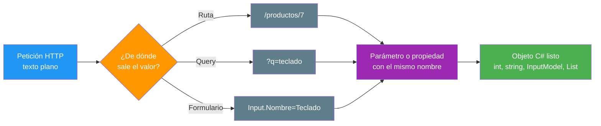

- [14. Model Binding: Del Formulario al Servidor](#14-model-binding-del-formulario-al-servidor)
  - [14.1. El Traductor: Qué es el Model Binding](#141-el-traductor-qué-es-el-model-binding)
  - [14.2. Las Tres Fuentes de un Valor](#142-las-tres-fuentes-de-un-valor)
  - [14.3. La Misma Edición en las Dos Visiones](#143-la-misma-edición-en-las-dos-visiones)
    - [14.3.1. Visión Razor Pages: La Página de Edición](#1431-visión-razor-pages-la-página-de-edición)
    - [14.3.2. Visión MVC: La Acción de Edición](#1432-visión-mvc-la-acción-de-edición)
    - [14.3.3. La Misma Edición, Comparada](#1433-la-misma-edición-comparada)
  - [14.4. Objetos Complejos: El Prefijo](#144-objetos-complejos-el-prefijo)
  - [14.5. Colecciones y Casillas](#145-colecciones-y-casillas)
  - [14.6. Conversión de Tipos y Valores por Defecto](#146-conversión-de-tipos-y-valores-por-defecto)
  - [14.7. Búsqueda y Paginación por Query String](#147-búsqueda-y-paginación-por-query-string)
  - [14.8. Buenas Prácticas](#148-buenas-prácticas)
  - [14.9. Reto: Edición de Funkos con Enlazado de Modelos](#149-reto-edición-de-funkos-con-enlazado-de-modelos)
    - [14.9.1. Contexto](#1491-contexto)
    - [14.9.2. Modelo de datos](#1492-modelo-de-datos)
    - [14.9.3. Almacenamiento](#1493-almacenamiento)
    - [14.9.4. Retos](#1494-retos)


# 14. Model Binding: Del Formulario al Servidor

> 💡 **Punto de partida:** Cuando confirmas un pedido en Amazon, el servidor recibe texto: referencias, cantidades y direcciones, todo en pares `clave=valor`. Pero en C# no hay texto: hay objetos con propiedades tipadas. Alguien tiene que traducir, campo a campo y sin equivocarse de nombre. Ese traductor es el model binding, y en este punto lo abrimos: de dónde sale cada valor, a dónde llega y qué pasa cuando falta.

En este tema aprenderás las fuentes de un valor (ruta, query y formulario), el enlazado de objetos complejos con prefijo, el de colecciones con casillas y la conversión de tipos, todo montado como la edición de una misma vista en las dos visiones.

**Objetivos de aprendizaje:**

- Explicar qué hace el model binding y por qué el `name` del campo es la llave
- Distinguir las tres fuentes de un valor: ruta, query string y formulario
- Enlazar un objeto complejo con prefijo (`Input.Nombre`) en página y en acción
- Enlazar colecciones con campos repetidos y conocer el patrón de índices
- Interpretar los valores por defecto cuando un campo no llega y el papel de la cultura

> 📝 **Nota:** seguimos con el repositorio en memoria del punto 03 y con `ProductosApp` en sus dos visiones: la edición vive como página en `Pages/Productos/` y como acción con su vista en `Views/Productos/`.

## 14.1. El Traductor: Qué es el Model Binding

El **model binding** es el mecanismo que convierte la petición HTTP en objetos C#. Recibe el texto que viaja en la ruta, la query o el cuerpo del formulario, y va emparejando cada pieza con el destino que tiene nombre para ello: un parámetro de un handler o de una acción, o una propiedad con `[BindProperty]`. El emparejamiento es por nombre — y esa es toda la clave del asunto.



📌 **Ejemplo real:** El buscador de cualquier biblioteca online funciona por query string: tecleas `?q=cervantes` en la dirección y el servidor recibe un texto que traduce en una consulta. Quien hace esa traducción, campo a campo, es el binding; sin él, tendrías que leer la URL a mano con `Request.Query["q"]`.

La buena noticia del punto 12 se cumple aquí también: el binding funciona igual en páginas y en controladores. Lo que cambia es dónde declaras el destino.

## 14.2. Las Tres Fuentes de un Valor

Ya las has usado las tres; ahora tienen nombre:

| Fuente | Ejemplo | Dónde vive en la petición |
|--------|---------|---------------------------|
| **Ruta** | `/productos/7` | El segmento de la URL que ocupa el hueco de la plantilla |
| **Query string** | `/Productos/Buscar?q=teclado` | Después del `?`, en pares `clave=valor` |
| **Formulario** | `Input.Nombre=Teclado` | El cuerpo de un POST, con el mismo formato de pares |

Y el destino, en cada visión:

| Destino | Página Razor Pages | Acción MVC |
|---------|--------------------|------------|
| Parámetro del método | `OnGet(int id)`, `OnPost(string nombre)` | `Detalle(int id)`, `Alta(string nombre)` |
| Propiedad con atributo | `[BindProperty] public ProductoInput Input` | (en MVC el equivalente es el parámetro o `[Bind]`) |
| Propiedad de query en GET | `[BindProperty(SupportsGet = true)]` | Parámetro de la acción: ya llega de la query |

El orden de búsqueda lo fija el binding: la ruta manda sobre la query, y el cuerpo del formulario es la fuente de los POST. Si un mismo nombre aparece en dos sitios, gana la fuente de mayor prioridad; si no aparece en ninguna, el destino se queda en su valor por defecto (lo vemos en el apartado 14.6).

## 14.3. La Misma Edición en las Dos Visiones

El corazón del punto: la misma vista de edición, montada dos veces. El formulario trae tres campos con prefijo (`Input.Nombre`, `Input.Anio`, `Input.Precio`) y una colección de casillas (`etiquetas`).

### 14.3.1. Visión Razor Pages: La Página de Edición

La página vive en `Pages/Productos/Edicion.cshtml` con su `PageModel` al lado. Los campos llevan el prefijo `Input.` porque el destino es la propiedad `Input` del modelo:

```cshtml
@* Pages/Productos/Edicion.cshtml *@
@page "/productos/edicion"
@model EdicionModel
@{
    ViewData["Title"] = "Edicion de producto";
    var etiquetas = new[] { "oferta", "nuevo", "temporada" };
}
<form method="post">
    <label for="Input_Nombre">Nombre</label>
    <input id="Input_Nombre" name="Input.Nombre" type="text" />

    <label for="Input_Anio">Anio</label>
    <input id="Input_Anio" name="Input.Anio" type="text" />

    <label for="Input_Precio">Precio</label>
    <input id="Input_Precio" name="Input.Precio" type="text" />

    <fieldset>
        <legend>Etiquetas</legend>
        @foreach (var e in etiquetas)
        {
            <label><input type="checkbox" name="etiquetas" value="@e" /> @e</label>
        }
    </fieldset>

    <button type="submit">Guardar</button>
</form>
```

```csharp
// Pages/Productos/Edicion.cshtml.cs
public class ProductoInput
{
    public string Nombre { get; set; } = string.Empty;
    public int Anio { get; set; }
    public decimal Precio { get; set; }
}

public class EdicionModel : PageModel
{
    [BindProperty]
    public ProductoInput Input { get; set; } = new();

    [BindProperty]
    public List<string> Etiquetas { get; set; } = [];

    public void OnGet()
    {
    }

    public void OnPost()
    {
        Eco = $"Nombre={Input.Nombre}; Anio={Input.Anio}; " +
              $"Precio={Input.Precio}; Etiquetas=[{string.Join(", ", Etiquetas)}]";
    }
}
```

### 14.3.2. Visión MVC: La Acción de Edición

La misma vista como `Views/Productos/Edicion.cshtml`: el formulario lleva `asp-controller` y `asp-action`, y los campos son idénticos, prefijo incluido:

```cshtml
@* Views/Productos/Edicion.cshtml (extracto) *@
<form asp-controller="Productos" asp-action="Edicion" method="post">
    <label for="Input_Nombre">Nombre</label>
    <input id="Input_Nombre" name="Input.Nombre" type="text" />
    @* ... Anio, Precio y las casillas de etiquetas, iguales ... *@
    <button type="submit">Guardar</button>
</form>
```

```csharp
// Controllers/ProductosController.cs (extracto)
[HttpGet("productos/edicion")]
public IActionResult Edicion() => View();

[HttpPost("productos/edicion")]
[ValidateAntiForgeryToken]
public IActionResult Edicion(ProductoInput input, List<string> etiquetas)
{
    var lista = etiquetas ?? [];
    ViewBag.Eco = $"Nombre={input.Nombre}; Anio={input.Anio}; " +
                  $"Precio={input.Precio}; Etiquetas=[{string.Join(", ", lista)}]";
    return View();
}
```

### 14.3.3. La Misma Edición, Comparada

La comparación, pieza a pieza:

| | Página Razor Pages | Acción MVC |
|---|---|---|
| **Dónde vive el objeto enlazado** | Propiedad `[BindProperty] public ProductoInput Input` | Parámetro `ProductoInput input` de la acción |
| **El prefijo del formulario** | `Input.Nombre` busca la propiedad `Input` | `Input.Nombre` busca el parámetro `input` |
| **La colección de casillas** | `[BindProperty] public List<string> Etiquetas` | Parámetro `List<string> etiquetas` |
| **Protección del POST** | El token se exige solo | `[ValidateAntiForgeryToken]` (punto 13) |
| **Eco tras el envío** | Misma cadena en las dos: `Nombre=Teclado; Anio=2018; Precio=14,99; Etiquetas=[oferta, nuevo]` |

El resultado del binding es el mismo en las dos visiones: un `ProductoInput` con sus tres propiedades rellenadas y una `List<string>` con las casillas marcadas. El navegador no distingue; para el binding, páginas y controladores son la misma máquina — solo cambia dónde declaraste el destino.

## 14.4. Objetos Complejos: El Prefijo

Cuando el destino es un objeto, entra en juego el **prefijo**: el nombre del campo se parte en trozos por puntos. `Input.Nombre` significa *"busca el parámetro o la propiedad llamado `Input` y dentro de él, la propiedad `Nombre`"*. En la página, `Input` es la propiedad del `PageModel`; en la acción, el parámetro `input` (el emparejamiento no distingue mayúsculas).

> 💡 **Consejo:** a partir de tres campos, deja de declarar parámetros sueltos y monta un modelo de entrada (`ProductoInput`, `ProductoEditInput`): el formulario habla con un solo prefijo, las validaciones del punto 15 cuelgan de un único objeto y la firma del método se mantiene aunque la vista crezca.

📌 **Ejemplo real:** Los formularios de edición de cualquier CMS trabajan con un objeto de entrada: título, resumen, cuerpo y categorías viajan juntos bajo un mismo prefijo, y el servidor recibe un único objeto que puede validar y guardar de una sentada.

## 14.5. Colecciones y Casillas

Para enlazar una lista hace falta **campos repetidos**: el formulario repite el mismo `name` en varios campos y el binding junta los valores en una colección. Con las casillas de etiquetas, cada casilla marcada aporta su `value`:

```html
<input type="checkbox" name="etiquetas" value="oferta" /> oferta
<input type="checkbox" name="etiquetas" value="nuevo" /> nuevo
<input type="checkbox" name="etiquetas" value="temporada" /> temporada
```

Si marcas las dos primeras, la colección llega como `["oferta", "nuevo"]`; si no marcas ninguna, llega vacía. En las dos visiones de `ProductosApp` ocurre exactamente lo mismo, porque la mecánica no depende de dónde declares la lista.

Para listas editables campo a campo existe el patrón de índices: campos con `name="etiquetas[0]"`, `name="etiquetas[1]"`... enlazan con una `List<string>` o con una lista de objetos cuyas propiedades se escriben como `items[0].Nombre`. Es el mismo punto y coma mental — el índice ordena y el binding rellena.

## 14.6. Conversión de Tipos y Valores por Defecto

El binding no solo empareja nombres: convierte. El texto `2018` se convierte en `int`, `true` en `bool` y `14,99` en `decimal`. Y cuando un campo no llega, el destino se queda en su valor por defecto, sin error:

| Campo en el formulario | Resultado con el binding | Si el campo no llega |
|------------------------|:------------------------:|:--------------------:|
| `Input.Nombre=Teclado` | `string` `"Teclado"` | `""` |
| `Input.Anio=2018` | `int` `2018` | `0` |
| `Input.Precio=14,99` | `decimal` | `0` |
| casilla marcada | `true` | `false` |
| casillas sin marcar | lista con los `value` | lista vacía |

Esto es lo que vimos en las dos ediciones: un POST con solo `Input.Nombre=Mochila` devuelve `Nombre=Mochila; Anio=0; Precio=0; Etiquetas=[]`. No hay error porque no falta ningún campo obligatorio *para el binding*; si el dato es obligatorio para tu negocio, eso lo decides tú (validación, punto 15).

> ⚠️ **Advertencia:** el `decimal` se convierte con la cultura del servidor. En un equipo con cultura `es-ES`, el texto `14,99` se entiende como catorce con noventa y nueve; en un equipo `en-US`, ese mismo texto se leería de otra forma. Por eso las cantidades sensibles se validan y se fija la cultura de la aplicación (puntos 15 y 22).

## 14.7. Búsqueda y Paginación por Query String

La query string también enlaza, y es la fuente natural de los listados: **filtros, ordenaciones y páginas**. Ya lo viste en el punto 08 con `Buscar`, cuya acción recibía `string? q` desde `?q=o`; el patrón se multiplica sin cambiar de mecanismo:

```csharp
// Página Razor Pages
public void OnGet(string? q, int pagina = 1) { /* filtra y pagina */ }

// Acción MVC
public IActionResult Buscar(string? q, int pagina = 1) { /* filtra y pagina */ }
```

| Petición | Qué enlaza |
|----------|------------|
| `?q=teclado` | `q = "teclado"` |
| `?pagina=3` | `pagina = 3` |
| sin parámetros | `q = null`, `pagina = 1` (el valor por defecto del parámetro) |

> 💡 **Consejo:** los valores por defecto de los parámetros (`int pagina = 1`) y los del binding (`0`, `""`, lista vacía) conviven: si la query no trae `pagina`, manda tu defecto; si la query trae `pagina=abc`, la conversión falla y manda el defecto del tipo. En el punto 15 veremos a rechazar eso con una restricción o una validación en vez de aceptarlo en silencio.

## 14.8. Buenas Prácticas

- **El `name` es la llave**: el campo y el destino tienen que hablar el mismo idioma, carácter a carácter
- **Un modelo de entrada para cada formulario**: `InputModel` con prefijo, no una firma llena de parámetros
- **Prefijo único y limpio**: `Input.Nombre`, `Input.Anio`; nada de prefijos anidados dos veces salvo necesidad real
- **Colecciones con `value` claros**: las casillas envían su `value`; sin él, envían `on` y el binding no hace lo que crees
- **Conoce tus defectos**: `0`, `""`, `false` y lista vacía llegan solos; si el dato es obligatorio, valídalo (punto 15)
- **Cultura bajo control**: los decimales se convierten con la cultura del servidor; fíjala antes de confiar en los importes
- **La misma vista, los dos destinos**: si el formulario es idéntico, el binding es idéntico; no reescribas la lógica por cambiar de visión

## 14.9. Reto: Edición de Funkos con Enlazado de Modelos

> Edita un Funko a través del enlazado de modelos, en página y en acción, y comprueba que los dos destinos reciben el mismo objeto.

### 14.9.1. Contexto

**Paso 0:** sigue el mismo escenario de los puntos anteriores: el proyecto Razor Pages (`FunkoApp`) con `dotnet new webapp` y el proyecto MVC (`FunkoAppMvc`) con `dotnet new mvc`, cada uno con `Models/Funko.cs` y `Repositories/RepositorioFunkos.cs` de los apartados siguientes. Añade un `Models/FunkoEditInput.cs` en ambos con `Nombre`, `Categoria`, `Anio` y `Precio` (los cuatro campos editables).

### 14.9.2. Modelo de datos

| Propiedad | Tipo | Obligatorio |
|-----------|------|:-----------:|
| `id` | int | Sí (autogenerado) |
| `nombre` | string | Sí |
| `categoria` | string | Sí |
| `anio` | int | Sí |
| `precioReferencia` | decimal | Sí |
| `imagen` | string? | No |
| `etiquetas` | List\<string\>? | No |
| `activo` | bool | Sí |
| `esNovedad` | bool | Sí |

### 14.9.3. Almacenamiento

```csharp
public static class RepositorioFunkos
{
    private static readonly List<Funko> Funkos = [ /* seis figuras */ ];

    public static IReadOnlyList<Funko> ObtenerTodos() => Funkos;
}
```

Rellena la lista con seis figuras de modo que haya activas y dadas de baja, novedades y no novedades, y las tres categorías.

### 14.9.4. Retos

**Pasos compartidos (las dos visiones):**

1. **En papel primero:** dibuja la edición: qué campos viajan, con qué `name`, a qué propiedad o parámetro llegan y qué objecto resulta
2. El formulario de edición lleva cuatro campos con prefijo (`Edit.Nombre`, `Edit.Categoria`, `Edit.Anio`, `Edit.Precio`) y tres casillas de etiquetas con `name="etiquetas"`; comprueba con **F12** que los `name` coinciden con las propiedades del modelo de entrada
3. Envía un POST completo y comprueba en el eco que las cuatro propiedades y la lista de etiquetas llegaron con sus valores
4. Envía un POST con solo `Edit.Nombre` y comprueba que el resto llega a sus valores por defecto (`0` y lista vacía), sin error

**Visión Razor Pages:**

5. Crea `Pages/Productos/Edicion.cshtml` con `@page "/productos/funko/{id:int}"` y su `EdicionModel` con `[BindProperty] public FunkoEdit Input` y `[BindProperty] public List<string> Etiquetas`; el `OnGet` carga el Funko en el formulario y el `OnPost` pinta el eco con las propiedades enlazadas
6. Comprueba que el `POST` sin token responde **400** y con el token **200** con el eco

**Visión MVC:**

7. Crea `Views/Productos/Edicion.cshtml` con `<form asp-controller="Productos" asp-action="Edicion">` y las dos acciones `Edicion`: la de lectura que carga el Funko en la vista y la de escritura con `[ValidateAntiForgeryToken]` que recibe `FunkoEditInput input, List<string> etiquetas` y pinta el eco
8. Comprueba que el `action` del formulario lo genera el Tag Helper y que el POST sin token responde **400**

**Puntos extra:**

- Añade un quinto campo `Edit.EsNovedad` como casilla y comprueba que `bool` enlaza con `value="true"` y que sin casilla llega `false`
- Cambia el `decimal` del precio a `14,99` y a `14.99` en dos envíos y observa qué formato acepta tu servidor; anota la cultura con la que trabajas
- Añade al listado un filtro `?q=` y una paginación `?pagina=` enlazados como parámetros del `OnGet` o de la acción, con el valor por defecto `pagina = 1`
- Escribe en un comentario del modelo de entrada por qué prefieres `Edit.*` a cuatro parámetros sueltos en la firma

---

**Resumen del punto:**

| Concepto | Descripción |
|----------|-------------|
| **Model Binding** | Traduce la petición HTTP en objetos C# por nombre de campo |
| **Fuentes** | Ruta, query string y formulario; el `name` es la llave |
| **Destinos** | Parámetro del handler o de la acción; propiedad con `[BindProperty]` |
| **Prefijo complejo** | `Input.Nombre` → propiedad `Input` y dentro, `Nombre` |
| **Colecciones** | Campos repetidos con el mismo `name` → `List<string>` |
| **Índices** | `etiquetas[0]`, `items[0].Nombre` para listas editables |
| **Valores por defecto** | Campo ausente → `0`, `""`, `false`, lista vacía; sin error |
| **Cultura** | El `decimal` se convierte con la cultura del servidor |
| **Query de listados** | `?q=`, `?pagina=` enlazan como parámetros, con defectos |
| **Doble visión** | La misma edición con `[BindProperty]` en página y con parámetro en la acción |
| **Comprobado** | Eco idéntico en las dos visiones: `Nombre=Teclado; Anio=2018; Precio=14,99; Etiquetas=[oferta, nuevo]` |

**¿Qué viene después?**

En el siguiente punto llegan las validaciones y la seguridad del servidor: qué hacer cuando el enlazado trae basura, cómo rechazarla con mensajes claros y qué ataques protege cada defensa.
