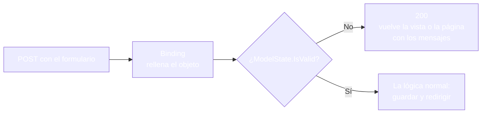
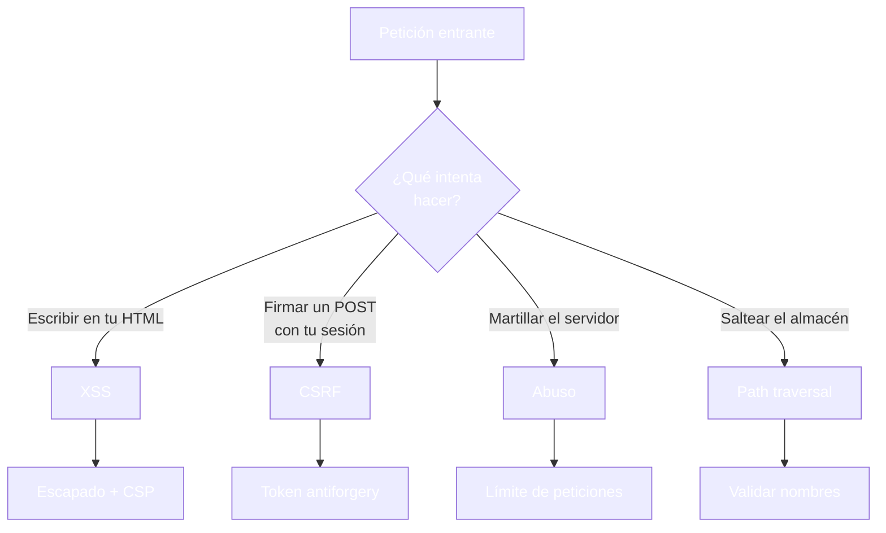

- [15. Validaciones, seguridad y ataques](#15-validaciones-seguridad-y-ataques)
  - [15.1. Validación en el servidor](#151-validación-en-el-servidor)
    - [15.1.1. DataAnnotations y ModelState](#1511-dataannotations-y-modelstate)
    - [15.1.2. Visión Razor Pages: validar y devolver la página](#1512-visión-razor-pages-validar-y-devolver-la-página)
    - [15.1.3. Visión MVC: validar y devolver la vista](#1513-visión-mvc-validar-y-devolver-la-vista)
    - [15.1.4. La misma validación, comparada](#1514-la-misma-validación-comparada)
    - [15.1.5. FluentValidation: reglas fuera del modelo](#1515-fluentvalidation-reglas-fuera-del-modelo)
    - [15.1.6. La alternativa funcional: result](#1516-la-alternativa-funcional-result)
  - [15.2. El mapa de ataques](#152-el-mapa-de-ataques)
  - [15.3. XSS y el escapado](#153-xss-y-el-escapado)
  - [15.4. CSRF y el token doble](#154-csrf-y-el-token-doble)
  - [15.5. Cabeceras de seguridad](#155-cabeceras-de-seguridad)
  - [15.6. Límite de peticiones](#156-límite-de-peticiones)
  - [15.7. Errores, tamaños y ficheros](#157-errores-tamaños-y-ficheros)
  - [15.8. Buenas prácticas](#158-buenas-prácticas)
  - [15.9. Reto: endurece la alta de Funkos](#159-reto-endurece-la-alta-de-funkos)
    - [15.9.1. Contexto](#1591-contexto)
    - [15.9.2. Modelo de datos](#1592-modelo-de-datos)
    - [15.9.3. Almacenamiento](#1593-almacenamiento)
    - [15.9.4. Retos](#1594-retos)


# 15. Validaciones, seguridad y ataques

> 💡 **Punto de partida:** Cuando intentas entrar en tu banca online con la contraseña equivocada tres veces, la web te bloquea el acceso un rato. Ese bloqueo no lo puso el navegador: lo puso el servidor, que no se fía de nadie. La seguridad de una aplicación es exactamente eso: asumir que cualquier petición puede venir de alguien con malas intenciones y defenderse antes de que llegue la lógica de negocio. En este punto aprendes a validar lo que llega y a cerrar las puertas por las que entran los ataques.

En este punto aprenderás el bloque de seguridad de la unidad: validación de datos en el servidor, el mapa de los ataques web y sus defensas, cabeceras de protección, límite de peticiones y manejo de errores. Las cuentas de usuario y la autenticación tienen su punto propio, el 19; aquí nos centramos en el servidor que se defiende.

**Objetivos de aprendizaje:**

- Validar en el servidor con DataAnnotations y `ModelState`, en página y en acción
- Conocer el mapa de ataques web y la defensa de cada uno
- Escribir un middleware de cabeceras de seguridad y otro de límite de peticiones
- Cortar las peticiones demasiado grandes antes de que lleguen a la lógica
- Distinguir la validación de datos de la validación de negocio con FluentValidation y el patrón Result

> 📝 **Nota:** seguimos con el repositorio en memoria del punto 03 y con `ProductosApp` en sus dos visiones. Los middlewares de este punto son agnósticos: funcionan igual para páginas y para controladores.

## 15.1. Validación en el servidor

### 15.1.1. DataAnnotations y ModelState

La validación empieza en el modelo de entrada: atributos declarativos que el binding y el motor entienden sin que escribas ni un `if`.

```csharp
// Models/ProductoInput.cs (las dos visiones comparten este modelo)
public class ProductoInput
{
    [Required(ErrorMessage = "El nombre es obligatorio")]
    [StringLength(50)]
    public string Nombre { get; set; } = string.Empty;

    [Range(2000, 2030, ErrorMessage = "El año debe estar entre 2000 y 2030")]
    public int Anio { get; set; }

    [Range(0.01, 10000, ErrorMessage = "El precio debe ser positivo")]
    public decimal Precio { get; set; }
}
```

| Atributo | Qué exige |
|----------|-----------|
| `[Required]` | El valor no puede quedar vacío |
| `[StringLength(50)]` | Longitud máxima del texto |
| `[Range(a, b)]` | El número dentro de un intervalo |

Después del binding, el motor rellena `ModelState`: si todo cuadra, `ModelState.IsValid` es `true`; si algo falla, el diccionario lleva un mensaje por cada campo erróneo. Quien decide qué hacer es tu código, y en las dos visiones el patrón es el mismo:



### 15.1.2. Visión Razor Pages: validar y devolver la página

En la página, quien comprueba es el `OnPost` y quien vuelve a pintar es `Page()`, la misma vista con los errores encima:

```csharp
public IActionResult OnPost()
{
    if (!ModelState.IsValid)
    {
        Eco = "Datos invalidos";
        return Page();   // la misma página, ahora con los errores
    }

    Eco = $"Nombre={Input.Nombre}; Anio={Input.Anio}; Precio={Input.Precio}";
    return Page();
}
```

Y los mensajes los pinta la propia vista con el Tag Helper de validación:

```cshtml
@* Cada span pinta el error de su campo *@
<div id="resumen">
    <span asp-validation-for="Input.Nombre"></span>
    <span asp-validation-for="Input.Anio"></span>
    <span asp-validation-for="Input.Precio"></span>
</div>
```

### 15.1.3. Visión MVC: validar y devolver la vista

En MVC, la misma comprobación vive en la acción y el retorno es `View()`; los mensajes los pide la vista con la clave exacta del `ModelState`:

```csharp
[HttpPost("productos/edicion")]
[ValidateAntiForgeryToken]
public IActionResult Edicion(ProductoInput input, List<string> etiquetas)
{
    if (!ModelState.IsValid)
    {
        ViewBag.Eco = "Datos invalidos";
        return View();
    }

    ViewBag.Eco = $"Nombre={input.Nombre}; Anio={input.Anio}; Precio={input.Precio}";
    return View();
}
```

```cshtml
@* La clave es el nombre del campo del formulario *@
<div id="resumen">
    @Html.ValidationMessage("Input.Nombre")
    @Html.ValidationMessage("Input.Anio")
    @Html.ValidationMessage("Input.Precio")
</div>
```

### 15.1.4. La misma validación, comparada

Y esto es lo que ocurre cuando envías un año imposible (`Input.Anio=1800`) en cualquiera de las dos visiones: la respuesta es **200** con el eco `Datos invalidos`, y el campo correspondiente pinta `El año debe estar entre 2000 y 2030` mientras los campos buenos se quedan vacíos. El navegador vuelve a ver el formulario entero, con los errores en su sitio.

> 💡 **Consejo:** el mensaje vive en el atributo (`ErrorMessage`), no en la vista: si mañana cambia la regla, se toca el modelo y las dos visiones se enteran a la vez, porque comparten `ProductoInput`.

### 15.1.5. FluentValidation: reglas fuera del modelo

Cuando las reglas crecen (fechas coherentes, categorías admitidas, campos condicionales), los atributos se quedan cortos. FluentValidation saca las reglas a una clase dedicada y las encadena con un lenguaje muy legible:

```csharp
public class ProductoInputValidator : AbstractValidator<ProductoInput>
{
    public ProductoInputValidator()
    {
        RuleFor(x => x.Nombre).NotEmpty().MaximumLength(50);
        RuleFor(x => x.Anio).InclusiveBetween(2000, 2030);
        RuleFor(x => x.Precio).GreaterThan(0);

        // Regla compuesta: el precio alto exige categoría concreta
        RuleFor(x => x.Categoria)
            .Must(c => c != "Descatalogados")
            .When(x => x.Precio > 100)
            .WithMessage("Los productos caros no van en Descatalogados");
    }
}
```

El validador se registra en la inyección de dependencias y se usa igual en las dos visiones: en la página, antes de `return Page()`; en la acción, antes de `return View()`. Las ventajas respecto a los atributos: reglas condicionales, mensajes agrupados y un modelo de entrada limpio de política de negocio.

### 15.1.6. La alternativa funcional: result

La tercera vía es no lanzar ni acumular errores en `ModelState`, sino devolver el resultado de la validación como un valor. El patrón `Result<T>` (del paquete `CSharpFunctionalExtensions`) lo envuelve todo:

```csharp
public static Result<ProductoInput> Validar(ProductoInput input)
{
    if (string.IsNullOrWhiteSpace(input.Nombre))
        return Result.Failure<ProductoInput>("El nombre es obligatorio");

    if (input.Anio is < 2000 or > 2030)
        return Result.Failure<ProductoInput>("El año debe estar entre 2000 y 2030");

    return Result.Success(input);
}
```

Y quien lo consume decide con un `Match`: camino feliz, camino de error, sin excepciones por el medio. Es la forma en que muchas aplicaciones profesionales separan "¿es válido?" de "¿qué hago con él?", y verás su uso completo en la unidad de arquitectura.

## 15.2. El mapa de ataques

Antes de las defensas, el mapa — estas son las amenazas que esta unidad te enseña a cerrar:

| Amenaza | Qué intenta el atacante | Defensa | Dónde vive |
|---------|--------------------------|---------|------------|
| **XSS** | Inyectar JavaScript en tu HTML | Escapado automático de Razor; nunca `Html.Raw` con datos de usuario | Punto 04 y 15.3 |
| **CSRF** | Enviar un POST desde otro sitio con tu sesión | Token antiforgery doble (campo + cookie) | Punto 13 y 15.4 |
| **Fuerza bruta / abuso** | Probar contraseñas o agotar el servidor | Límite de peticiones por ventana | 15.6 |
| **Path traversal** | Leer o escribir ficheros fuera del almacén con `..` | Validación de nombres en el servicio de ficheros | 15.7 y 16 |
| **Filtración de errores** | Provocar errores y leer el rastro interno | Manejo centralizado de excepciones | Punto 01 y 15.7 |
| **Denegación por tamaño** | Subir ficheros gigantes para llenar el disco | Techo de tamaño de la petición | 15.7 |
| **Clickjacking** | Montar tu web dentro de un iframe oculto | `X-Frame-Options` | 15.5 |



## 15.3. XSS y el escapado

El cross-site scripting consiste en convencer al servidor de que pinte, como si fuera tuyo, texto que escribió un atacante: `<script>robaCookies()</script>` en un campo de nombre. Razor ya te protege por defecto: todo lo que es `string` se escapa al pintarlo, y esa es la razón de que `@Model.Nombre` sea seguro aunque el usuario haya intentado meter HTML.

La única forma de romper esa protección es tú, con `Html.Raw` o `HtmlString`, que le dicen al servidor *"esto ya es HTML, no lo toques"*. La regla es tajante: HTML de tu plantilla, sí; texto que venga de un formulario, de la URL o de una base de datos, jamás. Y como segunda línea de defensa, las cabeceras del apartado 15.5 restringen lo que el navegador acepta ejecutar.

## 15.4. CSRF y el token doble

El cross-site request forgery consiste en que otra web envíe un POST a tu aplicación usando la cookie de sesión que el navegador guarda para ti. Tu servidor no distingue: la cookie llega y parece legítima.

La defensa es un secreto que solo conocen tu formulario y tu servidor: el **token antiforgery**. El Form Tag Helper lo inyecta como campo oculto en cada formulario, y el servidor exige que el campo y la cookie coincidan. Como ya viste en el punto 13, la diferencia entre visiones es quién lo exige: Razor Pages lo valida en todos sus POST; en MVC hay que declararlo con `[ValidateAntiForgeryToken]` en cada acción de escritura.

📌 **Ejemplo real:** Los bancos añaden una segunda comprobación más allá del token: un número de operación que solo sirve una vez. Es la misma familia de ideas: no basta con que la petición llegue de tu navegador, tiene que llegar con las credenciales del formulario correcto.

## 15.5. Cabeceras de seguridad

Los headers HTTP son la fachada de tu servidor: el navegador los lee antes de pintar nada y ajusta su comportamiento. Estos cinco son el equipo mínimo:

| Cabecera | Valor | Qué corta |
|----------|-------|-----------|
| `X-Content-Type-Options` | `nosniff` | Que el navegador "adivine" tipos y ejecute algo por accidente |
| `X-Frame-Options` | `DENY` | Que tu web se monte dentro de un iframe ajeno (clickjacking) |
| `X-XSS-Protection` | `1; mode=block` | El filtro XSS heredado de navegadores antiguos |
| `Referrer-Policy` | `strict-origin-when-cross-origin` | Que se filtre la URL completa a sitios de terceros |
| `Permissions-Policy` | `camera=(), microphone=(), ...` | Que las páginas pidan permisos del dispositivo |

Se aplican con un middleware propio, una clase corta que se registra en el pipeline del punto 01:

```csharp
// Middlewares/SecurityHeadersMiddleware.cs
public class SecurityHeadersMiddleware(RequestDelegate next)
{
    private readonly RequestDelegate _next = next;

    public async Task InvokeAsync(HttpContext context)
    {
        context.Response.Headers["X-Content-Type-Options"] = "nosniff";
        context.Response.Headers["X-Frame-Options"] = "DENY";
        context.Response.Headers["X-XSS-Protection"] = "1; mode=block";
        context.Response.Headers["Referrer-Policy"] = "strict-origin-when-cross-origin";
        await _next(context);
    }
}
```

```csharp
// Program.cs: antes de los endpoints, después de la autorización
app.UseMiddleware<SecurityHeadersMiddleware>();
```

Cualquier respuesta de la aplicación, página o acción, sale ya con las cuatro cabeceras; lo compruebas con las cabeceras de la petición en la pestaña Network del navegador o con `curl -i`.

> 💡 **Consejo:** el orden en el pipeline importa: las cabeceras se añaden antes de que el endpoint pinte, para que también las lleven las respuestas de error.

## 15.6. Límite de peticiones

Sin límite, cualquiera puede martillear tu servidor — un script probando contraseñas, un rastreador refrescando tu listado mil veces por minuto o un ataque dirigido a agotar recursos. El **límite de peticiones** (rate limiting) corta por ventana de tiempo: pasas el cupo y la respuesta es **429 Too Many Requests**.

Las reglas se diseñan por niveles, más estrictas donde más duele:

| Nivel | Ejemplo de regla | Por qué |
|-------|------------------|---------|
| General | 5 peticiones cada 10 segundos | Techo de cortesía para cualquiera |
| Escritura | 20 POST por minuto | Los POST cuestan más caros |
| Autenticación | 10 intentos por minuto | Fuerza bruta sobre contraseñas |

Un middleware propio de ventanas fijas cabe en pocas líneas:

```csharp
// Middlewares/RateLimitMiddleware.cs (extracto)
public async Task InvokeAsync(HttpContext context)
{
    var ip = context.Connection.RemoteIpAddress?.ToString() ?? "local";
    // ... cuenta las peticiones de esa IP en la ventana de 10 segundos ...

    if (cuenta > 5)
    {
        context.Response.StatusCode = StatusCodes.Status429TooManyRequests;
        context.Response.Headers["Retry-After"] = "10";
        return;   // ni se llega al endpoint
    }

    await _next(context);
}
```

En funcionamiento, seis peticiones seguidas devuelven **200, 200, 200, 200, 429, 429**, y la última lleva la cabecera `Retry-After: 10` para que el cliente sepa cuándo volver. Las respuestas bloqueadas ni siquiera llegan al endpoint: el trabajo del servidor se ahorra por completo.

Y como referencia de entorno, el middleware propio del apartado no es la única forma: ASP.NET Core trae el limitador en caja (`AddRateLimiting` con ventanas fijas por clave y `UseRateLimiter` en el conducto), y proyectos reales de referencia usan el paquete `AspNetCoreRateLimit`, que añade reglas por endpoint: cien peticiones cada quince segundos con carácter general, diez por minuto en las rutas de acceso y veinte por minuto en los `POST`, con el **429** y su mensaje. La idea es la misma que la del middleware: cupo, ventana y castigo; cambia de dónde sale la regla.

## 15.7. Errores, tamaños y ficheros

Tres defensas que cierran el mapa:

**Errores sin filtrar.** Cuando algo revienta, el usuario no debe ver el rastro interno: dónde vive el proyecto, qué línea falló, qué base de datos usa. El pipeline del punto 01 ya monta el middleware de excepciones (`UseExceptionHandler`) para que los errores salgan como página propia en desarrollo y como respuesta limpia en producción. La regla es sencilla: los detalles van al registro (logs), nunca a la respuesta.

**Techo de tamaño.** La validación ocurre dentro de la acción, pero la acción solo se ejecuta si la petición llega entera. El atributo `[RequestSizeLimit]` fija el máximo en bytes y el servidor corta antes: en nuestras ediciones, un formulario con un nombre de mil quinientos caracteres ni siquiera llega a la lógica y la respuesta es un **400** sin procesar nada.

```csharp
[HttpPost("productos/edicion")]
[ValidateAntiForgeryToken]
[RequestSizeLimit(800)]   // el formulario legítimo cabe con creces
public IActionResult Edicion(ProductoInput input, List<string> etiquetas)
```

**Nombres de fichero.** Quien sube un archivo puede intentar escribir fuera de tu almacén con un nombre como `../../appsettings.json`. La defensa es no confiar en ningún nombre: rechazar `..`, barras y contrabarras, exigir extensiones conocidas y comprobar el tamaño. Ese servicio completo lo montamos en el punto 16; aquí queda la idea — el nombre que llega del cliente es dato hostil hasta que lo validas.

## 15.8. Buenas prácticas

- **Valida en el servidor, siempre**: el navegador ayuda, pero el navegador lo controla el atacante
- **Un atributo, un mensaje**: cada regla lleva su `ErrorMessage` y vive en el modelo, no en la vista
- **El token antiforgery, sin excepciones**: automático en Pages, declarado en cada acción de escritura de MVC
- **Cabeceras en el pipeline**: un middleware propio que no depende de cada acción
- **Límite de peticiones por niveles**: general laxo, escritura y autenticación estrictas
- **Techo de tamaño antes que la lógica**: `[RequestSizeLimit]` en todo formulario o subida
- **Errores limpios en producción**: los detalles al registro, una página amable al usuario
- **Ningún nombre de fichero es de fiar**: valida extensión, tamaño y forma antes de tocar el disco

## 15.9. Reto: endurece la alta de Funkos

> Pásale la batería de seguridad al alta de tu tienda: validaciones, cabeceras, límites y techo de tamaño.

### 15.9.1. Contexto

**Paso 0:** parte de las altas del punto 13 en sus dos visiones (`FunkoApp` y `FunkoAppMvc`), con `Models/FunkoEditInput.cs` (del punto 14) y el repositorio de los apartados siguientes.

### 15.9.2. Modelo de datos

| Propiedad | Tipo | Obligatorio |
|-----------|------|:-----------:|
| `id` | int | Sí (autogenerado) |
| `nombre` | string | Sí |
| `categoria` | string | Sí |
| `anio` | int | Sí |
| `precioReferencia` | decimal | Sí |
| `imagen` | string? | No |
| `etiquetas` | List\<string\>? | No |
| `activo` | bool | Sí |
| `esNovedad` | bool | Sí |

### 15.9.3. Almacenamiento

```csharp
public static class RepositorioFunkos
{
    private static readonly List<Funko> Funkos = [ /* seis figuras */ ];

    public static IReadOnlyList<Funko> ObtenerTodos() => Funkos;
}
```

Rellena la lista con seis figuras de modo que haya activas y dadas de baja, novedades y no novedades, y las tres categorías.

### 15.9.4. Retos

**Pasos compartidos (las dos visiones):**

1. **En papel primero:** dibuja el mapa de ataques de tu alta: qué puede intentar alguien con el formulario y con qué defensa lo cortas
2. Añade a `FunkoEditInput` las validaciones: `[Required]` en nombre y categoría, `[Range(1900, 2030)]` en el año y `[Range(0.01, 10000)]` en el precio, cada una con su `ErrorMessage`
3. Envía un POST con el año a `1800` y comprueba que la respuesta es **200** con el mensaje del campo en la vista y que los campos buenos no se quejan
4. Crea el middleware `SecurityHeadersMiddleware` con las cuatro cabeceras del apartado 15.5 y regístralo en `Program.cs`; comprueba con **F12** o con `curl -i` que toda respuesta las lleva
5. Crea el middleware `RateLimitMiddleware` con la ventana de 5 peticiones cada 10 segundos; envía seis peticiones seguidas y comprueba que las dos últimas dan **429** con `Retry-After`

**Visión Razor Pages:**

6. Comprueba en `Pages/Productos/Alta.cshtml` que los mensajes salen con `asp-validation-for` y que el POST inválido devuelve `Page()` con el formulario entero
7. En la página de edición, añade `[RequestSizeLimit(800)]` al `PageModel` y envía un nombre de mil caracteres; comprueba que la petición se corta con **400** y que la acción no llega a ejecutarse

**Visión MVC:**

8. Comprueba en `Views/Productos/Alta.cshtml` que los mensajes salen con `Html.ValidationMessage` usando la clave exacta del campo (`"Edit.Nombre"`)
9. En la acción de escritura, añade `[RequestSizeLimit(800)]` junto a `[ValidateAntiForgeryToken]` y comprueba el mismo corte con **400**

**Puntos extra:**

- Sustituye tres atributos por un validador FluentValidation y comprueba que los mismos POST inválidos devuelven los mismos mensajes
- Escribe el patrón `Result<ProductoInput>` para tu alta y un `Match` que pinte la vista según el resultado
- Añade una regla compuesta: los productos con precio mayor de 100 no pueden ir en la categoría `Descatalogados`
- Documenta en un comentario del middleware por qué el límite de peticiones va antes de los endpoints

---

**Resumen del punto:**

| Concepto | Descripción |
|----------|-------------|
| **DataAnnotations** | `[Required]`, `[StringLength]`, `[Range]` declaran las reglas en el modelo |
| **ModelState** | Diccionario de errores que arma el motor tras el binding |
| **`ModelState.IsValid`** | La puerta: falso devuelve la vista o la página con los mensajes |
| **Mensajes por campo** | `asp-validation-for` en Pages; `Html.ValidationMessage` con la clave en MVC |
| **FluentValidation** | Reglas encadenadas en una clase propia, con condiciones y mensajes agrupados |
| **Result\<T\>** | La validación como valor: camino feliz y camino de error sin excepciones |
| **XSS** | Inyección de scripts; la defensa es el escapado de Razor y no usar `Html.Raw` |
| **CSRF** | POST foráneo con tu sesión; la defensa es el token doble |
| **Cabeceras** | Middleware propio: `nosniff`, `DENY`, `X-XSS-Protection`, `Referrer-Policy` |
| **Límite de peticiones** | Ventana por IP y nivel; el cupo se paga con **429** y `Retry-After` |
| **`[RequestSizeLimit]`** | Corta la petición antes de la lógica: **400** sin procesar nada |
| **Comprobado** | Año inválido **200** con mensaje; seis peticiones **200×4 y 429×2**; nombre gigante **400** |

**¿Qué viene después?**

En el siguiente punto subimos la apuesta con los ficheros: cómo recibe el servidor un archivo binario, dónde lo guarda y cómo evitar que un nombre malicioso se salga del almacén.
