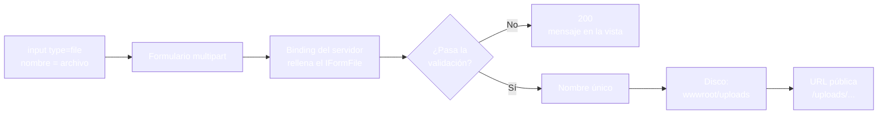
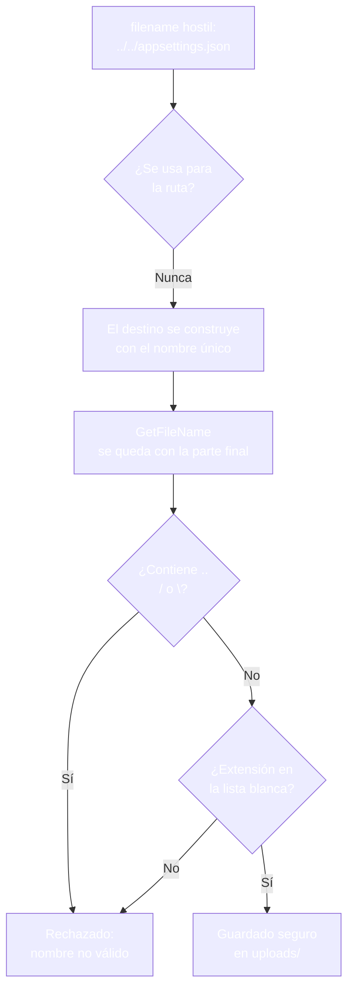

- [16. Subida y almacenamiento de ficheros](#16-subida-y-almacenamiento-de-ficheros)
  - [16.1. El formulario con fichero](#161-el-formulario-con-fichero)
  - [16.2. La misma subida en las dos visiones](#162-la-misma-subida-en-las-dos-visiones)
    - [16.2.1. Visión Razor Pages: OnPost con IFormFile](#1621-visión-razor-pages-onpost-con-iformfile)
    - [16.2.2. Visión MVC: la acción que recibe el fichero](#1622-visión-mvc-la-acción-que-recibe-el-fichero)
    - [16.2.3. La misma subida, comparada](#1623-la-misma-subida-comparada)
  - [16.3. El servicio de almacenamiento](#163-el-servicio-de-almacenamiento)
    - [16.3.1. Validar antes de guardar](#1631-validar-antes-de-guardar)
    - [16.3.2. Nombre único](#1632-nombre-único)
    - [16.3.3. El almacén configurable](#1633-el-almacén-configurable)
  - [16.4. Contra el path traversal](#164-contra-el-path-traversal)
  - [16.5. Servir los ficheros subidos](#165-servir-los-ficheros-subidos)
  - [16.6. Descargas con file](#166-descargas-con-file)
  - [16.7. Límites de la subida](#167-límites-de-la-subida)
  - [16.8. La estructura del proyecto: dónde va cada cosa](#168-la-estructura-del-proyecto-dónde-vae-cada-cosa)
  - [16.9. El formulario completo en las dos visiones](#169-el-formulario-completo-en-las-dos-visiones)
    - [16.9.1. Visión Razor Pages: el alta completa](#1691-visión-razor-pages-el-alta-completa)
    - [16.9.2. Visión MVC: el alta completa](#1692-visión-mvc-el-alta-completa)
    - [16.9.3. Todos los datos procesados, comparado](#1693-todos-los-datos-procesados-comparado)
  - [16.10. Buenas prácticas](#1610-buenas-prácticas)
  - [16.11. Reto: la imagen de los Funkos](#1611-reto-la-imagen-de-los-funkos)
    - [16.11.1. Contexto](#16111-contexto)
    - [16.11.2. Modelo de datos](#16112-modelo-de-datos)
    - [16.11.3. Almacenamiento](#16113-almacenamiento)
    - [16.11.4. Retos](#16114-retos)


# 16. Subida y almacenamiento de ficheros

> 💡 **Punto de partida:** Cuando subes una foto de perfil en Instagram, la app recibe la imagen, la guarda en sus servidores bajo una dirección que nadie adivina y te devuelve una URL que después carga cualquiera. Detrás de ese gesto hay tres decisiones que se repiten en todo proyecto: qué ficheros acepto, dónde los guardo y cómo se llaman. En este punto construyes ese sistema en tus dos visiones.

En este punto aprenderás la subida de ficheros de principio a fin: el formulario multipart, el `IFormFile`, el servicio de almacenamiento con validación y nombre único, la defensa contra el path traversal, el servicio de los ficheros subidos y las descargas con `File`.

**Objetivos de aprendizaje:**

- Montar un formulario multipart y recibir el fichero como `IFormFile` en página y en acción
- Construir un servicio de almacenamiento que valide, nombre y guarde
- Defender el almacén contra el path traversal y las extensiones hostiles
- Servir los ficheros subidos desde `wwwroot/uploads` y descargarlos con `File`
- Aplicar techos de tamaño y listas de extensiones admitidas

> 📝 **Nota:** seguimos con `ProductosApp` en sus dos visiones. El servicio de almacenamiento es común: las dos visiones llaman al mismo código, como en el resto de la unidad.

## 16.1. El formulario con fichero

Un fichero no viaja como texto: **viaja como bytes**, y el formulario necesita avisar de eso. La clave son dos piezas:

- El atributo `enctype="multipart/form-data"` en el `<form>`: le dice al navegador que empaquete los campos como un sobre multipart en vez de como una tira de texto.
- El campo `<input type="file">`: la casilla que el usuario usa para elegir el fichero; su `name` es, como siempre, la llave del binding.

```html
<form method="post" enctype="multipart/form-data">
    <label for="archivo">Imagen</label>
    <input id="archivo" name="archivo" type="file" accept="image/*" />
    <button type="submit">Subir</button>
</form>
```

Quien recibe el fichero en el servidor es el `IFormFile`: una interfaz que representa el archivo subido y expone lo esencial (`FileName`, `Length`, `ContentType` y el stream para leerlo). El binding la aplica sola: declaras `IFormFile archivo` (como parámetro del `OnPost` o de la acción) y el campo `name="archivo"` cae en ella.



> ⚠️ **Advertencia:** sin `enctype="multipart/form-data"` el navegador envía el formulario como texto y el servidor recibe un campo vacío. Es el error número uno de las primeras subidas: el formulario "funciona" y el `IFormFile` llega a `null`.

## 16.2. La misma subida en las dos visiones

El mismo formulario de subida, montado dos veces. El fichero se llama `archivo` en las dos; cambia quién lo recibe.

### 16.2.1. Visión Razor Pages: OnPost con IFormFile

La página vive en `Pages/Productos/Subir.cshtml`, con el `multipart` del apartado anterior; el `PageModel` recibe el fichero como parámetro del handler:

```csharp
// Pages/Productos/Subir.cshtml.cs (extracto)
public class SubirModel : PageModel
{
    private static string _ultimo = "(nada todavía)";

    public string Ultimo => _ultimo;

    public IActionResult OnPost(IFormFile? archivo)
    {
        var (ok, mensaje, ruta) = AlmacenFicheros.Guardar(archivo, "productos");
        if (!ok)
        {
            Mensaje = mensaje;
            return Page();   // el error se cuenta en la propia página
        }

        _ultimo = ruta;
        return RedirectToPage();   // PRG: el GET siguiente muestra la ruta
    }
}
```

### 16.2.2. Visión MVC: la acción que recibe el fichero

La misma vista como `Views/Productos/Subir.cshtml`, con el formulario apuntado por Tag Helpers; la acción recibe el fichero con la misma forma:

```csharp
// Controllers/ProductosController.cs (extracto)
[HttpGet("productos/subir")]
public IActionResult Subir() => View();

[HttpPost("productos/subir")]
[ValidateAntiForgeryToken]
public IActionResult Subir(IFormFile? archivo)
{
    var (ok, mensaje, ruta) = AlmacenFicheros.Guardar(archivo, "productos");
    ViewBag.Mensaje = ok ? "Subido" : mensaje;

    if (ok)
    {
        _ultimoSubido = ruta;
    }

    return RedirectToAction("Subir");   // PRG como en la página
}
```

### 16.2.3. La misma subida, comparada

| | Página Razor Pages | Acción MVC |
|---|---|---|
| **El campo del formulario** | `name="archivo"` con `multipart/form-data` | Idéntico, con `asp-controller` y `asp-action` |
| **Quién recibe el fichero** | Parámetro `IFormFile? archivo` del `OnPost` | Parámetro `IFormFile? archivo` de la acción |
| **El fichero sin elegir** | Llega a `null` y el servicio lo rechaza | Llega a `null` y el servicio lo rechaza |
| **Protección del POST** | El token se exige solo | `[ValidateAntiForgeryToken]` |
| **Confirmación** | `RedirectToPage()` → **302** a la propia página | `RedirectToAction("Subir")` → **302** al listado de subida |
| **El servicio de guardado** | El mismo `AlmacenFicheros.Guardar` | El mismo `AlmacenFicheros.Guardar` |

El formulario multipart y el `IFormFile` no cambian entre visiones; lo único que cambia es la firma que los recibe y el resultado de PRG.

## 16.3. El servicio de almacenamiento

El guardado no se improvisa en el handler: se concentra en un servicio que las dos visiones comparten. Su trabajo es validar, dar nombre y escribir en disco.

### 16.3.1. Validar antes de guardar

**Nada llega al disco sin pasar por la puerta.** La validación cubre lo esencial:

| Comprobación | Motivo |
|--------------|--------|
| El fichero existe y tiene tamaño | Un campo vacío no es un fichero |
| Tamaño dentro del techo | Nadie llena tu disco con una subida |
| Extensión admitida | Solo imágenes entra en un almacén de imágenes |
| Forma del nombre | Sin barras ni puntos dobles (apartado 16.4) |

```csharp
public static (bool Ok, string Mensaje, string Ruta) Guardar(IFormFile? archivo, string carpeta)
{
    if (archivo is null || archivo.Length == 0)
        return (false, "El archivo está vacío", string.Empty);

    if (archivo.Length > 5 * 1024 * 1024)
        return (false, "El archivo es demasiado grande", string.Empty);

    var nombre = Path.GetFileName(archivo.FileName);
    if (nombre.Contains("..") || nombre.Contains('/') || nombre.Contains('\\'))
        return (false, "El nombre no es válido", string.Empty);

    var extension = Path.GetExtension(nombre).ToLowerInvariant();
    if (!Extensiones.Contains(extension))
        return (false, "La extensión no está permitida", string.Empty);

    // ... guardado con nombre único ...
}
```

### 16.3.2. Nombre único

Nunca se guarda el fichero con su nombre original: dos fotos llamadas `foto.jpg` se pisarían — y un nombre elegido por el usuario es un regalo para el atacante. El patrón profesional combina marca temporal, guion corto y el nombre saneado:

```csharp
var unico = $"{DateTime.UtcNow:yyyyMMddHHmmss}" +
            $"_{Guid.NewGuid().ToString("N")[..8]}" +
            $"_{Path.GetFileNameWithoutExtension(nombre)}{extension}";
```

El resultado es un nombre como `20261003220843_dc66fe7f_foto.jpg`: legible para ti en el servidor, imposible de pisar y sin dejar que el usuario mande en la ruta.

📌 **Ejemplo real:** Cuando subes una foto a cualquier servicio y luego copias su dirección, la URL lleva una firma larga e imposible de adivinar en el nombre del fichero. Ese desorden calculado es exactamente el patrón de nombre único.

### 16.3.3. El almacén configurable

En un proyecto de verdad, la carpeta del almacén y los techos no se escriben en el código: se configuran. La sección `Storage` del `appsettings.json` fija la ruta relativa dentro de `wwwroot` y los límites, y el servicio los lee al arrancar:

```json
{
  "Storage": {
    "UploadPath": "uploads",
    "MaxFileSize": 5242880,
    "AllowedExtensions": [ ".jpg", ".jpeg", ".png", ".gif" ]
  }
}
```

```csharp
// El servicio resuelve su raíz con la configuración y el entorno web
_uploadPath = configuration["Storage:UploadPath"] ?? "uploads";
_maxFileSize = configuration.GetValue<long>("Storage:MaxFileSize", 5 * 1024 * 1024);
_rootPath = Path.Combine(env.WebRootPath, _uploadPath);
Directory.CreateDirectory(_rootPath);
```

Así, el mismo servicio funciona en desarrollo y en producción solo cambiando la configuración, que es donde vive la responsabilidad de decidir dónde guarda cada aplicación.

## 16.4. Contra el path traversal

El ataque más clásico de las subidas no es el fichero: es el nombre. Un campo `filename=../../appsettings.json` intenta salir del almacén y escribir encima de la configuración. La defensa se mide en tres capas:

1. **No usar el nombre para la ruta:** el destino se construye siempre con el nombre único, nunca concatenando lo que llegó del cliente.
2. **Inspeccionar el nombre:** rechazar `..`, `/` y `\` con `Path.GetFileName`, que además se queda solo con la parte final del nombre.
3. **Exigir la extensión:** una lista blanca de extensiones admitidas.

Y una defensa más profunda para cuando quieras ir más allá de la extensión: los **magic numbers**, las primeras bytes que identifican el tipo real del fichero. Un `.jpg` de verdad empieza por `FF D8 FF`; renombrar un ejecutable a `foto.jpg` no cambia sus primeros bytes:



```csharp
// Firma real de un JPEG
private static readonly byte[] JpegFirma = [0xFF, 0xD8, 0xFF];

static bool EsJpeg(IFormFile archivo)
{
    using var lector = new BinaryReader(archivo.OpenReadStream());
    var cabecera = lector.ReadBytes(3);
    return cabecera.SequenceEqual(JpegFirma);
}
```

En las dos visiones de `ProductosApp`, un fichero llamado `../../appsettings.json` no sale del almacén: el servicio lo sanea, lo guarda con su nombre único dentro de `uploads/productos/` y la configuración del proyecto sigue intacta.

## 16.5. Servir los ficheros subidos

Los ficheros se guardan en `wwwroot/uploads/`, y `wwwroot` es la única carpeta que el servidor web sirve como estática. Con los activos del proyecto ya puestos en su sitio (el punto 06 vio la huella y el fingerprinting), un fichero subido queda disponible en su URL relativa:

```text
Subida:    /uploads/productos/20261003220843_dc66fe7f_foto.jpg
Navegador: GET /uploads/productos/20261003220843_dc66fe7f_foto.jpg → 200
```

La comprobación es directa: subes, copias la ruta que devuelve el servicio y abres esa dirección; el estático la sirve con **200**. Esa misma URL es la que luego pones en la vista (``) para que la imagen aparezca donde toca.

> 💡 **Consejo:** el almacén de subidas vive dentro de `wwwroot` para poder servirlo, pero solo tu código debe escribir ahí dentro — los ficheros que pide el navegador y los que guarda tu servidor son mundos distintos, aunque compartan carpeta.

## 16.6. Descargas con file

A veces el fichero no se muestra: **se entrega**. Los action results de descarga ya los conoces del catálogo del punto 08; el más directo es `PhysicalFile`, que entrega un fichero del disco con su nombre:

```csharp
// Controllers/ProductosController.cs (extracto)
[HttpGet("productos/descargar")]
public IActionResult Descargar()
{
    var carpeta = Path.Combine(Directory.GetCurrentDirectory(), "wwwroot", "uploads", "productos");
    var fichero = Directory.GetFiles(carpeta).FirstOrDefault();
    if (fichero is null)
    {
        return NotFound();
    }

    return PhysicalFile(fichero, "application/octet-stream", Path.GetFileName(fichero));
}
```

La respuesta llega con **200**, el `Content-Type` del fichero y la cabecera `Content-Disposition: attachment; filename=...`, que le dice al navegador que abra el diálogo de guardado en vez de pintar la imagen. En Razor Pages el mismo resultado `PhysicalFile` está disponible en el `PageModel`, con idéntica firma.

## 16.7. Límites de la subida

La subida es la puerta más ancha de la aplicación — se cierra con los mismos techos del punto 15:

- **Techo por petición:** `[RequestSizeLimit(10 * 1024 * 1024)]` en el `PageModel` o en la acción corta la petición antes de la lógica. Una subida de once megabytes contra ese techo ni llega al servicio.
- **Techo por fichero:** la comprobación de `Length` dentro del servicio, con el mensaje propio.
- **Lista blanca de extensiones** y, si el proyecto lo necesita, la comprobación de firma.

Los tres se apilan: el techo de la petición corta el envío, el del servicio corta el archivo y la lista decide qué tipos tienen permiso.

## 16.8. La estructura del proyecto: dónde va cada cosa

Llevas quince puntos creando piezas sueltas: modelos, repositorios, ViewModels, mappers, middlewares, servicios. Este es el mapa que las ordena, y es el mismo que usa cualquier proyecto ASP.NET Core de curso:

```text
ProductosApp/
├── Program.cs                 ← pipeline: servicios, middlewares, endpoints
├── appsettings.json           ← configuración (Storage, cadenas, entornos)
├── Models/                    ← entidades y modelos de entrada
├── Repositories/              ← de dónde salen los datos (en memoria, de momento)
├── Services/                  ← lógica compartida: AlmacenFicheros
├── ViewModels/                ← la forma que pide cada vista
├── Mappers/                   ← conversión entidad ↔ ViewModel
├── Helpers/                   ← utilidades sin hogar propio
├── Middlewares/               ← SecurityHeaders, RateLimit
├── Pages/                     ← visión Razor Pages (o Views/ en MVC)
│   ├── _ViewImports.cshtml
│   ├── _ViewStart.cshtml
│   ├── Shared/_Layout.cshtml
│   └── Productos/
├── Views/                     ← visión MVC (si conviven, coexisten)
│   └── Productos/
└── wwwroot/                   ← lo único que el navegador puede pedir
    ├── css/  js/  lib/        ← activos de la aplicación (con huella)
    └── uploads/productos/     ← ficheros subidos por los usuarios
```

| Carpeta | Qué vive aquí | Desde el punto |
|---------|---------------|----------------|
| `Models/` | Entidades y modelos de entrada | 02 y 14 |
| `Repositories/` | El origen de los datos | 03 |
| `ViewModels/` y `Mappers/` | La forma de cada vista y su conversión | 09 |
| `Services/` | Lógica compartida: el almacenamiento de ficheros | 16 |
| `Middlewares/` | Cabeceras de seguridad y límite de peticiones | 15 |
| `Pages/` o `Views/` | Las dos visiones de la interfaz | 10 y 07 |
| `wwwroot/uploads/` | Los ficheros que suben los usuarios | 16 |
| `appsettings.json` | Rutas, techos y extensiones del almacén | 16 y 20 |

> 📝 **Nota:** la configuración por capas (`appsettings.json`, variables de entorno, user secrets) y los entornos de desarrollo y producción se abren en el punto 20; aquí te basta con saber dónde cae cada cosa.

## 16.9. El formulario completo en las dos visiones

Toca juntarlo todo: un alta de producto con los seis tipos de campo que has visto en la unidad (texto, selección, número, decimal, casilla y fichero), con las validaciones del punto 15 y el servicio de ficheros de este punto. Es la vista que cualquier tienda real monta para dar de alta un producto, y queda como la referencia de cómo se procesan todos los datos de una vez.

El modelo de entrada, compartido por las dos visiones, acumula las validaciones:

```csharp
// Models/ProductoAlta.cs
public class ProductoAlta
{
    [Required(ErrorMessage = "El nombre es obligatorio")]
    [StringLength(50)]
    public string Nombre { get; set; } = string.Empty;

    public string Categoria { get; set; } = string.Empty;

    [Range(2000, 2030, ErrorMessage = "El año debe estar entre 2000 y 2030")]
    public int Anio { get; set; }

    [Range(0.01, 10000, ErrorMessage = "El precio debe ser positivo")]
    public decimal Precio { get; set; }

    public bool EsNovedad { get; set; }
}
```

### 16.9.1. Visión Razor Pages: el alta completa

La página `Pages/Productos/Completa.cshtml` trae el formulario multipart con los seis campos y las validaciones; el `PageModel` procesa en el orden fijo: binding, validación, fichero y PRG:

```csharp
// Pages/Productos/Completa.cshtml.cs (extracto)
[BindProperty]
public ProductoAlta Input { get; set; } = new();

[BindProperty]
public List<string> Etiquetas { get; set; } = [];

public IActionResult OnPost(IFormFile? imagen)
{
    if (!ModelState.IsValid)
    {
        Mensaje = "Datos invalidos";
        return Page();
    }

    var (ok, mensaje, ruta) = AlmacenFicheros.Guardar(imagen, "productos");
    if (!ok)
    {
        Mensaje = mensaje;
        return Page();
    }

    var sello = Input.EsNovedad ? "Novedad" : "Clasico";
    _ultimo = $"{Input.Nombre} · {Input.Categoria} · {Input.Anio} · " +
              $"{Input.Precio} · {sello} · [{string.Join(", ", Etiquetas)}] · {ruta}";
    return RedirectToPage();
}
```

### 16.9.2. Visión MVC: el alta completa

La misma vista como `Views/Productos/Completa.cshtml` y la acción con los cuatro destinos: el modelo, la colección, el fichero y la protección:

```csharp
// Controllers/ProductosController.cs (extracto)
[HttpPost("productos/completa")]
[ValidateAntiForgeryToken]
[RequestSizeLimit(10 * 1024 * 1024)]
public IActionResult Completa(ProductoAlta input, List<string> etiquetas, IFormFile? imagen)
{
    if (!ModelState.IsValid)
    {
        ViewBag.Mensaje = "Datos invalidos";
        return View();
    }

    var (ok, mensaje, ruta) = AlmacenFicheros.Guardar(imagen, "productos");
    if (!ok)
    {
        ViewBag.Mensaje = mensaje;
        return View();
    }

    var sello = input.EsNovedad ? "Novedad" : "Clasico";
    _ultimoCompleto = $"{input.Nombre} · {input.Categoria} · {input.Anio} · " +
                      $"{input.Precio} · {sello} · [{string.Join(", ", etiquetas ?? [])}] · {ruta}";
    return RedirectToAction("Completa");
}
```

### 16.9.3. Todos los datos procesados, comparado

La tabla de lo que viaja en un solo envío:

| Campo | Tipo de dato | Cómo llega al servidor |
|-------|--------------|------------------------|
| Nombre | texto | `Input.Nombre` con `[Required]` |
| Categoría | selección | `Input.Categoria` desde el `select` |
| Año | número entero | `Input.Anio` con `[Range]` |
| Precio | decimal | `Input.Precio` con `[Range]` |
| Novedad | casilla | `Input.EsNovedad` con `value="true"` |
| Etiquetas | colección | `etiquetas` repetido → `List<string>` |
| Imagen | fichero | `imagen` → `IFormFile` → nombre único en disco |

Y el resultado en las dos visiones es palabra por palabra el mismo: tras el envío válido, el **302** de PRG y el alta pintada como `Teclado Mecanico · Electrónica · 2022 · 39,95 · Novedad · [oferta, nuevo] · /uploads/productos/20261003221648_419410b4_foto.jpg`; con el nombre vacío, **200** con el eco `Datos invalidos` y el mensaje `El nombre es obligatorio` pintado en su campo.

> 💡 **Consejo:** cuando una vista reúne tantos tipos de campo, el orden del procesamiento es fijo y lo tienes todo aquí: binding primero, validación después, fichero al final y PRG para cerrar. Si algo falla, se vuelve a pintar el formulario con el error en su sitio; solo el camino feliz redirige.

## 16.10. Buenas prácticas

- **`multipart/form-data` siempre**: sin él, el `IFormFile` llega vacío y no sabes por qué
- **Un servicio, dos visiones**: el guardado vive en una clase; los handlers solo llaman
- **Nunca el nombre del usuario para la ruta**: marca temporal, guion corto y nombre saneado
- **Valida antes de tocar el disco**: vacío, tamaño, extensión y forma del nombre
- **Extensión no es contenido**: si el almacén es de imágenes, comprueba las firmas (magic numbers)
- **`wwwroot` es de solo lectura para el usuario**: la escritura la hace tu servidor, en su carpeta de subidas
- **Techos apilados**: `[RequestSizeLimit]` en el endpoint y `Length` en el servicio
- **Descarga con `PhysicalFile` o `File`**: con su `Content-Type` y su `Content-Disposition`, nunca sirvas binarios como HTML

## 16.11. Reto: la imagen de los Funkos

> Añade la foto a tu tienda: formulario multipart, servicio de almacenamiento y descarga, en las dos visiones.

### 16.11.1. Contexto

**Paso 0:** parte de las altas del punto 15 en sus dos visiones (`FunkoApp` y `FunkoAppMvc`). El campo `imagen` del modelo guarda la ruta pública del fichero, por ejemplo `/uploads/productos/20261003220843_dc66fe7f_funko.jpg`.

### 16.11.2. Modelo de datos

| Propiedad | Tipo | Obligatorio |
|-----------|------|:-----------:|
| `id` | int | Sí (autogenerado) |
| `nombre` | string | Sí |
| `categoria` | string | Sí |
| `anio` | int | Sí |
| `precioReferencia` | decimal | Sí |
| `imagen` | string? | No |
| `etiquetas` | List\<string\>? | No |
| `activo` | bool | Sí |
| `esNovedad` | bool | Sí |

### 16.11.3. Almacenamiento

```csharp
public static class RepositorioFunkos
{
    private static readonly List<Funko> Funkos = [ /* seis figuras */ ];

    public static IReadOnlyList<Funko> ObtenerTodos() => Funkos;
}
```

Rellena la lista con seis figuras de modo que haya activas y dadas de baja, novedades y no novedades, y las tres categorías.

### 16.11.4. Retos

**Pasos compartidos (las dos visiones):**

1. **En papel primero:** dibuja el viaje de la foto: del `<input type="file">` al disco y de vuelta a la vista, con todas las validaciones en el camino
2. Escribe el servicio `AlmacenFicheros.Guardar(IFormFile?, string carpeta)` con las cuatro validaciones del apartado 16.3.1 y el nombre único del 16.3.2; guárdalo en una carpeta de servicios compartida
3. Añade a `appsettings.json` la sección `Storage` con `UploadPath`, `MaxFileSize` y `AllowedExtensions`, y haz que el servicio la lea
4. Sube un fichero válido y comprueba que el nombre guardado lleva marca temporal y guion corto; sube el mismo fichero otra vez y comprueba que el segundo nombre es distinto
5. Sube un fichero con nombre `../../appsettings.json` y comprueba que el almacén lo sanea y que tu `appsettings.json` sigue intacto
6. Sube un `.exe` y comprueba el mensaje de extensión no permitida

**Visión Razor Pages:**

7. Crea `Pages/Productos/Subir.cshtml` con `@page "/productos/subir"`, el formulario multipart y su `SubirModel` con `OnPost(IFormFile? archivo)` que guarda y devuelve `RedirectToPage()`; el `OnGet` muestra el último fichero subido
8. Comprueba que el fichero subido se sirve con **200** en su URL `/uploads/productos/...`

**Visión MVC:**

9. Crea `Views/Productos/Subir.cshtml` con `<form asp-controller="Productos" asp-action="Subir" enctype="multipart/form-data">` y las dos acciones `Subir`, con `[ValidateAntiForgeryToken]` y `[RequestSizeLimit(10 * 1024 * 1024)]` en la de escritura
10. Añade la acción `Descargar` con `PhysicalFile` y comprueba que la respuesta sale con `Content-Type` y `Content-Disposition: attachment`
11. Sube un fichero de once megabytes y comprueba que el techo lo corta antes de llegar al servicio

**Puntos extra:**

- Añade la comprobación de magic numbers para JPEG y PNG y prueba a subir un `.exe` renombrado a `.jpg`
- Muestra la imagen en la vista de detalle con `` y comprueba que se pinta desde `/uploads/...`
- Cambia `UploadPath` en `appsettings.json`, reinicia y comprueba que las subidas nuevas caen en la carpeta nueva
- Borra un fichero desde el servicio (`DeleteFileAsync`) y comprueba que su URL pasa a dar **404**

---

**Resumen del punto:**

| Concepto | Descripción |
|----------|-------------|
| **`multipart/form-data`** | El `enctype` sin el cual el `IFormFile` llega vacío |
| **`IFormFile`** | El fichero subido: nombre, tamaño, tipo y stream |
| **Servicio de almacenamiento** | Una clase común que valida, nombra y guarda |
| **Nombre único** | Marca temporal + guion corto + nombre saneado |
| **`appsettings: Storage`** | Ruta, techos y extensiones fuera del código |
| **Path traversal** | El nombre hostil se corta con `GetFileName` y la lista blanca |
| **Magic numbers** | Las primeras bytes delatan el tipo real del fichero |
| **`wwwroot/uploads`** | Los subidos se sirven como estáticos: **200** en su URL |
| **`PhysicalFile`** | Descarga con `Content-Type` y `Content-Disposition` |
| **Techos apilados** | `[RequestSizeLimit]` en el endpoint y `Length` en el servicio |
| **Doble visión** | La misma subida con `OnPost(IFormFile)` y con acción `Subir(IFormFile)` |
| **Comprobado** | Nombres únicos, traversal saneado, `.exe` rechazado, descarga **200**, 11 MB **400** |

**¿Qué viene después?**

En el siguiente punto abordamos la gestión del estado: qué recuerda la aplicación entre peticiones, dónde vive cada tipo de memoria y cómo evitar que dos usuarios se pisen los datos.
