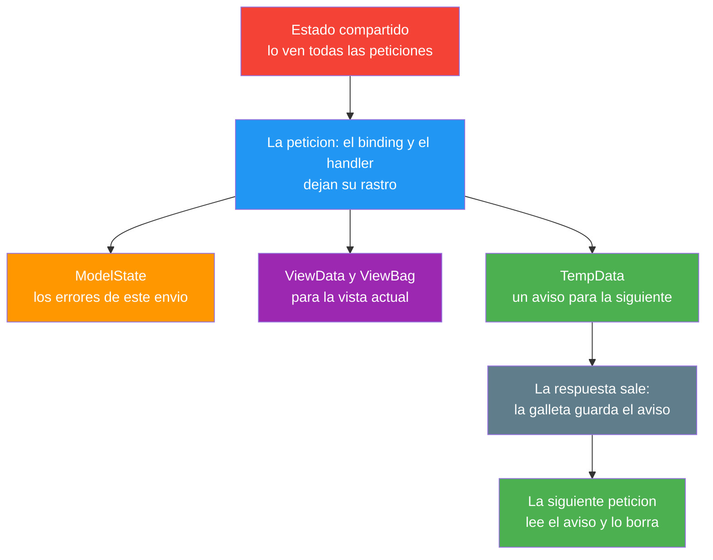
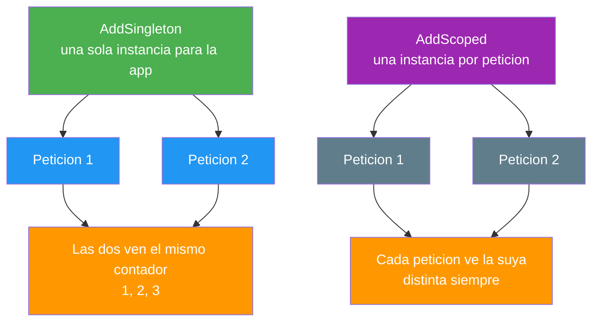

- [17. Gestión del Estado de la Aplicación](#17-gestión-del-estado-de-la-aplicación)
  - [17.1. El Mapa del Estado en una Petición](#171-el-mapa-del-estado-en-una-petición)
  - [17.2. ViewData y ViewBag en las Dos Visiones](#172-viewdata-y-viewbag-en-las-dos-visiones)
    - [17.2.1. Visión Razor Pages: ViewData en el PageModel](#1721-visión-razor-pages-viewdata-en-el-pagemodel)
    - [17.2.2. Visión MVC: ViewData y ViewBag en la Acción](#1722-visión-mvc-viewdata-y-viewbag-en-la-acción)
    - [17.2.3. ViewData y ViewBag, Comparados](#1723-viewdata-y-viewbag-comparados)
  - [17.3. TempData: el Aviso que Cruza el Redirect](#173-tempdata-el-aviso-que-cruza-el-redirect)
    - [17.3.1. Visión Razor Pages: TempData con PRG](#1731-visión-razor-pages-tempdata-con-prg)
    - [17.3.2. Visión MVC: TempData con PRG](#1732-visión-mvc-tempdata-con-prg)
    - [17.3.3. Peek y Keep: Leer sin Consumir](#1733-peek-y-keep-leer-sin-consumir)
    - [17.3.4. El Aviso en las Dos Visiones, Comparado](#1734-el-aviso-en-las-dos-visiones-comparado)
  - [17.4. ModelState: el Estado de la Última Validación](#174-modelstate-el-estado-de-la-última-validación)
  - [17.5. El Estado Compartido de la Aplicación](#175-el-estado-compartido-de-la-aplicación)
    - [17.5.1. Almacenamientos Estáticos y Singleton](#1751-almacenamientos-estáticos-y-singleton)
    - [17.5.2. Ciclos de Vida en la Inyección de Dependencias](#1752-ciclos-de-vida-en-la-inyección-de-dependencias)
    - [17.5.3. La Regla de Aislamiento](#1753-la-regla-de-aislamiento)
  - [17.6. Reglas de Seguridad del Estado](#176-reglas-de-seguridad-del-estado)
  - [17.7. Buenas Prácticas](#177-buenas-prácticas)
  - [17.8. Reto: El Estado de la Tienda de Funkos](#178-reto-el-estado-de-la-tienda-de-funkos)
    - [17.8.1. Contexto](#1781-contexto)
    - [17.8.2. Modelo de datos](#1782-modelo-de-datos)
    - [17.8.3. Almacenamiento](#1783-almacenamiento)
    - [17.8.4. Retos](#1784-retos)


# 17. Gestión del Estado de la Aplicación

> 💡 **Punto de partida:** Cambias el idioma de tu cuenta en Netflix, la página se recarga y, sobre el catálogo, aparece el aviso "Tu idioma se ha actualizado". Si pulsas F5, el aviso ya no está. Ese mensaje vivió dos peticiones: la que lo escribió y la que lo pintó, y alguien lo borró después. La pregunta de este punto es la de siempre con HTTP: ¿qué recuerda una aplicación web, cuánto dura cada recuerdo y dónde tiene que vivir cada dato para que dos usuarios no se pisen?

En este tema ordenamos la memoria de `ProductosApp`: dónde vive cada trozo de estado entre peticiones (ViewData, ViewBag, TempData, ModelState), qué se comparte con todos los usuarios y cómo se evita que lo de uno acabe a la vista de otro. La persistencia de verdad entre peticiones, con cookies y sesión, tiene punto propio: el punto 18.

**Objetivos de aprendizaje:**

- Situar cada almacén de estado y saber cuánto dura
- Escribir y leer `ViewData` y `ViewBag` en página y en acción
- Dejar avisos con `TempData` que crucen el PRG, con `Peek` y `Keep`
- Repartir servicios con `AddSingleton`, `AddScoped` y `AddTransient` sin romper el aislamiento
- Aplicar las reglas de seguridad del estado de la aplicación

> 📝 **Nota:** seguimos con `ProductosApp` en sus dos visiones. Las dos comparten el proveedor de `TempData`: mismas galletas y mismos resultados en página y en acción.

## 17.1. El Mapa del Estado en una Petición

HTTP no recuerda nada: cada petición llega, se contesta y se olvida — el estado es todo lo que la aplicación guarda a pesar de eso. Cuando el listado muestra un título que escribió el handler, un aviso que nació en un redirect o un contador de altas, alguien ha dejado ese dato en algún sitio el tiempo suficiente. Conocer los almacenes y su duración es el trabajo de este punto:

| Almacén | Cuánto dura | Quién lo escribe | Para qué |
|---------|-------------|------------------|----------|
| **Modelo enlazado y propiedades del handler** | La petición | El binding y el handler | Los datos del formulario (punto 14) |
| **ModelState** | Hasta la vista | Binding y validación | Los errores del último envío (punto 15) |
| **ViewData y ViewBag** | La vista actual | El handler o la acción | Títulos y datos sueltos |
| **TempData** | Una petición más | Quien redirige | El aviso del PRG |
| **Estado compartido** | Toda la aplicación | Cualquier petición | Contadores y datos de nadie |



> 📝 **Nota:** la duración manda. El dato que dura más de lo que debe es una fuga; el que dura menos, se pierde antes de pintarse.

## 17.2. ViewData y ViewBag en las Dos Visiones

El punto 07 presentó `ViewData["Titulo"]` y el apartado 8.4 montó las dos puertas en la visión de acción: lo que entra por una sale por la otra. Aquí llevamos lo mismo a la visión de páginas, que es donde las cosas cambian, y miramos cómo fallan.

📌 **Ejemplo real:** Amazon. El número de resultados de una búsqueda y el título de la página viajan junto al listado como datos sueltos: no son productos, son acompañantes de la vista, y mueren cuando la vista muere.

### 17.2.1. Visión Razor Pages: ViewData en el PageModel

El `PageModel` escribe en `ViewData`, que es un diccionario de objetos:

```csharp
public void OnGet()
{
    ViewData["Titulo"] = "Listado de productos";
    ViewData["Cuenta"] = 4;
}
```

La vista lo lee por la misma clave y también por `ViewBag`:

```cshtml
<h1>@ViewData["Titulo"]</h1>
<p>@ViewData["Cuenta"] / @ViewBag.Cuenta</p> @* pinta 4 / 4 *@
```

La página pintó `4 / 4`: las dos puertas dan al mismo almacén — lo que se escribe por una se lee por la otra.

La diferencia de esta visión está en el `PageModel`: `ViewBag` no existe ahí. Escribir `ViewBag.Marcador = "..."` en el `OnGet` no llega a ejecutarse: `dotnet build` se para con `error CS0103`, porque en esa clase no hay tal nombre. En el `.cshtml`, en cambio, `@ViewBag` compila y lee la misma caja que `ViewData`.

> 💡 **Consejo:** en páginas escribe siempre por `ViewData` desde el `PageModel`; `ViewBag` déjalo para la vista, donde sí existe.

### 17.2.2. Visión MVC: ViewData y ViewBag en la Acción

En la acción las dos puertas están de serie, porque `Controller` trae `ViewData` y `ViewBag` (apartado 8.4):

```csharp
public IActionResult Index()
{
    ViewData["Titulo"] = "Productos del catálogo";
    ViewBag.Marcador = "escrito-en-el-controlador";
    return View(RepositorioProductos.ObtenerTodos());
}
```

```cshtml
<h1>@ViewData["Titulo"]</h1>
<p>@ViewData["Marcador"]</p> @* lee lo que escribió ViewBag: escrito-en-el-controlador *@
```

### 17.2.3. ViewData y ViewBag, Comparados

Misma caja, distinta puerta y las dos visiones. Lo que no comparten es cómo fallan, y ahí es donde duele:

| | `ViewData` | `ViewBag` |
|---|---|---|
| **Tipo** | Diccionario de `object?` | `dynamic` sobre ese diccionario |
| **En el PageModel** | Sí | No: `error CS0103` |
| **En la acción** | Sí | Sí |
| **En la vista** | Con clave: `ViewData["Titulo"]` | Con propiedad: `@ViewBag.Titulo` |
| **Fallo silencioso** | Clave equivocada: vacío en **200** | Clave equivocada: vacío en **200** |
| **Fallo ruidoso** | Conversión equivocada en la vista: **500** | Conversión equivocada en la vista: **500** |

Dos fallos, iguales en página y en acción:

- La vista pidió una clave que nadie escribió y pintó un vacío con **200**. Sin error y sin aviso: el dato simplemente no aparece.
- `@((int)ViewBag.Marcador)` sobre un texto se rompe en la vista con **500** y la excepción `Microsoft.CSharp.RuntimeBinder.RuntimeBinderException: Cannot convert type 'string' to 'int'`.

> 🔧 **Truco:** en la vista un cast lleva doble paréntesis, `@((int)...)`; con uno solo el compilador se queja con `CS1525`.

> ⚠️ **Advertencia:** `ViewBag` no comprueba nada en la compilación: el error llega cuando alguien abre la vista en producción. Los datos con forma van en el modelo tipado (punto 09).

## 17.3. TempData: el Aviso que Cruza el Redirect

El apartado 8.4.2 dejó el aviso en la visión de acción, y el PRG que llevas usando desde el punto 13 deja siempre el mismo hueco: quien redirige no pinta nada y la vista siguiente no recibe ningún mensaje — para ese cruce existe `TempData`, un almacén que sobrevive exactamente una petición más.

### 17.3.1. Visión Razor Pages: TempData con PRG

En el `OnPost`, justo antes de redirigir, se deja el aviso:

```csharp
public IActionResult OnPost(string nombre, string categoria)
{
    // aquí va el alta del producto (punto 14)
    TempData["Mensaje"] = $"Producto creado: {nombre}";
    return RedirectToPage();
}
```

Y la vista de destino lo pinta si está:

```cshtml
@if (TempData["Mensaje"] is string flash)
{
    <p id="flash">@flash</p>
}
```

El POST responde **302** con `Location` hacia la propia página; el GET siguiente pinta el aviso con el nombre del producto; el GET de después no pinta nada. Se lee una vez y desaparece.

### 17.3.2. Visión MVC: TempData con PRG

La misma receta en la acción:

```csharp
[HttpPost]
public IActionResult Alta(string nombre, string categoria)
{
    // aquí va el alta del producto (punto 14)
    TempData["Mensaje"] = $"Producto creado: {nombre}";
    return RedirectToAction("Index");
}
```

La vista de destino lleva el mismo `@if` y el resultado es idéntico: **302**, aviso una vez, después vacío.

📌 **Ejemplo real:** Gmail. Guardas una configuración y la barra "Se han guardado los cambios" aparece tras la recarga y desaparece a la siguiente navegación: un aviso que sobrevive exactamente una petición.

### 17.3.3. Peek y Keep: Leer sin Consumir

Leer con `TempData["Mensaje"]` consume el valor: quien lo pinta, lo borra. Para mirar sin gastar hay dos métodos:

- `TempData.Peek("Mensaje")`: lee sin consumir. El listado pintó el aviso con el `Peek` y, cuando después se leyó con la llave normal, la que consume, el `Peek` pasó a devolver vacío.
- `TempData.Keep("Mensaje")`: conserva el valor para la petición siguiente. Con la llamada dentro del `@if`, tres GET seguidos pintaron el aviso y la galleta siguió con sus 176 caracteres.

> ⚠️ **Advertencia:** si conservas en cada petición, el aviso no muere nunca: deja de ser un aviso y la galleta viaja siempre cargada.

> 🔧 **Truco:** dentro de un bloque `@if` ya estás en código: las sentencias se escriben sin `@{ }`. Si lo envuelves, el compilador devuelve `RZ1010`.

### 17.3.4. El Aviso en las Dos Visiones, Comparado

| | Visión Razor Pages | Visión MVC |
|---|---|---|
| **Escribe** | `TempData["Mensaje"]` en el `OnPost` | `TempData["Mensaje"]` en la acción |
| **Retorna** | `RedirectToPage()` | `RedirectToAction("Index")` |
| **Lee** | La vista de la página de destino | La vista de la acción de destino |
| **Resultado** | **302**, aviso una vez, después vacío | **302**, aviso una vez, después vacío |

El mecanismo por debajo es el mismo en las dos: la galleta `.AspNetCore.Mvc.CookieTempDataProvider`, con marca `HttpOnly`, el aviso del alta metido en 176 caracteres y el valor cifrado (el texto del aviso no aparece por ninguna parte: la cadena empieza por `CfDJ`).

📌 **Ejemplo real:** Netflix. El aviso "Tu idioma se ha actualizado" del punto de partida vive en una galleta así: se escribe en un redirect, se pinta una vez y, si alguien lo manipula, la aplicación prefiere no pintar nada.

> 📝 **Nota:** `TempData` no necesita configurar la sesión: el proveedor por defecto es la galleta del navegador. Por eso el aviso viaja hasta el equipo y vuelve en la petición siguiente.

Y la galleta no se perdona: al añadirle una sola letra al valor, la página respondió **200** sin aviso y la galleta quedó borrada. Data Protection prefiere no leer lo que no entiende.

## 17.4. ModelState: el Estado de la Última Validación

El binding del punto 14 y la validación del punto 15 llenan `ModelState`: un diccionario con los errores de este envío y los valores que llegaron. Vive la petición entera, la vista lo pinta con `@Html.ValidationMessage(...)` (apartado 15.1.1) y con la respuesta desaparece.

Aquí no aporta nada nuevo: solo importa colocarlo en el mapa (la segunda fila de la tabla del apartado 17.1) y recordar que, igual que `ViewData`, aguanta hasta la vista.

## 17.5. El Estado Compartido de la Aplicación

Hasta aquí todo el estado pertenecía a una petición o a la inmediata siguiente. Pero hay datos que no son de nadie: cuántas altas lleva la tienda, las categorías, el total de visitas. Esos viven en el sitio contrario: un almacén al que todas las peticiones entran — de nadie en particular.

### 17.5.1. Almacenamientos Estáticos y Singleton

La forma más directa es una lista estática en el repositorio. En nuestras dos visiones, el repositorio guarda las altas en memoria y el resultado no se hizo esperar: el cliente A dio de alta un producto con su navegador; después, el cliente B, con otro bote de galletas, abrió la alta y vio el producto del primero. Lo mismo en página y en acción.

El otro camino es un servicio registrado con `AddSingleton`. El contador de uso dio `1`, `2`, `3` en tres peticiones seguidas de dos clientes distintos: hay una sola instancia y la ven todas.

📌 **Ejemplo real:** YouTube. El recuento total de reproducciones de un vídeo es de todos; el vídeo que tienes en la cola es solo tuyo. Mezclarlos en el mismo almacén es la fuga.

> ⚠️ **Advertencia:** la fuga no avisa, el segundo usuario ve lo que creó el primero y el sistema sigue respondiendo con normalidad. Y una lista estática no está hecha para que dos peticiones escriban a la vez: si compartes, usa estructuras pensadas para ello.

### 17.5.2. Ciclos de Vida en la Inyección de Dependencias

La inyección de dependencias del punto 08 no reparte objetos al azar: cada registro tiene su duración.

| Registro | Instancia | Dura | Para qué |
|----------|-----------|------|----------|
| **`AddSingleton`** | Una para toda la aplicación | Toda la vida del proceso | Contadores, configuración, caché |
| **`AddScoped`** | Una por petición | La petición actual | Contexto de base de datos, rastro |
| **`AddTransient`** | Una por resolución | Lo que dure el uso | Validadores sin estado |

```csharp
builder.Services.AddSingleton<ContadorAltas>();   // una sola instancia para la app
builder.Services.AddScoped<RastroPeticion>();     // una por peticion
```

El contador (`AddSingleton`) dio `1`, `2`, `3` en tres peticiones de dos clientes; el rastro (`AddScoped`) salió distinto en cada petición y nunca coincidió entre unas y otras.



El peligro está en cómo recibes el servicio en una acción. Los parámetros de la acción llegan desde la petición: si pides un tipo registrado sin decirlo a la inyección, el binding fabrica un objeto nuevo en cada petición — el compartido deja de serlo sin que se note y el contador se quedó en `1`, `1`, `1`.

```csharp
// ❌ MALO: el binding enlaza el parámetro, la inyección no interviene
public IActionResult Estado(ContadorAltas contador) => View();   // 1, 1, 1

// ✅ BUENO: el servicio entra por el primary constructor del controlador
public class ProductosController(ContadorAltas contador) : Controller   // 1, 2, 3

// ✅ BUENO: también se puede pedir a la inyección en el parámetro
public IActionResult Estado([FromServices] ContadorAltas contador) => View();   // 1, 2, 3
```

> 💡 **Consejo:** si el contador no crece en producción, sospecha primero del parámetro de la acción: pásalo al constructor o márcalo con `[FromServices]`.

### 17.5.3. La Regla de Aislamiento

La regla cabe en una frase: el estado vive en el almacén más corto que lo aguante y en el más estrecho que le corresponda.

| ¿De quién es el dato? | Dónde vive |
|------------------------|------------|
| **De la petición actual** | Modelo enlazado, `ModelState`, `ViewData` |
| **Del aviso siguiente** | `TempData` |
| **De un usuario entre peticiones** | Sesión o base de datos (punto 18) |
| **De todos, siempre** | Servicio `AddSingleton` sin datos de nadie |

Lo de un usuario no entra en el compartido; lo de todos no entra en la sesión. Y lo que solo acompaña a una vista no necesita durar más que ella.

## 17.6. Reglas de Seguridad del Estado

- **Nada sensible en `ViewData` ni `ViewBag`**: lo que metes ahí puede acabar pintado en cualquier vista que cuelgue de la petición, layout y parciales incluidos; una contraseña o un DNI completo no son un título de página.
- **`TempData`, solo mensajes públicos**: el aviso sale en una galleta del navegador (`.AspNetCore.Mvc.CookieTempDataProvider`, `HttpOnly`, 176 caracteres con el texto dentro). Quien comparte el equipo lo lee; si la galleta se manipula, la respuesta es **200** sin aviso.
- **Los datos de un usuario, nunca en estado compartido**: el cliente B vio el alta del cliente A desde la lista estática. La fuga no avisa: nadie recibe ningún error y los dos usuarios se quedan con la misma vista.
- **`ViewData` no avisa de claves malas**: la clave equivocada pinta vacío en **200** y la conversión equivocada rompe con **500** y `RuntimeBinderException`. Revisa los nombres a mano.
- **`Keep` no convierte un aviso en mensaje fijo**: con `Keep` conservado en cada petición, tres GET seguidos pintaron el aviso tres veces.
- **El compartido es de todos**: pide los servicios por constructor o con `[FromServices]`; el parámetro normal de la acción lo enlaza el binding y el contador se quedó en `1`, `1`, `1`.

> 💡 **Consejo:** si un dato puede contener algo de un usuario, asúmelo de un usuario y no lo dejes en ningún almacén compartido.

## 17.7. Buenas Prácticas

- **El estado, por duración**: cada dato en el almacén más corto que lo aguante
- **Modelo para los datos, `ViewData` para los sueltos**: títulos, contadores y avisos de una petición
- **`ViewBag` solo en la vista**: en el `PageModel` no existe (`error CS0103`)
- **`TempData` para el aviso del PRG**: una escritura antes del redirect y una lectura después
- **`Peek` para mirar y `Keep` con cabeza**: leer sin gastar; conservar solo si de verdad hace falta
- **`AddSingleton` sin datos de usuario**: lo que se comparte no pertenece a nadie
- **Los servicios por constructor o `[FromServices]`**: el parámetro normal de la acción lo fabrica el binding
- **Nada sensible en el estado de la vista**: lo que se pinta puede acabar en cualquier parte

## 17.8. Reto: El Estado de la Tienda de Funkos

> Haz que cada trozo de estado de tu tienda viva en su sitio: avisos que cruzan el redirect, contadores compartidos y ningún dato de usuario a la vista de nadie, en las dos visiones.

### 17.8.1. Contexto

**Paso 0:** parte del formulario completo del punto 16 en sus dos visiones (`FunkoApp` y `FunkoAppMvc`), con el alta y el listado funcionando.

### 17.8.2. Modelo de datos

| Propiedad | Tipo | Obligatorio |
|-----------|------|:-----------:|
| `id` | int | Sí (autogenerado) |
| `nombre` | string | Sí |
| `categoria` | string | Sí |
| `anio` | int | Sí |
| `precioReferencia` | decimal | Sí |
| `imagen` | string? | No |
| `etiquetas` | List\<string\>? | No |
| `activo` | bool | Sí |
| `esNovedad` | bool | Sí |

### 17.8.3. Almacenamiento

```csharp
public static class RepositorioFunkos
{
    private static readonly List<Funko> Funkos = [ /* seis figuras */ ];

    public static IReadOnlyList<Funko> ObtenerTodos() => Funkos;
}
```

Rellena la lista con seis figuras de modo que haya activas y dadas de baja, novedades y no novedades, y las tres categorías.

### 17.8.4. Retos

**Pasos compartidos (las dos visiones):**

1. **En papel primero:** dibuja el mapa del estado de tu alta: qué dato escribe quién, cuánto vive y en qué almacén lo dejas
2. Escribe el aviso del alta con `TempData` antes del redirect; envía el formulario y comprueba que el POST da **302**, que el GET siguiente pinta el aviso una sola vez y que el GET de después no pinta nada
3. Conserva el aviso con `TempData.Keep("Mensaje")` en la vista y comprueba que tres GET seguidos lo pintan; quítalo y comprueba que vuelve a ser de una sola lectura
4. Añade un contador de altas en un servicio `AddSingleton`; tres peticiones seguidas deben ver `1`, `2`, `3`
5. Abre la vista de alta en un segundo navegador (o en ventana de incógnito) y comprueba que la lista compartida muestra el producto que solo creó el primero; anota en un comentario por qué ocurre y dónde debería vivir ese dato
6. Pon el título del listado en `ViewData` y léelo con las dos puertas (`@ViewData["Titulo"]` y `@ViewBag.Titulo`); comprueba que salen iguales

**Visión Razor Pages:**

7. Comprueba que `ViewBag.Titulo = "..."` en el `OnGet` no compila: `dotnet build` se para con `error CS0103`
8. Lee el aviso con `TempData.Peek("Mensaje")` en el listado y comprueba que aparece sin consumirse

**Visión MVC:**

9. Escribe `ViewBag.Marcador` en la acción y léelo con `ViewData["Marcador"]` en la vista; comprueba que sale el texto que escribiste
10. Recibe el contador por el primary constructor del controlador y comprueba `1`, `2`, `3`; quítalo del constructor y pásalo como parámetro normal de la acción: se queda en `1`, `1`, `1`; repítelo con `[FromServices]` y vuelve a `1`, `2`, `3`

**Puntos extra:**

- Toca la galleta del aviso con **F12** (Application > Cookies): añade una letra al valor y comprueba que la página responde **200** sin aviso
- Escribe en `ViewData` una clave que la vista no lee y comprueba que la página responde **200** con esa clave vacía; después intenta `@((int)ViewBag.Marcador)` con un texto y comprueba el **500**
- Deja el `Keep` fijo y explica en un comentario por qué deja de ser un aviso
- Escribe en el repositorio por qué los datos de un usuario no pueden vivir en la lista compartida

---

**Resumen del punto:**

| Concepto | Descripción |
|----------|-------------|
| **`ViewData`** | Diccionario de objetos que muere con la vista actual |
| **`ViewBag`** | Envoltorio `dynamic` del mismo almacén; no existe en el `PageModel` |
| **`TempData`** | Aviso que cruza el redirect en una galleta y se borra al leerse |
| **`Peek` y `Keep`** | Leer sin consumir y conservar una petición más |
| **`ModelState`** | Los errores del último envío, vive hasta la vista |
| **Estado compartido** | Estáticos y `AddSingleton`: lo ven todas las peticiones |
| **`AddScoped` / `AddTransient`** | Una instancia por petición y una por resolución |
| **Regla de aislamiento** | Datos de un usuario fuera del estado compartido |
| **Clave equivocada** | Vacío silencioso en **200** |
| **Conversión equivocada** | **500** con `RuntimeBinderException` |
| **`[FromServices]`** | El servicio por parámetro normal lo enlaza el binding |
| **Doble visión** | El mismo aviso con `OnPost` + `RedirectToPage` y con acción + `RedirectToAction` |
| **Comprobado** | POST **302** con el aviso una sola vez; `Keep` en **3** GET seguidos; singleton `1, 2, 3`; parámetro normal `1, 1, 1`; el cliente B ve el alta de A |

**¿Qué viene después?**

En el siguiente punto toca recordar al servidor quién es cada usuario: cookies, sesiones y almacenamiento en el cliente, el sitio donde viven los datos de un usuario entre peticiones.
