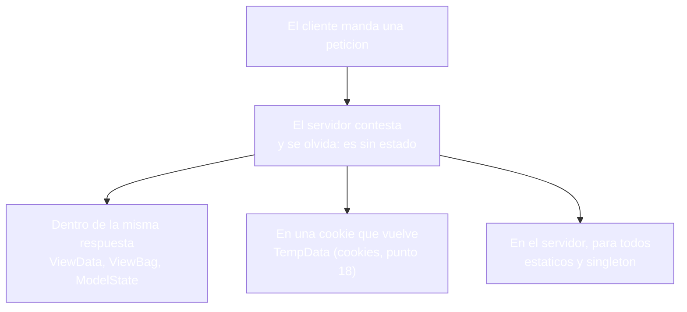
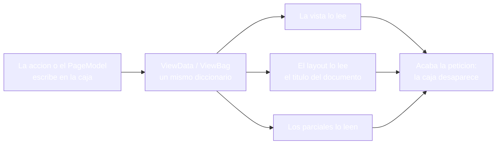
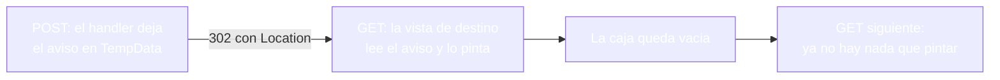
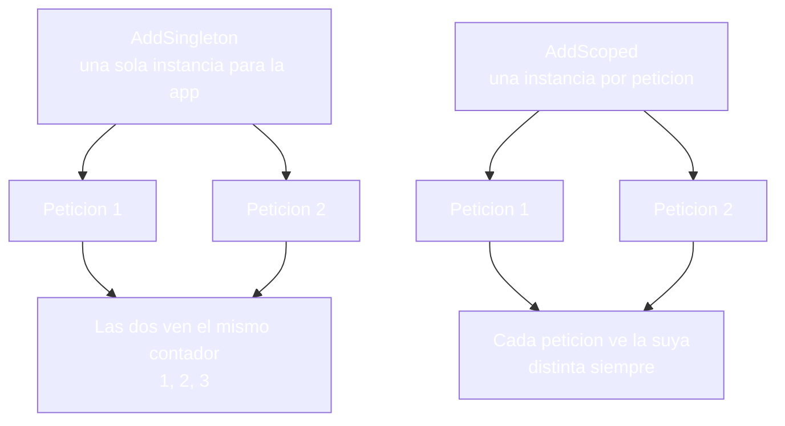

- [17. Gestión del estado de la aplicación](#17-gestión-del-estado-de-la-aplicación)
  - [17.1. HTTP: el protocolo que olvida](#171-http-el-protocolo-que-olvida)
    - [17.1.1. Qué es HTTP](#1711-qué-es-http)
    - [17.1.2. Un protocolo sin estado](#1712-un-protocolo-sin-estado)
    - [17.1.3. Los trucos para recordar entre peticiones](#1713-los-trucos-para-recordar-entre-peticiones)
  - [17.2. ViewData y ViewBag](#172-viewdata-y-viewbag)
    - [17.2.1. Qué son y qué aportan](#1721-qué-son-y-qué-aportan)
    - [17.2.2. Visión Razor Pages: ViewData en el PageModel](#1722-visión-razor-pages-viewdata-en-el-pagemodel)
    - [17.2.3. Visión MVC: ViewData y ViewBag en la acción](#1723-visión-mvc-viewdata-y-viewbag-en-la-acción)
    - [17.2.4. ViewData y ViewBag, comparados](#1724-viewdata-y-viewbag-comparados)
  - [17.3. TempData: el aviso que cruza el redirect](#173-tempdata-el-aviso-que-cruza-el-redirect)
    - [17.3.1. Qué es y por qué existe](#1731-qué-es-y-por-qué-existe)
    - [17.3.2. Visión Razor Pages: TempData con PRG](#1732-visión-razor-pages-tempdata-con-prg)
    - [17.3.3. Visión MVC: TempData con PRG](#1733-visión-mvc-tempdata-con-prg)
    - [17.3.4. Peek y keep: leer sin consumir](#1734-peek-y-keep-leer-sin-consumir)
    - [17.3.5. Las dos visiones, comparadas](#1735-las-dos-visiones-comparadas)
  - [17.4. ModelState: el estado de la última validación](#174-modelstate-el-estado-de-la-última-validación)
  - [17.5. El estado compartido de la aplicación](#175-el-estado-compartido-de-la-aplicación)
    - [17.5.1. Almacenamientos estáticos y singleton](#1751-almacenamientos-estáticos-y-singleton)
    - [17.5.2. Ciclos de vida en la inyección de dependencias](#1752-ciclos-de-vida-en-la-inyección-de-dependencias)
    - [17.5.3. La regla de aislamiento](#1753-la-regla-de-aislamiento)
  - [17.6. Cómo se pasan los datos entre vistas](#176-cómo-se-pasan-los-datos-entre-vistas)
  - [17.7. Reglas de seguridad del estado](#177-reglas-de-seguridad-del-estado)
  - [17.8. Buenas prácticas](#178-buenas-prácticas)
  - [17.9. Reto: el estado de la tienda de Funkos](#179-reto-el-estado-de-la-tienda-de-funkos)
    - [17.9.1. Contexto](#1791-contexto)
    - [17.9.2. Modelo de datos](#1792-modelo-de-datos)
    - [17.9.3. Almacenamiento](#1793-almacenamiento)
    - [17.9.4. Retos](#1794-retos)


# 17. Gestión del estado de la aplicación

> 💡 **Punto de partida:** Cambias el idioma de tu cuenta en Netflix, la página se recarga y, sobre el catálogo, aparece el aviso "Tu idioma se ha actualizado". Si pulsas F5, el aviso ya no está. Ese mensaje vivió dos peticiones: la que lo escribió y la que lo pintó, y alguien lo borró después. La pregunta de este punto es la de siempre con HTTP: una aplicación web no recuerda nada de una petición a la siguiente y, sin embargo, todo lo que usas funciona. ¿Qué trucos se monta entre petición y petición para recordar?

En este punto empezarás por el principio: qué es HTTP y por qué es un protocolo sin estado; después llegan los trucos que la aplicación se monta para no olvidar: ViewData y ViewBag, TempData, el estado compartido. De cada uno verás qué es, para qué sirve, cómo se hace en las dos visiones y cómo se pasan los datos entre vistas cuando hace falta. Los trucos que viajan hasta el navegador, cookies y sesión, tienen punto propio: el 18.

**Objetivos de aprendizaje:**

- Recordar qué es HTTP y qué significa que un protocolo sea sin estado
- Entender los trucos con los que una aplicación recuerda entre petición y petición
- Qué son ViewData y ViewBag, qué aportan y cómo se usan en página y en acción
- Qué es TempData y por qué el redirect necesita una caja de mensajes de una sola lectura
- Repartir el estado compartido con singleton, scoped y transient sin romper el aislamiento
- Pasar datos entre vistas con la herramienta que corresponde a cada caso

> 📝 **Nota:** seguimos con `ProductosApp` en sus dos visiones. Las dos comparten el proveedor de `TempData`: mismas cookies y mismos resultados en página y en acción.

## 17.1. HTTP: el protocolo que olvida

### 17.1.1. Qué es HTTP

**HTTP (HyperText Transfer Protocol) es el acuerdo con el que un cliente y un servidor se hablan.** El cliente manda una petición (una línea, unas cabeceras y quizá un cuerpo) y el servidor contesta con una respuesta (un código, unas cabeceras y el HTML). Después, la conversación se acabó — nadie guarda nada de lo hablado.

📌 **Ejemplo real:** Amazon. Cada imagen del catálogo, cada CSS y cada llamada de la cesta son peticiones HTTP independientes; el navegador las apila a toda velocidad y cada una se contesta por su cuenta.

> 💡 **Analogía:** es como pedir en un mostrador donde cada vez te atiende una persona distinta y nadie lleva la cuenta: pides, te dan, y a la siguiente ni saben quién eres.

### 17.1.2. Un protocolo sin estado

A HTTP se le llama **sin estado** (en inglés, *stateless*) porque el servidor no recuerda nada por sí solo de una petición a la siguiente: cada petición llega como si fuera la primera. Eso no es un olvido accidental, es una decisión de diseño, y tiene sus motivos:

- **Simpleza:** no hay memoria que arrastrar ni que limpiar; la petición se entiende sola.
- **Escalabilidad:** como la verdad no vive en una máquina concreta, la siguiente petición puede contestarla cualquier otra del banco de servidores.
- **Reanudación imposible:** ninguna petición arrastra los problemas de la anterior.

Lo que se pierde es la sensación de "estamos continuando". Sin trucos, cada clic sería empezar de cero: el carrito vacío otra vez, el aviso que nunca llega, el título que nadie puso.

> 📝 **Nota:** todo lo que hace una web parecer continua, todo lo que recuerda, está construido encima del protocolo, no dentro de él.

### 17.1.3. Los trucos para recordar entre peticiones

**Como el protocolo no recuerda, la aplicación se monta sus trucos, y todos caben en tres preguntas:** ¿dónde guardo el dato?, ¿qué hace el dato: viajar o quedarse? y ¿cuánto dura?

| Truco | Cuánto dura | Dónde vive | Para qué |
|-------|-------------|------------|----------|
| **ViewData y ViewBag** | La respuesta actual | En la petición, en el servidor | Pasar datos de la acción a su vista |
| **ModelState** | Hasta la vista | En la petición, en el servidor | Los errores del último envío |
| **TempData** | Una petición más | En una cookie del navegador | El aviso que acompaña a un redirect |
| **Estado compartido** | Toda la aplicación | En el servidor | Datos de todos: contadores, categorías |
| **Cookies y sesión** | Lo que se decida | Cookie en el cliente y datos en el servidor | Quién eres y tus datos (punto 18) |



Los tres primeros trucos son el trabajo de este punto. El segundo, TempData, es el que Netflix usa para enseñarte el aviso del idioma: el que redirige deja la nota y la página siguiente la pinta.

## 17.2. ViewData y ViewBag

### 17.2.1. Qué son y qué aportan

**Una vista necesita a veces datos que no son productos:** el título de la página, cuántos resultados salen, el nombre de quien ha entrado. El modelo tipado (punto 09) se reserva para los datos de verdad de la vista; para los sueltos existe `ViewData`.

- **`ViewData`**: un diccionario de objetos con clave que el handler (o la acción) llena antes de devolver la respuesta, y que la vista lee por esa misma clave.
- **`ViewBag`**: la misma caja con otra puerta, una envoltura dinámica sobre ese diccionario que permite escribir `ViewBag.Titulo` en vez de `ViewData["Titulo"]` — lo que entra por una puerta sale por la otra.

📌 **Ejemplo real:** Amazon. El número de resultados de una búsqueda y el título de la página viajan junto al listado como datos sueltos: no son productos, son acompañantes de la vista, y mueren cuando la vista muere.

**Qué aportan:** rapidez para llevar un suelto de la acción a la vista sin montar un ViewModel entero. **Qué no aportan:** ni tipo, ni aviso si te equivocas de nombre, ni vida más allá de la petición. Y una regla práctica desde el punto 09: si vas a escribir tres claves seguidas, ya no es un suelto, es un ViewModel.

**La caja no solo llega a la vista:** llega a todo lo que se pinta en esa petición, layout y parciales incluidos. Por eso el `<title>` del layout sale de `ViewData["Title"]` (punto 05) sin que nadie se lo pase a mano.



### 17.2.2. Visión Razor Pages: ViewData en el PageModel

En páginas, quien llena la caja es el `PageModel`, en su handler:

```csharp
public void OnGet()
{
    ViewData["Titulo"] = "Listado de productos";
    ViewData["Cuenta"] = 4;
}
```

Y la vista lo lee por la misma clave, o por la otra puerta:

```cshtml
<h1>@ViewData["Titulo"]</h1>
<p>@ViewData["Cuenta"] / @ViewBag.Cuenta</p> @* pinta 4 / 4 *@
```

Las dos puertas dan al mismo almacén: lo que escribes por `ViewData` lo lee `ViewBag`, y al revés. La diferencia de esta visión está en el `PageModel`: `ViewBag` no existe ahí. Escribir `ViewBag.Marcador = "..."` en el `OnGet` no llega a ejecutarse: `dotnet build` se para con `error CS0103`, porque en esa clase no hay tal nombre. En el `.cshtml`, en cambio, `@ViewBag` compila y lee la misma caja que `ViewData`.

> 💡 **Consejo:** en páginas escribe siempre por `ViewData` desde el `PageModel`; `ViewBag` déjalo para la vista, donde sí existe.

### 17.2.3. Visión MVC: ViewData y ViewBag en la acción

En la acción las dos puertas están de serie, porque `Controller` trae `ViewData` y `ViewBag` (apartado 8.4):

```csharp
public IActionResult Index()
{
    ViewData["Titulo"] = "Productos del catálogo";
    ViewBag.Marcador = "escrito-en-el-controlador";
    return View(RepositorioProductos.ObtenerTodos());
}
```

```cshtml
<h1>@ViewData["Titulo"]</h1>
<p>@ViewData["Marcador"]</p> @* lee lo que escribió ViewBag: escrito-en-el-controlador *@
```

La acción escribe con `ViewBag` y la vista lee con `ViewData`: sale el texto igual, porque es la misma caja.

### 17.2.4. ViewData y ViewBag, comparados

Misma caja, distinta puerta y las dos visiones. Lo que no comparten es cómo fallan, y ahí es donde duele:

| | `ViewData` | `ViewBag` |
|---|---|---|
| **Tipo** | Diccionario de `object?` | `dynamic` sobre ese diccionario |
| **En el PageModel** | Sí | No: `error CS0103` |
| **En la acción** | Sí | Sí |
| **En la vista** | Con clave: `ViewData["Titulo"]` | Con propiedad: `@ViewBag.Titulo` |
| **Fallo silencioso** | Clave equivocada: vacío en **200** | Clave equivocada: vacío en **200** |
| **Fallo ruidoso** | Conversión equivocada en la vista: **500** | Conversión equivocada en la vista: **500** |

Hay dos maneras de fallar, y fallan igual en página y en acción:

- Si la vista pide una clave que nadie escribió, pinta un vacío con **200**. Sin error y sin aviso: el dato simplemente no aparece.
- Si en la vista conviertes un texto a `int`, como `@((int)ViewBag.Marcador)`, la respuesta es **500** con la excepción `Microsoft.CSharp.RuntimeBinder.RuntimeBinderException: Cannot convert type 'string' to 'int'`.

> 🔧 **Truco:** en la vista un cast lleva doble paréntesis, `@((int)...)`; con uno solo el compilador se queja con `CS1525`.

> ⚠️ **Advertencia:** `ViewBag` no comprueba nada en la compilación: el error llega cuando alguien abre la vista en producción. Los datos con forma van en el modelo tipado (punto 09).

## 17.3. TempData: el aviso que cruza el redirect

### 17.3.1. Qué es y por qué existe

**El PRG de los puntos 13 a 16 deja un hueco: el redirect no cuenta nada.** Después de un POST válido, el servidor responde `302` con una cabecera `Location` que solo dice "ve a esta otra URL"; no lleva mensajes, no lleva datos — solo la dirección. Si el handler quería dar un mensajito a la vista que pinta después, el mensaje se pierde entre las dos peticiones.

`TempData` existe para ese cruce: es la caja de mensajes de una sola lectura. Quien redirige escribe antes de irse; la vista de la siguiente petición lee, pinta y la caja se vacía sola. Vence exactamente una petición más.

📌 **Ejemplo real:** Gmail. Guardas una configuración y la barra "Se han guardado los cambios" aparece tras la recarga y desaparece a la siguiente navegación: un aviso que sobrevive exactamente una petición.



### 17.3.2. Visión Razor Pages: TempData con PRG

En el `OnPost`, justo antes de redirigir, se deja el aviso:

```csharp
public IActionResult OnPost(string nombre, string categoria)
{
    // aquí va el alta del producto (punto 14)
    TempData["Mensaje"] = $"Producto creado: {nombre}";
    return RedirectToPage();
}
```

Y la vista de destino lo pinta si está:

```cshtml
@if (TempData["Mensaje"] is string flash)
{
    <p id="flash">@flash</p>
}
```

El POST contesta **302** con `Location` hacia la propia página; el GET siguiente pinta el aviso con el nombre del producto; el GET de después no pinta nada. Se lee una vez y desaparece.

### 17.3.3. Visión MVC: TempData con PRG

La misma receta en la acción:

```csharp
[HttpPost]
public IActionResult Alta(string nombre, string categoria)
{
    // aquí va el alta del producto (punto 14)
    TempData["Mensaje"] = $"Producto creado: {nombre}";
    return RedirectToAction("Index");
}
```

La vista de destino lleva el mismo `@if` y el comportamiento es idéntico: **302**, aviso una vez, después vacío.

### 17.3.4. Peek y keep: leer sin consumir

Leer con `TempData["Mensaje"]` consume el valor: quien lo pinta, lo borra. Para mirar sin gastar hay dos métodos:

- `TempData.Peek("Mensaje")`: lee sin consumir. El listado puede pintar el aviso con `Peek` y el aviso sigue ahí; cuando después se lee con la llave normal, la que consume, el `Peek` pasa a devolver vacío.
- `TempData.Keep("Mensaje")`: conserva el valor para la petición siguiente. Si lo llamas dentro del `@if`, tres GET seguidos pintan el aviso y la cookie sigue con sus 176 caracteres.

> ⚠️ **Advertencia:** si conservas en cada petición, el aviso no muere nunca: deja de ser un aviso y la cookie viaja siempre cargada.

> 🔧 **Truco:** dentro de un bloque `@if` ya estás en código: las sentencias se escriben sin `@{ }`. Si lo envuelves, el compilador devuelve `RZ1010`.

### 17.3.5. Las dos visiones, comparadas

| | Visión Razor Pages | Visión MVC |
|---|---|---|
| **Escribe** | `TempData["Mensaje"]` en el `OnPost` | `TempData["Mensaje"]` en la acción |
| **Retorna** | `RedirectToPage()` | `RedirectToAction("Index")` |
| **Lee** | La vista de la página de destino | La vista de la acción de destino |
| **Resultado** | **302**, aviso una vez, después vacío | **302**, aviso una vez, después vacío |

El mecanismo por debajo es el mismo en las dos: `TempData` viaja en una cookie del navegador (`.AspNetCore.Mvc.CookieTempDataProvider`), con marca `HttpOnly`, el aviso del alta metido en 176 caracteres y el valor cifrado: el texto no aparece por ninguna parte, la cadena empieza por `CfDJ`. Y la cookie no se perdona: si alguien la toca, la aplicación prefiere no leer nada a leer basura, así que responde **200** sin aviso y descarta la cookie.

📌 **Ejemplo real:** Netflix. El aviso "Tu idioma se ha actualizado" del punto de partida vive en una cookie así: se escribe en un redirect, se pinta una vez y, si se manipula, no se pinta nada.

> 📝 **Nota:** `TempData` no necesita configurar la sesión: el proveedor por defecto es la cookie del navegador. Por eso el aviso viaja hasta el equipo y vuelve en la petición siguiente. La cookie completa y la sesión son el punto 18.

## 17.4. ModelState: el estado de la última validación

**El binding del punto 14 y la validación del punto 15 dejan su propio rastro: `ModelState`.** Es el cuaderno de erratas de la petición: un diccionario con lo que ha llegado y con un error por campo que no ha cuadrado. Vive la petición entera, la vista lo pinta con `@Html.ValidationMessage(...)` (apartado 15.1.1) y con la respuesta desaparece.

Aquí no aporta nada nuevo: solo importa colocarlo en el mapa (la segunda fila de la tabla del apartado 17.1.3) y recordar que, igual que `ViewData`, aguanta hasta la vista.

## 17.5. El estado compartido de la aplicación

**Hasta aquí, todo el estado pertenecía a una petición o a la inmediata siguiente. Pero hay datos que no son de nadie:** cuántas altas lleva la tienda, las categorías, el total de visitas. Esos viven en el sitio contrario: un almacén al que todas las peticiones entran — de nadie en particular.

### 17.5.1. Almacenamientos estáticos y singleton

La forma más directa es una lista estática en el repositorio. **Una lista estática es de todos los usuarios:** si la rellenas con lo que da de alta un cliente, el cliente siguiente la abre y ve lo del primero, en página y en acción por igual. El otro camino es un servicio registrado con `AddSingleton`: una sola instancia para toda la aplicación, así que tres peticiones seguidas ven `1`, `2`, `3` venga quien venga, porque el contador es el mismo para todos.

📌 **Ejemplo real:** YouTube. El recuento total de reproducciones de un vídeo es de todos; el vídeo que tienes en la cola es solo tuyo. Mezclarlos en el mismo almacén es la fuga.

> ⚠️ **Advertencia:** la fuga no avisa: el segundo usuario ve lo que creó el primero y el sistema sigue respondiendo con normalidad. Y una lista estática no está hecha para que dos peticiones escriban a la vez: si compartes, usa estructuras pensadas para ello.

### 17.5.2. Ciclos de vida en la inyección de dependencias

**La inyección de dependencias del punto 08 no reparte objetos al azar:** cada registro tiene su duración.

| Registro | Instancia | Dura | Para qué |
|----------|-----------|------|----------|
| **`AddSingleton`** | Una para toda la aplicación | Toda la vida del proceso | Contadores, configuración, caché |
| **`AddScoped`** | Una por petición | La petición actual | Contexto de base de datos, rastro |
| **`AddTransient`** | Una por resolución | Lo que dure el uso | Validadores sin estado |

```csharp
builder.Services.AddSingleton<ContadorAltas>();   // una sola instancia para la app
builder.Services.AddScoped<RastroPeticion>();     // una por peticion
```

El contador con `AddSingleton` es único para toda la app; el rastro con `AddScoped` es distinto en cada petición y nunca se repite entre unas y otras.



**El peligro está en cómo recibes el servicio en una acción:** los parámetros llegan desde la petición. Si pides un tipo registrado sin decirlo a la inyección, el binding fabrica un objeto nuevo en cada petición — el compartido deja de serlo sin que se note y el contador se queda en `1`, `1`, `1`.

```csharp
// ❌ MALO: el binding enlaza el parámetro, la inyección no interviene
public IActionResult Estado(ContadorAltas contador) => View();   // 1, 1, 1

// ✅ BUENO: el servicio entra por el primary constructor del controlador
public class ProductosController(ContadorAltas contador) : Controller   // 1, 2, 3

// ✅ BUENO: también se puede pedir a la inyección en el parámetro
public IActionResult Estado([FromServices] ContadorAltas contador) => View();   // 1, 2, 3
```

> 💡 **Consejo:** si el contador no crece en producción, sospecha primero del parámetro de la acción: pásalo al constructor o márcalo con `[FromServices]`.

### 17.5.3. La regla de aislamiento

**La regla cabe en una frase:** el estado vive en el almacén más corto que lo aguante y en el más estrecho que le corresponda.

| ¿De quién es el dato? | Dónde vive |
|------------------------|------------|
| **De la petición actual** | Modelo enlazado, `ModelState`, `ViewData` |
| **Del aviso siguiente** | `TempData` |
| **De un usuario entre peticiones** | Sesión o base de datos (punto 18) |
| **De todos, siempre** | Servicio `AddSingleton` sin datos de nadie |

Lo de un usuario no entra en el compartido; lo de todos no entra en la sesión. Y lo que solo acompaña a una vista no necesita durar más que ella.

## 17.6. Cómo se pasan los datos entre vistas

Cuando un dato tiene que ir de un sitio a otro dentro de la aplicación, hay tres caminos y se eligen por duración, no por gusto:

| Necesidad | Herramienta | Cuánto dura | Ejemplo |
|-----------|-------------|-------------|---------|
| **De la acción a su vista** (y a su layout y parciales) | `ViewData` / `ViewBag` | La petición | El título del `<title>` (punto 05) |
| **De la acción a su vista, con forma** | Modelo tipado / ViewModel | La petición | El listado de productos (punto 09) |
| **De una vista a la que viene después** (redirect) | `TempData` | Una petición más | El aviso del alta |
| **Entre páginas, datos de un usuario** | Sesión (punto 18) | Lo que dure la sesión | El carrito de la compra |

Dos apuntes de la casa: dentro de una misma petición no hay que pasar nada a mano, porque la vista, su layout y sus parciales comparten la misma caja de `ViewData`; y si vas a pasar tres claves o más, eso ya no es un suelto: monta un ViewModel (apartado 9.3.2).

## 17.7. Reglas de seguridad del estado

- **Nada sensible en `ViewData` ni `ViewBag`**: lo que metes ahí puede acabar pintado en cualquier vista que cuelgue de la petición, layout y parciales incluidos; una contraseña o un DNI completo no son un título de página.
- **`TempData`, solo mensajes públicos**: el aviso sale en una cookie del navegador (`.AspNetCore.Mvc.CookieTempDataProvider`, `HttpOnly`, 176 caracteres con el texto dentro). Quien comparte el equipo lo lee; si la cookie se manipula, la respuesta es **200** sin aviso.
- **Los datos de un usuario, nunca en estado compartido**: una lista estática muestra a un cliente lo que dio de alta otro. La fuga no avisa: nadie recibe ningún error y los dos usuarios se quedan con la misma vista.
- **`ViewData` no avisa de claves malas**: la clave equivocada pinta vacío en **200** y la conversión equivocada rompe con **500** y `RuntimeBinderException`. Revisa los nombres a mano.
- **`Keep` no convierte un aviso en mensaje fijo**: con `Keep` conservado en cada petición, tres GET seguidos pintan el aviso tres veces.
- **El compartido es de todos**: pide los servicios por constructor o con `[FromServices]`; el parámetro normal de la acción lo enlaza el binding y el contador se queda en `1`, `1`, `1`.

> 💡 **Consejo:** si un dato puede contener algo de un usuario, asúmelo de un usuario y no lo dejes en ningún almacén compartido.

## 17.8. Buenas prácticas

- **Empieza por la duración**: decide cuánto debe vivir el dato y después elige el almacén
- **Modelo para los datos, `ViewData` para los sueltos**: títulos, contadores y avisos de una petición
- **`ViewBag` solo en la vista**: en el `PageModel` no existe (`error CS0103`)
- **`TempData` para el aviso del PRG**: una escritura antes del redirect y una lectura después
- **`Peek` para mirar y `Keep` con cabeza**: leer sin gastar; conservar solo si de verdad hace falta
- **`AddSingleton` sin datos de usuario**: lo que se comparte no pertenece a nadie
- **Los servicios por constructor o `[FromServices]`**: el parámetro normal de la acción lo fabrica el binding
- **Nada sensible en el estado de la vista**: lo que se pinta puede acabar en cualquier parte

## 17.9. Reto: el estado de la tienda de Funkos

> Haz que cada trozo de estado de tu tienda viva en su sitio: avisos que cruzan el redirect, contadores compartidos y ningún dato de usuario a la vista de nadie, en las dos visiones.

### 17.9.1. Contexto

**Paso 0:** parte del formulario completo del punto 16 en sus dos visiones (`FunkoApp` y `FunkoAppMvc`), con el alta y el listado funcionando.

### 17.9.2. Modelo de datos

| Propiedad | Tipo | Obligatorio |
|-----------|------|:-----------:|
| `id` | int | Sí (autogenerado) |
| `nombre` | string | Sí |
| `categoria` | string | Sí |
| `anio` | int | Sí |
| `precioReferencia` | decimal | Sí |
| `imagen` | string? | No |
| `etiquetas` | List\<string\>? | No |
| `activo` | bool | Sí |
| `esNovedad` | bool | Sí |

### 17.9.3. Almacenamiento

```csharp
public static class RepositorioFunkos
{
    private static readonly List<Funko> Funkos = [ /* seis figuras */ ];

    public static IReadOnlyList<Funko> ObtenerTodos() => Funkos;
}
```

Rellena la lista con seis figuras de modo que haya activas y dadas de baja, novedades y no novedades, y las tres categorías.

### 17.9.4. Retos

**Pasos compartidos (las dos visiones):**

1. **En papel primero:** dibuja el mapa del estado de tu alta: qué dato escribe quién, cuánto vive y en qué almacén lo dejas
2. Escribe el aviso del alta con `TempData` antes del redirect; envía el formulario y comprueba que el POST da **302**, que el GET siguiente pinta el aviso una sola vez y que el GET de después no pinta nada
3. Conserva el aviso con `TempData.Keep("Mensaje")` en la vista y comprueba que tres GET seguidos lo pintan; quítalo y comprueba que vuelve a ser de una sola lectura
4. Añade un contador de altas en un servicio `AddSingleton`; tres peticiones seguidas deben ver `1`, `2`, `3`
5. Abre la vista de alta en un segundo navegador (o en ventana de incógnito) y comprueba que la lista compartida muestra el producto que solo creó el primero; anota en un comentario por qué ocurre y dónde debería vivir ese dato
6. Pon el título del listado en `ViewData` y léelo con las dos puertas (`@ViewData["Titulo"]` y `@ViewBag.Titulo`); comprueba que salen iguales

**Visión Razor Pages:**

7. Comprueba que `ViewBag.Titulo = "..."` en el `OnGet` no compila: `dotnet build` se para con `error CS0103`
8. Lee el aviso con `TempData.Peek("Mensaje")` en el listado y comprueba que aparece sin consumirse

**Visión MVC:**

9. Escribe `ViewBag.Marcador` en la acción y léelo con `ViewData["Marcador"]` en la vista; comprueba que sale el texto que escribiste
10. Recibe el contador por el primary constructor del controlador y comprueba `1`, `2`, `3`; quítalo del constructor y pásalo como parámetro normal de la acción: se queda en `1`, `1`, `1`; repítelo con `[FromServices]` y vuelve a `1`, `2`, `3`

**Puntos extra:**

- Toca la cookie del aviso con **F12** (Application > Cookies): añade una letra al valor y comprueba que la página responde **200** sin aviso
- Escribe en `ViewData` una clave que la vista no lee y comprueba que la página responde **200** con esa clave vacía; después intenta `@((int)ViewBag.Marcador)` con un texto y comprueba el **500**
- Deja el `Keep` fijo y explica en un comentario por qué deja de ser un aviso
- Escribe en el repositorio por qué los datos de un usuario no pueden vivir en la lista compartida

---

**Resumen del punto:**

| Concepto | Descripción |
|----------|-------------|
| **HTTP sin estado** | Cada petición es un mundo; el recuerdo es un truco de la aplicación |
| **`ViewData`** | Diccionario de objetos que muere con la vista actual |
| **`ViewBag`** | Envoltorio `dynamic` del mismo almacén; no existe en el `PageModel` |
| **`TempData`** | Aviso que cruza el redirect en una cookie y se borra al leerse |
| **`Peek` y `Keep`** | Leer sin consumir y conservar una petición más |
| **`ModelState`** | Los errores del último envío, vive hasta la vista |
| **Estado compartido** | Estáticos y `AddSingleton`: lo ven todas las peticiones |
| **`AddScoped` / `AddTransient`** | Una instancia por petición y una por resolución |
| **Regla de aislamiento** | Datos de un usuario fuera del estado compartido |
| **Clave equivocada** | Vacío silencioso en **200** |
| **Conversión equivocada** | **500** con `RuntimeBinderException` |
| **`[FromServices]`** | El servicio por parámetro normal lo enlaza el binding |
| **Doble visión** | El mismo aviso con `OnPost` + `RedirectToPage` y con acción + `RedirectToAction` |
| **Comprobado** | POST **302** con el aviso una sola vez; `Keep` en **3** GET seguidos; singleton `1, 2, 3`; parámetro normal `1, 1, 1`; un cliente ve el alta del otro |

**¿Qué viene después?**

En el siguiente punto toca el segundo truco de la tabla del apartado 17.1.3: cookies y sesión, el estado que viaja hasta el navegador y el que espera en el servidor con un identificador en la cookie.
