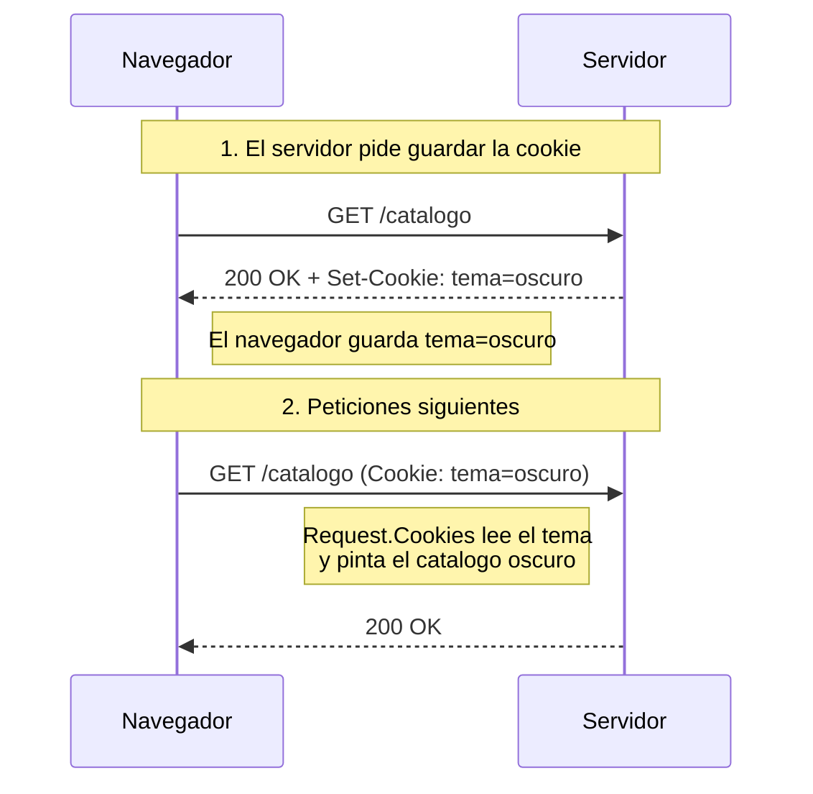
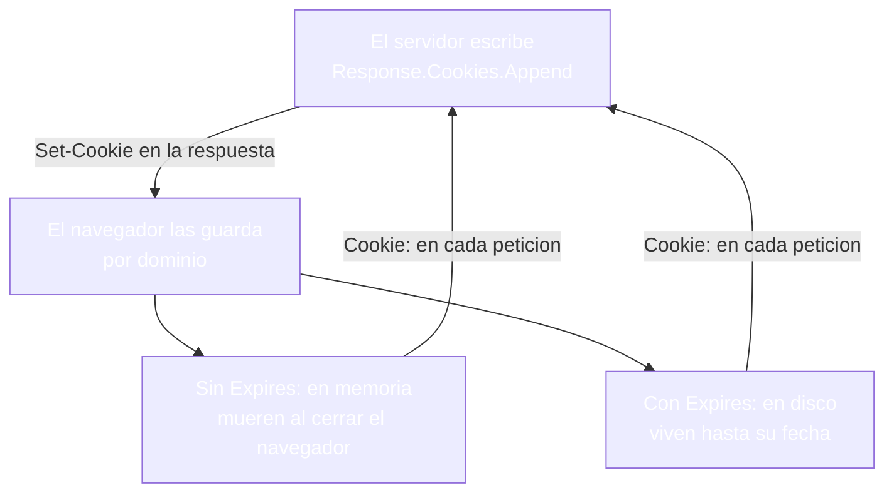
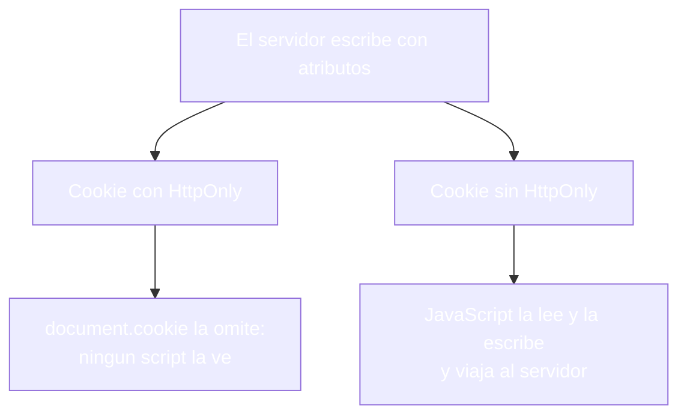
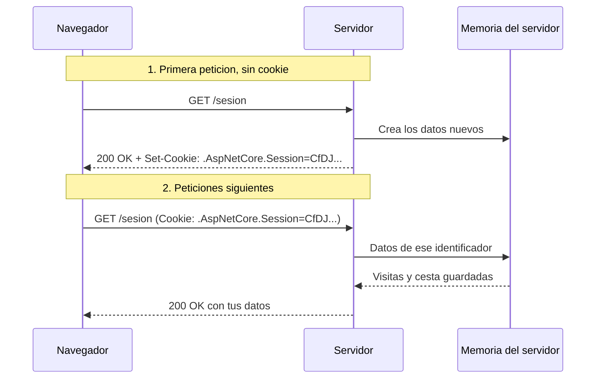
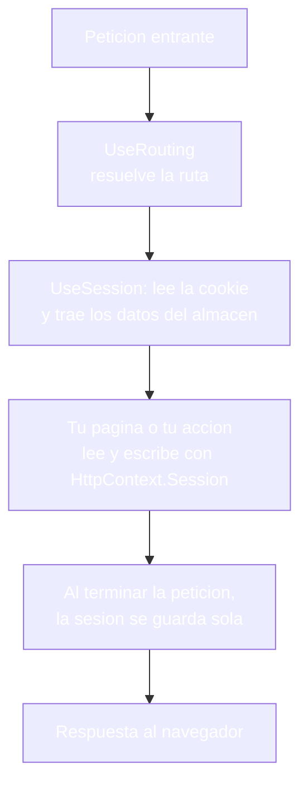
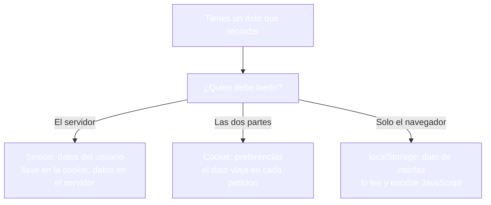
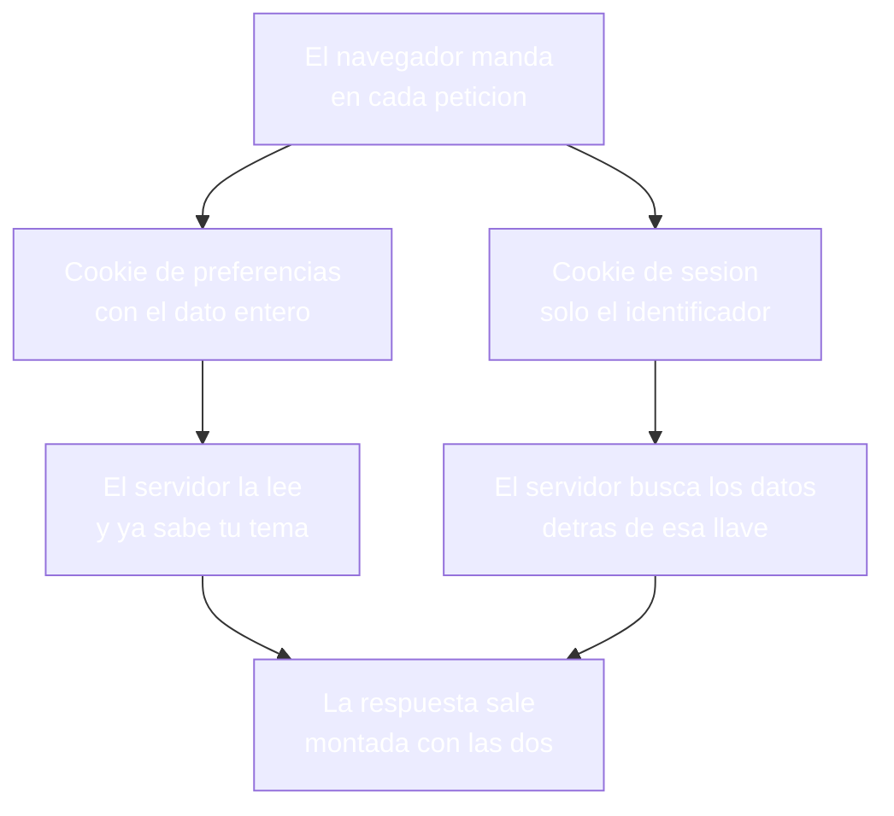

- [18. Cookies, sesiones y almacenamiento en el cliente](#18-cookies-sesiones-y-almacenamiento-en-el-cliente)
  - [18.1. Cookies: el recuerdo que vive en el navegador](#181-cookies-el-recuerdo-que-vive-en-el-navegador)
    - [18.1.1. Qué es una cookie y qué aporta](#1811-qué-es-una-cookie-y-qué-aporta)
    - [18.1.2. Ciclo de vida: escribir, leer y borrar](#1812-ciclo-de-vida-escribir-leer-y-borrar)
    - [18.1.3. Los atributos de una cookie](#1813-los-atributos-de-una-cookie)
    - [18.1.4. Cookies en las dos visiones](#1814-cookies-en-las-dos-visiones)
    - [18.1.5. Cookies y JavaScript](#1815-cookies-y-javascript)
  - [18.2. Sesión: el recuerdo que vive en el servidor](#182-sesión-el-recuerdo-que-vive-en-el-servidor)
    - [18.2.1. Qué es la sesión y qué aporta](#1821-qué-es-la-sesión-y-qué-aporta)
    - [18.2.2. El id de sesión: el vínculo invisible](#1822-el-id-de-sesión-el-vínculo-invisible)
    - [18.2.3. Configuración en Program.cs](#1823-configuración-en-programcs)
    - [18.2.4. Escribir y leer datos](#1824-escribir-y-leer-datos)
    - [18.2.5. Objetos completos con JSON](#1825-objetos-completos-con-json)
    - [18.2.6. La sesión en las dos visiones](#1826-la-sesión-en-las-dos-visiones)
    - [18.2.7. Por dentro de la sesión](#1827-por-dentro-de-la-sesión)
    - [18.2.8. Sesiones distribuidas (Redis)](#1828-sesiones-distribuidas-redis)
  - [18.3. Cookies o sesión: cómo elegir](#183-cookies-o-sesión-cómo-elegir)
  - [18.4. Almacenamiento en el cliente: localStorage](#184-almacenamiento-en-el-cliente-localstorage)
  - [18.5. Reglas de seguridad](#185-reglas-de-seguridad)
  - [18.6. Buenas prácticas](#186-buenas-prácticas)
  - [18.7. Reto: la cesta y las preferencias de la tienda de Funkos](#187-reto-la-cesta-y-las-preferencias-de-la-tienda-de-funkos)
    - [18.7.1. Contexto](#1871-contexto)
    - [18.7.2. Modelo de datos](#1872-modelo-de-datos)
    - [18.7.3. Almacenamiento](#1873-almacenamiento)
    - [18.7.4. Retos](#1874-retos)


# 18. Cookies, sesiones y almacenamiento en el cliente

> 💡 **Punto de partida:** ves el primer episodio de una serie en el móvil con la app, lo dejas a mitad y esa noche abres la web en el ordenador: la serie arranca justo por el minuto en que te quedaste. Tres días después entras en Amazon y la cesta te sigue esperando con los mismos dos productos. HTTP olvida todo entre petición y petición — así que ese recuerdo no puede vivir dentro del protocolo. Vive en dos sitios distintos: en tu navegador, en un trozo de texto que tú llevas, o en el servidor, con una llave que tú llevas. Son la cookie y la sesión, y de ellas depende casi todo lo que una web recuerda de ti. ¿Cómo se elige cuál de las dos se encarga de cada dato, y qué hace falta para que ese recuerdo no acabe en manos de nadie más?

En este punto aprenderás a montar el recuerdo que se sale del servidor: primero la cookie, qué es, su ciclo de vida de escritura, lectura y borrado, y sus atributos de seguridad; después la sesión, qué viaja en la cookie del identificador y qué se queda esperando en el servidor. Los dos mecanismos los harás en las dos visiones y cerrarás eligiendo entre cookie, sesión y almacenamiento puramente del navegador.

**Objetivos de aprendizaje:**

- Qué es una cookie, cómo se escribe, se lee y se borra, y qué aporta cada atributo
- Qué es la sesión, qué lleva su cookie y dónde viven realmente los datos
- Configurar la sesión en `Program.cs` y usarla igual en página y en acción
- Guardar objetos completos en la sesión serializándolos a JSON
- Elegir entre cookie, sesión y `localStorage` según dónde deba vivir el dato
- Las reglas de seguridad de todo lo que vive en el cliente

> 📝 **Nota:** seguimos con `ProductosApp` en sus dos visiones. Las dos usan la misma API de cookies y la misma de sesión, así que los nombres de las cookies y los resultados coinciden.

## 18.1. Cookies: el recuerdo que vive en el navegador

### 18.1.1. Qué es una cookie y qué aporta

**Una cookie es un par `nombre=valor` que el servidor pide al navegador que guarde, y que el navegador devuelve después en cada petición a ese sitio.** No hay magia: es texto corto que viaja en las cabeceras, con `Set-Cookie` cuando el servidor la escribe y con `Cookie` cuando el cliente la devuelve.

📌 **Ejemplo real:** YouTube guarda en cookies tu idioma y tu modo oscuro; si cambias el tema, la web lo pide y lo devuelve en cada visita durante semanas.

Lo que aporta es justo lo que el protocolo no da: un recuerdo que sobrevive a la petición y también al cierre del navegador. A diferencia del `TempData` del punto 17, que dura una petición más, una cookie vive lo que diga su fecha de caducidad, y eso se decide al escribirla.

> 💡 **Analogía:** es la etiqueta que te pegan en la mano en la entrada de un evento: la llevas tú, la enseñas en cada control y, cuando caduca, dejas de pasar.



El navegador, además, no las guarda todas en el mismo sitio: sin fecha de caducidad viven en memoria y mueren con el navegador; con `Expires` se escriben en el disco del equipo y sobreviven a cerrarlo.



### 18.1.2. Ciclo de vida: escribir, leer y borrar

La cookie tiene tres movimientos y los tres se hacen desde el código del servidor.

**Escribir** se hace con `Response.Cookies.Append`, que añade la cabecera `Set-Cookie` a la respuesta:

```csharp
Response.Cookies.Append("User_Tema", "oscuro", new CookieOptions
{
    HttpOnly = true,
    Expires = DateTimeOffset.UtcNow.AddDays(30),
    SameSite = SameSiteMode.Lax
});
```

Con esa llamada salen tres cookies distintas en la respuesta y cada una dice algo diferente:

| Cookie escrita | Cabecera `Set-Cookie` | Qué significa |
|----------------|----------------------|---------------|
| **`User_Tema`** | `User_Tema=oscuro; expires=Tue, 03 Nov 2026; path=/; samesite=lax; httponly` | Persistente: 30 días y oculta a JavaScript |
| **`User_Visita`** | `User_Visita=primera; path=/` | Sin caducidad: se va al cerrar el navegador |
| **`User_Segura`** | `User_Segura=solo-https; path=/; secure` | Marcada para viajar solo por HTTPS |

**Leer** es `Request.Cookies` con la clave; si no existe, devuelve `null` y ahí decides tú qué pintar:

```csharp
string tema = Request.Cookies["User_Tema"] ?? "claro";
```

**Borrar** es `Response.Cookies.Delete` con el nombre de la cookie:

```csharp
Response.Cookies.Delete("User_Tema");
```

El borrado devuelve una respuesta con `Set-Cookie` caducada y en la petición siguiente `Request.Cookies["User_Tema"]` ya no encuentra nada — la vista que antes pintaba `oscuro` pasa a pintar su valor por defecto.

> 🔧 **Truco:** `curl -i http://localhost:5000/catalogo` devuelve la respuesta con sus cabeceras encima, `Set-Cookie` incluida: se ve cómo quedó escrita una cookie y con qué atributos, sin abrir el navegador.

> ⚠️ **Advertencia:** leer una cookie que nadie escribió no da ningún error, solo devuelve `null`. Si pintas sin el `??`, la vista se rompe con una excepción de referencia nula.

### 18.1.3. Los atributos de una cookie

Los atributos son las instrucciones que el servidor deja escritas en la cabecera para que el navegador las respete.

| Atributo | Qué manda | Por qué importa |
|----------|-----------|-----------------|
| **`HttpOnly`** | JavaScript no puede leerla | Si un script logra ejecutarse en tu página, no ve esta cookie |
| **`Secure`** | Solo viaja por HTTPS | En un dominio real por HTTP no se envía; en local, el navegador considera `localhost` origen de confianza y la envía igual, así que en pruebas no se descubre si falta |
| **`SameSite`** | Cuándo viaja en peticiones de otros sitios | `Lax` es el valor por defecto y frena los envíos cruzados |
| **`Expires`** | Cuándo caduca | Sin ella, la cookie vive solo mientras el navegador esté abierto |
| **`Path`** | A qué rutas del sitio se envía | `path=/` la manda a todas las rutas |

📌 **Ejemplo real:** YouTube. Cuando aceptas su aviso de cookies, la preferencia vuelve dentro de unos días porque quedó escrita con `Expires` de meses; en cambio, la sesión de tu banco se olvida al cerrar el navegador.

El efecto de `HttpOnly` se ve desde la consola del navegador. Con la cookie `User_Tema` marcada como `HttpOnly`, la instrucción `document.cookie` devuelve únicamente `User_Visita=primera; User_Segura=solo-https`: la cookie protegida no aparece, porque `HttpOnly` le corta el acceso a cualquier script.

> 💡 **Consejo:** en F12, la pestaña Application, sección Cookies, se ven todas las cookies de un sitio con sus atributos tal y como el servidor los escribió.

### 18.1.4. Cookies en las dos visiones

La lectura y la escritura son idénticas en las dos visiones: quien maneja cookies es el contexto HTTP, y `PageModel` y `Controller` lo exponen igual.

**Visión Razor Pages:** lectura y escritura en el mismo `PageModel`.

```csharp
public class CookiesModel : PageModel
{
    // Lectura: Request viene del PageModel
    public string? Tema => Request.Cookies["User_Tema"];

    public void OnGet(string? escribir)
    {
        if (escribir != "1") return;

        Response.Cookies.Append("User_Tema", "oscuro", new CookieOptions
        {
            HttpOnly = true,
            Expires = DateTimeOffset.UtcNow.AddDays(30),
            SameSite = SameSiteMode.Lax
        });
    }
}
```

**Visión MVC:** la misma operación dentro de la acción.

```csharp
public class CookiesController : Controller
{
    // Ruta por atributo: /cookies
    [HttpGet("cookies")]
    public IActionResult Index(string? escribir)
    {
        if (escribir == "1")
        {
            Response.Cookies.Append("User_Tema", "oscuro", new CookieOptions
            {
                HttpOnly = true,
                Expires = DateTimeOffset.UtcNow.AddDays(30),
                SameSite = SameSiteMode.Lax
            });
        }

        return View();
    }
}
```

La diferencia está en la vista. La vista de MVC tiene `Context` y lee directamente; la vista de Razor Pages no tiene esa propiedad y debe usar `HttpContext`, porque `Context` no compila y el compilador para con `error CS0103`.

```cshtml
@* Visión MVC: la vista tiene Context *@
<p>Tema: @(Context.Request.Cookies["User_Tema"] ?? "(sin cookie)")</p>
```

```cshtml
@* Visión Razor Pages: se usa HttpContext *@
<p>Tema: @(HttpContext.Request.Cookies["User_Tema"] ?? "(sin cookie)")</p>
```

Conviene hacer la lectura en el modelo de página o en la acción y pasar el resultado a la vista por una propiedad o por `ViewData`, que es el camino que ya dominas del punto 17.

| Operación | Razor Pages | MVC |
|-----------|-------------|-----|
| **Escribir** | `Response.Cookies.Append` en el `OnGet` | `Response.Cookies.Append` en la acción |
| **Leer** | `Request.Cookies[...]` en el `PageModel` | `Request.Cookies[...]` en la acción |
| **Leer en la vista** | `HttpContext.Request.Cookies[...]` | `Context.Request.Cookies[...]` |
| **Borrar** | `Response.Cookies.Delete` | `Response.Cookies.Delete` |

### 18.1.5. Cookies y JavaScript

`document.cookie` es la puerta de JavaScript a las cookies: devuelve un único texto con todas las cookies del sitio que no estén marcadas como `HttpOnly`, separadas por punto y coma.

```javascript
// Consola del navegador: lo que JavaScript ve
console.log(document.cookie);
// "User_Visita=primera; User_Segura=solo-https"
// User_Tema no aparece: está marcada como HttpOnly

// Leer una cookie concreta
function leerCookie(nombre)
{
    const pares = document.cookie.split("; ");
    const par = pares.find(p => p.startsWith(nombre + "="));
    return par === undefined ? null : par.split("=")[1];
}

// Escribir una cookie desde el navegador
document.cookie = "aviso=aceptado; path=/; max-age=31536000";
```

Lo que JavaScript escriba se comporta como cualquier otra cookie: viaja al servidor en la cabecera `Cookie` y se lee con `Request.Cookies`. Lo que no puede hacer es quitarse `HttpOnly` a una cookie, porque esa marca solo se pone desde el servidor al escribirla.



📌 **Ejemplo real:** YouTube. Tus preferencias de reproducción viven en cookies que la propia página lee con JavaScript; el identificador con el que te reconoces no aparece en `document.cookie`, porque está marcado como `HttpOnly`.

> ⚠️ **Advertencia:** una cookie escrita desde JavaScript nunca lleva `HttpOnly`, porque quien la escribe es justo el script al que quieres cerrar la puerta. Las cookies que protegen identidad o sesión se escriben siempre desde el servidor.

## 18.2. Sesión: el recuerdo que vive en el servidor

### 18.2.1. Qué es la sesión y qué aporta

**La sesión es un almacén de datos en la memoria del servidor al que cada visitante llega con su llave.** El navegador no lleva los datos, solo lleva un identificador corto en una cookie; los datos pesados se quedan dentro.

📌 **Ejemplo real:** Netflix guarda en el servidor en qué minuto va cada perfil y qué episodio viste; tu navegador solo lleva la cookie que le dice al servidor quién eres para que busque tus datos.

La diferencia con la cookie es de dónde es la responsabilidad: la cookie te confía el dato a ti y viaja en cada petición — la sesión lo deja en casa y solo te da la llave. Eso la hace más adecuada para datos de usuario, y más cómoda para no andar midiendo cuánto texto se envía.

> 💡 **Analogía:** es una taquilla de la estación. Te dan una llave con un número, tu equipaje se queda dentro y la taquilla es quien lo recuerda; perder la llave es perder el acceso, no el equipaje de los demás.

### 18.2.2. El id de sesión: el vínculo invisible

La sesión no es magia: depende de una cookie técnica. En la primera petición, el servidor crea los datos y devuelve una cookie llamada `.AspNetCore.Session`; a partir de ahí, cada petición la lleva y el servidor carga los datos de ese identificador.



La cabecera de esa cookie es siempre la misma en las dos visiones y en ambos protocolos:

```
Set-Cookie: .AspNetCore.Session=CfDJ8L67p8Wi4htHqtY2m8i...; path=/; samesite=lax; httponly
```

Cuatro consecuencias se deducen de esa línea:

- **Dentro no hay datos**, solo un identificador cifrado; el valor entero es opaco y corto, la cesta y los contadores viven en el servidor.
- **Sin cookie no hay sesión**: si el navegador no la manda, el servidor no reconoce a nadie y monta datos nuevos; por eso, cuando la cookie caduca, el contador de visitas vuelve a empezar en `1`.
- **Si cambias un carácter del valor**, el servidor no encuentra datos detrás de esa llave y monta otra sesión nueva: el contador vuelve a empezar en `1`, como si te hubieran dado una llave de taquilla que no es de ningún casillero.
- **Viene marcada como `HttpOnly` y `SameSite=Lax`**; no lleva `secure` por defecto, ni siquiera cuando la petición llega por HTTPS, así que esa marca hay que pedirla en la configuración.

### 18.2.3. Configuración en Program.cs

La sesión necesita dos cosas antes de usarse: un almacén donde guardar los datos y su middleware en el conducto de peticiones.

```csharp
// Program.cs
builder.Services.AddDistributedMemoryCache();   // el almacén donde viven las sesiones
builder.Services.AddSession(options =>
{
    options.IdleTimeout = TimeSpan.FromMinutes(20);  // inactividad antes de caducar
    options.Cookie.HttpOnly = true;
    options.Cookie.IsEssential = true;
});

var app = builder.Build();

app.UseRouting();
app.UseSession();   // después de UseRouting y antes de los endpoints
app.MapRazorPages();
```

Cada línea tiene su porqué:

- **`AddDistributedMemoryCache`** es el requisito técnico: la cookie solo lleva el identificador, así que hace falta un sitio donde poner los datos. Este es un almacén en memoria de un solo servidor.
- **`AddSession`** registra el servicio y configura su cookie: `IdleTimeout` decide cuánto puede estar un visitante sin actividad antes de que sus datos se borren; `IsEssential` marca la cookie como necesaria para que el sitio funcione.
- **`UseSession`** es el middleware que, en cada petición, lee la cookie, busca los datos y los pone a disposición de la página o de la acción. Si falta, `HttpContext.Session` llega vacío.

> 📝 **Nota:** `IdleTimeout` por defecto son 20 minutos de inactividad. Puedes bajarlo para una prueba, pero el valor real de una aplicación es una decisión de negocio, no una casualidad.

### 18.2.4. Escribir y leer datos

La sesión es un diccionario `clave-valor` con métodos para tipos simples. Guardar y leer un texto o un entero es directo, y la lectura siempre contempla que el valor no exista todavía:

```csharp
// Escritura
HttpContext.Session.SetString("Quien", "cliente-A");
HttpContext.Session.SetInt32("Visitas", visitas);

// Lectura: GetString devuelve null si no está; GetInt32, int?
string quien = HttpContext.Session.GetString("Quien") ?? "invitado";
int visitas = HttpContext.Session.GetInt32("Visitas") ?? 0;
```

Con tres peticiones seguidas desde el mismo navegador, el contador ve `1`, `2`, `3`: la sesión recuerda entre peticiones de verdad. Si esperas más de lo que marca `IdleTimeout`, los datos se borran y la siguiente petición vuelve a `1`, porque el servidor ya no encuentra a nadie detrás de esa llave.

> 🔧 **Truco:** para volver a empezar sin esperar a que caduque, borra la cookie `.AspNetCore.Session` desde **F12** (Application > Cookies) y recarga: la siguiente petición ya llega con la llave nueva y el contador arranca otra vez en `1`.

> ⚠️ **Advertencia:** el `??` de la lectura no es opcional. La primera visita de cualquier visitante no tiene nada escrito y, sin el valor por defecto, la vista recibiría `null`.

### 18.2.5. Objetos completos con JSON

La sesión solo almacena cadenas, así que para guardar una lista hay que serializarla a texto. El camino limpio es una clase de métodos de extensión que oculte la conversión:

```csharp
// Extensions/SessionExtensions.cs
public static class SessionExtensions
{
    public static void SetJson<T>(this ISession session, string clave, T valor) =>
        session.SetString(clave, JsonSerializer.Serialize(valor));

    public static T? GetJson<T>(this ISession session, string clave)
    {
        var valor = session.GetString(clave);
        return valor == null ? default : JsonSerializer.Deserialize<T>(valor);
    }
}
```

Y el uso en el código de negocio queda sin ruido:

```csharp
// Guardar una cesta completa
HttpContext.Session.SetJson("Cesta", new List<string> { "Teclado", "Raton" });

// Recuperarla
var cesta = HttpContext.Session.GetJson<List<string>>("Cesta") ?? new();
```

📌 **Ejemplo real:** Cualquier carrito de compra real guarda así la lista entera de artículos con sus cantidades: un solo objeto, un solo paso de ida y vuelta.

### 18.2.6. La sesión en las dos visiones

Las dos visiones piden la sesión del mismo sitio: a `HttpContext`. `PageModel` no expone una propiedad `Session` y escribir `Session.SetString(...)` en una página no compila, el compilador para con `error CS0103`. Con `HttpContext.Session` el código es idéntico en página y en acción.

```csharp
// ❌ MALO: en PageModel no hay propiedad Session (no compila, error CS0103)
Visitas = (Session.GetInt32("Visitas") ?? 0) + 1;

// ✅ BUENO: las dos visiones piden la sesión a HttpContext
Visitas = (HttpContext.Session.GetInt32("Visitas") ?? 0) + 1;
```

**Visión Razor Pages:**

```csharp
public class SesionModel : PageModel
{
    public int Visitas { get; private set; }
    public string? Quien { get; private set; }

    public void OnGet(string? quien)
    {
        Visitas = (HttpContext.Session.GetInt32("Visitas") ?? 0) + 1;
        HttpContext.Session.SetInt32("Visitas", Visitas);

        if (!string.IsNullOrWhiteSpace(quien))
        {
            HttpContext.Session.SetString("Quien", quien);
        }
        Quien = HttpContext.Session.GetString("Quien");
    }
}
```

**Visión MVC:**

```csharp
[HttpGet("sesion")]
public IActionResult Index(string? quien)
{
    var visitas = (HttpContext.Session.GetInt32("Visitas") ?? 0) + 1;
    HttpContext.Session.SetInt32("Visitas", visitas);
    ViewBag.Visitas = visitas;

    if (!string.IsNullOrWhiteSpace(quien))
    {
        HttpContext.Session.SetString("Quien", quien);
    }
    ViewBag.Quien = HttpContext.Session.GetString("Quien");

    return View();
}
```

El reparto hasta la vista también sigue el patrón del punto 17: en página, propiedades del `PageModel` que la vista lee con `@Model`; en MVC, `ViewBag` que la vista lee directamente.

| Aspecto | Razor Pages | MVC |
|---------|-------------|-----|
| **Escritura y lectura** | `HttpContext.Session` en el `OnGet` | `HttpContext.Session` en la acción |
| **Propiedad `Session`** | No existe (`error CS0103`) | No existe |
| **A la vista** | Propiedades del modelo | `ViewBag` o modelo |
| **Configuración** | Misma en `Program.cs` | Misma en `Program.cs` |

### 18.2.7. Por dentro de la sesión

**La sesión se monta sobre un middleware que trabaja en los dos bordes de tu código: carga antes y guarda después.** Ese es todo el truco; tú solo llamas a `SetString` y `GetString`.



Tres consecuencias prácticas de ese esquema:

- **Se carga una sola vez por petición**: el middleware lee la cookie al principio y trae el bloque entero; no hay una consulta al almacén por cada `GetString`
- **Se guarda al salir**: si escribes algo durante la petición, el middleware lo graba cuando tu código ya ha terminado, así que no existe ningún `Save` que llamar
- **Sin `UseSession` no hay sesión**: `HttpContext.Session` no tiene nada detrás y la llamada lanza una excepción en cuanto la tocas, en lugar de devolver un valor

> 💡 **Consejo:** el conducto se lee de arriba abajo: `UseRouting` decide la ruta, `UseSession` trae los datos y después entra tu código. Si al tocar `HttpContext.Session` te sale una excepción, el tramo que falta está justo ahí.

### 18.2.8. Sesiones distribuidas (Redis)

**El almacén de `AddDistributedMemoryCache` vive en la memoria de un solo servidor.** Con una sola instancia no pasa nada, pero en cuanto la aplicación se publica con varias copias detrás de un equilibrador de carga, cada copia guarda sus propias sesiones: el visitante cambia de copia entre petición y petición y su cesta desaparece.

La solución es mover el almacén a un sitio al que lleguen todas las copias, por ejemplo Redis:

```csharp
// Program.cs, en lugar de AddDistributedMemoryCache
builder.Services.AddStackExchangeRedisCache(options =>
{
    options.Configuration = "localhost:6379";
});
```

Ese método de extensión viene del paquete `Microsoft.Extensions.Caching.StackExchangeRedis`. El cambio es solo de almacén: `HttpContext.Session.SetString(...)` y todo lo demás siguen igual, porque la API de sesión no se entera de dónde viven los datos.

📌 **Ejemplo real:** Amazon no puede perder tu cesta al segundo de entrar; con miles de servidores atendiendo a la vez, la sesión tiene que vivir en un sitio al que todos llegan, no en la memoria de uno solo.

> 💡 **Consejo:** mientras la aplicación corra en una sola instancia, la memoria es lo más simple; el salto a Redis se hace cambiando esa línea del arranque, sin tocar el código que usa la sesión.

## 18.3. Cookies o sesión: cómo elegir

Las dos resuelven lo mismo, recordar, y lo resuelven en sitios opuestos. La elección no es de gusto: depende de quién deba leer el dato y de cuánto debe durar.

| Cuestión | Cookie | Sesión |
|----------|--------|--------|
| **Dónde vive el dato** | En el navegador | En el servidor |
| **Qué viaja** | El dato entero, en cada petición | Solo un identificador corto |
| **Quién lo puede leer** | El navegador y, si no está protegida, cualquier script | Solo el servidor |
| **Cuánto dura** | Lo que diga su caducidad | Hasta que caduque por inactividad o se cierre |
| **Para qué sirve** | Preferencias: idioma, tema, aviso de cookies | Datos del usuario: cesta, perfil, progreso |



La sesión, además, no compite con la cookie: se apoya en ella. Sin cookie no hay sesión posible, porque el servidor solo recibe peticiones anónimas y no sabe a qué datos ir. Lo que cambia de una a otra es quién se queda con el peso: el dato entero viaja en la cookie y en la sesión solo va la llave.



La regla que se repite en la práctica: si el dato le pertenece a una cuenta va a la sesión — si es una preferencia que debe sobrevivir a cerrar el navegador, va a una cookie; y si solo lo usa el código de la propia página, no hace falta que viaje nada.

📌 **Ejemplo real:** Booking guarda en cookies el idioma y las fechas de tu búsqueda para enseñártelas otra vez la semana que viene, y en sesión el carrito y el usuario que ha iniciado sesión.

## 18.4. Almacenamiento en el cliente: localStorage

Hay un tercer sitio donde poner datos — y este sí vive enteramente en el navegador: `localStorage`, un almacén de pares `clave-valor` por origen, al que se llega desde JavaScript sin que el servidor se entere.

```javascript
// Solo JavaScript: esto nunca viaja al servidor
localStorage.setItem("tema", "oscuro");
const tema = localStorage.getItem("tema");
```

Por debajo, el navegador lo guarda como ficheros por origen en el perfil del equipo: no está cifrado, no caduca y no viaja en ninguna cabecera; solo el JavaScript de esa página lo toca.

📌 **Ejemplo real:** Spotify Web guarda en `localStorage` el nivel de volumen del reproductor; subes el volumen, recargas y sigue igual, sin cookie y sin sesión por medio.

Las diferencias con una cookie son claras:

| | Cookie | `localStorage` |
|--|--------|----------------|
| **Viaja al servidor** | Sí, en cada petición | Nunca |
| **Lo lee** | El servidor con `Request.Cookies` | Solo JavaScript |
| **Caducidad** | Se decide al escribirla | Hasta que la borres tú |
| **Tamaño útil** | ~4 KB por cookie | Megabytes por origen |

> ⚠️ **Advertencia:** `localStorage` es legible por cualquier script que se ejecute en la página. Nada sensible: ni contraseñas, ni tokens, ni datos de tarjeta.

## 18.5. Reglas de seguridad

- **Los datos de una cuenta van a la sesión**: en una cookie viajan en texto en cada petición y cualquier proxy intermedio las ve; la sesión solo deja salir un identificador.
- **`HttpOnly` en todo lo que no deba tocar JavaScript**: es la marca que hace que `document.cookie` no muestre la cookie; sin ella, un script inyectado en la página se lleva el valor.
- **`Secure` para producción**: en un dominio real solo debe viajar por HTTPS; en local, `localhost` cuenta como origen de confianza y la cookie se envía por HTTP igual, así que en pruebas no se nota si falta.
- **La cookie de sesión es del servidor**: quien la copia se hace pasar por ese usuario; por eso su valor es opaco, vive en `HttpOnly` y muere al cerrar el navegador, mientras sus datos caducan por inactividad.
- **`SameSite` se deja como viene**: `Lax` es el comportamiento por defecto y el que conviene mantener mientras no haya una razón para cambiarlo.
- **Nada sensible en `localStorage`**: su contenido lo ve cualquier script de la página y no caduca solo.
- **Borra el recuerdo al cerrar sesión**: `Response.Cookies.Delete` para las cookies del usuario y `HttpContext.Session.Clear()` para los datos de la sesión.

> 💡 **Consejo:** la pregunta que decide dónde va un dato es siempre la misma: si este dato se filtrara, a quién perjudicaría. La respuesta te dice si viaja, si se queda o si no debe existir.

## 18.6. Buenas prácticas

- **Decide primero dónde vive el dato**: servidor o navegador, y solo después escribe el código
- **Cookies para preferencias**: idioma, tema y avisos que sobreviven al cierre del navegador
- **Sesión para datos del usuario**: cesta, perfil y progreso; la llave viaja, los datos no
- **`HttpOnly` siempre** en cookies técnicas; JavaScript solo debe ver lo que es de la interfaz
- **`Expires` explícito** en las cookies persistentes; sin fecha, mueren al cerrar el navegador
- **JSON con métodos de extensión** para los objetos de la sesión: `SetJson` y `GetJson` mantienen el código limpio
- **`??` en toda lectura**: la primera visita no tiene nada escrito
- **Configura `IdleTimeout` con cabeza**: la caducidad de la sesión es una decisión de uso, no un capricho
- **Cierra el recuerdo al cerrar sesión**: borra cookies y vacía la sesión

## 18.7. Reto: la cesta y las preferencias de la tienda de Funkos

> Haz que tu tienda recuerde a cada visitante: una cookie de preferencias que sobreviva al cierre del navegador y una cesta viva en la sesión, en las dos visiones.

### 18.7.1. Contexto

**Paso 0:** parte del reto del punto 17 en sus dos visiones (`FunkoApp` y `FunkoAppMvc`), con el alta, el listado y el aviso del PRG funcionando.

### 18.7.2. Modelo de datos

| Propiedad | Tipo | Obligatorio |
|-----------|------|:-----------:|
| `id` | int | Sí (autogenerado) |
| `nombre` | string | Sí |
| `categoria` | string | Sí |
| `anio` | int | Sí |
| `precioReferencia` | decimal | Sí |
| `imagen` | string? | No |
| `etiquetas` | List\<string\>? | No |
| `activo` | bool | Sí |
| `esNovedad` | bool | Sí |

### 18.7.3. Almacenamiento

```csharp
public static class RepositorioFunkos
{
    private static readonly List<Funko> Funkos = [ /* seis figuras */ ];

    public static IReadOnlyList<Funko> ObtenerTodos() => Funkos;
}
```

Rellena la lista con seis figuras de modo que haya activas y dadas de baja, novedades y no novedades, y las tres categorías.

### 18.7.4. Retos

**Pasos compartidos (las dos visiones):**

1. **En papel primero:** dibuja el mapa del recuerdo de tu tienda: qué dato recuerdas, en el navegador o en el servidor, cuánto dura y quién lo lee
2. Escribe una cookie de preferencia `Funko_Tema` con `Response.Cookies.Append`, `HttpOnly` y 30 días de caducidad; comprueba en **F12** (Application > Cookies) que los atributos aparecen como los escribiste
3. Lee esa cookie en el código y pinta el valor en la vista con su `??` por defecto; borra la cookie con `Response.Cookies.Delete` y comprueba que la vista vuelve al valor por defecto
4. Escribe una cookie sin caducidad, cierra el navegador y ábrelo otra vez: la preferencia sigue ahí; repite con una `Expires` de unos segundos y comprueba que desaparece
5. Monta la sesión en `Program.cs` con `AddDistributedMemoryCache`, `AddSession` y `UseSession`; escribe un contador de visitas y comprueba que tres peticiones seguidas ven `1`, `2`, `3`
6. Espera más de lo que marca `IdleTimeout` sin tocar nada y comprueba que la siguiente petición vuelve a `1`
7. Guarda la cesta con `SetJson` y recupérala con `GetJson`; añade un producto a la cesta, recarga y comprueba que la cesta se completa entre peticiones
8. Abre la aplicación en una ventana de incógnito y comprueba que el contador de visitas empieza en `1`: sin la cookie ni la sesión del primer navegador, el servidor no reconoce a nadie

**Visión Razor Pages:**

9. Escribe la cookie en el `OnGet` y lee `Request.Cookies` en el `PageModel`; en la vista usa `HttpContext.Request.Cookies` y comprueba que `Context.Request` no compila (`error CS0103`)
10. Pasa el tema de la sesión a la vista con una propiedad del `PageModel` y léelo con `@Model`

**Visión MVC:**

11. Escribe la cookie en la acción con `[HttpGet("cookies")]` y léela con `Request.Cookies`; en la vista, usa `Context.Request.Cookies`
12. Pasa la cesta de la sesión a la vista con `ViewBag` y comprueba en **F12** (Application > Cookies) que la cookie `.AspNetCore.Session` no cambia de valor entre peticiones

**Puntos extra:**

- Escribe en `document.cookie` desde la consola del navegador y comprueba que la cookie marcada como `HttpOnly` no aparece en la lista
- Cambia la cookie de sesión por una propia con `options.Cookie.Name = ".Funkos.Session"` y comprueba en **F12** que el navegador ahora guarda ese nombre
- Toca el valor de la cookie de sesión desde **F12**, recarga y comprueba que el contador empieza en `1`: el servidor ya no reconoce a nadie
- Escribe en el repositorio por qué un token de acceso no puede vivir en `localStorage`

---

**Resumen del punto:**

| Concepto | Descripción |
|----------|-------------|
| **Cookie** | Par `nombre=valor` que el navegador guarda y devuelve en cada petición |
| **`Request.Cookies`** | Lectura en código; devuelve `null` si no existe |
| **`Response.Cookies.Append/Delete`** | Escritura y borrado de cookies |
| **`HttpOnly`** | Oculta la cookie a JavaScript (`document.cookie` no la muestra) |
| **`Secure` / `SameSite`** | Viaje por HTTPS y cuándo se envía en peticiones cruzadas |
| **`Expires`** | Sin fecha, la cookie vive solo hasta cerrar el navegador |
| **Sesión** | Almacén en el servidor con una llave corta en el navegador |
| **`.AspNetCore.Session`** | Cookie técnica: identificador opaco, `HttpOnly` y `SameSite=Lax` |
| **`AddSession` + `UseSession`** | Registro y middleware de la sesión en `Program.cs` |
| **`IdleTimeout`** | Inactividad máxima antes de que la sesión caduque |
| **`SetJson` / `GetJson`** | Métodos de extensión para objetos completos en la sesión |
| **Sesión distribuida** | `AddStackExchangeRedisCache` cuando hay varias copias de la aplicación |
| **`HttpContext.Session`** | La única vía en las dos visiones (`PageModel` no expone `Session`) |
| **`localStorage`** | Almacén del navegador, solo para JavaScript, nunca viaja |
| **Elegir dónde vive** | Cuenta → sesión; preferencia → cookie; interfaz → `localStorage` |
| **Comprobado** | Escritura, lectura y borrado de cookies en las dos visiones; `HttpOnly` oculta la cookie a `document.cookie`; visitas `1, 2, 3` y vuelta a `1` tras la caducidad; cesta de `2` artículos con JSON |

**¿Qué viene después?**

En el siguiente punto llega el remate de este recuerdo: la autenticación, con ASP.NET Core Identity, que construye encima de las cookies para responder a la pregunta de quién eres.