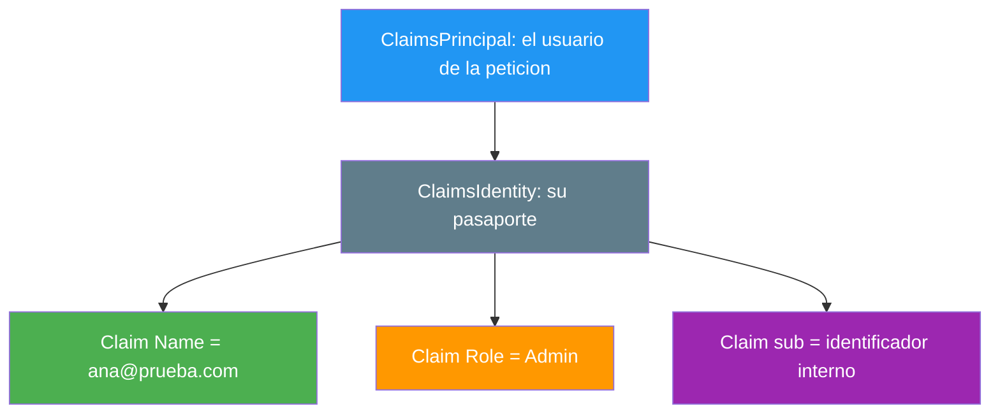
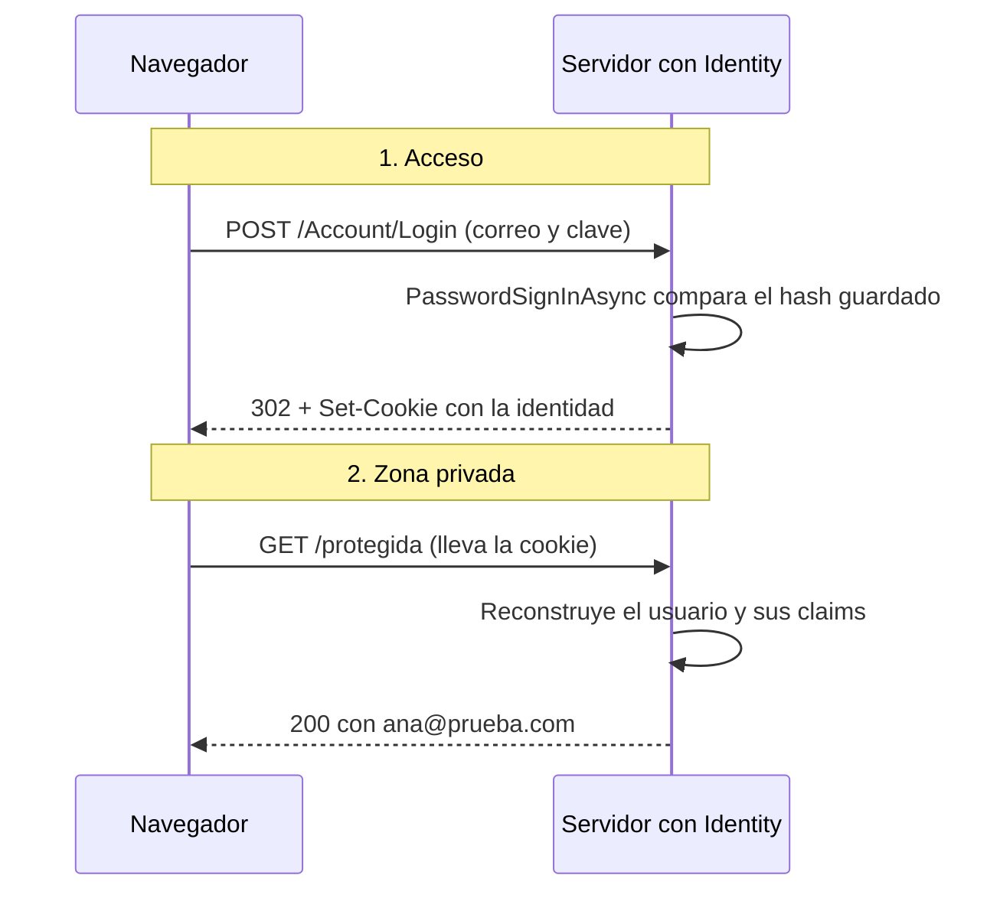
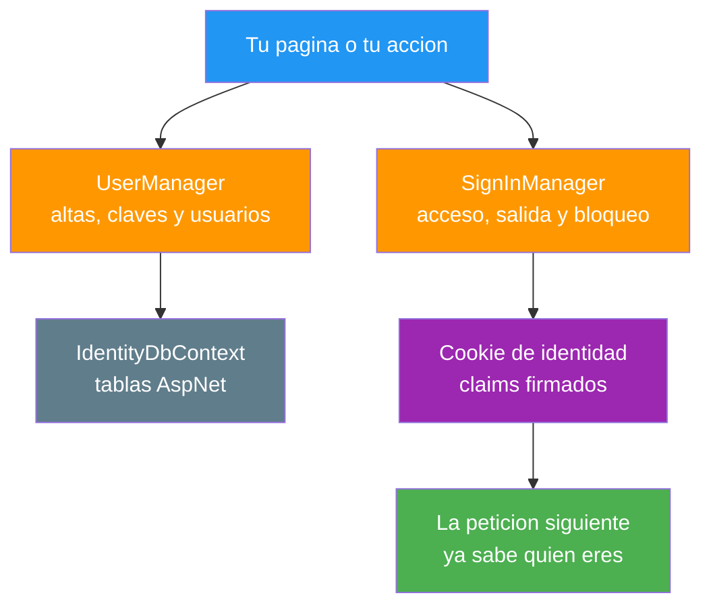
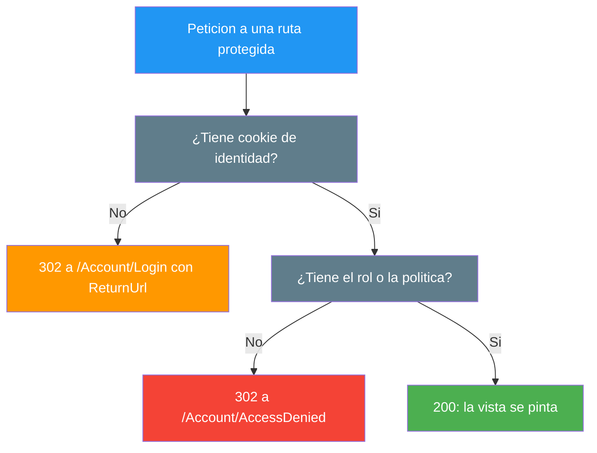
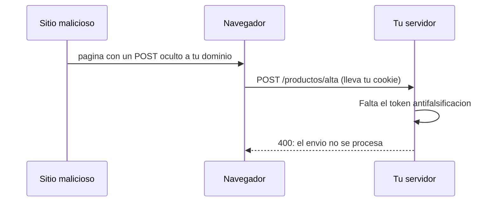

- [19. Autenticación de Usuarios con ASP.NET Core Identity](#19-autenticación-de-usuarios-con-aspnet-core-identity)
  - [19.1. La Identidad: Quién Eres en una Web](#191-la-identidad-quién-eres-en-una-web)
    - [19.1.1. Autenticarse y Autorizarse](#1911-autenticarse-y-autorizarse)
    - [19.1.2. Claims: el Pasaporte Digital](#1912-claims-el-pasaporte-digital)
    - [19.1.3. Qué Viaja en la Cookie de Identidad](#1913-qué-viaja-en-la-cookie-de-identidad)
  - [19.2. ASP.NET Core Identity: el Framework Oficial](#192-aspnet-core-identity-el-framework-oficial)
    - [19.2.1. Qué es y Qué Aporta](#1921-qué-es-y-qué-aporta)
    - [19.2.2. Modelos y Contexto de Datos](#1922-modelos-y-contexto-de-datos)
    - [19.2.3. Configuración en Program.cs](#1923-configuración-en-programcs)
    - [19.2.4. Visión Razor Pages: Registro y Acceso](#1924-visión-razor-pages-registro-y-acceso)
    - [19.2.5. Visión MVC: Registro y Acceso](#1925-visión-mvc-registro-y-acceso)
    - [19.2.6. Registro y Acceso, Comparados](#1926-registro-y-acceso-comparados)
    - [19.2.7. Cerrar la Sesión](#1927-cerrar-la-sesión)
  - [19.3. Autorización: Qué Puede Ver Cada Uno](#193-autorización-qué-puede-ver-cada-uno)
    - [19.3.1. La Regla con Atributo](#1931-la-regla-con-atributo)
    - [19.3.2. Visión Razor Pages: Atributos y Convenciones](#1932-visión-razor-pages-atributos-y-convenciones)
    - [19.3.3. Visión MVC: Atributos en Controlador y Acción](#1933-visión-mvc-atributos-en-controlador-y-acción)
    - [19.3.4. Roles y Políticas](#1934-roles-y-políticas)
    - [19.3.5. Requisitos y Autorización sobre Recursos](#1935-requisitos-y-autorización-sobre-recursos)
  - [19.4. Las Claves de Acceso](#194-las-claves-de-acceso)
  - [19.5. Ataques Frecuentes: CSRF y XSS](#195-ataques-frecuentes-csrf-y-xss)
  - [19.6. Reglas de Seguridad](#196-reglas-de-seguridad)
  - [19.7. Buenas Prácticas](#197-buenas-prácticas)
  - [19.8. Reto: El Acceso a la Tienda de Funkos](#198-reto-el-acceso-a-la-tienda-de-funkos)
    - [19.8.1. Contexto](#1981-contexto)
    - [19.8.2. Modelo de datos](#1982-modelo-de-datos)
    - [19.8.3. Almacenamiento](#1983-almacenamiento)
    - [19.8.4. Retos](#1984-retos)


# 19. Autenticación de Usuarios con ASP.NET Core Identity

> 💡 **Punto de partida:** abres Netflix en el ordenador de un amigo y, en cuanto escribes tu correo y tu clave, el catálogo deja de ser el suyo: tus listas, tu progreso, tu idioma. Si solo escribes mal la clave, la web se queda tan tranquila y no te deja pasar; si intentas entrar en la sección de administración, te cortan en seco. Detrás de ese gesto hay dos preguntas que la aplicación contesta en orden: primero, quién eres; después, qué puedes tocar. ¿Qué hay que montar en el servidor para que sepa lo primero en cada petición y para que solo pueda pasar quien cumpla lo segundo? En este punto se responde con el framework oficial de Microsoft, ASP.NET Core Identity, en las dos visiones.

Aquí construimos la autenticación completa con Identity oficial: qué es la identidad de un usuario y cómo se representa con claims, cómo se registran y se conectan usuarios con `UserManager` y `SignInManager`, cómo se protegen rutas con atributos, roles y políticas, y con qué defensas se contesta a los dos ataques de siempre, el falso envío de formularios y la inyección de scripts.

**Objetivos de aprendizaje:**

- Diferenciar autenticación y autorización, y representar la identidad con claims
- Conocer qué es ASP.NET Core Identity y qué aporta frente a una autenticación propia
- Configurar Identity en `Program.cs` con su contexto, sus políticas de clave y su bloqueo
- Registrar y dar acceso a usuarios con `UserManager` y `SignInManager` en las dos visiones
- Proteger rutas con `[Authorize]`, roles y políticas, en página y en controlador
- Defenderse del falso envío de formularios y de la inyección de scripts

> 📝 **Nota:** usamos Identity oficial tal y como viene del framework: `AddIdentity`, `IdentityUser`, `IdentityDbContext`, `UserManager` y `SignInManager`. Nada de autenticación escrita a mano: esa es la parte que se repite en todos los proyectos y el framework ya la trae hecha.

## 19.1. La Identidad: Quién Eres en una Web

### 19.1.1. Autenticarse y Autorizarse

**Autenticarse es demostrar quién eres; autorizarse es decidir qué puedes hacer una vez demostrado.** Son dos preguntas y dos momentos — el login responde a la primera y cada ruta protegida responde a la segunda.

📌 **Ejemplo real:** Instagram. El login te identifica como el dueño de tu cuenta y, además, hay acciones que solo puede hacer el que la posee (borrar tu publicación) y otras que hace cualquiera (verla). Una tienda en línea deja mirar el catálogo a cualquiera, el pago exige estar identificado y la sección de gestión exige, además, ser administrador.

> 💡 **Analogía:** el login es enseñar el DNI en la puerta; la autorización es el carnet que decide si entras al almacén o solo a la tienda.

### 19.1.2. Claims: el Pasaporte Digital

**La identidad de un usuario en .NET se representa con claims: pares `tipo-valor` que describen algo de quien llega.** El correo, el rol o el identificador interno son claims. Tres capas lo componen:

- **`Claim`**: el dato suelto, por ejemplo `Name = ana@prueba.com`.
- **`ClaimsIdentity`**: el conjunto de claims de una misma identidad, el pasaporte completo.
- **`ClaimsPrincipal`**: el sujeto que porta una o varias identidades; es lo que la petición arrastra como `User`.



📌 **Ejemplo real:** Netflix. Cuando te saluda por tu nombre en la barra superior, está leyendo el claim `Name` de la identidad que reconstruyó en esa petición.

Identity monta esos tres tipos al entrar; el patrón se ve si lo construyes tú mismo con la API oficial:

```csharp
var identidad = new ClaimsIdentity(
    [
        new Claim(ClaimTypes.Name, "ana@prueba.com"),
        new Claim(ClaimTypes.Role, "Admin")
    ],
    "CookieAcceso");

var usuario = new ClaimsPrincipal(identidad);
```

Las vistas lo tienen preparado en `User`: `@User.Identity?.Name` pinta el correo con el que entraste y `@User.IsInRole("Admin")` devuelve `true` solo si el claim de rol lo dice. Tras un acceso correcto, la zona privada pinta `ana@prueba.com`; el mismo formulario con la clave equivocada no llega a pintar nada de eso.

### 19.1.3. Qué Viaja en la Cookie de Identidad

Identity se apoya en las cookies del punto 18: el servidor crea la identidad y devuelve una cookie de autenticación; las peticiones siguientes la llevan y el servidor reconstruye el `ClaimsPrincipal` antes de que la acción o la página empiecen a trabajar. Por eso una zona protegida sabe quién eres sin preguntártelo en cada petición.



La cookie de identidad nace cifrada y con `HttpOnly`: quien la manipula desde el navegador deja de coincidir con la firma y el servidor la ignora. Ese es el mismo truco que ya viste guardando datos en el cliente — la diferencia es que aquí viaja la respuesta a "quién eres".

## 19.2. ASP.NET Core Identity: el Framework Oficial

### 19.2.1. Qué es y Qué Aporta

**ASP.NET Core Identity es el sistema de usuarios, accesos y roles que trae el framework.** Si te pusieras a escribirlo a mano, tocaría resolver el hash de las claves, el bloqueo por intentos, la verificación de correos, los roles y la cookie de identidad; Identity trae todo eso configurado y probado.

📌 **Ejemplo real:** Cualquier web con "Crear cuenta" y "Entrar" de las que usas a diario (una plataforma de cursos, una administración pública, una tienda) resuelve exactamente este ciclo: registro, acceso, sesión de identidad y salida.

Las piezas con las que trabaja son siempre las mismas:



Lo que aporta sobre una autenticación propia:

| Viene con Identity | Para qué sirve |
|--------------------|----------------|
| **`UserManager`** | Alta, búsqueda y modificación de usuarios; hashea las claves |
| **`SignInManager`** | Acceso, salida y comprobación de credenciales |
| **Políticas de clave** | Longitud, dígitos y símbolos exigidos en el alta |
| **Bloqueo** | Corta el paso tras un número de intentos fallidos |
| **Roles** | La relación usuario-rol con sus tablas |
| **Tokens** | Correo de confirmación y recuperación de clave |

### 19.2.2. Modelos y Contexto de Datos

Con `IdentityUser` no hace falta definir entidad de usuario: la clase oficial ya trae correo, hash de clave, sello de seguridad y las marcas de bloqueo. Para añadir campos propios se hereda de ella:

```csharp
// Usuario con campos de la casa (Data/UsuarioAplicacion.cs)
public class UsuarioAplicacion : IdentityUser
{
    public string? Nombre { get; set; }
    public DateTime AltaEn { get; set; } = DateTime.UtcNow;
}
```

El detalle que no se puede olvidar: el contexto hereda de `IdentityDbContext`, no de `DbContext`. De esa herencia salen las siete tablas que el framework espera:

```csharp
// Data/AppDbContext.cs
using Microsoft.AspNetCore.Identity.EntityFrameworkCore;
using Microsoft.EntityFrameworkCore;

public class AppDbContext(DbContextOptions<AppDbContext> options)
    : IdentityDbContext(options);
```

| Tablas `AspNet*` | Qué guardan |
|------------------|-------------|
| **`AspNetUsers`** | Cada usuario con su correo, su hash de clave y sus marcas de bloqueo |
| **`AspNetRoles`** | Los roles de la aplicación: `Admin`, `Editor`, los que definas |
| **`AspNetUserRoles`** | Qué rol tiene cada usuario |
| **`AspNetUserClaims`** | Claims propios de un usuario |
| **`AspNetRoleClaims`** | Claims propios de un rol |
| **`AspNetUserLogins`** | Accesos externos (Google, Microsoft), si algún día se usan |
| **`AspNetUserTokens`** | Tokens de confirmación y de recuperación de clave |

Si la identidad y los datos de negocio comparten `DbContext`, hay que dejar una sola clase y registrarla una vez: dos contextos para la misma base dan nombres de tabla y migraciones en guerra.

### 19.2.3. Configuración en Program.cs

Identity se monta en tres piezas: el contexto de datos, el servicio con sus políticas y el conducto de peticiones.

```csharp
// Program.cs
builder.Services.AddDbContext<AppDbContext>(options =>
    options.UseInMemoryDatabase("identidad"));   // en producción, tu proveedor real

builder.Services.AddIdentity<IdentityUser, IdentityRole>(options =>
{
    options.Password.RequiredLength = 8;
    options.Password.RequireDigit = true;
    options.Password.RequireNonAlphanumeric = true;
    options.Lockout.MaxFailedAccessAttempts = 5;
    options.Lockout.DefaultLockoutTimeSpan = TimeSpan.FromMinutes(5);
    options.User.RequireUniqueEmail = true;
})
.AddEntityFrameworkStores<AppDbContext>()   // dónde se guardan los usuarios
.AddDefaultTokenProviders();                // tokens de correo y de clave

var app = builder.Build();

app.UseRouting();
app.UseAuthentication();   // primero se identifica
app.UseAuthorization();    // después se decide qué puede
```

Cada bloque tiene su porqué:

- **`AddIdentity`** registra los gestores y su cookie de identidad; las opciones de `Password`, `Lockout` y `User` son la política de la casa: la clave "123" ni llega a la base y Identity contesta con su propio mensaje, `Passwords must be at least 8 characters.`, que aparece en el resumen del formulario con **200**.
- **`AddEntityFrameworkStores`** ata los gestores a tu contexto; **`AddDefaultTokenProviders`** habilita los tokens para confirmar correos y recuperar claves.
- **`UseAuthentication` antes de `UseAuthorization`** no es una preferencia: si la identidad se reconstruye después de decidir, todas las rutas se evalúan como anónimas.

> ⚠️ **Advertencia:** un `[Authorize]` sin `UseAuthentication` en el conducto no identifica a nadie; el orden de los middlewares es parte de la configuración de seguridad.

### 19.2.4. Visión Razor Pages: Registro y Acceso

En Razor Pages la lógica entera vive en el `PageModel`: los gestores entran por constructor primario y el posteo hace el trabajo.

```csharp
// Pages/Account/Registro.cshtml.cs
public class RegistroModel(
    UserManager<IdentityUser> userManager,
    SignInManager<IdentityUser> signInManager) : PageModel
{
    [BindProperty]
    public RegistroInput Input { get; set; } = new();

    public async Task<IActionResult> OnPostAsync()
    {
        if (!ModelState.IsValid)
        {
            return Page();
        }

        var usuario = new IdentityUser
        {
            UserName = Input.Email,
            Email = Input.Email,
            EmailConfirmed = true
        };

        var resultado = await userManager.CreateAsync(usuario, Input.Password);
        if (resultado.Succeeded)
        {
            await signInManager.SignInAsync(usuario, isPersistent: false);
            return RedirectToPage("/Protegida");
        }

        foreach (var error in resultado.Errors)
        {
            ModelState.AddModelError(string.Empty, error.Description);
        }

        return Page();
    }
}
```

El acceso repite el esqueleto con otro gestor:

```csharp
// Pages/Account/Login.cshtml.cs
public class LoginModel(SignInManager<IdentityUser> signInManager) : PageModel
{
    public async Task<IActionResult> OnPostAsync()
    {
        if (!ModelState.IsValid)
        {
            return Page();
        }

        var resultado = await signInManager.PasswordSignInAsync(
            Input.Email, Input.Password, isPersistent: false, lockoutOnFailure: false);

        if (resultado.Succeeded)
        {
            return RedirectToPage("/Protegida");
        }

        Mensaje = "Credenciales invalidas";
        return Page();
    }
}
```

Tres detalles que conviene retener:

- **`CreateAsync` devuelve `IdentityResult`**: si la clave no cumple la política, `resultado.Succeeded` es `false` y `resultado.Errors` trae los motivos; volcarlos al `ModelState` con `AddModelError(string.Empty, ...)` es lo que pinta el resumen del formulario
- **`PasswordSignInAsync` contesta con redirección**: un acceso correcto termina en **302** hacia la zona privada y la vista resultante pinta `ana@prueba.com`; una clave mala devuelve la propia página con **200** y el aviso `Credenciales invalidas`
- **`SignInAsync` tras el alta** deja al recién creado identificado en la misma petición, sin obligarle a volver a entrar

📌 **Ejemplo real:** Cualquier registro de una plataforma de cursos hace exactamente esto: si la clave es débil devuelve el formulario con los motivos del validador, y si es buena entra directamente en el área personal.

### 19.2.5. Visión MVC: Registro y Acceso

En MVC el mismo trabajo se reparte en acciones: una pinta el formulario y otra recibe el envío, con el mismo gestor inyectado por constructor primario.

```csharp
// Controllers/CuentaController.cs
public class CuentaController(
    SignInManager<IdentityUser> signInManager,
    UserManager<IdentityUser> userManager) : Controller
{
    [HttpGet("/Account/Login")]
    [AllowAnonymous]
    public IActionResult Login() => View(new LoginInput());

    [HttpPost("/Account/Login")]
    [AllowAnonymous]
    [ValidateAntiForgeryToken]
    public async Task<IActionResult> Login(LoginInput input)
    {
        if (!ModelState.IsValid)
        {
            return View(input);
        }

        var resultado = await signInManager.PasswordSignInAsync(
            input.Email, input.Password, isPersistent: false, lockoutOnFailure: false);

        if (resultado.Succeeded)
        {
            return RedirectToAction("Index", "Protegida");
        }

        ModelState.AddModelError(string.Empty, "Credenciales invalidas");
        return View(input);
    }
}
```

El alta es la misma que en Pages, con `CreateAsync` y sus errores al `ModelState`; lo propio de MVC son tres decisiones:

- **Acciones emparejadas**: `Login` (GET) pinta y `Login` (POST) procesa; el navegador las distingue por el verbo de la petición
- **`[ValidateAntiForgeryToken]` en el POST**: el formulario de Tag Helper escribe el token solo y la acción exige recibirlo; un envío sin él termina en **400**
- **`[AllowAnonymous]` en el acceso**: anula la protección si algún día se protege el controlador entero

📌 **Ejemplo real:** Glovo. El paso de identificación separa igual las dos acciones: una sirve el formulario y otra procesa lo que envías.

### 19.2.6. Registro y Acceso, Comparados

| Tema | Razor Pages | MVC |
|------|-------------|-----|
| **Dónde vive la lógica** | `PageModel` de la página | Controlador y acción |
| **Alta** | `UserManager.CreateAsync` en `OnPostAsync` | `UserManager.CreateAsync` en la acción POST |
| **Acceso** | `SignInManager.PasswordSignInAsync` | El mismo gestor y la misma llamada |
| **Tras entrar** | `RedirectToPage("/Protegida")` | `RedirectToAction("Index", "Protegida")` |
| **Errores de Identity** | `ModelState.AddModelError(string.Empty, ...)` | Igual, recorriendo `result.Errors` |
| **Token antifalsificación** | Automático en el `<form>` de Tag Helper | `[ValidateAntiForgeryToken]` en la acción |
| **Acceso anónimo** | Página sin `[Authorize]` | `[AllowAnonymous]` en la acción |

> 📝 **Nota:** cambian el sitio donde escribes las cosas, no las cosas: los dos gestores, sus resultados y sus errores son los mismos en las dos visiones.

### 19.2.7. Cerrar la Sesión

**Salir es una sola llamada: `SignInManager.SignOutAsync()` borra la cookie de identidad.** En Pages va en un `OnPostAsync` de la página de salida:

```csharp
// Pages/Account/Salir.cshtml.cs
public async Task<IActionResult> OnPostAsync()
{
    await signInManager.SignOutAsync();
    return RedirectToPage("/Account/Login");
}
```

Y en MVC, en una acción `POST` del controlador de cuentas:

```csharp
// Controllers/CuentaController.cs
[HttpPost("/Account/Salir")]
[ValidateAntiForgeryToken]
public async Task<IActionResult> Salir()
{
    await signInManager.SignOutAsync();
    return RedirectToAction("Login", "Cuenta");
}
```

El resultado se ve en la siguiente petición: quien cierra sesión recibe **302** de vuelta al acceso y, si después pide la zona privada de nuevo, responde **302** con `Location: /Account/Login?ReturnUrl=%2Fprotegida`, igual que si nunca hubiera entrado. La cookie no avisa de nada — desaparece y la petición siguiente llega anónima.

> 📝 **Nota:** el token antifalsificación va ligado a la identidad de quien lo pidió: el que se emite en el formulario de acceso deja de valer en cuanto entras, y un cierre de sesión montado a mano con ese token viejo responde **400**. Si pides el token de nuevo en el formulario de salida, se cierra sin ruido.

## 19.3. Autorización: Qué Puede Ver Cada Uno

### 19.3.1. La Regla con Atributo

**Una ruta se protege con un atributo: `[Authorize]` en el `PageModel` o en el controlador.** Ese solo atributo cambia la ruta para siempre — lo que antes pintaba, ahora redirige.

📌 **Ejemplo real:** Amazon te deja mirar el catálogo sin identificarte, pero "Mis pedidos" te manda al acceso. La tienda no comprueba eso a mano en cada acción: la regla vive en la propia ruta.

Sin identificar, la petición a la zona privada no devuelve la vista ni devuelve un error: responde **302** con `Location: /Account/Login?ReturnUrl=%2Fprotegida`. La redirección cumple dos trabajos a la vez: echarte al acceso y recordar dónde querías entrar para devolverte allí cuando termines. Ese código de respuesta es la prueba de que la regla funciona, y en las dos visiones sale idéntico.

> 🔧 **Truco:** sin instalar nada, `curl -i http://localhost:5307/protegida` devuelve el **302** con su cabecera `Location` encima: la redirección se ve entera desde la terminal, sin abrir el navegador.

El conducto entero queda así, con el orden que decide de todo:

```csharp
// ❌ MALO: la autorización decide antes de identificar a nadie
app.UseAuthorization();
app.UseAuthentication();

// ✅ BUENO: primero se identifica, después se decide
app.UseAuthentication();
app.UseAuthorization();
```

### 19.3.2. Visión Razor Pages: Atributos y Convenciones

El atributo va en el `PageModel`, que es quien representa la vista:

```csharp
// Pages/Protegida.cshtml.cs
[Authorize]
public class ProtegidaModel : PageModel
{
}
```

Cuando hay que proteger una carpeta entera no se repite el atributo página a página: se declara una convención en el arranque.

```csharp
builder.Services.AddRazorPages(options =>
{
    options.Conventions.AuthorizeFolder("/Admin");            // toda la carpeta pide identificación
    options.Conventions.AllowAnonymousToPage("/Account/Login");
});
```

Lo razonable es combinarlas: convención para la carpeta, atributo para la excepción. Si la convención exige un nombre de política, como `AuthorizeFolder("/Admin", "EsAdmin")`, esa política tiene que estar registrada en `AddAuthorization`, como se ve en el apartado de roles.

> 💡 **Consejo:** proteger por convención evita el olvido clásico: una página nueva dentro de una carpeta protegida ya nace protegida.

### 19.3.3. Visión MVC: Atributos en Controlador y Acción

En MVC el mismo atributo se coloca donde más convenga: en la clase protege todas las acciones de esa clase y, suelto, protege solo esa acción.

```csharp
// Controllers/ProtegidaController.cs
[Authorize]
public class ProtegidaController : Controller
{
    [HttpGet("/protegida")]
    public IActionResult Index() => View();
}
```

Puede anidarse con rol en la misma clase y abrirse con `[AllowAnonymous]` en las acciones de acceso. También se puede proteger la aplicación entera con un filtro global, y entonces lo normal es declarar anónimas las acciones de login y registro.

📌 **Ejemplo real:** WordPress. Los paneles de gestión funcionan así: el controlador entero pide identificación y las acciones de acceso quedan abiertas.

### 19.3.4. Roles y Políticas

**`[Authorize(Roles = "Admin")]` añade una condición más: no basta con estar identificado, hay que traer el rol.** En las dos visiones sale lo mismo: `ana@prueba.com`, identificada pero sin el rol, pide `/admin` y recibe **302** con `Location: /Account/AccessDenied?ReturnUrl=%2Fadmin`; `admin@prueba.com`, con el rol, recibe **200** y la vista pinta su correo.

Para que la redirección del aviso no aterrice en una página inexistente, se crea la vista o la acción `/Account/AccessDenied` con un mensaje claro; quien llega sin permisos merece una explicación, no un hueco.

Cuando la condición no es un rol sino algo propio de la aplicación, se registra una política con nombre:

```csharp
builder.Services.AddAuthorization(options =>
{
    options.AddPolicy("EsAdmin", politica => politica.RequireRole("Admin"));
});

// en la página o en la acción
[Authorize(Policy = "EsAdmin")]
```

Cada petición a una ruta protegida recorre este camino:



> 📝 **Nota:** el rol viaja como un claim más en la identidad, así que `User.IsInRole("Admin")` en la vista responde sin mirar la base de datos en cada petición.

> 💡 **Consejo:** nombra las políticas por lo que dicen (`EsAdmin`, `PuedeEditar`), no por el archivo donde se usan: el nombre se lee en cada `[Authorize(Policy = "...")]` y en la página de acceso denegado.

### 19.3.5. Requisitos y Autorización sobre Recursos

**Cuando el rol no basta, la condición se escribe como requisito: una clase que declara qué hace falta y un manejador que lo comprueba.** El caso típico es el dueño del recurso: que solo quien dio de alta un producto pueda editarlo. Para eso el producto lleva un campo con el identificador de su dueño, `DuenoId`, que se rellena en el alta con el claim `NameIdentifier` del usuario que la hace.

```csharp
// Requisito: qué se exige (es una declaración vacía, no lleva lógica)
public class EsDuenoRequirement : IAuthorizationRequirement;

// Manejador: quién compara el recurso con el usuario que llega
public class EsDuenoHandler : AuthorizationHandler<EsDuenoRequirement, Producto>
{
    protected override Task HandleRequirementAsync(
        AuthorizationHandlerContext context,
        EsDuenoRequirement requirement,
        Producto recurso)
    {
        if (context.User.FindFirst(ClaimTypes.NameIdentifier)?.Value == recurso.DuenoId)
        {
            context.Succeed(requirement);
        }

        return Task.CompletedTask;
    }
}
```

El manejador se registra en el arranque y la política se monta encima del requisito:

```csharp
// Program.cs
builder.Services.AddSingleton<IAuthorizationHandler, EsDuenoHandler>();
builder.Services.AddAuthorization(options =>
{
    options.AddPolicy("EsDueno", politica =>
        politica.AddRequirements(new EsDuenoRequirement()));
});
```

Y ahí está la diferencia con lo anterior: en la autorización sobre recursos la comprobación se hace en el momento, con el recurso en la mano, no en la entrada. La acción recibe el objeto, pregunta a `IAuthorizationService` y decide:

```csharp
public class ProductosController(
    IAuthorizationService autorizacion) : Controller
{
    [HttpPost("/productos/editar")]
    [ValidateAntiForgeryToken]
    public async Task<IActionResult> Editar(Producto producto)
    {
        var decision = await autorizacion.AuthorizeAsync(User, producto, "EsDueno");
        if (!decision.Succeeded)
        {
            return Forbid();
        }

        // el recurso es del usuario que llega: se continúa
        return View("Detalle", producto);
    }
}
```

📌 **Ejemplo real:** Instagram. Puedes editar o borrar tus propias publicaciones y no las de nadie más, y no hace falta un rol distinto para cada persona: quien decide es la comparación entre tu identidad y el dueño guardado en la publicación.

Cuándo usar cada versión:

| Situación | Qué se declara |
|-----------|----------------|
| **Zona entera abierta o cerrada** | `[Authorize]` en la ruta |
| **Un grupo de cuentas** | Rol con `[Authorize(Roles = ...)]` |
| **Una condición de la casa** | Política con nombre en `AddPolicy` |
| **Depende del recurso** | Requisito y manejador, y se evalúa con `IAuthorizationService` sobre el objeto |

> 💡 **Analogía:** el rol es el carnet de la planta; el requisito sobre el recurso es comprobar en la puerta del despacho, con el papel delante, que ese despacho es tuyo.

## 19.4. Las Claves de Acceso

**La clave nunca se guarda tal cual la escribe el usuario: se guarda su hash.** Si la tabla de usuarios se cae en manos de alguien, ese alguien debe ganarse cada clave probándola una a una.

| Cómo se guarda | Cómo es | Para qué sirve o por qué no sirve |
|----------------|---------|-----------------------------------|
| **Texto plano** | La clave tal cual | Cualquiera que lea la tabla tiene todas las claves |
| **MD5 o SHA-256 solos** | Hash rápido y sin sal | Se adivina por millones por segundo, así que no protege nada |
| **Hash con sal y coste** | Sal propia por usuario y algoritmo lento | Adivinar exige tiempo real por intento |
| **PBKDF2** | Sal y muchas iteraciones de un hash rápido | Lo que Identity trae configurado de fábrica |
| **BCrypt y Argon2** | Hash lento con el coste ajustable | Alternativas al de Identity si algún día se hashea fuera del framework |

Identity hashea por ti con `IPasswordHasher<IdentityUser>`: cada usuario guarda su propio hash, con sal y con un algoritmo lento a propósito, de modo que comprobar una clave sigue siendo barato para el servidor y caro para el atacante. Ese hash es lo que compara `PasswordSignInAsync` en cada acceso.

La política vive en `AddIdentity` y se hace valer en el alta: la clave `123` devuelve **200** con el mensaje oficial `Passwords must be at least 8 characters.` en el resumen del formulario, y la misma petición con una clave buena pasa sin ruido.

Junto a la política de claves va el bloqueo por intentos: `MaxFailedAccessAttempts = 5` con `DefaultLockoutTimeSpan = 5 minutos` cierra el paso a quien prueba claves a la carrera, que es la diferencia entre un despiste y un ataque de fuerza bruta.

> ⚠️ **Advertencia:** el aviso de acceso fallido debe ser genérico. Decir "ese correo no existe" o "esa clave no coincide" le ahorra trabajo al atacante, porque ya sabe cuál de los dos datos es el bueno.

📌 **Ejemplo real:** LinkedIn. Cuando en 2012 se filtraron las contraseñas de sus usuarios, lo que circuló fue un listado de hashes: para reventar cada una hubo que adivinarla una a una.

## 19.5. Ataques Frecuentes: CSRF y XSS

**El falso envío de formularios (CSRF) consiste en que otra web dispare un `POST` contra tu aplicación usando la cookie que ya tienes.** La cookie viaja sola, porque el navegador la adjunta sin preguntar a nadie, y esa es justo la pieza que explota el ataque: tu identificación, sin tu intención.



La defensa es el token antifalsificación, un secreto que el servidor emite en el formulario y exige recibir de vuelta. En las dos visiones un `POST` a `/productos/alta` sin ese token responde **400** y no toca nada; el mismo envío con el token entra normalmente. El token corta el ataque por la raíz — sin él, el `POST` ni siquiera se procesa.

- **Razor Pages**: el `<form>` de Tag Helper escribe el token solo y la página lo valida en el posteo
- **MVC**: el token viaja igual en el formulario y la acción lo declara con `[ValidateAntiForgeryToken]`

📌 **Ejemplo real:** Un banco online no acepta transferencias por cualquier enlace: exige un segundo factor que el navegador no puede mandar solo. El token antifalsificación es la versión mínima de esa misma idea.

**La inyección de scripts (XSS) consiste en que un texto tuyo se interprete como código.** Si alguien escribe `<script>alert(1)</script>` en un nombre y la vista lo pinta tal cual, ese script se ejecuta en el navegador de quien mire el listado.

Razor escapa por defecto todo lo que sale de `@`: el mismo producto con `<script>` en el nombre aparece en el listado escrito como `&lt;script&gt;` y no se ejecuta. El escapado es automático en las dos visiones; desactivarlo es una decisión que hay que tomar a propósito.

> 📝 **Nota:** `@Html.Raw(...)` escribe sin escapar. Solo vale para HTML generado por ti y de confianza; pasarle datos del usuario es abrirle la puerta al XSS.

📌 **Ejemplo real:** El buscador de cualquier periódico pinta lo que escribes en la caja de búsqueda: si lo hiciera sin escapar, bastaría un enlace con texto trucado para ejecutar código en quien lo abriera.

## 19.6. Reglas de Seguridad

- **`[Authorize]` en cada ruta privada**: una carpeta olvidada devuelve su vista a cualquiera
- **Valida el `ReturnUrl`** antes de redirigir — viene del navegador y debe apuntar a tu propia web, o la bandera falsa te envía a otro sitio
- **Nada de claves en claro**: ni en la base de datos, ni en la sesión, ni en `localStorage`
- **Token antifalsificación en todo `POST`** que cambie datos
- **Sin `Html.Raw` con datos del usuario**: el escapado por defecto de Razor es la defensa del XSS
- **Avisos genéricos** en el acceso fallido; los motivos se quedan en el servidor
- **Roles mínimos**: el rol solo donde de verdad hace falta, y con política con nombre si se repite
- **Bloqueo activado**: cinco intentos y corte, para que la fuerza bruta no sea gratis
- **Cookie de identidad endurecida**: `HttpOnly` de fábrica y, en producción, `Secure` y `SameSite` en las opciones de la cookie
- **Página de acceso denegado propia**: quien no tiene rol recibe un aviso claro, no un hueco

## 19.7. Buenas Prácticas

- **Identity desde el primer día**: la autenticación propia se paga después en mantenimiento y en huecos de seguridad
- **Constructor primario** para `UserManager` y `SignInManager` en `PageModel` y en controladores
- **`result.Errors` al `ModelState`** con `AddModelError(string.Empty, ...)`, que es lo que pinta el resumen del formulario
- **Convención para carpetas, atributo para excepciones**: menos repetición y menos olvidos
- **Política con nombre** para las condiciones que se usan en más de un sitio
- **Acceso anónimo declarado** en las acciones de login y registro
- **Token antifalsificación en los `POST`**, con Tag Helper en Pages y con atributo en MVC
- **Escapado por defecto**; `Html.Raw` solo con HTML generado por ti
- **Política de claves y bloqueo** configurados en `AddIdentity`, no cuando ya están los usuarios
- **Identidad leída desde `User`**: `User.Identity?.Name` y `User.IsInRole(...)` en la vista

## 19.8. Reto: El Acceso a la Tienda de Funkos

> Haz que tu tienda tenga dueños: alta de usuarios con Identity, acceso con correo y clave, y una zona privada que solo entra quien se ha identificado, en las dos visiones.

### 19.8.1. Contexto

**Paso 0:** parte del reto del punto 18 en sus dos visiones (`FunkoApp` y `FunkoAppMvc`), con la cesta en sesión y las preferencias en cookie funcionando.

### 19.8.2. Modelo de datos

| Propiedad | Tipo | Obligatorio |
|-----------|------|:-----------:|
| `id` | int | Sí (autogenerado) |
| `nombre` | string | Sí |
| `categoria` | string | Sí |
| `anio` | int | Sí |
| `precioReferencia` | decimal | Sí |
| `imagen` | string? | No |
| `etiquetas` | List\<string\>? | No |
| `activo` | bool | Sí |
| `esNovedad` | bool | Sí |

### 19.8.3. Almacenamiento

```csharp
public static class RepositorioFunkos
{
    private static readonly List<Funko> Funkos = [ /* seis figuras */ ];

    public static IReadOnlyList<Funko> ObtenerTodos() => Funkos;
}
```

Rellena la lista con seis figuras de modo que haya activas y dadas de baja, novedades y no novedades, y las tres categorías.

### 19.8.4. Retos

**Pasos compartidos (las dos visiones):**

1. **En papel primero:** dibuja el mapa de acceso de tu tienda: quién entra, con qué credenciales, qué rutas quedan cerradas y qué rol decide cada una
2. Añade los paquetes `Microsoft.AspNetCore.Identity.EntityFrameworkCore` y un proveedor de Entity Framework, crea `AppDbContext : IdentityDbContext` y registra `AddIdentity` con sus políticas; comprueba que la aplicación arranca y que las tablas `AspNetUsers` existen
3. Ordena el conducto con `UseAuthentication` antes de `UseAuthorization` y comprueba que una petición a la zona privada sin identificar responde **302** con `Location: /Account/Login?ReturnUrl=%2F...`
4. Monta el alta con `UserManager.CreateAsync`; comprueba que una clave `123` devuelve `Passwords must be at least 8 characters.` en el resumen del formulario
5. Monta el acceso con `SignInManager.PasswordSignInAsync`; comprueba que un acceso correcto redirige a la zona privada y que la vista pinta tu correo, y que una clave mala muestra `Credenciales invalidas` sin decir cuál de los dos datos falla
6. Cierra la sesión con `SignOutAsync` y comprueba que la siguiente petición vuelve al **302** del paso 3
7. Revisa en **F12** (Application > Cookies) que la cookie de identidad aparece marcada como `HttpOnly`; toca su valor, recarga y comprueba que la petición deja de reconocerte
8. Escribe `<script>alert(1)</script>` en el nombre de un funko y comprueba en el listado que aparece como `&lt;script&gt;`, sin ejecutarse

**Visión Razor Pages:**

9. Escribe el `[Authorize]` en el `PageModel` de la zona privada, protege la carpeta de administración con `AuthorizeFolder` y deja `AllowAnonymousToPage` en la página de acceso; comprueba que la carpeta protegida redirige y la de acceso entra sin identificar
10. Pinta `@User.Identity?.Name` y `@User.IsInRole("Admin")` en la vista privada; comprueba que aparece tu correo y que el rol sale en `no` hasta que lo asignes

**Visión MVC:**

11. Escribe el `[Authorize]` en el controlador de la zona privada y `[AllowAnonymous]` en las acciones de acceso; comprueba que la acción protegida responde **302** en ventana de incógnito y **200** con la cookie puesta
12. Añade `[ValidateAntiForgeryToken]` a los `POST` de alta y de acceso; comprueba que un envío sin token responde **400** y que el envío con el formulario va bien

**Puntos extra:**

- Crea la acción o la vista de `/Account/AccessDenied` y comprueba que un usuario sin rol aterriza en ella con su aviso en lugar de en un hueco
- Crea un rol `Admin` con `RoleManager`, asígnalo a una cuenta con `UserManager.AddToRoleAsync` y comprueba que `[Authorize(Roles = "Admin")]` deja entrar solo a esa cuenta
- Añade `[Authorize(Policy = "EsAdmin")]` con su `AddPolicy` y comprueba que hace lo mismo que la versión con rol
- Escribe en el repositorio por qué el `ReturnUrl` hay que validar antes de usarlo

---

**Resumen del punto:**

| Concepto | Descripción |
|----------|-------------|
| **Autenticación / autorización** | Quién eres / qué puedes hacer |
| **Claim** | Par `tipo-valor` de la identidad |
| **`ClaimsPrincipal`** | El usuario de la petición, expuesto en las vistas como `User` |
| **ASP.NET Core Identity** | Usuarios, accesos y roles tal y como vienen del framework |
| **`IdentityDbContext`** | Contexto oficial; de él salen las tablas `AspNet*` |
| **`UserManager`** | Altas y gestión de usuarios; hashea las claves |
| **`SignInManager`** | Acceso, salida y comprobación de credenciales |
| **`AddIdentity`** | Registro con políticas de clave, bloqueo y tokens |
| **`UseAuthentication` + `UseAuthorization`** | Orden fijo en el conducto de peticiones |
| **`[Authorize]`** | Protege página o controlador; sin identificar, **302** a `/Account/Login` con `ReturnUrl` |
| **Roles y políticas** | `[Authorize(Roles)]` y `AddPolicy`; sin el rol, **302** a `/Account/AccessDenied` |
| **Hash con sal** | La clave se guarda como hash; `123` choca con la política de 8 caracteres |
| **Token antifalsificación** | `POST` sin token: **400** |
| **Escapado de Razor** | `@` pinta `&lt;script&gt;` en lugar de ejecutarlo |
| **Comprobado** | **302** a Login y a AccessDenied, **200** con el usuario en las dos visiones, mensaje oficial de Identity con clave débil, **400** sin token, **302** al cerrar sesión con `SignOutAsync` y XSS escapado en el listado |

**¿Qué viene después?**

En el siguiente punto toca la Configuración de la Aplicación Web: separar los ajustes de cada entorno para que lo que funciona en local no rompa nada cuando la aplicación salga a producción.
