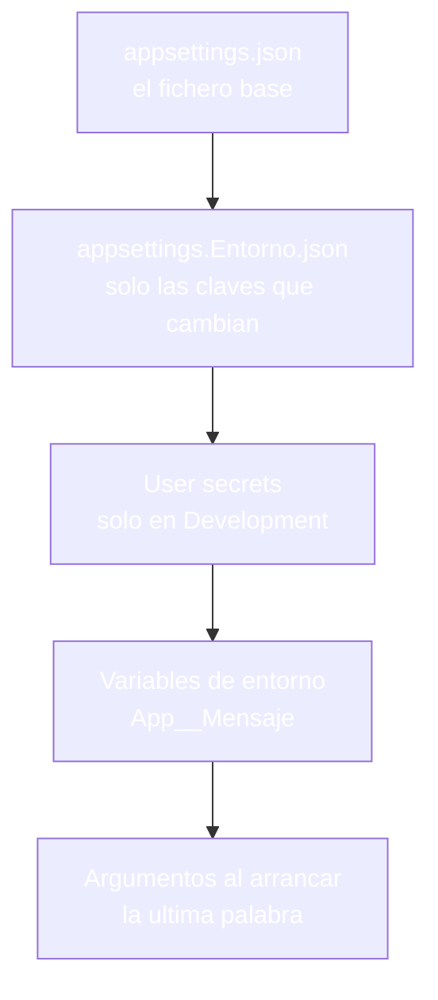
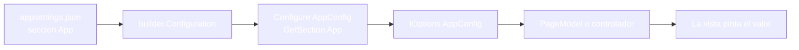
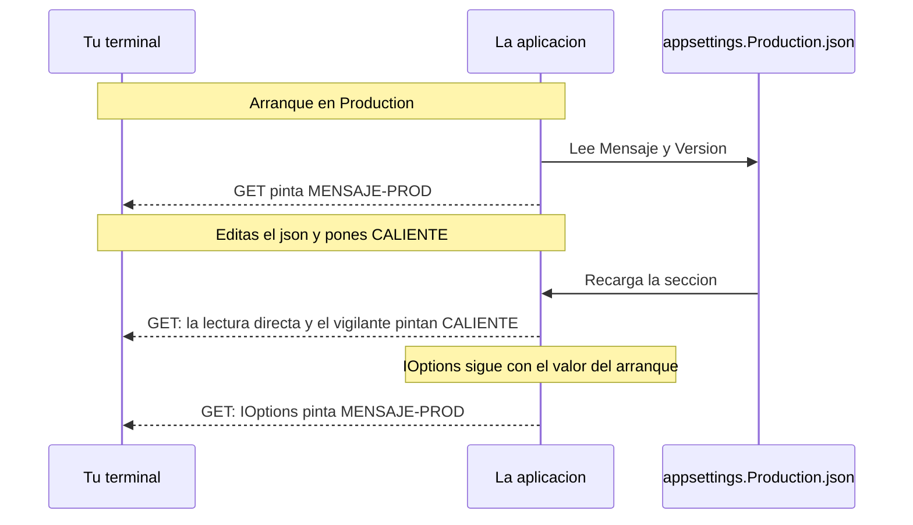
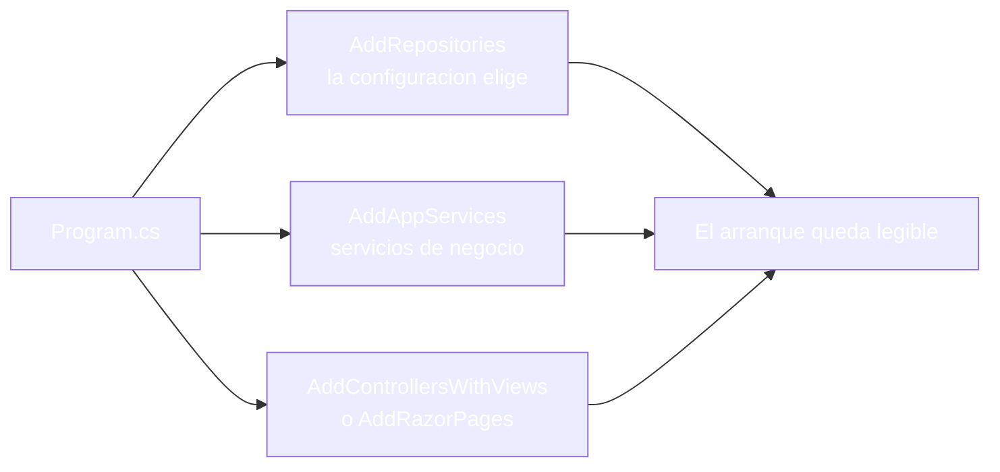
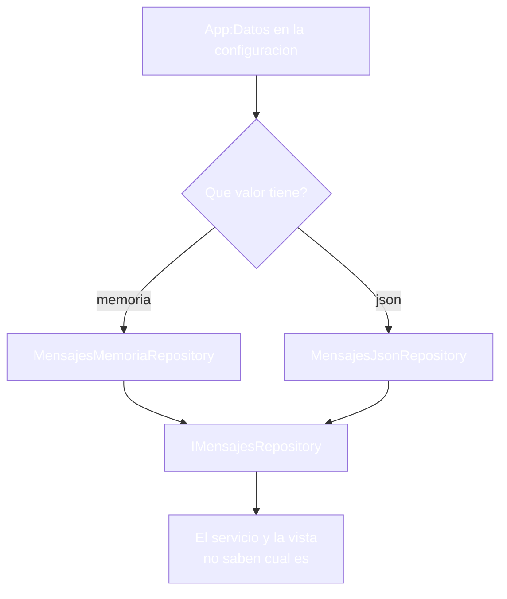
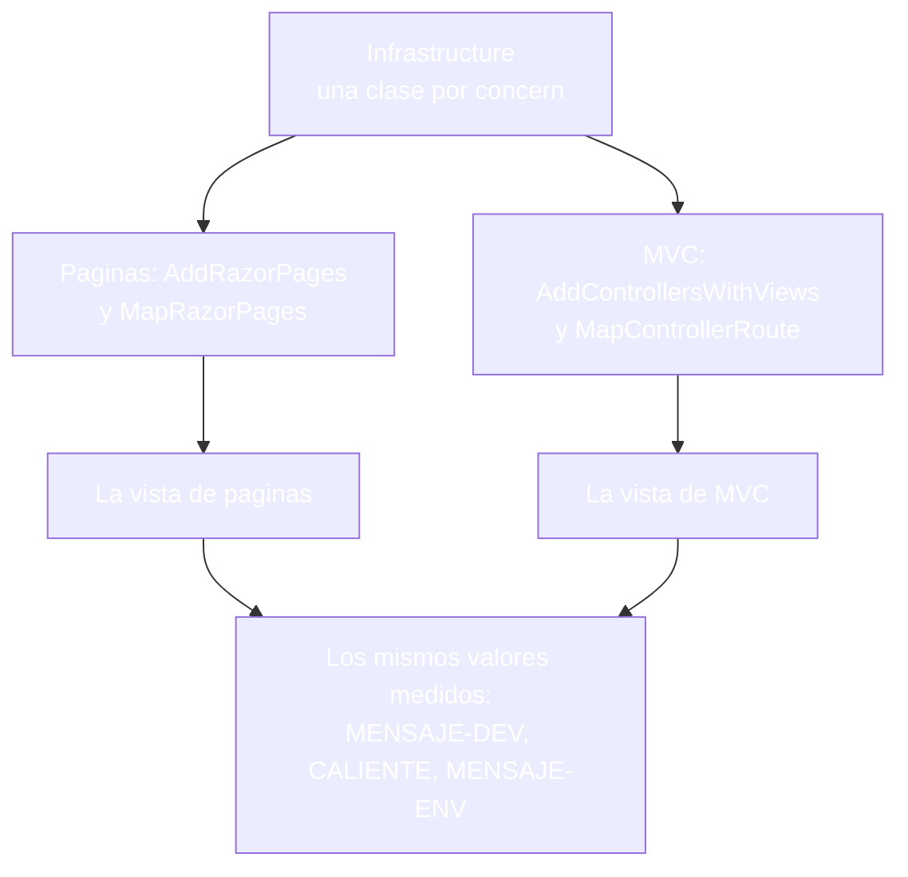
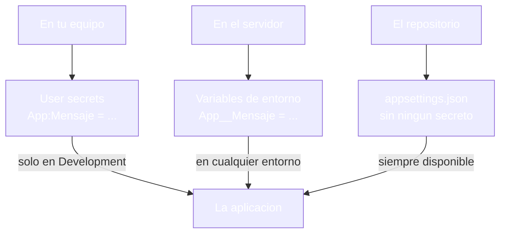

- [20. Configuración de la aplicación web](#20-configuración-de-la-aplicación-web)
  - [20.1. Configuración: dónde vive la decisión](#201-configuración-dónde-vive-la-decisión)
    - [20.1.1. Appsettings.json y sus variantes](#2011-appsettingsjson-y-sus-variantes)
    - [20.1.2. El orden de las fuentes](#2012-el-orden-de-las-fuentes)
    - [20.1.3. Entornos: Development y Production](#2013-entornos-development-y-production)
  - [20.2. IConfiguration y el patrón de opciones](#202-iconfiguration-y-el-patrón-de-opciones)
    - [20.2.1. Leer con IConfiguration](#2021-leer-con-iconfiguration)
    - [20.2.2. La clase de opciones y IOptions&lt;T&gt;](#2022-la-clase-de-opciones-y-ioptionst)
    - [20.2.3. Visión Razor Pages: la opción en un PageModel](#2023-visión-razor-pages-la-opción-en-un-pagemodel)
    - [20.2.4. Visión MVC: la opción en un controlador](#2024-visión-mvc-la-opción-en-un-controlador)
    - [20.2.5. Vigilancia y recarga](#2025-vigilancia-y-recarga)
    - [20.2.6. Validación al arrancar](#2026-validación-al-arrancar)
  - [20.3. Infrastructure: configurar el programa por concern](#203-infrastructure-configurar-el-programa-por-concern)
    - [20.3.1. La idea: Program.cs no se llena](#2031-la-idea-programcs-no-se-llena)
    - [20.3.2. RepositoriesConfig: la configuración elige la implementación](#2032-repositoriesconfig-la-configuración-elige-la-implementación)
    - [20.3.3. ServicesConfig y el resto de concerns](#2033-servicesconfig-y-el-resto-de-concerns)
    - [20.3.4. Visión Razor Pages: el Program.cs entero](#2034-visión-razor-pages-el-programcs-entero)
    - [20.3.5. Visión MVC: el Program.cs entero](#2035-visión-mvc-el-programcs-entero)
    - [20.3.6. Las dos visiones, comparadas](#2036-las-dos-visiones-comparadas)
  - [20.4. Secretos y entornos sin fugas](#204-secretos-y-entornos-sin-fugas)
    - [20.4.1. User Secrets en desarrollo](#2041-user-secrets-en-desarrollo)
    - [20.4.2. Variables de entorno en producción](#2042-variables-de-entorno-en-producción)
  - [20.5. Reglas de seguridad](#205-reglas-de-seguridad)
  - [20.6. Buenas prácticas](#206-buenas-prácticas)
  - [20.7. Reto: la configuración de la tienda de Funkos](#207-reto-la-configuración-de-la-tienda-de-funkos)
    - [20.7.1. Contexto](#2071-contexto)
    - [20.7.2. Modelo de datos](#2072-modelo-de-datos)
    - [20.7.3. Almacenamiento](#2073-almacenamiento)
    - [20.7.4. Retos](#2074-retos)


# 20. Configuración de la aplicación web

> 💡 **Punto de partida:** Abres Netflix en el móvil de tu primo y, en su catálogo, hay una serie que en el tuyo no aparece. El programa que sirve las dos peticiones es el mismo — lo que cambia es la configuración con la que arranca cada servidor. Le pasa a Amazon, que enseña un precio u otro según el país y la cuenta. Y le pasará a tu proyecto en cuanto lo subas al servidor del centro: el código será idéntico, pero la base de datos, el correo y las rutas tienen que mirar a otro sitio, y si nadie lo dice, todo sigue buscando donde estaba en tu máquina. ¿Dónde se guarda esa configuración, en qué orden se leen las fuentes que la contienen y cómo se hace para que el mismo programa se comporte distinto según dónde corra?

En este punto aprenderás a montar la configuración completa de una aplicación: el fichero base y sus variantes por entorno, las fuentes que lo superponen, el patrón de opciones con `IOptions<T>`, la carpeta `Infrastructure` que mantiene el `Program.cs` legible, y los secretos que no pueden pisar un repositorio. Todo se hace en las dos visiones y con los mismos resultados en las dos.

**Objetivos de aprendizaje:**

- Saber dónde se guarda la configuración y en qué orden se leen las fuentes
- Leer valores con `IConfiguration` y usar el patrón de opciones con `IOptions<T>`
- Separar el cableado del código con la carpeta `Infrastructure` y una clase por concern
- Vigilar los valores que cambian en caliente y validar la configuración al arrancar
- Mantener los secretos fuera del repositorio y montar la configuración igual en las dos visiones

## 20.1. Configuración: dónde vive la decisión

### 20.1.1. Appsettings.json y sus variantes

**La configuración de una aplicación vive en ficheros JSON que el programa solo consulta, nunca edita.** El fichero base se llama `appsettings.json` y vive en la raíz del proyecto, junto a `Program.cs`; dentro, cada módulo tiene su sección y cada valor su clave:

```json
{
  "Logging": {
    "LogLevel": {
      "Default": "Information",
      "Microsoft.AspNetCore": "Warning"
    }
  },
  "AllowedHosts": "*",
  "App": {
    "Mensaje": "MENSAJE-BASE",
    "Version": "1.0.0",
    "Datos": "memoria"
  }
}
```

Junto al base aparecen dos variantes con el mismo formato, `appsettings.Development.json` y `appsettings.Production.json`, que solo traen las claves que cambian en ese entorno. En nuestro ejemplo, el de desarrollo redefine el mensaje y el de producción hace lo mismo con el suyo; la versión sigue leyéndose del base porque nadie la redefinió.

📌 **Ejemplo real:** WordPress. Su `wp-config.php` guarda el nombre de la base de datos, el usuario y la clave; el mismo WordPress se instala en local y en producción cambiando solo ese fichero, sin tocar una línea del programa.

> 📝 **Nota:** los ficheros de configuración se copian al directorio de salida al compilar; por eso, al cambiarlos hay que volver a compilar o editarlos también en `bin`, y en la práctica se editan siempre en la raíz del proyecto.

### 20.1.2. El orden de las fuentes

**La configuración no es un fichero: es una pila de fuentes superpuestas, y gana la última que define la clave.** Sobre `appsettings.json` se apilan el fichero del entorno, los secretos del desarrollo, las variables de entorno y, al final, los argumentos con los que arranca la aplicación:



La superposición se aplica clave a clave — no fichero a fichero. Arrancando en `Development`, la vista pinta `MENSAJE-DEV` en las dos visiones: el fichero de desarrollo gana al base en el mensaje, y `Version` sigue pintando `1.0.0` porque esa clave solo existe en el base. Cada fuente corrige lo que necesita y deja el resto en paz.

- **Primero el base**: `appsettings.json` define todo lo común a cualquier entorno
- **Después el entorno**: `appsettings.{Entorno}.json` corrige las claves que cambian y ya
- **Los secretos del desarrollo**: después de los ficheros y solo en `Development`
- **Las variables de entorno**: ganan a todas las anteriores
- **Los argumentos de arranque**: la última palabra, útiles para pruebas rápidas

📌 **Ejemplo real:** Booking. La misma búsqueda funciona en su entorno de pruebas y en el real — lo que cambia entre uno y otro es la configuración que el programa consulta, no el programa.

### 20.1.3. Entornos: Development y Production

**El entorno activo lo declara el servidor, y la aplicación lo pregunta con `IWebHostEnvironment`.** Con `dotnet run` puedes forzarlo con la variable `ASPNETCORE_ENVIRONMENT`; la misma aplicación arrancada en `Development` pinta `entorno=Development` y en `Production` pinta `entorno=Production`, sin cambiar una línea de código.

El entorno no solo decide qué fichero de configuración se carga: también decide qué tramos del conducto se montan. Lo habitual es dejar libre el desarrollo y cerrar la producción:

```csharp
var app = builder.Build();

// Lo que solo tiene sentido en producción
if (!app.Environment.IsDevelopment())
{
    app.UseHsts();
    app.UseHttpsRedirection();
}
```

- **`IsDevelopment()`** habilita trazas, la página de error detallada y los secretos locales
- **`IsProduction()`** cierra con HSTS y redirección HTTPS
- **El nombre del entorno es un dato más**: se lee desde la configuración y se puede pintar en una vista de diagnóstico

> ⚠️ **Advertencia:** crear un entorno nuevo solo por comodidad es una trampa: si llamas `Staging` a algo que en realidad es producción, alguien pondrá allí valores de mentira y los usará de verdad.

📌 **Ejemplo real:** Amazon. El mismo catálogo se muestra en su entorno de pruebas con precios de mentira y en el real con los de verdad; el programa pregunta por el entorno y el fichero activo contesta.

## 20.2. IConfiguration y el patrón de opciones

### 20.2.1. Leer con IConfiguration

**`IConfiguration` es la vista unificada de todas las fuentes, y se lee con índices `Seccion:Clave`.** El constructor primario lo inyecta cualquier `PageModel` o controlador, y una llamada como `configuration["App:Mensaje"]` devuelve el valor que gana en la pila de fuentes:

```csharp
string mensaje = configuration["App:Mensaje"] ?? "(sin valor)";
string version = configuration["App:Version"] ?? "";
```

La lectura directa está bien para un valor suelto; se vuelve un problema cuando la misma clave aparece repartida por todo el proyecto.

```csharp
// ❌ MALO: la clave suelta por todas partes, imposible de cambiar de nombre
string mensaje = configuration["App:Mensaje"];
// ...en otra página, la misma clave otra vez
string mensaje2 = configuration["App:Mensaje"];

// ✅ BUENO: una sección, una clase, un objeto que se inyecta
builder.Services.Configure<AppConfig>(builder.Configuration.GetSection("App"));
```

📌 **Ejemplo real:** Spotify guarda tus ajustes de reproducción en su configuración; el programa solo pregunta si el modo sin conexión está activo y la respuesta la da la fuente del entorno donde corre.

### 20.2.2. La clase de opciones y IOptions&lt;T&gt;

**El patrón de opciones convierte una sección del JSON en una clase tipada que se inyecta como cualquier otro servicio.** Primero se declara la clase, normalmente un `record` en la carpeta `Config`:

```csharp
// Config/AppConfig.cs
namespace TuApp.Config;

public record AppConfig
{
    public string Mensaje { get; init; } = "";
    public string Version { get; init; } = "";
    public string Datos { get; init; } = "";
}
```

Después se liga la sección en el arranque y desde ahí el objeto viaja por inyección:

```csharp
// Program.cs
builder.Services.Configure<AppConfig>(builder.Configuration.GetSection("App"));
```



El objeto `opciones.Value.Mensaje` pinta el mismo `MENSAJE-DEV` que la lectura directa en `Development` y el `MENSAJE-PROD` del fichero de producción en `Production`, en las dos visiones.

📌 **Ejemplo real:** Gmail configura su servidor de correo por ajustes; la aplicación nunca escribe el host en el código, lo lee de su configuración y por eso puede cambiar de proveedor sin publicar una versión nueva.

> 💡 **Consejo:** una clase de opciones por módulo (`AppConfig`, `EmailConfig`, `StorageConfig`) y no una sola clase dios con veinte propiedades; cada módulo lee lo suyo y nadie más se entera.

### 20.2.3. Visión Razor Pages: la opción en un PageModel

**En páginas, la opción se inyecta en el constructor primario del `PageModel` y la vista pinta desde el modelo.** Así queda el mismo patrón que usas con cualquier servicio:

```csharp
// Pages/Index.cshtml.cs
public class IndexModel(
    IOptions<AppConfig> opciones,
    IConfiguration configuration,
    IWebHostEnvironment entorno) : PageModel
{
    public string Mensaje { get; private set; } = "";
    public string Entorno { get; private set; } = "";

    public void OnGet()
    {
        Mensaje = opciones.Value.Mensaje;
        Entorno = entorno.EnvironmentName;
    }
}
```

```html
<!-- Pages/Index.cshtml -->
<p id="mensaje">@Model.Mensaje</p>
<p id="entorno">@Model.Entorno</p>
```

La página pinta `MENSAJE-DEV` en `Development`, `MENSAJE-PROD` en `Production` y el valor de la variable de entorno cuando hay una, tal cual la lectura directa.

### 20.2.4. Visión MVC: la opción en un controlador

**En MVC el patrón es idéntico; cambia el sitio donde se inyecta, el controlador, y de dónde pinta la vista, el `ViewBag` o el modelo:**

```csharp
// Controllers/ConfigController.cs
public class ConfigController(
    IOptions<AppConfig> opciones,
    IWebHostEnvironment entorno) : Controller
{
    public IActionResult Index()
    {
        ViewBag.Mensaje = opciones.Value.Mensaje;
        ViewBag.Entorno = entorno.EnvironmentName;

        return View();
    }
}
```

```html
<!-- Views/Config/Index.cshtml -->
<p id="mensaje">@ViewBag.Mensaje</p>
<p id="entorno">@ViewBag.Entorno</p>
```

> 📝 **Nota:** cambia el sitio donde escribes las cosas, no las cosas: los mismos valores llegan a las dos visiones, porque la configuración y las opciones son del proyecto, no de la vista.

### 20.2.5. Vigilancia y recarga

**`IOptions<T>` se queda con el primer valor que lee; `IOptionsMonitor<T>` vigila la sección y entrega los recién recargados.** Arrancada la aplicación en `Production`, un cambio en `appsettings.Production.json` hace que el mensaje pase de `MENSAJE-PROD` a `CALIENTE` mientras la aplicación sigue viva:



La petición siguiente pinta `CALIENTE` en la lectura directa y en el `IOptionsMonitor`, mientras `IOptions<T>` sigue mostrando `MENSAJE-PROD` y `Version` sigue en `1.0.0`, que no se tocó. Los tres tipos conviven y cada uno tiene su sitio:

| Tipo | Cuándo lo usas | Qué le pasa si cambia el fichero |
|------|----------------|-----------------------------------|
| **`IOptions<T>`** | Por defecto; configuración estable | Se queda con el primer valor; hace falta reiniciar |
| **`IOptionsSnapshot<T>`** | Servicios con alcance que quieren el valor del momento | Se actualiza al crearse el siguiente alcance |
| **`IOptionsMonitor<T>`** | Valores que deben cambiar en caliente | Recibe el nuevo valor sin reiniciar |

📌 **Ejemplo real:** Netflix cambia su catálogo varias veces al día sin reiniciar el servicio; los valores que se actualizan en caliente se leen con mecanismos de vigilancia, no con los que se quedan con el primer valor.

### 20.2.6. Validación al arrancar

**La configuración se puede validar en el propio arranque, de modo que una clave ausente suene antes de que llegue el primer usuario.** Sin validar, el fallo aparece en mitad de una petición, con tráfico y a una hora incómoda:

```csharp
// ❌ MALO: la configuración mala aparece cuando ya hay tráfico
builder.Services.Configure<AppConfig>(builder.Configuration.GetSection("App"));

// ✅ BUENO: no arranca si la clave obligatoria no está
builder.Services.AddOptions<AppConfig>()
    .Bind(builder.Configuration.GetSection("App"))
    .Validate(o => !string.IsNullOrWhiteSpace(o.Mensaje), "App:Mensaje es obligatorio")
    .ValidateOnStart();
```

Con `ValidateOnStart`, la aplicación comprueba la regla al arrancar; si `App:Mensaje` falta o viene vacía, el proceso no levanta y el error sale en el momento del despliegue.

📌 **Ejemplo real:** Un banco online no arranca con la configuración de pruebas: si falta una conexión, el servicio no levanta y suena la alarma, en lugar de fallar a medianoche con los clientes dentro.

## 20.3. Infrastructure: configurar el programa por concern

### 20.3.1. La idea: Program.cs no se llena

**El patrón de Infrastructure mueve cada trozo de cableado a su propia clase estática y deja el `Program.cs` como un índice de llamadas.** Cada concern tiene su fichero en la carpeta `Infrastructure` y su método de extensión sobre `IServiceCollection`, que devuelve la colección para poder encadenar:



El `Program.cs` resultante no esconde nada: se le de arriba abajo y se ve qué hace la aplicación antes de aceptar una petición.

📌 **Ejemplo real:** Booking separa su arranque por bloques: base de datos, autenticación, caché y correos; cada bloque se configura en un sitio y el arranque solo los encadena en orden.

### 20.3.2. RepositoriesConfig: la configuración elige la implementación

**La clase de configuración de repositorios lee la sección y registra la implementación que toca, sin que el resto del proyecto se entere.** Es la misma idea que ya viste con la elección de almacenamiento, llevada al registro de servicios:

```csharp
// Infrastructure/RepositoriesConfig.cs
public static class RepositoriesConfig
{
    public static IServiceCollection AddRepositories(
        this IServiceCollection services, IConfiguration configuration)
    {
        var tipo = configuration["App:Datos"] ?? "memoria";

        if (tipo == "json")
        {
            services.AddScoped<IMensajesRepository, MensajesJsonRepository>();
        }
        else
        {
            services.AddScoped<IMensajesRepository, MensajesMemoriaRepository>();
        }

        return services;
    }
}
```



Con `App__Datos=json`, la fuente declarada por el repositorio pasa a ser `json` y el servicio responde `el mensaje se lee de un fichero JSON (v1.0.0)`, en las dos visiones y sin que nadie toque `Program.cs` ni la vista.

### 20.3.3. ServicesConfig y el resto de concerns

**`ServicesConfig` es el concern de los servicios de negocio; detrás vienen los demás, uno por fichero, con el mismo formato de método de extensión:**

```csharp
// Infrastructure/ServicesConfig.cs
public static class ServicesConfig
{
    public static IServiceCollection AddAppServices(this IServiceCollection services)
    {
        services.AddScoped<IAppInfoService, AppInfoService>();
        return services;
    }
}
```

El reparto habitual de concerns en un proyecto real es este:

| Concern | Clase en `Infrastructure` | Qué registra |
|---------|---------------------------|--------------|
| **Base de datos** | `DatabaseConfig` | El proveedor y el contexto; en desarrollo, en memoria |
| **Autenticación** | `AuthenticationConfig` | El esquema de cookies y sus opciones |
| **Caché y sesión** | `CacheConfig` | Memoria distribuida o Redis según el entorno |
| **CORS** | `CorsConfig` | La política de orígenes permitidos |
| **Controladores y páginas** | `MvcConfig` | `AddControllersWithViews` o `AddRazorPages` |
| **Endpoints** | `EndpointsConfig` | El mapa de rutas de la aplicación |
| **Registro** | `SerilogConfig` | El logger estructurado, montado antes del builder |

> 💡 **Truco:** si necesitas pasarle algo a un concern, se lo pasas por parámetro (`AddCorsPolicy(configuration, environment.IsDevelopment())`) en lugar de leer la configuración desde dentro por sorpresa; el fichero se explica solo.

### 20.3.4. Visión Razor Pages: el Program.cs entero

**El arranque de la visión de páginas queda como una lista de concerns encadenados, con la capa de páginas al final de los servicios:**

```csharp
// Program.cs
using TuApp.Config;
using TuApp.Infrastructure;

var builder = WebApplication.CreateBuilder(args);

// Las opciones se ligan a la sección "App"
builder.Services.Configure<AppConfig>(builder.Configuration.GetSection("App"));

// Cableado por concern (patrón Infrastructure)
builder.Services.AddRepositories(builder.Configuration);
builder.Services.AddAppServices();
builder.Services.AddRazorPages();

var app = builder.Build();

// Lo que solo tiene sentido en producción
if (!app.Environment.IsDevelopment())
{
    app.UseHsts();
}

app.UseRouting();
app.UseAuthorization();
app.MapRazorPages();

app.Run();
```

### 20.3.5. Visión MVC: el Program.cs entero

**El arranque de MVC es el mismo listado con dos líneas distintas: los controladores en el sitio de las páginas y la ruta por defecto en el mapeo:**

```csharp
// Program.cs
using TuApp.Config;
using TuApp.Infrastructure;

var builder = WebApplication.CreateBuilder(args);

// Las opciones se ligan a la sección "App"
builder.Services.Configure<AppConfig>(builder.Configuration.GetSection("App"));

// Cableado por concern (patrón Infrastructure)
builder.Services.AddRepositories(builder.Configuration);
builder.Services.AddAppServices();
builder.Services.AddControllersWithViews();

var app = builder.Build();

// Lo que solo tiene sentido en producción
if (!app.Environment.IsDevelopment())
{
    app.UseHsts();
}

app.UseRouting();
app.MapControllerRoute(
    name: "porDefecto",
    pattern: "{controller=Config}/{action=Index}/{id?}");

app.Run();
```

### 20.3.6. Las dos visiones, comparadas

**La carpeta `Infrastructure` es común y lo que cambia entre visiones cabe en dos líneas de cada arranque:**



| | Visión Razor Pages | Visión MVC |
|--|--------------------|------------|
| **Servicios de la capa web** | `services.AddRazorPages()` | `services.AddControllersWithViews()` |
| **Mapeo** | `app.MapRazorPages()` | `app.MapControllerRoute(...)` |
| **Opciones** | El mismo `Configure<AppConfig>` | El mismo `Configure<AppConfig>` |
| **`Infrastructure`** | La misma carpeta de concerns | La misma carpeta de concerns |
| **Medido** | `MENSAJE-DEV`, `CALIENTE` y `MENSAJE-ENV` | Los mismos tres valores |

> 📝 **Nota:** los ficheros `appsettings` son del proyecto, no de la visión: si las dos aplicaciones comparten proyecto, comparten configuración y solo difieren en las dos líneas del cuadro de mando.

## 20.4. Secretos y entornos sin fugas

### 20.4.1. User Secrets en desarrollo

**Los secretos del desarrollo no viven en ningún fichero del repositorio: viven en tu equipo, en la carpeta de usuario de Visual Studio y de la CLI.** El primer paso los vincula al proyecto y de ahí en adelante la CLI gestiona pares `clave-valor`:

```bash
dotnet user-secrets init
dotnet user-secrets set "App:Mensaje" "MENSAJE-SECRETO"
dotnet user-secrets clear
```

El mecanismo se carga solo en el entorno `Development`, después de los ficheros de configuración. Con el secreto puesto, la vista pinta `MENSAJE-SECRETO` en las tres vías, por encima del `MENSAJE-DEV` del fichero de desarrollo; y si la aplicación arranca en `Production`, el secreto ni siquiera se lee.



📌 **Ejemplo real:** Cualquier desarrollador con varias webs en local guarda sus claves de correo en los secretos de su equipo; el repositorio del proyecto no contiene ni una, y por eso puede subirlo a un repositorio compartido sin miedo.

### 20.4.2. Variables de entorno en producción

**En producción, la configuración sensible llega en variables de entorno, con doble raya baja como separador de niveles: `App__Mensaje` es la clave `App:Mensaje`.** Son la fuente que manda — por encima de los tres ficheros.

```bash
# PowerShell: la doble raya baja separa los niveles
$env:App__Mensaje = "MENSAJE-ENV"
$env:App__Datos = "json"
dotnet run

# Docker: una variable por pieza de configuración
docker run -e "App__Mensaje=MENSAJE-ENV" -e "App__Datos=json" mi-app
```

En `Production` con las dos variables puestas, la vista responde `MENSAJE-ENV` en la lectura directa, en `IOptions` y en el vigilante, y la fuente del repositorio cambia a `json`, con el servicio respondiendo `el mensaje se lee de un fichero JSON (v1.0.0)`. La variable de entorno gana a `appsettings.json`, al de producción y a cualquier secreto.

> ⚠️ **Advertencia:** el fichero de producción no es el sitio de los secretos: lo habitual es dejarlo con los huecos y los valores por defecto, y que el entorno del servidor ponga lo sensible. Un `appsettings.Production.json` con claves reales dentro es una fuga esperando a que alguien haga un `git add`.

📌 **Ejemplo real:** Azure App Service guarda las cadenas de conexión en variables de entorno del servicio; el mismo despliegue funciona en pruebas y en producción sin tocar el código, porque cada entorno pone sus variables.

## 20.5. Versiones de paquetes: central package management

Cada `.csproj` lleva sus `<PackageReference>` con la versi�n escrita dentro. En un proyecto de un solo fichero no pasa nada; en una soluci�n con varios proyectos, dos paquetes compartidos pueden acabar con versiones distintas sin que nadie lo decida. Eso se llama *drift* de versiones y es una fuente de errores dif�ciles de reproducir.

📌 **Ejemplo real:** Una tienda online con proyecto de API, proyecto de tests y proyecto de herramientas usa `NUnit`. La API lo tiene en 4.3.1, los tests en 4.6.1 y las herramientas en 4.3.1. El día que un test pasa a fallar, nadie sabe si es el c�digo o la versi�n del framework de pruebas.

### 20.5.1. El problema: versiones que se desalinean

Imagina esta soluci�n:

```
ProductosApp.slnx
├── ProductosApp.Shared/
│   └── ProductosApp.Shared.csproj      ← Microsoft.EntityFrameworkCore 10.0.1
├── ProductosApp.Mvc/
│   └── ProductosApp.Mvc.csproj         ← Microsoft.EntityFrameworkCore 10.0.2
└── ProductosApp.Test/
    └── ProductosApp.Test.csproj        ← Microsoft.EntityFrameworkCore 10.0.1
```

El mismo paquete, tres versiones. Funciona... hasta que deja de funcionar. La causa real: cada `.csproj` decide su versi�n por su cuenta.

### 20.5.2. La soluci�n: central package management (CPM)

**Central Package Management** mueve las **versiones** de los paquetes a un �nico fichero en la ra�z: `Directory.Packages.props`.

```xml
<!-- Directory.Packages.props (ra�z de la soluci�n) -->
<Project>
  <PropertyGroup>
    <ManagePackageVersionsCentrally>true</ManagePackageVersionsCentrally>
  </PropertyGroup>
  <ItemGroup>
    <!-- Las versiones viven AQU�, una sola vez -->
    <PackageVersion Include="Microsoft.EntityFrameworkCore.Sqlite" Version="10.0.1" />
    <PackageVersion Include="Microsoft.AspNetCore.Identity.EntityFrameworkCore" Version="10.0.1" />
    <PackageVersion Include="NUnit" Version="4.3.2" />
  </ItemGroup>
</Project>
```

Y los `.csproj` **ya no llevan `Version=`**:

```xml
<!-- ProductosApp.Mvc.csproj: sin Version, la aporta la ra�z -->
<PackageReference Include="Microsoft.EntityFrameworkCore.Sqlite" />
<PackageReference Include="Microsoft.AspNetCore.Identity.EntityFrameworkCore" />
```

> 💡 **Analogía:** Es el cat�logo de precios del almac�n. El precio se fija **una vez** en el cat�logo, no en cada etiqueta de cada balda. Si cambia el precio, cambia en toda la tienda.

> ⚠️ **Advertencia:** Si a�ades un `<PackageReference>` sin meter su `<PackageVersion>` correspondiente en la ra�z, el `dotnet restore` **falla** avis�ndote de que falta la versi�n. Es molesto la primera vez y salvador despu�s.

> 🔧 **Truco:** Para desactivarlo puntualmente en un proyecto heredado, a�ade en su `.csproj`: `<ManagePackageVersionsCentrally>false</ManagePackageVersionsCentrally>`.

### 20.5.3. Comprobaci�n

```bash
# Ver todas las versiones de paquetes de la soluci�n
dotnet list package --include-transitive

# Verificar que no hay drift (una sola versi�n por paquete)
dotnet list package
```

Si un paquete aparece con m�s de una versi�n en la salida, hay drift: revisa qui�n lo declara y unifica en `Directory.Packages.props`.

### 20.5.4. Cuándo usarlo

| Situaci�n | ¿CPM? |
|-----------|:-----:|
| Soluci�n de un solo proyecto | No hace falta |
| Soluci�n con 2+ proyectos que comparten paquetes | S� |
| Equipo de varias personas | S� |
| CI/CD con builds reproducibles | S� |

> 📝 **Nota:** CPM no compila m�s r�pido ni a�ade funcionalidad; ordena la configuraci�n. Es una decisi�n de organizaci�n, no t�cnica.
### 20.5.5. Trampa: Dockerfile y CPM

Si usas CPM y despliegues con Docker, el `Dockerfile` necesita copiar `Directory.Packages.props` **antes** de ejecutar `dotnet restore`. Sin él, el build falla con el error **NU1015**: los `.csproj` no tienen versiones y el contenedor no encuentra el fichero que las declara.

📌 **Ejemplo real:** Una tienda migrada a CPM despliega en Render. El build en el contenedor falla con `NU1015: No se encontró ninguna versión para el paquete` aunque en local compila perfecto. La causa: el Dockerfile copiaba los `.csproj` pero no el `Directory.Packages.props`.

**El Dockerfile correcto:**

```dockerfile
FROM mcr.microsoft.com/dotnet/sdk:10.0 AS build
WORKDIR /src

# Copiar CPM ANTES de los .csproj y del restore
COPY ["Directory.Packages.props", "."]
COPY ["MiApp/MiApp.csproj", "MiApp/"]
COPY ["MiApp.Shared/MiApp.Shared.csproj", "MiApp.Shared/"]

RUN dotnet restore "MiApp/MiApp.csproj"
# ... resto del build
```

**El Dockerfile incorrecto** (falta CPM):

```dockerfile
# ❌ MALO: sin Directory.Packages.props, restore falla con NU1015
COPY ["MiApp/MiApp.csproj", "MiApp/"]
COPY ["MiApp.Shared/MiApp.Shared.csproj", "MiApp.Shared/"]
RUN dotnet restore "MiApp/MiApp.csproj"  # ← NU1015 aquí
```

> ⚠️ **Advertencia:** El orden importa: primero `Directory.Packages.props`, después los `.csproj`, y solo entonces `dotnet restore`. Si copias el fichero después del restore, es como si no lo copiaras.
## 20.6. Reglas de seguridad

- **Nunca secretos en `appsettings.json`**: ni claves de correo, ni cadenas de conexión, ni tokens
- **User secrets solo en Development**: el mecanismo no se carga en producción
- **Variables de entorno con los nombres de las secciones**: `Email__Clave`, no claves inventadas a última hora
- **No pintar la configuración en vistas ni en errores**: una página de diagnóstico mal puesta filtra credenciales
- **`IsDevelopment()` para trazas, nunca para saltarse controles**: la rama de desarrollo no es la rama de la seguridad
- **Ficheros de producción con huecos**: el valor lo pone el entorno, no el repositorio
- **Primera pregunta al depurar un valor raro**: qué entorno está corriendo realmente
- **Renombrar una sección es romper todas las fuentes**: hazlo con plan y comprueba cada entorno

## 20.7. Buenas prácticas

- **Una sección por módulo** en `appsettings.json`, con su clase de opciones; nada de claves sueltas repartidas
- **`IOptions<T>` por defecto**; el monitor solo para valores que de verdad deben cambiar en caliente
- **Un archivo por concern** en `Infrastructure`, con método de extensión que devuelve `IServiceCollection`
- **`Program.cs` como índice**: encadenar `AddXxx()` en orden y nada más
- **Validar la configuración al arrancar** con `ValidateOnStart`, no cuando ya hay tráfico
- **Secretos fuera del repositorio**: user secrets en local, variables de entorno en producción
- **`appsettings.{Entorno}.json` solo con diferencias reales**; repetir el fichero entero es pedir desfases
- **Constructor primario** para las clases que reciben opciones, como con cualquier otro servicio
- **Nombres de sección estables**: `App`, `Email`, `Storage`; cambiarlos es romper todas las fuentes a la vez
- **Pruebas con el entorno activo**: las comprobaciones se hacen con el entorno declarado, no con el que supones
- **Versiones de paquetes centralizadas** en `Directory.Packages.props` cuando la soluci�n tiene varios proyectos

## 20.8. Reto: la configuración de la tienda de Funkos

> Monta la configuración de tu tienda para que el mismo código sirva en local, en pruebas y en producción, con la estructura de `Infrastructure` y sin un solo secreto en el repositorio, en las dos visiones.

### 20.8.1. Contexto

**Paso 0:** parte del reto del punto 19 en sus dos visiones (`FunkoApp` y `FunkoAppMvc`), con los usuarios de Identity y la zona privada funcionando. La tienda ya sabe quién es cada cliente; ahora le falta poder vivir en varios entornos sin tocar el código.

### 20.8.2. Modelo de datos

| Propiedad | Tipo | Obligatorio |
|-----------|------|:-----------:|
| `id` | int | Sí (autogenerado) |
| `nombre` | string | Sí |
| `categoria` | string | Sí |
| `anio` | int | Sí |
| `precioReferencia` | decimal | Sí |
| `imagen` | string? | No |
| `etiquetas` | List\<string\>? | No |
| `activo` | bool | Sí |
| `esNovedad` | bool | Sí |

### 20.8.3. Almacenamiento

```csharp
public static class RepositorioFunkos
{
    private static readonly List<Funko> Funkos = [ /* seis figuras */ ];

    public static IReadOnlyList<Funko> ObtenerTodos() => Funkos;
}
```

Rellena la lista con seis figuras de modo que haya activas y dadas de baja, novedades y no novedades, y las tres categorías.

### 20.8.4. Retos

**Pasos compartidos (las dos visiones):**

1. **En papel primero:** dibuja qué valores cambian entre tu local, pruebas y producción (base de datos, correo, ruta de ficheros) y qué fuente manda en cada caso
2. Crea `appsettings.json` con la sección `Tienda` (`Nombre`, `Moneda`, `Iva`), `appsettings.Development.json` con valores de mentira y `appsettings.Production.json` sin más que su `Logging`; comprueba pintando un valor que en `Development` sale el de Development y que, si borras la clave del fichero de desarrollo, vuelve la del base
3. Crea `Config/TiendaConfig.cs` con `Nombre`, `Moneda` e `Iva` y registra `Configure<TiendaConfig>(GetSection("Tienda"))`; comprueba que la vista pinta el nombre desde `IOptions<TiendaConfig>` y que el valor es el del entorno activo
4. Mueve el `Iva` a user secrets con `dotnet user-secrets set "Tienda:Iva" "21"`; comprueba que en `Development` el IVA sale del secreto y que un buscador en el repositorio no encuentra ningún secreto
5. Arranca con la variable de entorno `Tienda__Nombre=Funko-ENV` y comprueba que el nombre de la vista pasa a ser el de la variable, por encima de los tres ficheros
6. Crea `Infrastructure/RepositoriesConfig.cs` que elija repositorio según `Tienda:Datos`; comprueba que con `Tienda__Datos=fichero` cambia la fuente declarada sin tocar `Program.cs`
7. Añade `ValidateOnStart` para que la aplicación no arranque sin `Tienda:Nombre`; comprueba que al borrar la clave el proceso no levanta y el error sale en el arranque, no en mitad de una petición

**Visión Razor Pages:**

8. Inyecta `IOptions<TiendaConfig>` en el `PageModel` de la portada y pinta nombre, moneda e IVA; comprueba que los tres salen del fichero del entorno activo
9. Mueve el registro de servicios a `Infrastructure/ServicesConfig.cs` con su `AddAppServices`; comprueba que el `Program.cs` solo encadena las llamadas y que la portada sigue pintando lo mismo

**Visión MVC:**

10. Inyecta `IOptions<TiendaConfig>` en el controlador de la portada y pinta nombre, moneda e IVA en la vista; comprueba que salen los mismos valores que en la visión de páginas
11. Deja `AddControllersWithViews` en su concern de `Infrastructure` y comprueba que el `Program.cs` de MVC solo encadena, con la misma estructura que el de páginas

**Puntos extra:**

- Añade `IOptionsMonitor<TiendaConfig>` a un servicio y pinta un texto de la portada desde él; edita el valor en `appsettings.json` y comprueba que la petición siguiente lo pinta sin reiniciar, mientras `IOptions<T>` sigue con el valor viejo
- Crea `appsettings.Staging.json` con un valor intermedio y comprueba que `ASPNETCORE_ENVIRONMENT=Staging` lo carga en lugar de los otros dos
- Escribe en el repositorio por qué la clave del correo no puede estar en ningún fichero del repositorio ni en tu rama

---

**Resumen del punto:**

| Concepto | Descripción |
|----------|-------------|
| **`appsettings.json`** | Fichero base de la configuración, en JSON, junto a `Program.cs` |
| **`appsettings.{Entorno}.json`** | Variante por entorno; corrige las claves que cambian y deja el resto |
| **Fuentes de configuración** | Ficheros, user secrets, variables de entorno y argumentos; gana la última |
| **`IConfiguration`** | Vista unificada de todas las fuentes; se lee con índices `Seccion:Clave` |
| **Patrón de opciones** | Clase ligada a una sección e inyectada como `IOptions<T>` |
| **`IOptionsMonitor<T>`** | Vigila la sección y entrega valores recién recargados |
| **`ValidateOnStart`** | La configuración se valida al arrancar; si falla, no hay arranque |
| **User secrets** | Secretos por proyecto, fuera del repositorio y solo en `Development` |
| **Variables de entorno** | La fuente de producción; `App__Mensaje` es la clave `App:Mensaje` |
| **`Infrastructure`** | Una clase estática por concern con su método de extensión |
| **`RepositoriesConfig`** | Registra implementaciones; la configuración elige cuál |
| **Comprobado** | `Development` pinta `MENSAJE-DEV` y `Production` el suyo en las dos visiones, user secrets ganan solo en desarrollo, la recarga en caliente llega a la lectura directa y al vigilante y no a `IOptions<T>`, las variables de entorno ganan a los tres ficheros y `App__Datos` cambia la implementación registrada |

**¿Qué viene después?**

En el siguiente punto toca la Optimización y el Rendimiento: caché, compresión y medidas para que la misma aplicación conteste más rápido sin cambiar lo que enseña.
