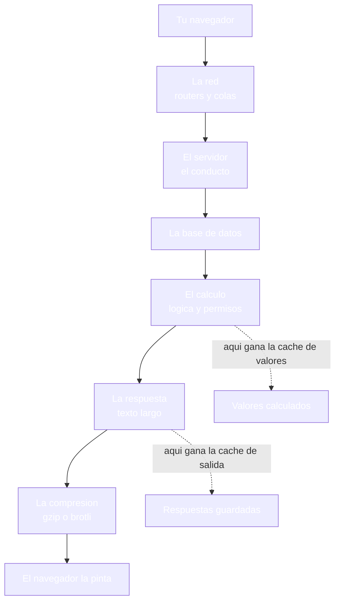
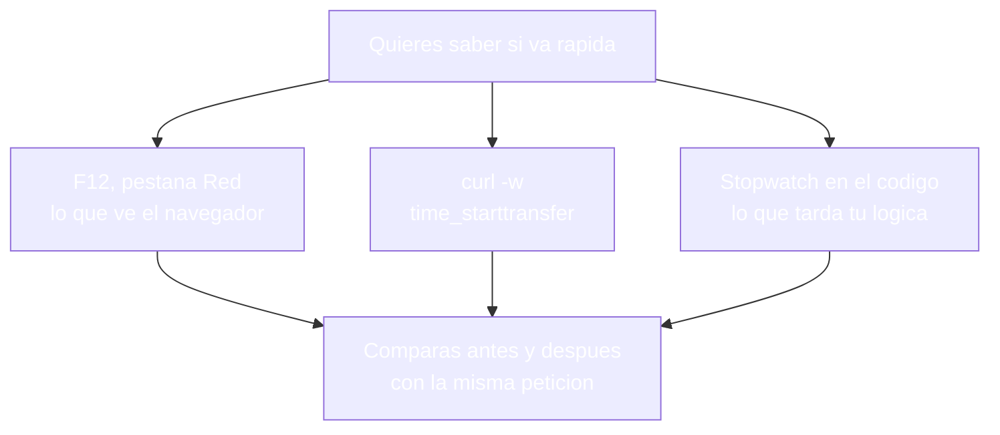
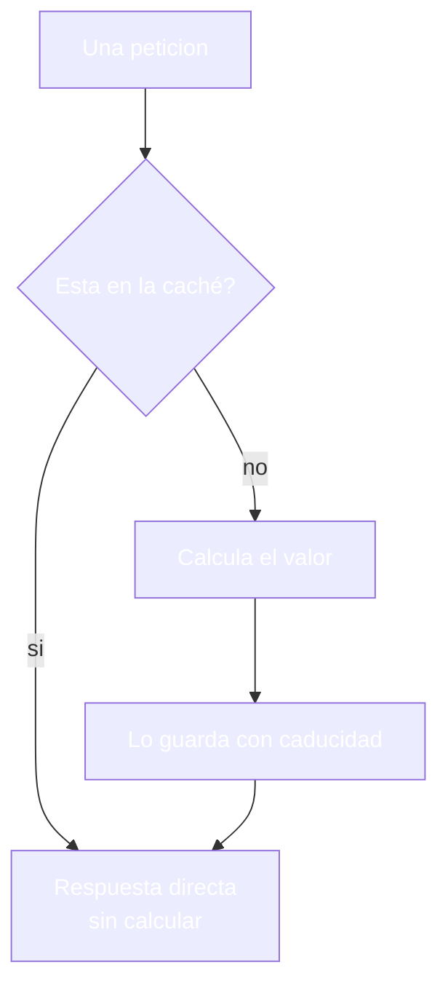
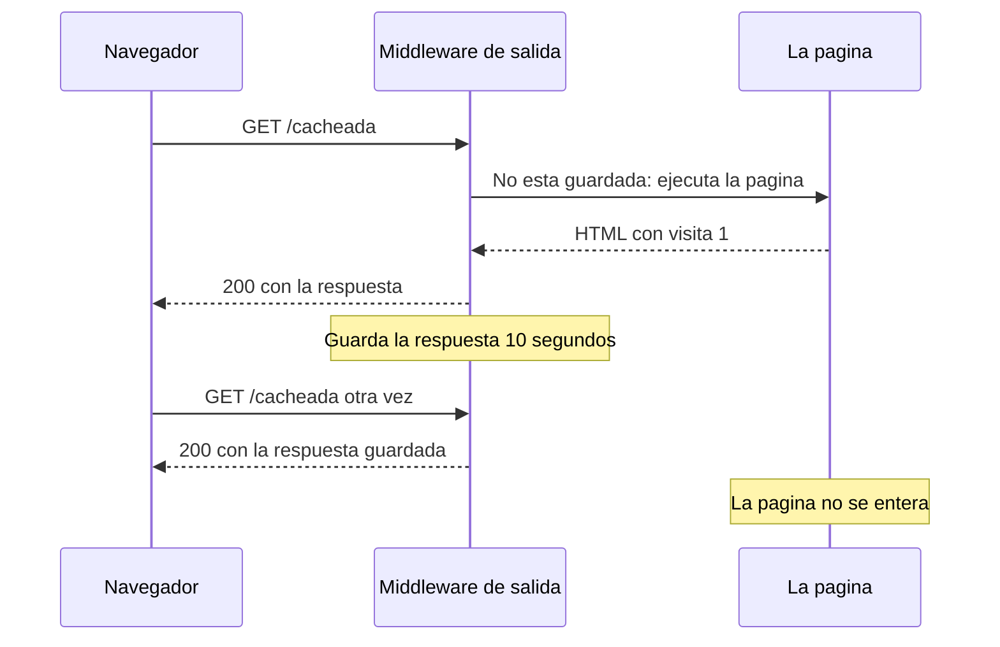
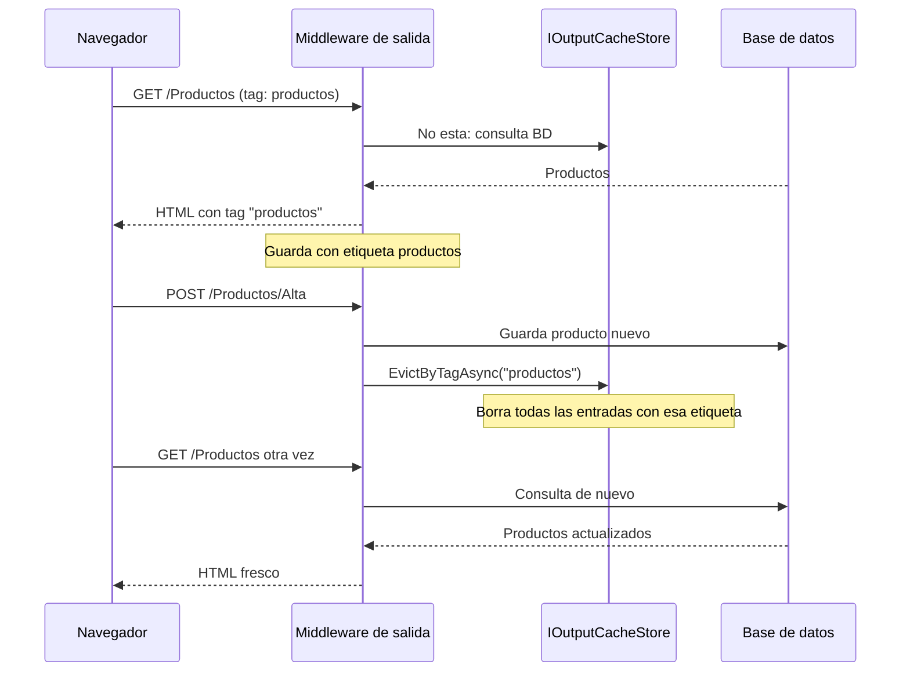
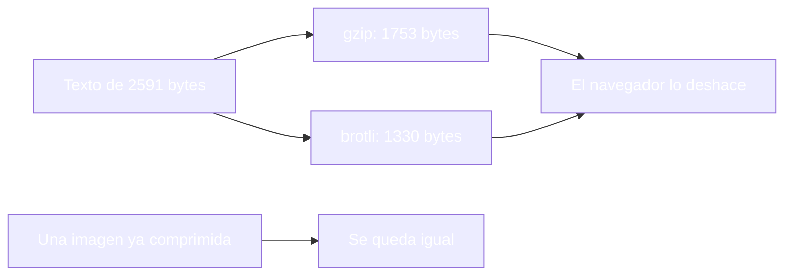
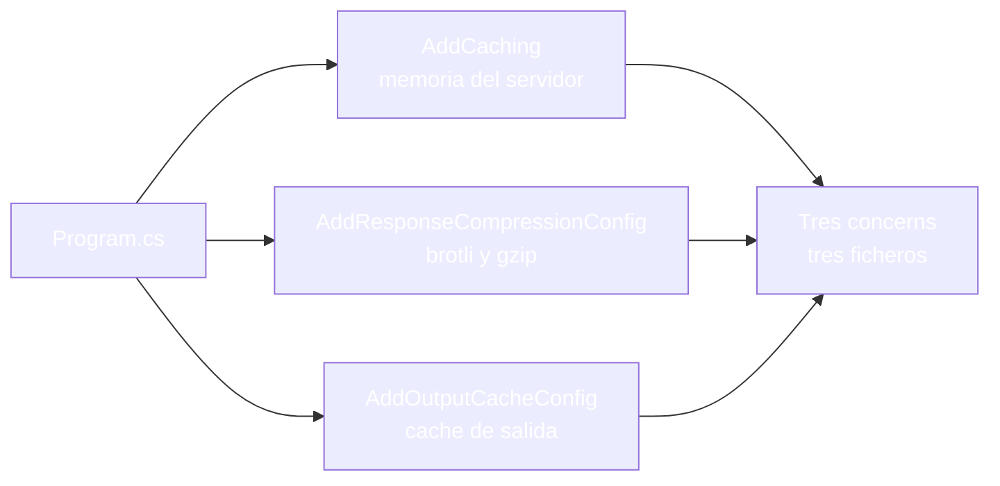

- [21. Optimización y rendimiento](#21-optimización-y-rendimiento)
  - [21.1. Rendimiento: por dónde se va el tiempo](#211-rendimiento-por-dónde-se-va-el-tiempo)
    - [21.1.1. El viaje de una petición](#2111-el-viaje-de-una-petición)
    - [21.1.2. Medir antes de optimizar](#2112-medir-antes-de-optimizar)
  - [21.2. Caché en el servidor](#212-caché-en-el-servidor)
    - [21.2.1. IMemoryCache: el almacén rápido](#2121-imemorycache-el-almacén-rápido)
    - [21.2.2. Visión Razor Pages: la caché en un PageModel](#2122-visión-razor-pages-la-caché-en-un-pagemodel)
    - [21.2.3. Visión MVC: la caché en un controlador](#2123-visión-mvc-la-caché-en-un-controlador)
    - [21.2.4. Output Cache: cachear la respuesta entera](#2124-output-cache-cachear-la-respuesta-entera)
    - [21.2.5. Cuándo cachear y cuándo no](#2125-cuándo-cachear-y-cuándo-no)
    - [21.2.6. HybridCache: la caché unificada](#2126-hybridcache-la-caché-unificada)
    - [21.2.7. OutputCache con tags: invalidar por grupo](#2127-outputcache-con-tags-invalidar-por-grupo)
  - [21.3. Compresión de las respuestas](#213-compresión-de-las-respuestas)
    - [21.3.1. gzip y brotli](#2131-gzip-y-brotli)
    - [21.3.2. Qué se comprime y qué no](#2132-qué-se-comprime-y-qué-no)
  - [21.4. Infrastructure de rendimiento](#214-infrastructure-de-rendimiento)
    - [21.4.1. CacheConfig, CompressionConfig y OutputCacheConfig](#2141-cacheconfig-compressionconfig-y-outputcacheconfig)
    - [21.4.2. Visión Razor Pages: el Program.cs](#2142-visión-razor-pages-el-programcs)
    - [21.4.3. Visión MVC: el Program.cs](#2143-visión-mvc-el-programcs)
  - [21.5. Otras formas de ganar velocidad](#215-otras-formas-de-ganar-velocidad)
  - [21.6. Reglas de seguridad](#216-reglas-de-seguridad)
  - [21.7. Buenas prácticas](#217-buenas-prácticas)
  - [21.8. Reto: el rendimiento de la tienda de Funkos](#218-reto-el-rendimiento-de-la-tienda-de-funkos)
    - [21.8.1. Contexto](#2181-contexto)
    - [21.8.2. Modelo de datos](#2182-modelo-de-datos)
    - [21.8.3. Almacenamiento](#2183-almacenamiento)
    - [21.8.4. Retos](#2184-retos)


# 21. Optimización y rendimiento

> 💡 **Punto de partida:** pones un vídeo en YouTube y arranca al instante; vuelves al principio y ya no vuelve a cargar — el segundo visionado es inmediato. La web del centro, en cambio, tarda lo mismo en enseñar el listado la primera vez que la centésima. Detrás de esa diferencia no hay magia: alguien decidió qué trabajo se repetía sin sentido y qué respuesta se podía guardar. ¿Dónde se va el tiempo de una petición, qué se puede guardar para no repetir el trabajo y cómo se mide de verdad si una web es rápida o lenta?

En este punto aprenderás a montar las tres técnicas para ganar velocidad en una aplicación web: la caché de valores con `IMemoryCache`, la caché de respuestas enteras con output cache y la compresión de texto con Brotli o gzip. Todo con el mismo patrón de `Infrastructure` del punto anterior, y todo medido en las dos visiones.

**Objetivos de aprendizaje:**

- Entender por dónde se va el tiempo de una petición y medirlo antes de tocar nada
- Usar `IMemoryCache` con `GetOrCreateAsync` y caducidad para no repetir cálculos
- Cachear respuestas enteras con output cache en Razor Pages y en MVC
- Comprimir las respuestas de texto y saber qué no se comprime
- Organizar el cableado de rendimiento en `Infrastructure`, una clase por concern

## 21.1. Rendimiento: por dónde se va el tiempo

### 21.1.1. El viaje de una petición

**Una petición no es un salto: es un viaje con varios tramos, y en cada uno se puede perder tiempo.** El navegador la manda, la red la transporta, el servidor la recibe, consulta datos, calcula, monta la respuesta y se la devuelve; el navegador la pinta. Ese viaje entero es el que mides cuando dices que una web va rápida o lenta:



Cada tramo tiene su propio culpable cuando la petición tarda: la red no la controlas — la base de datos se arregla con consultas bien hechas y con caché, el cálculo se arregla con no repetir trabajo, y la respuesta se arregla con caché de salida y compresión. Antes de culpar a nadie, la única forma honesta es saber en qué tramo se queda el tiempo.

📌 **Ejemplo real:** YouTube. El vídeo que ves dos veces seguidas no vuelve a bajar entero de su servidor: el segundo visionado arranca antes porque una caché intermedia ya lo tenía.

### 21.1.2. Medir antes de optimizar

**Optimizar sin medir es cambiar cosas a ciegas y quedarse con la sensación de que ha mejorado.** El mismo código puede tardar distinto según la hora, la máquina y la red, así que la comparación solo es válida si se hace con la misma petición y la misma herramienta:

```csharp
// ❌ MALO: "se ha oído" que la web va lenta y se añaden cachés por todos sitios
// sin saber qué tarda ni dónde se queda el tiempo

// ✅ BUENO: medir dentro del servidor la misma petición que mides en F12
var cron = Stopwatch.StartNew();
var html = await MontarListadoAsync();
cron.Stop();
logger.LogInformation("Listado montado en {Ms} ms", cron.Elapsed.TotalMilliseconds);
```

Hay tres herramientas, cada una mirando desde un sitio distinto:

| Herramienta | Desde dónde mira | Qué te cuenta |
|-------------|------------------|---------------|
| **F12, pestaña Red** | El navegador | Cuánto tarda la petición entera y cuándo empieza a llegar contenido |
| **`curl -w "%{time_starttransfer}"`** | La terminal | Cuánto tarda el servidor en empezar a responder |
| **`Stopwatch` en el código** | Dentro del servidor | Cuánto tarda tu lógica, sin red de por medio |



📌 **Ejemplo real:** Netflix mide cada reproducción con sus propios cronómetros; nadie optimiza a ciegas: primero saben cuánto tarda y dónde.

> 🔧 **Truco:** pide la misma página dos veces seguidas con `curl -w "time_starttransfer"` y anota los dos números: si la segunda es muy inferior, ya tienes una caché trabajando; si son iguales, sabes que aún no hay nada guardado.

## 21.2. Caché en el servidor

### 21.2.1. IMemoryCache: el almacén rápido

**`IMemoryCache` es un almacén clave-valor que vive en la memoria del proceso y se consulta en nanosegundos.** La idea es la de siempre con la caché: si el valor no ha cambiado, no hay por qué calcularlo otra vez. Se registra en un concern y se usa con `GetOrCreateAsync`, que solo ejecuta el cálculo cuando la clave no está:

```csharp
public class PrecioService(IMemoryCache cache) : IPrecioService
{
    public async Task<string> ObtenerAsync()
    {
        return await cache.GetOrCreateAsync("precio", async entrada =>
        {
            entrada.AbsoluteExpirationRelativeToNow = TimeSpan.FromSeconds(10);
            var calculo = await CalcularPrecioLentoAsync();
            return calculo;
        });
    }
}
```

La caducidad no es opcional: un valor sin fecha de consumo preferente se queda para siempre — y una vez que el mundo cambia, la caché enseña mentiras.

```csharp
// ❌ MALO: cachear sin caducidad, el valor se queda de por vida
cache.Set("precio", valor);

// ✅ BUENO: cachear con una vida medida
cache.Set("precio", valor, new MemoryCacheEntryOptions
{
    AbsoluteExpirationRelativeToNow = TimeSpan.FromSeconds(10)
});
```

El servicio del laboratorio lo dice con números: la primera petición pinta `peticion 1 | calculos: 1 | valor: calculo 1` y la segunda pinta `peticion 2 | calculos: 1 | valor: calculo 1`. Dos peticiones, un solo cálculo, en las dos visiones.



📌 **Ejemplo real:** Booking pide decenas de veces por segundo la lista de ciudades de su buscador; ese listado no cambia cada minuto y vive en caché, mientras que el precio del día se consulta cada vez.

> 💡 **Analogía:** es la nevera de un restaurante: guardas el plato ya hecho y lo sirves sin recocinar; la caducidad es la fecha de consumo preferente, y si nadie la respeta, el comensal se lleva una sorpresa desagradable.

> 📝 **Nota:** la caché vive en la memoria del proceso: al reiniciar la aplicación se vacía, y con varias copias del servidor cada una tiene la suya. Cuando los datos tienen que compartirse entre copias, el almacén se mueve a Redis, como ya viste con las sesiones en el punto 18.

### 21.2.2. Visión Razor Pages: la caché en un PageModel

**En páginas, el `PageModel` inyecta el servicio que ya trae la caché dentro y la vista no se entera de nada:**

```csharp
// Pages/Precio.cshtml.cs
public class PrecioModel(IPrecioService precios) : PageModel
{
    public string Linea { get; private set; } = "";

    public async Task OnGetAsync()
    {
        Linea = await precios.ObtenerAsync();
    }
}
```

La comprobación en la visión de páginas es la del servicio: la página pinta `peticion 1 | calculos: 1` la primera vez y `peticion 2 | calculos: 1` la segunda.

### 21.2.3. Visión MVC: la caché en un controlador

**En MVC el patrón es el mismo: el controlador inyecta el servicio y la vista pinta lo que el servicio devuelve:**

```csharp
// Controllers/PerfController.cs
public class PerfController(IPrecioService precios) : Controller
{
    public async Task<IActionResult> Precio()
    {
        ViewBag.Linea = await precios.ObtenerAsync();
        return View();
    }
}
```

> 📝 **Nota:** cambia el sitio donde escribes las cosas, no las cosas: el servicio con su caché es el mismo en las dos visiones, y por eso los dos contadores dicen lo mismo.

### 21.2.4. Output Cache: cachear la respuesta entera

**La caché de salida guarda la respuesta HTML completa y la devuelve sin ejecutar la página ni la acción.** Es la técnica que más se nota: si la respuesta es pública y no ha cambiado, el servidor ni siquiera monta el modelo. Se registra en su concern y se declara en cada lectura que merezca caché:

```csharp
// En el PageModel (Razor Pages) o en la acción (MVC)
[OutputCache(Duration = 10)]
public IActionResult Listado() => View();
```

El comportamiento se ve con un contador dentro de la propia página. En las dos visiones, la primera petición a `/cacheada` pinta `visitas: 1`, la segunda pinta otra vez `visitas: 1` porque la página no se ejecuta, y pasados los diez segundos la tercera pinta `visitas: 2`.



Y el efecto en el tiempo es el del trío de la medida: `/lenta`, que tarda 300 milisegundos en calcular, responde en 0,318 s la primera vez y en 0,001 s la segunda — servida desde la caché de salida.

> 🔧 **Truco:** `curl -w "time_starttransfer"` antes y después de declarar el `[OutputCache]` deja la mejora en números, sin abrir el navegador.

> ⚠️ **Advertencia:** la caché de salida no mira cookies: guarda una respuesta y se la sirve a cualquiera. Una página que pinta datos del usuario identificado no se cachea tal cual, o el segundo visitante recibe la respuesta que era del primero.

### 21.2.5. Cuándo cachear y cuándo no

**No se cachea lo mismo según quién pueda verlo y cuánto tarde en dejar de ser cierto.** Esta es la tabla que se usa en el día a día:

| Qué | Caché adecuada | Caducidad típica |
|-----|----------------|------------------|
| **Listado público de catálogo** | Output cache con tag | Minutos |
| **Precio o stock** | `IMemoryCache` en el servicio | Segundos |
| **Ficha pública de producto** | Output cache | Minutos |
| **Zona privada con datos del usuario** | Ninguna compartida; por usuario si acaso | Corta |
| **Panel de administración** | No cachear | - |

La invalidación es la otra mitad del asunto: cuando se escribe un dato que una caché enseña, esa caché se vacía. En la caché de salida eso se hace con etiquetas: cada lectura declara las suyas y cada escritura vacía las que toquen con `IOutputCacheStore.EvictByTagAsync`, sin esperar a que la caducidad haga su trabajo.

> 💡 **Consejo:** la caducidad se elige pensando en el peor dato viejo que toleras, no en la comodidad de no tener que invalidar: cinco segundos de retraso en un stock puede ser un problema; cinco minutos en una categoría, no.

### 21.2.6. HybridCache: la caché unificada

**El framework trae desde la versión 9 una caché que unifica la memoria y la distribuida detrás de una sola API: HybridCache.** Se registra con `AddHybridCache` (paquete `Microsoft.Extensions.Caching.Hybrid`) y trabaja en dos niveles: un primer nivel en memoria del proceso, que es el que responde, y un segundo nivel distribuido, Redis, si lo configuras; además trae protección contra la estampida, de modo que diez peticiones que llegan juntas a un valor frío calculan una vez y las demás esperan.

```csharp
// Infrastructure/CacheConfig.cs (versión moderna)
public static IServiceCollection AddCaching(this IServiceCollection services)
{
    services.AddHybridCache(options =>
    {
        options.DefaultEntryOptions = new HybridCacheEntryOptions
        {
            Expiration = TimeSpan.FromMinutes(30),
            LocalCacheExpiration = TimeSpan.FromMinutes(5)
        };
    });
    return services;
}
```

La decisión práctica no cambia: en una aplicación de un servidor, `IMemoryCache` sigue bastando; HybridCache compensa cuando hay varias copias y quieres la comodidad de una sola llamada. Y no sustituye al caché de salida del 21.2.4: uno cachea valores dentro de tu lógica y el otro cachea respuestas enteras.

> 💡 **Consejo:** si un día pasas de un servidor a varios, no reescribas el código que usa la caché: cambia el concern de registro y la API de los consumidores sigue igual.

### 21.2.7. OutputCache con tags: invalidar por grupo

El `[OutputCache(Duration = 60)]` básico guarda la respuesta y la devuelve hasta que expira. El problema: si el producto cambia, la caché sigue sirviendo la versión antigua hasta 60 segundos. La solución son las **etiquetas** (*tags*): cada entrada se guarda con una etiqueta y al modificar los datos se invalida todo lo que lleve esa etiqueta.

📌 **Ejemplo real:** Netflix cachea las portadas de las series. Cuando se añade un episodio nuevo, invalida la etiqueta "serie-123" y todas las portadas relacionadas se actualizan sin esperar a que expire la caché.

#### Declarar la caché con etiqueta

```csharp
// MVC: ProductosController.cs
[OutputCache(Duration = 60, Tags = new[] { "productos" })]
public async Task<IActionResult> Index() =>
    View(await db.Productos.ToListAsync());

// Razor Pages: Pages/Productos/Index.cshtml.cs
[ResponseCache(Duration = 60)]
[OutputCache(Duration = 60, Tags = new[] { "productos" })]
public async Task OnGetAsync() { /* ... */ }
```

#### Invalidar por etiqueta al modificar

```csharp
// MVC: ProductosController.cs — al crear, editar o borrar
[HttpPost]
[ValidateAntiForgeryToken]
public async Task<IActionResult> Alta(AltaViewModel modelo)
{
    if (!ModelState.IsValid) return View(modelo);

    db.Productos.Add(new Producto(0, modelo.Nombre, "Sin categoria", modelo.Precio));
    await db.SaveChangesAsync();

    // Invalida TODA la caché con la etiqueta "productos"
    await cacheStore.EvictByTagAsync("productos", default);

    TempData["Aviso"] = modelo.Etiqueta;
    return RedirectToAction(nameof(Index));
}
```

El `IOutputCacheStore` se inyecta en el controlador o PageModel. `EvictByTagAsync("productos")` borra de la caché todas las respuestas que lleven esa etiqueta, sin tocar las demás.



> 💡 **Consejo:** Usa una etiqueta por recurso (`"productos"`, `"usuarios"`, `"pedidos"`). Así invalidas solo lo que tocas: al añadir un producto no invalidas la caché de usuarios.

> 📝 **Nota:** `EvictByTagAsync` necesita un `IOutputCacheStore` distribuido (Redis o similar) si la app corre en varios servidores. Con `AddDistributedMemoryCache` funciona en un solo servidor.
## 21.3. Compresión de las respuestas

### 21.3.1. Gzip y brotli

**La compresión convierte el texto de la respuesta en uno más pequeño sin perder una sola letra, y el navegador lo deshace en su sitio.** El navegador manda `Accept-Encoding` y el servidor responde con `Content-Encoding` y el cuerpo comprimido. En la medida de las dos visiones, la misma página `/texto` pesa **2591 bytes** sin cabecera, **1753 bytes** con `gzip` y **1330 bytes** con `brotli`, con sus cabeceras `Content-Encoding: gzip` y `Content-Encoding: br` respectivamente.



El registro es doble: `AddResponseCompression` en los servicios y `UseResponseCompression` en el conducto, lo más arriba posible, para que comprima todo lo que venga detrás. En el laboratorio se habilita también para HTTPS con `EnableForHttps = true`.

📌 **Ejemplo real:** Cualquier artículo de Wikipedia viaja comprimido: el HTML ocupa una fracción de lo que pesa en el servidor y nadie se entera de la diferencia.

> 📝 **Nota:** si el navegador no manda `Accept-Encoding`, no se comprime nada: la compresión es una conversación, no una decisión unilateral del servidor.

### 21.3.2. Qué se comprime y qué no

**Se comprime texto; lo que ya viene comprimido, no.** Volver a comprimir una imagen o un vídeo solo gasta tiempo del procesador y no ahorra un solo byte en la red.

| Contenido | ¿Se comprime? | Por qué |
|-----------|:--------------:|---------|
| **HTML, CSS y JavaScript** | Sí | Texto puro; gana muchísimo |
| **JSON y XML** | Sí | También texto, con la misma ventaja |
| **PNG, JPEG, MP4** | No | Ya vienen comprimidos; repetir el proceso no ahorra nada |
| **Ficheros ya en gzip o br** | No | El servidor no vuelve a tocarlos |

## 21.4. Infrastructure de rendimiento

### 21.4.1. CacheConfig, CompressionConfig y OutputCacheConfig

**Las tres técnicas de este punto se cablean igual que todo lo demás: una clase por concern en `Infrastructure`, con su método de extensión.** El patrón es el del punto anterior y los nombres, los de siempre en proyectos reales:

```csharp
// Infrastructure/CacheConfig.cs
public static class CacheConfig
{
    public static IServiceCollection AddCaching(this IServiceCollection services)
    {
        services.AddMemoryCache();
        return services;
    }
}

// Infrastructure/OutputCacheConfig.cs
public static class OutputCacheConfig
{
    public static IServiceCollection AddOutputCacheConfig(this IServiceCollection services)
    {
        services.AddOutputCache();
        return services;
    }

    public static IApplicationBuilder UseOutputCacheConfig(this IApplicationBuilder app)
    {
        app.UseOutputCache();
        return app;
    }
}
```

`CompressionConfig` sigue la misma forma, con `AddResponseCompressionConfig` y `UseResponseCompressionConfig`, y dentro declara los dos proveedores, Brotli y gzip, con nivel `Fastest` y `EnableForHttps = true`.



📌 **Ejemplo real:** Una plataforma de cursos separa su cableado de rendimiento en bloques: caché, compresión y caché de salida; cada bloque se configura en un sitio y el arranque solo los encadena.

### 21.4.2. Visión Razor Pages: el Program.cs

**El arranque de páginas encadena los tres concerns y respeta el orden: compresión la primera, caché de salida antes de los endpoints:**

```csharp
// Program.cs
var builder = WebApplication.CreateBuilder(args);

// Cableado por concern (patrón Infrastructure del punto anterior)
builder.Services.AddCaching();
builder.Services.AddResponseCompressionConfig();
builder.Services.AddOutputCacheConfig();
builder.Services.AddAppServices();
builder.Services.AddRazorPages();

var app = builder.Build();

// La compresión va la primera: si la caché de salida ya tiene la respuesta, se sirve igual
app.UseResponseCompressionConfig();
app.UseRouting();
app.UseOutputCacheConfig();
app.UseAuthorization();
app.MapRazorPages();

app.Run();
```

### 21.4.3. Visión MVC: el Program.cs

**El arranque de MVC es el mismo listado con las dos líneas de siempre al final:**

```csharp
// Program.cs
var builder = WebApplication.CreateBuilder(args);

// Cableado por concern (patrón Infrastructure del punto anterior)
builder.Services.AddCaching();
builder.Services.AddResponseCompressionConfig();
builder.Services.AddOutputCacheConfig();
builder.Services.AddAppServices();
builder.Services.AddControllersWithViews();

var app = builder.Build();

// La compresión va la primera: si la caché de salida ya tiene la respuesta, se sirve igual
app.UseResponseCompressionConfig();
app.UseRouting();
app.UseOutputCacheConfig();
app.MapControllerRoute(
    name: "porDefecto",
    pattern: "{controller=Perf}/{action=Index}/{id?}");

app.Run();
```

> 📝 **Nota:** los tres concerns son del proyecto, no de la visión: las dos aplicaciones comparten la carpeta `Infrastructure` y solo cambian las líneas de su capa web.

## 21.5. Otras formas de ganar velocidad

**Las cachés y la compresión son las dos que más se notan; detrás vienen cinco que también ayudan:**

- **Proyecciones y `AsNoTracking`**: leer solo las columnas que se pintan y no rastrear entidades que no se van a guardar
- **Paginación**: enseñar veinte filas en lugar de cuatro mil reduce el trabajo del servidor y el peso de la respuesta
- **Assets estáticos con caché del navegador**: ficheros con nombre estable y cabeceras largas para que no se descarguen dos veces
- **CDN**: servir el HTML y los estáticos desde servidores cercanos al visitante, sin tocar tu código
- **Sin trabajo duplicado entre peticiones**: lo que se calcula igual en todas, se calcula una vez y se comparte

## 21.6. Reglas de seguridad

- **Output cache solo en lecturas públicas**: la caché de salida no distingue usuarios; una zona privada cacheada se sirve igual a todos
- **Invalidar al escribir**: alta, edición o borrado vacían la caché que enseña esos datos
- **Caducidad corta** para datos de cuenta, stock o precio
- **Compresión con HTTPS habilitada** (`EnableForHttps`), para no romper el cifrado con la negociación
- **Datos de pago o de salud: nunca en caché compartida**, ni corta ni larga
- **Claves de caché por usuario** si algún día cacheas datos personales dentro de una petición identificada
- **Medir en un entorno parecido al real**: el portátil con el servidor en local no es la red de verdad

## 21.7. Buenas prácticas

- **Medir antes y después** con la misma petición y el mismo equipo
- **`IMemoryCache` para cálculos caros** con caducidad corta y sentido
- **`GetOrCreateAsync`** para no repetir el trabajo entre peticiones
- **Output cache en lecturas públicas estables**: catálogos, listados y fichas
- **Compresión de texto siempre**; imágenes y vídeos, jamás
- **TTL con sentido**: segundos para stock, minutos para catálogo
- **Invalidación por tag** al escribir, no a base de esperas a que caduque
- **Infrastructure con sus concerns**: `CacheConfig`, `CompressionConfig` y `OutputCacheConfig`
- **Orden del conducto**: compresión arriba del todo, caché de salida antes de los endpoints
- **Paginar los listados** en lugar de enseñarlos enteros

## 21.8. Reto: el rendimiento de la tienda de Funkos

> Haz que tu tienda conteste al instante: caché de valores, caché de salida y compresión, sin que nadie note el trabajo que no se repite, en las dos visiones.

### 21.8.1. Contexto

**Paso 0:** parte del reto del punto 20 en sus dos visiones (`FunkoApp` y `FunkoAppMvc`), con la configuración por entornos y la estructura de `Infrastructure` funcionando. La tienda ya sabe dónde vive cada valor; ahora le falta no repetir trabajo.

### 21.8.2. Modelo de datos

| Propiedad | Tipo | Obligatorio |
|-----------|------|:-----------:|
| `id` | int | Sí (autogenerado) |
| `nombre` | string | Sí |
| `categoria` | string | Sí |
| `anio` | int | Sí |
| `precioReferencia` | decimal | Sí |
| `imagen` | string? | No |
| `etiquetas` | List\<string\>? | No |
| `activo` | bool | Sí |
| `esNovedad` | bool | Sí |

### 21.8.3. Almacenamiento

```csharp
public static class RepositorioFunkos
{
    private static readonly List<Funko> Funkos = [ /* seis figuras */ ];

    public static IReadOnlyList<Funko> ObtenerTodos() => Funkos;
}
```

Rellena la lista con seis figuras de modo que haya activas y dadas de baja, novedades y no novedades, y las tres categorías.

### 21.8.4. Retos

**Pasos compartidos (las dos visiones):**

1. **En papel primero:** dibuja el listado de tu tienda y decide qué datos son estables (categorías, tipologías) y cuáles cambian cada minuto (stock, ofertas)
2. Añade `AddMemoryCache` en su concern y un servicio de stock con `GetOrCreateAsync` y caducidad de pocos segundos; comprueba que la segunda petición pinta `calculos: 1` y no vuelve a calcular
3. Añade `AddOutputCache` y `UseOutputCache` en sus concerns y `[OutputCache(Duration = ...)]` en el listado público; comprueba que un contador dentro del listado no sube entre petición y petición mientras la caché vive y que vuelve a subir cuando caduca
4. Añade compresión con `AddResponseCompression` y `UseResponseCompression`; comprueba con `curl -i -H "Accept-Encoding: gzip"` que la respuesta sale con `Content-Encoding: gzip` y pesa menos que sin la cabecera
5. Mide con `curl -w "time_starttransfer"` una página con cálculo antes y después de cachear; comprueba que la segunda vez baja de forma visible
6. Invalida la caché de salida con `IOutputCacheStore.EvictByTagAsync` al dar de alta un funko; comprueba que el listado refleja la figura nueva sin esperar a que caduque la caché

**Visión Razor Pages:**

7. Declara `[OutputCache]` en el `PageModel` del listado y en la ficha pública; comprueba que la ficha cacheada tarda lo mismo la segunda vez que la primera
8. Inyecta el servicio con `IMemoryCache` en el `PageModel` del detalle; comprueba que el precio se calcula una vez y se sirve mientras viva la caché

**Visión MVC:**

9. Declara `[OutputCache]` en las acciones del listado y de la ficha pública; comprueba el mismo comportamiento que en la visión de páginas
10. Inyecta el servicio con `IMemoryCache` en el controlador del detalle; comprueba que los tiempos de respuesta coinciden con los de la visión de páginas

**Puntos extra:**

- Añade la cabecera `Server-Timing` con el tiempo del servidor en cada respuesta y comprueba en la pestaña Red del navegador que aparece junto al tiempo total
- Configura `Tags` en el `[OutputCache]` y usa `EvictByTagAsync` también al editar y al borrar; comprueba que cualquier escritura refleja el cambio al instante
- Escribe en el repositorio por qué una página con datos del usuario no puede usar la caché de salida compartida

---

**Resumen del punto:**

| Concepto | Descripción |
|----------|-------------|
| **Viaje de una petición** | Red, base de datos, cálculo, respuesta y pintado; en cada tramo se puede perder tiempo |
| **`IMemoryCache`** | Almacén clave-valor en la memoria del proceso; se consulta en nanosegundos |
| **`GetOrCreateAsync`** | Solo ejecuta el cálculo cuando la clave no está en la caché |
| **Caducidad** | `AbsoluteExpirationRelativeToNow` o `SlidingExpiration`; sin ella, la caché enseña mentiras |
| **Output cache** | Guarda la respuesta entera y la devuelve sin ejecutar la página ni la acción |
| **`[OutputCache]`** | Declara la política por lectura, con duración y etiquetas |
| **Invalidación** | `IOutputCacheStore.EvictByTagAsync` vacía la caché al escribir |
| **Compresión** | `Accept-Encoding` del navegador y `Content-Encoding` del servidor; Brotli y gzip |
| **`Infrastructure`** | `CacheConfig`, `CompressionConfig` y `OutputCacheConfig`, una clase por concern |
| **Comprobado** | El contador de `/cacheada` se queda en `1` entre peticiones y vuelve a `2` tras 11 s, `/lenta` baja de 0,318 s a 0,001 s al servirse de la caché, `IMemoryCache` calcula una vez y la segunda petición pinta `calculos: 1`, `/texto` pesa 2591 B sin cabecera, 1753 B con `gzip` y 1330 B con `brotli`, todo idéntico en las dos visiones |

**¿Qué viene después?**

En el siguiente punto toca la Internacionalización (I18n) y la Localización: cómo enseña una misma aplicación varios idiomas y formatos sin duplicar vistas ni lógica.
