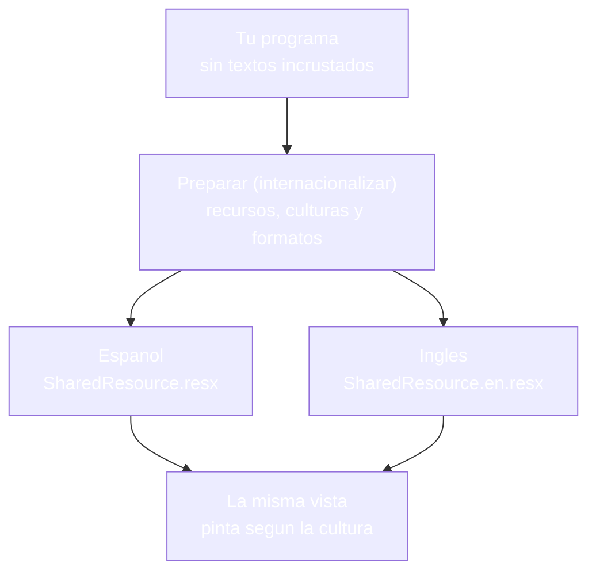
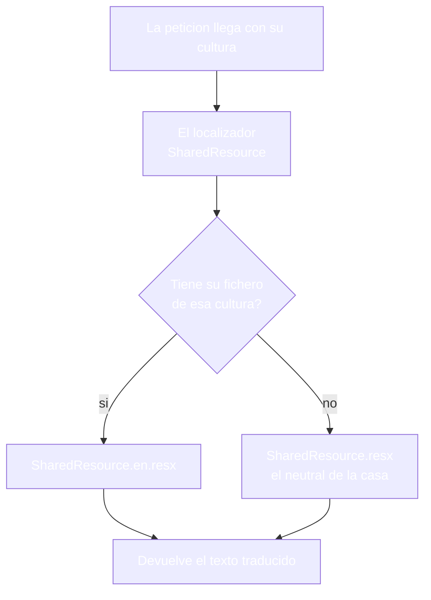
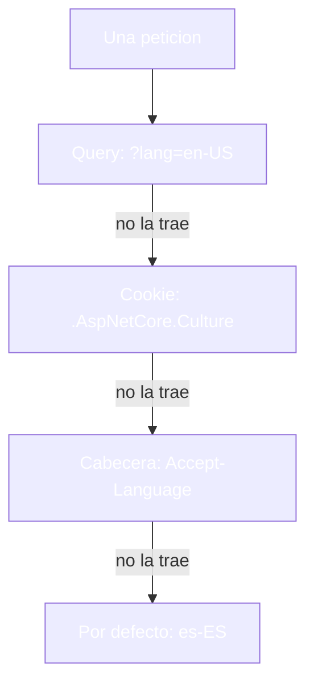
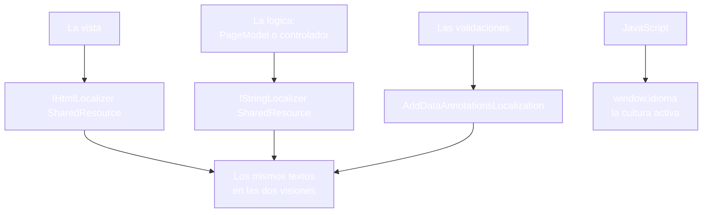
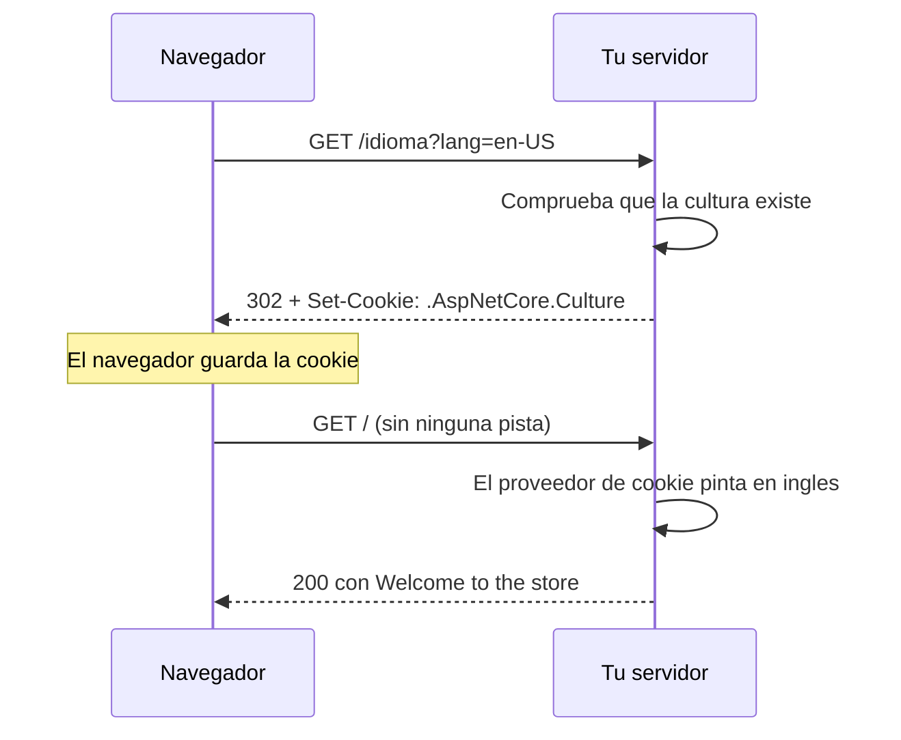

- [22. Internacionalización (I18n) y localización](#22-internacionalización-i18n-y-localización)
  - [22.1. Conceptos: internacionalización y localización](#221-conceptos-internacionalización-y-localización)
    - [22.1.1. Qué es la internacionalización y qué es la localización](#2211-qué-es-la-internacionalización-y-qué-es-la-localización)
    - [22.1.2. Cultura: idioma, región y formatos](#2212-cultura-idioma-región-y-formatos)
  - [22.2. Los ficheros de recursos .resx](#222-los-ficheros-de-recursos-resx)
    - [22.2.1. Anatomía y nomenclatura](#2221-anatomía-y-nomenclatura)
    - [22.2.2. SharedResource: traducciones globales](#2222-sharedresource-traducciones-globales)
  - [22.3. Detección de cultura y configuración](#223-detección-de-cultura-y-configuración)
    - [22.3.1. El orden de los proveedores](#2231-el-orden-de-los-proveedores)
    - [22.3.2. LocalizationConfig: el concern de Infrastructure](#2232-localizationconfig-el-concern-de-infrastructure)
    - [22.3.3. Visión Razor Pages: Program.cs](#2233-visión-razor-pages-programcs)
    - [22.3.4. Visión MVC: Program.cs](#2234-visión-mvc-programcs)
  - [22.4. Localizar la presentación](#224-localizar-la-presentación)
    - [22.4.1. Visión Razor Pages: vistas y PageModel](#2241-visión-razor-pages-vistas-y-pagemodel)
    - [22.4.2. Visión MVC: vistas y controlador](#2242-visión-mvc-vistas-y-controlador)
    - [22.4.3. Validaciones, JavaScript y enums](#2243-validaciones-javascript-y-enums)
  - [22.5. Formatos culturales y selector de idioma](#225-formatos-culturales-y-selector-de-idioma)
    - [22.5.1. Números, fechas y moneda](#2251-números-fechas-y-moneda)
    - [22.5.2. El selector de idioma con cookie](#2252-el-selector-de-idioma-con-cookie)
  - [22.6. Reglas de seguridad](#226-reglas-de-seguridad)
  - [22.7. Buenas prácticas](#227-buenas-prácticas)
  - [22.8. Reto: el idioma de la tienda de Funkos](#228-reto-el-idioma-de-la-tienda-de-funkos)
    - [22.8.1. Contexto](#2281-contexto)
    - [22.8.2. Modelo de datos](#2282-modelo-de-datos)
    - [22.8.3. Almacenamiento](#2283-almacenamiento)
    - [22.8.4. Retos](#2284-retos)


# 22. Internacionalización (I18n) y localización

> 💡 **Punto de partida:** reservas un vuelo en Booking desde tu móvil y ves "Reservar ahora", el precio en euros y la fecha en formato español; tu compañero, con la cuenta en inglés, ve "Book now", dólares y mes primero. La lógica que calcula el precio es la misma en los dos casos — lo que cambia son los textos y los formatos con los que se pinta. ¿Cómo se prepara una aplicación para hablar varios idiomas sin duplicar vistas ni lógica, y cómo decide el servidor cuál le toca a cada petición?

En este punto aprenderás a montar la localización completa de una aplicación: los ficheros `.resx` con los textos por idioma, el middleware que decide la cultura de cada petición, los localizadores para vistas y lógica, los formatos de número y fecha, y el selector de idioma con cookie. Todo con el patrón de `Infrastructure` de los puntos anteriores y todo medido en las dos visiones.

**Objetivos de aprendizaje:**

- Diferenciar la internacionalización de la localización y saber qué toca cada una
- Organizar los textos en ficheros `.resx` con el patrón `SharedResource`
- Configurar los proveedores de cultura y su orden en el conducto
- Localizar vistas, lógica y validaciones en las dos visiones
- Formatear números y fechas según la cultura y montar un selector de idioma con cookie

## 22.1. Conceptos: internacionalización y localización

### 22.1.1. Qué es la internacionalización y qué es la localización

**La internacionalización prepara el programa para que admita varios idiomas; la localización es la tarea de adaptarlo a uno concreto.** La primera se hace una vez, al escribir el código: nada de textos incrustados en vistas, nada de formatos duros, todo preparado para preguntar "¿en qué idioma?". La segunda se repite por cada idioma: añadir los textos, revisar los formatos y comprobar que todo encaja.



| | Internacionalización | Localización |
|--|----------------------|--------------|
| **Qué hace** | Prepara textos, formatos y culturas fuera del código | Adaptar a un idioma concreto |
| **Cuándo se hace** | Una vez, al construir la aplicación | Una vez por cada idioma |
| **Si se olvida** | El texto queda incrustado y no hay vuelta atrás | El idioma nuevo no puede entrar |

> 💡 **Analogía:** es el doblaje de una película. El guion se escribe una vez pensando en que se doblará, y cada país pone su banda de sonido; si las palabras estuvieran incrustadas en la imagen, el doblaje ya no sería posible.

📌 **Ejemplo real:** Booking. La misma búsqueda de vuelos se sirve en español, inglés o japonés; la lógica es una sola y lo que cambia son los textos y los formatos que se pintan.

### 22.1.2. Cultura: idioma, región y formatos

**La cultura no es solo el idioma: es la combinación de idioma y región que decide cómo se escribe el mundo.** `es-ES` y `en-US` no solo cambian las palabras — también el separador de decimales, la moneda, el orden de la fecha y hasta el signo de porcentaje. El mismo valor, pintado por cada cultura, sale distinto:

- **`0.21m.ToString("C", new CultureInfo("es-ES"))`** devuelve `0,21 €`
- **`0.21m.ToString("C", new CultureInfo("en-US"))`** devuelve `$0.21`
- **`0.21m.ToString("P0", ...)`** devuelve `21 %` en español y `21%` en inglés

📌 **Ejemplo real:** Amazon. Un mismo precio se pinta como `1.234,56 €` en España y `$1,234.56` en Estados Unidos: el número es el mismo y lo que cambia es la cultura que lo formatea.

> 📝 **Nota:** la cultura activa se consulta con `CultureInfo.CurrentUICulture` para los textos y `CultureInfo.CurrentCulture` para los formatos; en una web, el middleware de localización las pone ambas en cada petición.

## 22.2. Los ficheros de recursos .resx

### 22.2.1. Anatomía y nomenclatura

**Los textos salen del código y viven en ficheros `.resx`, uno por idioma, con pares clave-valor.** El fichero neutral (`SharedResource.resx`) es el de la casa, el que se pinta cuando no hay traducción; los demás (`SharedResource.en.resx`, `SharedResource.fr.resx`) traen sus versiones:

```xml
<!-- Resources/SharedResource.resx (neutral, español) -->
<data name="Saludo" xml:space="preserve">
  <value>Bienvenido a la tienda</value>
</data>
<data name="EtiquetaIva" xml:space="preserve">
  <value>IVA</value>
</data>

<!-- Resources/SharedResource.en.resx (inglés) -->
<data name="Saludo" xml:space="preserve">
  <value>Welcome to the store</value>
</data>
<data name="EtiquetaIva" xml:space="preserve">
  <value>VAT</value>
</data>
```

La nomenclatura manda:

- **La clave no cambia entre idiomas**: `Saludo` es `Saludo` en todos los ficheros
- **El sufijo del fichero es la cultura**: `.en`, `.es`, `.fr`; el neutral no lleva sufijo
- **Los nombres son de programa**: en inglés o en español, pero estables; renombrarlos es romper todas las búsquedas
- **Un idioma sin fichero cae en el neutral**, no en un hueco vacío

📌 **Ejemplo real:** WordPress guarda sus textos traducidos en ficheros por idioma; quien añade un idioma nuevo no toca el código, solo añade su fichero.

### 22.2.2. SharedResource: traducciones globales

**El patrón `SharedResource` concentra las traducciones de toda la aplicación en una única familia de ficheros, con una clase marcadora.** El localizador se apoya en esa clase para saber dónde buscar:

```csharp
// Resources/SharedResource.cs (en el espacio raíz del proyecto)
namespace TuApp;

public class SharedResource;
```

```csharp
// Program.cs
builder.Services.AddLocalization();
```

La forma en que el localizador encuentra el fichero tiene su trampa, y sale cara si no se conoce: el recurso emparejado por nombre con la clase marcadora toma el nombre de la clase, no el de la carpeta. Con `ResourcesPath` declarado, el prefijo de búsqueda no coincide con lo incrustado y el localizador devuelve la clave en lugar del texto; por eso la clase marcadora vive en el espacio raíz y la localización se registra sin `ResourcesPath`.

```csharp
// ❌ MALO: ResourcesPath declarado y la búsqueda no encuentra el recurso
// (el localizador devuelve "Saludo" en lugar del texto traducido)
builder.Services.AddLocalization(options => options.ResourcesPath = "Resources");

// ✅ BUENO: marcador en el espacio raíz y registro sin ResourcesPath
builder.Services.AddLocalization();
```



📌 **Ejemplo real:** Cualquier panel administrativo multiidioma separa sus textos globales (botones, avisos, errores) de los de cada vista; los primeros viven en un recurso compartido y se traducen una sola vez.

## 22.3. Detección de cultura y configuración

### 22.3.1. El orden de los proveedores

**El middleware de localización decide la cultura de cada petición preguntando a una lista de proveedores, y gana el primero que contesta.** El orden por defecto, y el que usamos aquí, es query, cookie y cabecera — si ninguno contesta, manda la cultura de fábrica:



Cada proveedor, medido en las dos visiones:

| Proveedor | Petición | Resultado |
|-----------|----------|-----------|
| **Query** | `/?lang=en-US` | `Welcome to the store`, `Content-Language: en-US` |
| **Cabecera** | `Accept-Language: en-US` | El mismo inglés, sin query |
| **Cookie** | Tras el conmutador, `GET /` | Sigue en inglés sin ninguna pista en la URL |
| **Ninguno** | `GET /` a pelo | `Bienvenido a la tienda`, `Content-Language: es-ES` |
| **Cultura no soportada** | `/?lang=fr-FR` | Vuelve al español de fábrica |

📌 **Ejemplo real:** Netflix decide el idioma de la interfaz con la preferencia de tu cuenta, pero si abres la web en el móvil de otro país, la cabecera `Accept-Language` puede anticiparse.

### 22.3.2. LocalizationConfig: el concern de Infrastructure

**La localización se cablea como todo lo demás: una clase en `Infrastructure` con sus dos métodos de extensión, uno para los servicios y otro para el conducto:**

```csharp
// Infrastructure/LocalizationConfig.cs
public static class LocalizationConfig
{
    public static IServiceCollection AddAppLocalization(this IServiceCollection services)
    {
        services.AddLocalization();
        return services;
    }

    public static IApplicationBuilder UseAppLocalization(this IApplicationBuilder app)
    {
        var culturas = new[]
        {
            new CultureInfo("es-ES"),
            new CultureInfo("en-US")
        };

        var opciones = new RequestLocalizationOptions
        {
            DefaultRequestCulture = new RequestCulture("es-ES"),
            SupportedCultures = culturas,
            SupportedUICultures = culturas,
            ApplyCurrentCultureToResponseHeaders = true
        };

        // La query viaja como ?lang=en-US
        var proveedorQuery = new QueryStringRequestCultureProvider
        {
            QueryStringKey = "lang",
            UIQueryStringKey = "lang"
        };

        opciones.RequestCultureProviders = new List<IRequestCultureProvider>
        {
            proveedorQuery,
            new CookieRequestCultureProvider(),
            new AcceptLanguageHeaderRequestCultureProvider()
        };

        app.UseRequestLocalization(opciones);
        return app;
    }
}
```

Tres detalles de este fichero deciden el comportamiento de toda la aplicación: la lista `SupportedCultures` es la que filtra (`fr-FR` no está y cae al valor por defecto), `ApplyCurrentCultureToResponseHeaders` añade la cabecera `Content-Language` a cada respuesta, y la clave `lang` de la query es una decisión de casa, porque la que trae el framework es `culture`.

> 💡 **Truco:** la cabecera `Content-Language` es la comprobación más rápida de todas: `curl -i` y una mirada, sin abrir el navegador.

### 22.3.3. Visión Razor Pages: Program.cs

**En páginas, el concern se encadena con la capa de vistas y validaciones localizadas:**

```csharp
// Program.cs
var builder = WebApplication.CreateBuilder(args);

// Cableado por concern (patrón Infrastructure)
builder.Services.AddAppLocalization();
builder.Services.AddRazorPages().AddViewLocalization().AddDataAnnotationsLocalization();

var app = builder.Build();

app.UseAppLocalization();
app.UseRouting();
app.UseAuthorization();
app.MapRazorPages();

app.Run();
```

### 22.3.4. Visión MVC: Program.cs

**En MVC el arranque es el mismo, con la línea de controladores en su sitio:**

```csharp
// Program.cs
var builder = WebApplication.CreateBuilder(args);

// Cableado por concern (patrón Infrastructure)
builder.Services.AddAppLocalization();
builder.Services.AddControllersWithViews().AddViewLocalization().AddDataAnnotationsLocalization();

var app = builder.Build();

app.UseAppLocalization();
app.UseRouting();
app.MapControllerRoute(
    name: "porDefecto",
    pattern: "{controller=Portada}/{action=Index}/{id?}");

app.Run();
```

> 📝 **Nota:** `UseAppLocalization` va antes de routing y de los endpoints, para que la cultura esté decidida cuando tu código pinte algo.

## 22.4. Localizar la presentación

### 22.4.1. Visión Razor Pages: vistas y PageModel

**En páginas hay dos localizadores y cada uno tiene su sitio: la vista pinta con `IHtmlLocalizer<SharedResource>` y la lógica piensa con `IStringLocalizer<SharedResource>`:**

```razor
@page
@using System.Globalization
@using Microsoft.AspNetCore.Mvc.Localization
@using TuApp
@inject IHtmlLocalizer<SharedResource> Localizador
@model TuApp.Pages.IndexModel
<!doctype html>
<html lang="@Model.Cultura">
<head>
    <meta charset="utf-8" />
    <title>Localizacion</title>
</head>
<body>
    <h1 id="saludo">@Localizador["Saludo"]</h1>
    <p id="logica">@Model.SaludoLogica</p>
    <p id="precio">@Model.Precio.ToString("C", CultureInfo.CurrentCulture)</p>
</body>
</html>
```

```csharp
// Pages/Index.cshtml.cs
public class IndexModel(IStringLocalizer<SharedResource> localizador) : PageModel
{
    public string SaludoLogica { get; private set; } = "";

    public string Cultura { get; private set; } = "";

    public decimal Precio { get; private set; } = 0.21m;

    public void OnGet()
    {
        SaludoLogica = localizador["Saludo"];
        Cultura = CultureInfo.CurrentUICulture.Name;
    }
}
```

El mismo texto llega por los dos caminos: con `?lang=en-US` la página pinta `Welcome to the store` en el saludo de la vista y en el de la lógica, en las dos visiones.

> ⚠️ **Advertencia:** las páginas solo ejecutan sus manejadores si el modelo va declarado: una página con `@page` y sin `@model` se pinta igual, pero `OnGet` no se invoca ni se escribe la cookie del idioma. Es la trampa que hace que "la página cambia de idioma pero el conmutador no hace nada".

### 22.4.2. Visión MVC: vistas y controlador

**En MVC el reparto es el mismo: la vista pinta con el localizador de vistas y el controlador piensa con el de cadena:**

```csharp
// Controllers/PortadaController.cs
public class PortadaController(IStringLocalizer<SharedResource> localizador) : Controller
{
    public IActionResult Index()
    {
        ViewBag.SaludoLogica = localizador["Saludo"];
        ViewBag.Cultura = CultureInfo.CurrentUICulture.Name;
        ViewBag.Precio = 0.21m;

        return View();
    }
}
```

```razor
@using TuApp
@using Microsoft.AspNetCore.Mvc.Localization
@inject IHtmlLocalizer<SharedResource> Localizador
<h1 id="saludo">@Localizador["Saludo"]</h1>
<p id="precio">@(((decimal)ViewBag.Precio).ToString("C", CultureInfo.CurrentCulture))</p>
```

> 📝 **Nota:** el localizador de vistas se inyecta como `IHtmlLocalizer<SharedResource>`; el que devuelve cadena, `IStringLocalizer<SharedResource>`, es el de la lógica y de las validaciones.

### 22.4.3. Validaciones, JavaScript y enums

**Localizar no son solo los textos de las vistas: también los mensajes de validación, los textos que JavaScript pinta y los nombres de los enumerados.**



| Qué se localiza | Cómo |
|-----------------|------|
| **Validaciones** | `AddDataAnnotationsLocalization()` en el arranque y los mensajes como claves de recurso |
| **JavaScript** | La cultura activa se pasa a la vista con una variable global y JavaScript la consulta |
| **Enums** | Los nombres del desplegable se buscan en el recurso con la clave del valor |

```csharp
// ❌ MALO: el mensaje se queda escrito en el código, en un solo idioma
[Required(ErrorMessage = "El nombre es obligatorio")]

// ✅ BUENO: la clave del recurso; el framework la traduce según la cultura
[Required(ErrorMessage = "ErrorNombreRequerido")]
```

```html
<!-- La cultura viaja a JavaScript en una variable global -->
<script>
    window.idioma = "@CultureInfo.CurrentUICulture.Name";
</script>
```

```razor
<!-- El desplegable localizado: la clave es el nombre del valor -->
@foreach (var nombre in Enum.GetNames<EstadoPedido>())
{
    <option value="@nombre">@Localizador[nombre]</option>
}
```

📌 **Ejemplo real:** Spotify pinta "Reproducir" o "Play" según el idioma de tu perfil sin tener dos programas: la vista pregunta al recurso y el recurso contesta en el idioma activo.

## 22.5. Formatos culturales y selector de idioma

### 22.5.1. Números, fechas y moneda

**Los formatos se piden a la cultura activa, nunca a secas.** `ToString("C")` sin cultura usa la del hilo, que en una web la ha puesto el middleware; para fechas y monedas esa es la única forma correcta:

| Formato | `es-ES` | `en-US` |
|---------|---------|---------|
| **Moneda** (`C`) | `0,21 €` | `$0.21` |
| **Porcentaje** (`P0`) | `21 %` | `21%` |
| **Fecha larga** (`D`) | `4 de octubre de 2026` | `October 4, 2026` |
| **Número con miles** (`N2`) | `1.234,56` | `1,234.56` |

En la medida de las dos visiones, el mismo `0.21m` pintado con la cultura activa sale como `0,21 €` en `es-ES` y como `$0.21` en `en-US`, y el IVA como `21 %` frente a `21%`.

En las pruebas, la cultura se fija a mano para no depender del equipo donde corra el test:

```csharp
// El test no depende del ordenador donde se ejecute
CultureInfo.CurrentCulture = new CultureInfo("en-US");
var texto = 0.21m.ToString("C");
Assert.That(texto, Is.EqualTo("$0.21"));
```

📌 **Ejemplo real:** Cualquier web de viajes muestra la fecha del vuelo en el formato del país del aeropuerto: `04/10/2026` en Madrid y `10/04/2026` en Nueva York, con el mismo dato detrás.

### 22.5.2. El selector de idioma con cookie

**El selector de idioma es una página o una acción que escribe la cookie de cultura y redirige a la portada — la elección sobrevive a la siguiente petición:**

```csharp
// Pages/Idioma.cshtml.cs (en MVC, la misma lógica en una acción)
public class IdiomaModel : PageModel
{
    public IActionResult OnGet(string lang)
    {
        CultureInfo cultura;

        try
        {
            cultura = new CultureInfo(lang);
        }
        catch (CultureNotFoundException)
        {
            cultura = new CultureInfo("es-ES");
        }

        Response.Cookies.Append(
            CookieRequestCultureProvider.DefaultCookieName,
            CookieRequestCultureProvider.MakeCookieValue(new RequestCulture(cultura)),
            new CookieOptions { Expires = DateTimeOffset.UtcNow.AddYears(1) });

        return Redirect("/");
    }
}
```



El comportamiento medido en las dos visiones: tras el conmutador, la cookie `.AspNetCore.Culture` aparece en el navegador y la petición siguiente, sin query y sin cabecera, pinta `Welcome to the store` con `cultura=en-US`.

La localización también puede viajar en la URL, con la cultura como prefijo de ruta (`/es/productos`, `/en/products`); es la opción que eligen las webs que quieren que cada idioma tenga su propia dirección para los buscadores, y se monta con un proveedor de cultura sobre el trazado, ya con más cuidado de lo que cabe aquí.

📌 **Ejemplo real:** Booking cambia el idioma al pulsar la bandera y recuerda la elección para la próxima visita: el conmutador escribe una cookie y el servidor la respeta.

## 22.6. Reglas de seguridad

- **Culturas validadas en el conmutador**: `new CultureInfo(...)` puede lanzar; se acota a la lista soportada antes de escribir la cookie
- **La cookie de cultura no es de identidad**: cambia el idioma de la interfaz, no quién eres ni qué puedes hacer
- **Los textos salen de ficheros, nunca de la petición**: un idioma pedido por el usuario no se concatena en ningún sitio
- **Mensajes de validación sin sobredetalles**: traducirlos no cambia lo que deben contar
- **Los `.resx` son código**: se revisan y se versionan como el resto del repositorio
- **Traducciones revisadas por humanos**: el traductor automático no conoce tu producto ni tus errores

## 22.7. Buenas prácticas

- **Un solo idioma de fábrica**: el neutral del `.resx` es el español de la casa
- **Marcador en el espacio raíz**: `SharedResource` sin subespacio, para que la búsqueda acierte
- **Registro sin `ResourcesPath`**: el recurso emparejado con la clase marcadora toma el nombre de la clase
- **`@model` en cada página**: sin él, la página se pinta y los manejadores no corren
- **Los tres localizadores**: `IHtmlLocalizer` en vistas, `IStringLocalizer` en lógica, DataAnnotations en validaciones
- **Proveedores en orden**: query, cookie y cabecera; el por defecto, el de la casa
- **Formatos con `CultureInfo.CurrentCulture`**: nunca `ToString()` a secas para moneda o fecha
- **Selector con cookie y redirección**: la elección sobrevive a la siguiente petición
- **Pruebas con cultura fijada**: `new CultureInfo("en-US")` dentro del test
- **Infrastructure con su concern**: `LocalizationConfig` con sus dos métodos

## 22.8. Reto: el idioma de la tienda de Funkos

> Monta tu tienda en dos idiomas: textos en recursos, formatos por cultura y selector con cookie, sin duplicar ni una vista, en las dos visiones.

### 22.8.1. Contexto

**Paso 0:** parte del reto del punto 21 en sus dos visiones (`FunkoApp` y `FunkoAppMvc`), con la caché, la compresión y la estructura de `Infrastructure` funcionando. La tienda ya contesta rápido; ahora le falta hablar más de un idioma.

### 22.8.2. Modelo de datos

| Propiedad | Tipo | Obligatorio |
|-----------|------|:-----------:|
| `id` | int | Sí (autogenerado) |
| `nombre` | string | Sí |
| `categoria` | string | Sí |
| `anio` | int | Sí |
| `precioReferencia` | decimal | Sí |
| `imagen` | string? | No |
| `etiquetas` | List\<string\>? | No |
| `activo` | bool | Sí |
| `esNovedad` | bool | Sí |

### 22.8.3. Almacenamiento

```csharp
public static class RepositorioFunkos
{
    private static readonly List<Funko> Funkos = [ /* seis figuras */ ];

    public static IReadOnlyList<Funko> ObtenerTodos() => Funkos;
}
```

Rellena la lista con seis figuras de modo que haya activas y dadas de baja, novedades y no novedades, y las tres categorías.

### 22.8.4. Retos

**Pasos compartidos (las dos visiones):**

1. **En papel primero:** dibuja qué textos y qué formatos cambian entre tu español y tu inglés (navegación, botones, errores, precio, IVA)
2. Crea `Resources/SharedResource.resx` con las claves de la portada en español y `SharedResource.en.resx` con su inglés; comprueba que la portada pinta el texto del recurso y no del código
3. Crea `LocalizationConfig` con `AddAppLocalization` y `UseAppLocalization` para las dos culturas; comprueba que `?lang=en-US` cambia el idioma y que `?lang=fr-FR` vuelve al español
4. Localiza el precio y el IVA con `CultureInfo.CurrentCulture`; comprueba que en español salen con coma y en inglés con punto
5. Activa `ApplyCurrentCultureToResponseHeaders` y comprueba con `curl -i` que cada respuesta trae su `Content-Language`
6. Localiza las validaciones del formulario de alta con `AddDataAnnotationsLocalization` y claves en los recursos; comprueba que el mensaje de un campo vacío sale en el idioma activo
7. Crea el conmutador `/idioma?lang=...` que escribe la cookie de cultura y redirige; comprueba que la petición siguiente, sin query, pinta en el idioma elegido

**Visión Razor Pages:**

8. Inyecta `IHtmlLocalizer<SharedResource>` en la portada e `IStringLocalizer<SharedResource>` en el `PageModel`; comprueba que los dos caminos pintan el mismo texto
9. Recuerda declarar `@model` en cada página; comprueba que una página sin modelo pinta pero no ejecuta su `OnGet`

**Visión MVC:**

10. Inyecta `IHtmlLocalizer<SharedResource>` en la vista e `IStringLocalizer<SharedResource>` en el controlador; comprueba que salen los mismos textos que en páginas
11. Localiza el enum de categorías con los recursos; comprueba que el desplegable muestra los nombres traducidos

**Puntos extra:**

- Localiza la fecha con `ToString("D", CultureInfo.CurrentCulture)` y comprueba el formato largo en cada idioma
- Prueba con una tercera cultura sin fichero de recursos, por ejemplo `pt-PT`: comprueba que cae en el neutral y decide si eso es aceptable o hay que añadir su `.resx`
- Escribe en el repositorio por qué la cookie de cultura no puede decidir nada sobre quién eres

---

**Resumen del punto:**

| Concepto | Descripción |
|----------|-------------|
| **Internacionalización** | Prepara el programa: textos, formatos y culturas fuera del código |
| **Localización** | Adapta a un idioma concreto; se repite por cada idioma |
| **Cultura** | Idioma y región (`es-ES`, `en-US`); decide textos y formatos |
| **`.resx`** | Ficheros clave-valor por idioma; el neutral es el de la casa |
| **`SharedResource`** | Patrón de traducciones globales con clase marcadora en el espacio raíz |
| **Proveedores de cultura** | Query, cookie y cabecera, en ese orden; por defecto, el de la casa |
| **`Content-Language`** | Cabecera con la cultura activa; se activa con `ApplyCurrentCultureToResponseHeaders` |
| **`IHtmlLocalizer<T>`** | Localizador de vistas |
| **`IStringLocalizer<T>`** | Localizador de la lógica y de las validaciones |
| **Formatos culturales** | `ToString("C")` y compañía con la cultura activa, nunca a secas |
| **Selector con cookie** | Escribe `.AspNetCore.Culture` y redirige; la elección sobrevive |
| **Comprobado** | Por defecto la portada pinta `Bienvenido a la tienda` con `Content-Language: es-ES`; con `?lang=en-US` y con la cabecera `Accept-Language: en-US` pinta `Welcome to the store` con `Content-Language: en-US`; `?lang=fr-FR` vuelve al español; el conmutador escribe la cookie `.AspNetCore.Culture` y la petición siguiente sigue en inglés; el mismo `0.21` sale como `0,21 €` y como `$0.21`, y el IVA como `21 %` y `21%`, todo idéntico en las dos visiones |

**¿Qué viene después?**

En el siguiente punto toca la Programación, la Prueba y la Depuración: las herramientas con las que se escribe, se comprueba y se encuentra el fallo en una aplicación web.
