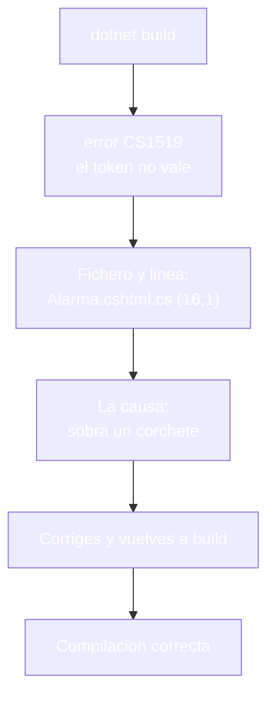
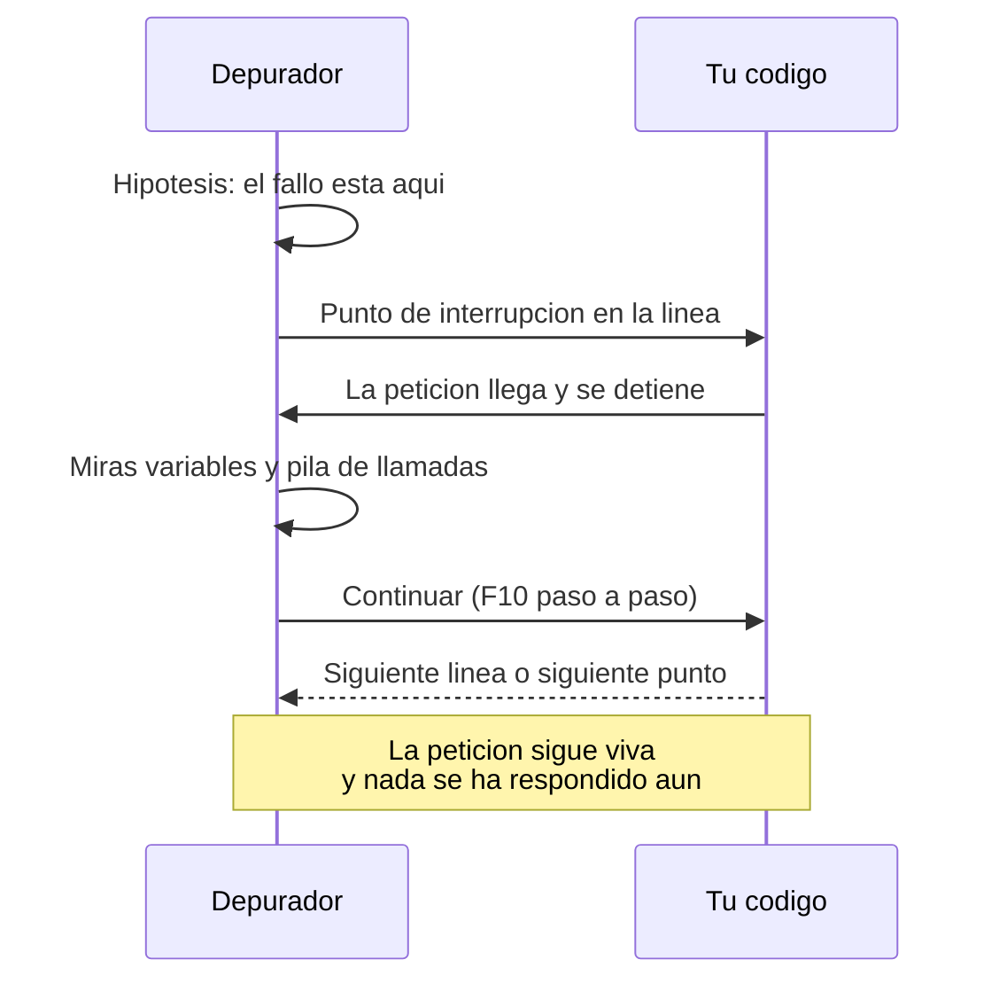
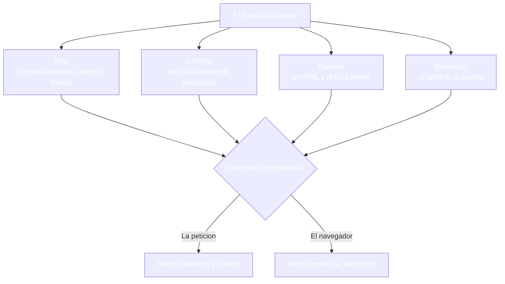
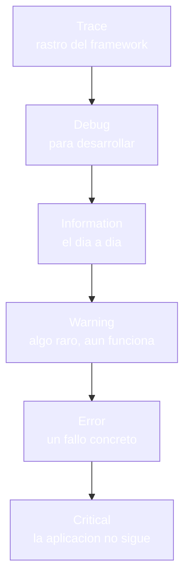
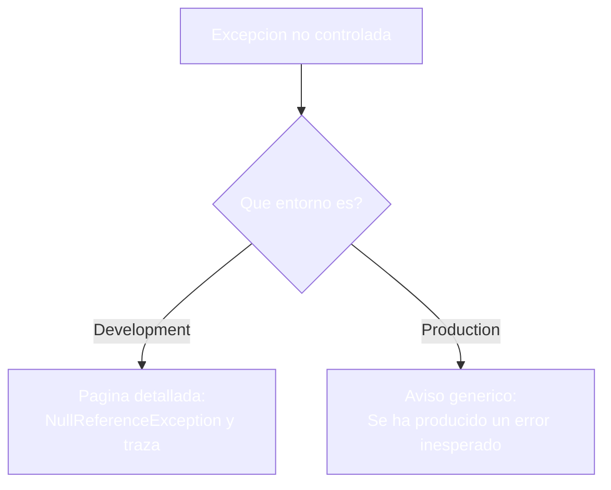

- [23. Herramientas de programación, prueba y depuración](#23-herramientas-de-programación-prueba-y-depuración)
  - [23.1. El entorno de desarrollo](#231-el-entorno-de-desarrollo)
    - [23.1.1. Rider y el ecosistema JetBrains](#2311-rider-y-el-ecosistema-jetbrains)
    - [23.1.2. La estructura del proyecto y cómo se ejecuta](#2312-la-estructura-del-proyecto-y-cómo-se-ejecuta)
  - [23.2. La herramienta de línea de comandos](#232-la-herramienta-de-línea-de-comandos)
    - [23.2.1. Los comandos de cada día](#2321-los-comandos-de-cada-día)
    - [23.2.2. Leer un error de compilación](#2322-leer-un-error-de-compilación)
  - [23.3. Depuración en el servidor](#233-depuración-en-el-servidor)
    - [23.3.1. Puntos de interrupción y recorrido](#2331-puntos-de-interrupción-y-recorrido)
    - [23.3.2. Visión Razor Pages: depurar un PageModel](#2332-visión-razor-pages-depurar-un-pagemodel)
    - [23.3.3. Visión MVC: depurar un controlador](#2333-visión-mvc-depurar-un-controlador)
  - [23.4. La depuración en el navegador](#234-la-depuración-en-el-navegador)
    - [23.4.1. F12: red, consola y fuentes](#2341-f12-red-consola-y-fuentes)
    - [23.4.2. Seguir una petición con curl](#2342-seguir-una-petición-con-curl)
  - [23.5. Registro y diagnóstico](#235-registro-y-diagnóstico)
    - [23.5.1. ILogger: niveles y categorías](#2351-ilogger-niveles-y-categorías)
    - [23.5.2. La página de error: desarrollo frente a producción](#2352-la-página-de-error-desarrollo-frente-a-producción)
  - [23.6. Errores frecuentes y cómo leerlos](#236-errores-frecuentes-y-cómo-leerlos)
  - [23.7. Reglas de seguridad](#237-reglas-de-seguridad)
  - [23.8. Buenas prácticas](#238-buenas-prácticas)
  - [23.9. Reto: diagnosticar la tienda de Funkos](#239-reto-diagnosticar-la-tienda-de-funkos)
    - [23.9.1. Contexto](#2391-contexto)
    - [23.9.2. Modelo de datos](#2392-modelo-de-datos)
    - [23.9.3. Almacenamiento](#2393-almacenamiento)
    - [23.9.4. Retos](#2394-retos)


# 23. Herramientas de programación, prueba y depuración

> 💡 **Punto de partida:** abres la pestaña Red del navegador mientras ves Netflix y el muro se llena de peticiones, cada una con su código, su tamaño y su tiempo — hasta ese momento, la web era una caja negra que simplemente funcionaba. Cuando tu propia aplicación falla, esa misma pestaña es la que te dice si el problema está en la petición, en el servidor o en la vista. ¿Qué herramientas existen para ver lo que hace una aplicación por dentro, dónde se detiene cuando falla y cómo se sigue una petición desde la terminal hasta el navegador?

En este punto recorrerás el cajón de herramientas de un desarrollador de web: el entorno de trabajo, la línea de comandos de .NET, el depurador del servidor, las pestañas del navegador y el registro de eventos. Todo se practica sobre una aplicación que falla a propósito, en las dos visiones.

**Objetivos de aprendizaje:**

- Conocer el entorno de desarrollo y los comandos de .NET que se usan cada día
- Leer un error de compilación y encontrar el fichero y la línea que lo provoca
- Depurar en el servidor con puntos de interrupción, en páginas y en controladores
- Seguir una petición con las pestañas del navegador y con `curl`
- Registrar con `ILogger` y saber qué página de error toca según el entorno

## 23.1. El entorno de desarrollo

### 23.1.1. Rider y el ecosistema JetBrains

**El entorno principal de este ciclo es JetBrains Rider, y pertenece a una familia con un intérprete para cada lenguaje.** JetBrains hace Rider para C# y .NET, IntelliJ para Java, PyCharm para Python, CLion para C y C++, y WebStorm para JavaScript; la forma de trabajar es la misma en todos: abrir el proyecto, ejecutarlo y detenerlo cuando algo no cuadra.

Lo que usa el depurador de Rider, y que verás en todo el tema:

- **Punto de interrupción** (`F9`): la ejecución se detiene en esa línea
- **Paso a paso** (`F10` por línea, `F11` entrando en llamadas, `Shift+F11` saliendo)
- **Pila de llamadas**: de dónde viene el flujo hasta la línea donde estás
- **Ventana de variables**: el valor real de cada cosa en ese instante
- **Evaluación de expresiones**: preguntarle al depurador por cualquier valor

📌 **Ejemplo real:** JetBrains. Rider es el entorno de C# de la misma empresa que hace IntelliJ para Java, PyCharm para Python o WebStorm para JavaScript: una herramienta para cada lenguaje y la misma idea de trabajo detrás.

> 📝 **Nota:** Visual Studio Code es la alternativa ligera y multiplataforma; las ideas de este punto (puntos de interrupción, pestañas, registro) son las mismas en los dos.

### 23.1.2. La estructura del proyecto y cómo se ejecuta

**Antes de depurar hay que saber qué se está ejecutando: el proyecto compila a un ensamblado, ese ensamblado se ejecuta como servidor web y cada petición recorre el mismo camino.** `dotnet run` compila si hace falta y arranca el servidor — a partir de ahí, cada petición pasa por el conducto que ya conoces y acaba en una página o en una acción:

```mermaid
graph LR
    T["Tu terminal:<br/>dotnet run"] --> S["El servidor arranca<br/>y escucha un puerto"]
    S --> P["Una peticion llega<br/>por el navegador o curl"]
    P --> D["Tu codigo:<br/>PageModel o controlador"]
    D --> V["La vista se pinta"]
    V --> N["El navegador la recibe"]
    N -.->|"y F12 la desglosa"| F["Pestana Red"]
    style T fill:#2196F,color:#fff3,color:#fff
    style S fill:#607D8,color:#fffB,color:#fff
    style P fill:#2196F,color:#fff3,color:#fff
    style D fill:#FF980,color:#fff0,color:#fff
    style V fill:#9C27B,color:#fff0,color:#fff
    style N fill:#4CAF5,color:#fff0,color:#fff
    style F fill:#4CAF5,color:#fff0,color:#fff
```



📌 **Ejemplo real:** Cualquier proyecto real se arranca igual: una orden de compilación, una orden de ejecución y una petición al navegador; detrás de la web de Netflix hay un servidor que alguien arranca igual que tú arrancas el tuyo.

## 23.2. La herramienta de línea de comandos

### 23.2.1. Los comandos de cada día

**La CLI de .NET es la misma en Windows, en macOS y en Linux, y se resume en seis órdenes:**

| Comando | Qué hace |
|---------|----------|
| **`dotnet new`** | Crea un proyecto a partir de una plantilla |
| **`dotnet restore`** | Descarga las dependencias del proyecto |
| **`dotnet build`** | Compila y avisa de errores y advertencias |
| **`dotnet run`** | Compila si hace falta y arranca la aplicación |
| **`dotnet watch`** | Arranca y vuelve a compilar al guardar un fichero |
| **`dotnet clean`** | Borra las carpetas de compilación |

El ciclo completo de un ejercicio es `build`, `run` y una petición al navegador — `watch` ahorra la reconstrucción manual mientras tocamos cosas, y `clean` es el que se usa cuando la compilación se comporta de forma extraña y hay que empezar de cero.

📌 **Ejemplo real:** Los equipos de desarrollo ejecutan exactamente las mismas órdenes que tú: compilan, prueban y publican con la misma herramienta de línea de comandos, desde la terminal o desde la automatización.

### 23.2.2. Leer un error de compilación

**Un error de compilación tiene cuatro piezas: el código, el mensaje, el fichero y la línea; leer las cuatro es todo lo que hace falta.** En el laboratorio, un `int x = ;` colocado a mala leche en un fichero de la aplicación produce esto:

```text
Pages/Alarma.cshtml.cs(16,1): error CS1519: Token "}" no válido en una declaración de miembro
```

El compilador dice qué sobra o qué falta (`CS1519`), en qué fichero y en qué línea; corregida la línea, la orden vuelve a responder `Compilación correcta`. Y antes de que el fallo llegue a ejecutarse, el compilador ya ha avisado de los riesgos: en nuestro `/romper`, la desreferencia de una referencia posiblemente nula aparece en el build como `warning CS8602: Desreferencia de una referencia posiblemente NULL`, y el fallo en tiempo de ejecución llega después, si nadie hace caso al aviso.



📌 **Ejemplo real:** Cualquier error de compilación que veas en un proyecto ajeno sigue el mismo patrón: un código, un mensaje, un fichero y una línea; aprender a leerlo es aprender a leer cualquier proyecto.

> 🔧 **Truco:** los errores salen ordenados por fichero; si hay cinco, casi siempre las cinco son la misma causa vista desde sitios distintos. Se arregla la primera y las demás caen solas.

## 23.3. Depuración en el servidor

### 23.3.1. Puntos de interrupción y recorrido

**El depurador detiene la ejecución en la línea que tú eliges y te deja mirar dentro antes de que siga.** El recorrido típico es hipótesis, punto de interrupción, ejecución y mirada:



Cuatro reglas hacen que esto sea rápido y no un baile de ventanas:

- **Un punto de interrupción por hipótesis**: primero la línea que crees culpable, no veinte a la vez
- **Paso a paso sobre el código que conoces**: `F10` en tu lógica y `F11` solo cuando toca mirar dentro de una llamada
- **La pila de llamadas responde a "¿quién me ha traído hasta aquí?"**: desde la vista hasta el servicio, en orden inverso
- **Las variables se miran en ese instante**: si un valor no es el que esperabas, el culpable suele estar una línea arriba

📌 **Ejemplo real:** Los equipos de soporte de Netflix reproducen el fallo en su entorno de pruebas y lo detienen en un punto de interrupción; nadie adivina mirando el código: se mira la ejecución.

### 23.3.2. Visión Razor Pages: depurar un PageModel

**En páginas, el punto de interrupción típico es la primera línea de `OnGet`; cuando la petición llega, el depurador se detiene antes de que la vista pinte nada:**

```csharp
// Pages/Alarma.cshtml.cs
public class AlarmaModel(ILogger<AlarmaModel> logger) : PageModel
{
    public void OnGet()
    {
        logger.LogInformation("Peticion recibida en /alarma");  // ← punto de interrupción
        logger.LogWarning("Valor nulo detectado en el carrito");
    }
}
```

Y la trampa que el laboratorio reproduce en vivo: una página `@page` sin `@model` se pinta igual, pero su `OnGet` no se ejecuta, y el punto de interrupción ni siquiera salta. Si el depurador no se detiene donde esperabas, antes de desconfiar del depurador, comprueba que la vista declare su modelo.

> ⚠️ **Advertencia:** depurar con el servidor en otro entorno cambia el resultado: la página de error detallada y los avisos de desarrollo solo existen donde el entorno lo permite, como verás en el 23.5.2.

### 23.3.3. Visión MVC: depurar un controlador

**En MVC el punto de interrupción va en la acción, y el recorrido es el mismo:**

```csharp
// Controllers/DemoController.cs
public IActionResult Alarma()
{
    logger.LogInformation("Peticion recibida en /Demo/Alarma");  // ← punto de interrupción
    logger.LogWarning("Valor nulo detectado en el carrito");

    return View();
}
```

> 📝 **Nota:** cambia el sitio donde se escribe la lógica, no la depuración: las mismas ventanas, los mismos pasos y las mismas variables en las dos visiones.

## 23.4. La depuración en el navegador

### 23.4.1. F12: red, consola y fuentes

**La tecla `F12` abre el conjunto de herramientas del navegador, y cada pestaña responde a una pregunta distinta:**



En este ciclo ya has usado la pestaña Red para mirar cookies, para comprobar redirecciones y para medir tiempos; la Consola es la que avisa de los errores de JavaScript, y Fuentes muestra el HTML que el navegador ha recibido de verdad, que no siempre es el que escribiste.

📌 **Ejemplo real:** Abres la pestaña Red de F12 en Amazon y ves cada búsqueda, cada imagen y cada favicon con su código y su tiempo: esa es la misma vista que usas para depurar tu aplicación.

### 23.4.2. Seguir una petición con curl

**`curl` es el navegador de la terminal: manda la petición y devuelve la respuesta entera, cabeceras incluidas.** Con `-i` ves el estado y las cabeceras, y con `-w` sacas tiempos y tamaños; en el laboratorio de hoy, `/no-existe` responde `404` y `/romper` responde `500`, y las dos respuestas se leen igual desde la terminal:

```bash
curl -i http://localhost:5317/no-existe    # estado 404 con sus cabeceras
curl -i http://localhost:5317/romper       # estado 500 y el cuerpo del fallo
```

> 🔧 **Truco:** cuando la página "no va", la primera orden es `curl -i`: si la respuesta sale bien desde la terminal, el problema está en el navegador; si sale mal, está en el servidor.

## 23.5. Registro y diagnóstico

### 23.5.1. ILogger: niveles y categorías

**`ILogger` es el cuaderno de bitácora de la aplicación: cada mensaje lleva un nivel y una categoría, y los niveles forman una escalera donde solo se escribe lo que importa:**



El uso es directo: se inyecta `ILogger<T>` con constructor primario y se registra con el nivel que toca. En el laboratorio, una petición a `/alarma` deja en la consola tres líneas, una por nivel:

```text
info: DebugPages.Pages.AlarmaModel[0] Peticion recibida en /alarma
warn: DebugPages.Pages.AlarmaModel[0] Valor nulo detectado en el carrito
fail: DebugPages.Pages.AlarmaModel[0] No se pudo calcular el precio System.InvalidOperationException: Fallo simulado
```

La categoría es la clase donde se registra — y por eso las dos visiones dejan la misma estructura con nombres distintos: `DebugPages.Pages.AlarmaModel` en páginas y `DebugMvc.Controllers.DemoController` en MVC.

```csharp
// ❌ MALO: Console.WriteLine no tiene niveles ni categorías ni llega a ningún sitio
Console.WriteLine("algo ha pasado");

// ✅ BUENO: ILogger con el nivel que corresponde
logger.LogWarning("Valor nulo detectado en el carrito");
```

📌 **Ejemplo real:** Cualquier servicio de streaming registra qué se ha visto y qué ha fallado; tus aplicaciones pueden hacer lo mismo con `ILogger` y dos líneas por sitio que pueda romperse.

### 23.5.2. La página de error: desarrollo frente a producción

**El mismo fallo se cuenta de dos formas según el entorno, y ese es el comportamiento que ya configuraste en el punto 20:** en desarrollo, la aplicación muestra la excepción y su traza; en producción, un aviso genérico sin detalles.



```csharp
// Program.cs
if (app.Environment.IsDevelopment())
{
    app.UseDeveloperExceptionPage();
}
else
{
    app.UseExceptionHandler("/Error");
}
```

La medida de las dos visiones, con la misma petición a `/romper`: en `Development` responde `500` y la vista contiene `NullReferenceException` con su traza; en `Production` responde `500` con el aviso `Se ha producido un error inesperado` y sin una sola pista de la excepción.

📌 **Ejemplo real:** Cuando una web grande falla, el usuario ve una página amable y el equipo ve la traza completa: es el mismo `IsDevelopment` que ya montaste en el punto de configuración.

## 23.6. Errores frecuentes y cómo leerlos

**Cada tipo de fallo de este ciclo tiene su cara visible; esta tabla es la primera referencia cuando algo no va:**

| Qué ves | Dónde aparece | Qué significa |
|---------|---------------|---------------|
| **`error CS####`** | Compilación | El código no puede compilarse; el compilador da fichero y línea |
| **`warning CS8602`** | Compilación | Riesgo de referencia nula; el fallo llegará en ejecución si hace caso omiso |
| **`error RZ####`** | Compilación de vistas | La vista tiene una plantilla rota |
| **`404`** | Navegador y `curl` | La ruta no existe |
| **`500`** | Navegador y `curl` | Excepción no controlada dentro del servidor |
| **`400`** | Navegador y `curl` | Petición rechazada, como un `POST` sin token antifalsificación |
| **`302`** | Navegador y `curl` | Redirección: acceso denegado o salida de sesión |

## 23.7. Reglas de seguridad

- **La página de error detallada nunca en producción**: ni una sola vez; la traza se queda en el servidor
- **Registro sin datos sensibles**: ni claves, ni correos completos, ni tokens en los mensajes
- **Niveles con cabeza**: `Error` para fallos reales; no `Information` para todo el rato
- **Sin puntos de interrupción ni depuración en el código publicado**
- **Errores genéricos al usuario**: el aviso no debe contar qué parte del código ha fallado
- **La consola del desarrollo no es la de producción**: no se depura contra datos reales

## 23.8. Buenas prácticas

- **Rider como entorno principal**, con VS Code como alternativa ligera
- **Compilar antes de depurar**: un error de compilación no se depura, se corrige
- **Un punto de interrupción por hipótesis**, no veinte a la vez
- **Leer el error entero**: código, mensaje, fichero y línea, en ese orden
- **`ILogger` donde puede fallar**, con el nivel que corresponde
- **`dotnet watch` en desarrollo** para no reconstruir a mano cada cambio
- **F12 antes que adivinar**: la pestaña Red cuenta lo que el navegador ha visto
- **Una línea de registro por evento**, como en el laboratorio
- **El mismo error, dos entornos**: comprobar desarrollo y producción
- **Primero el papel, luego el código**: dibuja el recorrido de la petición antes de depurarla

## 23.9. Reto: diagnosticar la tienda de Funkos

> Monta el cajón de herramientas de tu tienda: registro por niveles, una página de error con las dos caras y una ronda de depuración con F12 y puntos de interrupción, en las dos visiones.

### 23.9.1. Contexto

**Paso 0:** parte del reto del punto 22 en sus dos visiones (`FunkoApp` y `FunkoAppMvc`), con la localización funcionando. Tu tienda ya habla dos idiomas; ahora le falta poder mirarse por dentro cuando algo falle.

### 23.9.2. Modelo de datos

| Propiedad | Tipo | Obligatorio |
|-----------|------|:-----------:|
| `id` | int | Sí (autogenerado) |
| `nombre` | string | Sí |
| `categoria` | string | Sí |
| `anio` | int | Sí |
| `precioReferencia` | decimal | Sí |
| `imagen` | string? | No |
| `etiquetas` | List\<string\>? | No |
| `activo` | bool | Sí |
| `esNovedad` | bool | Sí |

### 23.9.3. Almacenamiento

```csharp
public static class RepositorioFunkos
{
    private static readonly List<Funko> Funkos = [ /* seis figuras */ ];

    public static IReadOnlyList<Funko> ObtenerTodos() => Funkos;
}
```

Rellena la lista con seis figuras de modo que haya activas y dadas de baja, novedades y no novedades, y las tres categorías.

### 23.9.4. Retos

**Pasos compartidos (las dos visiones):**

1. **En papel primero:** dibuja el recorrido de una petición a tu listado y anota dónde puede fallar: ruta, lógica, vista o datos
2. Añade `ILogger<T>` al servicio de la tienda y registra `Information` al listar, `Warning` cuando falte stock y `Error` con excepción al no poder calcular un precio; comprueba que los tres niveles salen en la consola
3. Crea una lectura `/romper` que lance una `NullReferenceException`; comprueba que en `Development` responde **500** con la traza y que en `Production` responde **500** con el aviso genérico
4. Rompe a propósito una línea de compilación y comprueba que el compilador entrega código, mensaje, fichero y línea; corrígela y vuelve a limpiar el build
5. Mira tu aplicación con **F12**: la pestaña Red para las peticiones del listado y la Consola para cualquier error de JavaScript; anota los códigos de estado que ves
6. Comprueba con `curl -i` una ruta inexistente (**404**) y una rota (**500**) y anota qué cabeceras trae cada una
7. Sigue una petición en el depurador desde el punto de interrupción del listado hasta la vista; comprueba que las variables que esperabas están donde esperabas

**Visión Razor Pages:**

8. Depura un `PageModel` con punto de interrupción en `OnGet`; comprueba que el depurador se detiene antes de pintar la vista
9. Comprueba la trampa del `@model`: sin la declaración, la vista se pinta y el `OnGet` no se ejecuta ni salta el punto de interrupción

**Visión MVC:**

10. Depura una acción del controlador con punto de interrupción; comprueba que el recorrido es el mismo que en páginas
11. Inspecciona en el depurador el `ModelState` y la `ViewBag` en mitad de la acción; comprueba que los datos llegan antes de devolver la vista

**Puntos extra:**

- Crea un punto de interrupción condicional que salte solo cuando el carrito esté vacío; comprueba que no salta en las peticiones con datos
- Escribe en el repositorio por qué la página de error detallada no puede salir en producción ni una sola vez
- Añade un registro `Critical` a un fallo irrecuperable y comprueba que aparece marcado como `fail` en la consola

---

**Resumen del punto:**

| Concepto | Descripción |
|----------|-------------|
| **Rider** | Entorno principal de C#; JetBrains hace uno para cada lenguaje |
| **CLI de .NET** | `build`, `run`, `watch`, `clean`, `restore` y `new` |
| **Error de compilación** | Código, mensaje, fichero y línea; las cuatro piezas, en ese orden |
| **Aviso `CS8602`** | Riesgo de referencia nula; el compilador avisa antes de que caiga |
| **Punto de interrupción** | La ejecución se detiene donde tú eliges y se mira por dentro |
| **F12** | Red para peticiones, Consola para JavaScript, Fuentes y Elementos para el DOM |
| **`curl -i`** | La petición desde la terminal, con estado y cabeceras |
| **`ILogger`** | Registro con niveles (`info`, `warn`, `fail`) y categorías |
| **Página de error** | Detallada en desarrollo, genérica en producción |
| **Comprobado** | Un `int x = ;` produce `error CS1519` con fichero y línea y el build vuelve a estar limpio al corregirlo, `/romper` responde **500** con `NullReferenceException` en desarrollo y con el aviso genérico sin traza en producción, `/alarma` registra `info`, `warn` y `fail` en la consola y `/no-existe` responde **404**, todo idéntico en las dos visiones |

**¿Qué viene después?**

En el siguiente punto toca la Prueba y la Documentación: cómo se comprueba que lo que funciona hoy sigue funcionando mañana, y cómo se explica el código para que otro lo entienda.
