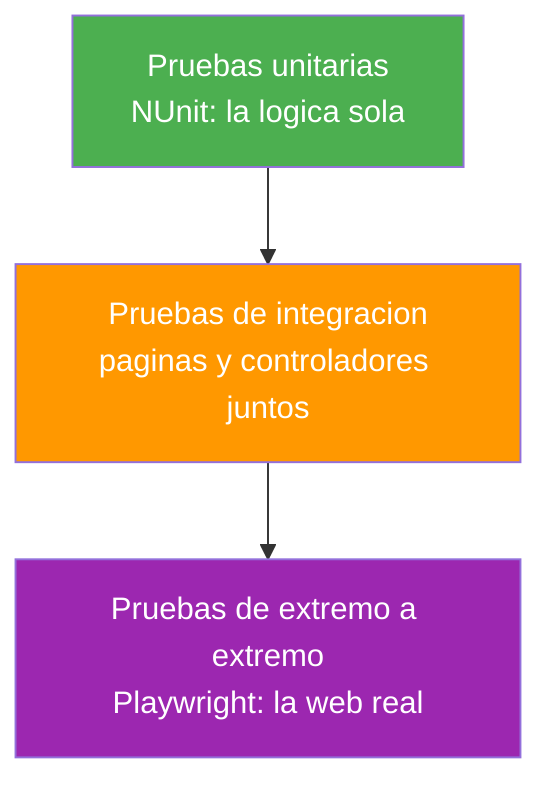
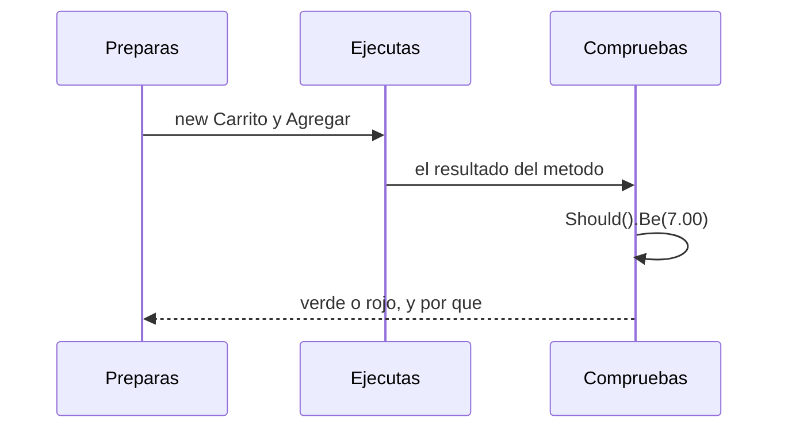
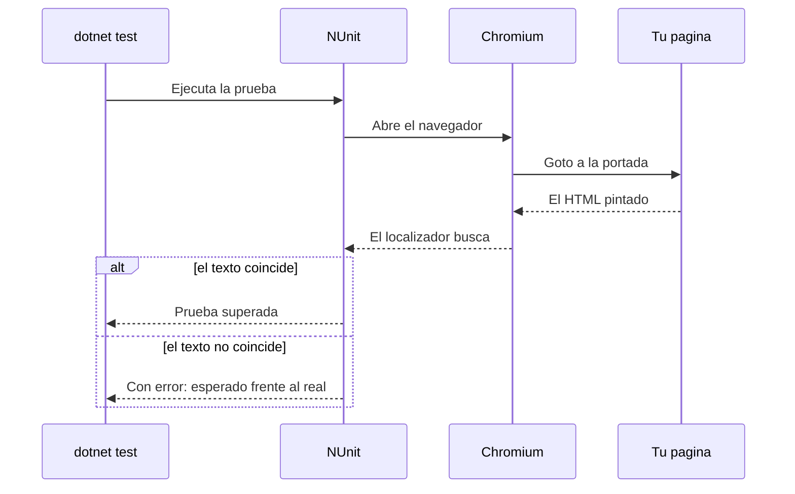
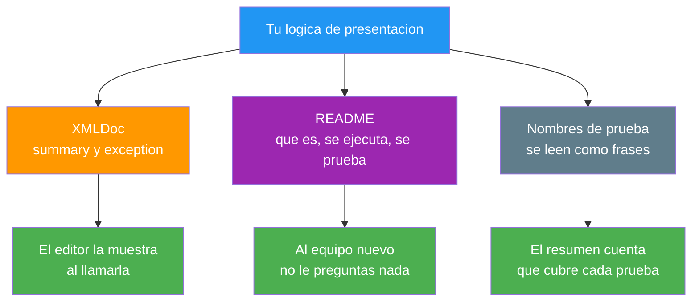
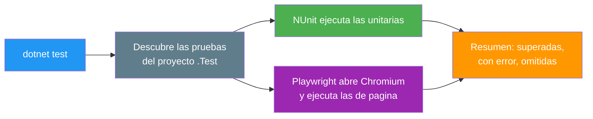

- [24. Pruebas y Documentación del Código de Presentación](#24-pruebas-y-documentación-del-código-de-presentación)
  - [24.1. Por Qué se Prueba](#241-por-qué-se-prueba)
    - [24.1.1. La Pirámide de Pruebas](#2411-la-pirámide-de-pruebas)
    - [24.1.2. El Proyecto de Pruebas](#2412-el-proyecto-de-pruebas)
  - [24.2. Pruebas Unitarias con NUnit](#242-pruebas-unitarias-con-nunit)
    - [24.2.1. El Patrón AAA y FluentAssertions](#2421-el-patrón-aaa-y-fluentassertions)
    - [24.2.2. Pruebas Parametrizadas y Casos Inválidos](#2422-pruebas-parametrizadas-y-casos-inválidos)
    - [24.2.3. Visión Razor Pages: Probar la Lógica del PageModel](#2423-visión-razor-pages-probar-la-lógica-del-pagemodel)
    - [24.2.4. Visión MVC: Probar la Lógica del Controlador](#2424-visión-mvc-probar-la-lógica-del-controlador)
  - [24.3. Pruebas de Páginas con Playwright](#243-pruebas-de-páginas-con-playwright)
    - [24.3.1. Microsoft.Playwright y la Instalación del Navegador](#2431-microsoftplaywright-y-la-instalación-del-navegador)
    - [24.3.2. La Primera Prueba: Cargar y Comprobar](#2432-la-primera-prueba-cargar-y-comprobar)
    - [24.3.3. Visión Razor Pages: Pruebas de la Página](#2433-visión-razor-pages-pruebas-de-la-página)
    - [24.3.4. Visión MVC: Pruebas de la Vista](#2434-visión-mvc-pruebas-de-la-vista)
    - [24.3.5. Flujos Completos con Playwright](#2435-flujos-completos-con-playwright)
  - [24.4. Documentar el Código de Presentación](#244-documentar-el-código-de-presentación)
    - [24.4.1. XMLDoc en la Lógica de las Vistas](#2441-xmldoc-en-la-lógica-de-las-vistas)
    - [24.4.2. El README del Proyecto](#2442-el-readme-del-proyecto)
  - [24.5. Ejecutar las Pruebas](#245-ejecutar-las-pruebas)
  - [24.6. Reglas de Seguridad](#246-reglas-de-seguridad)
  - [24.7. Buenas Prácticas](#247-buenas-prácticas)
  - [24.8. Reto: Pruebas de la Tienda de Funkos](#248-reto-pruebas-de-la-tienda-de-funkos)
    - [24.8.1. Contexto](#2481-contexto)
    - [24.8.2. Modelo de datos](#2482-modelo-de-datos)
    - [24.8.3. Almacenamiento](#2483-almacenamiento)
    - [24.8.4. Retos](#2484-retos)


# 24. Pruebas y Documentación del Código de Presentación

> 💡 **Punto de partida:** Netflix despliega varias veces al día y, antes de que un cambio llegue a tu televisor, miles de pruebas automáticas lo comprueban todo: que la portada carga, que el vídeo arranca y que el pago procesa — cuando tu propia aplicación cambia, ¿cómo se comprueba de forma automática que lo que funcionaba sigue funcionando y que lo nuevo hace lo que debe, sin depender de que alguien abra el navegador y pruebe a mano?

En este tema montas las pruebas de una aplicación de presentación: pruebas unitarias de la lógica de páginas y controladores con NUnit y FluentAssertions, pruebas de página reales con Playwright, ejecución y lectura de resultados con `dotnet test`, y la documentación que hace entendible ese código. Todo en las dos visiones.

**Objetivos de aprendizaje:**

- Entender la pirámide de pruebas y crear el proyecto de pruebas con NUnit
- Escribir pruebas unitarias de la lógica de presentación con el patrón AAA
- Montar pruebas de página con Playwright en Razor Pages y en MVC
- Ejecutar, filtrar y leer los resultados de `dotnet test`
- Documentar la lógica de las vistas con XMLDoc y un README

## 24.1. Por Qué se Prueba

### 24.1.1. La Pirámide de Pruebas

**Las pruebas se ordenan en una pirámide: muchas unitarias, algunas de integración y pocas de extremo a extremo.** Cada nivel cubre una cosa distinta y cuesta un precio distinto — la forma de la pirámide es la respuesta a esa cuenta:



| Nivel | Qué comprueba | Cuántas | Cuánto tarda |
|-------|---------------|---------|--------------|
| **Unitarias** | La lógica de presentación: totales, avisos, validaciones | Muchas | Milisegundos |
| **Integración** | Páginas y controladores con sus servicios | Algunas | Segundos |
| **Extremo a extremo** | La web real en un navegador, con Playwright | Pocas | Minutos |

📌 **Ejemplo real:** Netflix despliega varias veces al día y cada versión pasa por miles de pruebas automáticas antes de llegar a tu televisor; nadie mira la web a mano antes de publicar.

> 💡 **Analogía:** la pirámide es la de un equipo de fútbol: el entrenamiento con balón (unitarias) se hace cada día y en cantidad; el partido amistoso (integración), de vez en cuando; y el partido oficial (extremo a extremo), pocas veces porque exige preparar el campo entero.

### 24.1.2. El Proyecto de Pruebas

**Las pruebas viven en su propio proyecto de la solución, al lado del proyecto que comprueban.** El convencionalismo de este ciclo: el proyecto se llama igual que el de la aplicación más `.Test`, y dentro se reparte por carpetas que imitan al proyecto original:

```text
PruebaApp.Test/
├── Models/          Pruebas unitarias de la lógica
├── Pages/           Pruebas de página con Playwright
├── Mvc/             Pruebas de vista con Playwright
└── PruebaApp.Test.csproj
```

El `.csproj` trae las piezas de siempre de este ciclo: NUnit como motor de pruebas, FluentAssertions para las aserciones, el adaptador para ejecutar desde el IDE y desde la terminal, y los paquetes de Playwright para las pruebas de navegador.

```xml
<ItemGroup>
  <PackageReference Include="FluentAssertions" Version="6.12.2" />
  <PackageReference Include="Microsoft.NET.Test.Sdk" Version="17.14.0" />
  <PackageReference Include="Microsoft.Playwright" Version="1.54.0" />
  <PackageReference Include="Microsoft.Playwright.NUnit" Version="1.54.0" />
  <PackageReference Include="NUnit" Version="4.3.2" />
  <PackageReference Include="NUnit3TestAdapter" Version="5.0.0" />
</ItemGroup>
```

## 24.2. Pruebas Unitarias con NUnit

### 24.2.1. El Patrón AAA y FluentAssertions

**Toda prueba unitaria se escribe en tres tiempos: preparar (Arrange), ejecutar (Act) y comprobar (Assert).** El patrón AAA hace que la prueba se lea como una frase y que el fallo apunte al sitio correcto — FluentAssertions pone las aserciones en castellano claro:

```csharp
[Test]
public void Agregar_UnaLinea_RetornaElTotalEsperado()
{
    // Arrange
    var carrito = new Carrito();

    // Act
    carrito.Agregar("Producto de prueba", 3.50m, 2);

    // Assert
    carrito.Total.Should().Be(7.00m);
}
```



📌 **Ejemplo real:** Cualquier equipo de desarrollo separa sus pruebas por el mismo criterio que sus carpetas: una prueba por lógica, con un nombre que se lee como una frase y con sus tres tiempos marcados.

> 🔧 **Truco:** el nombre del método es la primera documentación de la prueba: `Agregar_UnaLinea_RetornaElTotalEsperado` se entiende sin abrir el cuerpo.

### 24.2.2. Pruebas Parametrizadas y Casos Inválidos

**Un mismo comportamiento con muchos datos se escribe una vez con `[TestCase]`, y lo que no debe pasar se prueba con aserciones de excepción.** Las dos formas, con los casos válidos e inválidos separados en clases internas:

```csharp
[TestCase(1, 9.99, 9.99)]
[TestCase(2, 3.50, 7.00)]
[TestCase(5, 2.00, 10.00)]
public void Agregar_UnaLinea_RetornaElTotalEsperado(int cantidad, decimal precio, decimal esperado)
{
    // Arrange
    var carrito = new Carrito();

    // Act
    carrito.Agregar("Producto de prueba", precio, cantidad);

    // Assert
    carrito.Total.Should().Be(esperado);
}
```

```csharp
[TestFixture]
public class CasosInvalidos
{
    [Test]
    public void Agregar_PrecioNegativo_LanzaArgumentException()
    {
        // Arrange
        var carrito = new Carrito();

        // Act
        var accion = () => carrito.Agregar("Producto de prueba", -1m);

        // Assert
        accion.Should().Throw<ArgumentException>()
            .WithMessage("*precio*");
    }
}
```

El laboratorio del tema pasa las ocho pruebas unitarias del carrito: tres con `[TestCase]`, dos de estado y tres de casos inválidos con `Throw<ArgumentException>`.

### 24.2.3. Visión Razor Pages: Probar la Lógica del PageModel

**La lógica de un `PageModel` que se puede probar sin HTTP es una clase aparte, y las pruebas unitarias la tocan directamente:** totales, avisos y validaciones se comprueban con `new`, sin arrancar el servidor.

```csharp
// La lógica vive fuera del PageModel, en Models/Carrito.cs
public class Carrito
{
    public decimal Total => _lineas.Sum(l => l.Precio * l.Cantidad);

    public string Aviso => TotalUnidades switch
    {
        0 => "El carrito esta vacio",
        > 10 => "Demasiadas unidades en el carrito",
        _ => "Carrito correcto"
    };
}
```

El `PageModel` se queda en lo suyo: coger la petición, llamar a la lógica y devolver la vista; lo que importa de él ya está cubierto por las pruebas de página del 24.3.

### 24.2.4. Visión MVC: Probar la Lógica del Controlador

**En MVC el reparto es el mismo: la lógica de presentación en su clase y el controlador reducido a enlazar petición, lógica y vista:**

```csharp
public class TiendaController : Controller
{
    private static readonly Carrito Cesta = new();

    public IActionResult Index() => View(Cesta);

    [HttpPost]
    public IActionResult Anadir(string nombre, string precio, int cantidad)
    {
        // El formulario envía el punto decimal; se parsea con cultura invariable
        var valor = decimal.Parse(precio, CultureInfo.InvariantCulture);
        Cesta.Agregar(nombre, valor, cantidad);
        return RedirectToAction(nameof(Index));
    }
}
```

> 📝 **Nota:** las pruebas unitarias de esta lógica son las mismas en las dos visiones, porque la lógica es la misma; lo que cambia después es cómo se prueba la página pintada.

## 24.3. Pruebas de Páginas con Playwright

### 24.3.1. Microsoft.Playwright y la Instalación del Navegador

**Playwright abre un navegador real, va a tus páginas y comprueba lo que hay en ellas; en .NET se usa con NUnit a través de `Microsoft.Playwright.NUnit`.** La base `PageTest` deja preparado un navegador y una página para cada prueba.

El paquete trae su instalador de navegadores, y la primera vez hay que ejecutarlo una sola vez:

```bash
pwsh bin/Debug/net10.0/playwright.ps1 install chromium
```

La orden descarga el navegador que usa la prueba (en el laboratorio, Chromium 139, unos 150 MB) y lo guarda en el perfil del equipo; las pruebas siguientes ya solo abren el navegador instalado.

📌 **Ejemplo real:** Playwright nació en Microsoft para automatizar navegadores reales; lo mismo usan los equipos de Chrome, Firefox y Safari para comprobar sus propias aplicaciones antes de publicar.

### 24.3.2. La Primera Prueba: Cargar y Comprobar

**La prueba más simple de todas: abrir una página y comprobar un texto.** Con la base `PageTest`, el navegador ya está abierto y `Page` es la página sobre la que se trabaja:

```csharp
[TestFixture]
public class PortadaPlaywrightTests : PageTest
{
    private const string Url = "http://localhost:5319/";

    [Test]
    public async Task Portada_Carga_MuestraElTitulo()
    {
        await Page.GotoAsync(Url);

        await Expect(Page.Locator("#titulo")).ToHaveTextAsync("Tienda de prueba");
    }
}
```



Playwright no usa esperas a mano: el localizador espera a que el texto aparezca y la prueba se lee sin tiempos muertos.

### 24.3.3. Visión Razor Pages: Pruebas de la Página

**En la visión de páginas, el conjunto de pruebas va contra la aplicación real en su puerto, con localizadores por identificador y por rol:**

```csharp
[Test]
public async Task Portada_MuestraElFormulario()
{
    await Page.GotoAsync(Url);

    await Expect(Page.GetByRole(AriaRole.Button, new() { Name = "Añadir" })).ToBeVisibleAsync();
}
```

Las pruebas de esta visión comprueban en el navegador que la portada carga con su título, que enseña el formulario y que el alta suma el total.

### 24.3.4. Visión MVC: Pruebas de la Vista

**En MVC el conjunto es el mismo, apuntando al puerto de la otra aplicación y comprobando además lo que distingue a la vista:**

```csharp
[Test]
public async Task Vista_PintaQueEsMVC()
{
    await Page.GotoAsync(Url);

    await Expect(Page.Locator("#vista")).ToHaveTextAsync("Vista MVC");
}
```

> 📝 **Nota:** cambia la dirección a la que apunta la prueba, no la forma de escribirla: el mismo `PageTest`, los mismos localizadores y las mismas aserciones en las dos visiones.

### 24.3.5. Flujos Completos con Playwright

**Una prueba de flujo rellena, pulsa y comprueba lo que ha cambiado.** La del alta, contra la aplicación real, suma el total anterior y el de las unidades añadidas:

```csharp
[Test]
public async Task Anadir_FlujoCompleto_SumaElTotal()
{
    await Page.GotoAsync(Url);

    var antes = LeerTotal(await Page.Locator("#total").InnerTextAsync());

    await Page.Locator("#nombre").FillAsync("Producto de prueba");
    await Page.Locator("#precio").FillAsync("3.50");
    await Page.Locator("#cantidad").FillAsync("2");
    await Page.GetByRole(AriaRole.Button, new() { Name = "Añadir" }).ClickAsync();

    var despues = LeerTotal(await Page.Locator("#total").InnerTextAsync());
    despues.Should().Be(antes + 7.00m);
    await Expect(Page.Locator("#lineas")).ToContainTextAsync("Producto de prueba");
}
```

Y cuando algo falla, Playwright enseña exactamente qué esperaba y qué encontraba — la aserción errónea del laboratorio se lee así:

```text
Con error Titulo_DiceTiendaDeLaCompra [5 s]
Microsoft.Playwright.PlaywrightException : Locator expected to have text 'Tienda de la compra'
But was: 'Tienda de prueba'
9 × locator resolved to <h1 id="titulo">Tienda de prueba</h1>
```

Dos trampas reales del laboratorio, medidas, que verás en cualquier formulario:

- **El token antifalsificación**: las páginas validan el `POST` solo; un formulario sin él responde **400** y la prueba de flujo se queda esperando el cambio que nunca llega. La solución es llevar el token en el formulario con `@Html.AntiForgeryToken()`
- **El punto decimal y la cultura**: el `POST` envía `3.50` y el enlace de modelo de una máquina en español lo interpreta como `3,50`; en la lógica se parsea con `CultureInfo.InvariantCulture` para que la prueba y la aplicación hablen el mismo idioma

## 24.4. Documentar el Código de Presentación

**Documentar es dejar escrito lo que el código no dice por sí solo: qué hace, cómo se ejecuta y qué comprueba.** Tres sitios distintos para tres lectores distintos:



### 24.4.1. XMLDoc en la Lógica de las Vistas

**La lógica de presentación documenta igual que cualquier otra clase: `/// <summary>` en clases y métodos públicos, y el editor la enseña al escribir.** En el laboratorio, la clase del carrito la trae entera:

```csharp
/// <summary>
/// Lógica de presentación del carrito: líneas, total y avisos.
/// </summary>
public class Carrito
{
    /// <summary>
    /// Añade una línea al carrito validando sus datos.
    /// </summary>
    /// <exception cref="ArgumentException">Si nombre, precio o cantidad no son válidos.</exception>
    public void Agregar(string nombre, decimal precio, int cantidad = 1)
    {
        // ...
    }
}
```

📌 **Ejemplo real:** El editor de JetBrains y el de Microsoft enseñan la documentación XML al escribir; quien documenta su lógica de vista ahorra la explicación en el chat del equipo.

### 24.4.2. El README del Proyecto

**El README es la primera página del proyecto y responde a cuatro preguntas: qué es, cómo se ejecuta, cómo se prueban y cómo está montado.** Con esas cuatro secciones, cualquier persona del equipo entra al proyecto sin preguntar nada:

| Sección del README | Qué responde |
|--------------------|--------------|
| **Qué es** | Para qué sirve la aplicación y qué resuelve |
| **Cómo se ejecuta** | Los comandos exactos, en orden |
| **Cómo se prueban** | `dotnet test` y la instalación de Playwright |
| **Cómo está montado** | Carpetas, proyecto de pruebas y dependencias |

## 24.5. Ejecutar las Pruebas

**Las pruebas se ejecutan desde el IDE o desde la terminal con `dotnet test`, y el resumen se lee en una línea.** Con las quince pruebas del laboratorio en verde, la terminal responde:

```text
Correctas! - Con error:     0, Superado:    15, Omitido:     0, Total:    15, Duración: 1 s
```

Y para mirar una sola prueba, el filtro por nombre completo:

```bash
dotnet test --filter "Portada_Carga"
```

```text
Correctas! - Con error:     0, Superado:     1, Omitido:     0, Total:     1, Duración: 716 ms
```



📌 **Ejemplo real:** Los equipos de integración continua ejecutan exactamente la misma orden que tú: `dotnet test`; si falla, no se publica nada.

## 24.6. Reglas de Seguridad

- **Las pruebas nunca apuntan a producción**: los navegadores automatizados solo contra entornos de prueba
- **Datos de prueba sintéticos**: nombres, correos y precios inventados, nunca de clientes reales
- **Sin secretos en las pruebas**: las claves de los recursos son de mentira
- **El navegador de pruebas es local y automático**: no deja sesiones abiertas en el equipo de nadie
- **Las capturas de fallo se revisan antes de compartirlas**: pueden contener datos de la aplicación de prueba
- **El proyecto de pruebas no se publica**: es material de desarrollo, no de despliegue

## 24.7. Buenas Prácticas

- **Patrón AAA en cada prueba**, con los tres tiempos marcados
- **Nombres que se leen como frases**: `Agregar_PrecioNegativo_LanzaArgumentException`
- **Casos válidos e inválidos en clases internas** separadas
- **`[TestCase]`** para un mismo comportamiento con muchos datos
- **FluentAssertions** para aserciones legibles y mensajes útiles
- **Playwright con localizadores por rol e identificador**, no por rutas frágiles del HTML
- **Esperas automáticas**: nada de dormir en las pruebas de navegador
- **Pruebas estables**: comparar deltas, no valores absolutos que otros tests pueden mover
- **XMLDoc obligatorio** en la lógica de presentación
- **README siempre actualizado** con los comandos reales del proyecto

## 24.8. Reto: Pruebas de la Tienda de Funkos

> Monta las pruebas de tu tienda: lógica del carrito con NUnit, portada y formularios con Playwright y un README que explique cómo se ejecuta y cómo se comprueba, en las dos visiones.

### 24.8.1. Contexto

**Paso 0:** parte del reto del punto 23 en sus dos visiones (`FunkoApp` y `FunkoAppMvc`), con el registro por niveles y la página de error funcionando. Tu tienda ya se puede depurar; ahora le falta que alguien compruebe sola que sigue en pie.

### 24.8.2. Modelo de datos

| Propiedad | Tipo | Obligatorio |
|-----------|------|:-----------:|
| `id` | int | Sí (autogenerado) |
| `nombre` | string | Sí |
| `categoria` | string | Sí |
| `anio` | int | Sí |
| `precioReferencia` | decimal | Sí |
| `imagen` | string? | No |
| `etiquetas` | List\<string\>? | No |
| `activo` | bool | Sí |
| `esNovedad` | bool | Sí |

### 24.8.3. Almacenamiento

```csharp
public static class RepositorioFunkos
{
    private static readonly List<Funko> Funkos = [ /* seis figuras */ ];

    public static IReadOnlyList<Funko> ObtenerTodos() => Funkos;
}
```

Rellena la lista con seis figuras de modo que haya activas y dadas de baja, novedades y no novedades, y las tres categorías.

### 24.8.4. Retos

**Pasos compartidos (las dos visiones):**

1. **En papel primero:** dibuja qué debe comprobar tu tienda (portada, alta, listado) y qué tipo de prueba toca a cada cosa dentro de la pirámide
2. Crea el proyecto `FunkoApp.Test` con NUnit, FluentAssertions y `Microsoft.Playwright.NUnit`; comprueba que `dotnet test` descubre las pruebas
3. Escribe pruebas unitarias de la lógica del carrito con el patrón AAA y casos inválidos; comprueba que pasan y que una aserción errónea enseña esperado frente al real
4. Instala el navegador con `pwsh .../playwright.ps1 install chromium`; comprueba que la primera prueba de portada pasa contra la aplicación real
5. Prueba el flujo de alta con Playwright (rellena, pulsa, comprueba el total); comprueba que el formulario necesita el token antifalsificación y que sin él el envío responde **400**
6. Comprueba el decimal del precio con punto en un equipo en español; si el enlace de modelo lo descuadra, parsea con `CultureInfo.InvariantCulture`
7. Filtra una prueba suelta con `dotnet test --filter "NombreDeLaPrueba"` y comprueba el resumen de una sola prueba

**Visión Razor Pages:**

8. Prueba la lógica con NUnit sin HTTP y la página con Playwright; comprueba que las dos capas quedan cubiertas
9. Documenta la clase del carrito con XMLDoc completo y comprueba que el editor enseña la descripción al llamarla

**Visión MVC:**

10. Prueba la lógica del ViewModel o del servicio con NUnit y la vista con Playwright; comprueba que los resultados coinciden con los de páginas
11. Añade al README los comandos exactos de tu proyecto y comprueba que alguien del equipo ejecuta la aplicación y las pruebas siguiéndolo

**Puntos extra:**

- Escribe una prueba de campo vacío con el atributo `required` y comprueba que el envío ni siquiera se hace
- Añade una prueba de la respuesta **404** a una ruta inexistente con Playwright y comprueba el código de estado
- Escribe en el repositorio por qué las pruebas de Playwright no pueden apuntar a producción ni una sola vez

---

**Resumen del punto:**

| Concepto | Descripción |
|----------|-------------|
| **Pirámide de pruebas** | Muchas unitarias, algunas de integración y pocas de extremo a extremo |
| **Proyecto `.Test`** | Proyecto propio de la solución, con carpetas que imitan al original |
| **NUnit** | Motor de pruebas: `[TestFixture]`, `[Test]`, `[TestCase]` |
| **Patrón AAA** | Arrange, Act, Assert: la prueba se lee como una frase |
| **FluentAssertions** | Aserciones legibles: `Should().Be(...)`, `Throw<ArgumentException>()` |
| **Playwright** | Navegador real automatizado con `Microsoft.Playwright.NUnit` y `PageTest` |
| **Localizadores** | `Locator("#id")` y `GetByRole(...)`; Playwright espera solo |
| **`dotnet test`** | Ejecuta, filtra y resume: `Superado`, `Con error`, `Omitido` |
| **XMLDoc** | Documentación de la lógica de presentación para el equipo y el editor |
| **Comprobado** | Las 15 pruebas pasan (`Superado: 15, Con error: 0`) tras corregir una aserción errónea que enseñó `expected 'Tienda de la compra' But was: 'Tienda de prueba'` con el localizador reintentando 9 veces, el filtro `Portada_Carga` deja una sola prueba, el formulario sin token antifalsificación responde **400** y el decimal con punto se parsea con cultura invariable, todo en las dos visiones |

**¿Qué viene después?**

En el siguiente punto toca el Despliegue con Docker: cómo se empaqueta una aplicación como esta para que corra igual en tu máquina que en el servidor, sin instalar nada más.
