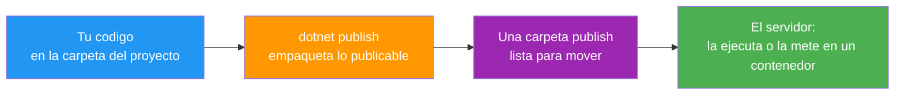
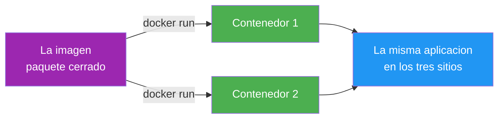
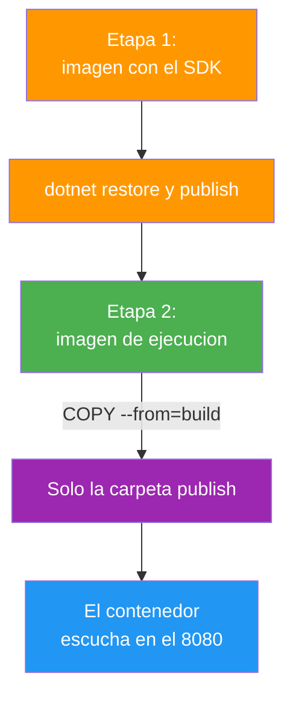
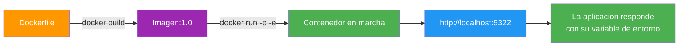
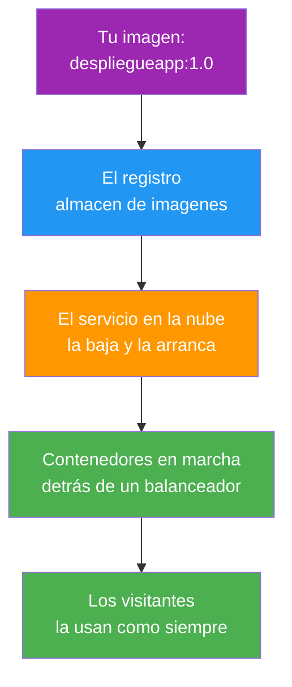
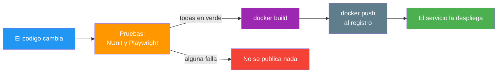

- [25. Despliegue con Docker y Nube](#25-despliegue-con-docker-y-nube)
  - [25.1. De la Máquina al Servidor](#251-de-la-máquina-al-servidor)
    - [25.1.1. Qué Significa Desplegar](#2511-qué-significa-desplegar)
    - [25.1.2. La Publicación con dotnet publish](#2512-la-publicación-con-dotnet-publish)
  - [25.2. Docker: El Contenedor de la Aplicación](#252-docker-el-contenedor-de-la-aplicación)
    - [25.2.1. Imagen y Contenedor](#2521-imagen-y-contenedor)
    - [25.2.2. El Dockerfile por Fases](#2522-el-dockerfile-por-fases)
    - [25.2.3. Construir y Ejecutar](#2523-construir-y-ejecutar)
    - [25.2.4. Visión Razor Pages: el Dockerfile de la Tienda](#2524-visión-razor-pages-el-dockerfile-de-la-tienda)
    - [25.2.5. Visión MVC: el Dockerfile de la Tienda](#2525-visión-mvc-el-dockerfile-de-la-tienda)
  - [25.3. Configurar el Contenedor](#253-configurar-el-contenedor)
    - [25.3.1. Variables de Entorno, Puertos y Secretos](#2531-variables-de-entorno-puertos-y-secretos)
    - [25.3.2. Datos Fuera del Contenedor](#2532-datos-fuera-del-contenedor)
  - [25.4. De la Imagen a la Nube](#254-de-la-imagen-a-la-nube)
    - [25.4.1. Registro, Servicio y Escala](#2541-registro-servicio-y-escala)
    - [25.4.2. El Flujo Automatizado de Publicación](#2542-el-flujo-automatizado-de-publicación)
  - [25.5. Reglas de Seguridad](#255-reglas-de-seguridad)
  - [25.6. Buenas Prácticas](#256-buenas-prácticas)
  - [25.7. Reto: El Despliegue de la Tienda de Funkos](#257-reto-el-despliegue-de-la-tienda-de-funkos)
    - [25.7.1. Contexto](#2571-contexto)
    - [25.7.2. Modelo de datos](#2572-modelo-de-datos)
    - [25.7.3. Almacenamiento](#2573-almacenamiento)
    - [25.7.4. Retos](#2574-retos)


# 25. Despliegue con Docker y Nube

> 💡 **Punto de partida:** usas Spotify en el móvil y, sin aviso, la app se actualiza sola y sigue sonando exactamente igual; nadie ha reinstalado nada a mano y el servicio no se ha cortado. Tu aplicación, en cambio, solo vive en tu máquina: funciona porque tú tienes .NET instalado y la carpeta en su sitio. ¿Cómo se empaqueta una aplicación para que corra igual en cualquier máquina, qué contiene ese paquete y cómo se publica sin instalar nada en el servidor?

En este punto aprenderás a llevar una aplicación desde tu carpeta hasta un servidor: qué entrega la publicación de .NET, qué es un contenedor, cómo se escribe un Dockerfile por fases, cómo se configura el contenedor con variables de entorno y por dónde sale la imagen hacia la nube. Todo practicado con la misma aplicación en las dos visiones.

**Objetivos de aprendizaje:**

- Saber qué significa desplegar y qué entrega `dotnet publish`
- Entender qué es una imagen y qué es un contenedor, y escribir un Dockerfile por fases
- Construir, configurar y ejecutar la aplicación en un contenedor con variables de entorno
- Conocer el camino de una imagen a la nube y el flujo automatizado de publicación
- Aplicar las reglas de seguridad del despliegue sin perder de vista las dos visiones

## 25.1. De la Máquina al Servidor

### 25.1.1. Qué Significa Desplegar

**Desplegar es poner la aplicación en marcha en otro sitio que no es tu máquina.** Mientras la ejecutas con `dotnet run` en tu portátil, la aplicación es tuya y depende de lo que tengas instalado — cuando la despliegas, tiene que valer por sí sola en un servidor que quizá no tiene nada tuyo. El viaje tiene tres paradas:



📌 **Ejemplo real:** Spotify. La app se actualiza sola y sigue sonando: nadie reinstala nada a mano, alguien publica una nueva versión y el servicio no se corta.

### 25.1.2. La Publicación con dotnet publish

**`dotnet publish` compila en modo de publicación y deja una carpeta con todo lo que la aplicación necesita para ejecutarse.** En el laboratorio, la publicación de nuestra aplicación deja una carpeta `publish` de **0,2 MB en 9 ficheros**, con el ensamblado, la configuración y los recursos de la vista.

Y un detalle que se entiende al primer golpe de vista: esa carpeta no se lleva el marco de .NET. La publicación es de aplicación; el marco vive en el servidor (o dentro de la imagen, como verás en el 25.2), y esa es la razón de que la carpeta pesa lo que pesa.

Lo publicado se ejecuta igual que en desarrollo, y responde con el entorno que el servidor declare por defecto:

```bash
# En la carpeta publish, con Production por defecto
dotnet DespliegueApp.dll --urls http://localhost:5321
```

La aplicación publicada responde con `entorno=Production`, el mensaje del fichero de producción (`MENSAJE-PROD`) y la versión del fichero base (`1.0.0`), que sigue mandando porque la variante de producción solo redefine el mensaje. Y si la publicación arranca con una variable de entorno (`App__Mensaje=MENSAJE-ENV`), el mensaje cambia sin recompilar, como ya aprendiste en el punto 20.

> 📝 **Nota:** publicar no es desplegar todavía: publicar deja la carpeta lista; desplegar es llevarla a su sitio y ponerla en marcha.

## 25.2. Docker: El Contenedor de la Aplicación

### 25.2.1. Imagen y Contenedor

**La imagen es el paquete cerrado con todo lo necesario para ejecutar la aplicación; el contenedor es esa imagen en marcha.** La imagen no cambia nunca una vez construida; los contenedores salen de ella cuantas veces haga falta, y todos se comportan igual.

| | Imagen | Contenedor |
|--|--------|------------|
| **Qué es** | El paquete: sistema base, marco y tu aplicación | La imagen arrancada y escuchando |
| **Cuántos** | Una por versión | Tantos como necesites a la vez |
| **Se puede cambiar** | No; si cambia algo, se construye otra | Se para y se vuelve a arrancar otra vez |
| **Dónde vive** | En el registro (almacén de imágenes) | En el servidor, en marcha |

📌 **Ejemplo real:** Docker. El contenedor nació en el ecosistema Docker y hoy es la forma estándar de empaquetar aplicaciones: la misma imagen corre en tu portátil, en el del centro y en un servidor de nube, y hace exactamente lo mismo en los tres.



### 25.2.2. El Dockerfile por Fases

**El Dockerfile es la receta de la imagen, y se escribe por fases: primero una máquina con el kit de desarrollo compila, y después una máquina mínima ejecuta.** El resultado es una imagen que trae la aplicación y nada más:

```dockerfile
# Etapa 1: compilar (tiene el kit completo)
FROM mcr.microsoft.com/dotnet/sdk:10.0 AS build
WORKDIR /src
COPY ["DespliegueApp.csproj", "./"]
RUN dotnet restore
COPY . .
RUN dotnet publish -c Release -o /app/publish

# Etapa 2: ejecutar (solo lo necesario para correr)
FROM mcr.microsoft.com/dotnet/aspnet:10.0 AS ejecucion
WORKDIR /app
COPY --from=build /app/publish .
ENV ASPNETCORE_URLS=http://+:8080
EXPOSE 8080
ENTRYPOINT ["dotnet", "DespliegueApp.dll"]
```



La separación en fases no es decorativa — la imagen de ejecución no lleva el compilador, ni el código fuente, ni las herramientas de desarrollo.

```dockerfile
# ❌ MALO: una sola etapa con el kit completo (imagen pesada y con herramientas de sobra)
FROM mcr.microsoft.com/dotnet/sdk:10.0
WORKDIR /app
COPY . .
RUN dotnet publish -c Release -o out
ENTRYPOINT ["dotnet", "out/DespliegueApp.dll"]

# ✅ BUENO: compilar en una imagen y copiar solo el resultado a la de ejecución
FROM mcr.microsoft.com/dotnet/sdk:10.0 AS build
# ... restore y publish
FROM mcr.microsoft.com/dotnet/aspnet:10.0 AS ejecucion
COPY --from=build /app/publish .
ENTRYPOINT ["dotnet", "DespliegueApp.dll"]
```

📌 **Ejemplo real:** Cualquier servicio de streaming se construye en dos fases como nuestro Dockerfile: primero una máquina con todas las herramientas compila, y después una máquina mínima ejecuta.

### 25.2.3. Construir y Ejecutar

**La imagen se construye con `docker build` y el contenedor se arranca con `docker run`; las dos órdenes son todo lo que hace falta en el día a día:**

```bash
# Construir la imagen con su etiqueta de versión
docker build -t despliegueapp:1.0 .

# Arrancar el contenedor: puerto del servidor:puerto de la imagen, y una variable de entorno
docker run -d --name despliegue -p 5322:8080 -e "App__Mensaje=MENSAJE-DOCKER" despliegueapp:1.0
```

Con Docker en marcha, el build termina, el contenedor escucha en el puerto publicado y la aplicación responde con `entorno=Production`, el mensaje `MENSAJE-DOCKER` que le llegó por variable de entorno y la versión `1.0.0` del fichero base; la imagen resultante pesa **230 MB**.



📌 **Ejemplo real:** Las tiendas online publican con órdenes como las tuyas: construir la imagen, comprobarla y arrancarla; la diferencia es quién las ejecuta y cuántas veces al día.

> 🔧 **Truco:** `docker ps` enseña los contenedores en marcha y `docker images` las imágenes construidas; las dos órdenes son el espejo del servidor en cualquier momento.

### 25.2.4. Visión Razor Pages: el Dockerfile de la Tienda

**En la visión de páginas, el Dockerfile es el mismo patrón con el nombre de tu proyecto y su ensamblado en la orden de arranque:**

```dockerfile
FROM mcr.microsoft.com/dotnet/sdk:10.0 AS build
WORKDIR /src
COPY ["FunkoApp.csproj", "./"]
RUN dotnet restore
COPY . .
RUN dotnet publish -c Release -o /app/publish

FROM mcr.microsoft.com/dotnet/aspnet:10.0 AS ejecucion
WORKDIR /app
COPY --from=build /app/publish .
ENV ASPNETCORE_URLS=http://+:8080
EXPOSE 8080
ENTRYPOINT ["dotnet", "FunkoApp.dll"]
```

### 25.2.5. Visión MVC: el Dockerfile de la Tienda

**En MVC cambian dos líneas, el `.csproj` de la primera etapa y el ensamblado de la orden de arranque; el resto del Dockerfile es idéntico:**

```dockerfile
COPY ["FunkoAppMvc.csproj", "./"]
# ...
ENTRYPOINT ["dotnet", "FunkoAppMvc.dll"]
```

> 📝 **Nota:** el Dockerfile vive en la raíz del proyecto y es parte del código: revisarlo es revisar cómo se empaqueta la aplicación.

## 25.3. Configurar el Contenedor

### 25.3.1. Variables de Entorno, Puertos y Secretos

**El contenedor se configura por fuera, con las variables de entorno que la aplicación ya sabe leer y con el puerto que se publica al mundo.** Lo dice la propia aplicación: el mensaje llega por `-e "App__Mensaje=MENSAJE-DOCKER"` y aparece en la vista sin recompilar la imagen.

```bash
# Una variable suelta
docker run -e "App__Mensaje=MENSAJE-DOCKER" despliegueapp:1.0

# O todas desde un fichero de variables, que se revisa y se versiona sin valores reales
docker run --env-file .env despliegueapp:1.0

# El puerto: -p puerto-de-servidor:puerto-de-la-imagen
docker run -p 5322:8080 despliegueapp:1.0
```

Los secretos van por el mismo conducto que las variables, pero nunca dentro de la imagen: el fichero `.env` se queda en el servidor, se recibe por el panel del servicio en la nube o llega desde el gestor de secretos del equipo. Si una clave entra en un `docker build`, queda escrita en la historia de la imagen para siempre.

📌 **Ejemplo real:** Azure App Service guarda las variables de entorno del servicio en su panel; el mismo contenedor muestra un valor u otro según dónde corra, sin volver a construir la imagen.

### 25.3.2. Datos Fuera del Contenedor

**Lo que el contenedor guarda dentro se pierde con él; los datos que deben durar salen con un volumen.** Subidas, bases de datos y ficheros de la aplicación se montan fuera del contenedor, y así un contenedor nuevo sigue donde se quedó el anterior:

```bash
# El host (carpeta del servidor) se monta dentro del contenedor
docker run -v /srv/datos/uploads:/app/uploads despliegueapp:1.0
```

La regla práctica es la del punto 17 con otro traje: dentro del contenedor vive el programa; fuera, viven los datos que no pueden morir con él.

## 25.4. De la Imagen a la Nube

### 25.4.1. Registro, Servicio y Escala

**La imagen viaja de un servidor a otro a través de un registro — y el servicio es quien la mantiene en marcha.** El camino completo, con sus cuatro paradas:



| Pieza | Qué hace | Ejemplos |
|-------|----------|----------|
| **Registro** | Guarda imágenes por versión | Docker Hub, el del centro, Azure Container Registry |
| **Servicio** | Mantiene contenedores en marcha | Azure App Service, contenedores en la nube |
| **Balanceador** | Reparte las peticiones entre copias | Del propio servicio |
| **Escala** | Añade o quita copias según la carga | Manual o automática |

📌 **Ejemplo real:** GitHub, Docker Hub o Azure Container Registry son los almacenes de imágenes: una vez guardada, la imagen sale hacia cualquier servidor sin reconstruirse.

### 25.4.2. El Flujo Automatizado de Publicación

**El flujo moderno de publicación encadena lo aprendido en los puntos anteriores: las pruebas del punto 24 aprueban, el Dockerfile construye y el registro recibe; nadie ejecuta órdenes a mano.**



📌 **Ejemplo real:** Netflix publica cientos de veces al día con un flujo automatizado: el código pasa sus pruebas y solo entonces se construye y se publica la imagen.

## 25.5. Reglas de Seguridad

- **Imagen mínima**: la etapa de ejecución, sin kit de desarrollo ni fuentes
- **Usuario no root**: el contenedor corre con un usuario de sistema, no con el administrador
- **Secretos fuera de la imagen**: ni en el Dockerfile, ni en las variables fijas dentro de la receta
- **`.dockerignore` siempre**: la carpeta de fuentes y los ficheros sensibles no entran en el contexto de construcción
- **HTTPS en el borde**: el contenedor escucha en interno y la terminación segura la pone el servicio o el balanceador
- **Etiquetas de versión**: `:1.0` y no `:latest`, para saber siempre qué corre en cada sitio
- **Sin herramientas de depuración en producción**: la imagen de ejecución no trae consola de desarrollo

## 25.6. Buenas Prácticas

- **Dockerfile por fases** en todos los proyectos, desde el primero
- **`.dockerignore` con `bin`, `obj` y fuentes** antes de la primera construcción
- **Configurar por fuera**: variables de entorno y ficheros `.env`, nunca dentro de la receta
- **Datos con volumen**: todo lo que no pueda morir con el contenedor, fuera
- **Una sola fuente de verdad del Dockerfile**: la raíz del proyecto, revisado en cada cambio
- **Comprobar con `curl` tras cada construcción**: la imagen nueva responde como la anterior
- **Publicar lo probado**: la imagen sale del flujo de pruebas, no de la carpeta de nadie
- **Versionar la imagen**: etiqueta con la versión de la aplicación, no solo con la fecha

## 25.7. Reto: El Despliegue de la Tienda de Funkos

> Empaqueta tu tienda para que viva en cualquier servidor: carpeta publicada, imagen por fases, variables de entorno y el camino hasta un registro, en las dos visiones.

### 25.7.1. Contexto

**Paso 0:** parte del reto del punto 24 en sus dos visiones (`FunkoApp` y `FunkoAppMvc`), con las pruebas de NUnit y Playwright en verde. Tu tienda ya se comprueba sola; ahora le falta poder vivir fuera de tu máquina.

### 25.7.2. Modelo de datos

| Propiedad | Tipo | Obligatorio |
|-----------|------|:-----------:|
| `id` | int | Sí (autogenerado) |
| `nombre` | string | Sí |
| `categoria` | string | Sí |
| `anio` | int | Sí |
| `precioReferencia` | decimal | Sí |
| `imagen` | string? | No |
| `etiquetas` | List\<string\>? | No |
| `activo` | bool | Sí |
| `esNovedad` | bool | Sí |

### 25.7.3. Almacenamiento

```csharp
public static class RepositorioFunkos
{
    private static readonly List<Funko> Funkos = [ /* seis figuras */ ];

    public static IReadOnlyList<Funko> ObtenerTodos() => Funkos;
}
```

Rellena la lista con seis figuras de modo que haya activas y dadas de baja, novedades y no novedades, y las tres categorías.

### 25.7.4. Retos

**Pasos compartidos (las dos visiones):**

1. **En papel primero:** dibuja el viaje de tu tienda desde tu carpeta hasta el servidor y anota qué necesita el servidor para que arranque (marco, configuración, puerto)
2. Ejecuta `dotnet publish -c Release -o publish` y comprueba la carpeta resultante; ejecútala y comprueba que responde igual que en desarrollo
3. Arranca lo publicado con una variable de entorno distinta y comprueba que el valor cambia sin recompilar
4. Escribe el Dockerfile por fases de tu tienda con su `.dockerignore`; comprueba que `docker build` termina y que la imagen aparece con `docker images`
5. Arranca el contenedor con `-p` y `-e`; comprueba con `curl` que responde en el puerto publicado y que muestra el valor de la variable
6. Comprueba qué cambios exigen reconstruir la imagen (código, `.csproj`, Dockerfile) y cuáles no (variables de entorno, configuración externa)
7. Revisa que la imagen de ejecución no contiene fuentes ni secretos; comprueba el tamaño de la imagen y anótalo

**Visión Razor Pages:**

8. El Dockerfile de tu `FunkoApp` con su `ENTRYPOINT` del proyecto de páginas; comprueba que el contenedor sirve la portada con la cesta en sesión

**Visión MVC:**

9. El mismo Dockerfile para `FunkoAppMvc` cambiando el `.csproj` y el ensamblado; comprueba que el contenedor sirve la portada con la misma configuración

**Puntos extra:**

- Añade un `HEALTHCHECK` al Dockerfile y comprueba con `docker ps` que el contenedor sale como sano
- Publica la imagen en un registro y comprueba que otra máquina la baja y la arranca sin tener el código fuente
- Escribe en el repositorio por qué el servidor no necesita tener .NET instalado si la imagen lo trae dentro

---

**Resumen del punto:**

| Concepto | Descripción |
|----------|-------------|
| **Desplegar** | Poner la aplicación en marcha en otro sitio que no es tu máquina |
| **`dotnet publish`** | Deja una carpeta lista; no se lleva el marco de .NET |
| **Imagen** | El paquete cerrado: sistema base, marco y aplicación |
| **Contenedor** | La imagen en marcha, escuchando en su puerto |
| **Dockerfile** | La receta de la imagen, por fases |
| **Fases** | Primero compila el kit completo; después ejecuta la imagen mínima |
| **`docker build` / `docker run`** | Construir la imagen y arrancar el contenedor |
| **Variables de entorno** | La configuración llega por fuera, con `-e` o `--env-file` |
| **Volumen** | Los datos que duran se montan fuera del contenedor |
| **Registro** | El almacén de imágenes por versión |
| **Comprobado** | `dotnet publish` deja 0,2 MB en 9 ficheros, la carpeta publicada responde en Production con `MENSAJE-PROD` y con `MENSAJE-ENV` cuando la variable de entorno lo cambia, el contenedor construido con el Dockerfile por fases responde en su puerto con `MENSAJE-DOCKER` y la imagen pesa 230 MB, todo con la misma aplicación |

**¿Qué viene después?**

En el siguiente punto toca el Resumen de la unidad: repasar en una sola página todo lo que has montado desde la primera vista hasta el contenedor.
