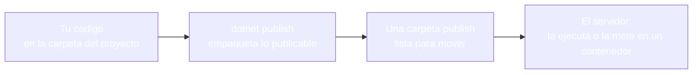
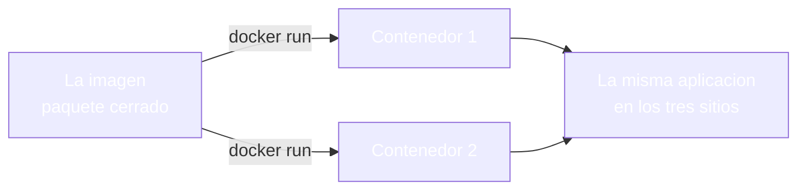
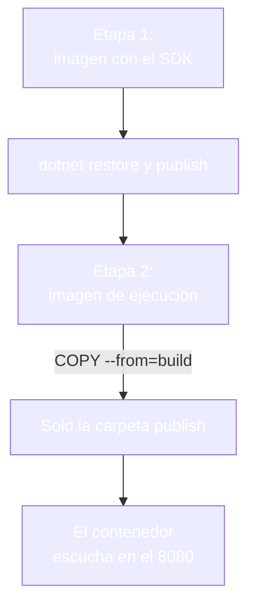
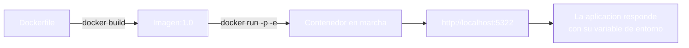
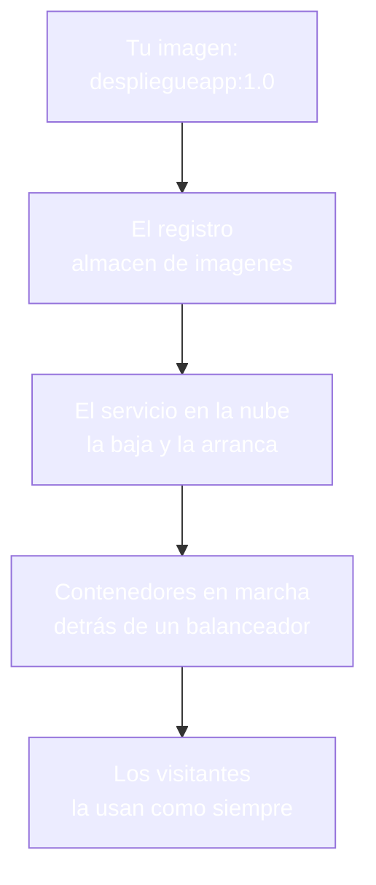
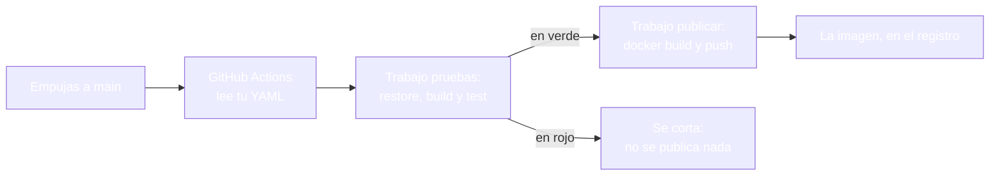

- [25. Despliegue con Docker y nube](#25-despliegue-con-docker-y-nube)
  - [25.1. De la máquina al servidor](#251-de-la-máquina-al-servidor)
    - [25.1.1. Qué significa desplegar](#2511-qué-significa-desplegar)
    - [25.1.2. La publicación con dotnet publish](#2512-la-publicación-con-dotnet-publish)
  - [25.2. Docker: el contenedor de la aplicación](#252-docker-el-contenedor-de-la-aplicación)
    - [25.2.1. Imagen y contenedor](#2521-imagen-y-contenedor)
    - [25.2.2. El Dockerfile por fases](#2522-el-dockerfile-por-fases)
    - [25.2.3. Construir y ejecutar](#2523-construir-y-ejecutar)
    - [25.2.4. Visión Razor Pages: el Dockerfile de la tienda](#2524-visión-razor-pages-el-dockerfile-de-la-tienda)
    - [25.2.5. Visión MVC: el Dockerfile de la tienda](#2525-visión-mvc-el-dockerfile-de-la-tienda)
  - [25.3. Configurar el contenedor](#253-configurar-el-contenedor)
    - [25.3.1. Variables de entorno, puertos y secretos](#2531-variables-de-entorno-puertos-y-secretos)
    - [25.3.2. Datos fuera del contenedor](#2532-datos-fuera-del-contenedor)
  - [25.4. De la imagen a la nube](#254-de-la-imagen-a-la-nube)
    - [25.4.1. Registro, servicio y escala](#2541-registro-servicio-y-escala)
    - [25.4.2. GitHub Actions: quién ejecuta las órdenes](#2542-github-actions-quién-ejecuta-las-órdenes)
    - [25.4.3. Despliegue en servicios concretos: Render y otros](#2543-despliegue-en-servicios-concretos-render-y-otros)
  - [25.5. Reglas de seguridad](#255-reglas-de-seguridad)
  - [25.6. Buenas prácticas](#256-buenas-prácticas)
  - [25.7. Reto: el despliegue de la tienda de Funkos](#257-reto-el-despliegue-de-la-tienda-de-funkos)
    - [25.7.1. Contexto](#2571-contexto)
    - [25.7.2. Modelo de datos](#2572-modelo-de-datos)
    - [25.7.3. Almacenamiento](#2573-almacenamiento)
    - [25.7.4. Retos](#2574-retos)


# 25. Despliegue con Docker y nube

> 💡 **Punto de partida:** usas Spotify en el móvil y, sin aviso, la app se actualiza sola y sigue sonando exactamente igual; nadie ha reinstalado nada a mano y el servicio no se ha cortado. Tu aplicación, en cambio, solo vive en tu máquina: funciona porque tú tienes .NET instalado y la carpeta en su sitio. ¿Cómo se empaqueta una aplicación para que corra igual en cualquier máquina, qué contiene ese paquete y cómo se publica sin instalar nada en el servidor?

En este punto aprenderás a llevar una aplicación desde tu carpeta hasta un servidor: qué entrega la publicación de .NET, qué es un contenedor, cómo se escribe un Dockerfile por fases, cómo se configura el contenedor con variables de entorno, quién ejecuta las órdenes por ti con GitHub Actions y en qué servicios concretos acaba la imagen, como Render. Todo practicado con la misma aplicación en las dos visiones.

**Objetivos de aprendizaje:**

- Saber qué significa desplegar y qué entrega `dotnet publish`
- Entender qué es una imagen y qué es un contenedor, y escribir un Dockerfile por fases
- Construir, configurar y ejecutar la aplicación en un contenedor con variables de entorno
- Escribir un flujo de GitHub Actions que pruebe antes de construir y publicar
- Desplegar en un servicio gestionado como Render, con sus variables en el panel
- Aplicar las reglas de seguridad del despliegue sin perder de vista las dos visiones

## 25.1. De la máquina al servidor

### 25.1.1. Qué significa desplegar

**Desplegar es poner la aplicación en marcha en otro sitio que no es tu máquina.** Mientras la ejecutas con `dotnet run` en tu portátil, la aplicación es tuya y depende de lo que tengas instalado — cuando la despliegas, tiene que valer por sí sola en un servidor que quizá no tiene nada tuyo. El viaje tiene tres paradas:



📌 **Ejemplo real:** Spotify. La app se actualiza sola y sigue sonando: nadie reinstala nada a mano, alguien publica una nueva versión y el servicio no se corta.

### 25.1.2. La publicación con dotnet publish

**`dotnet publish` compila en modo de publicación y deja una carpeta con todo lo que la aplicación necesita para ejecutarse.** En el laboratorio, la publicación de nuestra aplicación deja una carpeta `publish` de **0,2 MB en 9 ficheros**, con el ensamblado, la configuración y los recursos de la vista.

Y un detalle que se entiende al primer golpe de vista: esa carpeta no se lleva el marco de .NET. La publicación es de aplicación; el marco vive en el servidor (o dentro de la imagen, como verás en el 25.2), y esa es la razón de que la carpeta pesa lo que pesa.

Lo publicado se ejecuta igual que en desarrollo, y responde con el entorno que el servidor declare por defecto:

```bash
# En la carpeta publish, con Production por defecto
dotnet DespliegueApp.dll --urls http://localhost:5321
```

La aplicación publicada responde con `entorno=Production`, el mensaje del fichero de producción (`MENSAJE-PROD`) y la versión del fichero base (`1.0.0`), que sigue mandando porque la variante de producción solo redefine el mensaje. Y si la publicación arranca con una variable de entorno (`App__Mensaje=MENSAJE-ENV`), el mensaje cambia sin recompilar, como ya aprendiste en el punto 20.

> 📝 **Nota:** publicar no es desplegar todavía: publicar deja la carpeta lista; desplegar es llevarla a su sitio y ponerla en marcha.

## 25.2. Docker: el contenedor de la aplicación

### 25.2.1. Imagen y contenedor

**La imagen es el paquete cerrado con todo lo necesario para ejecutar la aplicación; el contenedor es esa imagen en marcha.** La imagen no cambia nunca una vez construida; los contenedores salen de ella cuantas veces haga falta, y todos se comportan igual.

| | Imagen | Contenedor |
|--|--------|------------|
| **Qué es** | El paquete: sistema base, marco y tu aplicación | La imagen arrancada y escuchando |
| **Cuántos** | Una por versión | Tantos como necesites a la vez |
| **Se puede cambiar** | No; si cambia algo, se construye otra | Se para y se vuelve a arrancar otra vez |
| **Dónde vive** | En el registro (almacén de imágenes) | En el servidor, en marcha |

📌 **Ejemplo real:** Docker. El contenedor nació en el ecosistema Docker y hoy es la forma estándar de empaquetar aplicaciones: la misma imagen corre en tu portátil, en el del centro y en un servidor de nube, y hace exactamente lo mismo en los tres.



### 25.2.2. El Dockerfile por fases

**El Dockerfile es la receta de la imagen, y se escribe por fases: primero una máquina con el kit de desarrollo compila, y después una máquina mínima ejecuta.** El resultado es una imagen que trae la aplicación y nada más:

```dockerfile
# Etapa 1: compilar (tiene el kit completo)
FROM mcr.microsoft.com/dotnet/sdk:10.0 AS build
WORKDIR /src
COPY ["DespliegueApp.csproj", "./"]
RUN dotnet restore
COPY . .
RUN dotnet publish -c Release -o /app/publish

# Etapa 2: ejecutar (solo lo necesario para correr)
FROM mcr.microsoft.com/dotnet/aspnet:10.0 AS ejecucion
WORKDIR /app
COPY --from=build /app/publish .
ENV ASPNETCORE_URLS=http://+:8080
EXPOSE 8080
ENTRYPOINT ["dotnet", "DespliegueApp.dll"]
```



La separación en fases no es decorativa — la imagen de ejecución no lleva el compilador, ni el código fuente, ni las herramientas de desarrollo.

```dockerfile
# ❌ MALO: una sola etapa con el kit completo (imagen pesada y con herramientas de sobra)
FROM mcr.microsoft.com/dotnet/sdk:10.0
WORKDIR /app
COPY . .
RUN dotnet publish -c Release -o out
ENTRYPOINT ["dotnet", "out/DespliegueApp.dll"]

# ✅ BUENO: compilar en una imagen y copiar solo el resultado a la de ejecución
FROM mcr.microsoft.com/dotnet/sdk:10.0 AS build
# ... restore y publish
FROM mcr.microsoft.com/dotnet/aspnet:10.0 AS ejecucion
COPY --from=build /app/publish .
ENTRYPOINT ["dotnet", "DespliegueApp.dll"]
```

📌 **Ejemplo real:** Cualquier servicio de streaming se construye en dos fases como nuestro Dockerfile: primero una máquina con todas las herramientas compila, y después una máquina mínima ejecuta.

### 25.2.3. Construir y ejecutar

**La imagen se construye con `docker build` y el contenedor se arranca con `docker run`; las dos órdenes son todo lo que hace falta en el día a día:**

```bash
# Construir la imagen con su etiqueta de versión
docker build -t despliegueapp:1.0 .

# Arrancar el contenedor: puerto del servidor:puerto de la imagen, y una variable de entorno
docker run -d --name despliegue -p 5322:8080 -e "App__Mensaje=MENSAJE-DOCKER" despliegueapp:1.0
```

Con Docker en marcha, el build termina, el contenedor escucha en el puerto publicado y la aplicación responde con `entorno=Production`, el mensaje `MENSAJE-DOCKER` que le llegó por variable de entorno y la versión `1.0.0` del fichero base; la imagen resultante pesa **230 MB**.



📌 **Ejemplo real:** Las tiendas online publican con órdenes como las tuyas: construir la imagen, comprobarla y arrancarla; la diferencia es quién las ejecuta y cuántas veces al día.

> 🔧 **Truco:** `docker ps` enseña los contenedores en marcha y `docker images` las imágenes construidas; las dos órdenes son el espejo del servidor en cualquier momento.

### 25.2.4. Visión Razor Pages: el Dockerfile de la tienda

**En la visión de páginas, el Dockerfile es el mismo patrón con el nombre de tu proyecto y su ensamblado en la orden de arranque:**

```dockerfile
FROM mcr.microsoft.com/dotnet/sdk:10.0 AS build
WORKDIR /src
COPY ["FunkoApp.csproj", "./"]
RUN dotnet restore
COPY . .
RUN dotnet publish -c Release -o /app/publish

FROM mcr.microsoft.com/dotnet/aspnet:10.0 AS ejecucion
WORKDIR /app
COPY --from=build /app/publish .
ENV ASPNETCORE_URLS=http://+:8080
EXPOSE 8080
ENTRYPOINT ["dotnet", "FunkoApp.dll"]
```

### 25.2.5. Visión MVC: el Dockerfile de la tienda

**En MVC cambian dos líneas, el `.csproj` de la primera etapa y el ensamblado de la orden de arranque; el resto del Dockerfile es idéntico:**

```dockerfile
COPY ["FunkoAppMvc.csproj", "./"]
# ...
ENTRYPOINT ["dotnet", "FunkoAppMvc.dll"]
```

> 📝 **Nota:** el Dockerfile vive en la raíz del proyecto y es parte del código: revisarlo es revisar cómo se empaqueta la aplicación.

## 25.3. Configurar el contenedor

### 25.3.1. Variables de entorno, puertos y secretos

**El contenedor se configura por fuera, con las variables de entorno que la aplicación ya sabe leer y con el puerto que se publica al mundo.** Lo dice la propia aplicación: el mensaje llega por `-e "App__Mensaje=MENSAJE-DOCKER"` y aparece en la vista sin recompilar la imagen.

```bash
# Una variable suelta
docker run -e "App__Mensaje=MENSAJE-DOCKER" despliegueapp:1.0

# O todas desde un fichero de variables, que se revisa y se versiona sin valores reales
docker run --env-file .env despliegueapp:1.0

# El puerto: -p puerto-de-servidor:puerto-de-la-imagen
docker run -p 5322:8080 despliegueapp:1.0
```

Los secretos van por el mismo conducto que las variables, pero nunca dentro de la imagen: el fichero `.env` se queda en el servidor, se recibe por el panel del servicio en la nube o llega desde el gestor de secretos del equipo. Si una clave entra en un `docker build`, queda escrita en la historia de la imagen para siempre.

📌 **Ejemplo real:** Azure App Service guarda las variables de entorno del servicio en su panel; el mismo contenedor muestra un valor u otro según dónde corra, sin volver a construir la imagen.

### 25.3.2. Datos fuera del contenedor

**Lo que el contenedor guarda dentro se pierde con él; los datos que deben durar salen con un volumen.** Subidas, bases de datos y ficheros de la aplicación se montan fuera del contenedor, y así un contenedor nuevo sigue donde se quedó el anterior:

```bash
# El host (carpeta del servidor) se monta dentro del contenedor
docker run -v /srv/datos/uploads:/app/uploads despliegueapp:1.0
```

La regla práctica es la del punto 17 con otro traje: dentro del contenedor vive el programa; fuera, viven los datos que no pueden morir con él.

## 25.4. De la imagen a la nube

### 25.4.1. Registro, servicio y escala

**La imagen viaja de un servidor a otro a través de un registro — y el servicio es quien la mantiene en marcha.** El camino completo, con sus cuatro paradas:



| Pieza | Qué hace | Ejemplos |
|-------|----------|----------|
| **Registro** | Guarda imágenes por versión | Docker Hub, el del centro, Azure Container Registry |
| **Servicio** | Mantiene contenedores en marcha | Azure App Service, contenedores en la nube |
| **Balanceador** | Reparte las peticiones entre copias | Del propio servicio |
| **Escala** | Añade o quita copias según la carga | Manual o automática |

📌 **Ejemplo real:** GitHub, Docker Hub o Azure Container Registry son los almacenes de imágenes: una vez guardada, la imagen sale hacia cualquier servidor sin reconstruirse.

### 25.4.2. GitHub Actions: quién ejecuta las órdenes

**GitHub Actions es el servicio de automatización de GitHub: los flujos se guardan como ficheros YAML dentro del repositorio y se ejecutan en servidores limpios cada vez que pasa algo, como un empujón a la rama principal.** El flujo de un proyecto real encadena lo que ya sabes hacer a mano: compilar, probar, construir la imagen y publicarla.

```yaml
# .github/workflows/despliegue.yml
name: Despliegue

on:
  push:
    branches: [main]

env:
  DOTNET_VERSION: '10.0.x'
  IMAGEN: despliegueapp:1.0

jobs:
  pruebas:
    runs-on: ubuntu-latest
    steps:
      - uses: actions/checkout@v4
      - uses: actions/setup-dotnet@v4
        with:
          dotnet-version: ${{ env.DOTNET_VERSION }}
      - run: dotnet restore
      - run: dotnet build --no-restore --configuration Release
      - run: dotnet test --configuration Release --no-build

  publicar:
    needs: pruebas
    runs-on: ubuntu-latest
    steps:
      - uses: actions/checkout@v4
      - uses: actions/setup-dotnet@v4
        with:
          dotnet-version: ${{ env.DOTNET_VERSION }}
      - uses: docker/login-action@v3
        with:
          username: ${{ secrets.DOCKERHUB_USER }}
          password: ${{ secrets.DOCKERHUB_PASS }}
      - run: docker build -t ${{ env.IMAGEN }} .
      - run: docker push ${{ env.IMAGEN }}
```

Cada pieza del fichero tiene su porqué:

- **`on: push: branches: [main]`**: el flujo se dispara solo al llegar código a la rama principal
- **Dos trabajos con `needs`**: el segundo no empieza si el primero falla; las pruebas mandan
- **Acciones de GitHub**: `checkout` baja el código, `setup-dotnet` monta el marco y `docker/login-action` entra en el registro con credenciales
- **`secrets`**: el usuario y la clave del registro viven en los secretos del repositorio, nunca en el fichero YAML



Las órdenes del flujo son exactamente las que has ejecutado a mano en este punto: `dotnet publish`, `docker build` y `docker push`. La única diferencia es el sitio donde se ejecutan: servidores limpios de GitHub que solo tienen lo que el propio flujo instala.

> ⚠️ **Advertencia:** las pruebas de navegador con Playwright dentro de un flujo exigen instalar los navegadores con el script que genera el propio proyecto (`playwright.ps1 install chromium`); instalarlos por otra vía trae una versión que no cuadra con los paquetes y las pruebas fallan sin motivo aparente.

📌 **Ejemplo real:** Netflix publica cientos de veces al día con un flujo automatizado: el código pasa sus pruebas y solo entonces se construye y se publica la imagen.

### 25.4.3. Despliegue en servicios concretos: Render y otros

**Las plataformas de servicio gestionado hacen el último tramo: conectas tu repositorio, el servicio construye con tu Dockerfile y te devuelve una aplicación en internet con su dominio y su panel de variables.** El despliegue deja de ser una orden que tú ejecutas y pasa a ser algo que el servicio hace por ti.

| Servicio | Desde dónde despliega | Variables de entorno | Dominio de prueba |
|----------|----------------------|---------------------|-------------------|
| **Render** | Repositorio de GitHub; usa tu `Dockerfile` si existe | Panel del servicio | `*.onrender.com` |
| **Railway** | Repositorio o imagen; detecta .NET o Docker | Panel del proyecto | Dominio asignado o propio |
| **Azure App Service** | Repositorio o contenedor | Ajustes de la aplicación | `*.azurewebsites.net` |
| **Fly.io** | Imagen con su fichero `fly.toml` | Fichero y panel | Dominio del servicio |

El camino en Render, que es el que se sigue en clase, tiene cinco pasos:

1. **El código está en GitHub**, con su Dockerfile en la raíz
2. **Creas un servicio web** y le apuntas tu repositorio
3. **El servicio detecta el Dockerfile** y construye la imagen en su servidor
4. **Las variables de entorno se pegan en el panel**, igual que las de tu `--env-file`
5. **El servicio responde en su dominio** y cada empujón a `main` vuelve a desplegar

> 💡 **Consejo:** los secretos van en el panel del servicio o en los secretos del flujo, nunca en el repositorio; la misma regla del punto 20, con otro sitio donde escribirlos.

📌 **Ejemplo real:** Cualquier proyecto pequeño que quiera estar en internet hoy se publica en un servicio como Render: se conecta el repositorio y la aplicación está en un dominio con HTTPS sin tocar un servidor.

## 25.5. Reglas de seguridad

- **Imagen mínima**: la etapa de ejecución, sin kit de desarrollo ni fuentes
- **Usuario no root**: el contenedor corre con un usuario de sistema, no con el administrador
- **Secretos fuera de la imagen**: ni en el Dockerfile, ni en las variables fijas dentro de la receta
- **`.dockerignore` siempre**: la carpeta de fuentes y los ficheros sensibles no entran en el contexto de construcción
- **HTTPS en el borde**: el contenedor escucha en interno y la terminación segura la pone el servicio o el balanceador
- **Etiquetas de versión**: `:1.0` y no `:latest`, para saber siempre qué corre en cada sitio
- **Sin herramientas de depuración en producción**: la imagen de ejecución no trae consola de desarrollo
- **Credenciales del flujo en el gestor de GitHub**: el YAML solo nombra los secretos, nunca los contiene
- **El registro con acceso mínimo**: la cuenta del flujo solo puede escribir en la imagen que toca

## 25.6. Buenas prácticas

- **Dockerfile por fases** en todos los proyectos, desde el primero
- **`.dockerignore` con `bin`, `obj` y fuentes** antes de la primera construcción
- **Configurar por fuera**: variables de entorno y ficheros `.env`, nunca dentro de la receta
- **Datos con volumen**: todo lo que no pueda morir con el contenedor, fuera
- **Una sola fuente de verdad del Dockerfile**: la raíz del proyecto, revisado en cada cambio
- **Comprobar con `curl` tras cada construcción**: la imagen nueva responde como la anterior
- **Publicar lo probado**: la imagen sale del flujo de pruebas, no de la carpeta de nadie
- **Versionar la imagen**: etiqueta con la versión de la aplicación, no solo con la fecha
- **Flujo versionado**: el YAML vive en `.github/workflows` y se revisa como el resto del código
- **Un flujo que no publica sin pruebas verdes**, con los trabajos encadenados por `needs`
- **Las mismas órdenes a mano y en el flujo**: lo que pruebas en local es lo que publica GitHub

## 25.7. Reto: el despliegue de la tienda de Funkos

> Empaqueta tu tienda para que viva en cualquier servidor: carpeta publicada, imagen por fases, variables de entorno y el camino hasta un registro, en las dos visiones.

### 25.7.1. Contexto

**Paso 0:** parte del reto del punto 24 en sus dos visiones (`FunkoApp` y `FunkoAppMvc`), con las pruebas de NUnit y Playwright en verde. Tu tienda ya se comprueba sola; ahora le falta poder vivir fuera de tu máquina.

### 25.7.2. Modelo de datos

| Propiedad | Tipo | Obligatorio |
|-----------|------|:-----------:|
| `id` | int | Sí (autogenerado) |
| `nombre` | string | Sí |
| `categoria` | string | Sí |
| `anio` | int | Sí |
| `precioReferencia` | decimal | Sí |
| `imagen` | string? | No |
| `etiquetas` | List\<string\>? | No |
| `activo` | bool | Sí |
| `esNovedad` | bool | Sí |

### 25.7.3. Almacenamiento

```csharp
public static class RepositorioFunkos
{
    private static readonly List<Funko> Funkos = [ /* seis figuras */ ];

    public static IReadOnlyList<Funko> ObtenerTodos() => Funkos;
}
```

Rellena la lista con seis figuras de modo que haya activas y dadas de baja, novedades y no novedades, y las tres categorías.

### 25.7.4. Retos

**Pasos compartidos (las dos visiones):**

1. **En papel primero:** dibuja el viaje de tu tienda desde tu carpeta hasta el servidor y anota qué necesita el servidor para que arranque (marco, configuración, puerto)
2. Ejecuta `dotnet publish -c Release -o publish` y comprueba la carpeta resultante; ejecútala y comprueba que responde igual que en desarrollo
3. Arranca lo publicado con una variable de entorno distinta y comprueba que el valor cambia sin recompilar
4. Escribe el Dockerfile por fases de tu tienda con su `.dockerignore`; comprueba que `docker build` termina y que la imagen aparece con `docker images`
5. Arranca el contenedor con `-p` y `-e`; comprueba con `curl` que responde en el puerto publicado y que muestra el valor de la variable
6. Comprueba qué cambios exigen reconstruir la imagen (código, `.csproj`, Dockerfile) y cuáles no (variables de entorno, configuración externa)
7. Revisa que la imagen de ejecución no contiene fuentes ni secretos; comprueba el tamaño de la imagen y anótalo
8. Crea `.github/workflows/despliegue.yml` con dos trabajos encadenados por `needs`, pruebas y publicación; comprueba que las órdenes del YAML son las mismas que has ejecutado a mano
9. Conecta tu repositorio a un servicio como Render; comprueba que el servicio construye con tu Dockerfile, que las variables del panel sustituyen a las tuyas y que la aplicación responde en su dominio

**Visión Razor Pages:**

10. El Dockerfile de tu `FunkoApp` con su `ENTRYPOINT` del proyecto de páginas; comprueba que el contenedor sirve la portada con la cesta en sesión

**Visión MVC:**

11. El mismo Dockerfile para `FunkoAppMvc` cambiando el `.csproj` y el ensamblado; comprueba que el contenedor sirve la portada con la misma configuración

**Puntos extra:**

- Añade un `HEALTHCHECK` al Dockerfile y comprueba con `docker ps` que el contenedor sale como sano
- Publica la imagen en un registro y comprueba que otra máquina la baja y la arranca sin tener el código fuente
- Guarda las credenciales del registro en los secretos de GitHub y comprueba que el flujo publica sin que aparezcan en el YAML
- Escribe en el repositorio por qué el servidor no necesita tener .NET instalado si la imagen lo trae dentro

---

**Resumen del punto:**

| Concepto | Descripción |
|----------|-------------|
| **Desplegar** | Poner la aplicación en marcha en otro sitio que no es tu máquina |
| **`dotnet publish`** | Deja una carpeta lista; no se lleva el marco de .NET |
| **Imagen** | El paquete cerrado: sistema base, marco y aplicación |
| **Contenedor** | La imagen en marcha, escuchando en su puerto |
| **Dockerfile** | La receta de la imagen, por fases |
| **Fases** | Primero compila el kit completo; después ejecuta la imagen mínima |
| **`docker build` / `docker run`** | Construir la imagen y arrancar el contenedor |
| **Variables de entorno** | La configuración llega por fuera, con `-e` o `--env-file` |
| **Volumen** | Los datos que duran se montan fuera del contenedor |
| **Registro** | El almacén de imágenes por versión |
| **GitHub Actions** | Flujos YAML en el repositorio que compilan, prueban y publican solos |
| **Secretos del flujo** | Credenciales guardadas en GitHub, nombradas en el YAML |
| **Servicio gestionado** | Plataforma como Render: conectas el repositorio y despliega por ti |
| **Comprobado** | `dotnet publish` deja 0,2 MB en 9 ficheros, la carpeta publicada responde en Production con `MENSAJE-PROD` y con `MENSAJE-ENV` cuando la variable de entorno lo cambia, el contenedor construido con el Dockerfile por fases responde en su puerto con `MENSAJE-DOCKER` y la imagen pesa 230 MB, el flujo de GitHub Actions encadena las mismas órdenes medidas con las pruebas antes de publicar, y las plataformas como Render construyen con el mismo Dockerfile y reciben las variables por su panel |

**¿Qué viene después?**

En el siguiente punto toca el Resumen de la unidad: repasar en una sola página todo lo que has montado desde la primera vista hasta el contenedor.
