- [26. Resumen y Conclusiones](#26-resumen-y-conclusiones)
  - [26.1. Mapa Conceptual de la Unidad](#261-mapa-conceptual-de-la-unidad)
  - [26.2. Conceptos Clave](#262-conceptos-clave)
    - [Parte 1: Vistas y Razor](#parte-1-vistas-y-razor)
      - [Punto 00: Comandos de la CLI de .NET](#punto-00-comandos-de-la-cli-de-net)
      - [Punto 01: Fundamentos de Razor](#punto-01-fundamentos-de-razor)
      - [Punto 02: Directivas y Sintaxis](#punto-02-directivas-y-sintaxis)
      - [Punto 03: Estructuras de Control](#punto-03-estructuras-de-control)
      - [Punto 04: Funciones y Métodos en la Vista](#punto-04-funciones-y-métodos-en-la-vista)
      - [Punto 05: Layouts, Parciales y Componentes](#punto-05-layouts-parciales-y-componentes)
      - [Punto 06: Tag Helpers](#punto-06-tag-helpers)
    - [Parte 2: MVC y Razor Pages](#parte-2-mvc-y-razor-pages)
      - [Punto 07: Arquitectura MVC](#punto-07-arquitectura-mvc)
      - [Punto 08: Controladores y Acciones](#punto-08-controladores-y-acciones)
      - [Punto 09: ViewModels](#punto-09-viewmodels)
      - [Punto 10: Razor Pages: Fundamentos](#punto-10-razor-pages-fundamentos)
      - [Punto 11: PageModel y Handlers](#punto-11-pagemodel-y-handlers)
      - [Punto 12: MVC frente a Razor Pages](#punto-12-mvc-frente-a-razor-pages)
    - [Parte 3: Formularios, Datos y Estado](#parte-3-formularios-datos-y-estado)
      - [Punto 13: Formularios Web](#punto-13-formularios-web)
      - [Punto 14: Model Binding](#punto-14-model-binding)
      - [Punto 15: Validaciones y Seguridad](#punto-15-validaciones-y-seguridad)
      - [Punto 16: Ficheros y Almacenamiento](#punto-16-ficheros-y-almacenamiento)
      - [Punto 17: Gestión del Estado](#punto-17-gestión-del-estado)
    - [Parte 4: Aplicación Completa: Usuario, Calidad y Despliegue](#parte-4-aplicación-completa-usuario-calidad-y-despliegue)
      - [Punto 18: Cookies y Sesiones](#punto-18-cookies-y-sesiones)
      - [Punto 19: Autenticación con Identity](#punto-19-autenticación-con-identity)
      - [Punto 20: Configuración y Entornos](#punto-20-configuración-y-entornos)
      - [Punto 21: Optimización y Rendimiento](#punto-21-optimización-y-rendimiento)
      - [Punto 22: Internacionalización y Localización](#punto-22-internacionalización-y-localización)
      - [Punto 23: Herramientas, Prueba y Depuración](#punto-23-herramientas-prueba-y-depuración)
      - [Punto 24: Pruebas y Documentación](#punto-24-pruebas-y-documentación)
      - [Punto 25: Despliegue con Docker](#punto-25-despliegue-con-docker)
  - [26.3. Herramientas y Perfiles](#263-herramientas-y-perfiles)
    - [SDK y CLI](#sdk-y-cli)
    - [NuGet (paquetes habituales)](#nuget-paquetes-habituales)
    - [IDE](#ide)
  - [26.4. Errores Comunes a Evitar](#264-errores-comunes-a-evitar)
  - [26.5. Checklist de Supervivencia](#265-checklist-de-supervivencia)
    - [Parte 1: Vistas y Razor](#parte-1-vistas-y-razor-1)
    - [Parte 2: MVC y Razor Pages](#parte-2-mvc-y-razor-pages-1)
    - [Parte 3: Formularios, Datos y Estado](#parte-3-formularios-datos-y-estado-1)
    - [Parte 4: Aplicación Completa](#parte-4-aplicación-completa)
  - [26.6. Glosario de Términos](#266-glosario-de-términos)
  - [26.7. Ejercicios de Repaso](#267-ejercicios-de-repaso)
  - [26.8. ¿Qué viene después?](#268-qué-viene-después)
  - [26.9. Mapa de Conexiones entre Temas](#269-mapa-de-conexiones-entre-temas)

# 26. Resumen y Conclusiones

> 💡 **Punto de partida:** Has recorrido la unidad entera, desde la primera vista dinámica hasta el contenedor publicado en la nube. Este resumen consolida todo en una sola mirada.

Aquí repasas en una página los 26 puntos de la unidad: qué es cada cosa, con qué herramienta se hace y dónde se equivoca la gente — úsalo como referencia rápida antes del examen y como índice para volver al punto que te falte.

**Objetivos de aprendizaje:**

- Repasar los conceptos fundamentales de la unidad
- Consolidar el vocabulario técnico
- Tener una referencia rápida para el examen

## 26.1. Mapa Conceptual de la Unidad

```mermaid
graph TD
    UD03[UD03: Desarrollo de Paginas Web Dinamicas en .NET] --> P1[Parte 1: Vistas y Razor]
    UD03 --> P2[Parte 2: MVC y Razor Pages]
    UD03 --> P3[Parte 3: Formularios, Datos y Estado]
    UD03 --> P4[Parte 4: Aplicacion Completa]

    P1 --> C0[00: CLI de .NET]
    P1 --> C1[01: Fundamentos Razor]
    P1 --> C2[02: Directivas]
    P1 --> C3[03: Estructuras de Control]
    P1 --> C4[04: Funciones en la Vista]
    P1 --> C5[05: Layouts y Parciales]
    P1 --> C6[06: Tag Helpers]

    P2 --> C7[07: Arquitectura MVC]
    P2 --> C8[08: Controladores]
    P2 --> C9[09: ViewModels]
    P2 --> C10[10: Razor Pages]
    P2 --> C11[11: PageModel y Handlers]
    P2 --> C12[12: MVC frente a Pages]

    P3 --> C13[13: Formularios]
    P3 --> C14[14: Model Binding]
    P3 --> C15[15: Validacion y Seguridad]
    P3 --> C16[16: Ficheros]
    P3 --> C17[17: Estado]

    P4 --> C18[18: Cookies y Sesion]
    P4 --> C19[19: Identity]
    P4 --> C20[20: Configuracion]
    P4 --> C21[21: Rendimiento]
    P4 --> C22[22: Localizacion]
    P4 --> C23[23: Herramientas]
    P4 --> C24[24: Pruebas]
    P4 --> C25[25: Despliegue]

    C1 --> K1[Motor de plantillas<br/>el servidor pinta]
    C6 --> K2[Etiquetas asp-*]
    C7 --> K3[Model-View-Controller]
    C11 --> K4[OnGet y OnPost]
    C14 --> K5[Ruta, query y formulario]
    C18 --> K6[Cookie y sesion del servidor]
    C19 --> K7[Claims y UserManager]
    C20 --> K8[IOptions y entornos]
    C21 --> K9[Caché y compresion]
    C22 --> K10[resx y culturas]
    C24 --> K11[NUnit y Playwright]
    C25 --> K12[Dockerfile y contenedor]

    style UD03 fill:#2196F3,color:#fff
    style P1 fill:#4CAF50,color:#fff
    style P2 fill:#FF9800,color:#fff
    style P3 fill:#9C27B0,color:#fff
    style P4 fill:#607D8B,color:#fff
    style K1 fill:#2196F3,color:#fff
    style K2 fill:#2196F3,color:#fff
    style K3 fill:#2196F3,color:#fff
    style K4 fill:#2196F3,color:#fff
    style K5 fill:#2196F3,color:#fff
    style K6 fill:#2196F3,color:#fff
    style K7 fill:#2196F3,color:#fff
    style K8 fill:#2196F3,color:#fff
    style K9 fill:#2196F3,color:#fff
    style K10 fill:#2196F3,color:#fff
    style K11 fill:#2196F3,color:#fff
    style K12 fill:#2196F3,color:#fff
```

## 26.2. Conceptos Clave

### Parte 1: Vistas y Razor

#### Punto 00: Comandos de la CLI de .NET
- **`dotnet new/build/run/watch/clean/restore`:** el ciclo diario de cualquier proyecto; `watch` reconstruye al guardar
- **Solución `.slnx`:** en .NET 10 el formato por defecto es XML; agrupa proyectos con `dotnet sln add`
- **`dotnet user-secrets`:** guarda secretos fuera del repositorio, solo en desarrollo
- **Estructura de carpetas:** `Pages`, `Controllers`, `Models`, `Services`, `Infrastructure`, `wwwroot`
- 📌 **Ejemplo real:** Cualquier equipo ejecuta las mismas órdenes que tú desde la terminal o desde el IDE; la CLI es el denominador común de todos los proyectos .NET.

#### Punto 01: Fundamentos de Razor
- **Razor:** motor de plantillas del servidor; escribes HTML con trozos de C# entre `@`
- **Seguridad por defecto:** Razor escapa el HTML; `@Html.Raw` es la puerta que hay que abrir a propósito
- **Primera vista:** una página se pinta en el servidor y viaja al navegador ya terminada
- 📌 **Ejemplo real:** Netflix pinta sus páginas en el servidor con plantillas parecidas; el HTML que llega a tu navegador ya viene montado.

#### Punto 02: Directivas y Sintaxis
- **Directivas:** `@page`, `@model`, `@using`, `@inject`, `@functions`; dan órdenes al motor
- **`@page` es la firma de una página:** la convierte en una ruta accesible
- **Ámbito de variables:** lo declarado en una vista se queda en esa vista; para cruzar datos, el modelo
- 📌 **Ejemplo real:** Cualquier CMS multiidioma se apoya en directivas de plantilla: la misma estructura con contenido distinto según la sección.

#### Punto 03: Estructuras de Control
- **`@if`, `@switch`, `@foreach`, `@for`, `@while`:** la misma lógica de C# dentro del HTML
- **Repositorio en memoria:** los primeros listados salen de una lista estática, sin base de datos
- **Arrays y matrices:** estructuras para colecciones que la vista recorre
- 📌 **Ejemplo real:** El muro de Instagram enseña distinto según quién lo pinte: la plantilla decide con una estructura de control qué bloques salen.

#### Punto 04: Funciones y Métodos en la Vista
- **`@functions`:** declara métodos dentro de la propia vista para no repetir HTML
- **Funciones locales y lambdas:** pequeñas piezas de lógica al alcance de la plantilla
- **Valor o HTML:** una función devuelve datos o devuelve marcado, y la vista decide cómo pintarlo
- 📌 **Ejemplo real:** Cualquier lista con precios calculados repite la misma operación en cada fila; en una vista se resuelve con una función local.

#### Punto 05: Layouts, Parciales y Componentes
- **`_ViewStart`, `_Layout`, `_ViewImports`:** la estructura compartida de todas las vistas
- **Vistas parciales:** trozos de HTML reutilizables con `<partial>`
- **Componentes de vista:** piezas con lógica propia, con `<vc:nombre-componente>`
- 📌 **Ejemplo real:** Gmail compone su interfaz con piezas reutilizables: el listado, el panel y la barra se pintan por separado y conviven en la misma vista.

#### Punto 06: Tag Helpers
- **Tag Helpers:** etiquetas que escribes como HTML pero que el servidor transforma antes de mandarlas
- **Los de ASP.NET Core:** enlaces, recursos, caché, entornos, formularios
- **Personalizados:** los tuyos, con una clase C# y un nombre de etiqueta
- 📌 **Ejemplo real:** Cualquier web con formularios bonitos usa Tag Helpers equivalentes: el servidor rellena los atributos que el HTML a mano olvidaría.

### Parte 2: MVC y Razor Pages

#### Punto 07: Arquitectura MVC
- **Model-View-Controller:** el controlador decide, el modelo calcula, la vista pinta
- **Separación:** cada pieza tiene su responsabilidad y no invade la de al lado
- **ProductosApp:** el hilo conductor de la unidad, en sus dos visiones
- 📌 **Ejemplo real:** Netflix separa su interfaz, su lógica de catálogo y sus datos; la misma idea que el patrón MVC, en una escala enorme.

#### Punto 08: Controladores y Acciones
- **Rutas y parámetros:** la URL llega al controlador como datos tipados
- **Acciones:** devuelven vista, JSON, trozo de HTML o redirección
- **Avisos entre acciones:** TempData cruza el redirect y se borra al pintarse
- 📌 **Ejemplo real:** YouTube recibe un identificador de vídeo en la URL y su controlador decide qué vista pinta; el patrón es el mismo.

#### Punto 09: ViewModels
- **ViewModel:** objeto con la forma exacta que pide cada vista, montado por el controlador
- **POO de verdad:** encapsulación, propiedades calculadas, inmutabilidad y polimorfismo al servicio de la vista
- 📌 **Ejemplo real:** La ficha de un vuelo en Booking pinta precio, plazas y equipaje en una sola pieza: detrás hay un objeto con la forma de esa vista.

#### Punto 10: Razor Pages: Fundamentos
- **`@page` convierte un `.cshtml` en una URL:** la carpeta se traduce en ruta
- **PageModel pegado a la página:** cada página tiene su clase con sus datos
- **Orientación a páginas:** presentación sin controladores, para sitios página a página
- 📌 **Ejemplo real:** El portal de trámites de cualquier administración se parece a Razor Pages: cada dirección es una página con su formulario y su lógica.

#### Punto 11: PageModel y Handlers
- **Handlers:** el motor elige `OnGet`, `OnPost` o el handler con nombre según la petición
- **Resultados:** vista, redirección con `RedirectToPage` o error
- **La trampa del `@model`:** sin la declaración, la página se pinta y el handler no se ejecuta
- 📌 **Ejemplo real:** Cualquier formulario web real recibe el `GET` (pintar) y el `POST` (procesar); Razor Pages lo resuelve con dos handlers de la misma página.

#### Punto 12: MVC frente a Razor Pages
- **Misma capacidad:** las dos visiones resuelven lo mismo con dos formas de organizarlo
- **Convivencia:** pueden vivir en el mismo `Program.cs` sin pisarse
- **Migración:** de una acción de MVC a una página, vista a vista y sin caídas
- 📌 **Ejemplo real:** Netflix migra sus vistas una a una sin reescribir la web entera; la misma estrategia que practicaste al migrar vistas.

### Parte 3: Formularios, Datos y Estado

#### Punto 13: Formularios Web
- **Anatomía del formulario:** campos, acciones y el ciclo completo con el patrón PRG
- **Tag Helpers de formulario:** el HTML lo escribe el servidor, no tú
- **PRG:** redirigir tras el `POST` para no repetir el envío con F5
- 📌 **Ejemplo real:** Cualquier web de reserva de vuelos hace PRG: tras enviar, te redirige a la confirmación y recargar no duplica la reserva.

#### Punto 14: Model Binding
- **Fuentes:** la ruta, la query y el formulario alimentan los parámetros automáticamente
- **Objetos complejos:** con prefijo (`producto.Nombre`), colecciones con casillas y conversión de tipos
- **La cultura del decimal:** el punto y la coma dependen del equipo; se parsea con cultura invariable cuando hace falta
- 📌 **Ejemplo real:** El buscador de Google recibe su consulta por la query string; el mismo enlace que el model binding interpreta en tu aplicación.

#### Punto 15: Validaciones y Seguridad
- **DataAnnotations:** el atributo pone la regla y el servidor la hace cumplir
- **Ataques:** XSS con escapado, CSRF con token antifalsificación, cabeceras de protección y límite de peticiones
- **Avisos genéricos:** el error no debe decir cuál de los dos datos falla
- 📌 **Ejemplo real:** Cualquier banco pide segundo factor y valida en servidor: la misma defensa que montaste con token y validación.

#### Punto 16: Ficheros y Almacenamiento
- **Multipart e `IFormFile`:** así viajan los ficheros del navegador al servidor
- **Nombre único y validación:** tipo, tamaño y nombre generados por el servidor
- **Path traversal y descargas:** la defensa contra rutas fuera del sitio y el `File` para servir
- 📌 **Ejemplo real:** Subes una foto a cualquier red social y la imagen aparece con un nombre que no es el tuyo: el servidor la renombra y la guarda fuera del alcance.

#### Punto 17: Gestión del Estado
- **HTTP sin estado:** cada petición es un mundo; el estado se monta encima
- **ViewData y ViewBag:** datos de una petición, en la vista y en el modelo
- **TempData:** vive dos peticiones y viaja en cookie por defecto
- 📌 **Ejemplo real:** Netflix te recuerda el idioma tras cambiarlo: el aviso vive una petición y alguien lo borra después.

### Parte 4: Aplicación Completa: Usuario, Calidad y Despliegue

#### Punto 18: Cookies y Sesiones
- **Cookie:** par `nombre=valor` que el servidor pide guardar y el navegador devuelve; `HttpOnly`, `SameSite`, caducidad
- **Sesión:** datos en el servidor con la llave en la cookie `.AspNetCore.Session`
- **Caché distribuida:** Redis cuando hay varias copias del servidor
- 📌 **Ejemplo real:** Amazon guarda tu cesta entre visitas: la cookie lleva la llave y la cesta espera en el servidor.

#### Punto 19: Autenticación con Identity
- **`AddIdentity`:** usuarios, accesos y roles tal y como vienen del framework
- **`UserManager` y `SignInManager`:** altas, claves con hash y acceso con cookie de identidad
- **Roles, políticas y requisitos:** quién entra y qué puede tocar; CSRF y XSS defendidos
- 📌 **Ejemplo real:** Instagram distingue al dueño de una cuenta de un visitante: identidad con claims y autorización con atributos.

#### Punto 20: Configuración y Entornos
- **`appsettings` por entorno:** el mismo código con ficheros distintos según dónde corra
- **Orden de fuentes:** ficheros, secretos, variables de entorno y argumentos; gana la última
- **`IOptions<T>` e `IOptionsMonitor`:** la configuración llega tipada y el monitor la vigila
- **Infrastructure:** una clase por concern con su método de extensión; `RepositoriesConfig` elige implementaciones
- 📌 **Ejemplo real:** WordPress guarda sus ajustes en `wp-config.php`; el mismo programa sirve en local y en producción cambiando la configuración.

#### Punto 21: Optimización y Rendimiento
- **Medir antes:** F12, `curl -w` y `Stopwatch` cuentan la misma petición desde tres sitios
- **`IMemoryCache` y output cache:** valores calculados una vez y respuestas enteras guardadas
- **Compresión:** Brotli y gzip para el texto; las imágenes ya vienen comprimidas
- 📌 **Ejemplo real:** YouTube hace el segundo visionado instantáneo: la caché evita repetir el trabajo.

#### Punto 22: Internacionalización y Localización
- **`.resx` y `SharedResource`:** los textos viven en ficheros por idioma
- **Proveedores de cultura:** query, cookie y cabecera, en ese orden; por defecto, la de casa
- **`IHtmlLocalizer` e `IStringLocalizer`:** las vistas y la lógica preguntan al recurso
- 📌 **Ejemplo real:** Booking enseña "Reservar ahora" o "Book now" con la misma aplicación detrás.

#### Punto 23: Herramientas, Prueba y Depuración
- **Rider y la CLI:** el entorno principal y las órdenes del día a día
- **Leer errores:** código, mensaje, fichero y línea; los avisos llegan antes que los fallos
- **Depurador, F12 e `ILogger`:** mirar la ejecución, la petición y el registro
- **Página de error:** detallada en desarrollo, genérica en producción
- 📌 **Ejemplo real:** Netflix reproduce el fallo en pruebas y lo detiene en un punto de interrupción; nadie adivina.

#### Punto 24: Pruebas y Documentación
- **Pirámide:** muchas unitarias (NUnit y FluentAssertions), algunas de integración y pocas de extremo a extremo
- **Playwright:** navegador real automatizado con `PageTest` y localizadores
- **`dotnet test`:** ejecuta, filtra y resume; XMLDoc y README documentan el proyecto
- 📌 **Ejemplo real:** Nadie publica en una tienda online sin pruebas automáticas; el flujo del punto 25 las exige antes de construir.

#### Punto 25: Despliegue con Docker
- **`dotnet publish`:** deja la carpeta lista; el marco vive fuera
- **Imagen y contenedor:** el paquete cerrado y esa imagen en marcha
- **Dockerfile por fases:** compila el kit completo, ejecuta la imagen mínima
- **GitHub Actions y servicios como Render:** el flujo prueba, construye y publica; la plataforma despliega desde el repositorio
- 📌 **Ejemplo real:** Spotify actualiza su app sin cortar el servicio: alguien publica una versión nueva y el contenedor la recibe.

## 26.3. Herramientas y Perfiles

### SDK y CLI
- **`dotnet new`**: Crea proyectos a partir de plantillas
- **`dotnet build`**: Compila y avisa de errores y advertencias
- **`dotnet run`**: Compila si hace falta y arranca la aplicación
- **`dotnet watch`**: Arranca y reconstruye al guardar un fichero
- **`dotnet clean`**: Borra las carpetas de compilación
- **`dotnet restore`**: Descarga las dependencias
- **`dotnet test`**: Ejecuta las pruebas; admite `--filter`
- **`dotnet publish`**: Deja una carpeta lista para el servidor
- **`dotnet user-secrets init/set`**: Secretos fuera del repositorio
- **`dotnet sln add`**: Añade proyectos a la solución (`.slnx`)

### NuGet (paquetes habituales)
- **Microsoft.AspNetCore.Identity.EntityFrameworkCore** - Identity con EF Core
- **Microsoft.EntityFrameworkCore.InMemory** - Proveedor en memoria para desarrollos
- **NUnit** + **NUnit3TestAdapter** + **Microsoft.NET.Test.Sdk** - Motor de pruebas
- **FluentAssertions** - Aserciones legibles en las pruebas
- **Microsoft.Playwright** + **Microsoft.Playwright.NUnit** - Pruebas de página con navegador real
- **coverlet.collector** - Cobertura de código

### IDE
- **JetBrains Rider:** IDE principal del ciclo, para C# y .NET; de la misma familia que IntelliJ, PyCharm, CLion y WebStorm
- **Visual Studio Code:** alternativa ligera y multiplataforma, con las mismas ideas de depuración

## 26.4. Errores Comunes a Evitar

| Error | Por qué está mal | Cómo evitarlo |
|-------|------------------|---------------|
| Olvidar `@model` en una página | La página se pinta y el handler no se ejecuta | Declararlo siempre en cada página |
| `UseAuthentication` después de `UseAuthorization` | Todas las rutas se evalúan anónimas | Orden fijo: primero autenticar |
| Secretos en `appsettings.json` | Se suben al repositorio por accidente | User secrets o variables de entorno |
| `IOptions<T>` para valores que cambian | Se queda con el valor del arranque | `IOptionsMonitor<T>` cuando debe recargar |
| Output cache en zona privada | Se sirve la respuesta a cualquiera | Solo lecturas públicas; claves por usuario si acaso |
| Decimal con punto en equipo en español | El enlace de modelo falla y el valor llega a cero | Parsear con `CultureInfo.InvariantCulture` |
| Formulario sin token antifalsificación | Razor Pages responde **400** y el envío no se procesa | `@Html.AntiForgeryToken()` o el atributo |
| Textos incrustados en la vista | No se puede localizar a otro idioma | Recursos `.resx` con claves estables |
| `ToString()` de moneda sin cultura | Separadores según el equipo donde corra | `CultureInfo.CurrentCulture` siempre |
| Ignorar el aviso `CS8602` | El fallo de referencia nula llega en ejecución | Leer los avisos del build como errores |
| Página de error detallada en producción | Filtra trazas y datos del servidor | Detallada solo en `Development` |
| `COPY . .` sin `.dockerignore` | La imagen lleva fuentes y ficheros sensibles | `.dockerignore` con `bin`, `obj` y fuentes |
| Dockerfile de una sola etapa | La imagen se lleva el kit de desarrollo | Compilar en una etapa y ejecutar en otra |
| Credenciales en el YAML del flujo | Fugadas con el repositorio | Secretos de GitHub, nombrados en el YAML |
| Playwright instalado por otra vía en flujos | Versión que no cuadra con los paquetes | El script del propio proyecto |
| cachear datos personales sin control | La respuesta de uno puede servirse a otro | Invalidar al escribir y cachear por usuario |

## 26.5. Checklist de Supervivencia

Antes de dar por cerrada la unidad, asegúrate de poder responder **SÍ** a estas preguntas:

### Parte 1: Vistas y Razor
- [ ] ¿Escribo una vista Razor con C# dentro y sé qué escapa el motor y qué no?
- [ ] ¿Uso directivas (`@page`, `@model`, `@inject`, `@functions`) y respeto el ámbito de las variables?
- [ ] ¿Compongo una interfaz con layout, parciales y componentes de vista?
- [ ] ¿Creo un Tag Helper personalizado y sé cuándo toca uno del framework?

### Parte 2: MVC y Razor Pages
- [ ] ¿Explico el patrón MVC y lo programo con controladores, rutas y acciones?
- [ ] ¿Monto ViewModels con POO y los conecto a las vistas?
- [ ] ¿Creo una página Razor Pages con su `@page`, su PageModel y sus handlers?
- [ ] ¿Migro una vista de MVC a una página sin romper la navegación?

### Parte 3: Formularios, Datos y Estado
- [ ] ¿Diseño formularios con Tag Helpers y aplico el patrón PRG?
- [ ] ¿Enlazo objetos complejos y colecciones con el model binding y sé qué hace la cultura?
- [ ] ¿Valido en servidor y defiendo XSS, CSRF y cabeceras?
- [ ] ¿Subo ficheros con validación y descargo con `File` sin abrir la puerta al path traversal?
- [ ] ¿Uso ViewData, ViewBag y TempData con criterio, y sé dónde acaba cada uno?

### Parte 4: Aplicación Completa
- [ ] ¿Escribo cookies con sus atributos y monto sesiones con su llave?
- [ ] ¿Configuro Identity y protejo rutas con atributos, roles y políticas?
- [ ] ¿Separo la configuración por entornos con `IOptions` y `Infrastructure`?
- [ ] ¿Mido antes de optimizar, cachéo lo estable y comprimo el texto?
- [ ] ¿Localizo textos y formatos con recursos y culturas en las dos visiones?
- [ ] ¿Depuro con puntos de interrupción, F12 e `ILogger`?
- [ ] ¿Escribo pruebas unitarias con NUnit y pruebas de página con Playwright?
- [ ] ¿Publico con `dotnet publish`, empaqueto con Dockerfile por fases y publico con un flujo automatizado?

> 🔧 **Truco:** la mejor forma de aprender es practicando — no leas solo los apuntes: abre el IDE, monta el proyecto del punto y pásate la comprobación con `curl` o con F12 hasta que la respuesta sea la que esperabas.

## 26.6. Glosario de Términos

| Término | Definición |
|---------|------------|
| **Razor** | Motor de plantillas del servidor; HTML con C# entre `@` |
| **Tag Helper** | Etiqueta HTML que el servidor transforma antes de responder |
| **Layout** | Plantilla común de todas las vistas (`_Layout`) |
| **Vista parcial** | Trozo de HTML reutilizable con `<partial>` |
| **Componente de vista** | Pieza con lógica propia, con `<vc:nombre>` |
| **ViewModel** | Objeto con la forma exacta que pide una vista |
| **PageModel** | Clase detrás de una página Razor Pages |
| **Handler** | Método `OnGet`/`OnPost` que atiende una petición en una página |
| **Model Binding** | Enlace automático de ruta, query y formulario a los parámetros |
| **PRG** | Patrón Post-Redirect-Get: redirigir tras el `POST` |
| **TempData** | Dato que vive dos peticiones; viaja en cookie por defecto |
| **Cookie** | Par `nombre=valor` que el servidor pide guardar y el navegador devuelve |
| **Sesión** | Datos en el servidor con la llave en la cookie de sesión |
| **Claim** | Par `tipo-valor` de la identidad de un usuario |
| **Identity** | Framework oficial de usuarios, accesos y roles |
| **`IOptions<T>`** | Configuración tipada inyectable desde `appsettings` |
| **Output cache** | Caché de la respuesta entera, declarada por lectura |
| **Compresión** | Brotli o gzip sobre el texto de la respuesta |
| **Cultura** | Idioma y región que deciden textos y formatos (`es-ES`) |
| **`.resx`** | Fichero de recursos con los textos por idioma |
| **NUnit** | Motor de pruebas de .NET con `[Test]` y `[TestCase]` |
| **Playwright** | Navegador real automatizado para pruebas de página |
| **Dockerfile** | Receta de la imagen, por fases |
| **Imagen / Contenedor** | El paquete cerrado / esa imagen en marcha |
| **GitHub Actions** | Flujos YAML que compilan, prueban y publican solos |
| **Render** | Servicio gestionado que despliega desde tu repositorio |

## 26.7. Ejercicios de Repaso

1. **CLI y estructura:** Crea un proyecto Razor Pages con `dotnet new`, añádelo a una solución `.slnx` y describe la estructura de carpetas que se ha generado.
2. **Razor:** Escribe una vista que pinte una tabla de productos con una función local que calcule el precio con IVA; comprueba que el HTML sale escapado.
3. **Tag Helpers:** Crea un Tag Helper personalizado que pinte un sello de "nuevo" para productos con `esNovedad`; úsalo en una vista.
4. **MVC:** Monta `ProductosController` con acciones de listado, detalle (por id) y alta; comprueba que el detalle responde 404 con un id inexistente.
5. **ViewModel:** Diseña el ViewModel de una ficha de producto con precio calculado y disponibilidad; justifica cada propiedad.
6. **Razor Pages:** Crea la página `/Productos/Alta` con `OnGet` y `OnPost`; comprueba que el `POST` redirige con `RedirectToPage`.
7. **Model Binding:** Enlaza un objeto con prefijo `producto.Nombre` y una colección de casillas; explica qué pasa si el decimal llega con punto en un equipo en español.
8. **Validaciones y seguridad:** Protege un formulario con atributos de validación en servidor y token antifalsificación; comprueba que un envío sin token responde 400.
9. **Ficheros:** Implementa la subida de una imagen con validación de tipo y tamaño y nombre generado; comprueba que una ruta con `..` no sale del directorio.
10. **Estado:** Haz que TempData lleve un aviso desde una acción hasta la vista siguiente; comprueba que desaparece en la tercera petición.
11. **Cookies y sesión:** Escribe una cookie con `HttpOnly` y `Expires` y monta un contador de visitas en sesión; comprueba ambos comportamientos con F12.
12. **Identity y configuración:** Configura Identity con sus políticas y una sección `Tienda` con `IOptions<TiendaConfig>`; comprueba que un entorno distinto cambia la configuración sin tocar código.
13. **Rendimiento y localización:** Añade output cache a un listado público y localiza sus textos con recursos; comprueba la caché y el cambio de idioma con `?lang=en-US`.
14. **Pruebas:** Escribe pruebas unitarias del carrito con NUnit y FluentAssertions y una prueba de portada con Playwright; ejecuta `dotnet test` y lee el resumen.
15. **Proyecto integrador:** Despliega tu tienda completa: carpeta publicada, Dockerfile por fases, contenedor con variables de entorno y flujo de GitHub Actions que no publique sin pruebas en verde.

## 26.8. ¿Qué viene después?

En la **UD04: Aplicaciones Web Híbridas y Componentes de Servidor en .NET** aprenderás a montar interfaces híbridas: componentes de servidor con Blazor que conviven con JavaScript — sobre la misma base de vistas y controladores que has construido aquí.

| Punto de UD03 | Se usa en UD04 para |
|---------------|---------------------|
| **Razor y vistas (01-06)** | La base sobre la que se apoyan los componentes híbridos |
| **MVC y controladores (07-08)** | La lógica detrás de las vistas interactivas |
| **Razor Pages (10-11)** | Páginas que embeben componentes del servidor |
| **Estado y cookies (17-18)** | Mantener el contexto entre visitas |
| **Identity (19)** | Los usuarios de las aplicaciones híbridas |
| **Configuración (20)** | Configurar componentes y servicios por entorno |
| **Pruebas y despliegue (24-25)** | La misma calidad y el mismo contenedor, con JavaScript encima |

📌 **Ejemplo real:** En la UD04 embeberás un carrito interactivo en una página Razor: la vista que ya sabes pintar se queda como base y el componente de Blazor se monta encima, hablando con JavaScript cuando hace falta.

## 26.9. Mapa de Conexiones entre Temas

```mermaid
graph LR
    UD01[UD01: Introducción al Desarrollo en Servidor] --> UD02[UD02: Desarrollo de Servicios Web en .NET]
    UD02 --> UD03[UD03: Desarrollo de Páginas Web Dinámicas en .NET]
    UD03 --> UD04[UD04: Aplicaciones Web Híbridas y Componentes de Servidor en .NET]
    UD04 --> UD05[UD05: Desarrollo de Servicios Web en JVM]

    UD01 -.->|HTTP, arquitecturas y C#| UD02
    UD02 -.->|servicios, EF Core y configuración| UD03
    UD03 -.->|Razor, MVC, páginas y despliegue| UD04
    UD04 -.->|componentes e interacción en la web| UD05

    style UD01 fill:#4CAF50,color:#fff
    style UD02 fill:#2196F3,color:#fff
    style UD03 fill:#FF9800,color:#fff
    style UD04 fill:#9C27B0,color:#fff
    style UD05 fill:#f44336,color:#fff
```

